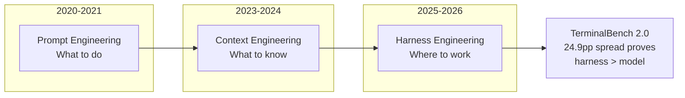
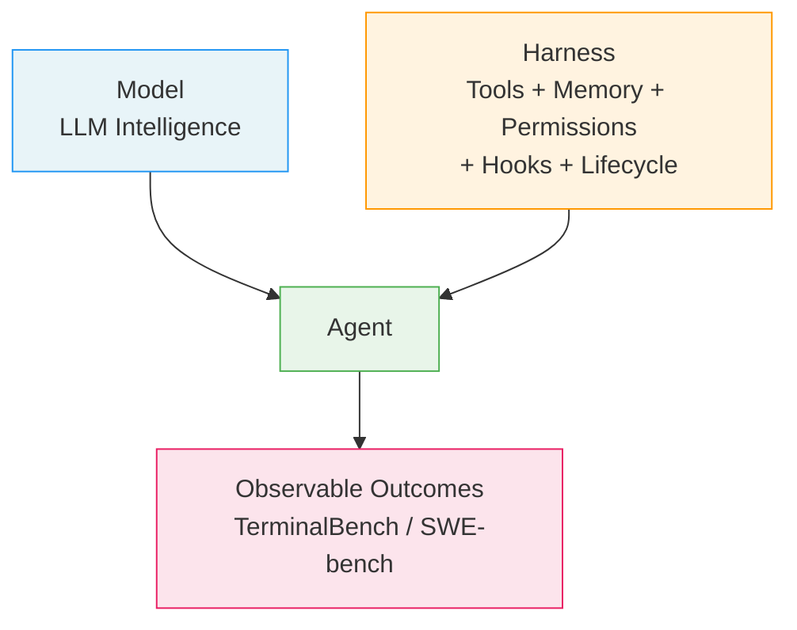
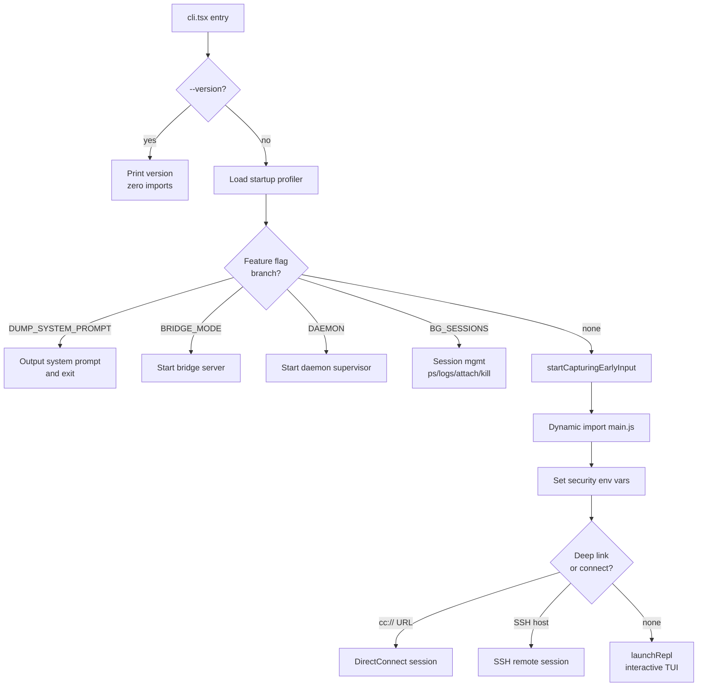

# Why This Book Exists: The Harness Engineering Moment

## Overview

In March 2026, Chaofan Shou discovered that the entire source code of Claude Code -- Anthropic's official AI coding CLI -- was sitting in plain sight on the npm registry, embedded in a sourcemap file. The package's `sourcesContent` key held every line of a 4,683-line `main.tsx`, 40-plus agent tools, and a multi-agent orchestration system never intended for public eyes (`README.md:L29-L35`). That leak is this book's origin. Not because the leak itself matters, but because the code it revealed matters.

Claude Code (hereafter "cc") is the most mature public example of a long-running agent harness -- the engineering layer around a large language model that provides tools, memory, permissions, hooks, and lifecycle management. The Harness Engineering Report (HER) formalizes the discipline with a single equation: Agent = Model + Harness (HER section 1). A horse possesses strength but requires a harness to direct that power toward useful work; an LLM has intelligence but needs tools, memory systems, state management, guardrails, and orchestration to function reliably in production.

This book's thesis is two-fold. First, cc is the reference implementation for harness engineering -- a production-grade, long-running agent that has been battle-tested across millions of sessions. Second, the patterns encoded in cc are a template for building trustworthy autonomous systems more broadly. Every design decision in the source -- from the ablation baseline inlined at module entry to the five-stage compaction hierarchy -- is a solved problem that other harness builders will encounter and can learn from.

The discipline itself has been building for years. HER section 2 traces an evolution from prompt engineering (2020-2021, "talking to the AI") through context engineering (2023-2024, "feeding the AI") to harness engineering (2025-2026, "housing the AI"). These are nested layers, not sequential eras. Harness engineering encompasses context engineering, which encompasses prompt engineering. Each layer adds scope without eliminating the previous. Prompts tell the model what to do; context gives the model what to know; harnesses give the model where to work. The DevOps lineage is direct: execution environments map to CI runners, tool definitions map to API design, control loops map to health checks, and guardrails map to IAM policies (HER section 2). Harness engineering is DevOps applied to a new workload type, not an entirely novel field.

The urgency is empirical. TerminalBench 2.0 demonstrated that the same model -- Claude Opus 4.6 -- ranked first in one harness (Pilot/QuantFlow, 82.9% accuracy) but fortieth in another (Claude Code/Anthropic, 58.0%), a 24.9 percentage-point spread across 124 leaderboard entries (HER section 17). On SWE-bench Verified, Augment Code, Cursor, and Claude Code all ran the same model but scored 17 problems apart. Same model, different harness, different results. Harness design matters more than model selection for production reliability.



This book exists because no public resource makes the architecture of a production harness legible. Tutorials teach prompt engineering. Frameworks abstract away harness decisions. Benchmarks measure models, not the systems that deploy them. The cc source code, now public, is a 4,683-line answer to the question of what a production harness actually does -- from the first side-effect import to the last REPL render.



## Data structures and contracts

The harness's entry point declares its contracts before any code executes. In `cli.tsx`, environment variables and feature gates configure the ablation baseline at module-evaluation time -- before the `main()` function runs -- because downstream modules capture these values into module-level constants at import time.

```
// src/entrypoints/cli.tsx:L16-L26 — Harness-science L0 ablation baseline
// Harness-science L0 ablation baseline. Inlined here (not init.ts) because
// BashTool/AgentTool/PowerShellTool capture DISABLE_BACKGROUND_TASKS into
// module-level consts at import time — init() runs too late. feature() gate
// DCEs this entire block from external builds.
// eslint-disable-next-line custom-rules/no-top-level-side-effects, custom-rules/no-process-env-top-level
if (feature('ABLATION_BASELINE') && process.env.CLAUDE_CODE_ABLATION_BASELINE) {
  for (const k of ['CLAUDE_CODE_SIMPLE', 'CLAUDE_CODE_DISABLE_THINKING', 'DISABLE_INTERLEAVED_THINKING', 'DISABLE_COMPACT', 'DISABLE_AUTO_COMPACT', 'CLAUDE_CODE_DISABLE_AUTO_MEMORY', 'CLAUDE_CODE_DISABLE_BACKGROUND_TASKS']) {
    // eslint-disable-next-line custom-rules/no-top-level-side-effects, custom-rules/no-process-env-top-level
    process.env[k] ??= '1';
  }
}
```

The `feature('ABLATION_BASELINE')` gate and the `process.env[k] ??= '1'` assignment are instructive. The `??=` operator ensures that each flag is set only when not already defined, allowing per-flag overrides. The `feature()` call is eliminated at build time via dead code elimination (DCE) for external builds, meaning the entire ablation infrastructure is stripped from the published npm package. This is a harness engineering pattern: deterministic, reproducible baselines gated behind feature flags that vanish in production.

In the main module, the type contracts for session connection states are declared before the `main()` function:

```
// src/main.tsx:L543-L552 — PendingConnect type and feature-gated initialization
type PendingConnect = {
  url: string | undefined;
  authToken: string | undefined;
  dangerouslySkipPermissions: boolean;
};
const _pendingConnect: PendingConnect | undefined = feature('DIRECT_CONNECT') ? {
  url: undefined,
  authToken: undefined,
  dangerouslySkipPermissions: false
} : undefined;
```

The `PendingConnect` type defines the contract for a remote session: a URL, an authentication token, and a permissions override. The `feature('DIRECT_CONNECT')` gate means the entire connection state is `undefined` in builds where the feature is disabled. This is not a runtime check; it is a compile-time elimination. The type system itself encodes the feature gate: `PendingConnect | undefined` makes it impossible to access connection state without first proving the feature is active.

The `ToolInputJSONSchema` type imported at `src/main.tsx:L44` is the contract between the harness and every tool it registers. Tools are not ad-hoc functions; they are typed, validated operations defined by a Zod or JSON Schema input schema, a `call()` method, concurrency flags, and deferral status (terminology registry: "tool"). The harness dispatches them through a tool execution pipeline, not by direct invocation. This contract is enforced at the boundary between the model and the environment: when the model requests a tool call, the harness validates the input against the schema before executing, and when the tool returns, the harness applies observation masking (terminology registry: "observation masking") to control what the model sees of the result.

The session-level state types extend this contract system. The `TeammateOptions` type at `src/main.tsx:L4657-L4666` defines the contract for multi-agent collaboration:

```
// src/main.tsx:L4657-L4666 — TeammateOptions contract for swarm coordination
type TeammateOptions = {
  agentId?: string;
  agentName?: string;
  teamName?: string;
  agentColor?: string;
  planModeRequired?: boolean;
  parentSessionId?: string;
  teammateMode?: 'auto' | 'tmux' | 'in-process';
  agentType?: string;
};
```

The `teammateMode` field is a discriminated union with three variants: `'auto'` lets the harness choose the execution backend, `'tmux'` isolates each agent in a separate terminal session, and `'in-process'` runs agents as lightweight coroutines within the same Node.js process. The `parentSessionId` creates a lineage chain that enables the harness to trace any agent's ancestry back to the root session. The `agentColor` field is not cosmetic; it is used by the Ink rendering layer to distinguish overlapping tool calls in the terminal UI, making concurrent agent activity visually parseable.

## Control flow

The boot sequence of cc is a branching tree of fast paths, each designed to minimize module evaluation for specialized entry points. The root is `cli.tsx`, which either handles a fast path directly or defers to the full `main()` function in `main.tsx`.

```
// src/entrypoints/cli.tsx:L28-L42 — Bootstrap entrypoint with --version fast path
/**
 * Bootstrap entrypoint - checks for special flags before loading the full CLI.
 * All imports are dynamic to minimize module evaluation for fast paths.
 * Fast-path for --version has zero imports beyond this file.
 */
async function main(): Promise<void> {
  const args = process.argv.slice(2);

  // Fast-path for --version/-v: zero module loading needed
  if (args.length === 1 && (args[0] === '--version' || args[0] === '-v' || args[0] === '-V')) {
    // MACRO.VERSION is inlined at build time
    // biome-ignore lint/suspicious/noConsole:: intentional console output
    console.log(`${MACRO.VERSION} (Claude Code)`);
    return;
  }
```

The `--version` fast path has zero dynamic imports beyond the `cli.tsx` file itself. The `MACRO.VERSION` constant is inlined at build time, so no module resolution occurs. This is a design principle: the harness must boot fast for common operations, and the way to achieve that is to make fast paths genuinely zero-cost by eliminating all dynamic imports.

When no fast path matches, `cli.tsx` hands off to the full `main()` export:

```
// src/entrypoints/cli.tsx:L287-L299 — Fallback to full CLI with early input capture
// No special flags detected, load and run the full CLI
const {
  startCapturingEarlyInput
} = await import('../utils/earlyInput.js');
startCapturingEarlyInput();
profileCheckpoint('cli_before_main_import');
const {
  main: cliMain
} = await import('../main.js');
profileCheckpoint('cli_after_main_import');
await cliMain();
profileCheckpoint('cli_after_main_complete');
```

Before loading `main.js`, the harness starts capturing early input via `startCapturingEarlyInput()`. This is a user-experience optimization: the user may start typing before the full CLI is loaded, and the harness buffers that input so it is not lost. The `profileCheckpoint()` calls bracket every major transition, providing a nanosecond-resolution startup profile that is essential for performance regression testing.

The full `main()` function in `src/main.tsx:L585` continues this pattern. It sets security environment variables before any command execution (`src/main.tsx:L591`), initializes the warning handler (`src/main.tsx:L594`), and then processes deep link URIs, direct connect URLs, and SSH sessions before ever reaching the interactive REPL. Each branch is a separate session mode, and each mode loads only the modules it needs.



The REPL launch at `src/main.tsx:L3134` is the culminating step of the interactive path. The `launchRepl()` function receives the Ink root component, session statistics, the initial app state, and a session configuration object that includes the tool list, message history, MCP clients, and the agent definition. The REPL is not a simple read-eval-print loop; it is a React-based terminal UI managed by Ink, rendering streaming model responses, tool call approvals, and agent status in real time.

The session-continuation path at `src/main.tsx:L3101-L3155` demonstrates the control flow for resuming an existing conversation. The `--continue` flag triggers `loadConversationForResume()`, which locates the most recent session transcript, deserializes it through `processResumedConversation()`, and reconstructs the agent state -- including the agent definition, message history, file history snapshots, and content replacements. The `clearSessionCaches()` call at `src/main.tsx:L3110` ensures that stale file and skill caches from the previous session do not contaminate the resumed one. This is a harness engineering pattern: the harness must maintain session continuity across interruptions while ensuring that resumed state is fresh enough to reflect the current filesystem.

The `run()` function at `src/main.tsx:L884` constructs the Commander.js program and registers a `preAction` hook that performs all initialization -- including MDM settings, analytics sinks, migrations, and remote settings -- only when a command is actually executing, not when help is displayed. The `profileCheckpoint('run_function_start')` call at `src/main.tsx:L885` and the subsequent `profileCheckpoint('run_commander_initialized')` at `src/main.tsx:L903` bracket the Commander setup, enabling precise measurement of how long the CLI framework itself takes to initialize.

## Edge cases and failure modes

The ablation baseline at `src/entrypoints/cli.tsx:L21-L26` is itself an edge-case handler. It exists because the harness team needed a way to measure the contribution of each subsystem -- thinking, compaction, auto-memory, background tasks -- to overall agent performance. The `ABLATION_BASELINE` feature flag strips every optional subsystem down to its minimum, producing an L0 baseline against which incremental improvements can be measured. This is the harness engineering equivalent of a controlled experiment: remove one variable at a time and measure the delta.

The `PendingConnect` type at `src/main.tsx:L543-L547` encodes a failure mode directly into the type system. When `feature('DIRECT_CONNECT')` is false, `_pendingConnect` is `undefined`, and every code path that tries to use it will fail at compile time rather than at runtime. This prevents an entire class of bugs -- accessing remote-connection state in a build that does not support remote connections.

The TerminalBench 2.0 results (HER section 17) expose a more fundamental failure mode: the same model producing a 24.9 percentage-point accuracy spread depending on harness quality. This is not a model failure; it is a harness failure. The model's intelligence is constant across harnesses. The harness determines whether that intelligence is translated into correct action or wasted on context bloat, tool misuse, or permission deadlocks. The implication for harness builders is that model benchmarks tell you about the model, but production benchmarks tell you about the harness. The two are not interchangeable.

The `profileCheckpoint` calls scattered throughout `src/main.tsx` (over 25 distinct checkpoints, beginning at line 12) are not debugging scaffolding; they are a production observability mechanism. Each checkpoint records a nanosecond timestamp in a ring buffer. When a session crashes or hangs, the checkpoint log reveals exactly where in the boot sequence the failure occurred, without requiring the user to reproduce the issue. This is a harness engineering principle: the harness must be observable even when the model cannot assist.

The `--dump-system-prompt` fast path at `src/entrypoints/cli.tsx:L53-L71` reveals another edge case: the need to extract the exact system prompt at a specific commit for prompt sensitivity evaluations. The `feature('DUMP_SYSTEM_PROMPT')` gate eliminates this path from external builds, and the `enableConfigs()` call followed by `getSystemPrompt([], model)` renders the prompt for a given model without ever launching the REPL. This is a testing harness within the harness: a mechanism for evaluating the harness itself.

The `REMOTE` heap configuration at `src/entrypoints/cli.tsx:L9-L14` handles the case where cc runs inside a container with 16 GB of memory. The `--max-old-space-size=8192` flag caps the Node.js heap at 8 GB, leaving the other half for child processes, tool execution, and the model's streaming buffers. Without this cap, the Node.js garbage collector would eventually consume all available memory, causing OOM kills that are difficult to diagnose in headless environments. The `CLAUDE_CODE_REMOTE` environment variable check is the only place in the entry point where the harness adapts its runtime behavior based on deployment environment, and it runs before any module imports.

## Where cc diverges from the published pattern

The HER section 1 equation -- Agent = Model + Harness -- is presented as a clean decomposition. The cc source code reveals it to be recursive. The harness itself contains model calls: the coordinator mode at `src/main.tsx:L76` invokes a separate agent for swarm orchestration; the auto-dream service described in the README runs as a background subagent that consolidates memory; the ULTRAPLAN system offloads complex tasks to a remote Opus 4.6 session (`README.md:L69`). The harness is not a passive shell around the model; it is an active system that spawns additional models, evaluates their outputs, and routes their results.

The HER section 2 evolutionary model -- prompt engineering, context engineering, harness engineering as nested layers -- implies a clean separation of concerns. In cc, the boundaries are porous. The system prompt is assembled dynamically based on the tool catalog, the permission mode, and the agent definition. Context engineering (what information the model receives) is governed by the harness's compaction pipeline, which includes five stages: history_snip, microcompact, context collapse, autocompact, and hard reset (terminology registry). The harness does not merely provide a workspace; it actively shapes what the model sees.

The `feature()` function used throughout `src/entrypoints/cli.tsx` and `src/main.tsx` is not a standard feature flag system. It is a build-time macro that enables dead code elimination. When `feature('ABLATION_BASELINE')` evaluates to false at build time, the entire ablation block is removed from the output bundle. This means the published npm package does not contain ablation code, bridge code, daemon code, or any of the dozen feature-gated fast paths. The harness that users interact with is a subset of the harness that developers maintain. This is a divergence from the standard DevOps model (HER section 2), where feature flags are runtime toggles. In cc, feature flags are compile-time erasures.

The README's description of cc as a "785KB main.tsx" (`README.md:L46`) understates the complexity. The file is 4,683 lines long and imports over 130 modules in its first 200 lines alone (`src/main.tsx:L1-L200`). The harness is not a single entry point; it is a directed acyclic graph of imports, each with side effects that must execute in a specific order. The comments at `src/main.tsx:L1-L8` make this explicit: side-effect imports for `profileCheckpoint`, `startMdmRawRead`, and `startKeychainPrefetch` must run before all other imports because they fire subprocesses in parallel with the remaining module evaluation. The `startMdmRawRead` call launches `plutil` on macOS and `reg query` on Windows to read MDM (Mobile Device Management) policies; these subprocesses take ~135ms, and running them in parallel with module evaluation reduces the total boot time by that amount. The `startKeychainPrefetch` call reads OAuth tokens and legacy API keys from the macOS keychain, which otherwise would block sequentially for ~65ms on every startup. These are not optimizations bolted on after the fact; they are architectural constraints baked into the import order.

The README also documents the undercover mode at `src/utils/undercover.ts` (`README.md:L55-L58`), which prevents the model from revealing internal information when Anthropic employees use cc to contribute to public repositories. This confirms a principle that the HER does not address: a production harness must be able to modify its own behavior based on the identity of its operator, not the content of their request. The undercover mode does not change the model's capabilities; it changes the harness's guides (terminology registry: "guide") -- the system prompts and permission rules that constrain the model's output.

## Developer takeaways for building a long-running agent

Building a long-running agent harness requires solving problems that do not exist in request-response LLM applications. The harness must boot deterministically and quickly, which means fast paths with zero module loading and feature-gated code elimination. It must capture user input before the full UI is ready, because latency perception begins at keystroke, not at render. It must encode feature availability into the type system so that impossible states are unrepresentable at compile time, not caught at runtime. It must observe itself through structured profiling checkpoints that survive crashes. It must treat the model as a component, not a black box, and accept that the harness itself will spawn additional model calls for orchestration, evaluation, and memory consolidation. The TerminalBench 24.9-point spread proves that these engineering decisions dominate model selection in production. The cc source code is a working demonstration that a harness can be simultaneously complex and reliable, provided the complexity is managed through explicit contracts, compile-time guarantees, and observability built into every layer.
