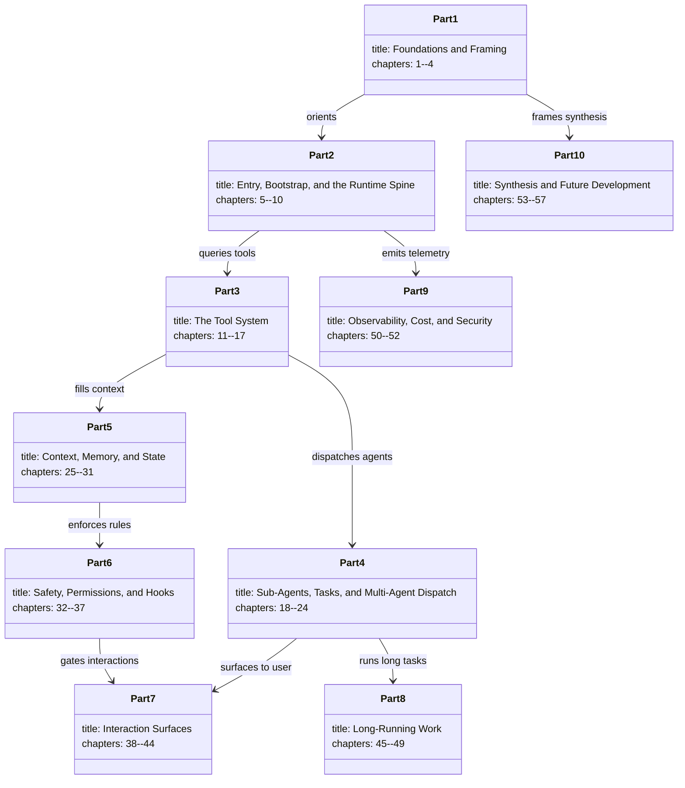

# Book Architecture, Reading Paths, and Citation Conventions

## Overview

This chapter is the map room. It defines the contract between the book and the reader: how chapters are structured, how source files are cited, which diagram types appear and what their visual grammar means, and how the three indices from the Harness Engineering Report (HER) -- the 12 agentic patterns (HER §5), the 17 failure modes (HER §6), and the 12 best practices (HER §20) -- thread through the 57 chapters that follow. Return here whenever the notation feels unfamiliar.

The book is organized into 10 parts, 57 chapters, and a back matter containing a glossary, bibliography, and concordance. Each chapter covers one cohesive subsystem or cross-cutting concern inside the cc codebase. The codebase itself is a TypeScript/Bun/React/Ink CLI application whose entry point is described in `README.md`:

```text
src/
├── main.tsx                 # CLI Entrypoint (Commander.js + React/Ink)
├── QueryEngine.ts           # Core LLM logic
├── Tool.ts                  # Base tool definitions
├── tools/                   # 40+ Agent tools (Bash, Files, LSP, Web)
├── services/                # Backend (MCP, OAuth, Analytics, Dreams)
├── coordinator/             # Multi-agent orchestration (Swarm)
├── bridge/                  # IDE Integration layer
└── buddy/                   # The secret Tamagotchi system
```

This directory tree, documented at `README.md:L75-L85`, is the physical territory the book traverses. Part 1 orients you. Part 2 walks the runtime spine. Part 3 opens the tool catalog. Part 4 descends into multi-agent dispatch. Part 5 tackles context, memory, and state. Part 6 enforces safety. Part 7 covers interaction surfaces. Part 8 handles long-running work. Part 9 observes and secures. Part 10 synthesizes.

## Data structures and contracts

### Chapter format

Every chapter follows the same six-section skeleton:

1. **Overview** -- what the chapter covers and why it matters.
2. **Data structures and contracts** -- types, interfaces, schemas, invariants. The structural contract of the subsystem.
3. **Control flow** -- how execution moves through the code. Sequence matters here.
4. **Edge cases and failure modes** -- what breaks, what degrades, what the harness defends against.
5. **Where cc diverges from the published pattern** -- cc is a production system, not a textbook. It makes tradeoffs.
6. **Developer takeaways for building a long-running agent** -- a prose paragraph of 150--300 words distilling practical lessons.

This skeleton is itself a harness pattern: it forces each chapter to address structure, behavior, failure, divergence, and takeaway -- the five dimensions that matter when you are building a system that must stay running for hours.

### Citation format

Every factual claim about the cc codebase is cited with a line-number-precise path in backticks:

- Single line: `` `src/path/to/file.ts:L42` ``
- Range: `` `src/path/to/file.ts:L100-L120` ``

Citations appear inline, never in footnotes. The reader should be able to open the cited file at the cited line and verify the claim. This book was written against repository commit `a371abbe75ffa0d0a3c92290e2bbf56a7ef54367` (recorded in `.book-build/manifest.json`). If the file has moved or the lines have shifted, check that SHA first.

HER references use section numbers: "HER §5" refers to section 5 of the Harness Engineering Report, "HER §6.8" refers to subsection 8 of section 6, and so on. The HER is the external analytical framework; cc's source code is the primary evidence. When the two disagree, the source code wins.

### Diagram types

The book uses exactly five Mermaid diagram types:

| Diagram type | Used for |
|---|---|
| `flowchart` | Decision trees, pipelines, data flow |
| `sequenceDiagram` | Temporal interactions between actors |
| `stateDiagram-v2` | State machines and phase transitions |
| `classDiagram` | Type hierarchies, structural relationships |
| `erDiagram` | Storage layout, entity relationships |

Each diagram is a fenced ` ```mermaid ` block. Diagrams are not decorative; they convey information that prose alone would distort or flatten. When a diagram and prose conflict, trust the diagram -- it was derived directly from the source.

### Terminology

The book maintains an authoritative terminology registry at `.book-build/terminology.json`. Key terms used throughout:

- **harness**: The engineering layer around an LLM that provides tools, memory, permissions, hooks, and lifecycle management. The pattern: Agent = Model + Harness.
- **tool**: A typed, validated operation the agent can invoke. Defined by a Zod/JSONSchema input schema, a `call()` method, concurrency flags, and deferral status.
- **subagent**: A single-use agent invoked by the parent session via the Agent tool; has a fresh context; returns one result; does not persist across dispatches.
- **compaction**: The process of reducing conversation context size to stay within token limits. The five-stage hierarchy: history_snip -> microcompact -> context collapse -> autocompact -> hard reset.
- **session**: A single invocation of the cc agent, from entry through exit. Stored as JSONL.

When this book uses these terms, it uses them with these exact definitions. The glossary in the back matter expands on all entries from the terminology registry.

### Book parts and dependencies

The 10 parts have a dependency structure. Parts 1 through 3 are foundational: you must understand the entry point, the query loop, and the tool contract before the rest makes sense. Parts 4 through 6 build upward from that foundation. Parts 7 through 9 are cross-cutting. Part 10 is synthesis.



## Control flow

### Reading paths

There are three ways to read this book, and the right one depends on what you are trying to accomplish.

**Linear path (chapters 1 through 57).** Start at the beginning and read through. This path mirrors the dependency graph: each chapter assumes familiarity with the chapters before it. A first-time reader who intends to understand the entire system should take this path.

**Subsystem-focused path.** If you need to understand one specific subsystem, you can enter at the part boundary. The entry points are:

| If you care about | Read these chapters |
|---|---|
| How the agent starts and runs | 5, 6, 7 (Part 2 core) |
| How tools work | 11, 12, then any tool chapter (13--17) |
| Multi-agent orchestration | 18, 19, 21, 22 (Part 4 core) |
| Memory and compaction | 25, 26, 27, 28 (Part 5 core) |
| Permissions and safety | 32, 33, 35, 36 (Part 6 core) |
| MCP and skills | 38, 40, 41 (Part 7 subset) |
| Long-running patterns | 45, 46, 47 (Part 8 core) |

When entering mid-book, read Chapter 1 (the framing chapter) and Chapter 3 (the repository tour) first. They provide the vocabulary and the map.

**Pattern-focused path.** If you are building your own harness and want to trace a specific HER pattern through cc's implementation, use the cross-reference table below. Each row maps a pattern to the chapter(s) where its cc implementation is analyzed in depth.

### HER pattern cross-reference

HER §5 defines 12 agentic harness patterns. The following flowchart maps each pattern to the chapter number(s) where it receives primary treatment:

```mermaid
flowchart TD
    P1["Pattern 1: Persistent Instruction File"] --> C9["Ch 9: System Prompts"]
    P2["Pattern 2: Scoped Context Assembly"] --> C9b["Ch 9: System Prompts"]
    P2 --> C31["Ch 31: Settings Cascade"]
    P3["Pattern 3: Tiered Memory"] --> C26["Ch 26: Memdir"]
    P3 --> C27["Ch 27: Session Memory"]
    P4["Pattern 4: Dream Consolidation"] --> C24["Ch 24: Dream Tasks"]
    P5["Pattern 5: Progressive Context Compaction"] --> C28["Ch 28: Compaction Hierarchy"]
    P5 --> C25["Ch 25: Messages"]
    P6["Pattern 6: Explore-Plan-Act Loop"] --> C7["Ch 7: Query Loop"]
    P6 --> C45["Ch 45: Plan Mode V2"]
    P7["Pattern 7: Context-Isolated Subagents"] --> C18["Ch 18: Agent Tool"]
    P7 --> C19["Ch 19: Execution Modes"]
    P8["Pattern 8: Fork-Join Parallelism"] --> C19b["Ch 19: Execution Modes"]
    P8 --> C46["Ch 46: Worktrees"]
    P9["Pattern 9: Progressive Tool Expansion"] --> C15["Ch 15: Search and LSP Tools"]
    P9 --> C41["Ch 41: MCP Tools"]
    P10["Pattern 10: Command Risk Classification"] --> C14["Ch 14: Bash Tool"]
    P10 --> C33["Ch 33: Bash Classifier"]
    P11["Pattern 11: Single-Purpose Tool Design"] --> C11["Ch 11: Tool Anatomy"]
    P11 --> C13["Ch 13: File System Tools"]
    P12["Pattern 12: Deterministic Lifecycle Hooks"] --> C36["Ch 36: Hook Schema"]
    P12 --> C37["Ch 37: Hook Execution"]

    style P1 fill:#e8f4fd,stroke:#2196f3
    style P2 fill:#e8f4fd,stroke:#2196f3
    style P3 fill:#e8f4fd,stroke:#2196f3
    style P4 fill:#e8f4fd,stroke:#2196f3
    style P5 fill:#e8f4fd,stroke:#2196f3
    style P6 fill:#fff3e0,stroke:#ff9800
    style P7 fill:#fff3e0,stroke:#ff9800
    style P8 fill:#fff3e0,stroke:#ff9800
    style P9 fill:#fce4ec,stroke:#e91e63
    style P10 fill:#fce4ec,stroke:#e91e63
    style P11 fill:#fce4ec,stroke:#e91e63
    style P12 fill:#fce4ec,stroke:#e91e63
```



Patterns are color-coded by their HER §5 grouping: blue for Memory and Context (patterns 1--5), orange for Workflow and Orchestration (patterns 6--8), and pink for Tools and Permissions (patterns 9--11) plus Automation (pattern 12).

### HER failure mode cross-reference

HER §6 catalogs 17 failure modes. The following table maps each failure mode to the chapter(s) where cc's defense (or lack thereof) is analyzed:

| Failure mode | Symptom (abbreviated) | Primary chapter(s) |
|---|---|---|
| 6.1 Context Rot | Performance degrades when content falls in mid-window | 7, 25, 28 |
| 6.2 Premature Completion | Agent declares work done too early | 7, 17 |
| 6.3 Self-Evaluation Bias | Agent rates own work too generously | 21, 27 |
| 6.4 Placeholder Implementations | Agents default to stubs | 13 |
| 6.5 Context Anxiety | Premature wrap-up near context limits | 19, 28 |
| 6.6 Silent Failures | Agent proceeds after tool errors | 12, 51 |
| 6.7 Infinite Loops | Retry without progress | 7, 10 |
| 6.8 Tool Explosion | Too many tools degrade selection | 12, 15, 41 |
| 6.9 Compounding Bugs Across Sessions | New session builds on broken state | 22, 29 |
| 6.10 Yak Shaving / Scope Creep | Agent wanders into tangential fixes | 7, 17 |
| 6.11 Cost Explosion / Runaway Spending | Infinite loops rack up costs | 10, 50 |
| 6.12 Hallucinated Tool Calls | Agent fabricates tool parameters | 12, 16 |
| 6.13 Security Vulnerabilities / Prompt Injection | Malicious content manipulates behavior | 32, 52 |
| 6.14 Model Regression from Provider Updates | Harness breaks silently on model updates | 8 |
| 6.15 Data Leakage Between Contexts | Information leaks between sessions | 13, 40 |
| 6.16 Checkpoint-Restore Side Effects | Agents re-synthesize different requests after restore | 29, 48 |
| 6.17 Goal Misinterpretation / Specification Gaming | Agent optimizes for proxy metrics | 7, 17 |

Full treatment of all 17 failure modes appears in Chapter 54.

### HER best practices cross-reference

HER §20 synthesizes 12 core principles. Each principle surfaces across multiple chapters:

1. **Context windows are the constraint; structured artifacts are the solution.** -- Chapters 9, 25, 28
2. **Separate generation from evaluation.** -- Chapters 21, 27
3. **One task per session.** -- Chapters 7, 22
4. **Verify before building.** -- Chapters 5, 22
5. **Wire in fast feedback loops.** -- Chapters 12, 14
6. **Repository is single source of truth.** -- Chapters 13, 29
7. **Humans steer, agents execute.** -- Chapters 17, 32, 45
8. **Expect eventual consistency.** -- Chapters 28, 47
9. **Simplify relentlessly.** -- Chapters 11, 53
10. **Control costs actively.** -- Chapters 10, 50
11. **Observe everything.** -- Chapters 50, 51
12. **Secure by default.** -- Chapters 32, 52

## Edge cases and failure modes

### Citation drift

The cc codebase is not a static artifact. Lines shift between commits. This book was built against the SHA recorded in `.book-build/manifest.json`. If you are reading against a different commit, citations may point to the wrong line. The `loc-hints/files.json` file in the build directory records per-file line-count snapshots that can help re-anchor citations after a diff.

### Missing source files

The manifest records several source files that are absent from the leaked codebase: `package.json`, `tsconfig.json`, `bunfig.toml`, `src/types/message.ts`, `src/services/compact/reactiveCompact.ts`, and others. Chapters that cite these files do so from the available partial evidence and flag the gap explicitly. When a chapter cannot verify a claim because the source file is missing, it says so rather than fabricating a line reference.

### Diagram ambiguity

Mermaid diagrams are rendered by the reader's toolchain. Some Mermaid renderers handle the `classDiagram` syntax differently when association labels contain spaces. All labels in this book use single-word or hyphenated identifiers to minimize rendering divergence. When a diagram contains a `stateDiagram-v2` with composite states, the inner states are indented with four spaces -- the minimum that all major renderers accept.

### HER-to-cc mapping is not one-to-one

The 12 patterns, 17 failure modes, and 12 best practices from the HER were derived by reverse-engineering cc and other agentic systems. The mapping from HER concepts to cc chapters is many-to-many. Pattern 5 (Progressive Context Compaction), for instance, spans Chapters 25, 28, and 7. Failure mode 6.1 (Context Rot) appears in Chapters 7, 25, and 28. The cross-reference tables above capture these overlaps, but a reader tracking a single pattern should expect to cross chapter boundaries.

## Where cc diverges from the published pattern

The HER presents the 12 patterns as clean, composable abstractions. cc's implementation diverges in several ways that matter for readers who intend to build on top of these patterns rather than study them in theory.

**Patterns are entangled, not isolated.** Pattern 1 (Persistent Instruction File) and Pattern 2 (Scoped Context Assembly) are presented as distinct patterns in HER §5. In cc's implementation, the `CLAUDE.md` loading logic in `src/utils/claudemd.ts` and the settings cascade in `src/utils/settings/settings.ts` are tightly coupled. The multi-level instruction loading (org -> user -> project -> directory) is both a persistent instruction file and a scoped context assembly. The chapter structure separates them for clarity (Chapter 9 covers prompt assembly; Chapter 31 covers the settings cascade), but the code does not respect that boundary.

**Failure mode coverage is uneven.** HER §6 presents 17 failure modes with equal weight. In cc's codebase, some failure modes have explicit, engineered defenses (6.8 Tool Explosion is addressed by progressive tool expansion; 6.13 Prompt Injection is addressed by the permission model and SSRF guards). Others have no defense beyond general good practice (6.3 Self-Evaluation Bias has no dedicated evaluator agent in the current codebase; 6.14 Model Regression has no regression test suite). Chapter 54 documents these gaps explicitly.

**The Dream system exceeds the pattern.** HER §5 Pattern 4 describes "Dream Consolidation" as a background process that reviews, deduplicates, and prunes memory during idle time. cc's `autoDream` service, located at `src/services/autoDream/`, implements this with 8 phases and 5 compaction types -- a scope that goes well beyond the pattern's description. The README summarizes it concisely:

```text
1. **Orient:** Read `MEMORY.md`.
2. **Gather:** Find new signals from daily logs.
3. **Consolidate:** Update durable memory files.
4. **Prune:** Keep context efficient.
```

This four-step summary at `README.md:L63-L66` understates the implementation, which Chapter 24 unpacks in full.

## Developer takeaways for building a long-running agent

A book about source code is itself a kind of harness -- it constrains what the reader can see and how they navigate it. The structural contract defined here (six-section skeleton, line-precise citations, five diagram types, authoritative terminology) is designed to solve a specific problem: when you are building a system that runs for hours and must be debuggable after the fact, you need every claim traceable to evidence, every term unambiguous, and every architectural decision visible in a diagram. The same principle applies to your own harness. Invest early in a citation-like mechanism -- structured logs with file-and-line anchors, not freeform commentary. Invest early in a terminology registry, because "context" means something different to an LLM researcher than it does to a systems engineer, and both will appear in your codebase. The three reading paths defined above (linear, subsystem-focused, pattern-focused) map to three real user personas: the new team member, the on-call engineer, and the architect evaluating a pattern for adoption. Your harness documentation, whether it lives in code comments or a wiki, should support all three entry points without forcing any one of them as the default. The cross-reference tables that map HER patterns and failure modes to chapters are a model for how you should map your own design documents to implementation modules: make the mapping explicit, make it many-to-many, and keep it under version control alongside the code it describes.
