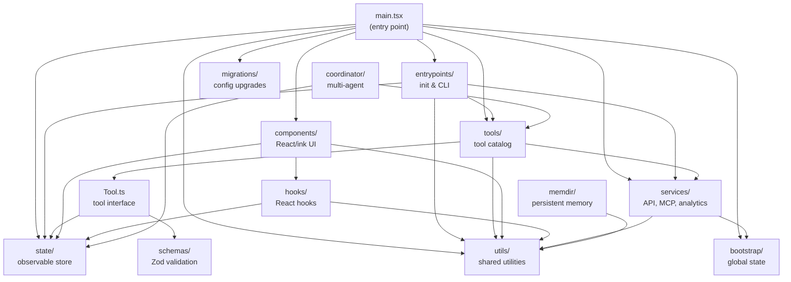
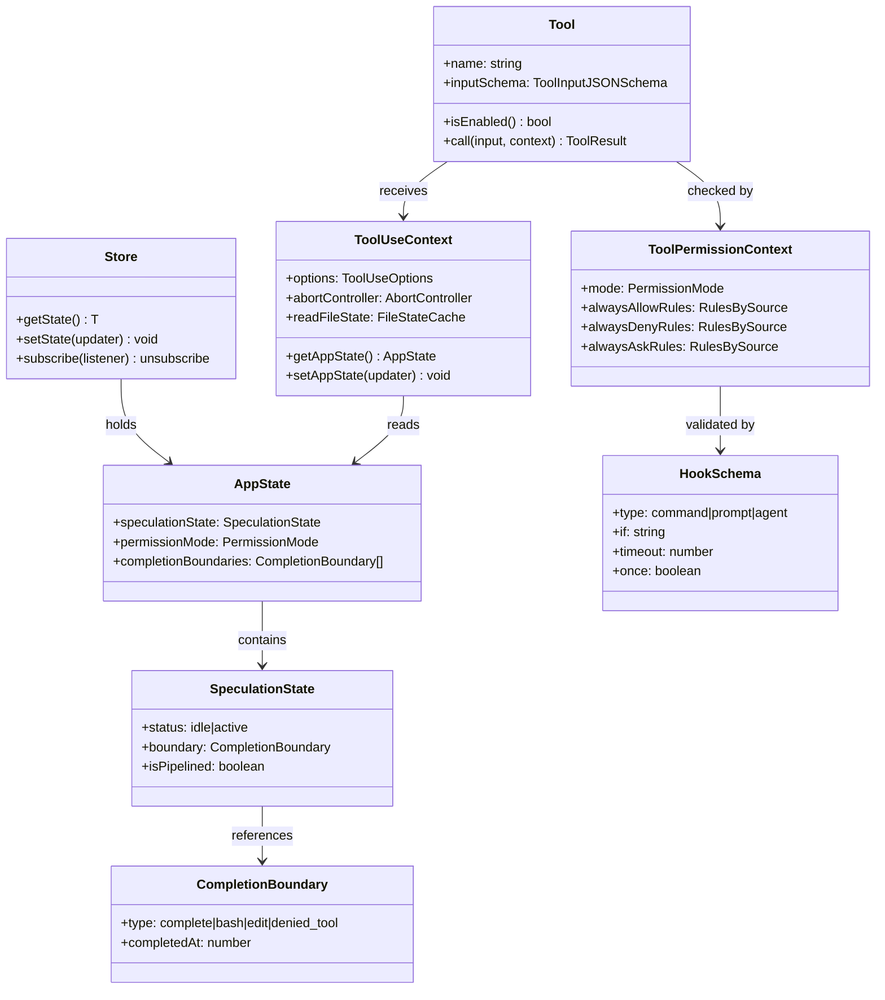
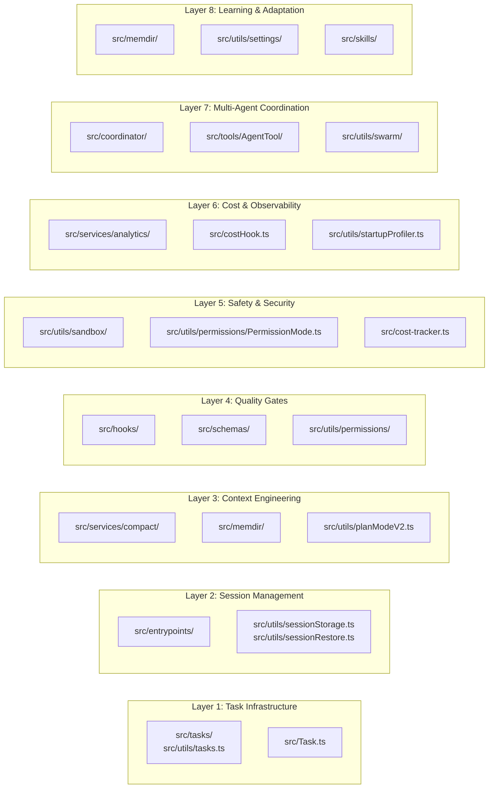

# A Guided Tour of the Repository

## Overview

The cc codebase spans approximately 35 top-level directories under `src/`, each serving a distinct architectural role. At first glance the layout resembles a typical TypeScript CLI project, but the directory boundaries encode hard-won lessons about dependency management, startup performance, and separation of concerns in a long-running agent. This chapter maps every major folder, explains why its contents live where they do, and draws the connections to neighboring modules. The goal is to give you a mental model you can navigate before diving into any single subsystem.

The entry point, `src/main.tsx`, is itself a map. Its first 200 lines of imports reveal the dependency skeleton: startup profilers fire before any other module evaluates; MDM and keychain prefetches run in parallel with the remaining ~135 ms of imports; and a cascade of lazy `require()` calls guards against circular dependencies between the teammate system, the coordinator, and the assistant mode. The import structure is not accidental -- it reflects a deliberate startup ordering protocol that the repository's directory boundaries enforce.

Understanding the directory layout matters because cc is not a typical web application where you can open any file and trace its purpose from its name alone. The `src/utils/` directory alone contains over 300 files. The `src/services/` directory houses 22 subdirectories. The `src/tools/` directory contains 44 subdirectories, each implementing a single tool. Without a map, navigating this landscape is disorienting. This chapter provides that map.

## Data structures and contracts

### The Store

At the heart of cc's runtime sits a minimalist observable store. The entire implementation is 35 lines:

```typescript
// src/state/store.ts:L1-L34 — Minimal observable store powering all app state
type Listener = () => void
type OnChange<T> = (args: { newState: T; oldState: T }) => void

export type Store<T> = {
  getState: () => T
  setState: (updater: (prev: T) => T) => void
  subscribe: (listener: Listener) => () => void
}

export function createStore<T>(
  initialState: T,
  onChange?: OnChange<T>,
): Store<T> {
  let state = initialState
  const listeners = new Set<Listener>()

  return {
    getState: () => state,
    setState: (updater: (prev: T) => T) => void {
      const prev = state
      const next = updater(prev)
      if (Object.is(next, prev)) return
      state = next
      onChange?.({ newState: next, oldState: prev })
      for (const listener of listeners) listener()
    },
    subscribe: (listener: Listener) => {
      listeners.add(listener)
      return () => listeners.delete(listener)
    },
  }
}
```

This is cc's single source of truth for application state. The `setState` function accepts an updater callback (returning a new immutable value), short-circuits on reference equality via `Object.is`, and fans out notifications to all subscribers. The `onChange` callback enables middleware-style side effects such as persistence or telemetry. The store sits in `src/state/` alongside `AppStateStore.ts`, which defines the `AppState` type and its default values, and `onChangeAppState.ts`, which wires reactive side effects. The `src/state/selectors.ts` file provides computed views over the store, while `src/state/teammateViewHelpers.ts` isolates teammate-specific state derivations. This five-file directory is the smallest top-level folder in the codebase, which is appropriate: the store should be the most stable, least-changing module in the system.

### AppState and SpeculationState

The `AppState` type aggregates session-scoped data: cost counters, permission contexts, tool-use tracking, and the speculation subsystem. `src/state/AppStateStore.ts:L41-L78` defines two important derived types:

```typescript
// src/state/AppStateStore.ts:L41-L78 — Completion boundaries and speculation state
export type CompletionBoundary =
  | { type: 'complete'; completedAt: number; outputTokens: number }
  | { type: 'bash'; command: string; completedAt: number }
  | { type: 'edit'; toolName: string; filePath: string; completedAt: number }
  | {
      type: 'denied_tool'
      toolName: string
      detail: string
      completedAt: number
    }

export type SpeculationResult = {
  messages: Message[]
  boundary: CompletionBoundary | null
  timeSavedMs: number
}

export type SpeculationState =
  | { status: 'idle' }
  | {
      status: 'active'
      id: string
      abort: () => void
      startTime: number
      messagesRef: { current: Message[] }
      writtenPathsRef: { current: Set<string> }
      boundary: CompletionBoundary | null
      suggestionLength: number
      toolUseCount: number
      isPipelined: boolean
      contextRef: { current: REPLHookContext }
      pipelinedSuggestion?: {
        text: string
        promptId: 'user_intent' | 'stated_intent'
        generationRequestId: string | null
      } | null
    }
```

`CompletionBoundary` is a discriminated union that tags how a speculation run ends: a normal completion, a bash command execution, a file edit, or a denied tool invocation. `SpeculationState` tracks whether the agent is speculatively predicting the user's next turn. The `isPipelined` flag indicates whether the speculation result can be forwarded to the API without re-processing. Mutable refs (`messagesRef`, `writtenPathsRef`) avoid expensive array spreading per message during high-frequency updates. The `pipelinedSuggestion` field carries an optional pre-generated prompt that can be injected into the next query cycle, saving the round-trip of waiting for the model to re-generate the same text. The `promptId` discriminator distinguishes between suggestions based on the user's raw input versus their stated intent, which matters for telemetry and debugging.

### Bootstrap state

Global mutable configuration that must survive across the store's lifecycle lives in `src/bootstrap/state.ts`. This file accumulates setter/getter pairs for values like `originalCwd`, `mainLoopModelOverride`, and telemetry counters. A comment at line 31 reads "DO NOT ADD MORE STATE HERE -- BE JUDICIOUS WITH GLOBAL STATE," indicating a deliberate constraint: new global state must justify its existence.

```typescript
// src/bootstrap/state.ts:L45-L67 — Subset of bootstrap state shape
type State = {
  originalCwd: string
  projectRoot: string
  totalCostUSD: number
  totalAPIDuration: number
  totalAPIDurationWithoutRetries: number
  totalToolDuration: number
  turnHookDurationMs: number
  turnToolDurationMs: number
  turnClassifierDurationMs: number
  turnToolCount: number
  turnHookCount: number
  turnClassifierCount: number
  startTime: number
  lastInteractionTime: number
  totalLinesAdded: number
  totalLinesRemoved: number
  hasUnknownModelCost: boolean
  cwd: string
  modelUsage: { [modelName: string]: ModelUsage }
  mainLoopModelOverride: ModelSetting | undefined
  initialMainLoopModel: ModelSetting
  modelStrings: ModelStrings | null
  isInteractive: boolean
  kairosActive: boolean
```

The `State` type mixes filesystem identity (`originalCwd`, `projectRoot`) with performance metrics (`totalAPIDuration`, `turnHookDurationMs`) and model configuration (`mainLoopModelOverride`, `modelStrings`). This co-location is intentional: bootstrap state must be readable without importing the full store, which pulls in React and ink dependencies that would break headless/SDK modes. The `src/bootstrap/` directory contains only this one file, making it the smallest directory in the codebase. Its isolation from `src/state/` is architectural: bootstrap state is set once at startup and read everywhere, whereas `AppState` is mutated continuously during a session. The two-state pattern prevents the startup hot path from paying the cost of React rendering that `AppState` subscriptions trigger.

### Tool interface

Every tool the agent can invoke conforms to the `Tool` type defined in `src/Tool.ts`. The first 60 lines of that file define the contract's shape: a `ToolInputJSONSchema` for the model, a `ToolPermissionContext` governing access rules, and a `ToolUseContext` carrying the runtime environment needed for execution.

```typescript
// src/Tool.ts:L15-L21 — Tool input schema contract
export type ToolInputJSONSchema = {
  [x: string]: unknown
  type: 'object'
  properties?: {
    [x: string]: unknown
  }
}
```

```typescript
// src/Tool.ts:L123-L138 — Tool permission context
export type ToolPermissionContext = DeepImmutable<{
  mode: PermissionMode
  additionalWorkingDirectories: Map<string, AdditionalWorkingDirectory>
  alwaysAllowRules: ToolPermissionRulesBySource
  alwaysDenyRules: ToolPermissionRulesBySource
  alwaysAskRules: ToolPermissionRulesBySource
  isBypassPermissionsModeAvailable: boolean
  isAutoModeAvailable?: boolean
  strippedDangerousRules?: ToolPermissionRulesBySource
  shouldAvoidPermissionPrompts?: boolean
  awaitAutomatedChecksBeforeDialog?: boolean
  prePlanMode?: PermissionMode
}>
```

The `ToolPermissionContext` is wrapped in `DeepImmutable` to enforce that tool implementations cannot mutate permission state. The `mode` field holds the active permission mode. The three rule maps (`alwaysAllowRules`, `alwaysDenyRules`, `alwaysAskRules`) are keyed by source (user settings, policy, CLI flags), allowing the permission system to trace why a particular rule exists. The `prePlanMode` field stores the permission mode that was active before the model entered plan mode, so it can be restored on exit. The `shouldAvoidPermissionPrompts` field is critical for background agents that cannot show UI -- when set, permission requests are auto-denied rather than blocking the agent forever.

The `ToolUseContext` at `src/Tool.ts:L158-L219` provides the full runtime environment for tool execution. It carries the abort controller for cancellation, the file state cache for read-before-write checks, references to the app state, and callbacks for notifications and system messages. The `setAppStateForTasks` field is particularly noteworthy: it bypasses the normal `setAppState` function's no-op behavior for async agents, ensuring that background tasks and session hooks can always update the root store regardless of nesting depth.

### Hook schemas

The deterministic lifecycle hook system is defined in `src/schemas/hooks.ts`. Hooks are validated at load time using Zod schemas:

```typescript
// src/schemas/hooks.ts:L32-L65 — Command and prompt hook schemas
const BashCommandHookSchema = z.object({
  type: z.literal('command').describe('Shell command hook type'),
  command: z.string().describe('Shell command to execute'),
  if: IfConditionSchema(),
  shell: z
    .enum(SHELL_TYPES)
    .optional()
    .describe(
      "Shell interpreter. 'bash' uses your $SHELL (bash/zsh/sh); 'powershell' uses pwsh. Defaults to bash.",
    ),
  timeout: z
    .number()
    .positive()
    .optional()
    .describe('Timeout in seconds for this specific command'),
  statusMessage: z
    .string()
    .optional()
    .describe('Custom status message to display in spinner while hook runs'),
  once: z
    .boolean()
    .optional()
    .describe('If true, hook runs once and is removed after execution'),
  async: z
    .boolean()
    .optional()
    .describe('If true, hook runs in background without blocking'),
  asyncRewake: z
    .boolean()
    .optional()
    .describe(
      'If true, hook runs in background and wakes the model on exit code 2 (blocking error). Implies async.',
    ),
})
```

Hooks come in several types: `command` hooks shell out to a process, `prompt` hooks invoke an LLM evaluation, and `agent` hooks dispatch a subagent. The `if` field uses permission rule syntax (e.g., `"Bash(git *)"`) to filter when a hook runs, avoiding unnecessary process spawns. The `once` flag supports one-time setup hooks that self-remove after execution. The `asyncRewake` flag enables a pattern where a background hook can signal the model to re-enter the loop on failure. The `src/schemas/` directory contains only this one file, extracted from `src/utils/settings/types.ts` to break a circular dependency with `src/plugins/schemas.ts`. The extraction follows a pattern visible throughout the codebase: when two modules form a cycle, the shared types move to a third location that both can import.

## Control flow

### Startup sequence

The startup path flows through `src/main.tsx` into `src/entrypoints/init.ts`, then branches depending on the invocation mode (interactive REPL, headless print, SDK, or assistant). The first 20 lines of `src/main.tsx` reveal a performance-oriented startup protocol:

```typescript
// src/main.tsx:L1-L12 — Side-effect imports run before all other module evaluation
// These side-effects must run before all other imports:
// 1. profileCheckpoint marks entry before heavy module evaluation begins
// 2. startMdmRawRead fires MDM subprocesses (plutil/reg query) so they run in
//    parallel with the remaining ~135ms of imports below
// 3. startKeychainPrefetch fires both macOS keychain reads (OAuth + legacy API
//    key) in parallel — isRemoteManagedSettingsEligible() otherwise reads them
//    sequentially via sync spawn inside applySafeConfigEnvironmentVariables()
//    (~65ms on every macOS startup)
import { profileCheckpoint, profileReport } from './utils/startupProfiler.js';

// eslint-disable-next-line custom-rules/no-top-level-side-effects
profileCheckpoint('main_tsx_entry');
import { startMdmRawRead } from './utils/mdm/rawRead.js';

// eslint-disable-next-line custom-rules/no-top-level-side-effects
startMdmRawRead();
```

Three prefetch operations run before any other import resolves: the startup profiler marks the entry point for performance tracing; MDM raw reads fire platform-specific subprocesses for enterprise managed settings; and keychain prefetches start two parallel reads for OAuth tokens and legacy API keys. The comment estimates that without this parallelization, keychain reads add ~65 ms to every macOS startup because `isRemoteManagedSettingsEligible()` reads them sequentially via synchronous spawn. The `eslint-disable` comments for `custom-rules/no-top-level-side-effects` document that these side effects are intentional and necessary; the linter rule exists to prevent accidental side effects in other files.

After imports resolve, the program runs migrations (`src/main.tsx:L326-L352`), then branches into setup dialogs or the REPL. The migration system uses a version counter in the global config file; when the stored version does not match `CURRENT_MIGRATION_VERSION`, all sync migrations run in sequence. Each migration is an idempotent transformation (e.g., `migrateSonnet1mToSonnet45.ts` remaps a deprecated model identifier to its replacement). The `src/migrations/` directory contains 11 migration files, each named after the specific config migration it performs. The naming convention (`migrateXxxToYyy.ts` for model renames, `migrateXxxToSettings.ts` for moves from config to settings, `resetXxx.ts` for default-value corrections) makes the migration history self-documenting.

### The services layer

The `src/services/` directory is the second-largest in the codebase and the most architecturally significant. Its 22 subdirectories fall into four categories: API communication (`api/`, `claudeAiLimits.ts`), external integrations (`mcp/`, `lsp/`, `analytics/`, `oauth/`), infrastructure (`compact/`, `policyLimits/`, `remoteManagedSettings/`, `plugins/`), and agent subsystems (`autoDream/`, `SessionMemory/`, `tips/`, `PromptSuggestion/`).

The `src/services/compact/` subdirectory implements the five-stage compaction hierarchy that keeps the agent's context within token limits. It contains 11 files: `compact.ts` is the orchestrator, `microCompact.ts` implements the second stage (selective removal of low-value messages), `autoCompact.ts` implements the fourth stage (automatic compaction when token usage approaches limits), `timeBasedMCConfig.ts` provides time-based configuration for microcompact thresholds, `apiMicrocompact.ts` handles the API-level compaction protocol, `grouping.ts` groups messages for compaction decisions, `prompt.ts` generates the compaction prompt, `sessionMemoryCompact.ts` handles memory-specific compaction, `compactWarningHook.ts` and `compactWarningState.ts` implement the warning system that alerts the user before compaction occurs, and `postCompactCleanup.ts` runs after compaction to restore consistency. This dense cluster of files in a single directory reflects the complexity of the compaction problem: every stage has different triggers, different policies, and different failure modes.

The `src/services/mcp/` subdirectory implements the Model Context Protocol client system. Its 19 files handle server discovery (`officialRegistry.ts`), configuration parsing (`config.ts`, `normalization.ts`), connection management (`client.ts`, `MCPConnectionManager.tsx`, `InProcessTransport.ts`), authentication (`auth.ts`, `xaaIdpLogin.ts`, `xaa.ts`), channel permissions (`channelPermissions.ts`, `channelAllowlist.ts`), and resource handling (`types.ts`, `utils.ts`). The MCP system is the primary extensibility point for cc: users add MCP servers to extend the tool catalog with domain-specific capabilities. The directory's size reflects the protocol's complexity -- each MCP server is a separate process with its own lifecycle, and cc must manage connection health, timeout handling, and graceful degradation when servers fail.

The `src/services/analytics/` subdirectory contains 9 files implementing the telemetry pipeline. `config.ts` controls whether analytics are enabled, `growthbook.ts` manages feature flag evaluation, `sink.ts` is the event batching and delivery system, `sinkKillswitch.ts` provides an emergency shutoff, `datadog.ts` integrates with Datadog for observability, `firstPartyEventLogger.ts` and `firstPartyEventLoggingExporter.ts` handle first-party event routing, `index.ts` provides the public API, and `metadata.ts` defines event metadata schemas. The analytics system follows a fire-and-forget pattern: events are batched in memory and flushed asynchronously, so telemetry failures never block the agent's main loop.

### The tools layer

The `src/tools/` directory contains 44 subdirectories, each implementing a single tool. This one-directory-per-tool convention makes the tool catalog discoverable: to understand a tool, open its directory and read its index file. Each tool directory typically contains the tool implementation file, a constants file, and possibly subdirectories for complex tools like `AgentTool/` which has an `agentColorManager.ts` for visual differentiation and a `loadAgentsDir.ts` for loading agent definitions from the filesystem.

The tool registration system lives in `src/tools.ts`, which assembles the tool catalog conditionally. The `src/Tool.ts` file defines the `Tool` type and the `ToolUseContext` that every tool receives. This separation means `Tool.ts` can be imported by the state layer and the services layer without pulling in the full tool catalog, which would create circular dependencies.

### Directory dependency graph

The following diagram shows the primary dependency relationships between top-level `src/` directories. Arrows indicate "depends on" direction. The graph reflects the import patterns visible in `src/main.tsx` and the tool registration in `src/tools.ts`.



The graph reveals three important properties. First, `utils/` is a leaf dependency: it imports from no other `src/` directory, making it safe to import from anywhere. Second, the dependency flow is unidirectional from `main.tsx` downward; there are no back-edges from `utils/` or `services/` to `main.tsx`. Third, `components/` and `hooks/` form a UI cluster that depends on `state/` and `utils/` but not on `services/` or `tools/` directly, which means the UI layer can be tested without mocking the API or MCP systems.

### Top-level module class diagram

The following class diagram captures the key types and their relationships across the top-level modules. This is a logical view, not an inheritance hierarchy; cc uses composition over inheritance.



The diagram highlights a key architectural property: `Tool` depends on `ToolUseContext`, which depends on `AppState`, but `AppState` does not depend on `Tool`. This unidirectional dependency means the state layer can evolve independently of the tool catalog. The `ToolPermissionContext` is a separate dependency that flows alongside `ToolUseContext` but serves a different purpose: permission checks happen before tool execution, while the context is available during execution. The `HookSchema` validates the permission rules before they reach the runtime, catching configuration errors at load time rather than at the point of use.

### HER 8-layer architecture mapped onto cc folders

The HER reference architecture defines eight layers that a comprehensive agent harness should implement. No single implementation covers all eight, but cc's directory structure maps onto them in specific ways. The following diagram shows this mapping.



Layer 1 (Task Infrastructure) maps to `src/tasks/` and `src/utils/tasks.ts`, which implement the durable task tracking system with status transitions and blocking relationships. The `src/Task.ts` file at the top level defines the task type interface. Layer 2 (Session Management) maps to `src/entrypoints/` for startup/exit protocols and `src/utils/sessionStorage.ts` for session persistence as JSONL files. Layer 3 (Context Engineering) maps to `src/services/compact/`, which implements the five-stage compaction hierarchy (history_snip, microcompact, context collapse, autocompact, hard reset), and `src/memdir/`, which provides the tiered memory-on-disk system with its `findRelevantMemories.ts`, `memoryScan.ts`, and `memoryTypes.ts` files. Layer 4 (Quality Gates) maps to `src/hooks/` and `src/schemas/`, which implement the deterministic lifecycle hooks (PreToolUse, PostToolUse) with Zod validation. Layer 5 (Safety and Security) maps to `src/utils/sandbox/` for sandboxing, `src/utils/permissions/` for the permission mode system, and `src/cost-tracker.ts` for cost caps. Layer 6 (Cost and Observability) maps to `src/services/analytics/` and `src/utils/startupProfiler.ts`. Layer 7 (Multi-Agent Coordination) maps to `src/coordinator/`, `src/tools/AgentTool/`, and `src/utils/swarm/`. Layer 8 (Learning and Adaptation) maps back to `src/memdir/` for persistent memory, `src/utils/settings/` for configuration persistence, and `src/skills/` for reusable prompt templates.

A notable feature of this mapping is that some directories appear in multiple layers. `src/memdir/` appears in both Layer 3 and Layer 8, and `src/utils/permissions/` appears in both Layer 4 and Layer 5. This overlap is not a mistake; it reflects that the same module serves multiple architectural roles depending on the context in which it is used.

## Edge cases and failure modes

### Circular dependency mitigation

The codebase uses a deliberate pattern to break circular dependencies: lazy `require()` calls wrapped in getter functions. `src/main.tsx:L68-L77` shows this pattern for the teammate system:

```typescript
// src/main.tsx:L68-L77 — Lazy require to avoid circular dependencies
// Lazy require to avoid circular dependency: teammate.ts -> AppState.tsx -> ... -> main.tsx
/* eslint-disable @typescript-eslint/no-require-imports */
const getTeammateUtils = () => require('./utils/teammate.js') as typeof import('./utils/teammate.js');
const getTeammatePromptAddendum = () => require('./utils/swarm/teammatePromptAddendum.js') as typeof import('./utils/swarm/teammatePromptAddendum.js');
const getTeammateModeSnapshot = () => require('./utils/swarm/backends/teammateModeSnapshot.js') as typeof import('./utils/swarm/backends/teammateModeSnapshot.js');
/* eslint-enable @typescript-eslint/no-require-imports */
```

The cycle is `teammate.ts -> AppState.tsx -> ... -> main.tsx -> teammate.ts`. Without the lazy getter, this would cause a runtime `undefined` import at startup. The pattern trades compile-time type safety for runtime correctness; the `as typeof import(...)` cast restores the type without pulling the module into the early evaluation order. A similar pattern appears in `src/tools.ts:L61-L72`, where `TeamCreateTool`, `TeamDeleteTool`, and `SendMessageTool` use lazy getters to break a cycle between the tools catalog and the team/swarm modules.

The `src/schemas/hooks.ts` file provides another circular-dependency solution: physical extraction. The hook schemas originally lived in `src/utils/settings/types.ts`, which created a cycle with `src/plugins/schemas.ts`. The comment at `src/schemas/hooks.ts:L1-L7` explains: "This file contains hook-related schema definitions that were originally in src/utils/settings/types.ts. By extracting them here, we break the circular dependency between settings/types.ts and plugins/schemas.ts. Both files now import from this shared location instead of each other." This extraction pattern is the preferred approach when the shared types are substantial; lazy getters are reserved for cases where the cycle involves runtime behavior rather than just type definitions.

### Dead code elimination for feature-gated modules

Feature-gated modules use a second pattern: conditional `require()` guarded by `feature()` flags. `src/main.tsx:L74-L81` shows two examples:

```typescript
// src/main.tsx:L74-L81 — Dead code elimination for feature-gated modules
// Dead code elimination: conditional import for COORDINATOR_MODE
/* eslint-disable @typescript-eslint/no-require-imports */
const coordinatorModeModule = feature('COORDINATOR_MODE') ? require('./coordinator/coordinatorMode.js') as typeof import('./coordinator/coordinatorMode.js') : null;
/* eslint-enable @typescript-eslint/no-require-imports */
// Dead code elimination: conditional import for KAIROS (assistant mode)
/* eslint-disable @typescript-eslint/no-require-imports */
const assistantModule = feature('KAIROS') ? require('./assistant/index.js') as typeof import('./assistant/index.js') : null;
```

When `feature('COORDINATOR_MODE')` evaluates to false at build time, the bundler can eliminate the `require()` call entirely, preventing the coordinator module from being included in the output bundle. This is critical for the single-file binary distribution, where every byte of dead code inflates the executable. The `null` fallback provides a safe type at call sites that check for the module's existence before using it. The same pattern appears in `src/tools.ts:L106-L135`, where feature gates control the inclusion of `OverflowTestTool`, `CtxInspectTool`, `TerminalCaptureTool`, `WebBrowserTool`, `SnipTool`, `ListPeersTool`, and `WorkflowTool`. Each of these tools lives in its own directory under `src/tools/`, but unless the corresponding feature flag is enabled, the directory's code is never loaded.

### Tool registration and conditional expansion

The tool catalog in `src/tools.ts:L193-L219` assembles the complete list of tools available to the agent, with conditional inclusion based on feature flags and environment:

```typescript
// src/tools.ts:L193-L219 — Tool registration with conditional inclusion
export function getAllBaseTools(): Tools {
  return [
    AgentTool,
    TaskOutputTool,
    BashTool,
    ...(hasEmbeddedSearchTools() ? [] : [GlobTool, GrepTool]),
    ExitPlanModeV2Tool,
    FileReadTool,
    FileEditTool,
    FileWriteTool,
    NotebookEditTool,
    WebFetchTool,
    TodoWriteTool,
    WebSearchTool,
    TaskStopTool,
    AskUserQuestionTool,
    SkillTool,
    EnterPlanModeTool,
    ...(process.env.USER_TYPE === 'ant' ? [ConfigTool] : []),
    ...(process.env.USER_TYPE === 'ant' ? [TungstenTool] : []),
    ...(SuggestBackgroundPRTool ? [SuggestBackgroundPRTool] : []),
    ...(WebBrowserTool ? [WebBrowserTool] : []),
    ...(isTodoV2Enabled()
      ? [TaskCreateTool, TaskGetTool, TaskUpdateTool, TaskListTool]
```

The `hasEmbeddedSearchTools()` check determines whether the bun binary ships with built-in `bfs`/`ugrep` replacements. When they are present, the dedicated `GlobTool` and `GrepTool` are omitted because the shell already aliases `find` and `grep` to the fast implementations. The `process.env.USER_TYPE === 'ant'` guard restricts internal-only tools (`ConfigTool`, `TungstenTool`) to Anthropic-internal builds. The `ToolSearchTool` (registered separately) enables the model to discover and load tools on demand, implementing progressive tool expansion to prevent context bloat from large catalogs. The comment at `src/tools.ts:L191-L192` notes that this list "MUST stay in sync" with a Statsig dynamic config for system prompt caching, adding an operational constraint: any change to the tool catalog must be mirrored in the external configuration.

### Startup profiling and deferred prefetches

The startup path includes a sophisticated profiling system. The `profileCheckpoint` function at `src/main.tsx:L9` marks named points in the startup sequence, and `profileReport` generates a timing report. At `src/main.tsx:L209`, after all imports resolve, another checkpoint fires: `profileCheckpoint('main_tsx_imports_loaded')`. This measures the time spent on module evaluation, which is the dominant cost in a codebase with over 300 source files.

After the REPL renders, the `startDeferredPrefetches()` function at `src/main.tsx:L388` launches background work that is not needed for the first paint but improves responsiveness for the first user interaction: initializing the user cache, fetching system context, loading tips, counting files with ripgrep, and refreshing model capabilities. These prefetches are skipped entirely in bare mode (`--bare`) because scripted `-p` invocations have no "user is typing" window to hide this work in -- running them would be pure overhead on the critical path.

## Where cc diverges from the published pattern

The HER reference architecture prescribes eight layers, and cc implements substantial portions of each, but the mapping is not one-to-one. Three divergences are worth noting.

First, cc collapses Layers 3 (Context Engineering) and 8 (Learning and Adaptation) into shared directories. The `src/memdir/` folder serves both purposes: it implements the tiered memory system that HER assigns to Layer 3 (always-loaded index + on-demand topic files), and it persists progress notes and pattern discoveries that HER assigns to Layer 8. This co-location is pragmatic -- memory compaction and memory persistence are two sides of the same data structure -- but it means the memdir module has two distinct responsibilities with different failure modes and different consistency requirements. The `memoryTypes.ts` file within `src/memdir/` separates these concerns at the type level, defining distinct types for user memory, feedback memory, project memory, and reference memory, but the runtime code that reads and writes these types is interleaved.

Second, cc's Layer 5 (Safety and Security) is split across three directories rather than one cohesive module. Sandbox isolation lives in `src/utils/sandbox/`, permission enforcement lives in `src/utils/permissions/`, and cost caps live in `src/cost-tracker.ts` at the top level. HER prescribes a unified "Safety and Security Infrastructure" layer with checkpoint-restore safety, loop detection, rate limiting, and idempotency keys. In cc, loop detection is implemented as part of the compaction system in `src/services/compact/`, rate limiting is scattered across `src/services/policyLimits/` and `src/services/claudeAiLimits.ts`, and idempotency is handled per-tool rather than centrally. This dispersion reflects an evolutionary design where safety features were added incrementally rather than architected upfront. The practical consequence is that auditing cc's safety guarantees requires tracing code across multiple directories rather than examining a single module.

Third, cc's Layer 7 (Multi-Agent Coordination) is more advanced than what the HER reference assumes. The `src/coordinator/coordinatorMode.ts` file implements a coordinator-worker pattern with file-based inter-agent communication and git-based conflict resolution. The `src/tools/AgentTool/` directory implements the subagent dispatch system. And `src/utils/swarm/` adds a swarm orchestration layer for parallel agent work with worktree isolation. This three-part structure (coordinator, subagent, swarm) goes beyond the HER's simpler generator-evaluator pattern, but it also introduces coordination complexity that the reference architecture does not address, such as mailbox-based inter-agent messaging (`src/utils/teammateMailbox.ts`) and swarm reconnection logic (`src/utils/swarm/reconnection.ts`). The `src/utils/swarm/` directory is notably large for a utility module, containing its own `backends/` subdirectory and files for teammate management, reconnection, and mode snapshots -- suggesting it may eventually deserve promotion to a top-level directory alongside `src/coordinator/`.

A fourth, subtler divergence concerns the relationship between the `src/state/` directory and the `src/bootstrap/state.ts` file. HER Layer 2 (Session Management) prescribes session-level state with clean handoff protocols. cc implements this across two locations: `src/state/` holds the reactive `AppState` that drives UI rendering, while `src/bootstrap/state.ts` holds the global configuration that must be readable before the store is initialized. The split exists because the store depends on React, and the bootstrap code must run before React is loaded. This is an infrastructure-driven split rather than a domain-driven one, and it means that understanding cc's session state requires reading two files in two different directories.

## Developer takeaways for building a long-running agent

The cc repository teaches several lessons about organizing a long-running agent codebase. First, enforce strict startup ordering through import structure rather than configuration -- the side-effect imports at the top of `src/main.tsx` guarantee that profilers and prefetches run before any consumer can access uninitialized state, and the `eslint-disable` comments make the intent visible to future maintainers. Second, break circular dependencies with lazy `require()` getters rather than restructuring modules; the cycle `teammate.ts -> AppState.tsx -> main.tsx` is real and unavoidable in a system where UI state depends on agent logic which depends on UI rendering, and the lazy getter pattern contains the damage without requiring architectural contortions. Third, colocate related but distinct responsibilities when they share the same data but enforce clear boundaries through type contracts; `src/memdir/` handles both Layer 3 compaction and Layer 8 persistence, but the `memoryTypes.ts` file separates the concerns at the type level. Fourth, use feature flags with dead-code elimination to keep the tool catalog manageable; the conditional tool registration in `src/tools.ts` means the binary only ships what the current build target needs, and the `ToolSearchTool` deferred loading mechanism prevents context bloat from large catalogs. Fifth, accept that safety infrastructure will scatter across directories in an evolutionary codebase; the important thing is that each safety mechanism has a clear owner and a clear contract, even if the modules are not physically adjacent. These patterns emerge from the practical demands of a system that runs for hours, manages multiple concurrent agents, and must recover gracefully from interruptions without losing user work.
