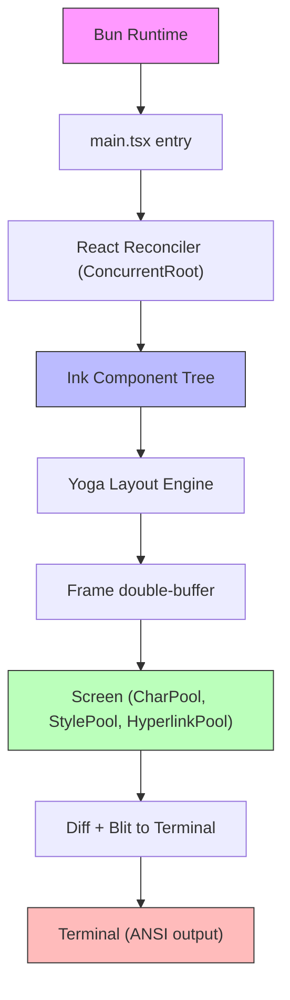
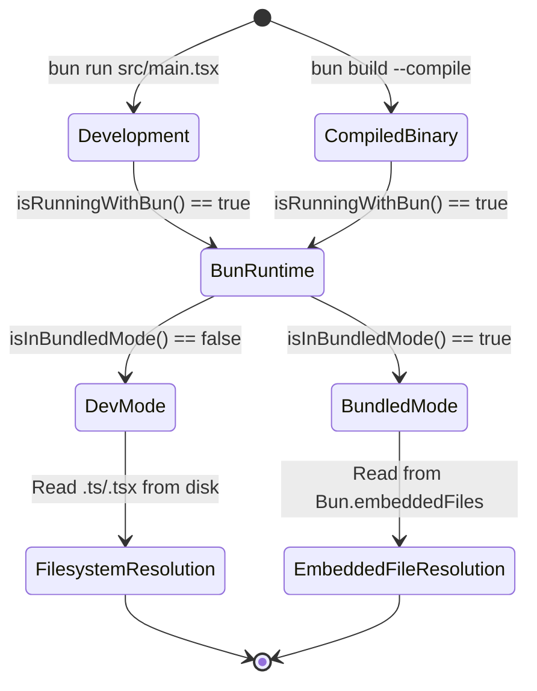

# TypeScript, Bun, React, Ink: The Unusual Runtime Stack

## Overview

Most CLI tools are written in C, Go, or Rust. cc chose a different path: TypeScript running on the Bun runtime, with React and Ink providing a structured terminal UI layer. This stack is unconventional, and the tradeoffs it introduces -- startup latency, distributability constraints, and memory overhead -- are real. But the payoff is equally real: a component model for terminal output that scales with feature complexity, a single-language codebase from API calls to pixel-level rendering, and the ability to compile the entire agent into a standalone executable via Bun's bundler.

The stack breaks down into four layers. Bun provides the runtime, replacing Node.js with faster startup and native TypeScript execution. TypeScript provides the type system that makes the `harness` -- the engineering layer around the LLM -- tractable at scale. React provides the component model, and Ink adapts it for terminal output. Each layer depends on the one below it, and the entire chain is gated by `isInBundledMode()`, which determines whether cc is running as a development checkout or a compiled binary.

This chapter examines why each layer was chosen, how they compose, and where the seams show. The HER's Fowler taxonomy provides the conceptual frame: strongly typed languages with clear module boundaries are precisely the conditions that make `harness` implementation practical (HER §4). The supply-chain risks of a Bun-compiled binary carrying embedded files connect directly to HER §12's warning about treating tool dependencies as untrusted inputs.

## Data structures and contracts

The core data contract of the Ink rendering pipeline is the `Frame` object -- a double-buffered snapshot of terminal state. The `Ink` class maintains two frames, `frontFrame` and `backFrame`, that alternate every render cycle. The front frame represents what is currently on screen; the back frame is where the next state is composed. After layout and diff, they swap.

```typescript
// src/ink/ink.tsx:L99-L101 — Double-buffered frame storage
  private frontFrame: Frame;
  private backFrame: Frame;
  private lastPoolResetTime = performance.now();
```

The double-buffer pattern prevents tearing: the terminal never sees a half-rendered state. Each `Frame` carries not just character data but pool references (`stylePool`, `charPool`, `hyperlinkPool`) that enable interned lookups across the entire rendering pipeline.

The `StylePool` is the most intricate data structure in the screen layer. It interns arrays of ANSI escape codes into numeric IDs with a visibility bit packed into bit 0:

```typescript
// src/ink/screen.ts:L129-L141 — StylePool.intern with visible-on-space bit encoding
  intern(styles: AnsiCode[]): number {
    const key = styles.length === 0 ? '' : styles.map(s => s.code).join('\0')
    let id = this.ids.get(key)
    if (id === undefined) {
      const rawId = this.styles.length
      this.styles.push(styles.length === 0 ? [] : styles)
      id =
        (rawId << 1) |
        (styles.length > 0 && hasVisibleSpaceEffect(styles) ? 1 : 0)
      this.ids.set(key, id)
    }
    return id
  }
```

Even IDs mean foreground-only styles (invisible on space characters); odd IDs mean styles that produce visible effects on spaces (backgrounds, inverse, underline). This single-bit encoding lets the renderer skip invisible spaces with a bitmask check rather than a style-array traversal -- a micro-optimization that compounds across millions of cells per session. The `hasVisibleSpaceEffect` function checks against a set of known ANSI end codes that produce visible effects on space characters: background color (49m), inverse (27m), underline (24m), strikethrough (29m), and overline (55m) (`src/ink/screen.ts:L263-L276`).

The `CharPool` uses a different strategy: an `Int32Array` indexed by ASCII character code for O(1) lookups on the common case, falling back to a `Map` for Unicode:

```typescript
// src/ink/screen.ts:L27-L36 — CharPool ASCII fast-path
  private ascii: Int32Array = initCharAscii() // charCode → index, -1 = not interned

  intern(char: string): number {
    // ASCII fast-path: direct array lookup instead of Map.get
    if (char.length === 1) {
      const code = char.charCodeAt(0)
      if (code < 128) {
        const cached = this.ascii[code]!
        if (cached !== -1) return cached
```

These pools are shared across all screens within a single Ink instance, which means `blitRegion` can copy character IDs directly without re-interning, and `diffEach` can compare IDs as integers rather than performing string lookups (`src/ink/screen.ts:L15-L20`). The comment in the source makes this explicit: "With a shared pool, interned char IDs are valid across screens, so blitRegion can copy IDs directly (no re-interning) and diffEach can compare IDs as integers (no string lookup)."

The `Screen` type itself stores cells not as objects but as packed `Int32Array` elements. Each cell occupies two consecutive Int32 values: word0 holds the character ID (full 32 bits), and word1 packs styleId into bits 31-17, hyperlinkId into bits 16-2, and width into bits 1-0 (`src/ink/screen.ts:L332-L337`). A parallel `BigInt64Array` view (`cells64`) enables bulk fills via `BigInt64Array.fill()` for screen resets and region clears. This packed representation eliminates GC pressure: a 200-by-120 terminal contains 24,000 cells, and allocating that many JavaScript objects per frame would dominate runtime cost. The packed array reduces per-cell memory from approximately 48 bytes (a JS object with char, styleId, width, hyperlink properties) to 8 bytes (two Int32s).

The `CellWidth` const enum classifies characters for double-width rendering -- CJK ideographs, emoji, and other wide glyphs occupy two terminal columns:

```typescript
// src/ink/screen.ts:L289-L300 — CellWidth classification for wide characters
export const enum CellWidth {
  // Not a wide character, cell width 1
  Narrow = 0,
  // Wide character, cell width 2. This cell contains the actual character.
  Wide = 1,
  // Spacer occupying the second visual column of a wide character. Do not render.
  SpacerTail = 2,
  // Spacer at the end of a soft-wrapped line indicating that a wide character
  // continues on the next line. Used for preserving wide character semantics
  // across line breaks during soft wrapping.
  SpacerHead = 3,
}
```

The `SpacerTail` and `SpacerHead` variants make the data structure self-describing: cursor positioning logic does not need to infer width at render time, and soft-wrapping wide characters across line boundaries preserves their semantics without special-case code at the blit layer.

The bundled-mode contract is the simplest data structure in this chapter, but its implications are far-reaching:

```typescript
// src/utils/bundledMode.ts:L16-L22 — Bundled mode detection
export function isInBundledMode(): boolean {
  return (
    typeof Bun !== 'undefined' &&
    Array.isArray(Bun.embeddedFiles) &&
    Bun.embeddedFiles.length > 0
  )
}
```

When `isInBundledMode()` returns true, cc knows it is running as a compiled Bun executable with embedded files. This gates filesystem lookup paths, resource resolution, and -- critically for HER §12 -- determines which `tool` definitions and `skill` templates are available without network access. The supply-chain implication is that `Bun.embeddedFiles` represents a frozen attack surface: whatever was compiled into the binary at build time is trusted by default, and any compromise of the build pipeline becomes a compromise of every deployed binary.



## Control flow

The rendering pipeline follows a strict sequence on every frame. When React's reconciler commits a change, `scheduleRender` is invoked. Because the reconciler's `resetAfterCommit` fires before React's layout phase, `scheduleRender` defers the actual render to a microtask via `queueMicrotask`, ensuring that layout effects (notably `cursorDeclaration` from `useDeclaredCursor`) have committed before the terminal is repainted (`src/ink/ink.tsx:L210-L216`).

The render throttling uses a leading-and-trailing throttle at `FRAME_INTERVAL_MS`:

```typescript
// src/ink/ink.tsx:L212-L216 — Deferred, throttled render scheduling
    const deferredRender = (): void => queueMicrotask(this.onRender);
    this.scheduleRender = throttle(deferRender, FRAME_INTERVAL_MS, {
      leading: true,
      trailing: true
    });
```

Leading: true means the first render in a burst fires immediately, keeping perceived latency low. Trailing: true means the last state change in a burst is never lost. Between bursts, the throttle drops intermediate states -- correct behavior for a terminal UI where only the final state matters. The comment in the source explains the rationale for the microtask deferral: "Any state set in layout effects -- notably the cursorDeclaration from useDeclaredCursor -- would lag one commit behind if we rendered synchronously. Deferring to a microtask runs onRender after layout effects have committed, so the native cursor tracks the caret without a one-keystroke lag." (`src/ink/ink.tsx:L203-L211`).

The `onRender` method itself performs these steps in order: (1) flush deferred interaction time, (2) render the React tree into the back frame via the `renderer`, (3) handle scroll-following selection translation, (4) apply selection and search overlays, (5) diff the front and back screens, (6) write the minimal ANSI escape sequences to the terminal, (7) swap front and back frames. The `onComputeLayout` callback wires Yoga layout computation into React's commit phase:

```typescript
// src/ink/ink.tsx:L239-L258 — Layout computation during React commit phase
    this.rootNode.onComputeLayout = () => {
      if (this.isUnmounted) {
        return;
      }
      if (this.rootNode.yogaNode) {
        const t0 = performance.now();
        this.rootNode.yogaNode.setWidth(this.terminalColumns);
        this.rootNode.yogaNode.calculateLayout(this.terminalColumns);
        const ms = performance.now() - t0;
        recordYogaMs(ms);
        const c = getYogaCounters();
        this.lastYogaCounters = {
          ms,
          ...c
        };
      }
    };
```

Yoga -- Facebook's flexbox layout engine compiled to WebAssembly -- is the bridge between React's component model and the terminal's fixed-width grid. Every frame, the root Yoga node's width is set to `terminalColumns`, layout is recalculated, and the timing is recorded for the debug overlay. This is the same layout algorithm that powers React Native, repurposed for monospace terminals. The `getYogaCounters()` call retrieves aggregate statistics (nodes visited, nodes measured, cache hits, live nodes) that feed into the debug overlay and help identify layout performance regressions.

The React container is created with `ConcurrentRoot`, enabling concurrent rendering features:

```typescript
// src/ink/ink.tsx:L262-L269 — React reconciler container creation
    this.container = reconciler.createContainer(this.rootNode, ConcurrentRoot, null, false, null, 'id', noop,
    noop,
    noop,
    noop
    );
```

Concurrent mode means React can interrupt rendering to handle higher-priority updates (like keystrokes) without blocking the main thread. In a terminal UI where user input and streaming LLM output arrive concurrently, this is not a luxury -- it is a correctness requirement. The four `noop` callbacks handle `onUncaughtError`, `onCaughtError`, `onRecoverableError`, and `onDefaultTransitionIndicator` -- all explicitly suppressed because Ink manages its own error boundaries within the component tree.

The bundled-mode control flow is a two-branch gate. When `isRunningWithBun()` returns true (`src/utils/bundledMode.ts:L7-L10`), the runtime enables Bun-specific APIs (file system watchers, SQLite, embedded files). When `isInBundledMode()` additionally returns true, cc switches from development-mode file resolution to compiled-binary resource resolution, reading prompts, `skill` templates, and `hook` definitions from `Bun.embeddedFiles` rather than the filesystem.



## Edge cases and failure modes

The double-buffer pattern introduces a subtle edge case during `unmount`. After the React tree is torn down, a trailing render could paint an empty frame to the terminal. The `isUnmounted` flag prevents this:

```typescript
// src/ink/ink.tsx:L83-L83 — Unmount guard
  private isUnmounted = false;
```

When `unmount()` sets `isUnmounted = true`, subsequent calls to `scheduleRender` are no-ops. Without this guard, the user would see a brief flash of empty terminal content between the agent's final output and the shell prompt.

Resize handling during alt-screen mode presents another edge case. Terminals often emit two or more resize events for a single user action as the window settles. cc filters same-dimension events as no-ops (`src/ink/ink.tsx:L314-L315`). For genuine dimension changes, writing `ERASE_SCREEN` synchronously in `handleResize` would leave the terminal blank for the approximately 80 milliseconds that `render()` takes. Instead, cc sets `needsEraseBeforePaint = true` and defers the erase into the next `onRender`'s atomic BSU/ESU block, ensuring old content stays visible until the new frame is fully ready (`src/ink/ink.tsx:L160-L165`). The source comment is explicit about this: "Writing ERASE_SCREEN synchronously in handleResize would leave the screen blank for the ~80ms render() takes; deferring into the atomic block means old content stays visible until the new frame is fully ready."

Alt-screen re-entry after a terminal editor (vim, nano, less) presents a particularly tricky failure mode. These editors write their own smcup/rmcup escape sequences (CSI ?1049h/?1049l), which means that even though cc was already in alt-screen mode, the editor's rmcup on exit drops the terminal back to the main screen. The `exitAlternateScreen` method handles this by re-entering alt-screen unconditionally when `altScreenActive` is true (`src/ink/ink.tsx:L392-L419`). Without the re-entry, the subsequent `2J` clear would wipe the user's main-screen scrollback and all subsequent renders would land in main screen, breaking native terminal scroll.

The `prevFrameContaminated` flag handles a broader class of screen-state corruption. Selection overlays mutate the front frame's screen buffer directly (they are a post-render pass, not a React state change). After a selection change, the front frame can no longer be trusted for diff-based blitting. Setting `prevFrameContaminated = true` forces one full-render frame, after which steady-state diff-based rendering resumes (`src/ink/ink.tsx:L155-L159`).

The `displayCursor` tracking introduces a failure mode on SIGCONT. When the process is suspended and resumed, the shell may have moved the physical cursor to an arbitrary position. The stored `displayCursor` coordinates are stale, so cc nulls them out on resume:

```typescript
// src/ink/ink.tsx:L296-L300 — Stale cursor invalidation on SIGCONT
    this.displayCursor = null;
```

Without this invalidation, the next frame's cursor preamble would emit a relative move from a stale park position, causing the cursor -- and any IME preedit text -- to appear at the wrong location. The `handleResume` method also resets the front and back frames for main-screen mode, because the shell may have written content to the terminal while cc was suspended (`src/ink/ink.tsx:L293-L300`).

The bundled-mode detection itself has an edge case: `Bun.embeddedFiles` is only defined when running inside Bun. The `typeof Bun !== 'undefined'` guard prevents a ReferenceError in Node.js or browser environments, but it also means that code running outside Bun will silently fall into the development path regardless of whether the files it expects actually exist on disk. The `Array.isArray(Bun.embeddedFiles) && Bun.embeddedFiles.length > 0` check adds an additional guard: a Bun runtime with zero embedded files (running `bun run src/main.tsx` in development) should not enter bundled mode, even though the `Bun` global exists.

From a supply-chain perspective (HER §12), `Bun.embeddedFiles` represents a frozen trust boundary. The compiled binary trusts that embedded `skill` definitions, `hook` configurations, and `tool` schemas are uncompromised. If the build pipeline is compromised -- a supply-chain attack on the CI/CD system, a malicious dependency in the lockfile, or a compromised Bun runtime itself -- every deployed binary carries that compromise. The mitigation recommended by HER §12 is to treat embedded resources with the same skepticism as untrusted npm packages: audit tool-call logs, restrict permissions to minimum required, and run tool execution in sandboxed environments when possible. The `isInBundledMode()` function provides the runtime hook for such auditing: when it returns true, additional `sensor` controls can verify that embedded `tool` definitions match expected hashes before the `harness` registers them.

## Where cc diverges from the published pattern

The published Ink library (v4) provides a simple `render()` function that creates a renderer and returns a wait-until-exit promise. cc's `Ink` class is a substantially rewritten version that adds: double-buffered rendering with `Screen` objects, pooled string/style/hyperlink interning, Yoga layout integration, selection overlays, search highlighting, position-based highlights, native cursor declaration, alt-screen management, SIGCONT handling, and frame-level diffing with atomic terminal writes.

The React-on-terminal pattern is well-established in Ink's published API. What cc diverges from is the rendering model. Published Ink renders the full component tree to an `Output` string on every frame. cc renders into a `Screen` data structure backed by interned pools, then diffs the front and back screens to produce a minimal ANSI patch. This is the difference between repainting the entire terminal every frame and updating only the cells that changed -- orders of magnitude less I/O on a terminal that may be running over SSH with 50ms latency. The `Screen` type uses packed `Int32Array` storage rather than per-cell objects (`src/ink/screen.ts:L332-L365`), and the `StylePool` pre-caches ANSI transition strings so that repeated style changes incur zero string allocation after the first occurrence (`src/ink/screen.ts:L153-L162`).

The use of `ConcurrentRoot` also diverges from published Ink, which historically used legacy synchronous rendering. Concurrent mode is essential for cc's use case because LLM token streams and user keystrokes arrive on different event-loop ticks, and blocking the main thread during a large render would make the UI feel frozen.

The selection and search overlay system is entirely absent from published Ink. cc implements selection as a post-render pass that mutates the front frame's screen buffer directly, replacing cell backgrounds with a dedicated selection color while preserving foreground styling. The `withSelectionBg` method strips existing background and inverse codes from a cell's style, then pushes the selection background code on top (`src/ink/screen.ts:L244-L259`). The `withCurrentMatch` method applies a distinct visual treatment for the currently-selected search match (inverse + bold + yellow background + underline) versus other matches (plain inverse), so the user can identify their position within a set of results (`src/ink/screen.ts:L188-L220`).

The `isInBundledMode()` function represents another divergence. Published Ink has no concept of bundled versus development mode. cc needs this distinction because a Bun-compiled binary cannot resolve TypeScript imports from disk -- it must read from `Bun.embeddedFiles`. This is a runtime-specific `harness` concern: the `harness` must know which runtime it is executing in to correctly locate its own `guide` definitions and `tool` schemas.

HER §4's Fowler taxonomy frames this divergence through the lens of `harness` implementability. The taxonomy identifies strongly typed languages and clear module boundaries as factors that improve `harness` construction. TypeScript provides the type system; React's component model provides the module boundaries; Ink's `Screen` abstraction provides the rendering contract. The result is a system where computational `sensor` controls (type checkers, linters) can verify rendering correctness at build time, while inferential controls (the LLM observing its own terminal output) operate at runtime. The division is clean because the component model enforces it.

The taxonomy also warns that "legacy systems with technical debt face particular challenges: harnesses are most necessary where hardest to build" (HER §4). cc's custom Ink fork exists precisely because published Ink could not be harnessed for cc's requirements. The `Screen` abstraction, the pool interning, the diff-based rendering -- these are not incremental improvements to Ink; they are a new `harness` layer built on top of React's reconciler. The choice to fork rather than extend reflects the taxonomy's insight: the published Ink API lacked the module boundaries needed for a maintainability `harness`, so cc built its own.

## Developer takeaways for building a long-running agent

Building a long-running agent on the TypeScript-Bun-React-Ink stack demands attention to three concerns that do not arise in shorter-lived CLI tools. First, the double-buffer and pool-interning strategy is not optional -- it is the difference between a terminal UI that flickers on every token stream update and one that diff-patches only the changed cells. Implement your own `Screen` abstraction with pooled lookups from day one; retrofitting it into a string-based renderer is prohibitively expensive once the component tree grows beyond trivial size. Second, concurrent React rendering is a correctness requirement, not a performance optimization, when user input and streaming output coexist. Use `ConcurrentRoot` and ensure your reconciler callbacks defer rendering past the layout phase so that native cursor tracking and IME input do not lag by one commit cycle. Third, the bundled-mode boundary is a trust boundary. `Bun.embeddedFiles` freezes your `skill` definitions, `hook` configurations, and `tool` schemas at compile time. Any compromise of the build pipeline becomes a compromise of every deployed binary. Audit your CI/CD chain with the same rigor you would apply to a supply-chain dependency, and implement runtime `sensor` controls that verify tool-call integrity even within the trusted boundary.
