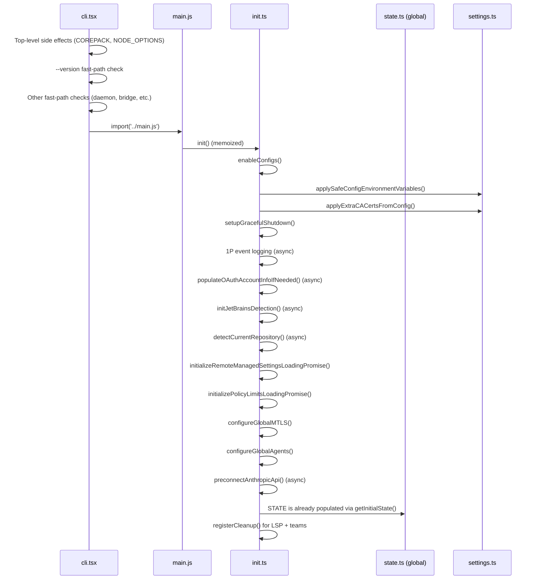
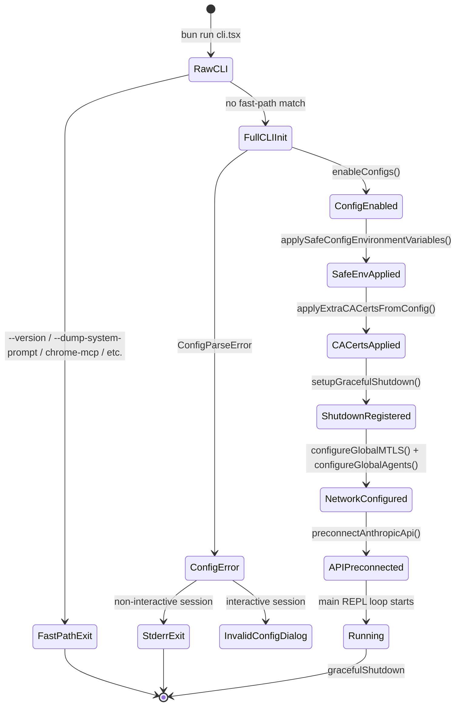

# Bootstrap: From `bun run` to Running Loop

## Overview

When `bun run` executes the cc entrypoint, the process must traverse a carefully ordered sequence of initialization steps before the first user prompt is ever processed. This chapter traces that path from the top-level `cli.tsx` dispatch, through `init.ts` side-effect orchestration, into the global `State` singleton that governs the entire session, and finally to the settings loading pipeline that determines which features, permissions, and policies are active. Every step is ordered for a reason: TLS certificates must be injected before the first HTTPS handshake; mTLS agents must be configured before API preconnect fires; policy limits must resolve before bridge mode can authorize. A single misordering can produce silent failures that surface only in production.

The bootstrap architecture serves two goals simultaneously. First, it minimizes time-to-interactive by deferring heavy module loads behind dynamic `import()` calls and by providing fast-path exits for commands like `--version` that require zero configuration. Second, it establishes the invariant that every subsystem reads from a single, coherently initialized global state rather than from ad-hoc environment variables scattered across the codebase. The `State` object in `src/bootstrap/state.ts` is the nexus of that contract.

The chapter is organized around three axes. The first axis is the dispatch logic in `src/entrypoints/cli.tsx`, which decides whether the process is a standard interactive session or one of a dozen specialized modes. The second axis is the `init()` function in `src/entrypoints/init.ts`, which sequences every side effect from configuration loading through network preconnect. The third axis is the settings pipeline in `src/utils/settings/settings.ts`, which resolves a multi-layered, multi-source policy cascade that determines what the agent is allowed to do. Together, these three files define the complete path from `bun run` to the point where the main REPL loop can safely begin accepting user input.

## Data structures and contracts

The central data structure of the bootstrap phase is the `State` type in `src/bootstrap/state.ts`. It is a flat object with over ninety fields that track everything from the session ID to prompt-cache eligibility latches. No nested state machines live inside it; instead, individual fields capture discrete boolean or scalar states that higher-level modules read through typed getter/setter functions.

```typescript
// src/bootstrap/state.ts:L45-L257 — The State type (excerpt)
type State = {
  originalCwd: string
  projectRoot: string
  totalCostUSD: number
  totalAPIDuration: number
  totalAPIDurationWithoutRetries: number
  totalToolDuration: number
  turnHookDurationMs: number
  turnToolDurationMs: number
  turnClassifierDurationMs: number
  turnToolCount: number
  turnHookCount: number
  turnClassifierCount: number
  startTime: number
  lastInteractionTime: number
  // ...
  isInteractive: boolean
  kairosActive: boolean
  strictToolResultPairing: boolean
  clientType: string
  sessionSource: string | undefined
  sessionIngressToken: string | null | undefined
  oauthTokenFromFd: string | null | undefined
  apiKeyFromFd: string | null | undefined
  // Telemetry state
  meter: Meter | null
  sessionCounter: AttributedCounter | null
  // ...
  sessionId: SessionId
  parentSessionId: SessionId | undefined
  // ...
  allowedSettingSources: SettingSource[]
  // ...
  sessionCreatedTeams: Set<string>
  sessionTrustAccepted: boolean
  sessionPersistenceDisabled: boolean
  // ...
  registeredHooks: Partial<Record<HookEvent, RegisteredHookMatcher[]>> | null
  // ...
}
```

The `State` type is intentionally monolithic: a single `STATE` constant of type `State` is created once by `getInitialState()` and never replaced. Individual fields are mutated in place through setter functions, which keeps the access pattern trivially thread-safe in Bun's single-threaded event loop while avoiding the allocation overhead of immutable snapshots. The comment `DO NOT ADD MORE STATE HERE - BE JUDICIOUS WITH GLOBAL STATE` at `src/bootstrap/state.ts:L31` codifies the trade-off: the file is already large, and each new field must justify why it cannot live in a narrower module.

The `getInitialState()` function at `src/bootstrap/state.ts:L260-L426` constructs the `STATE` object. It resolves the current working directory via `realpathSync` and normalizes it to NFC form, accounting for edge cases like File Provider EPERM on CloudStorage mounts (`src/bootstrap/state.ts:L264-L276`). The session ID is assigned immediately via `randomUUID()` (`src/bootstrap/state.ts:L331`), making it available before any async initialization runs. The `startTime` field is set to `Date.now()` (`src/bootstrap/state.ts:L290`) and never mutated, providing a stable anchor for all subsequent duration calculations.

A notable design choice is the separation of `originalCwd` and `projectRoot`. The `originalCwd` field at `src/bootstrap/state.ts:L278` tracks where the process was launched, while `projectRoot` at `src/bootstrap/state.ts:L279` tracks the stable project identity. The `setProjectRoot` function's docstring at `src/bootstrap/state.ts:L519-L525` explains that `projectRoot` is set at startup by the `--worktree` flag but is never updated by mid-session `EnterWorktreeTool` invocations. This ensures that skills, history, and session storage remain anchored to the session's original project even when the agent enters a temporary worktree for isolated file operations.

The `AttributedCounter` type at `src/bootstrap/state.ts:L41-L43` defines the telemetry counter contract. Every counter wraps an OpenTelemetry `Counter` but adds automatic attribute merging so callers never need to manually merge session-level telemetry attributes:

```typescript
// src/bootstrap/state.ts:L41-L43 — AttributedCounter interface
export type AttributedCounter = {
  add(value: number, additionalAttributes?: Attributes): void
}
```

The `allowedSettingSources` field at `src/bootstrap/state.ts:L85` controls which settings layers are consulted. Its default value includes `userSettings`, `projectSettings`, `localSettings`, `flagSettings`, and `policySettings` (`src/bootstrap/state.ts:L313-L319`). This field can be narrowed by the `setAllowedSettingSources` function at `src/bootstrap/state.ts:L1230-L1232`, which is used by the SDK to restrict which setting sources are trusted. The policy layer uses a "first source wins" merge strategy across remote, MDM/plist, file-based, and HKCU origins, documented in `src/utils/settings/settings.ts:L322-L345`.

The `ChannelEntry` discriminated union at `src/bootstrap/state.ts:L37-L39` defines how channel servers are classified for the trust model. Entries of kind `'plugin'` require marketplace verification plus allowlist checks, while entries of kind `'server'` always fail the allowlist because the schema is plugin-only. Either kind can bypass the allowlist if the `dev` flag is set, which is populated by the `--dangerously-load-development-channels` CLI flag. The `allowedChannels` field at `src/bootstrap/state.ts:L213` and the `hasDevChannels` field at `src/bootstrap/state.ts:L217` are parsed once in `main.tsx` and consumed by the `ChannelsNotice` component to name the correct flag in policy-blocked messages.

## Control flow

### The fast-path dispatcher in cli.tsx

The `main()` function in `src/entrypoints/cli.tsx` is the first user code to execute. Before it runs, two top-level side effects fire: the `COREPACK_ENABLE_AUTO_PIN` env var is set to suppress corepack auto-pinning (`src/entrypoints/cli.tsx:L5`), and, if `CLAUDE_CODE_REMOTE` is true, the `NODE_OPTIONS` flag is appended with `--max-old-space-size=8192` to give child processes in container environments a larger heap (`src/entrypoints/cli.tsx:L9-L14`). These must happen at module-evaluation time because downstream modules capture environment variables into `const` bindings at import time.

The first substantive check is the `--version` fast path:

```typescript
// src/entrypoints/cli.tsx:L37-L42 — Zero-import version fast path
if (args.length === 1 && (args[0] === '--version' || args[0] === '-v' || args[0] === '-V')) {
  // MACRO.VERSION is inlined at build time
  // biome-ignore lint/suspicious/noConsole:: intentional console output
  console.log(`${MACRO.VERSION} (Claude Code)`);
  return;
}
```

This branch returns immediately without importing any other module. The `MACRO.VERSION` value is baked in at build time by Bun's bundler, so the string is available with zero async resolution. This pattern — a literal check followed by a dynamic import of only what that path needs — repeats for every fast-path branch: `--dump-system-prompt`, `--claude-in-chrome-mcp`, `--daemon-worker`, `remote-control`, `daemon`, `ps|logs|attach|kill`, template commands, environment-runner, self-hosted-runner, and the `--worktree --tmux` combination. Each fast path loads at most `enableConfigs` plus the specific handler module.

The `feature()` function calls sprinkled throughout `src/entrypoints/cli.tsx` (e.g., `feature('DAEMON')` at line 100, `feature('BRIDGE_MODE')` at line 112) are compile-time gates. Bun's bundler performs dead-code elimination on branches guarded by `feature()` calls whose flag is not present in the external build configuration, so the `daemon`, `bridge`, and other internal-only paths are stripped entirely from the open-source bundle.

An important detail about the fast-path architecture is the ablation baseline block at `src/entrypoints/cli.tsx:L20-L26`. This block sets a cascade of environment variables (`CLAUDE_CODE_SIMPLE`, `CLAUDE_CODE_DISABLE_THINKING`, `DISABLE_INTERLEAVED_THINKING`, `DISABLE_COMPACT`, `DISABLE_AUTO_COMPACT`, `CLAUDE_CODE_DISABLE_AUTO_MEMORY`, `CLAUDE_CODE_DISABLE_BACKGROUND_TASKS`) when both the `ABLATION_BASELINE` feature flag and the `CLAUDE_CODE_ABLATION_BASELINE` environment variable are set. The comment at `src/entrypoints/cli.tsx:L16-L19` explains why this must live in `cli.tsx` rather than in `init.ts`: tools like `BashTool`, `AgentTool`, and `PowerShellTool` capture `DISABLE_BACKGROUND_TASKS` into module-level `const` bindings at import time, meaning `init()` runs too late to affect them. This is a concrete example of the import-time-versus-runtime distinction that shapes where side effects must be placed in the bootstrap sequence.

When no fast-path flag matches, the function loads `startCapturingEarlyInput()` and then dynamically imports `../main.js`, which is the full CLI entrypoint (`src/entrypoints/cli.tsx:L289-L298`). The `profileCheckpoint` calls between each step feed the startup profiler, which measures millisecond-level timing from `cli_entry` through `cli_after_main_complete`. The `startCapturingEarlyInput()` call at `src/entrypoints/cli.tsx:L290` is worth noting: it begins buffering stdin before the full CLI has loaded, so that if the user types a prompt while the CLI is still initializing, that input is not lost. This is a small but meaningful UX optimization for users on slow machines or large projects where `main.js` import takes hundreds of milliseconds.

Before the fallthrough to the full CLI, two more checks fire. The `--update`/`--upgrade` flag redirect at `src/entrypoints/cli.tsx:L277-L279` rewrites `process.argv` to translate the legacy flags into the `update` subcommand. The `--bare` flag at `src/entrypoints/cli.tsx:L283-L285` sets `CLAUDE_CODE_SIMPLE` to `1` early so that feature gates that evaluate during module evaluation or Commander option building fire correctly, not only inside the action handler. These late-stage rewrites demonstrate that the `cli.tsx` layer acts as a normalization filter before the heavier `main.js` module is loaded.

### The init() function: ordered side effects

Once `main.js` takes over, one of its earliest calls is `init()`, a memoized async function in `src/entrypoints/init.ts`. Because it is wrapped in `lodash-es/memoize`, subsequent calls are no-ops (`src/entrypoints/init.ts:L57`). The function's body is a single try/catch block that sequences the following operations:

1. **`enableConfigs()`** validates and activates the configuration system (`src/entrypoints/init.ts:L65`).
2. **`applySafeConfigEnvironmentVariables()`** sets environment variables that are safe to expose before the trust dialog is resolved (`src/entrypoints/init.ts:L74`).
3. **`applyExtraCACertsFromConfig()`** injects `NODE_EXTRA_CA_CERTS` from `settings.json` into `process.env`. The comment at `src/entrypoints/init.ts:L77-L78` explains why this must happen before any TLS handshake: Bun caches the TLS certificate store at boot via BoringSSL.
4. **`setupGracefulShutdown()`** registers process signal handlers (`src/entrypoints/init.ts:L87`).
5. **First-party event logging** is initialized via a fire-and-forget `Promise.all` of dynamic imports (`src/entrypoints/init.ts:L94-L105`).
6. **`populateOAuthAccountInfoIfNeeded()`** ensures OAuth account info is cached, particularly for VSCode extension logins (`src/entrypoints/init.ts:L110`).
7. **`initJetBrainsDetection()`** and **`detectCurrentRepository()`** populate caches asynchronously for later synchronous access (`src/entrypoints/init.ts:L114-L119`).
8. **Remote managed settings** and **policy limits** loading promises are initialized so other systems can await them later (`src/entrypoints/init.ts:L123-L128`).
9. **`configureGlobalMTLS()`** sets up mutual TLS (`src/entrypoints/init.ts:L137`).
10. **`configureGlobalAgents()`** configures global HTTP agents for proxy and mTLS (`src/entrypoints/init.ts:L147`).
11. **`preconnectAnthropicApi()`** fires a TCP+TLS handshake to the Anthropic API, overlapping the ~100-200ms connection setup with subsequent action-handler work (`src/entrypoints/init.ts:L159`).
12. **Upstream proxy** initialization for CCR environments (`src/entrypoints/init.ts:L167-L183`).
13. **`setShellIfWindows()`** and **`registerCleanup()`** for LSP and team cleanup (`src/entrypoints/init.ts:L186-L200`).
14. **`ensureScratchpadDir()`** creates the scratchpad directory if the scratchpad feature is enabled (`src/entrypoints/init.ts:L203-L209`).

Each of these steps is wrapped in timing instrumentation via `logForDiagnosticsNoPII` calls that emit structured log entries with duration in milliseconds. The `profileCheckpoint` calls between steps feed the startup profiler, which can be enabled to emit a timeline of the boot sequence for performance analysis. This dual-instrumentation approach (diagnostic logs for production observability, profile checkpoints for development-time profiling) ensures that boot performance can be monitored and optimized without adding overhead in the common case where profiling is disabled.

The ordering is not arbitrary. Steps 9 and 10 must follow step 3 (CA certs) because the TLS handshake depends on the certificate store being populated. Step 11 must follow steps 9 and 10 because the preconnect must use the correct proxy and mTLS agents. The upstream proxy at step 12 must follow `enableConfigs()` because it reads GrowthBook feature flags.

```typescript
// src/entrypoints/init.ts:L73-L88 — Early init: env vars, CA certs, shutdown
// Apply only safe environment variables before trust dialog
// Full environment variables are applied after trust is established
const envVarsStart = Date.now()
applySafeConfigEnvironmentVariables()

// Apply NODE_EXTRA_CA_CERTS from settings.json to process.env early,
// before any TLS connections. Bun caches the TLS cert store at boot
// via BoringSSL, so this must happen before the first TLS handshake.
applyExtraCACertsFromConfig()

logForDiagnosticsNoPII('info', 'init_safe_env_vars_applied', {
  duration_ms: Date.now() - envVarsStart,
})
profileCheckpoint('init_safe_env_vars_applied')

// Make sure things get flushed on exit
setupGracefulShutdown()
profileCheckpoint('init_after_graceful_shutdown')
```

The `applySafeConfigEnvironmentVariables` versus `applyConfigEnvironmentVariables` split at `src/entrypoints/init.ts:L73-L74` reflects a security boundary: only environment variables deemed safe (those that cannot exfiltrate data or alter permissions) are set before the user has accepted the project trust dialog. The full set is applied after trust is established.

### Telemetry initialization after trust

The `initializeTelemetryAfterTrust()` function at `src/entrypoints/init.ts:L247-L286` is the second phase of telemetry setup, called only after the trust dialog has been accepted. It branches based on whether the user is eligible for remote managed settings. For eligible users, it waits for remote settings to load, then re-applies the full environment variables (to include remote settings) before initializing telemetry. For non-eligible users, telemetry initializes immediately. A special case exists for beta-tracing users in non-interactive sessions: telemetry is initialized eagerly before the async path completes (`src/entrypoints/init.ts:L252-L259`) to ensure the tracer is ready before the first query runs.

```typescript
// src/entrypoints/init.ts:L288-L303 — Double-init guard in doInitializeTelemetry
async function doInitializeTelemetry(): Promise<void> {
  if (telemetryInitialized) {
    // Already initialized, nothing to do
    return
  }

  // Set flag before init to prevent double initialization
  telemetryInitialized = true
  try {
    await setMeterState()
  } catch (error) {
    // Reset flag on failure so subsequent calls can retry
    telemetryInitialized = false
    throw error
  }
}
```

The `telemetryInitialized` flag prevents double initialization when the eager beta-tracing path and the deferred remote-settings path race. On failure, the flag is reset so subsequent calls can retry. The `setMeterState()` function at `src/entrypoints/init.ts:L305-L340` lazy-loads the OpenTelemetry instrumentation module (~400KB) and creates `AttributedCounter` instances that automatically merge session-level telemetry attributes into every metric emission.

### OAuth and credential prefetching

The `populateOAuthAccountInfoIfNeeded()` call at `src/entrypoints/init.ts:L110` is a fire-and-forget async operation that ensures OAuth account information is cached in the configuration system. This is particularly important for users who log in through the VSCode extension: the extension may set up OAuth tokens without populating the full account info record, and this call backfills the missing data. Because it is fire-and-forget (using `void` prefix), any failure is handled internally and does not block the init sequence.

The `oauthTokenFromFd` and `apiKeyFromFd` fields in the `State` type at `src/bootstrap/state.ts:L87-L88` support an alternative credential path where the calling process passes an OAuth token or API key via a file descriptor rather than through the standard credential store. These fields are set during argument parsing in `main.tsx` and consumed during API client construction, bypassing the normal OAuth flow entirely when present.

### The boot sequence diagram



### The boot state machine

The bootstrap process can be modeled as a state machine with seven states. The process begins in `RawCLI`, transitions through fast-path checks, and either exits early or proceeds through initialization into the `Running` state where the main REPL loop takes over.



### Settings loading: the policy cascade

The settings system in `src/utils/settings/settings.ts` implements a layered merge. The `getSettingsForSource` function at `src/utils/settings/settings.ts:L309-L317` checks a per-source cache first, then delegates to `getSettingsForSourceUncached`. For `policySettings`, the merge follows a strict priority cascade: remote managed settings (highest), then MDM/plist, then file-based `managed-settings.json` with drop-in directory support, then HKCU registry (lowest). The first source with content wins; lower-priority sources are never consulted.

```typescript
// src/utils/settings/settings.ts:L322-L345 — Policy settings: first-source-wins
if (source === 'policySettings') {
  const remoteSettings = getRemoteManagedSettingsSyncFromCache()
  if (remoteSettings && Object.keys(remoteSettings).length > 0) {
    return remoteSettings
  }

  const mdmResult = getMdmSettings()
  if (Object.keys(mdmResult.settings).length > 0) {
    return mdmResult.settings
  }

  const { settings: fileSettings } = loadManagedFileSettings()
  if (fileSettings) {
    return fileSettings
  }

  const hkcu = getHkcuSettings()
  if (Object.keys(hkcu.settings).length > 0) {
    return hkcu.settings
  }

  return null
}
```

The `loadManagedFileSettings` function at `src/utils/settings/settings.ts:L74-L121` implements a systemd-like drop-in convention: `managed-settings.json` provides the base, then files in `managed-settings.d/*.json` are sorted alphabetically and merged on top. This lets separate teams ship independent policy fragments (for example, `10-otel.json` and `20-security.json`) without coordinating edits to a single admin-owned file.

The `parseSettingsFile` function at `src/utils/settings/settings.ts:L178-L199` provides the core file parsing logic. It maintains a cache keyed by file path, cloning cached results on both read and write to prevent mutation leaks. When a file has invalid JSON, the function returns `{ settings: null, errors: [...] }` rather than throwing, allowing the settings system to continue operating with partial data. Invalid permission rules are filtered out before schema validation (`src/utils/settings/settings.ts:L217`) so that one bad rule does not cause the entire settings file to be rejected.

The `getPolicySettingsOrigin` function at `src/utils/settings/settings.ts:L375-L407` provides observability into which policy layer won the cascade. It returns a string tag (`'remote'`, `'plist'`, `'hklm'`, `'file'`, or `'hkcu'`) indicating the highest-priority source that had content. This is used by the `/status` command to display whether policy comes from remote management, macOS plist, Windows HKLM registry, file-based managed settings, or HKCU registry. The `getManagedFileSettingsPresence` helper at `src/utils/settings/settings.ts:L127-L150` further distinguishes between "base file only", "drop-ins only", or "both" for the file-based layer.

## Edge cases and failure modes

**ConfigParseError during init.** When `enableConfigs()` encounters a malformed `settings.json`, `init()` catches the `ConfigParseError` and branches on interactivity. In non-interactive sessions (SDK/headless mode), the error is written to stderr and the process exits with code 1 (`src/entrypoints/init.ts:L220-L226`). In interactive sessions, a React dialog is dynamically imported and shown to the user (`src/entrypoints/init.ts:L229-L232`). The dialog is loaded lazily because loading React at init time would penalize JSON consumers like the desktop marketplace plugin manager.

**TLS certificate race.** Bun's BoringSSL integration caches the certificate store at the first TLS handshake. If `applyExtraCACertsFromConfig()` runs after the first HTTPS request, the custom CA certificates are silently ignored. The comment at `src/entrypoints/init.ts:L77-L78` documents this constraint explicitly. Any future code that introduces an early network request before `init()` completes must respect this ordering.

**Upstream proxy fail-open.** The CCR upstream proxy initialization at `src/entrypoints/init.ts:L167-L183` catches all errors and continues without a proxy. This fail-open behavior is intentional: a broken proxy configuration should not prevent the agent from starting. The error is logged via `logForDebugging` at warn level but does not propagate.

**Memoization of init().** Because `init()` is wrapped in `lodash-es/memoize` (`src/entrypoints/init.ts:L57`), calling it a second time returns the cached promise without re-executing any side effects. This is safe because all side effects are idempotent under the assumption that the global `STATE` object has not been reset. However, test code that calls `resetStateForTests_ONLY()` (referenced by name in `src/bootstrap/state.ts:L551`) must also ensure `init()` is not re-invoked with stale memoization.

**Non-interactive session detection.** The `getIsNonInteractiveSession()` function at `src/bootstrap/state.ts:L1057-L1059` returns the negation of `STATE.isInteractive`. The `preferThirdPartyAuthentication()` function at `src/bootstrap/state.ts:L1234-L1237` adds a further constraint: it returns true only when the session is non-interactive AND the `clientType` is not `claude-vscode`. This means VSCode extension sessions in headless mode still use first-party authentication, a distinction that matters for token refresh and billing.

**Double telemetry initialization.** The `doInitializeTelemetry` function at `src/entrypoints/init.ts:L288-L303` guards against double initialization with a local `telemetryInitialized` flag. On failure, the flag is reset so subsequent calls can retry. This matters because `initializeTelemetryAfterTrust` has two code paths: one for remote-managed-settings-eligible users (which awaits settings then initializes) and one for non-eligible users (which initializes immediately). If a beta-tracing user is also remote-settings-eligible, the eager initialization at `src/entrypoints/init.ts:L252-L259` races with the deferred initialization at `src/entrypoints/init.ts:L263-L277`, and the `telemetryInitialized` flag ensures only one wins.

**Session-stable latches and prompt cache.** Several fields in the `State` type are designed as session-stable latches that, once set to a non-null value, should never revert during the session. The `afkModeHeaderLatched` field at `src/bootstrap/state.ts:L229`, the `fastModeHeaderLatched` field at `src/bootstrap/state.ts:L233`, and the `cacheEditingHeaderLatched` field at `src/bootstrap/state.ts:L237` all follow this pattern. The comments in the `State` type explain why: once a beta header is first sent to the API, flipping it off would bust the server-side prompt cache (which can be 50-70K tokens), causing a full reprocessing on the next request. These latches are evaluated on first activation and then held for the rest of the session, even if the underlying GrowthBook feature flag or setting changes. The `promptCache1hEligible` field at `src/bootstrap/state.ts:L225` similarly latches on first evaluation so that mid-session overage flips do not change the `cache_control` TTL.

**Bridge mode authorization ordering.** The bridge fast path in `src/entrypoints/cli.tsx:L112-L162` demonstrates a subtle ordering dependency between OAuth and feature flags. The auth check at `src/entrypoints/cli.tsx:L139` must come before the GrowthBook gate check because without authentication, GrowthBook has no user context and would return a stale or default false value. The comment at `src/entrypoints/cli.tsx:L134-L137` explains that `getBridgeDisabledReason` awaits GrowthBook initialization, so the returned value is fresh, but initialization itself requires auth headers to work. A developer who reorders these checks would see bridge mode silently fail for authenticated users because the feature flag would return false without auth context.

## Where cc diverges from the published pattern

The HER session protocol (ORIENT/SETUP) prescribes a startup sequence: read workspace state, read git logs, consult feature list, run init script, run baseline tests, then implement. cc's bootstrap follows this spirit but diverges in structure and timing.

First, cc performs ORIENT lazily rather than eagerly. The `detectCurrentRepository()` call at `src/entrypoints/init.ts:L119` populates a cache for later use, but the actual workspace orientation (reading git logs, consulting progress files) happens inside the REPL loop when the first query is processed, not during `init()`. This deferral reduces startup latency for commands that never need workspace context, such as `--version` or `--dump-system-prompt`.

Second, the SETUP phase in cc is split across two trust boundaries. The `applySafeConfigEnvironmentVariables()` call at `src/entrypoints/init.ts:L74` runs before the trust dialog, while the full `applyConfigEnvironmentVariables()` runs after trust is accepted. The HER pattern assumes a single trust boundary; cc has two, and the split is enforced at the settings layer.

Third, the HER five-layer defense-in-depth model (prompt guardrails, schema restrictions, runtime approval, tool validation, lifecycle hooks) maps onto cc's bootstrap in a transport-security-specific way. The `configureGlobalMTLS()` call at `src/entrypoints/init.ts:L137` implements the transport analog of layers 4 and 5: mTLS validates both client and server identities (analogous to tool-level validation), and the global agents configured at `src/entrypoints/init.ts:L147` enforce proxy and certificate policies for all outbound connections (analogous to lifecycle hooks that gate every tool invocation). The TLS layering — custom CA certs injected before any handshake, then mTLS agents configured before API preconnect — mirrors the HER principle that each defense layer must be established before the layer above it can operate.

Fourth, cc's `State` singleton diverges from the typical harness pattern of passing state through function arguments. The HER pattern recommends explicit state threading for testability. cc opts for a global mutable singleton with typed accessors because the state must be readable from deeply nested call sites (tool implementations, hook handlers, telemetry reporters) where passing arguments would require threading through dozens of function signatures. The trade-off is that test isolation requires an explicit `resetStateForTests_ONLY()` call.

Fifth, the ORIENT step in cc's bootstrap is asynchronous and cache-based rather than synchronous and blocking. The `initJetBrainsDetection()` call at `src/entrypoints/init.ts:L114` and `detectCurrentRepository()` call at `src/entrypoints/init.ts:L119` both populate caches that are consumed synchronously later in the session. If the cache is not yet populated when a synchronous consumer reads it, the consumer gets a null or default value rather than blocking. This is a deliberate trade-off: startup speed is prioritized over guaranteed cache availability, and the consumers are written to handle the empty-cache case gracefully. The HER pattern assumes that ORIENT completes fully before SETUP begins; cc allows ORIENT to overlap with SETUP and even with the first user query.

## Developer takeaways for building a long-running agent

Order your initialization steps around external dependencies, not around logical categories. The bootstrap sequence in cc is not organized by "first load settings, then load telemetry, then load networking" but by the causal chain of what each step requires: CA certs must exist before the TLS handshake can succeed, so `applyExtraCACertsFromConfig` precedes `configureGlobalAgents`. The proxy agent must be configured before the API preconnect can reuse it, so `configureGlobalAgents` precedes `preconnectAnthropicApi`. When you add a new initialization step, identify its causal dependencies and place it after all of them, not in a thematic grouping that may violate the actual dependency order. Use a startup profiler with named checkpoints (as cc does with `profileCheckpoint`) to measure the cost of each step and catch regressions early. Provide fast-path exits for commands that need zero initialization: a `--version` flag that loads no modules saves users hundreds of milliseconds on every invocation. Guard against double initialization with local boolean flags that reset on failure, as cc does with `telemetryInitialized` in `src/entrypoints/init.ts:L288-L303`, because async code paths can race when both an eager and a deferred initialization path exist. Separate your trust boundaries in the settings layer: environment variables that could exfiltrate data or alter permissions must wait for explicit user consent, while safe variables like proxy configuration can be applied immediately. Finally, treat your global state object as a contract: document which fields are set during bootstrap, which are set later, and which are session-stable latches that, once flipped, must never revert — the prompt-cache eligibility flags in cc are latched exactly because flipping them mid-session would invalidate server-side caches and increase cost.
