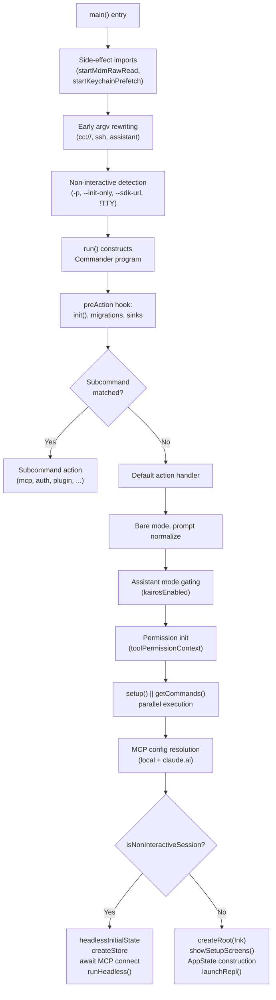
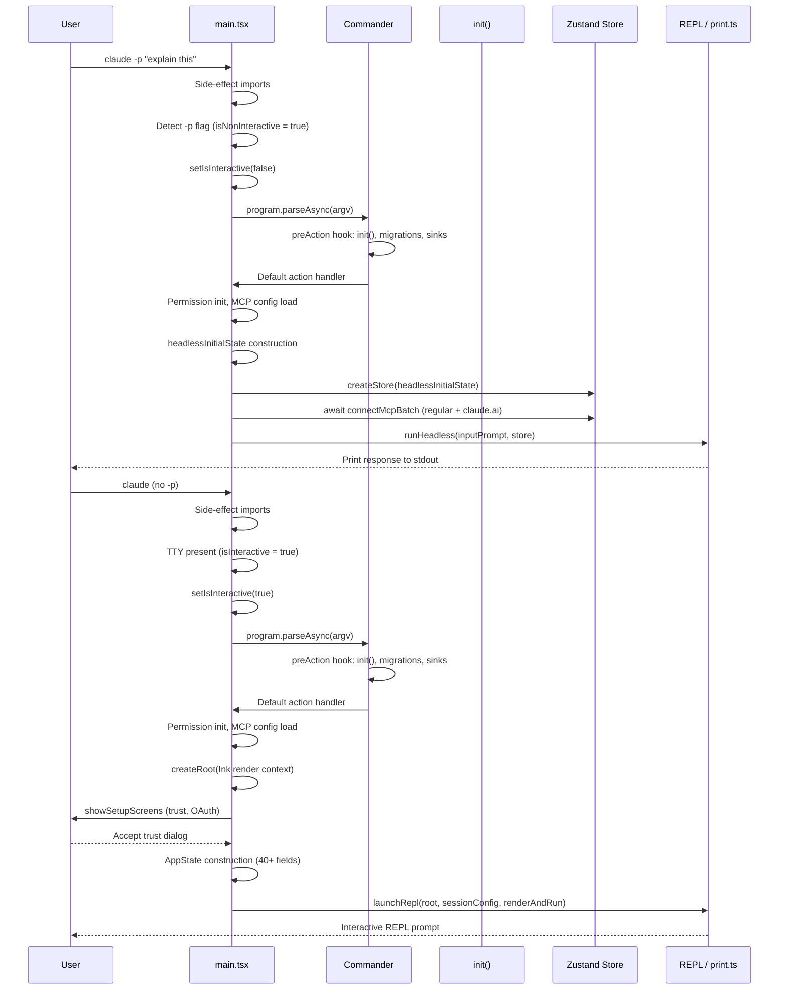

# `main.tsx` and the Command Router

## Overview

`main.tsx` is the entry point for every invocation of the cc CLI. At roughly 4,700 lines of code, it is the single largest file in the codebase and serves as the central dispatch for all runtime modes: the interactive REPL, the headless print pipeline, MCP server management, plugin operations, authentication, and a dozen auxiliary subcommands. The file's size is not accidental; it reflects a deliberate architectural choice to keep the full startup sequence -- from early argv rewriting through Commander.js subcommand routing, permission initialization, MCP config resolution, and the final bifurcation into headless versus interactive paths -- visible in one linear reading. This chapter traces that sequence end-to-end, examining the data structures that carry state across phases, the control-flow decisions that determine which code path runs, and the edge cases that make the router resilient enough for production use.

The file is organized as a cascade: top-level side effects (module evaluation time), the `main()` function that performs early argv manipulation, the `run()` function that builds the Commander program and registers subcommands, and the default `.action()` handler that contains the bulk of session initialization. The bifurcation between headless and interactive modes occurs deep inside that action handler, around line 2585, after hundreds of lines of shared setup. Understanding where shared work ends and mode-specific work begins is essential for anyone extending the harness.

## Data structures and contracts

Three data structures govern the command router's behavior: the `PendingConnect`, `PendingSSH`, and `PendingAssistantChat` types, which are populated by early argv rewriting before Commander sees the arguments.

```typescript
// src/main.tsx:L543-L552 — PendingConnect: early argv stash for cc:// URLs
type PendingConnect = {
  url: string | undefined;
  authToken: string | undefined;
  dangerouslySkipPermissions: boolean;
};
const _pendingConnect: PendingConnect | undefined = feature('DIRECT_CONNECT') ? {
  url: undefined,
  authToken: undefined,
  dangerouslySkipPermissions: false
} : undefined;
```

The `PendingConnect` structure captures a parsed `cc://` URL and its auth token before Commander's argument parser runs. The `feature('DIRECT_CONNECT')` guard means the object is `undefined` in builds that lack the feature flag, providing compile-time elimination of the entire code path. The `dangerouslySkipPermissions` flag is extracted from the raw argv and stashed here so the rewritten argv (which strips the flag) does not lose the security override. This pattern -- mutate module-scoped mutable state, then rewrite `process.argv` -- repeats for SSH and assistant modes.

```typescript
// src/main.tsx:L567-L584 — PendingSSH: argv-rewriting stash for remote sessions
type PendingSSH = {
  host: string | undefined;
  cwd: string | undefined;
  permissionMode: string | undefined;
  dangerouslySkipPermissions: boolean;
  local: boolean;
  extraCliArgs: string[];
};
const _pendingSSH: PendingSSH | undefined = feature('SSH_REMOTE') ? {
  host: undefined,
  cwd: undefined,
  permissionMode: undefined,
  dangerouslySkipPermissions: false,
  local: false,
  extraCliArgs: []
} : undefined;
```

The `PendingSSH` type is richer because the SSH subcommand accepts positional arguments (`host`, optional `cwd`) and several flags (`--permission-mode`, `--local`, `--dangerously-skip-permissions`, `--continue`, `--resume`, `--model`). The `extraCliArgs` array accumulates flags that must be forwarded to the remote CLI on its initial spawn. The `local` boolean enables an end-to-end test mode that exercises the auth-proxy and unix-socket plumbing without a real remote host.

The third key contract is the non-interactive detection logic, which determines session mode before any subcommand handler runs:

```typescript
// src/main.tsx:L799-L812 — Non-interactive session detection
const cliArgs = process.argv.slice(2);
const hasPrintFlag = cliArgs.includes('-p') || cliArgs.includes('--print');
const hasInitOnlyFlag = cliArgs.includes('--init-only');
const hasSdkUrl = cliArgs.some(arg => arg.startsWith('--sdk-url'));
const isNonInteractive = hasPrintFlag || hasInitOnlyFlag || hasSdkUrl || !process.stdout.isTTY;

if (isNonInteractive) {
  stopCapturingEarlyInput();
}

const isInteractive = !isNonInteractive;
setIsInteractive(isInteractive);
```

This four-way disjunction is the authoritative definition of "non-interactive" in cc: the `-p`/`--print` flag, `--init-only`, an `--sdk-url` prefix, or a missing TTY. The result is stored in global bootstrap state via `setIsInteractive()` and read throughout the codebase by `getIsNonInteractiveSession()`. The `stopCapturingEarlyInput()` call is critical: in interactive mode, the harness captures keystrokes that arrive before the REPL renders; in non-interactive mode those keystrokes would corrupt stdin, so capturing is halted immediately.

Beyond these early-contract types, the default action handler constructs two large application-state objects. The interactive path builds an `AppState` object starting at `src/main.tsx:L2926`, which contains over 40 fields covering settings, tasks, agent name registries, verbose mode, tool permission context, MCP client state, plugin status, bridge/repl state, notifications, file history, effort values, fast-mode flags, and team context. The headless path builds a parallel `headlessInitialState` at `src/main.tsx:L2624-L2650` that shares the default state but overrides MCP clients, tool permission context, effort value, fast mode, advisor model, and the kairos-enabled flag. Both are fed into `createStore()` from `src/state/store.js`, producing Zustand stores that the REPL and print pipeline read and mutate throughout the session.

The `sessionConfig` object at `src/main.tsx:L3071-L3090` is another key contract. It carries debug flags, the full command list (including MCP commands), initial tools, MCP clients, agent definitions, system prompt overrides, task list IDs, and thinking configuration. This object is passed directly to every `launchRepl()` call in the interactive path and is the primary mechanism by which the default action handler communicates its resolved state to the REPL.

## Control flow

The control flow through `main.tsx` has five distinct phases: side-effect imports, early argv rewriting, Commander program construction, the default action handler, and the headless/interactive bifurcation.

### Phase 1: Side-effect imports (lines 1-200)

The first 200 lines are dominated by imports, but three side effects execute before any other module evaluation completes. `profileCheckpoint('main_tsx_entry')` marks the entry timestamp for the startup profiler. `startMdmRawRead()` fires MDM subprocesses in parallel with the remaining imports. `startKeychainPrefetch()` launches both macOS keychain reads (OAuth and legacy API key) concurrently, avoiding the sequential synchronous spawns that would otherwise add ~65ms on every macOS startup `src/main.tsx:L1-L20`. The lazy-require pattern for teammate utilities (`getTeammateUtils`, `getTeammatePromptAddendum`, `getTeammateModeSnapshot`) and the feature-gated conditional imports for coordinator mode and assistant mode at `src/main.tsx:L68-L81` break circular dependencies while keeping dead-code elimination effective. The coordinator module is only `require()`'d when `feature('COORDINATOR_MODE')` is truthy; otherwise the binding is `null` and the entire import path is elided at bundle time.

### Phase 2: Early argv rewriting in `main()` (lines 585-856)

The `main()` function begins with security hardening -- setting `NoDefaultCurrentDirectoryInExePath` on Windows to prevent PATH hijacking -- then performs a series of argv rewrites. Each rewrite follows the same pattern: detect a special positional argument in `process.argv`, extract relevant flags into a module-scoped mutable object, strip those tokens from `process.argv`, and let the rewritten argv flow into Commander.

The cc:// URL handler at `src/main.tsx:L612-L642` is the clearest example. When a `cc://` or `cc+unix://` URL is found in argv, the code parses it via `parseConnectUrl`, stashes the server URL and auth token in `_pendingConnect`, and then diverges based on mode. For headless mode, it rewrites argv to the internal `open` subcommand, inserting `open` and the raw URL as positionals. For interactive mode, it strips the URL and flags, leaving the remaining argv for the default action handler. The key insight is that the rewrite happens before Commander parses anything; from Commander's perspective, `claude cc://server` becomes either `claude open cc://server` (headless) or `claude` (interactive).

The assistant handler at `src/main.tsx:L685-L700` uses a positional-0 check (`rawArgs[0] === 'assistant'`) rather than `indexOf`, because `claude -p "explain assistant"` would false-positive on an `indexOf` scan. Only the first positional argument is checked, matching the SSH pattern. If a session ID follows `assistant`, both tokens are spliced; otherwise only `assistant` is removed, and `_pendingAssistantChat.discover` is set to `true` to trigger session discovery.

The SSH handler at `src/main.tsx:L706-L794` is the most complex because it must extract `--permission-mode`, `--dangerously-skip-permissions`, `--local`, `--continue`, `--resume`, and `--model` before rewriting. It uses a helper function `extractFlag` that handles both `--flag value` and `--flag=value` syntax, appending extracted flags to `_pendingSSH.extraCliArgs` and removing them from the raw argv array. The helper is called five times to build up the forwarding list before the host and cwd are extracted from positionals.

### Phase 3: Commander program construction in `run()` (lines 884-1006)

The `run()` function creates a `CommanderCommand` and attaches a `preAction` hook that runs before every command action. This hook resolves the async subprocess loads started at module evaluation time (`ensureMdmSettingsLoaded`, `ensureKeychainPrefetchCompleted`), calls `init()` to bootstrap the runtime, attaches analytics sinks via `initSinks()`, runs data migrations via `runMigrations()`, and loads remote managed settings and policy limits `src/main.tsx:L907-L967`. The hook also wires up the `--plugin-dir` option for subcommands, since subcommand actions never see the top-level program options.

The program's default action is registered at `src/main.tsx:L1006` as a single `.action(async (prompt, options) => { ... })` call that contains the entire interactive and headless initialization path. Before the action, Commander options are declared with `.option()` and `.addOption()` chains spanning roughly 150 lines, covering flags like `--debug`, `--print`, `--bare`, `--output-format`, `--dangerously-skip-permissions`, `--model`, `--system-prompt`, `--append-system-prompt`, `--permission-mode`, `--mcp-config`, `--tools`, `--allowed-tools`, `--disallowed-tools`, `--agent`, `--betas`, `--fallback-model`, `--settings`, `--add-dir`, `--ide`, `--strict-mcp-config`, `--session-id`, `--name`, `--agents`, `--setting-sources`, `--plugin-dir`, and `--file`. These entry flags constitute the first configuration surface described in HER section 7: they determine which harness behaviors are activated before any model interaction occurs.

### Phase 4: The default action handler (lines 1006-2861)

The default action handler is the largest contiguous block in the file, spanning approximately 1,850 lines. It begins with bare-mode setup and prompt normalization, then flows through a series of initialization steps that progressively build up session state.

**Bare mode and prompt normalization.** When `--bare` is passed, the handler sets `CLAUDE_CODE_SIMPLE=1` in the environment `src/main.tsx:L1012-L1016`. This environment variable is checked by `isBareMode()` throughout the codebase, gating plugin initialization, MCP auto-discovery, startup prefetches, background housekeeping, and keychain reads. The handler also normalizes the prompt: if the user types `claude code`, the literal word "code" is treated as no prompt, and a tip is shown `src/main.tsx:L1019-L1024`.

**Assistant mode gating.** The `kairosEnabled` flag is computed through a trust-gated flow at `src/main.tsx:L1048-L1088`. If `--assistant` is set, `markAssistantForced()` is called to skip the GrowthBook gate. Otherwise, the code checks whether the directory has been trusted via `checkHasTrustDialogAccepted()` and then queries `kairosGate.isKairosEnabled()`. If enabled, it pre-seeds an in-process team via `initializeAssistantTeam()` and sets `setKairosActive(true)`. This flow must run before `setup()` captures the teammate-mode snapshot.

**Permission initialization.** The handler calls `initializeToolPermissionContext()` with the CLI-specified permission mode, tool lists, and additional directories `src/main.tsx:L1748-L1777`. The result includes a `toolPermissionContext`, a list of warnings, and any detected overly broad bash permissions. For internal builds, overly broad rules like `Bash(*)` are stripped via `removeDangerousPermissions()`. The `stripDangerousPermissionsForAutoMode()` call gates on the `TRANSCRIPT_CLASSIFIER` feature flag and removes dangerous permissions when auto mode is active.

**Setup, commands, and agents in parallel.** The handler parallelizes `setup()` with `getCommands()` and `getAgentDefinitionsWithOverrides()` via `Promise.all` at `src/main.tsx:L1927-L1934`. The `setup()` function (~28ms, mostly UDS messaging socket bind) is sequenced after bundled skills and plugins are initialized in memory (pure array pushes under 1ms). When `--worktree` is enabled, `setup()` may `process.chdir()` into the worktree, so commands and agents are loaded after the await rather than in parallel. The parallelization saves ~30ms on the common non-worktree path.

**MCP config loading.** MCP configs are loaded in two stages. The local file-based configs are kicked off early via `getClaudeCodeMcpConfigs(dynamicMcpConfig)` at `src/main.tsx:L1809-L1814` and overlapped with setup and command loading. The claude.ai configs are fetched conditionally for headless mode at `src/main.tsx:L1784-L1797`, gated by `isNonInteractiveSession`, `strictMcpConfig`, enterprise MCP config absence, and `isBareMode()`. Enterprise MCP policy enforcement at `src/main.tsx:L1584-L1595` rejects dynamic configs that are not of type `sdk` when an enterprise MCP config is present.

**Tool loading and synthetic output.** Tools are loaded via `getTools(toolPermissionContext)` at `src/main.tsx:L1868`, then optionally filtered by coordinator mode. The `SyntheticOutputTool` is appended after the main tool list when `--json-schema` is provided and the feature is enabled `src/main.tsx:L1879-L1901`.

**Input prompt resolution.** The `getInputPrompt()` function at `src/main.tsx:L857-L883` handles the non-TTY stdin case. When stdin is not a TTY (and not the `mcp` subcommand), it reads piped data with a 3-second timeout via `peekForStdinData`. If no data arrives within 3 seconds, it warns and proceeds without it. For `stream-json` input format, it returns the raw stdin stream as an `AsyncIterable`.

### Phase 5: Headless versus interactive bifurcation (line 2585)

The critical branching point is `if (isNonInteractiveSession)` at `src/main.tsx:L2585`. The two paths share nothing after this point except the tools, MCP configs, and permission context computed earlier.

**Headless path.** The headless path constructs a `headlessInitialState` at `src/main.tsx:L2624-L2650`, creates a Zustand store via `createStore(headlessInitialState, onChangeAppState)`, and connects MCP servers synchronously. The `connectMcpBatch()` function at `src/main.tsx:L2691-L2718` pushes pending clients into the store, then calls `getMcpToolsCommandsAndResources()` to resolve each batch. Claude.ai MCP connectors are raced against a 5-second timeout; if they do not resolve in time, the router proceeds and the background promise continues updating the store. The headless path then calls `runHeadless()` with the store getter and setter, the filtered command list, tools, SDK MCP configs, and agent definitions `src/main.tsx:L2829-L2859`. The command list for headless mode is filtered to include only prompt commands with `!command.disableNonInteractive` and local commands with `command.supportsNonInteractive` `src/main.tsx:L2622`.

**Interactive path.** The interactive path creates an Ink root at `src/main.tsx:L2226-L2229`, logs the startup timer, and calls `showSetupScreens()` which may display the trust dialog, OAuth onboarding, or the resume chooser. After onboarding, the handler refreshes auth-dependent services (remote managed settings, policy limits, GrowthBook feature flags, trusted device enrollment) at `src/main.tsx:L2282-L2296`. The handler then validates the org restriction via `validateForceLoginOrg()` and initializes the LSP server manager. The interactive `AppState` at `src/main.tsx:L2926-L3036` is considerably larger than the headless variant, including bridge/repl state, notification queues, file history, attribution, speculation state, prompt suggestion state, and skill improvement state. The `sessionConfig` object at `src/main.tsx:L3071-L3090` bundles the resolved state and is passed to every `launchRepl()` call.

The interactive path has several branches depending on session type: `--continue` loads the most recent conversation via `loadConversationForResume()` at `src/main.tsx:L3101-L3155`; direct connect (`cc://` URL) creates a direct-connect session; `--teleport` or `--remote` creates or resumes a Claude Code Remote session; and the default path launches the REPL with the initial prompt. Each branch calls `launchRepl(root, { getFpsMetrics, stats, initialState }, sessionConfig, renderAndRun)` with different `initialState` and `sessionConfig` values but the same structural signature.

```typescript
// src/main.tsx:L2624-L2653 — Headless initial state and store creation
const headlessInitialState: AppState = {
  ...defaultState,
  mcp: {
    ...defaultState.mcp,
    clients: mcpClients,
    commands: mcpCommands,
    tools: mcpTools
  },
  toolPermissionContext,
  effortValue: parseEffortValue(options.effort) ?? getInitialEffortSetting(),
  ...(isFastModeEnabled() && {
    fastMode: getInitialFastModeSetting(effectiveModel ?? null)
  }),
  ...(isAdvisorEnabled() && advisorModel && {
    advisorModel
  }),
  ...(feature('KAIROS') ? {
    kairosEnabled
  } : {})
};

const headlessStore = createStore(headlessInitialState, onChangeAppState);
```

The `headlessInitialState` spreads from `getDefaultAppState()` and overrides only the fields that differ from the interactive default. The MCP sub-object receives the already-resolved clients, commands, and tools from the earlier `getMcpToolsCommandsAndResources()` call. The `kairosEnabled` spread is gated on `feature('KAIROS')` so the field is absent in builds that lack the feature, preventing the async path in `executeForkedSlashCommand` and AgentTool from being reachable in those builds.





## Edge cases and failure modes

**Headless SSH rejection.** The SSH handler explicitly rejects `-p`/`--print` in combination with `ssh` because SSH sessions need the local REPL to drive permission prompts and interrupts. If the user passes both, the process writes an error to stderr and calls `gracefulShutdownSync(1)` `src/main.tsx:L786-L790`. This is not a Commander validation; it is a hand-coded check in the argv-rewriting phase because Commander never sees the `-p` flag after the rewrite strips it. The check scans the `rest` array (remaining args after host/cwd extraction) rather than the full argv, which means `claude ssh host -p` is caught but `claude -p ssh host` would have already been handled by the earlier non-interactive detection at line 799.

**Deep-link early exit.** The `--handle-uri` flag and the macOS URL handler both invoke `handleDeepLinkUri` and `process.exit()` before Commander runs `src/main.tsx:L647-L676`. This means deep-link handling skips the full initialization pipeline: no `init()`, no analytics sinks, no migrations. The early exit is intentional because deep links only need to parse a URI and open a terminal window. The macOS branch at `src/main.tsx:L666-L676` detects the LaunchServices launch by checking `process.env.__CFBundleIdentifier === 'com.anthropic.claude-code-url-handler'`, which is a more precise signal than heuristic process-detection approaches.

**Print-mode subcommand skip.** When `isPrintMode` is true and no `cc://` URL is present, the router skips all 52 subcommand registrations and goes directly to `program.parseAsync(process.argv)` `src/main.tsx:L3883-L3890`. This optimization was measured at ~65ms on baseline, mostly consumed by the `isBridgeEnabled()` call (25ms settings Zod parse + 40ms sync keychain subprocess). The comment at `src/main.tsx:L3875-L3882` documents the measurement and the rationale. The check must happen after the `cc://` URL rewrite because `claude -p cc://server` is rewritten to `claude open cc://server -p`, which needs the `open` subcommand to be registered.

**Claude.ai MCP timeout.** In headless mode, the `claudeaiConfigPromise` is raced against a 5-second timeout. If claude.ai connectors are not ready after 5 seconds, the router proceeds without them; the background connection continues and updates the store so subsequent turns see the connectors `src/main.tsx:L2738-L2808`. This prevents a single slow MCP server from blocking a single-turn print invocation indefinitely. The timeout value of 5 seconds was chosen after gh-23725 made the claude.ai connect blocking for single-turn `-p`, but p99 startup climbed to 76 seconds with 40+ slow connectors.

**Overly broad shell permissions.** For internal ("ant") builds, the router detects overly broad bash allow rules like `Bash(*)` and `PowerShell(*)`, logs a debug message, and strips them from the permission context via `removeDangerousPermissions` `src/main.tsx:L1763-L1768`. This is a defense-in-depth measure: such rules could be injected via project-level settings files in untrusted repositories, and stripping them at the router level prevents the permission system from ever seeing them.

**Stdin timeout on non-TTY.** When stdin is not a TTY and the input format is text (not stream-json), `getInputPrompt()` reads from stdin with a 3-second timeout via `peekForStdinData()` `src/main.tsx:L858-L883`. If no data arrives within 3 seconds, the function writes a warning to stderr and proceeds without piped input. The timeout covers slow producers like `curl` or `jq` on large files while protecting against inherited pipes from parent processes that never write. The 3-second window was chosen to balance responsiveness against false negatives for slow-but-legitimate producers.

**Graceful shutdown during initialization.** If `process.exitCode` is set after the interactive setup screens (for example, the user rejected the trust dialog), the handler checks `process.exitCode !== undefined` at `src/main.tsx:L2312-L2314` and returns early, skipping all subsequent operations including API key helper execution. Without this guard, a rejected trust dialog would still trigger network calls via `apiKeyHelper`, which would execute code in the untrusted directory.

## Where cc diverges from the published pattern

The HER identifies entry flags as a first-class configuration surface (section 7), noting that flags like `--model`, `--effort`, `--permission-mode`, and `--headless` determine harness behavior before any model interaction occurs. The cc implementation takes this further than the pattern implies: entry flags do not merely configure the harness; they determine which harness code paths are even evaluated. The `isPrintMode` check at `src/main.tsx:L3883` skips subcommand registration entirely, and the `isBareMode()` check gates plugin initialization, MCP auto-discovery, startup prefetches, and background housekeeping. These are not configuration toggles; they are conditional module-loading decisions that eliminate entire subsystems from the process.

The argv-rewriting pattern is another divergence. Rather than using Commander's native subcommand routing for `cc://` URLs, SSH, and assistant mode, cc strips these tokens from `process.argv` and rewrites them so the default action handler runs with full TUI support. The comment at `src/main.tsx:L609-L611` explains why: Commander subcommands get a stripped-down handler, but interactive mode needs the full setup pipeline (trust dialog, Ink root, onboarding). The rewrite ensures that `claude cc://...` and `claude ssh host` both land in the default action handler, where the full interactive path is available.

The `preAction` hook is also unconventional. Rather than requiring each subcommand to call `init()` and attach sinks, the `preAction` hook guarantees these run before every action, including the default `src/main.tsx:L907-L934`. This eliminates an entire class of bugs where a subcommand forgets to initialize analytics, but it also means that running `claude mcp list` pays the cost of `init()` even though MCP subcommands never use the model or the REPL. The tradeoff favors correctness over minimal startup time for auxiliary commands.

The parallel initialization strategy at `src/main.tsx:L1927-L1934` diverges from the sequential pattern described in HER. Rather than loading setup, commands, and agents sequentially, cc kicks commands and agents as promises before awaiting setup, then joins them with `Promise.all` after setup completes. The `commandsPromise?.catch(() => {})` and `agentDefsPromise?.catch(() => {})` suppress transient `unhandledRejection` events that would otherwise fire during the ~28ms setup await before `Promise.all` joins the promises. This parallelization is gated on `!worktreeEnabled` because `setup()` calls `process.chdir()` in worktree mode, and commands must be loaded from the post-chdir cwd.

The `--bare` flag represents a form of back-pressure that goes beyond the HER description. Section 7.6 describes back-pressure as swallowing output and only surfacing errors. The `--bare` flag implements a stronger form: it eliminates entire categories of work (plugin sync, MCP auto-discovery, keychain reads, CLAUDE.md auto-discovery, startup prefetches, background housekeeping) rather than merely suppressing their output. Auth is restricted to `ANTHROPIC_API_KEY` or `apiKeyHelper` via `--settings`; OAuth and keychain are never read. This makes bare mode suitable for scripted calls where startup latency matters more than feature richness.

## Developer takeaways for building a long-running agent

Building a long-running agent entry point demands a clear separation between shared initialization and mode-specific code paths. The cc codebase demonstrates that the startup sequence is not a simple switch statement; it is a pipeline where early decisions (is this non-interactive? is bare mode on?) gate later work (MCP auto-discovery, plugin sync, background prefetches). The most impactful optimization in this file is the print-mode subcommand skip, which eliminates ~65ms of subcommand registration for the common `-p` invocation path by checking `process.argv` before building the Commander tree. The argv-rewriting pattern, while initially surprising, solves a real problem: subcommand handlers are too narrow for interactive TUI initialization, and duplicating the setup pipeline across multiple handlers would guarantee drift. The centralized `preAction` hook prevents that drift at the cost of over-initializing auxiliary commands. For any agent harness, the critical design decision is where to place the bifurcation point between headless and interactive paths. Placing it too early loses shared work; placing it too late forces headless callers to pay for Ink rendering and trust dialogs they will never see. The cc choice -- shared initialization through MCP config resolution, then a clean branch at line 2585 -- is a workable balance that keeps both paths testable and the shared setup linear.
