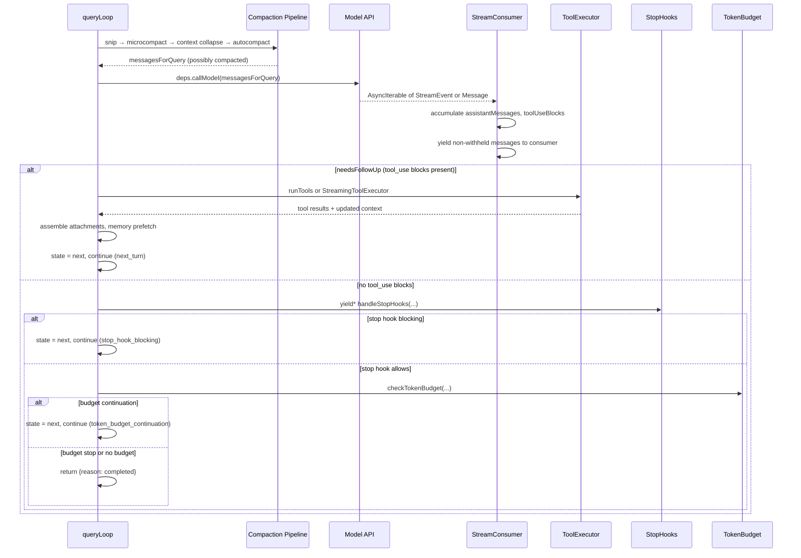
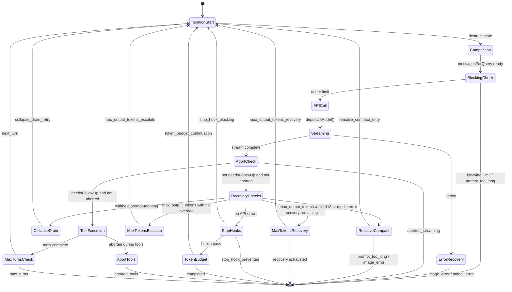
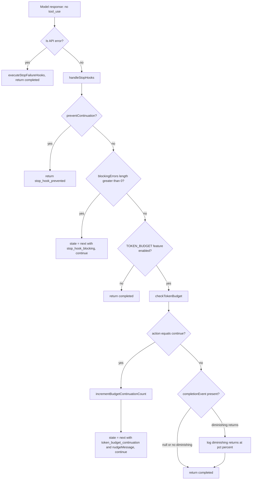

# The Query Loop: Heartbeat of the Agent

## Overview

Every agentic system has a central pulse -- a loop that alternates between thinking and acting, between soliciting model output and dispatching tool calls. In cc, that pulse is `queryLoop()`, an async generator spanning roughly 1,500 lines in `src/query.ts`. It is the single function through which every user turn, every subagent invocation, and every recovery retry must pass. Understanding it is the prerequisite for understanding every other subsystem: compaction, tool execution, stop hooks, and token budgets all plug into specific sites within this loop.

The loop's contract is deceptively simple on the surface -- an `AsyncGenerator<StreamEvent | Message, Terminal>` that yields events outward to consumers and returns a terminal reason when it stops. Beneath that contract lies a state machine with at least nine distinct continuation paths, three error recovery strategies, two compaction pipelines (proactive and reactive), and a streaming tool executor that overlaps model output with tool invocation. The loop is not a single `while` body executing sequentially; it is a branching, resumable coroutine whose `continue` statements encode its transition table.

The public entry point, `query()`, is a thin wrapper that delegates to `queryLoop()` and fires command-lifecycle notifications on normal exit. This separation matters because `yield*` propagates both yields and returns through the generator chain, so the lifecycle cleanup in `query()` is skipped on throw (error propagation) and on `.return()` (the outer generator's Return completion closes both generators) (`src/query.ts:L229-L238`). The result is a symmetric guarantee: consumed commands are either completed or the entire turn fails, never left in an ambiguous half-processed state.

This chapter walks through the full lifecycle of one loop iteration, from state initialization through compaction, API streaming, tool execution, and the decision to continue or terminate. Every continuation path is traced, every edge case documented, and every divergence from the published agentic patterns called out explicitly.

## Data structures and contracts

### The State record

Mutable cross-iteration state lives in a single `State` object, destructured at the top of each loop iteration and reassigned wholesale at each `continue` site. This pattern replaces nine separate mutable variables with a single struct whose transitions are atomic and inspectable:

```typescript
// src/query.ts:L204-L217 — Loop state carried between iterations
type State = {
  messages: Message[]
  toolUseContext: ToolUseContext
  autoCompactTracking: AutoCompactTrackingState | undefined
  maxOutputTokensRecoveryCount: number
  hasAttemptedReactiveCompact: boolean
  maxOutputTokensOverride: number | undefined
  pendingToolUseSummary: Promise<ToolUseSummaryMessage | null> | undefined
  stopHookActive: boolean | undefined
  turnCount: number
  // Why the previous iteration continued. Undefined on first iteration.
  // Lets tests assert recovery paths fired without inspecting message contents.
  transition: Continue | undefined
}
```

The `transition` field is the diagnostic key. Each `continue` site writes a `Continue` value with a `reason` string -- `collapse_drain_retry`, `reactive_compact_retry`, `max_output_tokens_escalate`, `max_output_tokens_recovery`, `stop_hook_blocking`, `token_budget_continuation`, or `next_turn`. Tests assert against these reasons rather than inspecting message contents, making recovery-path coverage deterministic even when message text varies across model versions (`src/query.ts:L214-L217`).

The `pendingToolUseSummary` field deserves special attention. Tool-use summaries are generated by a Haiku call that fires after a tool batch completes. Rather than blocking the next API call on the summary, the loop captures the `Promise` in state and awaits it at the top of the next iteration, overlapping Haiku's ~1 second resolution with the model's 5-30 second streaming (`src/query.ts:L1055-L1060`). This pipelining pattern is a recurring theme: any work that can overlap with the model's thinking time should be fired as a `Promise` and consumed lazily.

The `hasAttemptedReactiveCompact` boolean is the circuit breaker for the recovery spiral described in HER section 6.7. When reactive compaction fires but cannot reduce context below the API's threshold, and stop hooks inject blocking errors that increase context further, the loop would spin indefinitely without this guard. The flag is preserved across stop-hook blocking errors specifically to prevent this spiral, and its preservation was a bug fix -- resetting it to `false` caused "an infinite loop: compact, still too long, error, stop hook blocking, compact, burning thousands of API calls" (`src/query.ts:L1293-L1298`).

### QueryParams and the entry point

The `QueryParams` type defines the immutable inputs that never change during the loop's lifetime. The `deps` field enables the dependency-injection pattern that makes the loop testable:

```typescript
// src/query.ts:L181-L199 — Query parameters (immutable for the loop's lifetime)
export type QueryParams = {
  messages: Message[]
  systemPrompt: SystemPrompt
  userContext: { [k: string]: string }
  systemContext: { [k: string]: string }
  canUseTool: CanUseToolFn
  toolUseContext: ToolUseContext
  fallbackModel?: string
  querySource: QuerySource
  maxOutputTokensOverride?: number
  maxTurns?: number
  skipCacheWrite?: boolean
  taskBudget?: { total: number }
  deps?: QueryDeps
}
```

The `taskBudget` parameter deserves explanation. It is distinct from the token-budget continuation feature: `taskBudget` is the API-level `task_budget` (output_config.task_budget) that limits the whole agentic turn from the server side, while the `checkTokenBudget` subsystem is a client-side guard that detects diminishing returns and nudges the model to continue. The loop tracks `taskBudgetRemaining` separately, computing it from cumulative API usage after each compaction boundary, because the server cannot see post-compact history and would under-count spend without the carryover (`src/query.ts:L283-L291`).

### QueryConfig: snapshot once at entry

`QueryConfig` captures runtime gates (streaming tool execution, tool-use summaries, fast mode) once at loop entry. The explicit design decision documented in `src/query/config.ts:L7-L14` is that `feature()` gates are excluded because they are tree-shaking boundaries -- they must remain inline at guarded blocks for dead-code elimination. Statsig gates, which already admit staleness via their `CACHED_MAY_BE_STALE` suffix, are safe to snapshot because their values do not change the binary's code paths.

```typescript
// src/query/config.ts:L15-L27 — QueryConfig type
export type QueryConfig = {
  sessionId: SessionId
  gates: {
    streamingToolExecution: boolean
    emitToolUseSummaries: boolean
    isAnt: boolean
    fastModeEnabled: boolean
  }
}
```

The `buildQueryConfig()` factory reads session state, Statsig flags, and environment variables once, producing a frozen snapshot that the loop references throughout its lifetime. This is a deliberate architectural boundary: future extraction of a `step()` pure reducer would take `(state, event, config)` where config is plain data, and the snapshot pattern makes that extraction tractable without refactoring (`src/query/config.ts:L8-L11`).

### QueryDeps: testability through injection

The dependency-injection system in `src/query/deps.ts` provides four overridable functions: `callModel`, `microcompact`, `autocompact`, and `uuid`. The `productionDeps()` factory wires the real implementations; tests supply fakes directly, bypassing the `spyOn`-per-module boilerplate that previously infected six to eight test files per dependency:

```typescript
// src/query/deps.ts:L21-L40 — Dependency injection types and production factory
export type QueryDeps = {
  callModel: typeof queryModelWithStreaming
  microcompact: typeof microcompactMessages
  autocompact: typeof autoCompactIfNeeded
  uuid: () => string
}

export function productionDeps(): QueryDeps {
  return {
    callModel: queryModelWithStreaming,
    microcompact: microcompactMessages,
    autocompact: autoCompactIfNeeded,
    uuid: randomUUID,
  }
}
```

The scope is intentionally narrow. The comment at `src/query/deps.ts:L18-L20` notes that future PRs can expand to include `runTools`, `handleStopHooks`, `logEvent`, and queue operations. This incremental approach avoids a big-bang refactor while proving the pattern's viability. Tests that import `QueryDeps` for typing are already importing `query.ts` (which transitively imports the real modules), so there is no additional module-graph cost from the typing dependency.

### BudgetTracker and token budget decisions

The token-budget subsystem, gated behind `feature('TOKEN_BUDGET')`, uses a `BudgetTracker` that records continuation count, delta tokens since the last check, and global turn tokens. The `checkTokenBudget` function returns a discriminated union: `ContinueDecision` injects a nudge message and continues the loop; `StopDecision` terminates with an optional `completionEvent` that records diminishing-returns detection:

```typescript
// src/query/tokenBudget.ts:L3-L4 — Threshold constants
const COMPLETION_THRESHOLD = 0.9
const DIMINISHING_THRESHOLD = 500
```

Diminishing returns fire when three or more continuations have occurred and the last two deltas each produced fewer than 500 tokens -- a heuristic for the agent spinning without making progress (`src/query/tokenBudget.ts:L59-L62`). When the budget tracker detects this condition, it returns a `StopDecision` with `diminishingReturns: true` in the completion event, logging the percentage at which the loop terminated. This is a direct implementation of the progress-detection prescription from HER section 6.7: no meaningful state change after N iterations should terminate the loop.

The `checkTokenBudget` function also handles the edge case where `agentId` is defined (subagents) or `budget` is null/zero: it immediately returns `StopDecision` with a null completion event, bypassing the budget logic entirely (`src/query/tokenBudget.ts:L51-L53`). Subagents have their own budget semantics managed by the parent session, and client-side budget tracking would double-count.

## Control flow

### The loop skeleton

The outer structure is an infinite `while (true)` loop. Each iteration destructures state, runs the compaction pipeline, calls the model, processes streaming output, executes tools, and either returns a terminal or writes a new `State` and continues:

```typescript
// src/query.ts:L307-L321 — Loop entry and state destructuring
while (true) {
  let { toolUseContext } = state
  const {
    messages,
    autoCompactTracking,
    maxOutputTokensRecoveryCount,
    hasAttemptedReactiveCompact,
    maxOutputTokensOverride,
    pendingToolUseSummary,
    stopHookActive,
    turnCount,
  } = state
```

Only `toolUseContext` is reassigned within an iteration (for query-tracking and message updates). The remaining fields are read-only between continue sites. This discipline makes state transitions auditable: every mutation goes through `state = { ... }`, never through in-place field assignment. The comment at `src/query.ts:L265-L267` explains the rationale: "Continue sites write `state = { ... }` instead of 9 separate assignments."

### Prefetch and pipelining before the iteration body

Before the main iteration body begins, the loop fires two overlapping prefetch operations. Memory prefetch (`startRelevantMemoryPrefetch`) runs once per user turn because the prompt is invariant across loop iterations -- per-iteration firing would ask the side query the same question N times (`src/query.ts:L297-L304`). The `using` keyword ensures the prefetch disposable is cleaned up on all generator exit paths, including throw and `.return()`. Skill discovery prefetch runs per-iteration but uses a `findWritePivot` guard that returns early on non-write iterations, replacing a blocking `assistant_turn` path that previously ran inside `getAttachmentMessages` and found nothing 97% of the time in production (`src/query.ts:L323-L335`).

These prefetches illustrate a key design principle of the query loop: any work that might be useful and can run concurrently with the model should be started eagerly and consumed lazily. The loop's yield-based control flow naturally supports this pattern because `yield` suspends the generator, giving the event loop time to advance pending promises.

### Sequence of a full iteration

The following diagram traces one complete loop iteration from entry through the continue or return decision:



### Compaction pipeline: four stages before the API call

Before the model ever sees a message, the loop runs four compaction stages in sequence, each operating on the output of the previous one. The stages are: history snip, microcompact, context collapse, and autocompact (`src/query.ts:L401-L543`). Each stage has a distinct purpose within the compaction hierarchy defined in the terminology registry.

History snip removes old tool-result content and yields a boundary message if any content was snipped (`src/query.ts:L401-L410`). The `snipTokensFreed` count is plumbed into the autocompact threshold check because `tokenCountWithEstimation` alone cannot see what snip removed -- it reads usage from the protected-tail assistant message, which survives snip unchanged (`src/query.ts:L396-L400`).

Microcompact selectively removes low-value messages while preserving key context. When the `CACHED_MICROCOMPACT` feature is enabled, the loop defers the boundary message until after the API response, using actual `cache_deleted_input_tokens` reported by the API instead of client-side estimates (`src/query.ts:L412-L426`).

Context collapse is a more aggressive reduction that archives granular messages into summaries. It runs before autocompact so that if collapse gets the context under the autocompact threshold, autocompact is a no-op and the loop keeps granular context instead of a single summary (`src/query.ts:L429-L447`). Nothing is yielded during collapse -- the collapsed view is a read-time projection over the REPL's full history, persisting across turns via a commit log that `projectView()` replays on every entry.

Autocompact is the final stage, generating a full conversational summary when token limits approach. When it fires, the loop captures the pre-compact final context window and subtracts it from `taskBudgetRemaining`, ensuring the server does not under-count spend after the conversation history is replaced with a summary (`src/query.ts:L504-L515`). The `autoCompactTracking` state is reset on every compact so that `turnCounter` and `turnId` reflect the most recent compaction event (`src/query.ts:L521-L526`).

### API streaming and the fallback-retry loop

The inner `while (attemptWithFallback)` loop wraps the model API call. On `FallbackTriggeredError`, the loop switches to the fallback model, clears accumulated assistant messages, yields tombstones for orphaned thinking blocks, and retries with stripped signature blocks (`src/query.ts:L894-L950`). Streaming fallback -- where the primary model begins streaming but the server switches mid-stream to a fallback -- is handled with the same tombstone pattern: all accumulated partial messages receive `{ type: 'tombstone', message: msg }` yields, which signal the UI and transcript to remove the orphaned content. The streaming tool executor is also discarded and recreated, preventing orphan tool results with old `tool_use_ids` from leaking into the retry (`src/query.ts:L712-L741`).

During streaming, the loop accumulates `assistantMessages` and `toolUseBlocks`. The `needsFollowUp` flag is set to `true` whenever a `tool_use` block arrives in the stream (`src/query.ts:L832-L834`). The comment at `src/query.ts:L554-L556` notes that `stop_reason === 'tool_use'` is unreliable -- it is not always set correctly by the API -- so the loop uses the presence of tool-use blocks as the authoritative signal rather than the stop reason.

### Withholding recoverable errors

A subtle but critical design choice: recoverable errors (prompt-too-long, max-output-tokens, media-size errors) are withheld from the yield stream until the loop knows whether recovery can succeed. This prevents SDK consumers that terminate on any `error` field from closing the session while the recovery loop is still running:

```typescript
// src/query.ts:L788-L823 — Withholding recoverable errors during streaming
let withheld = false
if (feature('CONTEXT_COLLAPSE')) {
  if (
    contextCollapse?.isWithheldPromptTooLong(
      message,
      isPromptTooLongMessage,
      querySource,
    )
  ) {
    withheld = true
  }
}
if (reactiveCompact?.isWithheldPromptTooLong(message)) {
  withheld = true
}
if (
  mediaRecoveryEnabled &&
  reactiveCompact?.isWithheldMediaSizeError(message)
) {
  withheld = true
}
if (isWithheldMaxOutputTokens(message)) {
  withheld = true
}
if (!withheld) {
  yield yieldMessage
}
```

The withholding logic checks multiple independent gates -- context collapse, reactive compact, and media recovery -- and a message is withheld if any subsystem claims it. The same subsystem's recovery path must then be the one to surface or resolve the error; a mismatch between withholding and recovery would silently eat the message. The `mediaRecoveryEnabled` gate is hoisted once per turn (before the stream loop) specifically to prevent this mismatch: `CACHED_MAY_BE_STALE` feature flags can flip during the 5-30 second stream, and withhold-without-recover would lose the message entirely (`src/query.ts:L622-L627`).

### Tool execution: streaming vs batch

After streaming completes, the loop dispatches tool execution. When `streamingToolExecution` is enabled, a `StreamingToolExecutor` was created before the API call and fed tool blocks as they arrived during streaming. During streaming, completed tool results are yielded and accumulated immediately (`src/query.ts:L847-L862`). After the stream ends, the loop consumes `getRemainingResults()` for tools still in flight. When disabled, the fallback path calls `runTools(toolUseBlocks, assistantMessages, canUseTool, toolUseContext)` after streaming completes (`src/query.ts:L1380-L1382`).

Tool results are accumulated into `toolResults` and normalized for the next API call via `normalizeMessagesForAPI`. The loop then attaches queued commands (task notifications, memory prefetch results, skill discovery attachments) before assembling the next state. The queue-drain logic is agent-scoped: the queue is a process-global singleton shared by the coordinator and all in-process subagents, so each loop iteration drains only commands addressed to it -- the main thread drains `agentId === undefined`, subagents drain their own `agentId` (`src/query.ts:L1560-L1578`).

### The continue-site pattern and the state diagram

Every continuation path follows the same pattern: construct a full `State` object, assign it to `state`, and `continue`. The following state diagram captures the loop's complete transition table, showing every named transition reason and every terminal exit:



### The QueryEngine outer layer

`QueryEngine` in `src/QueryEngine.ts` is the session-level orchestrator that wraps `query()`. One `QueryEngine` instance owns the query lifecycle and session state for a conversation. Each `submitMessage()` call starts a new turn within the same conversation, and state (messages, file cache, usage) persists across turns (`src/QueryEngine.ts:L184-L207`).

The engine's `submitMessage` method performs all the setup that happens before `query()` is called: processing user input (including slash commands), building the system prompt from component parts, registering structured-output enforcement hooks, and persisting the user's message to transcript before entering the query loop. The transcript write is blocking in interactive mode (ensuring resumability even if the process is killed before the API responds) but fire-and-forget in `--bare` mode, where scripted calls do not need `--resume` support (`src/QueryEngine.ts:L436-L463`).

The engine also wraps `canUseTool` to track permission denials for SDK reporting, maintaining a `permissionDenials` array that accumulates across the entire turn (`src/QueryEngine.ts:L244-L271`). This separation of concerns -- the engine owns session-level bookkeeping, the loop owns iteration-level state -- keeps `queryLoop()` focused on the model-call-tool-call cycle.

## Edge cases and failure modes

### Context rot and the compaction-retry spiral

HER section 6.1 identifies context rot as one of the most pernicious failure modes in long-running agents: performance degrades 30% or more when key content falls in mid-window positions, and the agent re-solves problems it already addressed, contradicts earlier conclusions, and loses track of goals. The query loop's compaction pipeline is the primary defense, but compaction itself introduces a failure mode: the recovery spiral.

When reactive compaction fires but fails to reduce context below the threshold, and stop hooks block with an error, the loop can enter an infinite cycle: compact fails, stop hook injects more tokens, compact fails again. The `hasAttemptedReactiveCompact` flag on `State` is the circuit breaker, and its preservation across stop-hook blocking errors was a deliberate bug fix. The comment at `src/query.ts:L1296` is explicit: "Resetting to false here caused an infinite loop: compact, still too long, error, stop hook blocking, compact, burning thousands of API calls." This is a concrete instance of the infinite-loop failure mode identified in HER section 6.7, and the fix follows the same prescription: maximum retry counts and loop detection via a sentinel flag.

A related spiral involves the stop hooks themselves. When the model produces an API error (rate limit, auth failure) rather than a real response, running stop hooks on it creates a "death spiral: error, hook blocking, retry, error" because hooks inject more tokens each cycle (`src/query.ts:L1258-L1265`). The loop skips stop hooks entirely for `isApiErrorMessage` responses, calling `executeStopFailureHooks` instead (which is non-blocking and does not inject messages) and returning immediately with `reason: 'completed'`.

### Premature completion and the stop-hook system

HER section 6.2 identifies premature completion -- the agent declaring work done too early -- as a systemic risk exacerbated by the query loop's per-iteration output visibility. Each iteration produces visible output that feels like progress, and without explicit completion criteria, the agent will declare victory prematurely. The stop-hook subsystem is cc's primary countermeasure:

```typescript
// src/query.ts:L1267-L1306 — Stop hooks and blocking-error continuation
const stopHookResult = yield* handleStopHooks(
  messagesForQuery,
  assistantMessages,
  systemPrompt,
  userContext,
  systemContext,
  toolUseContext,
  querySource,
  stopHookActive,
)

if (stopHookResult.preventContinuation) {
  return { reason: 'stop_hook_prevented' }
}

if (stopHookResult.blockingErrors.length > 0) {
  const next: State = {
    messages: [
      ...messagesForQuery,
      ...assistantMessages,
      ...stopHookResult.blockingErrors,
    ],
    toolUseContext,
    autoCompactTracking: tracking,
    maxOutputTokensRecoveryCount: 0,
    hasAttemptedReactiveCompact,
    maxOutputTokensOverride: undefined,
    pendingToolUseSummary: undefined,
    stopHookActive: true,
    turnCount,
    transition: { reason: 'stop_hook_blocking' },
  }
  state = next
  continue
}
```

The `stopHookActive` flag signals to the next iteration that stop hooks already ran, preventing double-execution. Blocking errors are injected as user messages that the model must address, effectively forcing continuation. The `handleStopHooks` function itself is an async generator that yields progress messages, hook results, and error summaries to the consumer while collecting blocking errors and prevention signals (`src/query/stopHooks.ts:L65-L81`). It also runs `TeammateIdle` and `TaskCompleted` hooks for teammate agents after the Stop hooks pass, following the same blocking-error pattern (`src/query/stopHooks.ts:L335-L453`).

### Max-output-tokens recovery: escalating then multi-turn

When the model hits the output token limit, the loop implements a two-phase recovery strategy. Phase one escalates the output token cap from the default to `ESCALATED_MAX_TOKENS` without injecting a meta message -- the same request is retried at the higher limit. This fires once per turn, guarded by the `maxOutputTokensOverride === undefined` check (`src/query.ts:L1188-L1221`). Phase two, triggered when escalation also fails or the cap was already elevated, injects a recovery message instructing the model to resume mid-thought:

```typescript
// src/query.ts:L1223-L1252 — Multi-turn max-output-tokens recovery
if (maxOutputTokensRecoveryCount < MAX_OUTPUT_TOKENS_RECOVERY_LIMIT) {
  const recoveryMessage = createUserMessage({
    content:
      `Output token limit hit. Resume directly — no apology, no recap of what you were doing. ` +
      `Pick up mid-thought if that is where the cut happened. Break remaining work into smaller pieces.`,
    isMeta: true,
  })

  const next: State = {
    messages: [
      ...messagesForQuery,
      ...assistantMessages,
      recoveryMessage,
    ],
    toolUseContext,
    autoCompactTracking: tracking,
    maxOutputTokensRecoveryCount: maxOutputTokensRecoveryCount + 1,
    hasAttemptedReactiveCompact,
    maxOutputTokensOverride: undefined,
    pendingToolUseSummary: undefined,
    stopHookActive: undefined,
    turnCount,
    transition: {
      reason: 'max_output_tokens_recovery',
      attempt: maxOutputTokensRecoveryCount + 1,
    },
  }
  state = next
  continue
}
```

The `MAX_OUTPUT_TOKENS_RECOVERY_LIMIT` constant caps recovery at three attempts (`src/query.ts:L164`), implementing the maximum-iteration-count prescription from HER section 6.7. The `isMeta: true` flag hides the recovery message from the UI while making it visible to the model -- a distinction that prevents the user from seeing repetitive system nudges while the model still receives the directive. The recovery message's phrasing is deliberate: "no apology, no recap" prevents the model from wasting tokens on pleasantries, and "pick up mid-thought" encourages continuation of interrupted work rather than restarting from scratch.

### Token budget: diminishing-returns detection

The token-budget check runs after stop hooks pass and before the loop returns with `reason: 'completed'`. The `checkTokenBudget` function implements two thresholds: a completion threshold at 90% of budget and a diminishing-returns threshold at 500 tokens of progress per check. When three or more continuations have occurred and the last two deltas are both below 500 tokens, the loop terminates even if the budget is not yet exhausted (`src/query/tokenBudget.ts:L3-L4`, `src/query/tokenBudget.ts:L59-L62`).

When the budget decides to continue, the loop injects a nudge message (generated by `getBudgetContinuationMessage`) that tells the model what percentage of the budget has been consumed and encourages it to wrap up (`src/query/tokenBudget.ts:L67-L75`). The `incrementBudgetContinuationCount` call in `src/query.ts:L1317` tracks how many times the budget has forced continuation, feeding back into the diminishing-returns calculation.

The following flowchart shows the stop-hook and token-budget evaluation chain:



### Abort handling across phases

The loop checks `toolUseContext.abortController.signal.aborted` at three distinct points: after streaming completes, after tool execution completes, and during stop-hook execution. Each checkpoint has different cleanup semantics.

A streaming abort triggers synthetic tool-result generation for any pending tool-use blocks (via `yieldMissingToolResultBlocks`), plus Chicago MCP cleanup on the main thread (`src/query.ts:L1015-L1052`). The comment at `src/query.ts:L1046-L1050` explains a subtlety: submit-interrupts skip the interruption message because the queued user message that follows provides sufficient context, preventing a duplicate "interrupted" bubble in the UI.

A tools-phase abort returns `reason: 'aborted_tools'` with a max-turns check, since the user may have interrupted after a long tool chain that already consumed many turns (`src/query.ts:L1506-L1516`). The Chicago MCP cleanup is duplicated here because this is the most likely Ctrl+C path for computer-use scenarios (e.g., a slow screenshot tool).

A stop-hook abort yields an interruption message and returns `preventContinuation: true`, ensuring the loop exits cleanly without injecting blocking errors that would force another iteration (`src/query/stopHooks.ts:L283-L294`). The stop-hook abort is logged as `tengu_pre_stop_hooks_cancelled` with the query chain ID and depth for production diagnostics.

### The fallback model and signature stripping

When a `FallbackTriggeredError` occurs (primary model overloaded), the loop switches to the fallback model and retries. A subtle but critical detail: thinking signatures are model-bound. Replaying a protected-thinking block from one model (e.g., capybara) to an unprotected fallback model (e.g., opus) produces a 400 error from the API. The loop strips signature blocks before retrying via `stripSignatureBlocks(messagesForQuery)`, but only for internal (`USER_TYPE === 'ant'`) callers where the signature protocol is guaranteed to be consistent (`src/query.ts:L926-L929`).

The fallback event is logged with `tengu_model_fallback_triggered` analytics, recording the original model, fallback model, and entrypoint. A system message at 'warning' level is yielded to inform the user of the switch, using `renderModelName` to display human-readable model names (`src/query.ts:L932-L948`).

### Missing tool-result generation on error

When `queryModelWithStreaming` throws an unexpected error (not a fallback trigger), the loop must still produce tool-result blocks for any tool-use blocks that were already emitted during the partial stream. Without this, the conversation history would contain orphaned `tool_use` blocks without matching `tool_result` blocks, causing the API to reject subsequent requests. The `yieldMissingToolResultBlocks` generator handles this by iterating through accumulated assistant messages and producing error tool results for each tool-use block (`src/query.ts:L123-L148`).

The error is then surfaced as a synthetic assistant error message via `createAssistantAPIErrorMessage`, replacing the misleading "[Request interrupted by user]" that SDK consumers previously saw on runtime failures like missing `Array.prototype.with()` on Node 18 (`src/query.ts:L986-L996`).

## Where cc diverges from the published pattern

### Explore-Plan-Act vs. the flat tool loop

HER section 5 describes the Explore-Plan-Act pattern: three phases with escalating permissions (read-only, discussion, full access). cc implements this pattern not in `queryLoop()` itself but in the permission mode system that gates tool availability outside the loop. The query loop is phase-agnostic -- it dispatches whatever tools the model requests, and the permission system independently approves or denies them. This separation means the loop itself never transitions between exploration, planning, and acting phases; those transitions happen in `AppState.toolPermissionContext` and are reflected in the tool catalog passed to `deps.callModel()`. The loop's `permissionMode` variable selects the runtime model (e.g., switching to a higher-capacity model in plan mode when context exceeds 200k tokens) but does not gate tool execution (`src/query.ts:L572-L578`).

This is a deliberate architectural choice: the loop's responsibility is the model-call-tool-call cycle, not policy enforcement. Mixing phase transitions into the loop would duplicate the permission system's logic and make the loop harder to reason about in isolation. The permission system can change phases mid-turn (via `EnterPlanModeTool` and `ExitPlanModeTool`) without the loop needing to know, because the tool catalog is refreshed between iterations via `refreshTools` (`src/query.ts:L1660-L1671`).

### Proactive vs. reactive compaction

The published agentic patterns typically describe compaction as a reactive measure -- compact when the context window is full. cc's loop implements both proactive compaction (autocompact that fires when token usage approaches limits, before the API call) and reactive compaction (triggered by a real prompt-too-long 413 error from the API, after the failed call). The reactive path is more sophisticated: it first attempts context-collapse drain (cheap, preserves granular context), then falls through to reactive compact (full summary). The loop guards against re-draining on consecutive iterations by checking whether the previous transition was already `collapse_drain_retry` (`src/query.ts:L1089-L1092`).

The proactive path is intentionally suppressed when reactive compact is enabled and automatic compaction is allowed. The comment at `src/query.ts:L606-L613` explains: a synthetic preempt (proactive) would return before the API call and starve both the context-collapse drain and the reactive-compact recovery paths, which require a real API 413 to trigger. The `isAutoCompactEnabled()` conjunct preserves the user's explicit "no automatic anything" configuration -- if they set `DISABLE_AUTO_COMPACT`, they get the preempt.

### Dependency injection for testability

The `deps` pattern in `src/query/deps.ts` is uncommon in production agent systems. Most agent implementations hard-code their API calls and compaction logic, making end-to-end testing require actual model access or module-level mocking. cc's approach enables tests to supply deterministic fakes without touching module internals, and the `productionDeps()` factory ensures production code uses real implementations without any conditional logic in the loop body itself (`src/query/deps.ts:L33-L40`).

### Withholding as a correctness primitive

The decision to withhold recoverable errors until recovery succeeds or fails is a pattern not described in the published agentic literature. Most agent systems either surface errors immediately or silently retry. cc's approach is a third way: buffer the error internally (pushing it to `assistantMessages` so recovery checks can find it) but suppress it from the yield stream. This prevents downstream consumers that terminate on any error from killing the session during recovery, while still ensuring the error surfaces if all recovery paths fail (`src/query.ts:L788-L795`).

The `isWithheldMaxOutputTokens` function mirrors `reactiveCompact.isWithheldPromptTooLong` in purpose: SDK callers like cowork/desktop terminate the session on any `error` field, so the loop must not yield an intermediate max-output-tokens error while the recovery loop is still running. The function checks `msg.apiError === 'max_output_tokens'` specifically, distinguishing this from genuine unrecoverable errors that must surface immediately (`src/query.ts:L175-L179`).

## Developer takeaways for building a long-running agent

The query loop reveals that building a production-grade agent loop demands more than alternating between model calls and tool execution. The central lesson is that every continuation path must be a named, inspectable transition -- not an ad-hoc `continue` buried in conditional logic. The `State.transition` field, carrying a `reason` string, makes the loop's behavior testable without examining message contents, and makes production debugging tractable when a loop spirals. The second lesson is that error recovery and termination are not afterthoughts but first-class control-flow concerns: the loop has more recovery paths than happy paths, and each one must be guarded against re-entry (the `hasAttemptedReactiveCompact` flag, the `MAX_OUTPUT_TOKENS_RECOVERY_LIMIT` cap, the `stopHookActive` sentinel). The third lesson is that withholding intermediate errors from consumers is a necessary correctness primitive when those consumers treat any error as fatal -- the loop must own the recovery lifecycle end to end. The fourth lesson is that dependency injection, even in a narrow scope, pays for itself in testability: four injectable deps replaced module-level mocking across dozens of test files. These patterns compose: named transitions enable testing, testing enables confident refactoring, and refactoring enables the incremental addition of features like token budgets and streaming tool execution without destabilizing the loop's core invariants.
