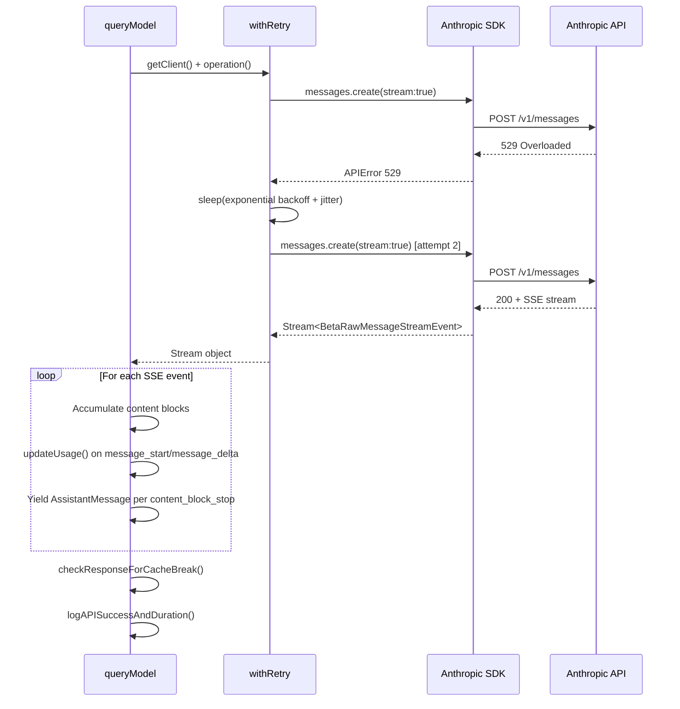
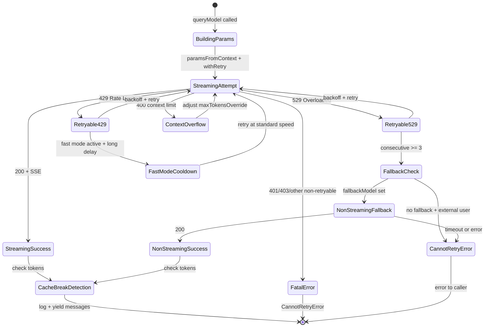
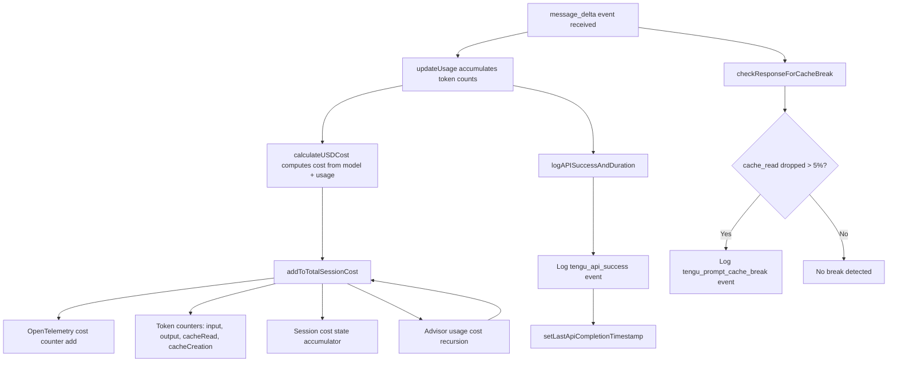

# Talking to Anthropic: `services/api/claude.ts` and Streaming

## Overview

The file `src/services/api/claude.ts` is the membrane between cc's internal agent loop and the Anthropic API. At roughly 3,400 lines it houses the streaming request pipeline, retry orchestration, fallback model negotiation, prompt cache break detection, token metering, and cost accounting. Every LLM call in the system -- from the main REPL thread to background classifiers to subagent forks -- funnels through one of two entry points: `queryModelWithStreaming` or `queryModelWithoutStreaming` `src/services/api/claude.ts:L752-L780`. These thin wrappers delegate to the private `queryModel` generator, which assembles request parameters, hands control to `withRetry`, and then consumes the resulting SSE stream block by block.

The relationship between these modules is deliberate. The retry logic in `src/services/api/withRetry.ts` knows about 529 overloaded errors, fast-mode cooldowns, and model fallback triggers, but it does not know about streaming events. The streaming loop inside `queryModel` knows about content block accumulation and usage accounting, but it delegates error recovery to `withRetry`. The prompt cache break detector in `src/services/api/promptCacheBreakDetection.ts` runs in two phases -- pre-call fingerprinting and post-call token comparison -- and is entirely decoupled from the retry cycle. This separation lets each layer reason about its own state machine without contending with the others.

The file's import list alone reveals its scope: it pulls from the Anthropic SDK's streaming types, from the beta messages API, from the tool and permission systems, from the compaction subsystem, from cost tracking, from telemetry, and from over a dozen utility modules `src/services/api/claude.ts:L1-L257`. The `Options` type at line 676 acts as the shared contract between the caller (the agent loop in `query.ts`) and the API layer, encoding everything from model selection to fast-mode toggles to task budgets. Understanding the streaming path requires tracing how these options flow through parameter construction, into the retry loop, out through SSE event processing, and finally into observability and cost accounting.

## Data structures and contracts

### Options and RetryContext

The `Options` type at `src/services/api/claude.ts:L676-L707` defines the per-request contract. Beyond the obvious `model` and `tools` fields, it carries `fallbackModel` and `onStreamingFallback` for the non-streaming degradation path, `querySource` for 529 retry eligibility, `taskBudget` for API-side token pacing, and `fastMode` for speed-aware request routing.

The `RetryContext` interface in `src/services/api/withRetry.ts:L120-L125` is the mutable state that persists across retry attempts within a single logical request. It carries `model`, `thinkingConfig`, `fastMode`, and critically `maxTokensOverride` -- the latter is overwritten when the API rejects a request for exceeding the context window, allowing the next attempt to shrink the output budget rather than failing permanently.

```typescript
// src/services/api/withRetry.ts:L120-L125 — RetryContext carries mutable state across attempts
export interface RetryContext {
  maxTokensOverride?: number
  model: string
  thinkingConfig: ThinkingConfig
  fastMode?: boolean
}
```

The `maxTokensOverride` field is the escape hatch: when a 400 "input length and max_tokens exceed context limit" error arrives, `withRetry` parses the token counts from the error message and adjusts `maxTokensOverride` for the next attempt `src/services/api/withRetry.ts:L388-L426`. Without this, a session that grew past the context window would become unrecoverable.

### Usage and EMPTY_USAGE

Token metering begins with `EMPTY_USAGE` and the `updateUsage` function. The `NonNullableUsage` type (re-exported from `src/services/api/logging.ts:L42`) captures input tokens, output tokens, cache read, cache creation, and server tool use counts. During streaming, usage arrives in two phases: `message_start` carries the initial snapshot (often with `output_tokens: 0`), and `message_delta` delivers the final counts `src/services/api/claude.ts:L2924-L2949`.

```typescript
// src/services/api/claude.ts:L2924-L2949 — Accumulating usage across streaming events
export function updateUsage(
  usage: Readonly<NonNullableUsage>,
  partUsage: BetaMessageDeltaUsage | undefined,
): NonNullableUsage {
  if (!partUsage) {
    return { ...usage }
  }
  return {
    input_tokens:
      partUsage.input_tokens !== null && partUsage.input_tokens > 0
        ? partUsage.input_tokens
        : usage.input_tokens,
    cache_creation_input_tokens:
      partUsage.cache_creation_input_tokens !== null &&
      partUsage.cache_creation_input_tokens > 0
        ? partUsage.cache_creation_input_tokens
        : usage.cache_creation_input_tokens,
    cache_read_input_tokens:
      partUsage.cache_read_input_tokens !== null &&
      partUsage.cache_read_input_tokens > 0
        ? partUsage.cache_read_input_tokens
        : usage.cache_read_input_tokens,
    output_tokens: partUsage.output_tokens ?? usage.output_tokens,
    server_tool_use: {
      web_search_requests:
        partUsage.server_tool_use?.web_search_requests ??
```

The function uses a "replace if nonzero" strategy: the API sends cumulative counts that may be null in delta events, so `updateUsage` preserves the last nonzero value. This is essential because `cache_read_input_tokens` only appears in `message_start`, not in subsequent deltas.

### RateLimit and Utilization

The `src/services/api/usage.ts:L12-L63` module defines the `RateLimit` and `Utilization` types and the `fetchUtilization` function that queries the OAuth usage endpoint. The `Utilization` type models multi-window rate limiting: `five_hour`, `seven_day`, `seven_day_opus`, `seven_day_sonnet`, and `extra_usage` -- each with a `utilization` percentage and a `resets_at` timestamp. This data feeds the UI's rate limit display but does not gate API calls directly; the retry layer handles backpressure at the HTTP level.

The `fetchUtilization` function includes a defensive check: it skips the API call entirely if the OAuth token is expired, returning `null` rather than risking a 401 error that would pollute error metrics `src/services/api/usage.ts:L38-L42`. It also gates on `isClaudeAISubscriber()` and `hasProfileScope()`, returning an empty object for non-subscribers -- a quiet no-op that avoids unnecessary network traffic for users on API keys or third-party providers.

### Prompt caching contracts

Prompt caching is governed by a layered configuration system. The `getPromptCachingEnabled` function at `src/services/api/claude.ts:L333-L356` checks three environment variable overrides (`DISABLE_PROMPT_CACHING`, `DISABLE_PROMPT_CACHING_HAIKU`, `DISABLE_PROMPT_CACHING_SONNET`, `DISABLE_PROMPT_CACHING_OPUS`) before allowing caching for each model tier. This lets operators selectively disable caching for cost-sensitive tiers without affecting others.

The cache control annotation itself is produced by `getCacheControl` at `src/services/api/claude.ts:L358-L374`, which attaches `{ type: 'ephemeral' }` with an optional `ttl: '1h'` override and an optional `scope: 'global'` marker. The 1-hour TTL is gated by `should1hCacheTTL`, which latches two values into session state for stability: user eligibility (ant or subscriber not in overage) and the GrowthBook allowlist of query source patterns `src/services/api/claude.ts:L393-L434`. The allowlist supports trailing wildcard patterns like `repl_main_thread*` and `agent:*`, enabling fine-grained control over which request paths receive the longer cache TTL. The latch prevents a mid-session GrowthBook disk cache update from changing the TTL on the server side, which would bust the prompt cache and waste approximately 20,000 tokens per flip.

### Error classification

The `src/services/api/errors.ts` module provides the error taxonomy that drives retry decisions and user-facing messages. The `classifyAPIError` function (used in logging at `src/services/api/logging.ts:L282`) maps raw API errors into typed categories that determine whether an error is retryable, whether it should trigger a fallback, and what user message to display. Error messages are differentiated by context: non-interactive sessions get self-service guidance ("try a different approach"), while interactive sessions get UI cues ("double press esc to go back") `src/services/api/errors.ts:L170-L196`.

A critical pattern is the CCR (Claude Code Remote) mode detection at `src/services/api/errors.ts:L217-L219`. In CCR mode, authentication is handled by infrastructure-provided JWTs rather than `/login`. Transient auth errors should suggest retrying rather than logging in, because the user cannot control the JWT lifecycle. This distinction propagates into the retry layer, where CCR mode causes 401/403 errors to be treated as retryable `src/services/api/withRetry.ts:L713-L717`.

## Control flow

### Streaming request lifecycle

The primary streaming path flows through `queryModelWithStreaming` into `queryModel`, which is an async generator. The generator first checks the off-switch gate for non-subscriber Opus usage, then resolves the previous request ID for cache-hit-rate analysis, builds the tool schema list, normalizes messages, and records the prompt state for cache break detection `src/services/api/claude.ts:L1031-L1055`. It then enters `withRetry`, which creates an Anthropic client and dispatches `anthropic.beta.messages.create` with `stream: true` `src/services/api/claude.ts:L1822-L1832`.

Before entering the retry loop, `queryModel` performs substantial preparation. The tool schema build phase constructs the API-compatible tool definitions from the internal `Tool` objects, applying deferral logic for tool search and LSP tools that are not yet initialized `src/services/api/claude.ts:L1235-L1246`. Message normalization strips tool-search-specific fields when the selected model does not support them, repairs tool_use/tool_result pairing mismatches from resumed sessions, strips advisor blocks when the beta header is absent, and silently drops excess media items beyond the 100-item API limit `src/services/api/claude.ts:L1266-L1315`. Each of these steps is a defensive measure against API rejections that would be difficult to recover from in the middle of an agentic loop.

The `paramsFromContext` closure at `src/services/api/claude.ts:L1538-L1729` is called once per retry attempt. It reconstructs the full API parameters from the current `RetryContext`, which means that adjustments like `maxTokensOverride` from a context overflow error are reflected in the next attempt's parameters. The closure also merges effort parameters, task budget parameters, structured output configuration, and the full set of latched beta headers. This design ensures that retry attempts use fresh parameters rather than stale snapshots from the initial call.

The following sequence diagram shows the complete lifecycle of a streaming request with a single retry:



### Retry and fallback logic

The `withRetry` generator in `src/services/api/withRetry.ts:L170-L517` implements a rich retry policy. The default maximum is 10 attempts `src/services/api/withRetry.ts:L52`. Retry eligibility is determined by `shouldRetry`, which respects the `x-should-retry` response header, recognizes transient error codes (408, 409, 429, 5xx), and handles authentication refresh for 401 and OAuth token revocation `src/services/api/withRetry.ts:L696-L787`.

The backoff strategy uses exponential delay with jitter. The `getRetryDelay` function at `src/services/api/withRetry.ts:L530-L548` computes `BASE_DELAY_MS * 2^(attempt-1)` with a maximum of 32 seconds, plus random jitter of up to 25% of the base delay. If the response includes a `retry-after` header, its value takes precedence. This combination ensures that retries do not cluster synchronously during a capacity event while still respecting server-directed wait times.

```typescript
// src/services/api/withRetry.ts:L530-L548 — Exponential backoff with jitter
export function getRetryDelay(
  attempt: number,
  retryAfterHeader?: string | null,
  maxDelayMs = 32000,
): number {
  if (retryAfterHeader) {
    const seconds = parseInt(retryAfterHeader, 10)
    if (!isNaN(seconds)) {
      return seconds * 1000
    }
  }

  const baseDelay = Math.min(
    BASE_DELAY_MS * Math.pow(2, attempt - 1),
    maxDelayMs,
  )
  const jitter = Math.random() * 0.25 * baseDelay
  return baseDelay + jitter
}
```

The `retry-after` header override means the server can direct the client to wait longer than the computed backoff would suggest -- for instance, a 429 with `retry-after: 30` causes a 30-second wait regardless of attempt number. The `maxDelayMs` parameter has a higher ceiling in persistent retry mode (5 minutes) to accommodate long rate limit windows `src/services/api/withRetry.ts:L433-L463`.

For 529 overloaded errors specifically, the system distinguishes between foreground and background query sources. The `FOREGROUND_529_RETRY_SOURCES` set at `src/services/api/withRetry.ts:L62-L82` lists the sources that should retry on 529: `repl_main_thread`, `sdk`, `agent:custom`, `compact`, and several others. Background sources like `speculation` and `session_memory` bail immediately to avoid amplifying a capacity cascade.

When consecutive 529 errors reach `MAX_529_RETRIES` (3), and the request specifies a `fallbackModel`, the retry loop throws `FallbackTriggeredError` `src/services/api/withRetry.ts:L335-L351`. The caller catches this and switches to the non-streaming fallback path, which uses `executeNonStreamingRequest` at `src/services/api/claude.ts:L818-L917`.

```typescript
// src/services/api/withRetry.ts:L335-L351 — Fallback trigger after consecutive 529s
if (consecutive529Errors >= MAX_529_RETRIES) {
  // Check if fallback model is specified
  if (options.fallbackModel) {
    logEvent('tengu_api_opus_fallback_triggered', {
      original_model:
        options.model as AnalyticsMetadata_I_VERIFIED_THIS_IS_NOT_CODE_OR_FILEPATHS,
      fallback_model:
        options.fallbackModel as AnalyticsMetadata_I_VERIFIED_THIS_IS_NOT_CODE_OR_FILEPATHS,
      provider: getAPIProviderForStatsig(),
    })

    // Throw special error to indicate fallback was triggered
    throw new FallbackTriggeredError(
      options.model,
      options.fallbackModel,
    )
  }
```

The fallback triggers an analytics event `tengu_api_opus_fallback_triggered` that records both the original and fallback model, enabling post-hoc analysis of Opus availability.

The non-streaming fallback has its own timeout: 120 seconds for remote sessions (to stay under CCR's container idle-kill window) and 300 seconds otherwise `src/services/api/claude.ts:L807-L811`. This fallback path also records a `tengu_nonstreaming_fallback_error` event on failure, which lets the team distinguish "fallback hung past container kill" (no event) from "fallback hit the bounded timeout" (event present) `src/services/api/claude.ts:L881-L893`.

### Request lifecycle state diagram

The full lifecycle of a request, including fallback and non-streaming recovery, is captured in the following state diagram:



### Streaming idle watchdog

A subtle but critical feature is the streaming idle timeout watchdog `src/services/api/claude.ts:L1874-L1928`. The Anthropic SDK's request timeout only covers the initial HTTP fetch, not the streaming body. If a proxy silently drops the SSE connection, the `for await` loop would hang indefinitely. The watchdog sets a 90-second timer (configurable via `CLAUDE_STREAM_IDLE_TIMEOUT_MS`) that aborts the stream if no chunks arrive, then triggers the non-streaming fallback path. A warning fires at half the timeout threshold to provide diagnostic signal before the abort.

The watchdog is reset on every incoming SSE chunk `src/services/api/claude.ts:L1941`. When it fires, it calls `releaseStreamResources()` which cancels the stream and the Response body to free native TLS/socket buffers that live outside the V8 heap `src/services/api/claude.ts:L1519-L1526`. The throw from the watchdog is caught by the streaming error handler, which falls through to the non-streaming fallback. A post-watchdog diagnostic event `tengu_stream_loop_exited_after_watchdog` records `exit_delay_ms` -- the time between the watchdog firing and the `for await` loop actually exiting -- to measure abort propagation latency `src/services/api/claude.ts:L2310-L2335`.

### Streaming event processing

Inside the `for await` loop, each SSE event type triggers specific accumulation logic. The `message_start` event captures the partial message and records the initial usage snapshot and the time-to-first-token metric `src/services/api/claude.ts:L1980-L1993`. The `content_block_start` event initializes content blocks of different types -- `tool_use`, `server_tool_use`, `text`, `thinking`, and the advisor tool result -- with empty accumulator fields `src/services/api/claude.ts:L1996-L2051`. The `content_block_delta` event appends incremental data to the appropriate block: text deltas, thinking deltas, input JSON deltas for tool calls, and signature deltas for thinking blocks `src/services/api/claude.ts:L2053-L2169`.

The `content_block_stop` event is where each block is finalized and yielded to the caller as an `AssistantMessage` `src/services/api/claude.ts:L2192-L2211`. This means the caller receives individual content blocks as they complete, enabling progressive rendering in the UI. The `message_delta` event delivers the final usage counts and stop reason, which are written back to the last yielded message via direct property mutation (not object replacement) to maintain the reference held by the transcript write queue `src/services/api/claude.ts:L2240-L2248`.

The streaming loop also tracks stall events: if more than 30 seconds pass between consecutive SSE events (after the first), a `tengu_streaming_stall` analytics event is logged `src/services/api/claude.ts:L1936-L1966`. Stall tracking provides diagnostic data for network quality issues without aborting the stream -- the watchdog handles the abort case separately.

### Prompt cache break detection

The prompt cache break detection system in `src/services/api/promptCacheBreakDetection.ts` operates in two phases. Phase 1 (`recordPromptState` at line 247) hashes the system prompt, tool schemas, cache control metadata, beta headers, model, fast-mode state, and effort value before each API call. Phase 2 (`checkResponseForCacheBreak` at line 437) compares the response's `cache_read_input_tokens` against the previous call's value. A drop exceeding 5% and `MIN_CACHE_MISS_TOKENS` (2,000 tokens) triggers a `tengu_prompt_cache_break` analytics event that attributes the break to specific causes: system prompt changed, tool schemas changed, model changed, cache_control scope flip, beta header addition, or TTL expiration `src/services/api/promptCacheBreakDetection.ts:L486-L588`.

The detection system maintains per-tool schema hashes to attribute tool-related breaks to specific tools. When the aggregate tools hash changes but no tools were added or removed (77% of tool breaks per BigQuery analysis cited in the code), the system identifies which tool's description changed by comparing per-tool hashes `src/services/api/promptCacheBreakDetection.ts:L369-L378`. This granularity is essential because AgentTool and SkillTool embed dynamic agent and command lists in their descriptions, causing frequent schema changes that would otherwise appear as opaque "tool schemas changed" events.

The system also tracks `cacheDeletionsPending` -- when cached microcompact sends `cache_edits` deletions, the resulting drop in cache read tokens is expected, not a break `src/services/api/promptCacheBreakDetection.ts:L473-L481`. This prevents false-positive break reports during normal compaction. Similarly, `notifyCompaction` resets the cache read baseline after compaction, since compaction legitimately reduces message count and cache read tokens will naturally drop `src/services/api/promptCacheBreakDetection.ts:L689-L698`.

The `previousStateBySource` map is bounded to `MAX_TRACKED_SOURCES` (10) to prevent unbounded memory growth from spawning many subagents, each of which creates a unique `agentId` key with a ~300KB diffable content string `src/services/api/promptCacheBreakDetection.ts:L103-L107`. When a cache break is detected, the system writes a unified diff to a temporary file for developer debugging via the `--debug` flag `src/services/api/promptCacheBreakDetection.ts:L649-L656`.

### Usage accounting and cost hooks

After each successful streaming response, the system records cost via `addToTotalSessionCost` from `src/cost-tracker.ts:L278-L323`. This function feeds multiple observability sinks: an OpenTelemetry cost counter, token counters broken down by input/output/cache-read/cache-creation, and session-level cost accumulation. The following flowchart illustrates the cost accounting pipeline:



The cost calculation at `src/services/api/claude.ts:L2251-L2256` runs on every `message_delta` event, not at stream end. This means cost accumulates incrementally, and the session cost state reflects partial progress even if the stream is interrupted. The advisor tool usage is recursively costed: `addToTotalSessionCost` iterates over advisor usage entries and calls itself recursively, ensuring that advisor model costs are included in the session total `src/cost-tracker.ts:L304-L322`.

The `logAPISuccessAndDuration` function in `src/services/api/logging.ts:L581-L788` is the final observability sink. It records `tengu_api_success` with fields including `costUSD`, `ttftMs` (time to first token), `durationMs`, `durationMsIncludingRetries`, cache token breakdowns, content length metrics, and gateway detection results. The `ttftMs` is measured from the attempt start time to the arrival of the `message_start` event `src/services/api/claude.ts:L1982-L1983`, providing an accurate first-token latency metric that excludes retry backoff.

## Edge cases and failure modes

### Empty stream detection

The streaming loop detects two proxy failure modes at `src/services/api/claude.ts:L2350-L2364`: (1) a proxy returning 200 with a non-SSE body (no `message_start` event), and (2) a proxy returning `message_start` but the stream ending before any `content_block_stop` and before `message_delta` with a stop reason. Both cases trigger the non-streaming fallback rather than silently producing no output. This detection is gated by checking `stopReason` to avoid false positives with structured output flows where the model legitimately responds with no content blocks.

The second failure mode -- partial events with no completed content blocks -- was not possible with the older `BetaMessageStream` wrapper, which had its own end-of-stream check in `_endRequest()`. The switch to the raw `Stream` type required re-implementing this check at the application layer `src/services/api/claude.ts:L2343-L2350`. The comment in the source code explains the rationale: "BetaMessageStream had the first check in _endRequest() but the raw Stream does not - without it the generator silently returns no assistant messages."

### Fast mode cooldown

Fast mode introduces a complex interaction with rate limits. On a 429/529, the system distinguishes between short `retry-after` values (under 20 seconds) and long or unknown ones `src/services/api/withRetry.ts:L284-L304`. Short delays preserve fast mode and the prompt cache hit. Long delays trigger a cooldown that switches to standard speed for a minimum of 10 minutes, preventing cache thrashing from flip-flopping between fast and standard models.

A special case exists for overage rejection: if the 429 response includes an `anthropic-ratelimit-unified-overage-disabled-reason` header, fast mode is permanently disabled for the session rather than entering a temporary cooldown `src/services/api/withRetry.ts:L275-L282`. This indicates that the user's extra usage allocation is exhausted, and retrying with fast mode would always fail.

### Persistent retry for unattended sessions

The `CLAUDE_CODE_UNATTENDED_RETRY` environment variable enables indefinite retry on 429/529 errors for unattended (ant-only) sessions `src/services/api/withRetry.ts:L96-L104`. In this mode, the retry loop never terminates on transient capacity errors. Instead, it chunks long sleeps into 30-second intervals, yielding `SystemAPIErrorMessage` events to the host so the session is not marked idle `src/services/api/withRetry.ts:L489-L506`. The backoff caps at 5 minutes and the total wait caps at 6 hours.

For persistent 429 errors, the system attempts to read the `anthropic-ratelimit-unified-reset` header to compute the exact wait-until-reset delay `src/services/api/withRetry.ts:L814-L822`. This avoids polling uselessly for hours during a multi-day rate limit window. The reset delay is capped at `PERSISTENT_RESET_CAP_MS` (6 hours) to prevent a pathological header from causing unbounded waits.

### Stale connection recovery

The retry loop detects stale keep-alive connections via `ECONNRESET` and `EPIPE` error codes from `APIConnectionError` `src/services/api/withRetry.ts:L112-L118`. When a stale connection is detected and the `tengu_disable_keepalive_on_econnreset` feature flag is enabled, the retry loop calls `disableKeepAlive()` to prevent the HTTP agent from reusing the poisoned socket pool `src/services/api/withRetry.ts:L218-L230`. The client is then re-created from scratch on the next attempt, ensuring a fresh TLS handshake.

### Observation masking and cost

HER section 13 identifies observation masking as the single most effective cost optimization, achieving a 52% reduction by suppressing successful tool outputs. The cc codebase implements this principle through its compaction and microcompact layers rather than in the API layer itself, but the API layer contributes by tracking `cache_read_input_tokens` and `cache_creation_input_tokens` separately, enabling the cost accounting system to measure the impact of caching and compaction on spend. The principle -- "success is silent; only failures produce verbose output" -- maps directly to how `stripExcessMediaItems` at `src/services/api/claude.ts:L956-L1015` silently drops the oldest media items rather than erroring when the 100-media limit is exceeded.

The HER also identifies several cost control mechanisms relevant to the API layer: per-task cost caps, per-session cost caps, per-hour spend rate alerts, and a dead-letter queue for tasks exceeding thresholds. The cc implementation tracks these at the session level through `addToTotalSessionCost`, which feeds the OpenTelemetry counters and session state, but the hard cap enforcement lives in the agent loop above the API layer. The API layer's role is to provide accurate, incremental cost data so the upper layers can make timely enforcement decisions.

### Model regression from provider updates

HER section 6.14 warns that when a provider updates a model, harness behavior breaks silently because the harness was tuned for specific model behaviors. The cc API layer is defensive against this in several ways. The streaming idle watchdog guards against protocol changes that might alter SSE event timing. The `classifyAPIError` function in `src/services/api/errors.ts:L54-L61` parses error structures that may drift between model versions. The prompt cache break detection system provides early warning when model behavior changes affect caching semantics. However, the fundamental risk remains: a model update that changes the structure of tool-use JSON or the semantics of stop reasons would propagate silently through the streaming accumulator unless caught by the content block type-mismatch guards at `src/services/api/claude.ts:L2056-L2162`.

The HER recommends regression test suites for the harness against model changes, pinning model versions where stability matters, and monitoring key metrics after provider updates. The cc codebase partially implements the monitoring recommendation through the `tengu_api_success` and `tengu_api_error` analytics events, which capture model, stop reason, error type, and latency. The `buildAgeMins` field in these events correlates behavior changes with binary deployment time, enabling detection of regressions that appear after a cc update rather than a model update `src/services/api/logging.ts:L164-L169`.

## Where cc diverges from the published pattern

The Anthropic SDK's standard pattern is to call `anthropic.messages.create()` and handle the response as a single object. cc diverges in several significant ways.

First, cc disables the SDK's built-in retry (`maxRetries: 0`) in favor of its own `withRetry` implementation `src/services/api/claude.ts:L1781`. The SDK's retry logic is unaware of cc's foreground/background source distinction, fast-mode cooldowns, or model fallback triggers. By controlling retries at the application layer, cc can make domain-informed decisions about whether to retry, how long to wait, and when to fall back to a different model.

Second, cc uses the raw `Stream` type instead of `BetaMessageStream` `src/services/api/claude.ts:L1818-L1832`. The comment explains: "BetaMessageStream calls partialParse() on every input_json_delta, which we don't need since we handle tool input accumulation ourselves." The raw stream avoids O(n^2) partial JSON parsing overhead for large tool inputs.

Third, the prompt caching TTL management is more sophisticated than the SDK defaults. The `should1hCacheTTL` function at `src/services/api/claude.ts:L393-L434` latches user eligibility and the GrowthBook allowlist into session state to prevent mid-session flips that would bust the server-side prompt cache. A single TTL flip can waste approximately 20,000 tokens of cached prompt, so stability is prioritized over freshness.

Fourth, the sticky-on latch pattern for beta headers `src/services/api/claude.ts:L1405-L1456` ensures that once a beta header (fast mode, AFK mode, cache editing, thinking clear) is first sent, it continues being sent for the rest of the session. This prevents a user toggle mid-session from changing the server-side cache key and invalidating 50-70K tokens of cached prompt.

Fifth, cc implements client-side request ID tracking via `x-client-request-id` for first-party requests `src/services/api/claude.ts:L1813-L1816`. This UUID survives server-side timeouts where the normal `request-id` header is never returned, enabling correlation with server logs even when the API never generates its own request ID.

Sixth, the streaming event loop yields individual `AssistantMessage` objects per content block rather than accumulating the entire response before yielding `src/services/api/claude.ts:L2192-L2211`. This progressive yield pattern is essential for the interactive REPL, where users see text and tool calls appearing in real time. It also means the `message_delta` event must retroactively update the last yielded message with final usage and stop reason via direct property mutation rather than object replacement `src/services/api/claude.ts:L2240-L2248`.

Seventh, cc wraps the entire request in VCR (recording and replay) via `withStreamingVCR` at `src/services/api/claude.ts:L727-L730` and `src/services/api/claude.ts:L770-L773`. This enables deterministic replay of API interactions for debugging and testing, a capability the SDK does not provide.

Finally, the `clientRequestId` mechanism and the `previousRequestId` chain (derived from the last assistant message's `requestId` field at `src/services/api/claude.ts:L928-L938`) enable the analytics system to join consecutive API requests for cache-hit-rate analysis and incremental token tracking. Each query chain -- main thread, subagent, teammate -- tracks its own request chain independently because the ID is derived from the message array rather than global state.

## Developer takeaways for building a long-running agent

Building a reliable long-running agent that talks to an LLM API requires defending against failure modes that do not appear in synchronous request-response patterns. The streaming idle watchdog is not an optional nice-to-have; without it, a silently dropped SSE connection will hang your agent loop indefinitely because the SDK's request timeout only covers the initial fetch, not the streaming body. You must implement your own liveness check with a bounded timeout and a fallback path. Retry logic must be aware of the semantic context of the request: background tasks should not amplify a capacity cascade by retrying on 529, while foreground tasks that the user is blocking on must persist. The prompt cache is a cost-critical resource -- every mid-session change to system prompts, tool schemas, beta headers, or cache control TTLs can invalidate tens of thousands of cached tokens, so you should latch these values for session stability and detect cache breaks post-hoc rather than trying to prevent them. Cost accounting must be incremental and must account for recursive costs like advisor tool usage; deferring cost calculation to stream end means you lose visibility into partial progress. Finally, observation masking -- suppressing successful tool outputs to reduce input token count -- is the most impactful cost optimization available, and the API layer should make it straightforward to measure the cost impact of each compaction or filtering decision.
