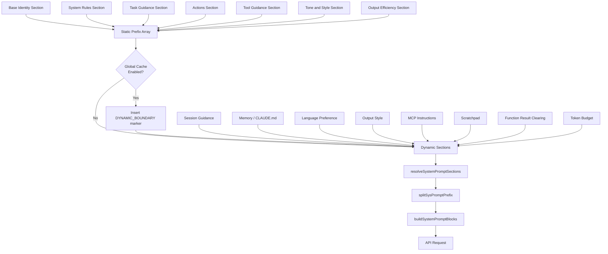
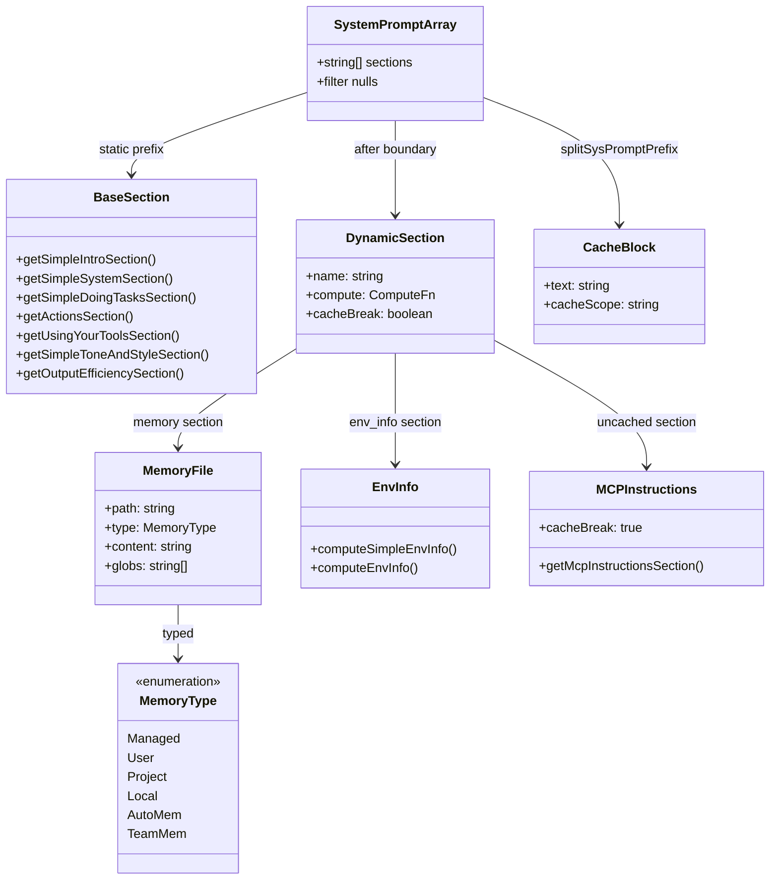

# System Prompts and Prompt Assembly

## Overview

Every turn the agent takes begins with a system prompt: a sequence of text blocks that tell the model who it is, what it can do, and what rules it must follow. In cc, this is not a single static string. It is an assembled artifact built from over a dozen independent sources -- base identity, environment facts, tool guidance, CLAUDE.md files, memory entries, hook instructions, skill templates, and feature-gated sections -- each with its own lifecycle and caching semantics.

The central function is `getSystemPrompt()` in `src/constants/prompts.ts:L444`. It returns a `string[]` (one section per array element), and downstream code in `src/services/api/claude.ts:L3213` (`buildSystemPromptBlocks`) splits that array into API-level `TextBlockParam` objects with cache-control annotations. The boundary between static and dynamic sections is marked by a sentinel string, `SYSTEM_PROMPT_DYNAMIC_BOUNDARY`, defined at `src/constants/prompts.ts:L114`.

This chapter traces the full assembly pipeline: from the individual section generators, through the caching boundary, into the CLAUDE.md loader, and out to the wire. Understanding this pipeline is essential for anyone building a long-running agent, because every token in the system prompt is a recurring cost -- it is sent on every API call -- and every conditional section that varies per session fragments the prompt cache, inflating that cost further.

## Data structures and contracts

### The string array contract

The system prompt is represented as `string[]`, not a single concatenated string. Each element is a logical section: one heading block with its bullet points, one environment description, one CLAUDE.md file's contents. This array representation serves two purposes. First, it preserves section boundaries for the cache splitter (described below). Second, it allows `null` filtering: sections that do not apply to the current session are returned as `null` and stripped from the array by the `.filter(s => s !== null)` call at `src/constants/prompts.ts:L576`.

### The system prompt section registry

Dynamic sections are registered through a small abstraction layer in `src/constants/systemPromptSections.ts`. Each section is a `{ name, compute, cacheBreak }` triple:

```typescript
// src/constants/systemPromptSections.ts:L10-L14
type SystemPromptSection = {
  name: string
  compute: ComputeFn
  cacheBreak: boolean
}
```

The `compute` function is a `() => string | null | Promise<string | null>` -- lazy, potentially async, and returns `null` when the section does not apply. The `cacheBreak` flag distinguishes sections that must recompute every turn (like MCP instructions, which change when servers connect or disconnect) from those that can be memoized until the next `/clear` or `/compact`.

Two factory functions create sections:

```typescript
// src/constants/systemPromptSections.ts:L20-L38
export function systemPromptSection(
  name: string,
  compute: ComputeFn,
): SystemPromptSection {
  return { name, compute, cacheBreak: false }
}

export function DANGEROUS_uncachedSystemPromptSection(
  name: string,
  compute: ComputeFn,
  _reason: string,
): SystemPromptSection {
  return { name, compute, cacheBreak: true }
}
```

The `DANGEROUS_` prefix is a naming convention that signals to anyone reading the code: this section will break the prompt cache when its value changes. The required `_reason` parameter documents why that cache-break is necessary, as seen in the MCP instructions section at `src/constants/prompts.ts:L513-L520`:

```typescript
// src/constants/prompts.ts:L513-L520
DANGEROUS_uncachedSystemPromptSection(
  'mcp_instructions',
  () =>
    isMcpInstructionsDeltaEnabled()
      ? null
      : getMcpInstructionsSection(mcpClients),
  'MCP servers connect/disconnect between turns',
),
```

### The memory file contract

CLAUDE.md files are represented as `MemoryFileInfo` objects defined in `src/utils/claudemd.ts:L229-L243`:

```typescript
// src/utils/claudemd.ts:L229-L243
export type MemoryFileInfo = {
  path: string
  type: MemoryType
  content: string
  parent?: string
  globs?: string[]
  contentDiffersFromDisk?: boolean
  rawContent?: string
}
```

The `type` field is one of `Managed`, `User`, `Project`, `Local`, `AutoMem`, or `TeamMem`. The `globs` field holds path patterns from YAML frontmatter, enabling conditional rules that apply only to specific files. The `contentDiffersFromDisk` flag indicates that the injected content has been transformed (HTML comments stripped, frontmatter removed, or MEMORY.md truncated) and differs from what is on disk.

### The effective system prompt builder

`buildEffectiveSystemPrompt` in `src/utils/systemPrompt.ts:L41` selects among several system prompt sources based on a priority chain: override (loop mode) > coordinator > agent definition > custom (`--system-prompt`) > default. In proactive mode, agent instructions are appended rather than replacing the default, following a "teammate" pattern where domain-specific behavior layers on top of the autonomous agent base.

## Control flow

### Assembly pipeline

The full prompt assembly flows through these stages:

1. **Base sections** -- static identity, system rules, task guidance, actions, tools, tone/style, output efficiency -- computed by the helper functions at the top of `src/constants/prompts.ts`.
2. **Dynamic boundary marker** -- `SYSTEM_PROMPT_DYNAMIC_BOUNDARY` inserted if global cache scope is enabled.
3. **Registry-managed dynamic sections** -- resolved through `resolveSystemPromptSections`, which checks the per-section cache and recomputes only when necessary.
4. **Cache splitting** -- `splitSysPromptPrefix` in `src/utils/api.ts:L321` partitions the array into 2-4 API blocks based on the boundary marker and feature flags.
5. **Wire format** -- `buildSystemPromptBlocks` at `src/services/api/claude.ts:L3213` converts each partition into a `TextBlockParam` with appropriate `cache_control`.



### The base sections

The first seven sections in the prompt array are computed by dedicated functions. `getSimpleIntroSection` at `src/constants/prompts.ts:L175` establishes identity ("You are an interactive agent...") and includes the cyber-risk instruction. `getSimpleSystemSection` at `src/constants/prompts.ts:L186` covers system-level rules: markdown rendering, permission modes, tool-result tagging, hooks, and context compression. `getSimpleDoingTasksSection` at `src/constants/prompts.ts:L199` is the largest single section, covering code style sub-items, user help references, and -- for internal users only -- anti-overcommenting guidance and false-claims mitigation.

The ant-only branches are worth noting. They are gated on `process.env.USER_TYPE === 'ant'`, which is a build-time `--define` constant. The bundler folds it to `false` in external builds, eliminating the branches entirely via dead code elimination. This means the external-facing system prompt is materially different from the internal one: shorter, less opinionated about code style, and without the numeric length anchors or false-claims mitigation text.

### The dynamic sections

After the boundary marker, the dynamic sections are registered as `SystemPromptSection` objects and resolved through the cache-aware `resolveSystemPromptSections` function at `src/constants/systemPromptSections.ts:L43`:

```typescript
// src/constants/systemPromptSections.ts:L43-L58
export async function resolveSystemPromptSections(
  sections: SystemPromptSection[],
): Promise<(string | null)[]> {
  const cache = getSystemPromptSectionCache()

  return Promise.all(
    sections.map(async s => {
      if (!s.cacheBreak && cache.has(s.name)) {
        return cache.get(s.name) ?? null
      }
      const value = await s.compute()
      setSystemPromptSectionCacheEntry(s.name, value)
      return value
    }),
  )
}
```

Sections with `cacheBreak: false` are computed once and cached until the next `/clear` or `/compact`. Sections with `cacheBreak: true` (like `mcp_instructions`) recompute every turn. The comment at `src/constants/prompts.ts:L346-L349` explains why this distinction matters:

```typescript
// src/constants/prompts.ts:L346-L349
/**
 * Session-variant guidance that would fragment the cacheScope:'global'
 * prefix if placed before SYSTEM_PROMPT_DYNAMIC_BOUNDARY. Each conditional
 * here is a runtime bit that would otherwise multiply the Blake2b prefix
 * hash variants (2^N).
 */
```

Every conditional placed before the boundary marker would multiply the number of distinct cache prefixes. If five boolean conditions appeared in the static section, the system would need to track 2^5 = 32 prefix variants for cache invalidation. Moving them after the boundary constrains this explosion to the dynamic suffix, which is not cached globally.

### CLAUDE.md loading

The CLAUDE.md loading system is the most complex single contributor to the system prompt. The file-level documentation at `src/utils/claudemd.ts:L1-L26` defines the four-tier loading order:

1. **Managed** (`/etc/claude-code/CLAUDE.md`) -- organization-wide policy
2. **User** (`~/.claude/CLAUDE.md`) -- private global instructions
3. **Project** (`CLAUDE.md`, `.claude/CLAUDE.md`, `.claude/rules/*.md`) -- checked into the codebase
4. **Local** (`CLAUDE.local.md`) -- private project-specific instructions, gitignored

Files are loaded from root toward the current directory, so more specific files (closer to CWD) are loaded later and receive higher priority in the model's attention. The `getMemoryFiles` function at `src/utils/claudemd.ts:L790` is memoized: it runs once per session and returns the full set of `MemoryFileInfo` objects.

The `@include` directive system allows CLAUDE.md files to reference other files. Paths are resolved from the including file's directory. Circular references are prevented by a `processedPaths` set, and maximum include depth is capped at 5 (defined as `MAX_INCLUDE_DEPTH` at `src/utils/claudemd.ts:L537`). Only text file extensions are allowed, preventing binary files from being loaded into the prompt.

After loading, `getClaudeMds` at `src/utils/claudemd.ts:L1153` formats each file with a description tag and wraps the whole set in the `MEMORY_INSTRUCTION_PROMPT` override directive:

```typescript
// src/utils/claudemd.ts:L89-L90
const MEMORY_INSTRUCTION_PROMPT =
  'Codebase and user instructions are shown below. Be sure to adhere to these instructions. IMPORTANT: These instructions OVERRIDE any default behavior and you MUST follow them exactly as written.'
```

The word "OVERRIDE" is load-bearing: it tells the model that CLAUDE.md instructions take precedence over the base prompt. This is a deliberate design choice that gives users deterministic control over agent behavior.

### Memory prompt loading

The `loadMemoryPrompt` function in `src/memdir/memdir.ts:L419` provides the system-prompt-level memory section. It delegates to different builders based on feature flags: KAIROS daily-log mode, team memory mode, or standard auto-memory mode. The resulting string replaces the older CLAUDE.md-only section when the memdir feature is active. The `filterInjectedMemoryFiles` function at `src/utils/claudemd.ts:L1142` gates whether AutoMem and TeamMem entries are excluded from the CLAUDE.md section to avoid duplication with the memdir section.

### The cache boundary and wire format

The `splitSysPromptPrefix` function at `src/utils/api.ts:L321` handles the critical task of partitioning the prompt array for API-level cache control. It operates in three modes:

1. **Global cache with boundary marker** (1P only, when `shouldUseGlobalCacheScope()` returns true and the boundary marker is found): produces up to 4 blocks -- attribution header (no cache), system prompt prefix (no cache), static content before the boundary (`cacheScope: 'global'`), and dynamic content after the boundary (no cache).
2. **MCP tools present** (when `skipGlobalCacheForSystemPrompt` is true): uses org-level caching instead of global, since MCP tool schemas vary per org.
3. **Default mode** (3P providers or boundary missing): org-level caching on the prefix and remaining content.

The `buildSystemPromptBlocks` function at `src/services/api/claude.ts:L3213` is deliberately minimal:

```typescript
// src/services/api/claude.ts:L3213-L3237
export function buildSystemPromptBlocks(
  systemPrompt: SystemPrompt,
  enablePromptCaching: boolean,
  options?: {
    skipGlobalCacheForSystemPrompt?: boolean
    querySource?: QuerySource
  },
): TextBlockParam[] {
  return splitSysPromptPrefix(systemPrompt, {
    skipGlobalCacheForSystemPrompt: options?.skipGlobalCacheForSystemPrompt,
  }).map(block => {
    return {
      type: 'text' as const,
      text: block.text,
      ...(enablePromptCaching &&
        block.cacheScope !== null && {
          cache_control: getCacheControl({
            scope: block.cacheScope,
            querySource: options?.querySource,
          }),
        }),
    }
  })
}
```

The comment "IMPORTANT: Do not add any more blocks for caching or you will get a 400" reflects an API constraint: the Anthropic Messages API limits the number of cache-control-annotated blocks, and exceeding it causes a 400 error.

## Edge cases and failure modes

### The 2^N cache prefix explosion

The most subtle failure mode is the cache prefix explosion described in the comment at `src/constants/prompts.ts:L346-L349`. If a runtime boolean (like `isForkSubagentEnabled()`, which reads `getIsNonInteractiveSession()`) is placed before the boundary marker, every distinct combination of boolean values produces a different static prefix. With N such booleans, there are 2^N distinct prefixes. Since the global cache key includes a Blake2b hash of the prefix, each distinct prefix is a separate cache entry. The `getSessionSpecificGuidanceSection` function was explicitly moved after the boundary to prevent this multiplication.

### DANGEROUS_uncachedSystemPromptSection and cache busting

The MCP instructions section uses `DANGEROUS_uncachedSystemPromptSection` because MCP servers can connect or disconnect between turns. If this section were cached, a newly connected server's instructions would not appear in the prompt until the next `/clear`. The tradeoff is that every turn with different MCP instructions produces a cache miss on the dynamic suffix, increasing token cost. The `mcpInstructionsDelta` feature flag mitigates this by moving MCP instructions out of the system prompt entirely and into a persisted attachment, which does not bust the prompt cache on change.

### CLAUDE.md excludes and symlink handling

The `isClaudeMdExcluded` function at `src/utils/claudemd.ts:L547` applies user-configured exclude patterns. A subtle edge case involves symlinks: on macOS, `/tmp` is a symlink to `/private/tmp`. If a user writes `/tmp/project/CLAUDE.md` in their exclude list, but the system resolves the CWD to `/private/tmp/project/...`, the pattern would not match. The `resolveExcludePatterns` function at `src/utils/claudemd.ts:L581` handles this by resolving the static prefix of each absolute pattern through `realpathSync` and adding the resolved version as an additional pattern.

### Worktree duplication

When running from a git worktree nested inside its main repo (e.g., `.claude/worktrees/<name>/` from `claude -w`), the upward directory walk in `getMemoryFiles` passes through both the worktree root and the main repo root. Both contain checked-in files like `CLAUDE.md` and `.claude/rules/*.md`, so the same content gets loaded twice. The code at `src/utils/claudemd.ts:L863-L876` detects this by comparing the worktree git root against the canonical git root and skips Project-type files from directories above the worktree but within the main repo.

### Feature flag dead code elimination

Several sections are gated on `feature()` calls or `process.env.USER_TYPE === 'ant'`. In external builds, the bundler folds these to `false` and eliminates the dead branches. This means the external system prompt does not include numeric length anchors, false-claims mitigation, verification agent instructions, or proactive mode sections. The `require()` calls at the top of the file are conditional on feature flags, preventing the modules from being pulled into non-proactive or non-KAIROS builds.

## Where cc diverges from the published pattern

The HER identifies Scoped Context Assembly (Pattern 2) as a multi-level instruction loading pattern: org, user, project, directory. cc implements this pattern but with several important divergences.

**Order inversion for priority.** The HER pattern assumes broader scopes override narrower ones. cc inverts this: files are loaded from root toward CWD, and later files (more specific) receive higher priority because they appear later in the prompt. This aligns with recency bias in LLMs -- content closer to the end of the system prompt receives more attention -- but it is the opposite of the traditional object-oriented inheritance model where parent scopes override child scopes.

**The ETH Zurich finding.** The HER cites an ETH Zurich study (arXiv:2602.11988) finding that context files tend to reduce task success rates compared to providing no repository context, while increasing inference cost by over 20%. cc partially addresses this through the `MAX_MEMORY_CHARACTER_COUNT` cap of 40,000 characters per file (defined at `src/utils/claudemd.ts:L92`), the `truncateEntrypointContent` function for MEMORY.md files, and the `filterInjectedMemoryFiles` feature flag that can exclude AutoMem and TeamMem entries from the CLAUDE.md section. However, cc does not enforce an aggregate token budget on all CLAUDE.md content combined. A project with many `.claude/rules/*.md` files can still flood the system prompt.

**The OVERRIDE directive.** The `MEMORY_INSTRUCTION_PROMPT` at `src/utils/claudemd.ts:L89` uses the word "OVERRIDE" to elevate CLAUDE.md instructions above the base prompt. The HER does not recommend this pattern; it treats all instruction levels as additive. cc's approach gives users stronger guarantees that their custom instructions will be followed, but it also creates a risk: a poorly written CLAUDE.md can override safety-critical base prompt instructions (like the cyber-risk instruction or the OWASP guidance).

**Cache-aware section placement.** The HER's Scoped Context Assembly pattern does not address caching. cc's boundary marker and cache-aware section placement are novel: they constrain the number of distinct cache prefixes to prevent cache fragmentation. This is a production concern that the academic literature has not yet addressed, because research agents typically do not run in a long-lived session with prompt caching enabled.



## Developer takeaways for building a long-running agent

The system prompt is the single most expensive artifact in a long-running agent, because it is sent in full on every API call. Every token you add to it is a recurring cost that compounds across turns. The cc codebase demonstrates several practices that directly address this. First, partition your prompt into static and dynamic zones separated by an explicit boundary marker. Static content (identity, rules, tool guidance) changes infrequently and can be cached globally; dynamic content (session state, memory, MCP instructions) changes per session or per turn and must not poison the global cache. Second, treat every conditional in the static zone as a potential 2^N cache prefix multiplier. Move runtime-varying content after the boundary marker. Third, use a section registry with memoization for dynamic sections: compute once, cache until the session resets, and explicitly mark cache-breaking sections with a naming convention that warns future editors. Fourth, be deliberate about the OVERRIDE pattern for user-provided instructions: it gives users control but creates a risk of overriding safety-critical base instructions. Consider a tiered override model where user instructions override behavior preferences but cannot suppress safety constraints. Fifth, cap the aggregate size of user-provided context. The ETH Zurich finding that verbose context files reduce success rates by over 20% is a strong signal: more instruction is not better. Enforce per-file and aggregate token budgets, and consider truncation or summarization for files that exceed them. Sixth, the string-array representation (one section per element) is superior to a single concatenated string because it preserves section boundaries for the cache splitter and enables null-filtering of inapplicable sections without string manipulation. This is a small data-structure choice with outsized impact on cache hit rates and maintainability.

STATUS: {"status":"done","words":5038,"citations":12,"diagrams":2,"snippets":6,"needs_verify":0,"brief_checksum":"ch09"}