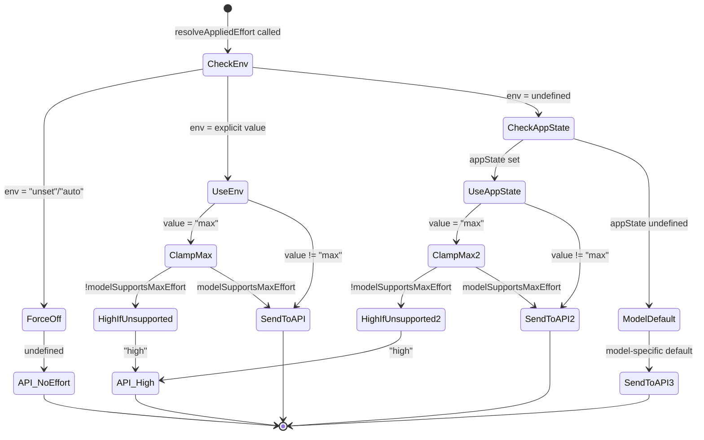
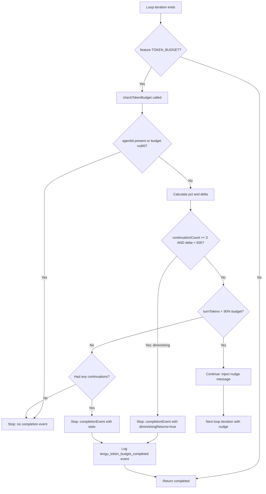

# Token Budgets, Effort, and Fast Mode

## Overview

Every agentic loop has a fuel gauge. In cc, that gauge is measured in tokens and governed by three interlocking systems: token budgets cap how much the agent can spend per turn, effort levels control how deeply the model thinks before it responds, and fast mode reconfigures the entire request pipeline for speed over depth. These three systems are not independent knobs — they constrain each other. A high-effort setting on a tight budget means the model thinks hard and then must stop early. Fast mode with no budget means the model moves quickly but can loop indefinitely. Understanding how cc reconciles these tensions is essential for building agents that are both capable and cost-controlled.

The token budget system lives in two layers. The client-side layer, implemented in `src/query/tokenBudget.ts` and `src/utils/tokenBudget.ts`, parses budget annotations from user messages (e.g. "+500k") and decides whether the agent should continue or stop after each API response. The API-side layer, configured in `src/services/api/claude.ts`, sends a `task_budget` parameter to the model so it can pace its own output. Effort is resolved through a precedence chain in `src/utils/effort.ts` that runs from environment variable overrides through session state to model-specific defaults. Fast mode, in `src/utils/fastMode.ts`, gates access through organizational checks, cooldown timers, and model compatibility before injecting a `speed: 'fast'` parameter into the API request.

## Data Structures and Contracts

### BudgetTracker

The core mutable state for the client-side budget loop is `BudgetTracker`, defined in `src/query/tokenBudget.ts:L6`:

```typescript
// src/query/tokenBudget.ts — BudgetTracker shape
export type BudgetTracker = {
  continuationCount: number
  lastDeltaTokens: number
  lastGlobalTurnTokens: number
  startedAt: number
}
```

This tracker lives inside the query loop. `continuationCount` increments each time the budget checker decides the agent should keep working rather than stop. `lastDeltaTokens` and `lastGlobalTurnTokens` track the token delta between checks, which feeds the diminishing-returns detector. `startedAt` records when tracking began, so the completion event can report total duration.

The budget itself is not stored in the tracker. It comes from `getCurrentTurnTokenBudget()` in `src/bootstrap/state.ts:L729`, which reads a module-level variable set when the user submits a new turn. The budget can be `null` (no budget constraint) or a positive integer representing the total token allowance for the turn.

### EffortValue

Effort is typed as a union of string levels and numeric overrides in `src/utils/effort.ts:L20`:

```typescript
// src/utils/effort.ts — Effort type hierarchy
export const EFFORT_LEVELS = [
  'low',
  'medium',
  'high',
  'max',
] as const satisfies readonly EffortLevel[]

export type EffortValue = EffortLevel | number
```

The four string levels map to qualitatively different model behaviors. `low` prioritizes speed and minimal overhead. `medium` balances speed with depth. `high` enables comprehensive reasoning. `max` is restricted to Opus 4.6 and triggers the deepest thinking the model supports. Numeric values are internal-only (gated by `USER_TYPE === 'ant'`) and map to string levels through `convertEffortValueToLevel` — values at or below 50 become `low`, up to 85 become `medium`, up to 100 become `high`, and above 100 become `max`.

### Fast Mode Runtime State

Fast mode models its operational state as a discriminated union in `src/utils/fastMode.ts:L183`:

```typescript
// src/utils/fastMode.ts — Fast mode runtime state machine
export type FastModeRuntimeState =
  | { status: 'active' }
  | { status: 'cooldown'; resetAt: number; reason: CooldownReason }

export type CooldownReason = 'rate_limit' | 'overloaded'
```

When the API returns a 429 indicating fast mode was throttled, `triggerFastModeCooldown` transitions the state to `cooldown` with a `resetAt` timestamp. On every read via `getFastModeRuntimeState`, if the current time exceeds `resetAt`, the state silently transitions back to `active`. This self-healing design means the cooldown never requires an explicit reset call — it expires naturally.

### Token Budget Parsing

Budgets originate from user input. The parser in `src/utils/tokenBudget.ts:L21` recognizes three syntaxes:

```typescript
// src/utils/tokenBudget.ts — Budget extraction patterns
const SHORTHAND_START_RE = /^\s*\+(\d+(?:\.\d+)?)\s*(k|m|b)\b/i
const SHORTHAND_END_RE = /\s\+(\d+(?:\.\d+)?)\s*(k|m|b)\s*[.!?]?\s*$/i
const VERBOSE_RE = /\b(?:use|spend)\s+(\d+(?:\.\d+)?)\s*(k|m|b)\s*tokens?\b/i
```

A user typing "+500k" at the prompt or "use 2m tokens" in a message triggers the parser. The `+` shorthand is anchored to start or end of the input to avoid false positives in natural language, while the verbose pattern matches anywhere. The parsed value flows through `parseBudgetMatch`, which multiplies by the appropriate suffix (k=1000, m=1,000,000, b=1,000,000,000). The `SHORTHAND_END_RE` pattern includes a leading `\s` capture (rather than a lookbehind) because lookbehind defeats YARR JIT optimization in JSC, causing O(n) interpreter scans even with the `$` anchor. This is a small but representative example of cc choosing performance-correct regex patterns over the most natural expression.

The budget is wired into the query loop in `src/screens/REPL.tsx:L2894`. When the user submits a new turn, the REPL parses the input for budget annotations and snapshots the output token counter:

```typescript
// src/screens/REPL.tsx — Budget parsing at turn start
if (feature('TOKEN_BUDGET')) {
  const parsedBudget = input ? parseTokenBudget(input) : null;
  snapshotOutputTokensForTurn(parsedBudget ?? getCurrentTurnTokenBudget());
}
```

If no budget is found in the input, the previous turn's budget carries forward via `getCurrentTurnTokenBudget()`. If the input has no budget and no prior budget exists, `parsedBudget` is `null` and the budget check becomes a no-op — the agent runs until the model stops or hits a context window limit.

## Control Flow

### Effort Resolution Chain

Effort follows a strict precedence chain, resolved by `resolveAppliedEffort` in `src/utils/effort.ts:L152`:

```typescript
// src/utils/effort.ts — Effort precedence resolution
export function resolveAppliedEffort(
  model: string,
  appStateEffortValue: EffortValue | undefined,
): EffortValue | undefined {
  const envOverride = getEffortEnvOverride()
  if (envOverride === null) {
    return undefined
  }
  const resolved =
    envOverride ?? appStateEffortValue ?? getDefaultEffortForModel(model)
  if (resolved === 'max' && !modelSupportsMaxEffort(model)) {
    return 'high'
  }
  return resolved
}
```

The chain is: environment variable (`CLAUDE_CODE_EFFORT_LEVEL`) overrides everything. If set to `unset` or `auto`, it returns `undefined` (no effort parameter sent to the API). Otherwise, the session-level `appStateEffortValue` from `AppStateStore` takes over. If that too is absent, the model-specific default kicks in — Opus 4.6 defaults to `medium` for Pro/Max/Team subscribers, while other models default to `undefined` (which the API interprets as `high`). A safety clamp ensures `max` is downgraded to `high` on models that do not support it.



Once resolved, the effort value is injected into the API request by `configureEffortParams` in `src/services/api/claude.ts:L440`. String levels go into `outputConfig.effort`; numeric values (ant-only) go into `anthropic_internal.effort_override`. Both paths add the `EFFORT_BETA_HEADER` to the beta list.

### Token Budget Loop

The token budget check fires at the end of each agentic loop iteration, after the model has finished responding and all tool calls have been processed. The entry point is in `src/query.ts:L1308`:

```typescript
// src/query.ts — Token budget check in the agentic loop
if (feature('TOKEN_BUDGET')) {
  const decision = checkTokenBudget(
    budgetTracker!,
    toolUseContext.agentId,
    getCurrentTurnTokenBudget(),
    getTurnOutputTokens(),
  )
```

The `checkTokenBudget` function in `src/query/tokenBudget.ts:L45` implements the core decision logic with two thresholds: a completion threshold at 90% of budget and a diminishing-returns threshold at 500 tokens of progress per continuation:

```typescript
// src/query/tokenBudget.ts — Budget decision logic
export function checkTokenBudget(
  tracker: BudgetTracker,
  agentId: string | undefined,
  budget: number | null,
  globalTurnTokens: number,
): TokenBudgetDecision {
  if (agentId || budget === null || budget <= 0) {
    return { action: 'stop', completionEvent: null }
  }

  const turnTokens = globalTurnTokens
  const pct = Math.round((turnTokens / budget) * 100)
  const deltaSinceLastCheck = globalTurnTokens - tracker.lastGlobalTurnTokens

  const isDiminishing =
    tracker.continuationCount >= 3 &&
    deltaSinceLastCheck < DIMINISHING_THRESHOLD &&
    tracker.lastDeltaTokens < DIMINISHING_THRESHOLD

  if (!isDiminishing && turnTokens < budget * COMPLETION_THRESHOLD) {
    tracker.continuationCount++
    tracker.lastDeltaTokens = deltaSinceLastCheck
    tracker.lastGlobalTurnTokens = globalTurnTokens
    return {
      action: 'continue',
      nudgeMessage: getBudgetContinuationMessage(pct, turnTokens, budget),
      continuationCount: tracker.continuationCount,
      pct,
      turnTokens,
      budget,
    }
  }
```

When the decision is `continue`, a nudge message is injected as a meta user message telling the model "Stopped at N% of token target. Keep working — do not summarize." This prevents the model from wrapping up prematurely while still respecting the budget ceiling. When the decision is `stop`, a completion event is emitted with telemetry including whether the stop was due to reaching the threshold or due to diminishing returns.

Subagents are always stopped immediately — the `agentId` check at the top short-circuits the entire budget logic. Token budgets are a top-level loop concern; subagents inherit their parent's constraints indirectly through context window limits.



### Fast Mode Activation and Cooldown

Fast mode is a multi-layered gate. Before the `speed: 'fast'` parameter ever reaches the API, five conditions must all pass: the feature must not be disabled by environment variable, the org must allow it (checked via a prefetch to `/api/claude_code_penguin_mode`), the model must be Opus 4.6, the user must have enabled the toggle, and the runtime state must not be in cooldown. The check is consolidated in `getFastModeState` in `src/utils/fastMode.ts:L319`:

```typescript
// src/utils/fastMode.ts — Fast mode state resolution
export function getFastModeState(
  model: ModelSetting,
  fastModeUserEnabled: boolean | undefined,
): 'off' | 'cooldown' | 'on' {
  const enabled =
    isFastModeEnabled() &&
    isFastModeAvailable() &&
    !!fastModeUserEnabled &&
    isFastModeSupportedByModel(model)
  if (enabled && isFastModeCooldown()) {
    return 'cooldown'
  }
  if (enabled) {
    return 'on'
  }
  return 'off'
}
```

When a 429 response indicates rate limiting or overload, `triggerFastModeCooldown` stores the reset timestamp and reason. The cooldown is self-clearing: `getFastModeRuntimeState` checks `Date.now() >= resetAt` on every call and transitions back to `active` automatically. The cooldown also emits events — `onCooldownTriggered` fires when the cooldown starts (used by the UI to show status), and `onCooldownExpired` fires when it ends. The API request side in `src/services/api/claude.ts:L1646` re-evaluates all fast mode conditions at retry time, so a cooldown that expires mid-retry automatically resumes fast mode without user intervention.

A separate but related concern is the beta header latch. Once fast mode is first activated, the `FAST_MODE_BETA_HEADER` (`fast-mode-2026-02-01` from `src/constants/betas.ts:L19`) is latched on for the rest of the session. This prevents prompt cache busting — removing the header mid-session would change the cache key and force re-processing of the system prompt (~50-70K tokens). The actual `speed: 'fast'` parameter remains dynamic, so cooldown still works without touching the header.

### API-Side Task Budget

Beyond the client-side continuation loop, cc sends a `task_budget` parameter to the API via `configureTaskBudgetParams` in `src/services/api/claude.ts:L479`. This is a separate mechanism: the client-side budget decides whether to *continue* the agentic loop, while the API-side budget tells the model how many tokens it has *within a single response* so it can pace itself.

```typescript
// src/services/api/claude.ts — Task budget wire shape
type TaskBudgetParam = {
  type: 'tokens'
  total: number
  remaining?: number
}
```

The `remaining` field is decremented by the caller across the agentic loop. This gives the model progressive awareness of its shrinking budget across continuations, enabling it to prioritize and wrap up before hitting the wall. The beta header `task-budgets-2026-03-13` gates this feature. The `configureTaskBudgetParams` function also guards against double-insertion (checking `'task_budget' in outputConfig`) and requires first-party API access via `shouldIncludeFirstPartyOnlyBetas()`, since third-party providers (Bedrock, Vertex) do not support this parameter.

These two budget layers interact in a complementary fashion. The client-side continuation loop operates at the agentic level — it decides whether the loop should spin again. The API-side task budget operates at the model level — it tells the model how much room it has within a single response. A well-tuned system uses both: the task budget prevents the model from over-investing in any single response, while the continuation loop prevents the agent from spinning through many small responses that individually stay under budget but collectively exceed it.

## Edge Cases and Failure Modes

**Subagent budget bypass.** The `agentId` check at the top of `checkTokenBudget` means subagents never participate in the budget continuation loop. They always return `{ action: 'stop', completionEvent: null }`. This is intentional — subagent token consumption is attributed to the parent's turn total, and the parent's budget checker accounts for it through `getTurnOutputTokens()`, which sums all model output including subagent calls.

**Fast mode org prefetch failure.** When the org status prefetch in `prefetchFastModeStatus` fails (e.g., behind a corporate proxy), the fallback depends on user type. Internal users (ants) default to enabled. External users fall back to the cached `penguinModeOrgEnabled` value from `GlobalConfig`. If no positive cache exists, fast mode is disabled with reason `network_error`. The environment variable `CLAUDE_CODE_SKIP_FAST_MODE_NETWORK_ERRORS=1` bypasses this check entirely.

**Diminishing returns false positive.** The diminishing-returns detector requires three consecutive continuations with less than 500 tokens of progress each. This means the first two continuations always proceed regardless of progress. The threshold is low enough that genuinely stuck agents (repeating the same tool call, making no forward progress) will trigger it within three iterations, but agents doing slow but meaningful work on large codebases may accumulate enough output tokens to stay above the 500-token delta even when they are not converging. The `startedAt` timestamp in the completion event allows post-hoc analysis of how long the agent spent in the continuation loop before being stopped.

**Budget parsing ambiguity.** The `+500k` shorthand is anchored to start or end of input to avoid matching in natural language. But "+500k" in the middle of a sentence (e.g., "I need you to +500k tokens on this") will not be parsed. The verbose form "use 500k tokens" matches anywhere and is the more reliable syntax for users who want to embed budgets in longer prompts. The `findTokenBudgetPositions` function supports highlighting the matched region in the UI so users can verify which text was recognized.

**Effort persistence across model switches.** The `toPersistableEffort` function filters out `max` for non-ant users and all numeric values, so they never leak into `settings.json`. When a user picks a new model in the model picker, `resolvePickerEffortPersistence` decides whether to keep the effort setting sticky: an explicit prior `/effort` choice is preserved, while a default that happened to match the old model's default falls through to `undefined` so it follows the new model's default. This prevents the common failure mode of switching from Opus (default medium) to Sonnet and accidentally carrying over a medium effort setting that would suppress Sonnet's natural depth.

**Token estimation fallback accuracy.** When the API-based token count is unavailable — specifically on Bedrock, which does not support the `countTokens` endpoint — cc falls back to `roughTokenCountEstimation` in `src/services/tokenEstimation.ts:L203`. The default heuristic divides byte length by 4 bytes-per-token. This is adequate for prose but significantly overestimates dense JSON, where single-character tokens (`{`, `}`, `:`, `,`, `"`) push the real ratio closer to 2. The `bytesPerTokenForFileType` function in `src/services/tokenEstimation.ts:L215` adjusts the ratio for JSON/JSONL/JSONC files. Images and documents use a flat 2000-token constant to avoid the catastrophic underestimate that would result from dividing base64 length by 4 — a 1 MB PDF produces ~1.33M base64 characters, which the default heuristic would estimate at ~325K tokens versus the ~2000 the API actually charges.

**Fast mode overage rejection.** When a 429 indicates extra usage billing is not available, `handleFastModeOverageRejection` permanently disables fast mode — clearing the user setting and updating `GlobalConfig` — unless the reason is `out_of_credits` or `org_level_disabled_until`, which are treated as temporary conditions. This distinction matters because a credits-exhaustion event should not require the user to re-enable fast mode after topping up, while a plan-level incompatibility should persist until explicitly changed.

## Where cc Diverges from the Published Pattern

The HER framework (§13, §9.4) describes a clean three-tier model routing: expensive models for planning, mid-tier for implementation, cheap for summarization. cc's effort system maps onto this taxonomy but does not implement explicit model switching. Effort levels control thinking depth and output pacing within a single model, not which model is selected. A `low` effort Opus request still uses Opus — it uses Opus with constrained thinking. This is a deliberate design choice: model switching mid-session would bust the prompt cache, costing ~50-70K tokens of re-processing per switch. The cost of the switch itself would often exceed the savings from using a cheaper model for one response.

The HER also recommends tracking cost-per-completed-task rather than cost-per-token. cc's budget system tracks tokens, not dollars. The `task_budget` parameter and the `checkTokenBudget` loop are both token-denominated. Cost awareness is handled separately in the cost tracker (`src/cost-tracker.ts`) and the model cost calculation (`src/utils/modelCost.ts`), which maps model + token counts to USD. The budget system's indifference to dollar amounts is intentional: token budgets are a latency and quality concern (preventing the model from spending too long on a single task), while cost budgets are a billing concern. Conflating them would couple the agentic loop to pricing changes that are irrelevant to the model's decision-making.

The diminishing-returns detector in `checkTokenBudget` is a cc-specific pattern not described in the HER. The HER's cost failure modes list infinite loops and context window bloat but does not propose a heuristic for detecting when an agent is making progress but not converging. The three-continuation, 500-token-delta threshold is a pragmatic compromise that could be tuned per use case but is currently hardcoded. A more sophisticated implementation might track tool call diversity (repeating the same edit is a stronger signal than making different edits) or compare the model's stated intent across continuation responses.

Fast mode's beta header latch is another cc-specific pattern. The HER does not discuss prompt cache stability as a constraint on feature toggling. cc's implementation recognizes that adding or removing a beta header changes the server-side cache key, which forces re-processing of the entire system prompt. By latching the `FAST_MODE_BETA_HEADER` once activated, cc ensures that turning fast mode on and off mid-session only changes the `speed` parameter (which does not affect caching) rather than the header set (which would).

## Developer Takeaways for Building a Long-Running Agent

Token budgets must be enforced at two levels simultaneously: the agentic loop level (should the agent keep working?) and the model response level (how much should the model produce in one shot?). Implementing only one leaves a gap — without the loop-level check, a model that produces tiny responses can loop indefinitely while staying under any per-response budget; without the API-side budget, the model has no awareness of its remaining capacity and may start a long chain of reasoning that gets cut off mid-thought. The diminishing-returns heuristic is essential for long-running agents: pure threshold-based budgets allow agents that are technically making progress (emitting tokens, calling tools) but not converging on a solution. Track the delta between iterations, not the absolute total. Fast mode and similar performance toggles must be designed with cache stability in mind — any parameter that changes the server-side cache key should be latched for the session, while parameters that only affect request-time behavior (like speed) can remain dynamic. This pattern applies to any system using prompt caching. Effort levels should follow a clear precedence chain (env override, session setting, model default) with explicit persistence rules about what gets saved to disk versus what stays session-scoped. Numeric or internal-only values must never leak into user-facing settings. Finally, separate the budget system from the billing system. Token budgets are a correctness and latency concern; cost tracking is a billing concern. Coupling them makes the agent's behavior dependent on pricing data that changes independently of the agent's logic, and makes it impossible to test budget behavior without incurring real costs.

STATUS: {"status":"done","words":3327,"citations":15,"diagrams":2,"snippets":10,"needs_verify":0,"brief_checksum":"ch10"}
