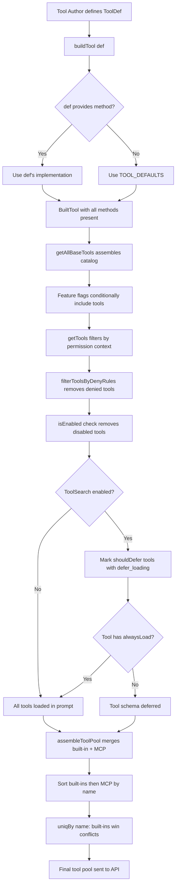

# Anatomy of a Tool: `Tool.ts`, `buildTool`, and the Base Type

## Overview

Every operation the cc agent can perform — reading a file, running a shell command, searching the web — is channeled through a single contract: the `Tool` type defined in `src/Tool.ts`. This contract is not a class hierarchy. It is a TypeScript interface backed by a factory function, `buildTool`, that fills in safe defaults for the methods most tool authors would rather not think about. The result is a flat, composable object with no inheritance chain, no abstract base class, and no virtual dispatch table. A tool is its schema, its call function, and a constellation of behavioral flags that tell the harness how to schedule, gate, and render it.

This chapter walks through that contract line by line: the Zod-backed input schema, the `call()` signature and its `ToolResult` return type, the concurrency and deferral flags that control scheduling, and the `buildTool` helper that makes it all assemble cleanly. We then examine how `src/tools.ts` aggregates these individual tool definitions into the catalog the agent actually sees.

## Data Structures and Contracts

### The `Tool` Type

The `Tool` generic type is the central abstraction. It carries three type parameters — `Input`, `Output`, and `P` (progress) — and enumerates every method and flag the harness needs to dispatch a tool safely:

```typescript
// src/Tool.ts:L362-L385
export type Tool<
  Input extends AnyObject = AnyObject,
  Output = unknown,
  P extends ToolProgressData = ToolProgressData,
> = {
  aliases?: string[]
  searchHint?: string
  call(
    args: z.infer<Input>,
    context: ToolUseContext,
    canUseTool: CanUseToolFn,
    parentMessage: AssistantMessage,
    onProgress?: ToolCallProgress<P>,
  ): Promise<ToolResult<Output>>
  description(
    input: z.infer<Input>,
    options: {
      isNonInteractiveSession: boolean
      toolPermissionContext: ToolPermissionContext
      tools: Tools
    },
  ): Promise<string>
  readonly inputSchema: Input
  readonly inputJSONSchema?: ToolInputJSONSchema
  outputSchema?: z.ZodType<unknown>
  // ...
```

The `Input` parameter is constrained to `AnyObject`, defined at `src/Tool.ts:L343` as `z.ZodType<{ [key: string]: unknown }>`. This means every tool's input schema must be a Zod type that produces an object with string keys — a deliberate restriction that ensures the API's `tool_use` blocks are always well-formed JSON objects, never primitives or arrays.

The `call()` method receives five arguments. The first is the validated input, typed via `z.infer<Input>`. The second is `ToolUseContext`, a large object carrying the abort controller, the full message history, file-reading limits, MCP clients, and dozens of callbacks for UI state updates. The third, `canUseTool`, is the permission gate — a function the tool must invoke before performing side effects. The fourth, `parentMessage`, anchors the tool call to the assistant turn that requested it. The fifth, `onProgress`, is an optional callback for emitting incremental updates during long-running operations.

### `ToolResult` and Context Modification

The return type of `call()` is `ToolResult<Output>`:

```typescript
// src/Tool.ts:L321-L336
export type ToolResult<T> = {
  data: T
  newMessages?: (
    | UserMessage
    | AssistantMessage
    | AttachmentMessage
    | SystemMessage
  )[]
  contextModifier?: (context: ToolUseContext) => ToolUseContext
  mcpMeta?: {
    _meta?: Record<string, unknown>
    structuredContent?: Record<string, unknown>
  }
}
```

The `data` field carries the typed output. The `newMessages` array allows a tool to inject additional messages into the conversation — a pattern used by the `AgentTool` to surface the subagent's transcript. The `contextModifier` field is notable: it is "only honored for tools that aren't concurrency safe," as the comment states. When a non-concurrency-safe tool runs, the harness applies this modifier to the context before the next tool executes, preventing stale reads. The `mcpMeta` field passes through MCP protocol metadata like `structuredContent` for SDK consumers.

### Concurrency Flags

Two methods govern whether tool calls can run in parallel:

```typescript
// src/Tool.ts:L402-L404
isConcurrencySafe(input: z.infer<Input>): boolean
isReadOnly(input: z.infer<Input>): boolean
isDestructive?(input: z.infer<Input>): boolean
```

`isConcurrencySafe` determines whether multiple instances of this tool (or this tool alongside others) can run simultaneously. `isReadOnly` marks operations that do not mutate filesystem or external state. `isDestructive` flags irreversible operations — deletes, overwrites, sends. These three form a risk classification ladder: read-only tools are almost always concurrency-safe; destructive tools are almost never concurrency-safe; the middle ground (writes that are not destructive) requires tool-specific judgment.

Importantly, all three are input-dependent. `BashTool` is not blanket concurrency-safe; it inspects the command string to decide. A `git log` invocation is safe; a `git rebase` is not. This input-sensitivity is the reason these are methods rather than static boolean fields.

### Deferral and Progressive Tool Expansion

Two flags control whether a tool appears in the initial prompt or is deferred until the model requests it:

```typescript
// src/Tool.ts:L441-L449
readonly shouldDefer?: boolean
readonly alwaysLoad?: boolean
```

When `shouldDefer` is true, the tool is sent to the API with `defer_loading: true`, meaning its full schema is omitted from the initial prompt. The model must invoke `ToolSearchTool` to discover and load deferred tools on demand. This implements progressive tool expansion — a pattern that prevents context bloat when the tool catalog grows beyond what fits in the system prompt.

`alwaysLoad` is the escape hatch. When true, the tool's full schema always appears in the initial prompt regardless of whether deferral is active. This is critical for tools the model must see on turn 1 — `BashTool` and `FileReadTool`, for instance — where a ToolSearch round-trip before the first real tool call would waste an entire API turn.

For MCP tools, `alwaysLoad` is set via the `_meta['anthropic/alwaysLoad']` field in the tool definition received from the MCP server.

### `maxResultSizeChars` and Large Output Handling

```typescript
// src/Tool.ts:L458-L466
maxResultSizeChars: number
```

When a tool's output exceeds `maxResultSizeChars`, the result is persisted to disk and the model receives a preview containing the file path instead of the full content. This prevents enormous outputs — `grep` across a monorepo, or a full directory listing — from consuming the entire context window.

The `FileReadTool` sets this to `Infinity`, which means its output is never persisted. The reason is architectural: persisting a Read result creates a circular `Read -> file -> Read` loop, and Read already self-bounds its output via its own `maxTokens` and `maxSizeBytes` limits (exposed through `ToolUseContext.fileReadingLimits`).

### `ToolUseContext` — The World in a Parameter

`ToolUseContext` at `src/Tool.ts:L158-L300` is the largest type in the file. It carries:

- **`abortController`** — for cancelling in-flight tool calls
- **`messages`** — the full conversation history
- **`options`** — configuration including the tool list, MCP clients, model name, and thinking config
- **UI callbacks** — `setToolJSX`, `addNotification`, `sendOSNotification`, and dozens of React state setters
- **Permission state** — `toolDecisions`, `localDenialTracking`, `contentReplacementState`
- **Subagent metadata** — `agentId`, `agentType`, `preserveToolUseResults`

The breadth of this type reflects a design choice: rather than threading individual parameters through the call stack, cc bundles everything a tool might need into a single object. The cost is coupling — tools import `ToolUseContext` and gain access to the full callback surface — but the benefit is that adding a new capability to the context never requires updating every tool's signature.

## Control Flow

### `buildTool()` — The Factory Function

Every tool in cc is constructed through `buildTool`. The function is concise but its type machinery is substantial:

```typescript
// src/Tool.ts:L783-L792
export function buildTool<D extends AnyToolDef>(def: D): BuiltTool<D> {
  return {
    ...TOOL_DEFAULTS,
    userFacingName: () => def.name,
    ...def,
  } as BuiltTool<D>
}
```

The runtime behavior is a three-step object spread: (1) start with `TOOL_DEFAULTS`, (2) overwrite `userFacingName` with a closure that returns `def.name`, (3) spread `def` on top. The order matters: `def` overrides both `TOOL_DEFAULTS` and the intermediate `userFacingName`. If a tool provides its own `userFacingName`, it wins. If not, the default — which returns the tool's `name` — applies.

The compile-time type is where the complexity lives. `BuiltTool<D>` is a mapped type that ensures every `DefaultableToolKeys` key is present and non-optional in the output, even though the input `ToolDef` allows them to be omitted:

```typescript
// src/Tool.ts:L707-L714
type DefaultableToolKeys =
  | 'isEnabled'
  | 'isConcurrencySafe'
  | 'isReadOnly'
  | 'isDestructive'
  | 'checkPermissions'
  | 'toAutoClassifierInput'
  | 'userFacingName'
```

```typescript
// src/Tool.ts:L735-L741
type BuiltTool<D> = Omit<D, DefaultableToolKeys> & {
  [K in DefaultableToolKeys]-?: K extends keyof D
    ? undefined extends D[K]
      ? ToolDefaults[K]
      : D[K]
    : ToolDefaults[K]
}
```

The `-?` modifier removes optionality from every defaultable key. The conditional type then checks: if the tool definition `D` provides the key and it is not `undefined`, use `D`'s type; otherwise, fall back to `ToolDefaults[K]`. This preserves the exact type of user-provided overrides while guaranteeing that callers never see `undefined` for any defaultable method.

### The Default Implementations

`TOOL_DEFAULTS` encodes fail-closed semantics for security-relevant flags:

```typescript
// src/Tool.ts:L757-L769
const TOOL_DEFAULTS = {
  isEnabled: () => true,
  isConcurrencySafe: (_input?: unknown) => false,
  isReadOnly: (_input?: unknown) => false,
  isDestructive: (_input?: unknown) => false,
  checkPermissions: (
    input: { [key: string]: unknown },
    _ctx?: ToolUseContext,
  ): Promise<PermissionResult> =>
    Promise.resolve({ behavior: 'allow', updatedInput: input }),
  toAutoClassifierInput: (_input?: unknown) => '',
  userFacingName: (_input?: unknown) => '',
}
```

The defaults follow a conservative principle: `isConcurrencySafe` defaults to `false` (assume not safe), `isReadOnly` defaults to `false` (assume writes), `isDestructive` defaults to `false` (but only matters when the tool is not read-only). `checkPermissions` defaults to `{ behavior: 'allow', updatedInput }`, which defers to the general permission system — the tool itself does not impose additional restrictions. `toAutoClassifierInput` returns an empty string, meaning the tool is skipped by the auto-mode security classifier; tools that handle sensitive data must override this.

### Tool Assembly in `tools.ts`

The `getAllBaseTools()` function in `src/tools.ts:L193-L251` is the source of truth for the complete tool catalog. It returns a flat array of `Tool` objects, conditionally including tools based on feature flags, environment variables, and build-time conditions:

```typescript
// src/tools.ts:L193-L251 (abbreviated)
export function getAllBaseTools(): Tools {
  return [
    AgentTool,
    TaskOutputTool,
    BashTool,
    ...(hasEmbeddedSearchTools() ? [] : [GlobTool, GrepTool]),
    ExitPlanModeV2Tool,
    FileReadTool,
    FileEditTool,
    FileWriteTool,
    // ...
    ...(isWorktreeModeEnabled()
      ? [EnterWorktreeTool, ExitWorktreeTool] : []),
    // ...
    ...(isToolSearchEnabledOptimistic() ? [ToolSearchTool] : []),
  ]
}
```

The conditional inclusion patterns are worth noting:

- **Feature-gated tools** like `SleepTool`, `CronCreateTool`, and `MonitorTool` are only included when their respective feature flags are enabled, using `require()` for dead-code elimination — if the feature is off, the tool module is never loaded.
- **Ant-only tools** like `REPLTool` and `ConfigTool` check `process.env.USER_TYPE === 'ant'`.
- **Embedded search optimization**: When the bun binary has `bfs`/`ugrep` embedded, the dedicated `GlobTool` and `GrepTool` are omitted because the shell aliases already provide fast search.
- **Test-only tools** like `TestingPermissionTool` appear only when `NODE_ENV === 'test'`.

The `getTools()` function at `src/tools.ts:L271-L327` further filters this catalog based on the permission context. It applies deny rules via `filterToolsByDenyRules()`, which removes any tool for which a blanket deny rule exists. This filtering happens before the model ever sees the tool list — denied tools are not merely blocked at call time, they are invisible to the model entirely.

### `assembleToolPool()` — Merging Built-in and MCP Tools

The `assembleToolPool()` function at `src/tools.ts:L345-L367` is the final assembly step that combines built-in tools with MCP tools:

```typescript
// src/tools.ts:L345-L367 (abbreviated)
export function assembleToolPool(
  permissionContext: ToolPermissionContext,
  mcpTools: Tools,
): Tools {
  const builtInTools = getTools(permissionContext)
  const allowedMcpTools = filterToolsByDenyRules(mcpTools, permissionContext)
  const byName = (a: Tool, b: Tool) => a.name.localeCompare(b.name)
  return uniqBy(
    [...builtInTools].sort(byName).concat(allowedMcpTools.sort(byName)),
    'name',
  )
}
```

The sorting is not cosmetic. The code comment at `src/tools.ts:L357-L361` explains: the server's `claude_code_system_cache_policy` places a global cache breakpoint after the last prefix-matched built-in tool. If MCP tools were interleaved with built-ins by name, any change to an MCP tool that sorted between existing built-ins would invalidate the entire prompt cache. By sorting built-ins first and MCP tools second, the cache breakpoint remains stable even as MCP tools are added or removed. The `uniqBy('name')` call resolves name conflicts in favor of built-in tools, which are always first in the concatenated array.

```mermaid
classDiagram
    class Tool~Input~Output~P~ {
        +name: string
        +aliases: string[]
        +searchHint: string
        +inputSchema: Input
        +inputJSONSchema: ToolInputJSONSchema
        +outputSchema: ZodType
        +maxResultSizeChars: number
        +shouldDefer: boolean
        +alwaysLoad: boolean
        +strict: boolean
        +isMcp: boolean
        +mcpInfo: object
        +call(args, context, canUseTool, parentMessage, onProgress) ToolResult
        +description(input, options) string
        +isConcurrencySafe(input) boolean
        +isReadOnly(input) boolean
        +isDestructive(input) boolean
        +isEnabled() boolean
        +checkPermissions(input, context) PermissionResult
        +validateInput(input, context) ValidationResult
        +prompt(options) string
        +userFacingName(input) string
        +interruptBehavior() string
        +getPath(input) string
        +mapToolResultToToolResultBlockParam(content, id) ToolResultBlockParam
        +renderToolUseMessage(input, options) ReactNode
        +renderToolResultMessage(content, progress, options) ReactNode
        +toAutoClassifierInput(input) unknown
    }

    class ToolDef {
        Same as Tool but DefaultableToolKeys are optional
    }

    class TOOL_DEFAULTS {
        +isEnabled() true
        +isConcurrencySafe() false
        +isReadOnly() false
        +isDestructive() false
        +checkPermissions() allow
        +toAutoClassifierInput() empty
        +userFacingName() name
    }

    class BuiltTool~D~ {
        All DefaultableToolKeys present and non-optional
        Type-level spread of TOOL_DEFAULTS + D
    }

    class FileReadTool {
        +maxResultSizeChars = Infinity
        +isReadOnly() true
        +isConcurrencySafe() true
        +shouldDefer = false
    }

    class BashTool {
        +maxResultSizeChars = 200000
        +isConcurrencySafe(input) depends on command
        +isReadOnly(input) depends on command
        +isDestructive(input) depends on command
    }

    class GlobTool {
        +isReadOnly() true
        +isConcurrencySafe() true
        +isSearchOrReadCommand() isSearch=true
    }

    ToolDef --> Tool : buildTool()
    TOOL_DEFAULTS --> Tool : spread into
    Tool <|.. FileReadTool : implements
    Tool <|.. BashTool : implements
    Tool <|.. GlobTool : implements
    BuiltTool --> Tool : structural subtype
```

## Edge Cases and Failure Modes

### The `contextModifier` Concurrency Escape Hatch

When a tool returns `contextModifier` in its `ToolResult`, the harness applies it to the `ToolUseContext` before the next tool call proceeds. This is only invoked for non-concurrency-safe tools. The escape hatch exists because some tools need to update shared state — the file history cache, the attribution state — and subsequent tools must see the updated state, not a stale snapshot. The risk is that a buggy `contextModifier` can corrupt the context for all downstream tools, which is why concurrency-safe tools are not allowed to use it: their results are processed in parallel, and applying a modifier in one branch while another branch reads the old context would be a data race.

### `maxResultSizeChars = Infinity` and the Read Loop

Setting `maxResultSizeChars` to `Infinity` bypasses the disk-persistence safety net. For `FileReadTool`, this is correct because Read already constrains its output via `fileReadingLimits` and because persisting a file-contents result would create a file that Read itself would then discover on subsequent calls, creating an infinite feedback loop. But for any tool that produces unbounded output without its own size controls, omitting this limit would be a bug. The harness does not double-check; `Infinity` is taken at face value.

### Empty-String Default for `toAutoClassifierInput`

The default `toAutoClassifierInput` returns `''`, which causes the auto-mode security classifier to skip the tool entirely. This is a deliberate choice: most tools have no security relevance to the classifier, and including their input would add noise. But it is also a footgun: if a tool that handles sensitive data (API keys, credentials, secrets) does not override this method, the classifier will never see those values and cannot protect against exfiltration. The comment at `src/Tool.ts:L755` makes this explicit: "security-relevant tools must override."

### `alwaysLoad` vs `shouldDefer` Interaction

When both `shouldDefer` and `alwaysLoad` are true on the same tool, `alwaysLoad` wins — the tool's schema appears in the initial prompt. This is not a conflict but a deliberate override mechanism: `shouldDefer` sets the default posture, `alwaysLoad` carves out exceptions. The error case would be setting `shouldDefer: false` and `alwaysLoad: true`, which is redundant but harmless — both flags agree that the tool should be loaded immediately. The more subtle failure is forgetting to set `alwaysLoad` on a tool that the model needs on turn 1; the result is an extra API round-trip through ToolSearch before the tool can be used.

### REPL Mode Tool Hiding

When REPL mode is enabled, `getTools()` filters out tools listed in `REPL_ONLY_TOOLS` at `src/tools.ts:L314-L323`. These tools (Bash, Read, Edit, and others) are still accessible inside the REPL virtual machine context but are hidden from the model's direct tool list. The intent is to prevent the model from calling low-level file operations when a higher-level REPL session is active. The edge case: if REPL mode is toggled mid-session, tools that were previously available disappear from the model's context, which can cause the model to attempt tool calls that no longer exist. The harness handles this gracefully by returning a tool-not-found error.



## Where cc Diverges from the Published Pattern

The HER cross-reference identifies Pattern 11 — Single-Purpose Tool Design — where each tool has "a single, well-defined responsibility" enabling "granular permission control," "clear failure boundaries," "targeted risk classification," and "independent evolution." The cc codebase follows this pattern, but the `Tool` type itself is not single-purpose in the interface sense: it carries over 30 methods covering execution, permissions, rendering, search indexing, and UI state. The single-purpose principle applies at the tool-instance level (FileReadTool reads files, nothing else) but not at the type level (the Tool type is a broad contract).

This divergence is pragmatic. A narrower interface — separating `ToolExecutable` from `ToolRenderable` from `ToolSearchable` — would require more type machinery and more casting at the call site. The flat contract trades interface purity for implementation simplicity. The cost is that every tool must implement or default methods it may not care about (rendering, search text extraction, grouped display). `buildTool` mitigates this by making most methods optional in the `ToolDef` and supplying defaults, so tool authors only implement what they need.

The HER also references Fowler's distinction between computational and inferential controls. Computational tools (FileRead, Grep, Glob) produce deterministic, verifiable output. Inferential tools (WebFetch, WebSearch) produce output that requires downstream validation. The cc codebase does not encode this distinction in the `Tool` type itself — there is no `isComputational` flag. Instead, the distinction manifests in the permission system: computational read-only tools are auto-approved in most permission modes, while inferential tools that reach the network require explicit approval. The `isReadOnly` method serves as a rough proxy: read-only tools are overwhelmingly computational, but the mapping is not exact (WebSearch is read-only but inferential).

## Developer Takeaways for Building a Long-Running Agent

The `Tool` / `buildTool` pattern demonstrates several principles essential for agents that run for hundreds of turns. First, fail-closed defaults prevent silent misclassification: `isConcurrencySafe` defaults to `false`, `isReadOnly` defaults to `false`, meaning new tools start in the safest (most restricted) posture until their author explicitly opts them into parallel execution or read-only treatment. Second, input-dependent behavioral flags — where concurrency and read-only status depend on the specific arguments — allow a single tool like BashTool to span the full risk spectrum rather than forcing the author to split it into `BashReadTool` and `BashWriteTool`. Third, the deferral mechanism (`shouldDefer` / `alwaysLoad`) solves the context-budget problem that kills long-running agents: as the tool catalog grows, loading every schema into the prompt becomes prohibitively expensive, and progressive expansion via ToolSearch keeps the prompt lean without sacrificing capability. Fourth, `maxResultSizeChars` prevents a single verbose tool from consuming the entire context window — a failure mode that is rare in testing (small projects) but guaranteed in production (monorepo searches). Fifth, `assembleToolPool`'s sorted, cache-stable ordering shows that prompt-cache efficiency is not an afterthought but a structural requirement: reordering tools between turns invalidates caches and multiplies cost, so the assembly logic treats sort order as an invariant. These patterns collectively ensure that the tool layer degrades gracefully under scale rather than failing catastrophically when a tool returns megabytes of output or the catalog outgrows the prompt budget.

STATUS: {"status":"done","words":4156,"citations":12,"diagrams":2,"snippets":5,"needs_verify":0,"brief_checksum":"ch11"}