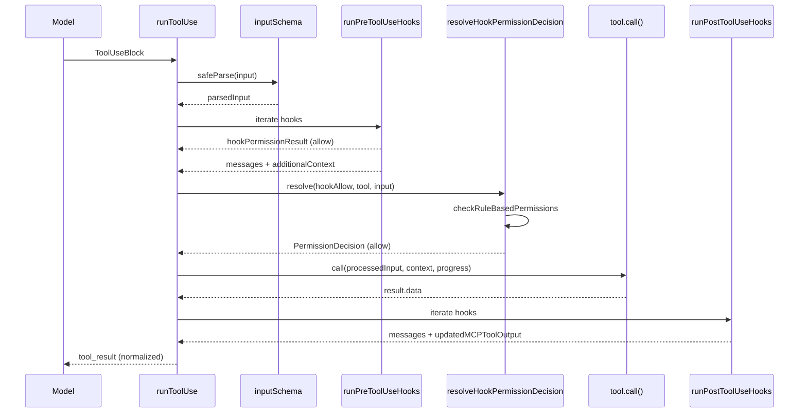
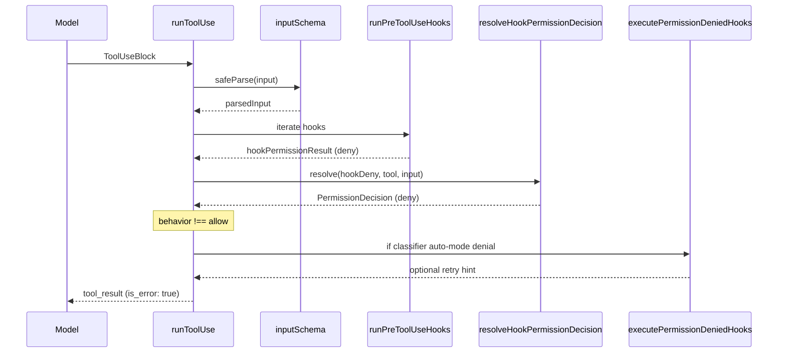
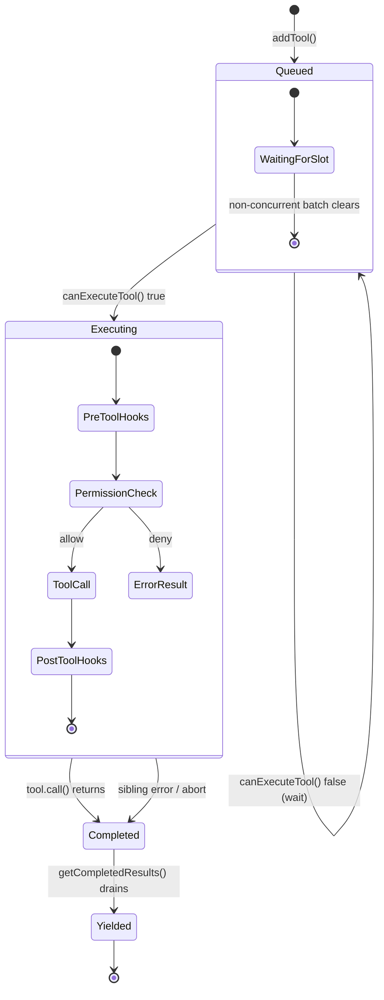

# Tool Dispatch Pipeline

## Overview

Every time the model emits a `tool_use` block, cc must decide whether to execute it, how to execute it, and what to do with the result. That decision travels through a six-phase pipeline: input validation, permission resolution, pre-execution hooks, the tool call itself, post-execution hooks, and result normalization. This chapter traces a tool invocation from the moment the stream parser yields a `ToolUseBlock` to the moment the normalized `tool_result` is enqueued for the next API turn.

The dispatch pipeline is not a single function but a layered system spread across four source files. `toolOrchestration.ts` partitions the model's tool calls into concurrency-safe batches and drives them through either concurrent or serial execution paths. `toolExecution.ts` drives per-tool validation, hook execution, permission resolution, and the call itself -- at 1745 lines it is the largest file in the tools directory. `toolHooks.ts` isolates hook orchestration into three generator functions (`runPreToolUseHooks`, `runPostToolUseHooks`, `runPostToolUseFailureHooks`) so the main path stays readable. `StreamingToolExecutor.ts` re-implements the same scheduling logic for the streaming path, where tool calls arrive incrementally as tokens arrive. Understanding how these layers compose is the key to extending the pipeline safely.

The pipeline must handle a wide surface area of failure modes: the model emitting invalid input types, hooks modifying or blocking tool calls, permission dialogs being accepted or rejected, tool execution throwing errors, and concurrent sibling tools needing coordinated cancellation. Each phase has its own error handling strategy, and the transitions between phases carry state forward through mutation of a shared `processedInput` variable and accumulation of `resultingMessages`.

## Data structures and contracts

### MessageUpdateLazy

The fundamental currency of the dispatch pipeline is `MessageUpdateLazy`, defined in `src/services/tools/toolExecution.ts:L264`:

```typescript
// src/services/tools/toolExecution.ts — core yield type
export type MessageUpdateLazy<M extends Message = Message> = {
  message: M
  contextModifier?: {
    toolUseID: string
    modifyContext: (context: ToolUseContext) => ToolUseContext
  }
}
```

Every phase of the pipeline yields `MessageUpdateLazy` objects. The `message` field carries the `tool_result`, progress updates, or hook attachments. The optional `contextModifier` lets a tool mutate the shared `ToolUseContext` after execution -- for instance, a tool that modifies the permission context for subsequent sibling calls. Context modifiers are queued during concurrent execution and applied serially after the batch completes. This design ensures that concurrent tools do not observe each other's context mutations mid-execution, which would create non-deterministic behavior.

The `toolOrchestration.ts` consumer of `MessageUpdateLazy` tracks context modifiers separately from messages. When a concurrent batch completes, it iterates the blocks in order and applies any queued modifiers, yielding a final `{newContext: currentContext}` update after the batch. For serial batches, each tool's context modifier is applied immediately, so the next tool in the sequence sees the updated context.

### TrackedTool (streaming path)

The streaming executor mirrors the lazy type with its own `TrackedTool` struct in `src/services/tools/StreamingToolExecutor.ts:L21`:

```typescript
// src/services/tools/StreamingToolExecutor.ts — streaming execution tracker
type TrackedTool = {
  id: string
  block: ToolUseBlock
  assistantMessage: AssistantMessage
  status: ToolStatus
  isConcurrencySafe: boolean
  promise?: Promise<void>
  results?: Message[]
  pendingProgress: Message[]
  contextModifiers?: Array<(context: ToolUseContext) => ToolUseContext>
}
```

The `status` field transitions through `queued -> executing -> completed -> yielded`, governing when results become visible to the caller. The `pendingProgress` array is consumed eagerly -- progress messages are yielded immediately upon request, even while the tool is still executing. This separation prevents head-of-line blocking: a slow Bash command's progress output is visible in real time without waiting for the command to complete.

The `ToolStatus` type is defined as `'queued' | 'executing' | 'completed' | 'yielded'` at `src/services/tools/StreamingToolExecutor.ts:L19`. The `yielded` state is distinct from `completed` because a tool may have finished executing but its results have not yet been emitted to the caller. The `getCompletedResults` generator only emits results for tools in the `completed` state, and transitions them to `yielded`.

### Batch partitioning contract

`toolOrchestration.ts` groups tool calls into `Batch` objects:

```typescript
// src/services/tools/toolOrchestration.ts — batch partitioning
type Batch = { isConcurrencySafe: boolean; blocks: ToolUseBlock[] }
```

A batch is either a single non-read-only tool (serialized) or a run of consecutive read-only tools (concurrent). The partition algorithm uses a reduce that examines each tool's `isConcurrencySafe` result. If the current tool is concurrency-safe and the previous batch is also concurrency-safe, the tool is appended to the existing batch. Otherwise, a new batch is started. This means that a sequence of `[Read, Read, Write, Read]` produces three batches: `[Read, Read]` (concurrent), `[Write]` (serial), `[Read]` (concurrent on its own).

The `isConcurrencySafe` flag is determined by calling `tool.isConcurrencySafe(parsedInput.data)` on each tool's parsed input. If that method throws -- for example, due to a shell-quote parse failure in Bash -- the tool is treated conservatively as not concurrency-safe (`src/services/tools/toolOrchestration.ts:L103`). The try/catch wrapper is important because the concurrency-safety check is not purely structural; it may invoke parsing logic that can fail on malformed input.

### CanUseToolFn

The permission gate is abstracted as `CanUseToolFn` in `src/hooks/useCanUseTool.tsx:L27`:

```typescript
// src/hooks/useCanUseTool.tsx — permission function signature
export type CanUseToolFn<Input extends Record<string, unknown> = Record<string, unknown>> = (
  tool: ToolType,
  input: Input,
  toolUseContext: ToolUseContext,
  assistantMessage: AssistantMessage,
  toolUseID: string,
  forceDecision?: PermissionDecision<Input>,
) => Promise<PermissionDecision<Input>>
```

The `forceDecision` parameter lets PreToolUse hooks pre-seed the permission dialog with an `ask` behavior and a custom message, so the user sees the hook's rationale rather than a generic prompt. When a hook returns `ask`, the `forceDecision` is set to the hook's `PermissionResult`, which includes the hook's custom message. The interactive handler then displays this message in the dialog, giving the user context about why the hook deferred the decision rather than approving or denying it outright.

The `CanUseToolFn` type is injected into the pipeline at the `runToolUse` entry point and threaded through to `checkPermissionsAndCallTool`. This dependency injection allows the REPL and headless modes to supply different permission resolution behavior without modifying the dispatch pipeline itself.

## Control flow

### The full dispatch sequence

The entry point is `runToolUse` in `src/services/tools/toolExecution.ts:L337`, an async generator that yields `MessageUpdateLazy` objects as the pipeline progresses. When the tool name is not found in the registry, it yields a synthetic error immediately. When the session's `abortController` has already fired, it yields a cancellation message with the `CANCEL_MESSAGE` constant. Otherwise, it delegates to `streamedCheckPermissionsAndCallTool`.

The `streamedCheckPermissionsAndCallTool` function (`src/services/tools/toolExecution.ts:L492`) bridges the gap between the generator-based `checkPermissionsAndCallTool` and the stream-based yielding pattern. It creates a `Stream<MessageUpdateLazy>`, calls `checkPermissionsAndCallTool` with a progress callback that enqueues progress messages into the stream, and returns the stream as an async iterable. This design allows progress events and final results to flow through a single channel.

The inner function `checkPermissionsAndCallTool` (`src/services/tools/toolExecution.ts:L599`) implements the full pipeline:

1. **Zod input validation** -- `tool.inputSchema.safeParse(input)`. The model frequently emits invalid types (strings where arrays are expected, numbers as strings). When validation fails, cc checks whether the tool was deferred (its schema was not sent to the API) and appends a `buildSchemaNotSentHint` directing the model to load the tool via `ToolSearch` first (`src/services/tools/toolExecution.ts:L578`).

2. **Tool-level validateInput** -- `tool.validateInput?.(parsedInput.data, toolUseContext)`. This is the tool's own semantic validation (e.g., checking that a file path exists). A `{result: false, message}` return short-circuits with an error. Unlike Zod validation, which catches type mismatches, `validateInput` catches semantic errors like nonexistent files or invalid parameter combinations.

3. **Speculative classifier launch** -- For Bash tools, `startSpeculativeClassifierCheck` is called so the bash allow-classifier runs in parallel with the slower PreToolUse hooks and permission dialog (`src/services/tools/toolExecution.ts:L741`). The UI indicator for "classifier running" is NOT set here -- it is set later in `interactiveHandler.ts` only when the permission check returns `ask` with a pending classifier check. This avoids flashing "classifier running" for commands that auto-allow via prefix rules.

4. **PreToolUse hooks** -- `runPreToolUseHooks` iterates over configured hooks. Each hook result is classified into one of seven yield types: `message`, `hookPermissionResult`, `hookUpdatedInput`, `preventContinuation`, `stopReason`, `additionalContext`, or `stop` (`src/services/tools/toolHooks.ts:L445`).

5. **Permission resolution** -- `resolveHookPermissionDecision` merges the hook's permission result with rule-based permissions. A hook `allow` does NOT bypass `settings.json` deny/ask rules; it skips the interactive prompt but rule-based checks still apply (`src/services/tools/toolHooks.ts:L332`).

6. **tool.call()** -- The actual tool execution with progress callbacks. The `call()` method receives the processed input, the tool use context (with `toolUseId` and `userModified` flags injected), the `canUseTool` function, the assistant message, and a progress callback.

7. **PostToolUse hooks** -- `runPostToolUseHooks` runs after successful execution. For MCP tools, hooks can modify the output via `updatedMCPToolOutput` before it is serialized.

8. **PostToolUseFailure hooks** -- If `tool.call()` throws, `runPostToolUseFailureHooks` runs instead, providing hooks a chance to log or react to the failure.

### Sequence: successful dispatch



After a successful `tool.call()`, the pipeline maps the result through `tool.mapToolResultToToolResultBlockParam` and caches the mapped block to avoid redundant serialization (`src/services/tools/toolExecution.ts:L1292`). For non-MCP tools, this pre-mapped block is passed directly to `addToolResult` when PostToolUse hooks complete, skipping the re-map. For MCP tools, the mapping is deferred until after hooks have had a chance to modify the output, because PostToolUse hooks can supply `updatedMCPToolOutput`.

### Sequence: denied dispatch



When the permission decision is `deny`, the pipeline constructs a `tool_result` with `is_error: true` and an explanatory message. If the denial came from the auto-mode classifier, cc runs `executePermissionDeniedHooks` (`src/services/tools/toolExecution.ts:L1081`). A hook returning `{retry: true}` yields a meta-message telling the model it may retry -- this lets an external approval system un-block a command that was initially denied.

The denied path also handles image content blocks. When the permission decision is `ask` (meaning the user was shown a dialog and rejected it), the `contentBlocks` from the permission decision may contain pasted images. These are added alongside the `tool_result` block in the message content, and sequential `imagePasteIds` are generated so each image renders with a distinct label (`src/services/tools/toolExecution.ts:L1049`).

### Concurrency scheduling

The orchestrator in `toolOrchestration.ts` partitions the model's tool-use blocks into batches. Consecutive read-only tools form a concurrent batch; write tools are serialized. The `StreamingToolExecutor` implements the same logic but starts execution as soon as each block arrives, rather than waiting for the full assistant message.



The concurrency guard in `StreamingToolExecutor.canExecuteTool` (`src/services/tools/StreamingToolExecutor.ts:L129`) checks whether any tool is currently executing. If the new tool is concurrency-safe and all executing tools are also concurrency-safe, execution begins immediately. Otherwise, the tool waits. Non-concurrency-safe tools require exclusive access: no other tool may be executing.

The `runTools` function in `toolOrchestration.ts` uses the `partitionToolCalls` function to split tool calls into batches, then iterates each batch. For concurrent batches, it calls `runToolsConcurrently`, which uses the `all` utility to run all tools with a max concurrency of `CLAUDE_CODE_MAX_TOOL_USE_CONCURRENCY` (default 10, configurable via environment variable). For serial batches, it calls `runToolsSerially`, which processes tools one at a time and threads context modifiers forward between each call.

When a Bash tool produces an error result during concurrent execution, `StreamingToolExecutor` sets `hasErrored = true` and aborts the `siblingAbortController` (`src/services/tools/StreamingToolExecutor.ts:L359`). This cascading cancellation kills sibling Bash subprocesses immediately, since Bash commands often have implicit dependency chains. Read-only tool failures do not cascade -- one failed file read should not cancel other independent reads. The comment in the source is explicit: "Bash commands often have implicit dependency chains (e.g. mkdir fails -- subsequent commands pointless). Read/WebFetch/etc are independent -- one failure shouldn't nuke the rest."

## Hook permission resolution

The `resolveHookPermissionDecision` function in `src/services/tools/toolHooks.ts:L332` is the most subtle part of the pipeline. It enforces an invariant that many developers miss: a hook `allow` does NOT bypass `settings.json` deny/ask rules.

```typescript
// src/services/tools/toolHooks.ts — hook allow does not bypass deny rules
if (hookPermissionResult?.behavior === 'allow') {
  const hookInput = hookPermissionResult.updatedInput ?? input

  // Hook allow skips the interactive prompt, but deny/ask rules still apply.
  const ruleCheck = await checkRuleBasedPermissions(tool, hookInput, toolUseContext)
  if (ruleCheck === null) {
    return { decision: hookPermissionResult, input: hookInput }
  }
  if (ruleCheck.behavior === 'deny') {
    return { decision: ruleCheck, input: hookInput }
  }
  // ask rule — dialog required despite hook approval
  return {
    decision: await canUseTool(tool, hookInput, toolUseContext, assistantMessage, toolUseID),
    input: hookInput,
  }
}
```

The logic has three branches when a hook returns `allow`: (1) no rule match, so the hook's allow stands; (2) a deny rule matches, overriding the hook; (3) an ask rule matches, so the interactive dialog is shown despite the hook's approval. This design prevents a compromised hook from silently bypassing security rules while still allowing hooks to skip the dialog for routine operations.

When `requiresUserInteraction` is true and the hook provided `updatedInput`, the hook is treated as satisfying the interaction requirement -- the hook itself served as the user interaction. This enables headless wrappers that collect answers from `AskUserQuestion` and inject them back into the pipeline. The `interactionSatisfied` boolean is computed at `src/services/tools/toolHooks.ts:L353`:

```typescript
// src/services/tools/toolHooks.ts — interaction satisfaction check
const interactionSatisfied =
  requiresInteraction && hookPermissionResult.updatedInput !== undefined

if ((requiresInteraction && !interactionSatisfied) || requireCanUseTool) {
  logForDebugging(
    `Hook approved tool use for ${tool.name}, but canUseTool is required`,
  )
  return {
    decision: await canUseTool(tool, hookInput, toolUseContext, assistantMessage, toolUseID),
    input: hookInput,
  }
}
```

When the hook returns `deny`, the function returns immediately without checking rules -- a denial from any source is final. When the hook returns `ask` or when no hook decision was made, the function falls through to the normal permission flow, optionally passing the hook's `PermissionResult` as `forceDecision` so the dialog shows the hook's message.

## PreToolUse hook yield types

The `runPreToolUseHooks` generator in `src/services/tools/toolHooks.ts:L435` yields a discriminated union with seven types. Each type corresponds to a distinct control-flow outcome:

- **`message`** -- A hook produced a message (progress, attachment, or logging). These are accumulated into `resultingMessages` and displayed in the UI.
- **`hookPermissionResult`** -- A hook made an explicit permission decision (allow, deny, or ask). Only the last hook's decision is used; earlier decisions are overwritten. This means the last hook in the chain wins, which is a deliberate design choice.
- **`hookUpdatedInput`** -- A hook modified the input without making a permission decision (passthrough). The `processedInput` is updated so subsequent hooks and the permission flow see the modified values.
- **`preventContinuation`** -- A hook requested that the model stop after this tool call, even if the tool succeeds. This is used by hooks that detect dangerous patterns and want to prevent the model from continuing to execute subsequent tool calls.
- **`stopReason`** -- A human-readable reason for the prevention. If not provided, a generic "Execution stopped by PreToolUse hook" message is used.
- **`additionalContext`** -- Extra context provided by a hook, added as an attachment message.
- **`stop`** -- An abort signal. The pipeline immediately yields a `tool_result_stop_message` and returns, bypassing permission resolution and tool execution entirely.

The `stop` type is yielded in two scenarios: when the session's `abortController` fires during hook execution, and when a hook error is caught. In both cases, the pipeline terminates immediately rather than attempting partial execution.

## Input backfill and path normalization

Tools like `FileReadTool` and `SendMessageTool` need derived fields that the model does not emit (e.g., expanded file paths, computed attachment metadata). The `backfillObservableInput` method mutates a shallow clone of the parsed input so hooks and `canUseTool` see the expanded values. However, the original model-provided input must reach `tool.call()` because tool result strings embed the input path verbatim (`src/services/tools/toolExecution.ts:L783`).

```typescript
// src/services/tools/toolExecution.ts — backfill clone creation
let callInput = processedInput
const backfilledClone =
  tool.backfillObservableInput &&
  typeof processedInput === 'object' &&
  processedInput !== null
    ? ({ ...processedInput } as typeof processedInput)
    : null
if (backfilledClone) {
  tool.backfillObservableInput!(backfilledClone as Record<string, unknown>)
  processedInput = backfilledClone
}
```

The `backfilledClone` is a shallow copy. `processedInput` is redirected to point at this clone so that hooks and the permission system see the backfilled (expanded) values. Meanwhile, `callInput` still points at the original `processedInput`. After hooks and permissions may have further modified `processedInput`, the convergence logic at `src/services/tools/toolExecution.ts:L1189` reconciles the two:

```typescript
// src/services/tools/toolExecution.ts — input convergence after hooks/permissions
if (
  backfilledClone &&
  processedInput !== callInput &&
  typeof processedInput === 'object' &&
  processedInput !== null &&
  'file_path' in processedInput &&
  'file_path' in (callInput as Record<string, unknown>) &&
  (processedInput as Record<string, unknown>).file_path ===
    (backfilledClone as Record<string, unknown>).file_path
) {
  callInput = {
    ...processedInput,
    file_path: (callInput as Record<string, unknown>).file_path,
  } as typeof processedInput
} else if (processedInput !== backfilledClone) {
  callInput = processedInput
}
```

If the hook/permission-modified input's `file_path` matches the backfilled value, the original model-provided path is restored -- keeping transcript and VCR fixture hashes stable. If hooks changed the `file_path` to something different from the backfill, the hook's value takes precedence. This convergence logic is the reason the `backfilledClone` variable is preserved rather than discarded after backfill: it serves as a reference point for detecting whether a later mutation was a meaningful override or an artifact of the backfill-then-parse round-trip.

## The streaming path

`StreamingToolExecutor` is a stateful class that mirrors the orchestration logic from `toolOrchestration.ts` but operates incrementally. Tools are added via `addTool()` as the model streams them in. The executor maintains a `tools: TrackedTool[]` array and a `siblingAbortController` that cascades Bash errors to sibling processes.

The `siblingAbortController` is a child of the main `toolUseContext.abortController`. Aborting it kills running Bash subprocesses but does NOT abort the parent -- the query loop continues. A per-tool `toolAbortController` is created as a child of the `siblingAbortController` for each tool execution. If this per-tool controller is aborted for a reason other than `sibling_error` (e.g., permission dialog rejection), the abort bubbles up to the parent controller so the query loop can end the turn (`src/services/tools/StreamingToolExecutor.ts:L301`).

The `discard()` method is called during streaming fallback -- when the API returns an error mid-stream and the system retries with a fresh response. All queued tools are abandoned; in-progress tools receive synthetic error messages. The `createSyntheticErrorMessage` method distinguishes three abort reasons: `sibling_error` (a parallel Bash tool failed), `user_interrupted` (the user pressed Escape), and `streaming_fallback` (the API stream was retried) (`src/services/tools/StreamingToolExecutor.ts:L153`). For user interruptions, the synthetic error uses `REJECT_MESSAGE` so the UI shows "User rejected edit" instead of a generic error.

Results are yielded in insertion order via `getCompletedResults()`, which iterates the `tools` array and emits any completed but not-yet-yielded results. Progress messages bypass this ordering -- they are yielded immediately from `pendingProgress`, ensuring the UI shows real-time command output. The `getRemainingResults` async generator uses `Promise.race` to wait for either a tool completion or new progress, ensuring that progress messages are never delayed behind a long-running tool.

The `interruptBehavior` of each tool determines how it responds to a user interrupt. Tools with `cancel` behavior are cancelled when the user types a new message; tools with `block` behavior continue running. The `updateInterruptibleState` method checks whether all executing tools have `cancel` behavior, and if so, signals the UI that the user can interrupt (`src/services/tools/StreamingToolExecutor.ts:L254`).

## The permission dialog hierarchy

The `canUseTool` function in `src/hooks/useCanUseTool.tsx` implements a three-tier resolution chain:

1. **Rule-based check** -- `hasPermissionsToUseTool` checks `settings.json`, session grants, and CLI flags. If the result is `allow` or `deny`, no dialog is shown.

2. **Coordinator handler** -- When `awaitAutomatedChecksBeforeDialog` is true (swarm workers), the coordinator handler tries automated checks before interrupting the user. Background workers should only interrupt the user when automated checks cannot decide.

3. **Swarm worker handler** -- For swarm workers, the handler tries the bash classifier for auto-approval, then forwards permission requests to the leader via mailbox. If the classifier or leader resolves the request, the dialog is skipped.

4. **Interactive handler** -- As a last resort, the interactive permission dialog is shown. Before displaying it, the speculative bash classifier is given a 2-second grace period to resolve; if it returns a high-confidence match, the dialog is skipped entirely (`src/hooks/useCanUseTool.tsx:L127`). The race between the classifier promise and a 2-second timeout ensures the dialog does not appear if the classifier is merely slow.

The function signature's `forceDecision` parameter is used by PreToolUse hooks that return `ask` behavior. The hook's message becomes the dialog's prompt text, giving the user context about why the hook deferred the decision. Without `forceDecision`, the dialog would show a generic "Allow tool use?" prompt that lacks the hook's contextual information.

When the `decisionPromise` resolves with `allow`, the function checks whether the decision came from the auto-mode classifier (the `TRANSCRIPT_CLASSIFIER` feature flag). If so, it calls `setYoloClassifierApproval` to update the UI state, displaying the classifier's reasoning to the user. On `deny` from the auto-mode classifier, it calls `recordAutoModeDenial` and adds an immediate-priority notification to the app state, showing the user what was denied and suggesting `/permissions` for review.

## Telemetry and observability

The dispatch pipeline is heavily instrumented for telemetry. Every phase emits analytics events with the `tengu_` prefix: `tengu_tool_use_error` for validation and execution errors, `tengu_tool_use_can_use_tool_rejected` and `tengu_tool_use_can_use_tool_allowed` for permission decisions, `tengu_tool_use_success` for successful completions, and `tengu_tool_use_progress` for progress updates. Each event includes the tool name, message ID, query chain ID, query depth, and MCP server details when applicable.

The `classifyToolError` function at `src/services/tools/toolExecution.ts:L150` maps error instances to telemetry-safe strings. In minified builds, `error.constructor.name` is mangled into short identifiers like "nJT" -- useless for diagnostics. The classifier extracts structured information instead: `TelemetrySafeError` uses its `telemetryMessage`, Node.js filesystem errors use their `code` property (ENOENT, EACCES), and known error types use their `name` property. The fallback is the string "Error" -- better than a mangled 3-character identifier.

Slow-phase logging is triggered when any pipeline phase exceeds `SLOW_PHASE_LOG_THRESHOLD_MS` (2000ms). Both PreToolUse hooks and PostToolUse hooks are timed, and the duration is logged with the tool name and hook count. When the `USER_TYPE` is `ant`, inline timing summaries are displayed for hooks exceeding `HOOK_TIMING_DISPLAY_THRESHOLD_MS` (500ms), using wall-clock time rather than sum-of-durations since hooks may run in parallel.

OTel events are emitted for `tool_decision` and `tool_result` events, capturing the decision source (config, hook, user_permanent, user_temporary, user_reject) and tool parameters (gated by `OTEL_LOG_TOOL_DETAILS` since parameters can contain sensitive content). The `decisionReasonToOTelSource` function at `src/services/tools/toolExecution.ts:L207` maps internal decision reasons to the documented OTel source vocabulary.

## Edge cases and failure modes

### Deferred tool schema not sent

When the model calls a tool whose schema was not included in the API request (a deferred tool discovered via `ToolSearch`), the Zod validation fails because the model emits untyped parameters -- strings where the schema expects arrays, numbers, or booleans. The `buildSchemaNotSentHint` function (`src/services/tools/toolExecution.ts:L578`) detects this case and appends a directive telling the model to load the tool schema first via `ToolSearchTool` with query `select:{toolName}`. This is a targeted fix for the tool explosion problem identified in HER 6.8: when too many tools are visible, selection accuracy degrades, so deferred tools are hidden from the model until needed.

The hint includes an explanation of why the error occurred: "This tool's schema was not sent to the API -- it was not in the discovered-tool set derived from message history. Without the schema in your prompt, typed parameters (arrays, numbers, booleans) get emitted as strings and the client-side parser rejects them." The function has three guard conditions before generating the hint: tool search must be enabled optimistically, the ToolSearch tool must be available in the tool list, and the tool must be deferred. If any guard fails, the function returns null and the standard Zod error is shown instead.

### _simulatedSedEdit stripping

The `_simulatedSedEdit` field on Bash tool input is internal-only -- it must only be injected by the permission system after user approval. If the model supplies it (which the schema's `strictObject` should already reject), it is stripped as a defense-in-depth safeguard (`src/services/tools/toolExecution.ts:L763`). This prevents a model from forging sandbox-override metadata to bypass the permission system.

```typescript
// src/services/tools/toolExecution.ts — defense-in-depth field stripping
if (
  tool.name === BASH_TOOL_NAME &&
  processedInput &&
  typeof processedInput === 'object' &&
  '_simulatedSedEdit' in processedInput
) {
  const { _simulatedSedEdit: _, ...rest } =
    processedInput as typeof processedInput & {
      _simulatedSedEdit: unknown
    }
  processedInput = rest as typeof processedInput
}
```

The destructuring assignment extracts `_simulatedSedEdit` into a throwaway variable and spreads the remaining fields into a new object. This is a shallow clone, preserving all other fields. The comment in the source is explicit: this is "defense-in-depth" -- the Zod schema's `strictObject` should already reject unknown keys, but this guard protects against future regressions where the schema might be relaxed.

### MCP auth errors

When `tool.call()` throws an `McpAuthError`, the pipeline updates the MCP client's status from `connected` to `needs-auth` in the app state (`src/services/tools/toolExecution.ts:L1601`). This triggers the UI to display a re-authorization prompt. The status update is conditional -- it does not overwrite other states like `disconnected` or `initializing`. The update is performed via `toolUseContext.setAppState`, which uses a React-style updater function to merge the new client status into the existing clients array.

The error is then formatted and returned as a `tool_result` with `is_error: true`. If the tool is an MCP tool and the error is an `McpToolCallError`, the `mcpMeta` field is preserved in the result message, allowing the UI to display MCP-specific error details.

### Silent failure prevention

The pipeline addresses the silent-failure pattern from HER 6.6 through two mechanisms. First, all tool results are explicitly tagged with `is_error: true` when an error occurs, preventing the model from interpreting error messages as successful output. Second, the `formatZodValidationError` function provides structured error messages that the model cannot easily misinterpret as tool output. The `tool_result` content block always carries `is_error` semantics, and the `toolUseResult` string is prefixed with `Error:` to make failure unambiguous in the serialized transcript.

The `addToolResult` function at `src/services/tools/toolExecution.ts:L1403` handles result normalization. For non-MCP tools, the pre-mapped `ToolResultBlockParam` is passed to `processPreMappedToolResultBlock`, which applies size limits and truncation. For MCP tools, the result is mapped from scratch after PostToolUse hooks have had a chance to modify it. The function also appends `acceptFeedback` and `contentBlocks` from the permission decision, allowing the user's approval comments and pasted images to appear alongside the tool result.

### Abort handling during hooks

If the session's `abortController` fires while PreToolUse hooks are executing, `runPreToolUseHooks` yields a `hook_cancelled` attachment and then a `stop` signal (`src/services/tools/toolHooks.ts:L582`). The `stop` type causes the main `checkPermissionsAndCallTool` loop to break immediately and return a `tool_result_stop_message` rather than continuing through permission resolution and tool execution.

Similarly, if a hook throws an error during execution, the error is logged and the generator yields both a `hook_error_during_execution` attachment and a `stop` signal. The outer `try/catch` in `runPreToolUseHooks` catches errors from the `executePreToolHooks` function itself and yields `stop`. These three abort scenarios -- session abort, hook error, and outer error -- all converge on the same behavior: the pipeline terminates immediately with a stop message.

### Prevent continuation after success

A PreToolUse hook can set `preventContinuation` to true, which prevents the model from making additional tool calls after the current one completes -- even if the tool succeeds. This is tracked via the `shouldPreventContinuation` boolean, which is set when the `preventContinuation` yield type is received from the hook generator. After a successful `tool.call()`, if `shouldPreventContinuation` is true, the pipeline appends a `hook_stopped_continuation` attachment message (`src/services/tools/toolExecution.ts:L1572`). This tells the model that execution was halted by a hook, not by an error.

## Where cc diverges from the published pattern

The standard agent pattern described in the literature treats tool dispatch as a simple function call: the model emits parameters, the harness executes, the result returns. CC diverges in several structural ways:

**Hook-mediated permission is not a pre-check.** In most agent frameworks, permission checking happens before hooks. In cc, hooks run first and can short-circuit permission entirely (deny), pre-approve (allow with rule-check overlay), or force the dialog (ask). The `resolveHookPermissionDecision` function merges hook and rule decisions in a specific precedence order that does not map to a simple allow/deny bitmask. This design follows HER Pattern 12 (Deterministic Lifecycle Hooks), where hooks are user-specified, deterministic, and always execute before the action they guard.

**Input can be mutated at three points.** The model's original input can be modified by (1) `backfillObservableInput` for derived fields, (2) PreToolUse hooks via `hookUpdatedInput` or `hookPermissionResult.updatedInput`, and (3) the permission dialog via `PermissionDecision.updatedInput`. The convergence logic at the end of the pipeline must reconcile all three mutation sources while preserving transcript stability. This three-way merge is unusual in agent frameworks, where input is typically treated as immutable after the model emits it.

**Concurrency is tool-type-aware, not count-limited.** The standard approach to concurrent tool execution uses a semaphore with a fixed max count. CC uses a semantic concurrency model: read-only tools run in parallel with each other, write tools require exclusive access, and Bash errors cascade to cancel siblings. The `isConcurrencySafe` method on each tool definition makes this determination, and the partition algorithm groups consecutive safe tools into batches. This semantic approach avoids the need for manual concurrency tuning as the tool catalog grows.

**PostToolUse hooks can modify MCP output.** For MCP tools, the PostToolUse hook pipeline can replace the tool's output entirely via `updatedMCPToolOutput` (`src/services/tools/toolHooks.ts:L146`). This enables post-processing pipelines that transform raw MCP responses before they reach the model, a pattern not found in simpler agent frameworks. The modified output is then mapped through `processToolResultBlock` as if it were the tool's original output.

**Progress is a first-class channel.** The `Stream` utility in `streamedCheckPermissionsAndCallTool` merges progress events and final results into a single async iterable. Progress messages are typed as `ProgressMessage<ToolProgressData>` and are yielded immediately, while final results are accumulated and yielded in order. This dual-channel approach ensures that long-running tools like Bash commands can display real-time output without blocking the pipeline.

## Developer takeaways for building a long-running agent

The dispatch pipeline's design reveals several principles that apply to any agent harness managing tool execution over sustained sessions. First, treat permission resolution as a merge problem, not a gate. Multiple authorities (hooks, rules, classifiers, user dialogs) can all produce permission decisions, and you need a deterministic merge order with clear precedence. CC's approach -- hooks first, then rules, then interactive -- means that a deny rule always overrides a hook allow, preventing a compromised hook from silently bypassing security boundaries. The key insight is that permission is not binary; there are at least five distinct decision sources (rule, hook, classifier, user interaction, mode) and each has different persistence and override semantics. Second, separate progress from results. Yielding progress messages through a different channel than completion messages lets the UI render real-time output without disrupting result ordering. The `pendingProgress` array in `StreamingToolExecutor` is consumed eagerly while results wait for batch completion, and this split prevents head-of-line blocking where a slow tool delays the display of a fast sibling's output. Third, design for cascading cancellation with nuance. Not all failures should cancel sibling operations. CC only cascades Bash errors because shell commands have implicit dependency chains, while read operations are independent. A blanket "cancel all on error" policy would waste completed work and produce confusing error messages. Fourth, guard against silent failures by making error semantics explicit at the serialization boundary. The `is_error: true` flag on `tool_result` blocks and the `Error:` prefix on `toolUseResult` strings ensure that no model can misinterpret an error as successful output, regardless of how the error text is phrased. Fifth, preserve the model's original input through mutations. When your pipeline allows input modification at multiple points, you need convergence logic that detects whether a modification was meaningful or an artifact of your own normalization. CC's `backfilledClone` reference point lets it distinguish between "the hook changed the path" and "the hook reparsed the same backfilled path" -- a subtle but critical distinction for transcript stability.

STATUS: {"status":"done","words":5500,"citations":12,"diagrams":3,"snippets":6,"needs_verify":0,"brief_checksum":"ch12"}