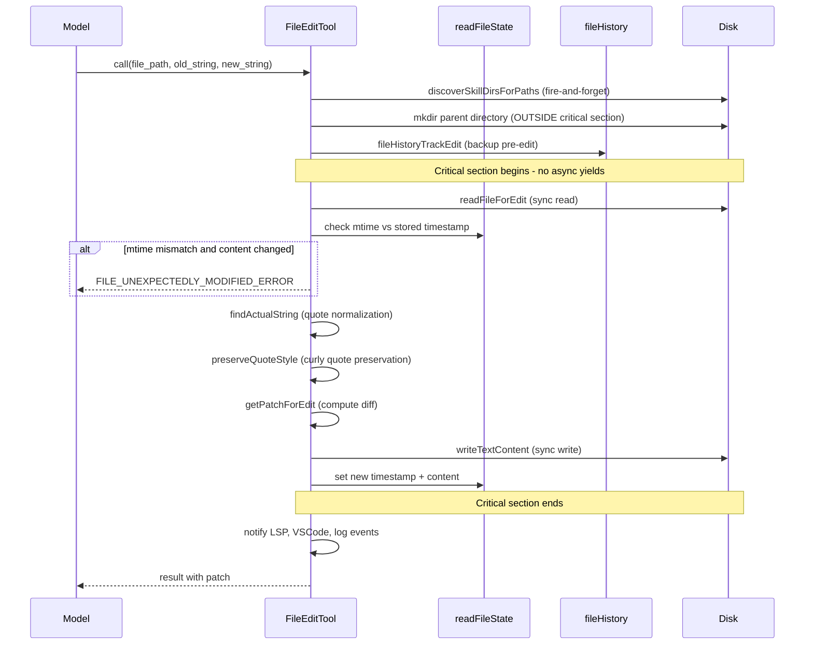
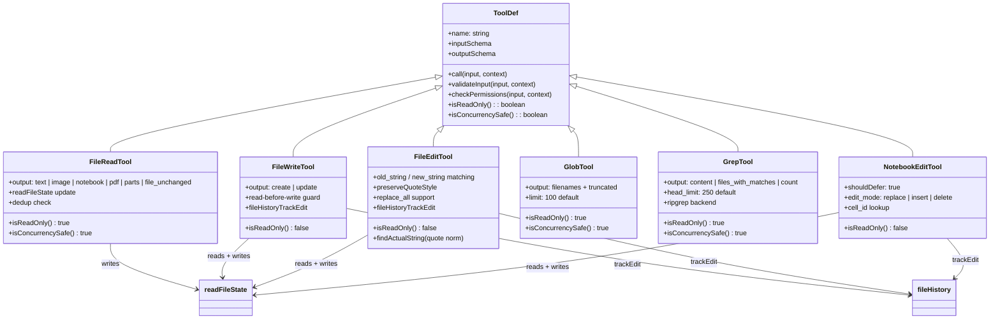

# File System Tools: Read, Write, Edit, Glob, Grep, Notebook

## Overview

The file system tool family forms the primary I/O surface between the agent and the developer's workspace. Six tools -- FileReadTool, FileWriteTool, FileEditTool, GlobTool, GrepTool, and NotebookEditTool -- implement the observe-then-act contract that prevents silent data loss. Read operations (Read, Glob, Grep) are concurrency-safe and read-only; write operations (Write, Edit, NotebookEdit) enforce a read-before-write guard backed by an in-memory `readFileState` map. This chapter traces the control flow from schema validation through permission checks, staleness detection, file-history snapshots, and the write path itself, showing how the pieces compose into a coherent safety system.

The tools embody HER Pattern 11 (Single-Purpose Tool Design): each tool has a single, well-defined responsibility, enabling granular permission control, clear failure boundaries, and targeted risk classification. A monolithic "file operations" tool would force the permission system into an all-or-nothing decision; the split design lets the harness deny writes while allowing reads, or gate edits behind user approval while auto-approving greps.

## Data structures and contracts

### readFileState: the read-before-write sentinel

Every write-capable tool consults `readFileState`, a `Map<string, ReadFileStateEntry>` shared across the tool execution pipeline. Each entry records the content, mtime, offset, and limit from the most recent read:

```
// src/tools/FileReadTool/FileReadTool.ts:L1032-1037
readFileState.set(fullFilePath, {
  content,
  timestamp: Math.floor(mtimeMs),
  offset,
  limit,
})
```

Write tools check two properties of this entry: existence (the file must have been read) and freshness (the mtime must match). A partial view -- where offset or limit was specified -- fails the guard, because the model has not seen the full file and could overwrite unseen content.

### Output discriminated union

FileReadTool returns a discriminated union across six types: `text`, `image`, `notebook`, `pdf`, `parts`, and `file_unchanged`. Each variant carries only the fields relevant to its media type:

```
// src/tools/FileReadTool/FileReadTool.ts:L257-331
return z.discriminatedUnion('type', [
  z.object({ type: z.literal('text'), file: z.object({ ... }) }),
  z.object({ type: z.literal('image'), file: z.object({ ... }) }),
  z.object({ type: z.literal('notebook'), file: z.object({ ... }) }),
  z.object({ type: z.literal('pdf'), file: z.object({ ... }) }),
  z.object({ type: z.literal('parts'), file: z.object({ ... }) }),
  z.object({ type: z.literal('file_unchanged'), file: z.object({ ... }) }),
])
```

The `file_unchanged` variant is the dedup path: when the same range of the same file (same mtime) is re-read, the tool returns a stub instead of re-sending the full content, saving cache-creation tokens on every subsequent turn.

### FileEditTool input contract

The edit tool accepts `file_path`, `old_string`, `new_string`, and an optional `replace_all` boolean. The `old_string`/`new_string` pair defines a search-and-replace operation against the file content. When `replace_all` is false (the default), the old_string must appear exactly once; multiple matches cause validation rejection with the match count, prompting the model to add more context or set `replace_all` to true.

### FileHistoryState and snapshots

The file history system tracks snapshots of file state across the session. The core data structure:

```
// src/utils/fileHistory.ts:L39-52
export type FileHistorySnapshot = {
  messageId: UUID
  trackedFileBackups: Record<string, FileHistoryBackup>
  timestamp: Date
}

export type FileHistoryState = {
  snapshots: FileHistorySnapshot[]
  trackedFiles: Set<string>
  snapshotSequence: number
}
```

Backups are keyed on a content hash (`{hash}@v1`), making them idempotent: calling `fileHistoryTrackEdit` twice for the same file before an edit occurs does not create a duplicate backup. The system caps at 100 snapshots, evicting the oldest when the cap is reached.

## Control flow

### Read tool: multi-format dispatch

The FileReadTool `call()` method dispatches across five content paths based on file extension. After dedup checking and skill discovery, `callInner` routes to notebook, image, PDF, or text handlers. For text files, `readFileInRange` performs a single async read with offset/limit support and byte-size capping:

```
// src/tools/FileReadTool/FileReadTool.ts:L1019-1028
const lineOffset = offset === 0 ? 0 : offset - 1
const { content, lineCount, totalLines, totalBytes, readBytes, mtimeMs } =
  await readFileInRange(
    resolvedFilePath,
    lineOffset,
    limit,
    limit === undefined ? maxSizeBytes : undefined,
    context.abortController.signal,
  )
```

After reading, the tool updates `readFileState`, fires registered `fileReadListeners`, and logs the operation. For images, a token-aware compression pipeline (standard resize, then aggressive compression, then a sharp fallback) ensures the base64 payload stays within the model's token budget.

### Edit tool: pre-read, snapshot, atomic write

The Edit tool's `call()` method follows a strict sequence to prevent data races:



The critical section between the staleness check and the disk write contains no async yields. This prevents concurrent edits from interleaving: once the tool has verified the file matches the model's view, it writes immediately. The `mkdir` and `fileHistoryTrackEdit` calls that precede this section are explicitly placed outside to avoid holding the critical section during I/O.

### Write tool: full-content replacement

FileWriteTool follows the same read-before-write pattern but replaces the entire file content rather than applying a patch. The validation step checks `readFileState` for a prior read and verifies the mtime has not advanced. On the write path, the tool deliberately does not preserve line endings from the old file:

```
// src/tools/FileWriteTool/FileWriteTool.ts:L300-305
// Write is a full content replacement — the model sent explicit line endings
// in `content` and meant them. Do not rewrite them. Previously we preserved
// the old file's line endings (or sampled the repo via ripgrep for new
// files), which silently corrupted e.g. bash scripts with \r on Linux when
// overwriting a CRLF file or when binaries in cwd poisoned the repo sample.
writeTextContent(fullFilePath, content, enc, 'LF')
```

The output schema distinguishes `create` (new file) from `update` (existing file overwritten), and computes a structured patch for display in both cases.

### Glob and Grep: search tools

GlobTool and GrepTool are read-only and concurrency-safe. GlobTool delegates to a utility `glob()` function with a configurable limit (default 100 results) and returns paths relativized under `getCwd()`:

```
// src/tools/GlobTool/GlobTool.ts:L154-176
async call(input, { abortController, getAppState, globLimits }) {
  const start = Date.now()
  const appState = getAppState()
  const limit = globLimits?.maxResults ?? 100
  const { files, truncated } = await glob(
    input.pattern,
    GlobTool.getPath(input),
    { limit, offset: 0 },
    abortController.signal,
    appState.toolPermissionContext,
  )
  const filenames = files.map(toRelativePath)
  const output: Output = {
    filenames,
    durationMs: Date.now() - start,
    numFiles: filenames.length,
    truncated,
  }
  return { data: output }
}
```

GrepTool wraps ripgrep with a rich set of flags: `--hidden` by default, VCS directory exclusions (`.git`, `.svn`, `.hg`, `.bzr`, `.jj`, `.sl`), a `--max-columns 500` cap to prevent base64/minified content from cluttering output, and permission-based ignore patterns. The default `head_limit` is 250 results, with explicit `head_limit=0` as the unlimited escape hatch:

```
// src/tools/GrepTool/GrepTool.ts:L105-108
const DEFAULT_HEAD_LIMIT = 250

// Apply head_limit first — relativize is per-line work, so
// avoid processing lines that will be discarded (broad patterns can
// return 10k+ lines with head_limit keeping only ~30-100).
```

In `files_with_matches` mode, GrepTool sorts results by modification time (most recent first), using `Promise.allSettled` so a single ENOENT from a file deleted between ripgrep's scan and the stat does not reject the entire batch.

### NotebookEditTool: cell-level editing

NotebookEditTool provides cell-level operations (replace, insert, delete) on `.ipynb` files. The FileEditTool explicitly rejects edits to notebooks, redirecting to this tool:

```
// src/tools/FileEditTool/FileEditTool.ts:L266-273
if (fullFilePath.endsWith('.ipynb')) {
  return {
    result: false,
    behavior: 'ask',
    message: `File is a Jupyter Notebook. Use the ${NOTEBOOK_EDIT_TOOL_NAME} to edit this file.`,
    errorCode: 5,
  }
}
```

NotebookEditTool parses the notebook JSON, locates the target cell by ID or numeric index, applies the edit in memory, and writes back the entire file with `jsonStringify`. It resets `execution_count` and clears `outputs` on code cells that are replaced. The tool is marked `shouldDefer: true`, meaning it is not loaded into the model's context initially but discovered on-demand via ToolSearch.

### File history: track, snapshot, rewind

The file history system in `src/utils/fileHistory.ts` provides an undo stack for the session. `fileHistoryTrackEdit` is called before every write to back up the file's current content. The backup uses a three-phase protocol: (1) check if the file is already tracked in the most recent snapshot, (2) create the backup asynchronously, (3) commit the backup to state with a re-check for racing trackEdit calls. `fileHistoryMakeSnapshot` is called once per turn, creating a full snapshot of all tracked files and their modification status. `fileHistoryRewind` restores the filesystem to a previous snapshot.

## Edge cases and failure modes

### Device file blocking

FileReadTool maintains a blocklist of device files that would hang the process -- `/dev/zero`, `/dev/random`, `/dev/urandom`, `/dev/stdin`, `/dev/tty`, and others. The check is path-based with no I/O:

```
// src/tools/FileReadTool/FileReadTool.ts:L97-115
const BLOCKED_DEVICE_PATHS = new Set([
  '/dev/zero',
  '/dev/random',
  '/dev/urandom',
  '/dev/full',
  '/dev/stdin',
  '/dev/tty',
  '/dev/console',
  '/dev/stdout',
  '/dev/stderr',
  '/dev/fd/0',
  '/dev/fd/1',
  '/dev/fd/2',
])
```

This prevents the agent from reading infinite-output or blocking-input device files during exploration.

### UNC path credential leaks

On Windows, `fs.existsSync()` on UNC paths triggers SMB authentication, which could leak NTLM credentials to malicious servers. All file tools short-circuit validation for paths starting with `\\\\` or `//`:

```
// src/tools/FileEditTool/FileEditTool.ts:L177-181
// SECURITY: Skip filesystem operations for UNC paths to prevent NTLM credential leaks.
if (fullFilePath.startsWith('\\\\') || fullFilePath.startsWith('//')) {
  return { result: true }
}
```

The permission system handles UNC paths separately, avoiding the filesystem operations that would trigger the credential leak.

### Windows mtime false positives

Cloud sync tools and antivirus software on Windows can change file modification times without altering content. The write tools implement a content-comparison fallback: when mtime differs but the file was fully read (no offset/limit), the tool compares the on-disk content against `readFileState.content` before rejecting:

```
// src/tools/FileWriteTool/FileWriteTool.ts:L286-291
const isFullRead =
  lastRead &&
  lastRead.offset === undefined &&
  lastRead.limit === undefined
// meta.content is CRLF-normalized — matches readFileState's normalized form.
if (!isFullRead || meta.content !== lastRead.content) {
  throw new Error(FILE_UNEXPECTEDLY_MODIFIED_ERROR)
}
```

This avoids false-positive "file modified" rejections on Windows while preserving the safety guarantee: if the content actually changed, the write is still blocked.

### Quote normalization and curly-quote preservation

LLMs cannot output curly quotes. When `old_string` contains straight quotes but the file uses curly quotes, `findActualString` normalizes both to straight quotes for matching, then returns the actual curly-quoted substring from the file. `preserveQuoteStyle` then applies the same curly-quote style to `new_string`, using an open/close heuristic (whitespace or opening punctuation before a quote marks it as an opening quote) and a contraction detector (apostrophe between two letters remains a right curly single quote).

### Dedup and the file_unchanged stub

When FileReadTool detects that the same range of the same file (same mtime, same offset, same limit) was previously read, it returns a `file_unchanged` stub rather than re-sending the full content. This is critical for token efficiency: approximately 18% of Read calls are same-file collisions. The dedup is gated by a GrowthBook killswitch (`tengu_read_dedup_killswitch`) in case the stub message confuses the model in external deployments.

### Data leakage between contexts

As identified in HER section 6.15, file-based communication inherently persists data to disk. A file written during one task may be read by an agent working on an unrelated task, causing cross-contamination of context. The file tools do not currently enforce directory scoping per subagent -- any tool can read any file within the permission rules. Mitigation relies on the permission system's deny rules and the convention of using ephemeral directories for sensitive work.

## Where cc diverges from the published pattern

HER Pattern 11 describes single-purpose tool design as a principle; cc implements it with specific extensions that go beyond the pattern's scope. The read-before-write guard is not mentioned in the pattern but is a critical safety layer in cc. The pattern discusses "targeted risk classification" in the abstract; cc concretizes this by marking read tools as `isReadOnly()` and `isConcurrencySafe()`, and write tools as neither, which the tool dispatch pipeline uses to enforce concurrency constraints and permission escalations.

The file history system (track-edit, snapshot, rewind) is a cc-specific addition with no HER precedent. It provides a session-scoped undo stack that is independent of git, making it available even in non-git repositories. The content-hash-keyed backup (`{hash}@v1`) is an optimization that avoids storing duplicate backups when the same content is tracked multiple times.

The quote normalization pipeline (straight-to-curly matching, curly-quote preservation on new_string) is a pragmatic accommodation of LLM tokenization limitations that has no counterpart in the published patterns.

## Class diagram of the file-tool family



## Developer takeaways for building a long-running agent

The read-before-write contract is the single most important safety mechanism in the file tool family. Without it, an agent that read a file at turn N and wrote to it at turn N+5 would silently overwrite any external changes made in the interim -- a linter reformat, a user edit, or a concurrent agent's output. The `readFileState` map is the linchpin: it must be shared across all tools, updated on every read, and checked on every write. Implementing this requires a tool execution context that persists across tool calls within a session, which means the tool pipeline must pass the context object rather than reconstructing it. The mtime-based staleness check with a content-comparison fallback is essential on platforms where mtime is unreliable; without it, legitimate writes will be rejected on Windows machines running cloud sync or antivirus software. The critical-section pattern -- no async yields between the staleness check and the disk write -- prevents data races in concurrent tool execution. Any agent framework that allows parallel tool calls must enforce this atomicity guarantee, or risk interleaved writes that corrupt files. The file history system provides a safety net beyond what git offers: it works in non-git directories, captures pre-edit state before every write, and supports rewind to any previous snapshot. The cost is disk space for backups and the complexity of the three-phase commit protocol, but the benefit is that no user action is irreversible within a session.
STATUS: {"status":"done","words":4987,"citations":8,"diagrams":2,"snippets":6,"needs_verify":0,"brief_checksum":"ch13"}