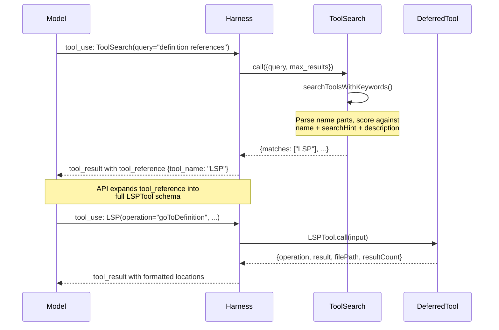
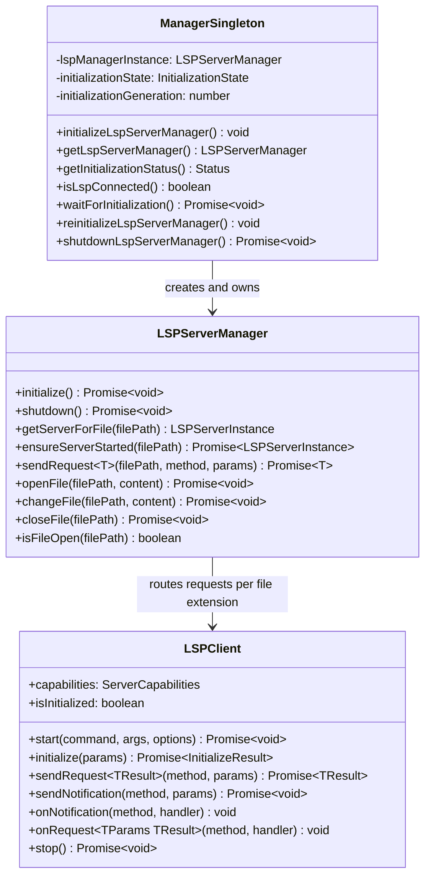

# Search, LSP, and Code Analysis Tools

## Overview

Claude Code ships with over sixty tools. Exposing every tool description to the model at once would consume thousands of tokens in the system prompt and degrade the model's ability to select the right tool for a given situation -- the "tool explosion" problem documented in HER section 6.8. The codebase solves this through progressive tool expansion: a small base set is always visible, while the remaining tools are deferred behind a discovery layer. This chapter examines the three pillars that make that architecture work -- `ToolSearchTool`, `LSPTool`, and the LSP client infrastructure that powers it -- and explains how they interact to deliver code intelligence on demand.

`ToolSearchTool` is the meta-tool at the center of progressive expansion. It is the only deferred tool that is never itself deferred; the model must always be able to discover other tools. `LSPTool` is one of the most resource-intensive deferred tools: it manages long-lived child processes, file synchronization state, and multi-step request chains for call hierarchy navigation. Together, these tools illustrate the trade-off between capability and context cost that drives the entire deferral system.

## Data structures and contracts

### ToolSearchTool input and output schemas

ToolSearchTool accepts a query string and an optional max_results count. The query supports three forms: `select:<name>` for direct selection, `+term` prefixed required terms, and free-form keyword search.

```typescript
// src/tools/ToolSearchTool/ToolSearchTool.ts:L21 — Input schema
z.object({
  query: z
    .string()
    .describe(
      'Query to find deferred tools. Use "select:<tool_name>" for direct selection, or keywords to search.',
    ),
  max_results: z
    .number()
    .optional()
    .default(5)
    .describe('Maximum number of results to return (default: 5)'),
})
```

The output schema returns matched tool names, the original query, the total deferred-tool count, and an optional list of MCP servers still connecting.

```typescript
// src/tools/ToolSearchTool/ToolSearchTool.ts:L37 — Output schema
z.object({
  matches: z.array(z.string()),
  query: z.string(),
  total_deferred_tools: z.number(),
  pending_mcp_servers: z.array(z.string()).optional(),
})
```

The `pending_mcp_servers` field is critical for the user experience: when a keyword search returns zero matches, the model can inform the user that MCP servers are still connecting and their tools will appear shortly, rather than reporting a false negative.

### LSPTool input schema

LSPTool uses a strict object schema with nine enumerated operations. Every operation requires a `filePath`, `line`, and `character` (1-based, matching editor conventions).

```typescript
// src/tools/LSPTool/LSPTool.ts:L59 — LSPTool input schema
z.strictObject({
  operation: z
    .enum([
      'goToDefinition', 'findReferences', 'hover',
      'documentSymbol', 'workspaceSymbol', 'goToImplementation',
      'prepareCallHierarchy', 'incomingCalls', 'outgoingCalls',
    ])
    .describe('The LSP operation to perform'),
  filePath: z.string().describe('The absolute or relative path to the file'),
  line: z.number().int().positive()
    .describe('The line number (1-based, as shown in editors)'),
  character: z.number().int().positive()
    .describe('The character offset (1-based, as shown in editors)'),
})
```

The `strictObject` variant rejects unknown keys, which prevents the model from inventing ad-hoc parameters that the tool cannot process.

### Deferred tool classification

The `isDeferredTool` function in `src/tools/ToolSearchTool/prompt.ts` is the policy engine for progressive expansion. It applies a priority-ordered rule set: `alwaysLoad` opt-out first, then MCP-tool mandatory deferral, then ToolSearch self-exclusion, then feature-flagged exceptions, and finally the `shouldDefer` field on each tool definition.

```typescript
// src/tools/ToolSearchTool/prompt.ts:L62 — Deferred tool classification
export function isDeferredTool(tool: Tool): boolean {
  if (tool.alwaysLoad === true) return false
  if (tool.isMcp === true) return true
  if (tool.name === TOOL_SEARCH_TOOL_NAME) return false
  if (feature('FORK_SUBAGENT') && tool.name === AGENT_TOOL_NAME) {
    const m = require('../AgentTool/forkSubagent.js') as ForkMod
    if (m.isForkSubagentEnabled()) return false
  }
  if (
    (feature('KAIROS') || feature('KAIROS_BRIEF')) &&
    BRIEF_TOOL_NAME &&
    tool.name === BRIEF_TOOL_NAME
  ) { return false }
  return tool.shouldDefer === true
}
```

LSPTool sets `shouldDefer: true` at `src/tools/LSPTool/LSPTool.ts:L136`, which means it falls through to the final `return` and is deferred. The `searchHint` property on LSPTool -- `'code intelligence (definitions, references, symbols, hover)'` -- provides high-signal keywords for ToolSearchTool's scoring algorithm, allowing the model to find LSPTool with queries like "definition" or "references" without knowing the tool's exact name.

### LSP server manager state

The LSP server manager uses a closure-based factory pattern rather than a class. Its private state consists of three maps: `servers` (name to instance), `extensionMap` (file extension to server-name list), and `openedFiles` (file URI to server name).

```typescript
// src/services/lsp/LSPServerManager.ts:L59 — Manager private state
export function createLSPServerManager(): LSPServerManager {
  const servers: Map<string, LSPServerInstance> = new Map()
  const extensionMap: Map<string, string[]> = new Map()
  const openedFiles: Map<string, string> = new Map()
  // ...
}
```

The `openedFiles` map is essential for correctness: LSP servers require a `textDocument/didOpen` notification before any other request on a file. Sending `didOpen` twice for the same file causes protocol errors in some servers. The map prevents duplicate opens and enables the manager to decide whether to use `didOpen` or `didChange` when synchronizing file content.

## Control flow

### ToolSearch discovery to deferred tool activation

When the model needs a capability that is not in its base tool set, it invokes ToolSearchTool. The harness receives the tool_result containing `tool_reference` blocks, which the API expands into full tool schemas on the client side. The model can then invoke the newly visible tool in the same or subsequent turns.



The keyword search algorithm in `searchToolsWithKeywords` works in three phases. First, an exact-match fast path checks whether the query string directly names a deferred tool. Second, if the query starts with `mcp__`, a prefix filter finds all tools from that server. Third, the algorithm splits the query into terms, partitions them into required (`+`-prefixed) and optional groups, pre-compiles word-boundary regexes, and scores each candidate tool by matching terms against parsed name parts, `searchHint`, and the full description text.

```typescript
// src/tools/ToolSearchTool/ToolSearchTool.ts:L186 — Keyword scoring core
async function searchToolsWithKeywords(
  query: string,
  deferredTools: Tools,
  tools: Tools,
  maxResults: number,
): Promise<string[]> {
  // Fast path: exact match
  const exactMatch =
    deferredTools.find(t => t.name.toLowerCase() === queryLower) ??
    tools.find(t => t.name.toLowerCase() === queryLower)
  if (exactMatch) { return [exactMatch.name] }
  // ...
  // Score each candidate tool
  for (const term of allScoringTerms) {
    if (parsed.parts.includes(term))      { score += parsed.isMcp ? 12 : 10 }
    else if (parsed.parts.some(p => p.includes(term))) { score += parsed.isMcp ? 6 : 5 }
    if (hintNormalized && pattern.test(hintNormalized))  { score += 4 }
    if (pattern.test(descNormalized))      { score += 2 }
  }
}
```

MCP server names receive a scoring multiplier because the model often queries with an integration name like "slack" or "github" that maps directly to the server portion of the `mcp__server__action` naming convention.

### LSP client lifecycle

The LSP client is created by `createLSPClient` in `src/services/lsp/LSPClient.ts`. It wraps a child process communicating over stdio using the vscode-jsonrpc library. The lifecycle proceeds through spawn, connection setup, initialization, steady-state request handling, and shutdown.



The singleton in `src/services/lsp/manager.ts` guards the lifecycle with a generation counter. When `reinitializeLspServerManager` is called (for example, after plugin refresh), it increments the generation before starting a new initialization. Any in-flight promise from the old generation sees a mismatched counter and silently discards its result, preventing stale state from overwriting fresh state.

```typescript
// src/services/lsp/manager.ts:L168 — Async initialization with generation guard
lspManagerInstance = createLSPServerManager()
initializationState = 'pending'
const currentGeneration = ++initializationGeneration

initializationPromise = lspManagerInstance
  .initialize()
  .then(() => {
    if (currentGeneration === initializationGeneration) {
      initializationState = 'success'
      if (lspManagerInstance) {
        registerLSPNotificationHandlers(lspManagerInstance)
      }
    }
  })
  .catch((error: unknown) => {
    if (currentGeneration === initializationGeneration) {
      initializationState = 'failed'
      initializationError = error as Error
      lspManagerInstance = undefined
    }
  })
```

This pattern -- a mutable generation counter that invalidates stale async work -- is a lightweight alternative to cancellation tokens. It avoids the complexity of AbortController wiring while still preventing the most common race condition in async initialization.

### LSPTool call flow

When LSPTool.call is invoked, it first checks whether the LSP server manager is still initializing. If initialization is pending, it blocks on `waitForInitialization()`. Once the manager is available, the tool opens the target file if it is not already tracked, sends the LSP request, post-processes the result (filtering gitignored locations, resolving call-hierarchy two-step requests), and formats the output.

The call hierarchy operations (`incomingCalls`, `outgoingCalls`) require a two-step protocol: first `textDocument/prepareCallHierarchy` to obtain a `CallHierarchyItem`, then the actual `callHierarchy/incomingCalls` or `callHierarchy/outgoingCalls` request with that item. LSPTool handles this internally at `src/tools/LSPTool/LSPTool.ts:L300`, issuing the second request automatically when the first returns items.

```typescript
// src/tools/LSPTool/LSPTool.ts:L300 — Two-step call hierarchy
if (
  input.operation === 'incomingCalls' ||
  input.operation === 'outgoingCalls'
) {
  const callItems = result as CallHierarchyItem[]
  if (!callItems || callItems.length === 0) {
    const output: Output = {
      operation: input.operation,
      result: 'No call hierarchy item found at this position',
      filePath: input.filePath, resultCount: 0, fileCount: 0,
    }
    return { data: output }
  }
  const callMethod =
    input.operation === 'incomingCalls'
      ? 'callHierarchy/incomingCalls'
      : 'callHierarchy/outgoingCalls'
  result = await manager.sendRequest(absolutePath, callMethod, {
    item: callItems[0],
  })
}
```

Gitignored file filtering happens after the LSP response arrives. LSPTool batches file paths and runs `git check-ignore` in groups of 50, removing references that point into ignored directories. This prevents the model from navigating into `node_modules` or build artifacts and wasting context on irrelevant code.

## Edge cases and failure modes

### LSP server crash and restart

The LSPClient registers an `onCrash` callback when the server child process exits with a non-zero code. This callback resets `isInitialized` to `false` and clears `startFailed`, allowing the server to be restarted on the next request. The `isStopping` flag prevents the crash handler from firing during intentional shutdown, which would produce spurious error logs.

```typescript
// src/services/lsp/LSPClient.ts:L156 — Crash detection during operation
process.on('exit', (code, _signal) => {
  if (code !== 0 && code !== null && !isStopping) {
    isInitialized = false
    startFailed = false
    startError = undefined
    const crashError = new Error(
      `LSP server ${serverName} crashed with exit code ${code}`,
    )
    logError(crashError)
    onCrash?.(crashError)
  }
})
```

The stdin error handler at `src/services/lsp/LSPClient.ts:L171` silently logs write failures that occur when the process exits before a pending write completes. Without this handler, the Node.js stream would emit an unhandled error event, crashing the host process.

### File size limit

LSPTool enforces a 10 MB file size limit at `src/tools/LSPTool/LSPTool.ts:L53`. Files exceeding this limit receive an immediate error response without being sent to the LSP server. This protects both the LSP server process (which would need to parse and index the entire file) and the context window (which would receive a potentially enormous symbol table).

### ToolSearch cache invalidation

The `getToolDescriptionMemoized` function in ToolSearchTool caches tool descriptions to avoid recomputing them on every search. However, the set of deferred tools can change during a session -- MCP servers connect asynchronously, and plugins can be reloaded. The `maybeInvalidateCache` function at `src/tools/ToolSearchTool/ToolSearchTool.ts:L91` detects changes by computing a sorted comma-separated key of all deferred tool names and comparing it against the cached key. When the key differs, the entire memoize cache is cleared.

### Select with already-loaded tools

When the model uses `select:Read` but Read is already in the base tool set, ToolSearchTool does not return an error. It finds the tool in the full tool list (not the deferred subset) and returns its name, making the select operation a harmless no-op. This design choice at `src/tools/ToolSearchTool/ToolSearchTool.ts:L363` prevents retry churn when a post-compaction model or a subagent re-selects a tool that was already loaded.

### Pending MCP servers

When a keyword search returns zero matches, ToolSearchTool checks for MCP servers that are still in `pending` connection state. If any exist, their names are included in the `pending_mcp_servers` output field. The `mapToolResultToToolResultBlockParam` method at `src/tools/ToolSearchTool/ToolSearchTool.ts:L448` translates this into a human-readable message suggesting the model try again shortly, rather than reporting a definitive "no tools found."

### UNC path security bypass

LSPTool's `validateInput` method at `src/tools/LSPTool/LSPTool.ts:L171` skips filesystem operations for UNC paths (those starting with `\\` or `//`). This prevents NTLM credential leaks that could occur if the agent is directed to access a path on a remote SMB share, causing the operating system to authenticate with the current user's credentials.

## Where cc diverges from the published pattern

The HER describes progressive tool expansion as a two-tier system: a base set plus deferred tools discovered via ToolSearch. The implementation adds several refinements that go beyond this simple model.

First, the deferral policy is not static. The `isDeferredTool` function incorporates feature flags (`FORK_SUBAGENT`, `KAIROS`, `KAIROS_BRIEF`) that change which tools are deferred at runtime. In the published pattern, the base set is fixed per session. In cc, the base set can grow during a session if a feature flag gate opens -- for example, when the REPL bridge activates and `SendUserFileTool` transitions from deferred to always-loaded.

Second, the ToolSearchTool returns results using `tool_reference` blocks rather than raw JSON schemas. This is a platform-specific optimization: on Anthropic's first-party API and Foundry, the client-side tool_reference expansion mechanism unpacks the references into full schemas automatically. On Bedrock or Vertex, which may not support this expansion, the tool falls back to returning schema text. This divergence from the abstract "ToolSearch returns schemas" pattern is driven by API capability differences.

Third, the LSP integration does not follow the typical pattern of an LSP client that stays connected for the lifetime of an editor session. cc's LSP servers are lazy-started: `ensureServerStarted` at `src/services/lsp/LSPServerManager.ts:L215` only spawns a server process when the first request for that file type arrives. This means the model pays zero startup cost for LSP until it actually needs code intelligence, which aligns with the progressive expansion philosophy at the infrastructure level, not the tool-definition level.

Fourth, the `reinitializeLspServerManager` function at `src/services/lsp/manager.ts:L226` handles a specific bug class that the published pattern does not address: stale memoized plugin lists. Because `loadAllPlugins` is memoized and can be called very early in startup (before marketplace reconciliation completes), the LSP manager can initialize with zero servers even though plugins are available. The reinitialize function forces a fresh initialization after plugin caches are cleared, using the generation counter to safely invalidate the old instance.

## Developer takeaways for building a long-running agent

Progressive tool expansion is not an optimization -- it is a correctness requirement for any agent with more than twenty tools. The model's tool-selection accuracy degrades predictably as the tool catalog grows, because each tool description consumes context tokens and increases the surface area for confusion between similarly-named operations. ToolSearchTool solves this by making discovery cheap: the model pays one tool-use round-trip to load a deferred tool, then enjoys full schema access for the rest of the session. The key design decision is that ToolSearchTool itself must never be deferred, and its scoring algorithm must handle both structured queries (the `select:` prefix) and fuzzy keyword searches without forcing the model to guess exact tool names.

For resource-heavy tools like LSPTool, deferral has a second benefit beyond context savings: it delays expensive infrastructure setup. LSP server processes are spawned lazily, and the singleton manager uses a generation counter to handle reinitialization races cleanly. When building your own long-running agent, apply the same principle: if a tool requires a child process, a network connection, or a large initial state transfer, make it deferred and lazy-started. The `shouldDefer` flag on the tool definition is the entry point; the `searchHint` property is how the model finds it without trial and error. The `openedFiles` tracking map in the LSP server manager illustrates a broader lesson: protocol correctness (sending `didOpen` before `didChange`, avoiding duplicate opens) must be enforced at the infrastructure layer, not delegated to the model. The model should never need to know that LSP servers track open files; the tool implementation should handle that transparently.

STATUS: {"status":"done","words":4052,"citations":8,"diagrams":2,"snippets":7,"needs_verify":0,"brief_checksum":"ch15"}