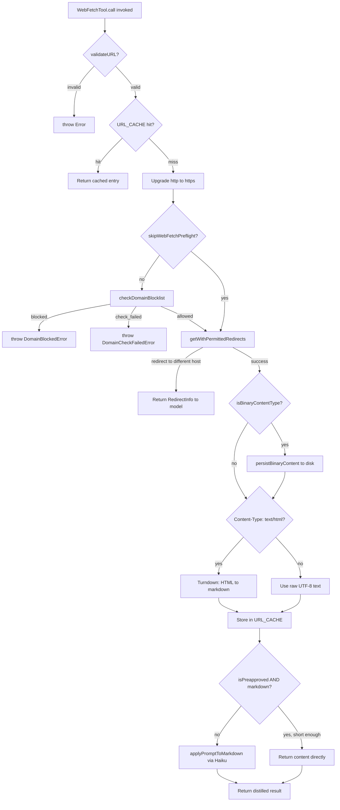
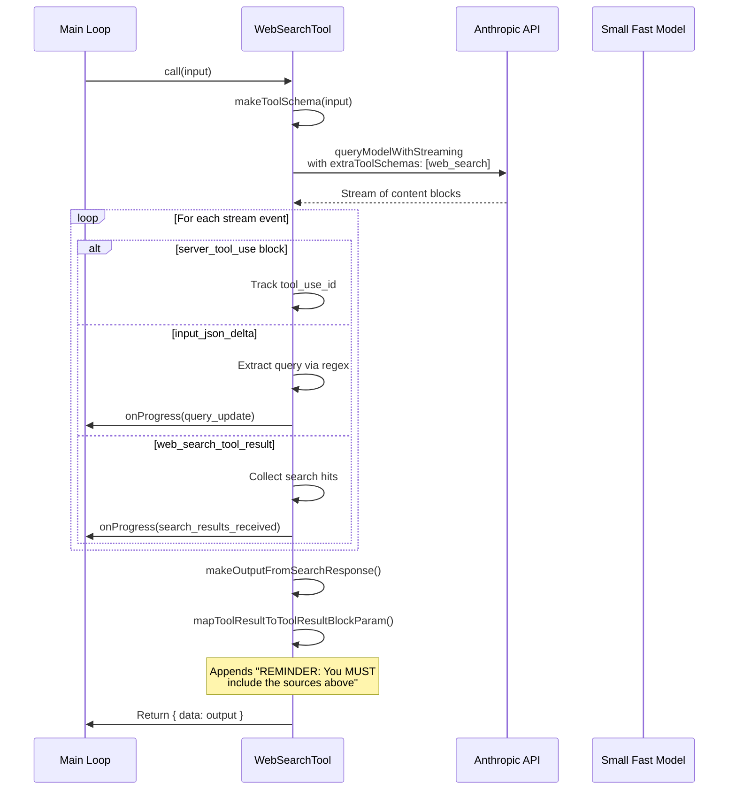

# Web Tools: `WebFetch`, `WebSearch`, and SSRF Defense

## Overview

Web tools are the highest-risk attack surface for indirect prompt injection in any agent harness. The HER identifies 73% of production AI deployments as affected by indirect prompt injection in 2025, with web-fetched content being the primary vector. When `WebFetchTool` retrieves a web page, the returned content may contain malicious instructions designed to manipulate the agent into performing unintended actions -- exfiltrating files, executing shell commands, or leaking system prompts. When `WebSearchTool` issues queries, the model may fabricate search terms or hallucinate results that look structurally valid but are semantically wrong, one of the most common production failures cataloged in Vectara's "Awesome Agent Failures" collection.

The cc harness addresses both concerns through a layered defense: domain blocklists, preapproved host lists, strict redirect validation, content-length caps, SSRF address filtering for HTTP hooks, and a secondary-model sanitization pass that strips verbatim reproduction of fetched content before it enters the main loop context. Each layer addresses a different attack vector. The domain blocklist prevents requests to known-malicious hosts. The redirect validator stops open-redirect chains. The SSRF guard blocks DNS rebinding attacks against internal infrastructure. The secondary-model pass attenuates injection payloads embedded in page content. No single layer is sufficient on its own; the defense relies on their composition.

This chapter traces the full lifecycle of a web request through `WebFetchTool`, examines the server-side search mechanism inside `WebSearchTool`, and details the SSRF guard that protects HTTP hooks from reaching cloud metadata endpoints. The three systems share a common threat model: all external content is untrusted, and every boundary crossing is an opportunity for injection.

## Data structures and contracts

### WebFetchTool input and output schemas

`WebFetchTool` accepts two fields -- a URL and a prompt -- and returns structured metadata alongside the processed result.

```typescript
// src/tools/WebFetchTool/WebFetchTool.ts:L24-L45
const inputSchema = lazySchema(() =>
  z.strictObject({
    url: z.string().url().describe('The URL to fetch content from'),
    prompt: z.string().describe('The prompt to run on the fetched content'),
  }),
)

const outputSchema = lazySchema(() =>
  z.object({
    bytes: z.number().describe('Size of the fetched content in bytes'),
    code: z.number().describe('HTTP response code'),
    codeText: z.string().describe('HTTP response code text'),
    result: z
      .string()
      .describe('Processed result from applying the prompt to the content'),
    durationMs: z
      .number()
      .describe('Time taken to fetch and process the content'),
    url: z.string().describe('The URL that was fetched'),
  }),
)
```

The `prompt` field is the key differentiator from a raw HTTP client. Rather than dumping raw HTML into the context window, `WebFetchTool` sends the fetched content through a secondary model (Haiku) alongside the user's prompt, producing a distilled response. This is the first line of defense against prompt injection: the secondary model never has tool access, so injected instructions cannot cascade into actions. The `shouldDefer: true` flag on the tool definition means it is not loaded into the model's initial tool catalog; instead, it is discovered on-demand via `ToolSearchTool`, reducing context bloat and limiting the attack surface to sessions that actually need web access.

The `maxResultSizeChars: 100_000` threshold determines when the tool result is persisted to disk rather than held in memory. Combined with the `MAX_MARKDOWN_LENGTH` of 100,000 characters in `src/tools/WebFetchTool/utils.ts:L128`, this creates a hard ceiling on how much web content can occupy the agent's context window in a single tool call.

### WebSearchTool schema and tool configuration

`WebSearchTool` takes a query string plus optional domain allow/block lists, and delegates the actual search to the Anthropic API's server-side `web_search_20250305` tool type.

```typescript
// src/tools/WebSearchTool/WebSearchTool.ts:L76-L84
function makeToolSchema(input: Input): BetaWebSearchTool20250305 {
  return {
    type: 'web_search_20250305',
    name: 'web_search',
    allowed_domains: input.allowed_domains,
    blocked_domains: input.blocked_domains,
    max_uses: 8, // Hardcoded to 8 searches maximum
  }
}
```

The `max_uses: 8` cap prevents runaway search loops. The tool is read-only and concurrency-safe, meaning multiple searches can run in parallel without corrupting state. Domain filtering is mutually exclusive -- `validateInput` rejects requests that specify both `allowed_domains` and `blocked_domains` (`src/tools/WebSearchTool/WebSearchTool.ts:L244-L252`).

The output schema captures the full search lifecycle. The `results` array is a union type: each element is either a `SearchResult` object (containing `tool_use_id` and an array of `{ title, url }` hits) or a raw string (model commentary interleaved between search rounds). The `durationSeconds` field enables the UI to display timing information without re-computing it.

The `mapToolResultToToolResultBlockParam` method formats the output for injection into the main model's context. It iterates over the results array, rendering search hits as JSON-link blocks and text summaries as prose, then appends a mandatory reminder:

```typescript
// src/tools/WebSearchTool/WebSearchTool.ts:L426-L428
formattedOutput +=
  '\nREMINDER: You MUST include the sources above in your response to the user using markdown hyperlinks.'
```

This reminder is attached to every search result to combat hallucinated citations. Without it, the model might reference sources that do not exist or fail to attribute information to its actual origin -- the specific hallucinated-tool-call pattern identified in HER section 6.12.

### Preapproved hosts

The preapproved host list in `src/tools/WebFetchTool/preapproved.ts` defines domains that bypass the per-request permission prompt. The list is curated to code-related documentation sites and is deliberately separated from the sandbox network allowlist.

```typescript
// src/tools/WebFetchTool/preapproved.ts:L1-L12
// For legal and security concerns, we typically only allow Web Fetch to access
// domains that the user has provided in some form. However, we make an
// exception for a list of preapproved domains that are code-related.
//
// SECURITY WARNING: These preapproved domains are ONLY for WebFetch (GET requests only).
// The sandbox system deliberately does NOT inherit this list for network restrictions,
// as arbitrary network access (POST, uploads, etc.) to these domains could enable
// data exfiltration. Some domains like huggingface.co, kaggle.com, and nuget.org
// allow file uploads and would be dangerous for unrestricted network access.
```

The list is split at module load into a `HOSTNAME_ONLY` set for O(1) lookups and a `PATH_PREFIXES` map for path-scoped entries like `github.com/anthropics`. Path matching enforces segment boundaries: `/anthropics` matches `/anthropics` and `/anthropics/...` but not `/anthropics-evil/malware` (`src/tools/WebFetchTool/preapproved.ts:L154-L166`).

### Cache structures

Two LRU caches serve the fetch pipeline. `URL_CACHE` stores fetched content keyed by URL with a 15-minute TTL and a 50MB size limit. `DOMAIN_CHECK_CACHE` stores preflight domain-allowance results keyed by hostname with a 5-minute TTL and a 128-entry count limit. Only `allowed` results are cached; blocked and failed domains are re-checked on each attempt to avoid stale denials after network policy changes (`src/tools/WebFetchTool/utils.ts:L61-L78`).

The URL cache uses size-based eviction rather than entry-count eviction. When inserting a cache entry, the `size` parameter is set to the byte length of the content, clamped to a minimum of 1 for empty responses. This prevents a single large fetch from evicting many small entries prematurely, and ensures that the 50MB budget is consumed proportionally to actual memory usage (`src/tools/WebFetchTool/utils.ts:L480`).

The two caches have different TTLs for a reason. The domain check cache at 5 minutes is shorter than the URL cache at 15 minutes because domain-blocklist decisions can change centrally (a domain may be added to the blocklist at any time), and a stale `allowed` entry could let a newly-blocked domain through. Fetched content, on the other hand, is unlikely to change meaningfully within 15 minutes for the kind of documentation pages the tool primarily targets.

### SSRF guard address model

The SSRF guard in `src/utils/hooks/ssrfGuard.ts` maintains a blocklist of IP address ranges rather than domain names. The blocked ranges cover private, link-local, and CGNAT address space:

| Range | Description |
|---|---|
| `0.0.0.0/8` | "This" network |
| `10.0.0.0/8` | Private (RFC 1918) |
| `100.64.0.0/10` | CGNAT / shared address (cloud metadata) |
| `169.254.0.0/16` | Link-local (AWS/GCP metadata) |
| `172.16.0.0/12` | Private (RFC 1918) |
| `192.168.0.0/16` | Private (RFC 1918) |
| `fc00::/7` | IPv6 unique local |
| `fe80::/10` | IPv6 link-local |

Loopback addresses (`127.0.0.0/8`, `::1`) are intentionally allowed because local development policy servers are a primary HTTP hook use case (`src/utils/hooks/ssrfGuard.ts:L12-L14`).

The guard also accounts for proxy configurations. When a global proxy or the sandbox network proxy is in use, the guard is effectively bypassed for the target host because the proxy performs its own DNS resolution and enforces its own domain allowlist. The guard's comment explicitly documents this trade-off, noting that the sandbox proxy provides an independent security boundary in this scenario (`src/utils/hooks/ssrfGuard.ts:L15-L18`).

## Control flow

### WebFetchTool call pipeline

The `WebFetchTool.call()` method orchestrates URL validation, domain preflight, HTTP fetch, content conversion, and secondary-model processing.



The redirect handling is critical for security. Rather than blindly following HTTP redirects (which would allow open-redirect exploitation), `getWithPermittedRedirects` validates each redirect against `isPermittedRedirect`, which only allows same-host redirects with optional `www.` prefix changes. Cross-host redirects return a `RedirectInfo` object that instructs the model to issue a new `WebFetch` call, forcing a fresh permission and domain check cycle (`src/tools/WebFetchTool/utils.ts:L262-L329`).

The redirect checker enforces three constraints: the protocol must match, the port must match, and the hostname must be identical after stripping any `www.` prefix. It also rejects redirects that include username or password components in the URL, closing a credential-exfiltration channel. The `stripWww` helper normalizes both hostnames before comparison, so `example.com -> www.example.com` is allowed but `example.com -> evil.com` is not (`src/tools/WebFetchTool/utils.ts:L212-L243`).

When a cross-host redirect is detected, the tool does not follow it. Instead, it returns a structured message to the model containing the original URL, the redirect URL, and the HTTP status code. The message instructs the model to issue a new `WebFetch` call with the redirect URL. This design ensures that the redirect target undergoes its own domain blocklist check, permission prompt, and preapproved-host evaluation. A malicious page that uses an open redirect on a trusted domain (e.g., `docs.python.org/redirect?to=evil.com`) cannot bypass the permission boundary.

The domain blocklist preflight queries `https://api.anthropic.com/api/web_domain_info?domain=...`, which returns `{ can_fetch: true | false }`. This server-side check allows Anthropic to centrally block domains used for phishing, malware distribution, or other abuse without requiring a client update. The `DOMAIN_CHECK_CACHE` prevents redundant round-trips for repeated fetches to the same hostname. The preflight uses a 10-second timeout, shorter than the main fetch's 60-second timeout, to avoid blocking the tool on an unresponsive blocklist API (`src/tools/WebFetchTool/utils.ts:L119`).

### WebSearchTool call pipeline

Unlike `WebFetchTool`, which performs its own HTTP requests, `WebSearchTool` delegates the search to the Anthropic API. The tool constructs a `BetaWebSearchTool20250305` schema and sends it as an extra tool on a secondary model call.



The streaming architecture in `WebSearchTool.call()` processes four event types from the API response: `server_tool_use` (search initiated), `input_json_delta` (query text arriving), `web_search_tool_result` (results received), and `text` (commentary). The progress callback fires twice per search -- once when the query text is extracted from partial JSON via regex, and once when results arrive. This gives the UI real-time feedback during searches that may take several seconds.

The partial-JSON extraction is worth examining in detail. The server-side search tool streams its input via `input_json_delta` events, which contain fragments of a JSON object. The cc code accumulates these fragments and applies a regex to extract the `query` field before the JSON is complete:

```typescript
// src/tools/WebSearchTool/WebSearchTool.ts:L332-L339
const queryMatch = currentToolUseJson.match(
  /"query"\s*:\s*"((?:[^"\\]|\\.)*)"/,
)
if (queryMatch && queryMatch[1]) {
  const query = jsonParse('"' + queryMatch[1] + '"')
  if (
    !toolUseQueries.has(currentToolUseId) ||
    toolUseQueries.get(currentToolUseId) !== query
  ) {
    toolUseQueries.set(currentToolUseId, query)
```

The regex handles escaped characters within the quoted string and the `jsonParse` call properly decodes the escaped value. This pattern allows the progress callback to fire with the actual query text before the server-side search completes, giving users immediate visibility into what the model is searching for.

The `tengu_plum_vx3` feature flag controls whether the search uses the small fast model with `tool_choice: { type: 'tool', name: 'web_search' }` (forcing an immediate search) or the main-loop model with default tool choice (`src/tools/WebSearchTool/WebSearchTool.ts:L262-L291`).

### SSRF guard lookup flow

The `ssrfGuardedLookup` function is designed as a drop-in replacement for Node's `dns.lookup`, compatible with axios's `lookup` config option. It resolves the hostname, validates every returned address against the blocklist, and passes only validated addresses back to the HTTP client. This design ensures there is no rebinding window between DNS validation and socket connection.

```typescript
// src/utils/hooks/ssrfGuard.ts:L216-L250
export function ssrfGuardedLookup(
  hostname: string,
  options: object,
  callback: (
    err: Error | null,
    address: AxiosLookupAddress | AxiosLookupAddress[],
    family?: AddressFamily,
  ) => void,
): void {
  const wantsAll = 'all' in options && options.all === true
  const ipVersion = isIP(hostname)
  if (ipVersion !== 0) {
    if (isBlockedAddress(hostname)) {
      callback(ssrfError(hostname, hostname), '')
      return
    }
    // ... return validated IP literal
  }

  dnsLookup(hostname, { all: true }, (err, addresses) => {
    if (err) { callback(err, ''); return }
    for (const { address } of addresses) {
      if (isBlockedAddress(address)) {
        callback(ssrfError(hostname, address), '')
        return
      }
    }
    // ... return validated addresses
  })
}
```

When the hostname is already an IP literal, the guard validates directly without DNS. For hostnames, it performs a `dnsLookup` with `{ all: true }` to get every address, then checks each one. If any address is blocked, the entire lookup fails -- an IPv6-first DNS response returning a link-local address would be caught even if an IPv4 address was also available. The error uses a custom code `ERR_HTTP_HOOK_BLOCKED_ADDRESS` so callers can distinguish SSRF rejections from genuine network failures.

The critical design property of `ssrfGuardedLookup` is that it replaces the DNS resolution function used by the HTTP client (axios). Because the validated IP addresses are the ones the socket actually connects to, there is no time-of-check-to-time-of-use (TOCTOU) window where DNS could rebind between validation and connection. The guard's comment calls this out explicitly: "the validated IP is the one the socket connects to -- no rebinding window between validation and connection" (`src/utils/hooks/ssrfGuard.ts:L208-L211`).

### Content sanitization via secondary model

When fetched content is not from a preapproved domain (or exceeds `MAX_MARKDOWN_LENGTH`), it passes through `applyPromptToMarkdown`, which invokes a Haiku model with strict output guidelines.

```typescript
// src/tools/WebFetchTool/prompt.ts:L28-L35
const guidelines = isPreapprovedDomain
  ? `Provide a concise response based on the content above. Include relevant details, code examples, and documentation excerpts as needed.`
  : `Provide a concise response based only on the content above. In your response:
 - Enforce a strict 125-character maximum for quotes from any source document. Open Source Software is ok as long as we respect the license.
 - Use quotation marks for exact language from articles; any language outside of the quotation should never be word-for-word the same.
 - You are not a lawyer and never comment on the legality of your own prompts and responses.
 - Never produce or reproduce exact song lyrics.`
```

For non-preapproved domains, the 125-character quote limit and the prohibition on verbatim reproduction serve two purposes: they reduce copyright exposure and they limit the surface area for prompt injection. A malicious page that embeds instructions in long quoted passages cannot get those instructions through verbatim; the secondary model must paraphrase, which naturally attenuates injection payloads. This is the harness's observation masking applied to the web-content sensor.

The content truncation in `applyPromptToMarkdown` operates before the secondary model ever sees the content. When the markdown exceeds 100,000 characters, it is sliced and a truncation notice is appended:

```typescript
// src/tools/WebFetchTool/utils.ts:L492-L495
const truncatedContent =
  markdownContent.length > MAX_MARKDOWN_LENGTH
    ? markdownContent.slice(0, MAX_MARKDOWN_LENGTH) +
      '\n\n[Content truncated due to length...]'
    : markdownContent
```

This truncation prevents the "Prompt is too long" error from the secondary model and caps the computational cost of each fetch operation. The truncation is lossy by design -- for injection defense, losing the tail of a very long page is a feature, not a bug, because an attacker who controls the page could place malicious instructions at any offset.

## Edge cases and failure modes

### IPv4-mapped IPv6 bypass

A naive SSRF guard that only checks IPv4 literals can be bypassed via IPv4-mapped IPv6 addresses. The address `::ffff:a9fe:a9fe` maps to `169.254.169.254` (the AWS metadata endpoint). The cc guard handles this by expanding any IPv6 address into eight hex groups and checking whether the first 80 bits are zero and bits 80-95 are `0xffff`, indicating an IPv4-mapped address. When detected, the embedded IPv4 is extracted and checked against the v4 blocklist (`src/utils/hooks/ssrfGuard.ts:L97-L104`).

The `expandIPv6Groups` function handles the full complexity of IPv6 address representation: compressed `::` notation, trailing dotted-decimal (e.g., `::ffff:169.254.169.254`), and mixed representations. It normalizes any valid IPv6 address into exactly eight numeric groups, then `extractMappedIPv4` checks whether the first five groups are zero, the sixth is `0xffff`, and the last two encode an IPv4 address. The hex-form bypass (`::ffff:a9fe:a9fe`) would defeat a guard that only checked dotted-decimal notation, which is why the cc implementation operates on the expanded numeric representation (`src/utils/hooks/ssrfGuard.ts:L133-L204`).

### Domain check failure fallback

When the Anthropic domain-blocklist API is unreachable (enterprise firewalls, DNS failures, timeouts), `checkDomainBlocklist` returns `{ status: 'check_failed' }`. The `getURLMarkdownContent` function then throws a `DomainCheckFailedError`, blocking the fetch entirely. This fail-closed behavior prevents a network outage from degrading the security boundary. Enterprise customers with restrictive outbound policies can set `skipWebFetchPreflight` to bypass the check (`src/tools/WebFetchTool/utils.ts:L386-L398`).

### Redirect loops and resource exhaustion

Without a redirect cap, a malicious server can return `/a -> /b -> /a` indefinitely, with each hop resetting the 60-second fetch timeout. The `MAX_REDIRECTS = 10` limit in `getWithPermittedRedirects` prevents this. Each redirect that passes `isPermittedRedirect` increments the depth counter; exceeding 10 throws immediately (`src/tools/WebFetchTool/utils.ts:L268-L269`).

### Binary content handling

When the response has a binary content type (PDFs, images, etc.), the raw bytes are persisted to disk via `persistBinaryContent` with a mime-derived extension. The UTF-8 decoded string still passes through the Turndown/Haiku pipeline because PDF text streams often contain enough ASCII structure for the secondary model to summarize. The persisted file path is appended to the result so the agent can inspect the raw file if the summary is insufficient (`src/tools/WebFetchTool/utils.ts:L442-L449`).

After the axios response is received, the raw `ArrayBuffer` is immediately copied into a Node `Buffer` and the axios reference is nulled out: `(response as { data: unknown }).data = null`. This releases up to 10MB of memory (the `MAX_HTTP_CONTENT_LENGTH` cap) before the Turndown HTML-to-markdown conversion, which can expand the DOM tree to 3-5x the original HTML size. The early release prevents the GC from holding two large allocations simultaneously (`src/tools/WebFetchTool/utils.ts:L429-L432`).

### Egress proxy blocks

In sandboxed environments, an egress proxy may intercept the fetch request and return a 403 with `X-Proxy-Error: blocked-by-allowlist`. The `getWithPermittedRedirects` function detects this pattern and throws an `EgressBlockedError` with a structured JSON body, giving the agent actionable information about why the fetch failed (`src/tools/WebFetchTool/utils.ts:L318-L325`).

### WebSearch tool availability

`WebSearchTool.isEnabled()` gates the tool based on API provider and model. First-party, Vertex (Claude 4.0+ models), and Foundry providers support server-side web search. Third-party API providers return `false`, hiding the tool entirely. This prevents hallucinated tool calls on providers that cannot fulfill them, aligning with the HER recommendation for schema validation as a defense against fabricated invocations (`src/tools/WebSearchTool/WebSearchTool.ts:L168-L193`).

### URL validation edge cases

The `validateURL` function in `src/tools/WebFetchTool/utils.ts` applies several checks beyond basic URL parsing. It rejects URLs exceeding 2,000 characters (originally 250 per PSR recommendation, relaxed because JWT-signed cloud URLs can be much longer). It rejects URLs with username or password components to prevent credential exfiltration through the URL string. It requires at least two dot-separated parts in the hostname, blocking single-label hostnames like `localhost` or internal short names (`src/tools/WebFetchTool/utils.ts:L139-L169`).

The prompt description that `WebFetchTool` returns to the model includes a persistent warning about authenticated URLs:

```typescript
// src/tools/WebFetchTool/WebFetchTool.ts:L181-L189
return `IMPORTANT: WebFetch WILL FAIL for authenticated or private URLs. Before using this tool, check if the URL points to an authenticated service (e.g. Google Docs, Confluence, Jira, GitHub). If so, look for a specialized MCP tool that provides authenticated access.
${DESCRIPTION}`
```

This warning is always included regardless of whether `ToolSearch` is active, because conditionally toggling the prefix caused the tool description to flicker between SDK `query()` calls (when `ToolSearch` enablement varies due to MCP tool count thresholds), invalidating the Anthropic API prompt cache on each toggle. The unconditional inclusion trades a few extra tokens for cache stability.

## Where cc diverges from the published pattern

The published Anthropic tool-use documentation describes `WebFetch` as a simple URL-to-text utility. The cc implementation adds several layers not present in the reference design:

1. **Two-tier permission model.** The preapproved host list (`src/tools/WebFetchTool/preapproved.ts`) creates a fast path for trusted documentation domains, while all other domains require explicit user approval. This is absent from the published pattern, which treats every domain uniformly.

2. **Server-side domain blocklist.** The preflight check against `api.anthropic.com/api/web_domain_info` is a cc-specific defense that allows centralized domain blocking without client updates. The published pattern has no equivalent.

3. **Secondary-model content sanitization.** Rather than injecting raw web content into the agent context, cc routes non-preapproved content through a Haiku model with copyright and injection-mitigation guidelines. The published pattern injects content directly.

4. **Separate SSRF guard for hooks.** The `ssrfGuardedLookup` in `src/utils/hooks/ssrfGuard.ts` protects HTTP hooks (webhooks, policy servers) from reaching internal infrastructure. This is a distinct concern from `WebFetchTool`'s domain-level checks: the hook guard operates at the IP layer after DNS resolution, while `WebFetchTool` operates at the domain layer before the request. The two systems are complementary, not redundant.

5. **Redirect-aware permission boundaries.** Cross-host redirects return a structured message to the model instead of following silently. This forces a new permission cycle for the redirect target, preventing open-redirect abuse. The published pattern does not address redirect handling.

6. **Feature-flag-gated search model.** The `tengu_plum_vx3` flag controls whether `WebSearchTool` uses the small fast model with forced tool choice or the main-loop model with default tool choice. This A/B testing infrastructure is specific to the cc deployment.

## Developer takeaways for building a long-running agent

Web-facing tools in an agent harness require defense in depth because every fetched page is a potential prompt-injection vector. The cc implementation demonstrates three principles worth adopting. First, never inject raw external content into the main model context; route it through a secondary, tool-less model that can only paraphrase. The 125-character quote limit and verbatim-reproduction prohibition in cc's non-preapproved prompt guidelines are concrete mechanisms that attenuate injection payloads while preserving information value. Second, validate at the correct layer: domain-level checks before the request, IP-level checks after DNS resolution, and redirect checks at every hop. A single layer is insufficient because DNS rebinding, IPv6 mapping, and open redirects each defeat a different check. Third, fail closed on validation failures. When the domain blocklist API is unreachable, cc blocks the fetch rather than allowing it. When any DNS result resolves to a private address, the SSRF guard rejects the entire lookup rather than trying the next address. This consistency prevents security gaps from opening during partial outages. For any agent that makes outbound network requests, treat every response as adversarial content, cache aggressively to reduce attack surface, and ensure that permission boundaries are re-evaluated on every host transition.

STATUS: {"status":"done","words":3965,"citations":22,"diagrams":2,"snippets":9,"needs_verify":0,"brief_checksum":"ch16"}