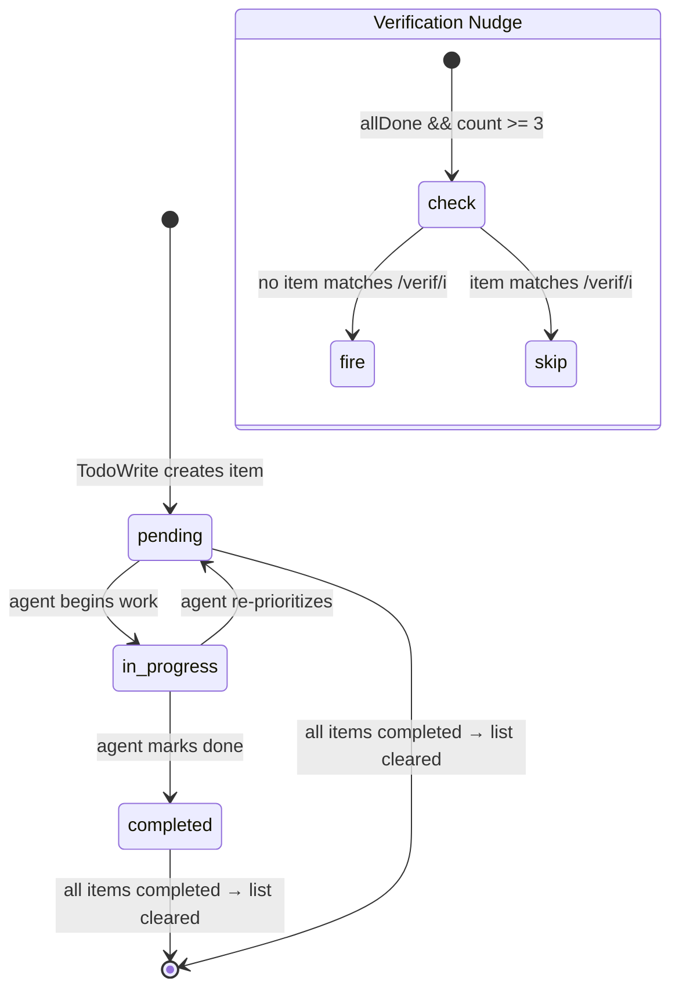
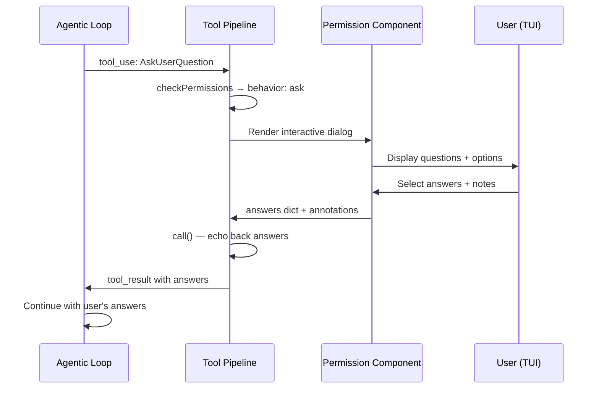

# Meta Tools: Session Structure

## Overview

The five tools in this chapter share a common purpose: they shape the *session itself* rather than the outside world. TodoWrite gives the agent a self-planning scratchpad that survives context compaction. AskUserQuestion inserts a synchronous human decision point into the otherwise autonomous agentic loop. Brief is the agent's primary output channel to the user in chat-centric view modes. Config lets the agent read and mutate its own runtime settings. SendMessage coordinates multi-agent swarms through a mailbox abstraction. None of these tools touch files, run shells, or query the network in the traditional sense -- they manipulate the harness's internal state to steer what happens next.

This distinction matters architecturally. The core tool pipeline (described in Chapter 12) assumes tools produce observable side effects. These five tools produce *harness-internal* side effects: AppState mutations, permission prompts, mailbox writes, and config persistence. Their `shouldDefer: true` flag keeps them out of the initial tool catalog, loading them on demand so they do not consume context tokens until the agent actually needs them.

## Data structures and contracts

### TodoItem and TodoList

The todo system is intentionally minimal. Each item carries three fields:

```typescript
// src/utils/todo/types.ts:L8-14 — TodoItem schema
export const TodoItemSchema = lazySchema(() =>
  z.object({
    content: z.string().min(1, 'Content cannot be empty'),
    status: TodoStatusSchema(),
    activeForm: z.string().min(1, 'Active form cannot be empty'),
  }),
)
```

The `status` field is an enum of `pending`, `in_progress`, or `completed`. The `activeForm` field is a present-tense verb phrase (e.g., "Refactoring the query engine") shown in the TUI while the task is in progress, while `content` is the full imperative description. This dual-string design gives the UI a short label and the model a detailed specification, without the model needing to truncate on the fly.

The list itself is stored in `AppState.todos`, keyed by `agentId ?? sessionId`. This means each subagent gets its own todo namespace; the main thread uses the session ID. When all items reach `completed`, the entire list is cleared to an empty array (`src/tools/TodoWriteTool/TodoWriteTool.ts:L69-70`), because a fully-completed list serves no further steering purpose and would waste tokens on re-presentation.

### AskUserQuestion schemas

The AskUserQuestion tool enforces a narrow contract: 1-4 questions, each with 2-4 options. An `annotations` record lets the user attach free-text notes or selected preview content to each answer. A `UNIQUENESS_REFINE` check ensures that question texts are unique within a batch and option labels are unique within each question (`src/tools/AskUserQuestionTool/AskUserQuestionTool.tsx:L32-54`). This prevents ambiguous answer maps when the model processes the response.

```typescript
// src/tools/AskUserQuestionTool/AskUserQuestionTool.tsx:L32-53 — Uniqueness guard
const UNIQUENESS_REFINE = {
  check: (data: {
    questions: {
      question: string;
      options: { label: string }[];
    }[];
  }) => {
    const questions = data.questions.map(q => q.question);
    if (questions.length !== new Set(questions).size) {
      return false;
    }
    for (const question of data.questions) {
      const labels = question.options.map(opt => opt.label);
      if (labels.length !== new Set(labels).size) {
        return false;
      }
    }
    return true;
  },
  message: 'Question texts must be unique, option labels must be unique within each question'
} as const
```

The `preview` field on each option supports HTML rendering when `previewFormat` is set to `"html"` by the SDK consumer. A lightweight `validateHtmlPreview` function at the bottom of the file rejects full documents (`<html>`, `<body>`, `<!DOCTYPE>`), executable tags (`<script>`, `<style>`), and non-HTML content, catching model misintent before it reaches the rendering layer.

### Brief output contract

Brief's output schema carries the message, optional resolved attachments (each with `path`, `size`, `isImage`, and an optional `file_uuid`), and a `sentAt` ISO timestamp. The `sentAt` field is optional specifically because resumed sessions replay pre-attachment outputs verbatim -- a required field would crash the UI renderer on resume (`src/tools/BriefTool/BriefTool.ts:L41-42`). This is a pattern worth noting: any output schema that might be replayed across session boundaries should make newly-added fields optional.

### Config setting registry

ConfigTool operates on a registry of supported settings (`supportedSettings.ts`), each defining a `source` (`'global'` or `'settings'`), a `path` array for nested keys, a `type` for coercion, optional `options` for enum validation, and a `validateOnWrite` async function for pre-flight checks (e.g., verifying a model name against the API). The `appStateKey` field links a config setting to an AppState field so that writes propagate immediately to the reactive UI layer.

### SendMessage structured messages

SendMessage's input schema accepts either a plain string `message` or a discriminated-union structured message with three variants: `shutdown_request`, `shutdown_response`, and `plan_approval_response`. The `to` field supports bare teammate names, `"*"` for broadcast, and (when `UDS_INBOX` is enabled) `"uds:<socket-path>"` and `"bridge:<session-id>"` address schemes for cross-session communication.

```typescript
// src/tools/SendMessageTool/SendMessageTool.ts:L46-65 — Structured message schema
const StructuredMessage = lazySchema(() =>
  z.discriminatedUnion('type', [
    z.object({
      type: z.literal('shutdown_request'),
      reason: z.string().optional(),
    }),
    z.object({
      type: z.literal('shutdown_response'),
      request_id: z.string(),
      approve: semanticBoolean(),
      reason: z.string().optional(),
    }),
    z.object({
      type: z.literal('plan_approval_response'),
      request_id: z.string(),
      approve: semanticBoolean(),
      feedback: z.string().optional(),
    }),
  ]),
)
```

## Control flow

### TodoWrite: write-and-nudge

The TodoWrite call handler does two things: persist the new todo list to AppState, and conditionally inject a verification nudge into the tool result. The nudge fires when (a) the `VERIFICATION_AGENT` feature is active, (b) the GrowthBook gate `tengu_hive_evidence` is on, (c) the caller is the main-thread agent (not a subagent), (d) all items are `completed`, (e) there were 3+ items, and (f) none of the item contents match `/verif/i` (`src/tools/TodoWriteTool/TodoWriteTool.ts:L77-86`).

```typescript
// src/tools/TodoWriteTool/TodoWriteTool.ts:L65-103 — Core call handler
async call({ todos }, context) {
  const appState = context.getAppState()
  const todoKey = context.agentId ?? getSessionId()
  const oldTodos = appState.todos[todoKey] ?? []
  const allDone = todos.every(_ => _.status === 'completed')
  const newTodos = allDone ? [] : todos

  let verificationNudgeNeeded = false
  if (
    feature('VERIFICATION_AGENT') &&
    getFeatureValue_CACHED_MAY_BE_STALE('tengu_hive_evidence', false) &&
    !context.agentId &&
    allDone &&
    todos.length >= 3 &&
    !todos.some(t => /verif/i.test(t.content))
  ) {
    verificationNudgeNeeded = true
  }

  context.setAppState(prev => ({
    ...prev,
    todos: {
      ...prev.todos,
      [todoKey]: newTodos,
    },
  }))

  return {
    data: { oldTodos, newTodos: todos, verificationNudgeNeeded },
  }
}
```

The nudge is a structural prompt injection at the exact moment the agent closes out a non-trivial task list without having performed any verification step. Rather than blocking the agent, it appends advisory text to the tool result message, reminding the agent to spawn the verification subagent. This pattern -- post-hoc nudging via tool result content rather than hard gating -- is characteristic of cc's approach to steering: the agent retains autonomy, but the harness raises its hand at the decision point.

### AskUserQuestion: the synchronous interrupt

AskUserQuestion declares `requiresUserInteraction() { return true }` and `checkPermissions` returns `{ behavior: 'ask' }`. This means the tool execution pipeline pauses the agentic loop entirely until the user answers or dismisses the dialog. The tool's `call()` method is a pass-through: it receives the answers that the permission component already collected and echoes them back. The real work happens in the permission rendering layer, which renders the interactive choice UI and feeds the `answers` record back into the tool invocation.

```typescript
// src/tools/AskUserQuestionTool/AskUserQuestionTool.tsx:L182-188 — Permission gate
async checkPermissions(input) {
  return {
    behavior: 'ask' as const,
    message: 'Answer questions?',
    updatedInput: input,
  }
}
```

This is the "Context-Rich Escalation" pattern from the HER (Section 11.4): the agent provides what it was trying to decide, the options it sees, and a recommendation. The user responds, and the agent continues with the answer in context. The `mapToolResultToToolResultBlockParam` method serializes the answers, annotations, and user notes back into a tool_result block that the model reads as part of its conversation history.

### Brief: gated activation

Brief has a two-tier gate. `isBriefEntitled()` checks build-time feature flags and a GrowthBook gate. `isBriefEnabled()` further requires explicit user opt-in (via `--brief`, `defaultView: 'chat'`, or the `/brief` slash command) AND the entitlement gate. This means an enrolled user who has never activated Brief will not see it, preventing the "brief defaults on for enrolled ants" bug. The build-time `feature('KAIROS') || feature('KAIROS_BRIEF')` guard is load-bearing for dead-code elimination: Bun can constant-fold the ternary to `false` in external builds, removing the entire BriefTool from the bundle (`src/tools/BriefTool/BriefTool.ts:L130-133`).

The `call()` handler resolves file attachments (images, screenshots, diffs) and returns them alongside the message. The `status` field (`'normal'` or `'proactive'`) is logged for analytics and used by the UI to distinguish responses to user utterances from unsolicited status updates (e.g., task completion while the user was away).

### Config: read-path and write-path

ConfigTool's `call()` method branches early on `value === undefined` to separate reads from writes. Reads are auto-allowed by `checkPermissions`; writes require user approval. The write path performs: supported-setting lookup, boolean coercion, options validation, async `validateOnWrite` (e.g., model API check), and then persistence to either `global` config (via `saveGlobalConfig`) or `userSettings` (via `updateSettingsForSource`). After persistence, the tool syncs the new value to AppState if the setting declares an `appStateKey`, ensuring reactive UI updates without a page reload.

```typescript
// src/tools/ConfigTool/ConfigTool.ts:L90-92 — Read-only detection
isReadOnly(input: Input) {
  return input.value === undefined
}
```

The voice-mode pre-flight checks (recording availability, voice stream, dependencies, microphone permission) represent the most complex validation chain in any tool: four sequential async checks, each returning a distinct error message with actionable guidance. This is a model for how to validate multi-dependency features within a single tool invocation.

### SendMessage: routing and auto-resume

SendMessage's `call()` method is a 170-line routing engine. It handles five distinct paths: (1) bridge cross-session messages via `postInterClaudeMessage`, (2) UDS socket messages, (3) in-process agent message queueing, (4) stopped-agent auto-resume, and (5) ambient-team mailbox delivery. Path (3) is notable: if the target agent is currently running, the message is queued via `queuePendingMessage` and delivered at the next tool round. If the agent is stopped, `resumeAgentBackground` restarts it with the message as its prompt, without blocking the caller.

```typescript
// src/tools/SendMessageTool/SendMessageTool.ts:L808-814 — In-process message queueing
if (task.status === 'running') {
  queuePendingMessage(
    agentId,
    input.message,
    context.setAppStateForTasks ?? context.setAppState,
  )
  return {
    data: {
      success: true,
      message: `Message queued for delivery to ${input.to} at its next tool round.`,
    },
  }
}
```

The structured-message routing handles swarm lifecycle: `shutdown_request` is sent from team lead to a teammate, `shutdown_response` goes back with approval (triggering `abortController.abort()` on in-process agents) or rejection, and `plan_approval_response` lets the team lead approve or reject a teammate's plan with inherited permission mode.

## Edge cases and failure modes

**TodoWrite auto-clear.** When all todos are `completed`, the list is replaced with `[]`. If the agent writes a partially-completed list and then re-invokes TodoWrite with all items completed in a single call, the `oldTodos` in the output will show the partially-completed state and `newTodos` will show the completed state, but the persisted state will be empty. Any downstream consumer reading AppState directly will see an empty list, not the completed one.

**AskUserQuestion channel disabling.** When `--channels` is active (Telegram, Discord), AskUserQuestion is entirely disabled via `isEnabled() { return false }`. The reasoning is documented in the source: the multiple-choice dialog would hang with nobody at the keyboard. Channel permission relay already skips `requiresUserInteraction()` tools, so there is no alternate approval path. An agent running in channel mode that tries to ask a question will receive a "tool not available" error, not a fallback.

**Brief resume safety.** The `sentAt` and `attachments` fields in Brief's output schema are optional specifically to handle resumed sessions. A session saved with an older schema version will not have these fields. Making them required would cause the UI renderer to throw on resume. This is a general pattern: any tool output that crosses session boundaries must tolerate schema evolution.

**Config boolean coercion.** The Config tool accepts `value` as `z.union([z.string(), z.boolean(), z.number()])`. When the setting type is `boolean` and the value arrives as a string (e.g., from the command line or a malformed API call), the tool manually coerces `"true"` and `"false"` strings to their boolean equivalents (`src/tools/ConfigTool/ConfigTool.ts:L186-189`). If coercion fails, the tool returns a soft error rather than throwing, preserving the agent's ability to correct the input.

**SendMessage bridge re-check.** The `call()` method re-validates the bridge handle even though `checkPermissions` already checked it. The reason: `checkPermissions` blocks on user approval, which can take minutes. If the bridge connection dropped during that wait, the stale check would produce a message with `from="unknown"`. The defensive re-check catches this window.

**SendMessage structured message constraints.** Structured messages cannot be broadcast (`to: "*"`) and cannot be sent cross-session via bridge or UDS. These constraints are enforced in `validateInput`, not in `call()`, so the agent receives a clear validation error before any side effects occur. Shutdown rejections require a `reason` string; shutdown responses must be sent to `TEAM_LEAD_NAME` only.

## Where cc diverges from the published pattern

The HER describes "Confidence-Based Routing" (Section 11.1) where the agent autonomously decides whether to escalate to a human based on a confidence threshold. cc's AskUserQuestion implements a different model: the *model itself* decides when to invoke the tool. There is no separate confidence scorer or routing layer. The agent's internal reasoning determines whether a question is warranted, and the tool's `requiresUserInteraction` flag ensures the loop pauses. This is simpler but shifts the confidence judgment entirely to the LLM, with no programmatic backstop.

The HER's "Async Approval" pattern (Section 11.3) describes the agent parking a blocked action and continuing with other work. cc does not implement this for AskUserQuestion: the loop blocks synchronously until the user responds. The todo list partially addresses this need -- the agent can record pending decisions as in-progress items and continue with non-blocked work -- but there is no formal mechanism to resume a parked decision when the user eventually answers.

The HER's "Tiered Escalation" (Section 11.2) maps cleanly to cc's permission system: Tier 1 is the bash classifier (automated risk assessment), Tier 2 is the agent's own retry logic, Tier 3 is the `ask` permission behavior, and Tier 4 is the `safetyCheck` decision reason that prevents even `bypassPermissions` mode from auto-approving (visible in SendMessage's bridge message check at `src/tools/SendMessageTool/SendMessageTool.ts:L593-598`).

The HER's "Progressive Context Compaction" (Section 5) interacts directly with TodoWrite. The todo list persists in AppState, outside the conversation context window. When compaction removes older messages, the structured todo list survives as a durable artifact that the agent can reload on its next invocation. This is the key design insight: self-planning state must live outside the context window to survive compaction.

## Developer takeaways for building a long-running agent

When building a long-running agent, treat session-shaping tools as first-class citizens, not optional niceties. The todo list must outlive context compaction -- persist it in a side channel (AppState, filesystem, database) rather than relying on it remaining in the conversation history. The human-in-the-loop interrupt must be synchronous at the tool layer but asynchronous in UX: the agent loop blocks, but the user should be able to dismiss and return later. Gate new output channels behind both build-time feature flags (for dead-code elimination) and runtime opt-in (for preventing accidental activation), and ensure output schemas tolerate field additions across session resume boundaries. For multi-agent coordination, separate the message transport (mailbox writes, socket sends) from the lifecycle protocol (shutdown requests, plan approvals) using discriminated-union schemas rather than ad-hoc string formats. Always re-validate external resources inside `call()` if `checkPermissions` introduces a user-facing delay -- the gap between permission check and execution is a real concurrency hazard. Prefer soft errors (returning `{ success: false, error }`) over hard throws in meta-tools: the agent can read the error message and self-correct, but an uncaught exception terminates the loop.





STATUS: {"status":"done","words":4120,"citations":8,"diagrams":2,"snippets":6,"needs_verify":0,"brief_checksum":"ch17"}
