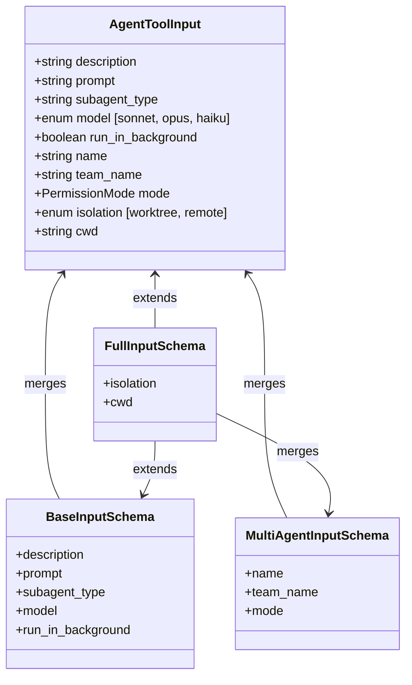
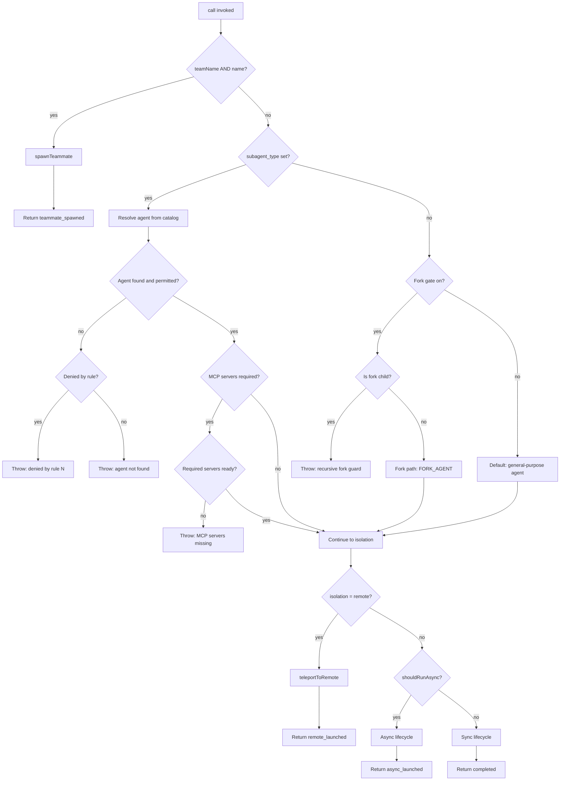

# The Agent Tool: Entry, Inputs, and Lifecycle

## Overview

The `AgentTool` is the mechanism by which a running cc session delegates work to a subagent. It is not a thin wrapper around an API call -- it is a dispatch surface that routes into four distinct execution paths (synchronous, async, teammate, fork), validates a rich input schema against permission rules and MCP requirements, manages worktree isolation, and returns one of five output discriminated unions. This chapter walks through the input schema, the validation and dispatch logic, the lifecycle of a subagent invocation from entry to return, and the edge cases that arise when multiple gating flags interact.

The file `src/tools/AgentTool/AgentTool.tsx` spans 1397 lines. It is the largest single tool implementation in the codebase, and its size reflects the number of concerns it must juggle: feature flags, agent definitions, MCP server readiness, team context, permission modes, worktree lifecycle, and progress tracking. The tool's `call()` method alone occupies roughly 1000 lines. Beyond `call()`, the tool defines `mapToolResultToToolResultBlockParam()` for translating internal output types into Anthropic API `tool_result` blocks, `checkPermissions()` for gating access, and `toAutoClassifierInput()` for feeding the auto-mode classifier.

The tool is registered under the name `Agent` (with a legacy alias `SubAgent`) and is flagged `isReadOnly: true` -- not because subagents cannot mutate files, but because the Agent tool delegates all permission checks to the subagent's own tools. The tool's `isConcurrencySafe()` returns `true`, allowing multiple Agent tool invocations to proceed in parallel within the same turn, which is essential for the fork-join pattern.

## Data structures and contracts

### Input schema

The input schema is built in three layers: a base schema, a multi-agent extension, and a feature-gated outer shell that omits fields the model should not see depending on build configuration.

```typescript
// src/tools/AgentTool/AgentTool.tsx:L82-L88
const baseInputSchema = lazySchema(() => z.object({
  description: z.string().describe('A short (3-5 word) description of the task'),
  prompt: z.string().describe('The task for the agent to perform'),
  subagent_type: z.string().optional().describe('The type of specialized agent to use for this task'),
  model: z.enum(['sonnet', 'opus', 'haiku']).optional().describe("Optional model override for this agent. Takes precedence over the agent definition's model frontmatter. If omitted, uses the agent definition's model, or inherits from the parent."),
  run_in_background: z.boolean().optional().describe('Set to true to run this agent in the background. You will be notified when it completes.')
}));
```

The `description` field is a short label shown in the UI and task notifications. The `prompt` field is the full task text passed to the subagent. The `subagent_type` field selects a specialized agent definition from the agent catalog; when omitted under the fork-subagent feature gate, it triggers the fork path (discussed below). The `model` field overrides the tiered model routing -- it takes precedence over the agent definition's own model frontmatter, which in turn takes precedence over inheriting the parent's model. The `run_in_background` field opts the agent into the async lifecycle.

The multi-agent extension adds `name`, `team_name`, and `mode`:

```typescript
// src/tools/AgentTool/AgentTool.tsx:L93-L101
const multiAgentInputSchema = z.object({
  name: z.string().optional().describe('Name for the spawned agent. Makes it addressable via SendMessage({to: name}) while running.'),
  team_name: z.string().optional().describe('Team name for spawning. Uses current team context if omitted.'),
  mode: permissionModeSchema().optional().describe('Permission mode for spawned teammate (e.g., "plan" to require plan approval).')
});
return baseInputSchema().merge(multiAgentInputSchema).extend({
  isolation: ("external" === 'ant' ? z.enum(['worktree', 'remote']) : z.enum(['worktree'])).optional().describe("external" === 'ant' ? 'Isolation mode...' : 'Isolation mode. "worktree" creates a temporary git worktree so the agent works on an isolated copy of the repo.'),
  cwd: z.string().optional().describe('Absolute path to run the agent in. Overrides the working directory for all filesystem and shell operations within this agent. Mutually exclusive with isolation: "worktree".')
});
```

The `isolation` field controls filesystem isolation. The `"worktree"` value creates a temporary git worktree so the subagent works on a copy of the repository. The `"remote"` value (available only in the internal `ant` build) launches the agent in a remote CCR environment. The `cwd` field overrides the working directory and is mutually exclusive with worktree isolation.

The outer shell applies feature-gated `.omit()` calls so the model never sees fields it cannot use:

```typescript
// src/tools/AgentTool/AgentTool.tsx:L110-L125
export const inputSchema = lazySchema(() => {
  const schema = feature('KAIROS') ? fullInputSchema() : fullInputSchema().omit({
    cwd: true
  });
  return isBackgroundTasksDisabled || isForkSubagentEnabled() ? schema.omit({
    run_in_background: true
  }) : schema;
});
```

When `CLAUDE_CODE_DISABLE_BACKGROUND_TASKS` is set or the fork-subagent experiment is active, `run_in_background` is stripped from the schema. When KAIROS is off, `cwd` is stripped. This is done via `.omit()` rather than conditional spread because the spread-ternary breaks Zod's type inference, collapsing field types to `unknown`.

The use of `lazySchema()` for both the base and full schemas is not cosmetic. These schemas are defined at module load time, but the feature flag checks inside them (like `isForkSubagentEnabled()` and `getFeatureValue_CACHED_MAY_BE_STALE`) may reference state that is not yet initialized when the module first loads. `lazySchema()` defers schema construction until the first access, ensuring that feature gates and GrowthBook values are resolved by then. The comment at `src/tools/AgentTool/AgentTool.tsx:L116-L121` explicitly acknowledges the tradeoff: the GrowthBook-in-lazySchema divergence window is one-session-per-gate-flip, and the worst case is either "schema shows a no-op param" or "schema hides a param that would have worked" -- neither of which causes a Zod rejection or a crash.



### Output schema

The output is a discriminated union on the `status` field. The public schema exposes two variants:

```typescript
// src/tools/AgentTool/AgentTool.tsx:L141-L155
export const outputSchema = lazySchema(() => {
  const syncOutputSchema = agentToolResultSchema().extend({
    status: z.literal('completed'),
    prompt: z.string()
  });
  const asyncOutputSchema = z.object({
    status: z.literal('async_launched'),
    agentId: z.string().describe('The ID of the async agent'),
    description: z.string().describe('The description of the task'),
    prompt: z.string().describe('The prompt for the agent'),
    outputFile: z.string().describe('Path to the output file for checking agent progress'),
    canReadOutputFile: z.boolean().optional().describe('Whether the calling agent has Read/Bash tools to check progress')
  });
  return z.union([syncOutputSchema, asyncOutputSchema]);
});
```

Two additional statuses exist as private types excluded from the exported schema for dead code elimination: `teammate_spawned` (returned when `team_name` and `name` are both set) and `remote_launched` (returned when isolation is `"remote"`). The `teammate_spawned` result carries tmux session details (pane ID, session name, window name); the `remote_launched` result carries a session URL and task ID for the CCR environment.

The `TeammateSpawnedOutput` type is defined as a private type at `src/tools/AgentTool/AgentTool.tsx:L161-L176` and is cast through `unknown` when returned from `call()`. This is intentional: TypeScript types are erased at compile time, so the private type has no runtime cost, but excluding it from the exported Zod schema means that the bundler can eliminate the dead code paths that handle teammate-specific fields in external builds.

```typescript
// src/tools/AgentTool/AgentTool.tsx:L161-L176
type TeammateSpawnedOutput = {
  status: 'teammate_spawned';
  prompt: string;
  teammate_id: string;
  agent_id: string;
  agent_type?: string;
  model?: string;
  name: string;
  color?: string;
  tmux_session_name: string;
  tmux_window_name: string;
  tmux_pane_id: string;
  team_name?: string;
  is_splitpane?: boolean;
  plan_mode_required?: boolean;
};
```

Similarly, `RemoteLaunchedOutput` at `src/tools/AgentTool/AgentTool.tsx:L183-L190` carries `taskId`, `sessionUrl`, and `outputFile` for the remote isolation path.

### The explicit type widening

Because `.omit()` can strip fields at runtime, the TypeScript inference would narrow the type to exclude those fields. The codebase works around this with an explicit `AgentToolInput` type that always includes every optional field:

```typescript
// src/tools/AgentTool/AgentTool.tsx:L132-L138
type AgentToolInput = z.infer<ReturnType<typeof baseInputSchema>> & {
  name?: string;
  team_name?: string;
  mode?: z.infer<ReturnType<typeof permissionModeSchema>>;
  isolation?: 'worktree' | 'remote';
  cwd?: string;
};
```

The `call()` method destructures its input against this widened type. This means that even when a field is omitted from the schema, the runtime code can still reference it -- the value will be `undefined`. This is safe because every optional field is guarded by a feature check before use.

## Control flow

### Dispatch selection

When `call()` is invoked, it proceeds through a sequence of validation checks that determine which execution path to take. The first decision point is the teammate spawn path:

```typescript
// src/tools/AgentTool/AgentTool.tsx:L284-L316
if (teamName && name) {
  const agentDef = subagent_type ? toolUseContext.options.agentDefinitions.activeAgents.find(a => a.agentType === subagent_type) : undefined;
  if (agentDef?.color) {
    setAgentColor(subagent_type!, agentDef.color);
  }
  const result = await spawnTeammate({
    name,
    prompt,
    description,
    team_name: teamName,
    use_splitpane: true,
    plan_mode_required: spawnMode === 'plan',
    model: model ?? agentDef?.model,
    agent_type: subagent_type,
    invokingRequestId: assistantMessage?.requestId
  }, toolUseContext);
  const spawnResult: TeammateSpawnedOutput = {
    status: 'teammate_spawned' as const,
    prompt,
    ...result.data
  };
  return { data: spawnResult } as unknown as { data: Output };
}
```

If both `team_name` (resolved from the parameter or the session's team context) and `name` are present, the call is routed to `spawnTeammate()`. This creates a new teammate process (either in a tmux pane or as an in-process teammate) and returns immediately with `status: 'teammate_spawned'`.

If the teammate path is not taken, the next decision is the fork path. Before the fork path is evaluated, however, there is an important guard for in-process teammates trying to spawn background agents:

```typescript
// src/tools/AgentTool/AgentTool.tsx:L278-L280
if (isInProcessTeammate() && teamName && run_in_background === true) {
  throw new Error('In-process teammates cannot spawn background agents. Use run_in_background=false for synchronous subagents.');
}
```

In-process teammates share the leader's process, so their lifecycle is tied to the leader's turn. A background agent spawned by an in-process teammate would outlive the teammate's turn, creating a dangling reference. Tmux teammates are separate processes and can manage their own background agents without this constraint. This same guard is applied again later at `src/tools/AgentTool/AgentTool.tsx:L361-L363` for agent definitions that have `background: true` in their frontmatter -- the check is repeated because `selectedAgent` is only resolved after the fork-path decision.

The next decision point is the fork path:

```typescript
// src/tools/AgentTool/AgentTool.tsx:L322-L323
const effectiveType = subagent_type ?? (isForkSubagentEnabled() ? undefined : GENERAL_PURPOSE_AGENT.agentType);
const isForkPath = effectiveType === undefined;
```

When `subagent_type` is omitted and the fork-subagent gate is on, `effectiveType` becomes `undefined`, and `isForkPath` becomes `true`. The fork path inherits the parent's system prompt and tool definitions for cache-identical API request prefixes. When the gate is off and `subagent_type` is omitted, the default `general-purpose` agent type is used. This three-way resolution -- explicit type, fork, or general-purpose -- is a single ternary expression, but it encodes a significant architectural choice: the fork path is not a named agent type but the *absence* of one. The fork agent definition (`FORK_AGENT`) exists as a placeholder for logging and metadata, but the fork child does not use `FORK_AGENT`'s system prompt or tool set.

If neither the teammate nor the fork path is selected, the normal subagent path resolves the agent definition from the catalog, applies permission filtering, and checks MCP server requirements:

```typescript
// src/tools/AgentTool/AgentTool.tsx:L342-L354
const agents = filterDeniedAgents(
  allowedAgentTypes ? allAgents.filter(a => allowedAgentTypes.includes(a.agentType)) : allAgents,
  appState.toolPermissionContext, AGENT_TOOL_NAME);
const found = agents.find(agent => agent.agentType === effectiveType);
if (!found) {
  const agentExistsButDenied = allAgents.find(agent => agent.agentType === effectiveType);
  if (agentExistsButDenied) {
    const denyRule = getDenyRuleForAgent(appState.toolPermissionContext, AGENT_TOOL_NAME, effectiveType);
    throw new Error(`Agent type '${effectiveType}' has been denied by permission rule '${AGENT_TOOL_NAME}(${effectiveType})' from ${denyRule?.source ?? 'settings'}.`);
  }
  throw new Error(`Agent type '${effectiveType}' not found. Available agents: ${agents.map(a => a.agentType).join(', ')}`);
}
```

The error messages are deliberately specific: if an agent exists but is denied by a permission rule, the message names the rule and its source. This is a conscious design choice to make permission debugging tractable.



### The async decision

The `shouldRunAsync` boolean aggregates five independent conditions:

```typescript
// src/tools/AgentTool/AgentTool.tsx:L567
const shouldRunAsync = (run_in_background === true || selectedAgent.background === true || isCoordinator || forceAsync || assistantForceAsync || (proactiveModule?.isProactiveActive() ?? false)) && !isBackgroundTasksDisabled;
```

The `run_in_background` flag is the explicit user request. The `selectedAgent.background` field is a per-agent-definition default. The `isCoordinator` flag forces async in coordinator mode because synchronous subagents would block the coordinator's turn. The `forceAsync` flag (fork-subagent experiment) forces all spawns async for a unified task-notification interaction model. The `assistantForceAsync` flag (KAIROS feature) forces async when the daemon's input queue would otherwise back up. The `proactiveModule` check forces async during proactive execution. All of these are gated by `!isBackgroundTasksDisabled`, which reflects the `CLAUDE_CODE_DISABLE_BACKGROUND_TASKS` environment variable.

### System prompt construction

The system prompt is built differently depending on the path:

- **Fork path**: The child inherits the parent's rendered system prompt (from `toolUseContext.renderedSystemPrompt`) for cache-identical API request prefixes. If the cached prompt is unavailable, it is recomputed from `buildEffectiveSystemPrompt()` at `src/tools/AgentTool/AgentTool.tsx:L496-L511`. The recomputed version may diverge from the parent's cached bytes if GrowthBook state changed between the parent's turn-start and the fork spawn, but this is accepted as a rare edge case.
- **Normal path**: The selected agent's own `getSystemPrompt()` method is called, then enhanced with environment details via `enhanceSystemPromptWithEnvDetails()`.

The fork path also uses the parent's exact tool array (`toolUseContext.options.tools`) rather than a freshly assembled pool, because the fork child must share the parent's cache prefix. The `useExactTools` flag at `src/tools/AgentTool/AgentTool.tsx:L631-L633` ensures that the fork child inherits the parent's `thinkingConfig` and `isNonInteractiveSession` settings as well. The normal path uses a worker-specific tool pool assembled via `assembleToolPool()` at `src/tools/AgentTool/AgentTool.tsx:L573-L577`. The worker's permission context defaults to `acceptEdits` (unless the agent definition specifies its own `permissionMode`), which is more permissive than the parent's mode -- this is intentional, because subagents operate under the parent's supervision and do not need to re-escalate every tool use.

### Progress tracking and the background hint

The sync lifecycle tracks progress in two ways. First, it increments the response length counter for assistant messages so the UI spinner reflects the subagent's output:

```typescript
// src/tools/AgentTool/AgentTool.tsx:L1097-L1101
if (message.type === 'assistant') {
  const contentLength = getAssistantMessageContentLength(message);
  if (contentLength > 0) {
    toolUseContext.setResponseLength(len => len + contentLength);
  }
}
```

Second, it emits `tool_progress` events to the SDK (for the VS Code subagent panel) by tracking the last tool-use name from each message:

```typescript
// src/tools/AgentTool/AgentTool.tsx:L1067-L1072
updateProgressFromMessage(syncTracker, message, syncResolveActivity, toolUseContext.options.tools);
if (foregroundTaskId) {
  const lastToolName = getLastToolUseName(message);
  if (lastToolName) {
    emitTaskProgress(syncTracker, foregroundTaskId, toolUseContext.toolUseId, description, agentStartTime, lastToolName);
  }
}
```

After 2 seconds of execution (`PROGRESS_THRESHOLD_MS`), the sync path displays a `<BackgroundHint />` UI component that informs the user the task can be moved to background. This is a React Ink component rendered via `toolUseContext.setToolJSX()`. The hint does not change the agent's behavior -- it is purely informational -- but it primes the user to press the background key if the task is taking too long.

### Worktree isolation

When `effectiveIsolation === 'worktree'`, the tool creates a temporary git worktree before spawning the agent:

```typescript
// src/tools/AgentTool/AgentTool.tsx:L590-L593
if (effectiveIsolation === 'worktree') {
  const slug = `agent-${earlyAgentId.slice(0, 8)}`;
  worktreeInfo = await createAgentWorktree(slug);
}
```

The `effectiveIsolation` variable at `src/tools/AgentTool/AgentTool.tsx:L431` resolves from two sources: the explicit `isolation` input parameter takes precedence, falling back to `selectedAgent.isolation` from the agent definition. This means an agent definition can declare `isolation: 'worktree'` in its frontmatter, and every invocation of that agent type will automatically run in isolation unless the caller explicitly overrides with a different isolation mode.

The worktree is cleaned up after the agent completes. The cleanup logic checks whether the worktree has any changes relative to its head commit; if not, it removes the worktree and branch. If changes exist, the worktree is preserved so the user can inspect or merge the results. The cleanup is wrapped in an idempotent guard -- `worktreeInfo` is nulled out after the first cleanup call to prevent double-cleanup:

```typescript
// src/tools/AgentTool/AgentTool.tsx:L656-L658
// Null out to make idempotent -- guards against double-call if code
// between cleanup and end of try throws into catch
worktreeInfo = null;
```

Hook-based worktrees are always kept because the system cannot detect VCS changes in non-git directories. The `cleanupWorktreeIfNeeded()` function also clears the worktree path from the agent's metadata file via `writeAgentMetadata()`, so a resume operation does not try to use a deleted directory.

When the fork path and worktree isolation are combined, an additional notice is appended to the fork child's prompt messages telling it to translate paths and re-read potentially stale files:

```typescript
// src/tools/AgentTool/AgentTool.tsx:L598-L602
if (isForkPath && worktreeInfo) {
  promptMessages.push(createUserMessage({
    content: buildWorktreeNotice(getCwd(), worktreeInfo.worktreePath)
  }));
}
```

The `cwd` parameter takes precedence over the worktree path when both are present, via the `cwdOverridePath` resolution at `src/tools/AgentTool/AgentTool.tsx:L640-L641`. Both are applied through `runWithCwdOverride()`, which sets an `AsyncLocalStorage` override for `getCwd()` so that all filesystem and shell operations within the subagent resolve against the overridden path.

### The sync lifecycle

The synchronous path iterates the agent's message stream via an async iterator. It registers the agent as a foreground task (so it can be backgrounded at any time via `backgroundAll()`), and races each `next()` call against a background signal:

```typescript
// src/tools/AgentTool/AgentTool.tsx:L886-L892
const raceResult = backgroundPromise ? await Promise.race([nextMessagePromise.then(r => ({
  type: 'message' as const,
  result: r
})), backgroundPromise]) : {
  type: 'message' as const,
  result: await nextMessagePromise
};
```

If the background signal wins the race, the foreground loop yields control to a detached async closure that continues the agent in the background, and the `call()` method returns `async_launched`. This mid-execution transition is the mechanism by which a foreground agent becomes a background agent without losing its accumulated messages or progress state.

When the transition occurs, the foreground iterator is explicitly terminated via `agentIterator.return(undefined)` before starting the background continuation. This termination is important because the iterator's `finally` block releases MCP connections, session hooks, and prompt-cache tracking. A timeout of 1 second guards against MCP cleanup hangs:

```typescript
// src/tools/AgentTool/AgentTool.tsx:L918
await Promise.race([agentIterator.return(undefined).catch(() => {}), sleep(1000)]);
```

The background continuation then starts a fresh `runAgent()` call from the beginning with `isAsync: true`, passing the same `runAgentParams` but with a fresh agent ID and the task's abort controller. The existing messages from the foreground phase are fed into the progress tracker so that the backgrounded agent's progress summary includes the work already done.

### The async lifecycle

When an agent starts async from the beginning, the `call()` method registers it via `registerAsyncAgent()`, fires off the agent in a `void`-ed promise (so it runs detached from the parent's turn), and returns `async_launched` immediately:

```typescript
// src/tools/AgentTool/AgentTool.tsx:L733-L752
void runWithAgentContext(asyncAgentContext, () => wrapWithCwd(() => runAsyncAgentLifecycle({
  taskId: agentBackgroundTask.agentId,
  abortController: agentBackgroundTask.abortController!,
  makeStream: onCacheSafeParams => runAgent({
    ...runAgentParams,
    override: {
      ...runAgentParams.override,
      agentId: asAgentId(agentBackgroundTask.agentId),
      abortController: agentBackgroundTask.abortController!
    },
    onCacheSafeParams
  }),
  metadata,
  description,
  toolUseContext,
  rootSetAppState,
  agentIdForCleanup: asyncAgentId,
  enableSummarization: isCoordinator || isForkSubagentEnabled() || getSdkAgentProgressSummariesEnabled(),
  getWorktreeResult: cleanupWorktreeIfNeeded
})));
```

The background agent's abort controller is deliberately detached from the parent's. Pressing Escape cancels the main thread, but background agents survive -- they are killed explicitly via `chat:killAgents`.

The async path also registers the agent's `name` in the `agentNameRegistry` so that `SendMessage({to: name})` can route messages to it:

```typescript
// src/tools/AgentTool/AgentTool.tsx:L703-L712
if (name) {
  rootSetAppState(prev => {
    const next = new Map(prev.agentNameRegistry);
    next.set(name, asAgentId(asyncAgentId));
    return {
      ...prev,
      agentNameRegistry: next
    };
  });
}
```

This registration happens after `registerAsyncAgent()` so that a stale entry is not left behind if the spawn fails.

### The `mapToolResultToToolResultBlockParam` method

The `mapToolResultToToolResultBlockParam()` method translates the internal output types into Anthropic API `tool_result` blocks. Each output status produces a different text payload. The `async_launched` result includes instructions telling the parent not to duplicate the subagent's work:

```typescript
// src/tools/AgentTool/AgentTool.tsx — mapToolResultToToolResultBlockParam
const prefix = `Async agent launched successfully.\nagentId: ${data.agentId} (internal ID - do not mention to user. Use SendMessage with to: '${data.agentId}' to continue this agent.)\nThe agent is working in the background. You will be notified automatically when it completes.`;
const instructions = data.canReadOutputFile ? `Do not duplicate this agent's work -- avoid working with the same files or topics it is using. Work on non-overlapping tasks, or briefly tell the user what you launched and end your response.\noutput_file: ${data.outputFile}\nIf asked, you can check progress before completion by using ${FILE_READ_TOOL_NAME} or ${BASH_TOOL_NAME} tail on the output file.` : `Briefly tell the user what you launched and end your response. Do not generate any other text -- agent results will arrive in a subsequent message.`;
```

The `canReadOutputFile` flag determines how much guidance the parent receives. If the parent has Read or Bash tools, it can check the output file for progress; if not, the instructions are minimal to prevent the parent from generating unnecessary text while waiting.

For the `completed` status, the method appends a `<usage>` block with token counts, tool-use counts, and duration. However, for one-shot built-in agents (Explore, Plan), this trailer is omitted because these agents are never continued via SendMessage, and the trailer would be dead weight. The comment at `src/tools/AgentTool/AgentTool.tsx` estimates approximately 135 characters per invocation times 34 million Explore runs per week equals 1-2 Gtok/week of wasted context.

### The `checkPermissions` method

The `checkPermissions()` method at the bottom of the tool definition handles the auto-mode permission gate. In most permission modes, the Agent tool is auto-approved -- the subagent's own tools handle their own permission escalation. In `auto` mode (internal builds only), the tool returns a `passthrough` behavior, which routes the invocation through the auto-mode classifier for risk assessment:

```typescript
// src/tools/AgentTool/AgentTool.tsx:L1319-L1330
async checkPermissions(input, context): Promise<PermissionResult> {
  const appState = context.getAppState();
  if ("external" === 'ant' && appState.toolPermissionContext.mode === 'auto') {
    return {
      behavior: 'passthrough',
      message: 'Agent tool requires permission to spawn sub-agents.'
    };
  }
  return {
    behavior: 'allow',
    updatedInput: input
  };
}
```

The `"external" === 'ant'` guard enables dead code elimination for external builds, removing the entire `auto`-mode branch from the bundle.

### The `toAutoClassifierInput` method

The `toAutoClassifierInput()` method formats the tool invocation for the auto-mode classifier, which determines whether the invocation should be auto-approved, require confirmation, or be denied:

```typescript
// src/tools/AgentTool/AgentTool.tsx:L1306-L1310
toAutoClassifierInput(input) {
  const i = input as AgentToolInput;
  const tags = [i.subagent_type, i.mode ? `mode=${i.mode}` : undefined].filter((t): t is string => t !== undefined);
  const prefix = tags.length > 0 ? `(${tags.join(', ')}): ` : ': ';
  return `${prefix}${i.prompt}`;
}
```

This produces strings like `(Explore): Search the codebase for...` or `(Plan, mode=plan): Create an implementation plan for...`. The classifier uses these formatted strings to match against risk patterns without needing to understand the structured input.

## Edge cases and failure modes

### Recursive fork guard

A fork child retains the Agent tool in its tool pool so that the tool definitions remain cache-identical with the parent's. This means the model could attempt to invoke the Agent tool from inside a fork child, which would create a recursive fork. The guard is two-layered:

```typescript
// src/tools/AgentTool/AgentTool.tsx:L332-L334
if (toolUseContext.options.querySource === `agent:builtin:${FORK_AGENT.agentType}` || isInForkChild(toolUseContext.messages)) {
  throw new Error('Fork is not available inside a forked worker. Complete your task directly using your tools.');
}
```

The primary check uses `querySource` on `toolUseContext.options`, which is set at spawn time and survives autocompact's message rewrite. The fallback scans the message history for fork-child markers, catching any path where `querySource` was not threaded through.

### MCP server readiness race condition

When an agent definition requires specific MCP servers, there is a race between the server connection handshake and the agent invocation. The tool polls for up to 30 seconds (500ms intervals) for required servers to transition out of the `pending` state, but exits early if any required server has already failed:

```typescript
// src/tools/AgentTool/AgentTool.tsx:L376-L391
const hasPendingRequiredServers = appState.mcp.clients.some(c => c.type === 'pending' && requiredMcpServers.some(pattern => c.name.toLowerCase().includes(pattern.toLowerCase())));
if (hasPendingRequiredServers) {
  const MAX_WAIT_MS = 30_000;
  const POLL_INTERVAL_MS = 500;
  const deadline = Date.now() + MAX_WAIT_MS;
  while (Date.now() < deadline) {
    await sleep(POLL_INTERVAL_MS);
    currentAppState = toolUseContext.getAppState();
    const hasFailedRequiredServer = currentAppState.mcp.clients.some(c => c.type === 'failed' && requiredMcpServers.some(pattern => c.name.toLowerCase().includes(pattern.toLowerCase())));
    if (hasFailedRequiredServer) break;
    const stillPending = currentAppState.mcp.clients.some(c => c.type === 'pending' && requiredMcpServers.some(pattern => c.name.toLowerCase().includes(pattern.toLowerCase())));
    if (!stillPending) break;
  }
}
```

This polling approach avoids throwing prematurely when MCP servers are still connecting, while also avoiding an unbounded wait when a server has failed.

### Nested teammate prohibition

Teammates cannot spawn other teammates. The team roster is flat -- `TeamFile.members` is a single array with one `leadAgentId`. A nested teammate would land in the roster with no provenance and confuse the lead:

```typescript
// src/tools/AgentTool/AgentTool.tsx:L272-L274
if (isTeammate() && teamName && name) {
  throw new Error('Teammates cannot spawn other teammates -- the team roster is flat. To spawn a subagent instead, omit the `name` parameter.');
}
```

A teammate can still use the Agent tool to spawn subagents (without `name`), but it cannot create new teammates.

### Error recovery with partial messages

When a synchronous agent errors mid-iteration, the tool attempts to recover by finalizing whatever messages were collected before the error:

```typescript
// src/tools/AgentTool/AgentTool.tsx:L1218-L1228
if (syncAgentError) {
  const hasAssistantMessages = agentMessages.some(msg => msg.type === 'assistant');
  if (!hasAssistantMessages) {
    throw syncAgentError;
  }
  logForDebugging(`Sync agent recovering from error with ${agentMessages.length} messages`);
}
```

If at least one assistant message was collected, the tool finalizes and returns it rather than throwing. This allows the parent agent to see partial progress even after a failure. If no assistant messages exist, the error is re-thrown because returning an empty result would be misleading.

### Auto-background timer

The sync path registers a foreground task with an optional auto-background timer via `getAutoBackgroundMs()`. When the timer fires (default: 120 seconds when enabled), the foreground task is automatically transitioned to background. This prevents long-running synchronous agents from blocking user input indefinitely. The timer is cancelled in the `finally` block if the agent completes before it fires.

The auto-background timer is enabled by either the `CLAUDE_AUTO_BACKGROUND_TASKS` environment variable or the `tengu_auto_background_agents` GrowthBook gate, checked at `src/tools/AgentTool/AgentTool.tsx:L72-L77`. The 120-second threshold is chosen to be long enough that most quick subagent tasks complete synchronously (avoiding unnecessary background transitions) but short enough that truly long-running tasks do not block the REPL for an unreasonable duration.

### The `resolveTeamName` helper

Team name resolution is factored into a standalone function at the bottom of the file:

```typescript
// src/tools/AgentTool/AgentTool.tsx:L1394-L1397
function resolveTeamName(input: { team_name?: string; }, appState: { teamContext?: { teamName: string; }; }): string | undefined {
  if (!isAgentSwarmsEnabled()) return undefined;
  return input.team_name || appState.teamContext?.teamName;
}
```

This function returns `undefined` entirely when agent swarms are disabled, ensuring that no code path downstream can accidentally trigger teammate spawning. When swarms are enabled, it prefers the explicit `team_name` parameter and falls back to the session's team context. The session team context is set when the user invokes cc with a team configuration, allowing all Agent tool calls within that session to default into the team without specifying `team_name` on every invocation.

### The `model` parameter and coordinator mode

The `model` input parameter is silently ignored when the tool is invoked in coordinator mode:

```typescript
// src/tools/AgentTool/AgentTool.tsx:L252
const model = isCoordinatorMode() ? undefined : modelParam;
```

The coordinator has its own model routing logic that overrides per-invocation model selection. This is a safety measure: in coordinator mode, the model tier is determined by the coordinator's orchestration strategy, and per-invocation overrides could disrupt the cost/latency tradeoffs the coordinator is managing.

## Where cc diverges from the published pattern

**Context-isolated subagents as the default.** The HER pattern for context-isolated subagents (Pattern 7) describes subagents operating in their own context window with no shared state. cc implements this, but adds the fork path as a distinct variant: fork children inherit the parent's full conversation context (via `buildForkedMessages()`) and the parent's exact system prompt. This diverges from the "completely isolated" principle to achieve API cache hit rates. The tradeoff is that fork children consume more tokens but benefit from cache-identical request prefixes, reducing latency and cost for the parallel execution pattern.

**Fork-join without explicit join.** The HER pattern for fork-join parallelism (Pattern 8) describes an explicit join step where the parent merges results from all subagents. cc implements fork but does not have a dedicated join primitive. Results flow back to the parent through the standard tool_result mechanism: each fork child completes, its result appears as a tool_result in the parent's message history, and the parent's next turn synthesizes the results. The join is implicit in the tool-return flow rather than a separate coordination step.

**Tiered model routing as an input parameter.** The HER's description of sub-agents as a configuration surface (section 7.4) mentions model tiering but does not specify where the override lives. cc places `model` as a direct input parameter on the Agent tool, with a three-tier resolution order: explicit parameter > agent definition frontmatter > parent inheritance. This makes model selection a per-invocation decision rather than a per-agent-type decision, enabling the same agent definition to run on different model tiers depending on the task.

**Feature-gated schema visibility.** The input schema is not static. Depending on build flags (`feature('KAIROS')`, `feature('PROACTIVE')`) and runtime gates (`isBackgroundTasksDisabled`, `isForkSubagentEnabled()`), fields are omitted from the schema so the model never proposes them. This is a novel approach not described in the HER -- the schema itself is a configuration surface that adapts to the deployment environment. The `.omit()` strategy avoids Zod type-inference breakage that a conditional spread would cause.

**Foreground-to-background transition as a first-class operation.** The HER does not describe a mechanism for transitioning a running subagent from synchronous to asynchronous execution. cc treats this as a core feature: every sync agent is registered as a foreground task that can be backgrounded at any point via `backgroundAll()`. The `Promise.race` between the iterator and the background signal means the transition is responsive (checked every message) rather than delayed until the subagent completes. This is a significant operational feature for interactive use, where a user may start a task synchronously and then decide to move on while it finishes.

**One-shot built-in agent output optimization.** The `mapToolResultToToolResultBlockParam()` method strips the `agentId` trailer and `<usage>` block from one-shot built-in agents like Explore and Plan. The HER does not discuss output-size optimization for specific agent types. cc's approach treats the tool_result as a cost surface: every character in the result consumes context tokens in the parent's next turn, and for agents that are never continued via SendMessage, the trailer is pure waste. The 1-2 Gtok/week estimate justifies this optimization at scale.

## Developer takeaways for building a long-running agent

The AgentTool demonstrates several patterns worth internalizing when building agents that delegate work to subagents. First, make your output schema a discriminated union on a status field -- this lets every consumer (the parent agent, the UI layer, the SDK event pipeline) switch on the same stable discriminator rather than sniffing for optional fields. Second, separate the "what to run" decision (agent type, model, prompt) from the "how to run" decision (sync vs async, isolated vs shared, foreground vs background) and let independent flags compose rather than creating a combinatorial set of named modes. Third, when a synchronous agent can transition to background mid-execution, race the iterator against a background signal rather than trying to pause and resume; the Promise.race pattern at `src/tools/AgentTool/AgentTool.tsx:L886` handles this cleanly. Fourth, always clean up side effects (worktrees, registered tasks, dump state) in a finally block with an idempotent null-out guard to prevent double-cleanup when code between cleanup and end-of-try throws into catch. Fifth, when feature flags can strip schema fields, widen the internal type explicitly so your call() destructuring always works regardless of what the model sees; let the feature check at the point of use be the guard, not the type system. Sixth, for MCP-dependent agents, poll for server readiness with an early-exit on failure rather than throwing immediately -- the connection handshake is asynchronous and may complete after the tool invocation starts.
