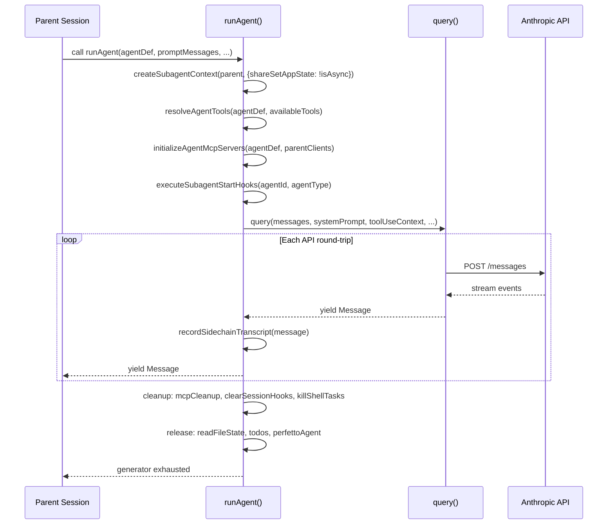
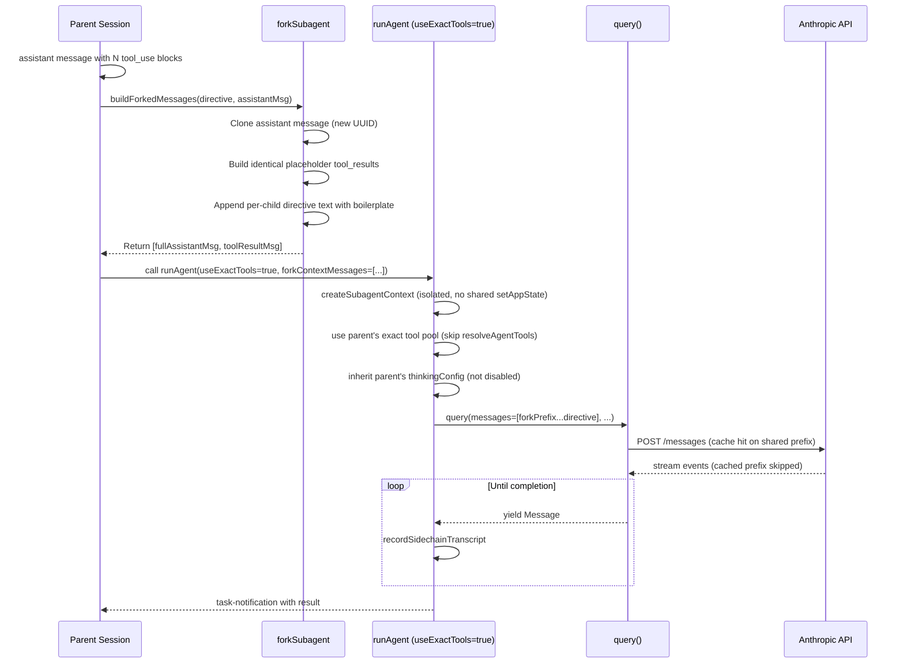
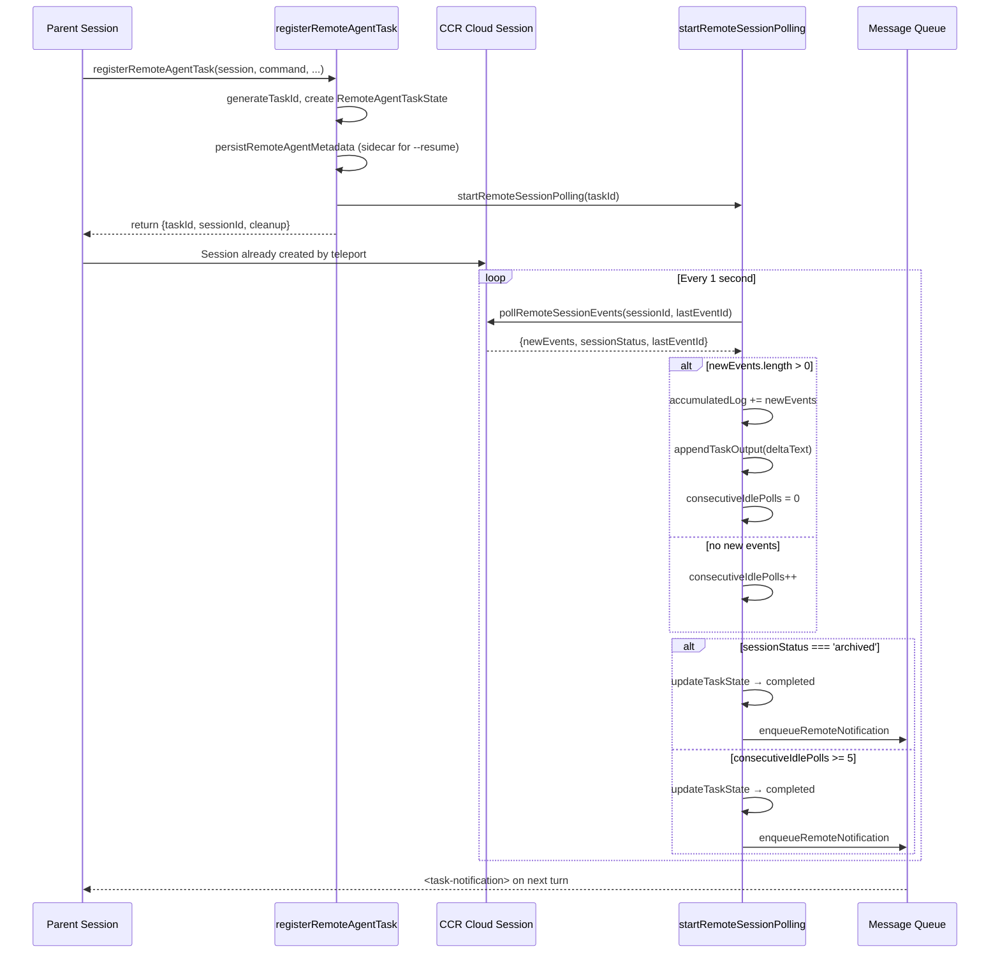

# Sync vs Fork vs Remote: The Execution Modes

## Overview

Claude Code dispatches subagents through three distinct execution modes, each with its own isolation boundary, communication channel, and state-sharing contract. The choice of mode is not cosmetic: it determines whether the child runs in the parent's call stack, in a separate context within the same process, or on a remote cloud machine. Get the mode wrong and you either starve the parent of responsiveness (running a long search synchronously) or burn cache-coherent prefixes by forking with the wrong tool pool.

The three modes form a spectrum:

- **Sync (in-process)**: The child runs inside `runAgent`, shares the parent's `AbortController`, and yields messages back through an `AsyncGenerator`. Same process, same event loop, same heap. Communication is zero-copy message streaming. The parent blocks on each yielded message and sees the child's output as it arrives.
- **Fork (in-process, cache-shared)**: The child inherits the parent's full conversation prefix — messages, system prompt, tools — and runs in a separate `ToolUseContext` designed for prompt cache hits. Same process, but byte-identical API request prefixes enable the Anthropic prompt cache to short-circuit large portions of the input. Communication flows through `<task-notification>` messages enqueued after the fork completes.
- **Remote (out-of-process, cloud)**: The child is a full Claude Code session running on a CCR (Claude Code Remote) instance. Communication happens over HTTP polling. The local process tracks a `RemoteAgentTaskState` and receives structured `<task-notification>` messages when the remote session completes. No LLM calls execute locally.

These three tiers correspond directly to the HER's three tiers of multi-agent orchestration (HER section 9.1): in-process subagents, local orchestrators, and cloud-async agents. The code makes this correspondence concrete, not theoretical — each tier has its own state type, its own task registration function, and its own lifecycle cleanup. The three tiers differ along four axes: where the LLM call executes, what state the child shares with the parent, how results are communicated back, and how cancellation propagates.

| Axis | Sync | Fork | Remote |
|------|------|------|--------|
| LLM call location | In-process | In-process | CCR cloud |
| Shared state | AbortController, setAppState (opt-in) | CacheSafeParams (read-only), no mutable state | None |
| Result channel | AsyncGenerator yield | task-notification message | task-notification message via polling |
| Cancellation | Shared AbortController | Unlinked AbortController | Archive remote session |
| Context isolation | Fresh context window | Inherited parent prefix | Full independent session |
| Cache sharing | None | Byte-identical prefix | None |

## Data structures and contracts

### ToolUseContext and the isolation boundary

Every subagent, regardless of mode, receives a `ToolUseContext`. This is not the parent's context passed through — it is a constructed child context with explicit isolation defaults. The critical function is `createSubagentContext` in `src/utils/forkedAgent.ts`, which builds a child context from a parent with a deny-by-default policy on all mutable callbacks:

```typescript
// src/utils/forkedAgent.ts:L345 — createSubagentContext
export function createSubagentContext(
  parentContext: ToolUseContext,
  overrides?: SubagentContextOverrides,
): ToolUseContext {
  const abortController =
    overrides?.abortController ??
    (overrides?.shareAbortController
      ? parentContext.abortController
      : createChildAbortController(parentContext.abortController))
```

The function clones `readFileState`, creates a fresh `nestedMemoryAttachmentTriggers` set, and defaults all mutation callbacks — `setAppState`, `setInProgressToolUseIDs`, `setResponseLength` — to no-ops. The `SubagentContextOverrides` type in `src/utils/forkedAgent.ts:L260` defines the opt-in surface:

```typescript
// src/utils/forkedAgent.ts:L260 — SubagentContextOverrides
export type SubagentContextOverrides = {
  options?: ToolUseContext['options']
  agentId?: AgentId
  agentType?: string
  messages?: Message[]
  readFileState?: ToolUseContext['readFileState']
  abortController?: AbortController
  getAppState?: ToolUseContext['getAppState']
  shareSetAppState?: boolean     // default: false (isolated no-op)
  shareSetResponseLength?: boolean // default: false (isolated no-op)
  shareAbortController?: boolean   // default: false (new child controller)
  criticalSystemReminder_EXPERIMENTAL?: string
  contentReplacementState?: ContentReplacementState
}
```

The parent must explicitly opt in to sharing each callback. Without `shareSetAppState: true`, the child's `setAppState` is `() => {}` — a no-op that silently discards any state mutation the child attempts. This prevents an entire class of bugs where a background agent accidentally mutates the parent's UI state or task registry. There is one exception: `setAppStateForTasks` always routes to the root store, even when `setAppState` is a no-op. The comment at `src/utils/forkedAgent.ts:L413` explains why: async agents' background bash tasks must be registered and killed — otherwise they become PPID=1 zombie processes.

The `createSubagentContext` function also handles `contentReplacementState` — the budget tracking state for tool-result replacement decisions. By default, it clones the parent's replacement state rather than creating a fresh one. The comment at `src/utils/forkedAgent.ts:L388` explains the reasoning: cache-sharing forks process parent messages containing parent tool_use_ids. A fresh state would see them as unseen and make divergent replacement decisions, producing a different wire prefix and causing a cache miss. A clone makes identical decisions and preserves the cache hit. For non-forking subagents, the parent UUIDs never match, so the clone is a harmless no-op.

### CacheSafeParams

The fork mode depends on a specific contract: `CacheSafeParams`, defined in `src/utils/forkedAgent.ts:L57`. This type captures the five fields that form the Anthropic prompt cache key:

```typescript
// src/utils/forkedAgent.ts:L57 — CacheSafeParams
export type CacheSafeParams = {
  systemPrompt: SystemPrompt
  userContext: { [k: string]: string }
  systemContext: { [k: string]: string }
  toolUseContext: ToolUseContext
  forkContextMessages: Message[]
}
```

When a fork child uses identical `CacheSafeParams` as the parent, the API can serve the shared prefix from cache rather than re-processing it. This is not a minor optimization — for conversations with hundreds of messages and large tool definitions, cache hits can save tens of thousands of input tokens per fork dispatch. The `CacheSafeParams` are saved after each turn by `saveCacheSafeParams` and retrieved by `getLastCacheSafeParams`, enabling post-turn forks (prompt suggestion, post-turn summary, `/btw`) to share the main loop's prompt cache without each caller threading params through manually.

The `runForkedAgent` function in `src/utils/forkedAgent.ts:L489` consumes these params and runs the query loop with a fully isolated `ToolUseContext`:

```typescript
// src/utils/forkedAgent.ts:L489 — runForkedAgent
export async function runForkedAgent({
  promptMessages,
  cacheSafeParams,
  canUseTool,
  querySource,
  forkLabel,
  overrides,
  maxOutputTokens,
  maxTurns,
  onMessage,
  skipTranscript,
  skipCacheWrite,
}: ForkedAgentParams): Promise<ForkedAgentResult> {
```

It creates an isolated context via `createSubagentContext`, constructs initial messages by concatenating `forkContextMessages` with `promptMessages`, runs the `query()` loop, accumulates usage metrics across all API calls, and logs the `tengu_fork_agent_query` analytics event with cache hit rate calculations when complete.

### LocalAgentTaskState

Local async agents (both the foreground-to-background path and the always-background path) are tracked through `LocalAgentTaskState`:

```typescript
// src/tasks/LocalAgentTask/LocalAgentTask.tsx:L116 — LocalAgentTaskState
export type LocalAgentTaskState = TaskStateBase & {
  type: 'local_agent';
  agentId: string;
  prompt: string;
  selectedAgent?: AgentDefinition;
  agentType: string;
  abortController?: AbortController;
  progress?: AgentProgress;
  retrieved: boolean;
  isBackgrounded: boolean;
  pendingMessages: string[];
  retain: boolean;
  diskLoaded: boolean;
  evictAfter?: number;
};
```

The `isBackgrounded` field distinguishes a foreground agent (rendered in a panel, receiving direct user attention) from a background agent (running in the task pill, communicating through `<task-notification>` messages). The transition from foreground to background is triggered either by a timeout (`autoBackgroundMs` in `registerAgentForeground`) or by the user explicitly pressing a key. The `backgroundSignalResolvers` map stores a Promise resolver for each foreground agent; when `backgroundAgentTask` is called, it resolves the promise, which interrupts the agent loop and allows the caller to switch rendering modes.

The `retain` field is set when the UI is holding the task open — it blocks eviction and enables stream-append from the disk transcript. The `diskLoaded` flag is a one-shot per retain cycle: once the sidechain JSONL has been UUID-merged into `messages`, subsequent updates come from streaming appends. The `evictAfter` timestamp implements a grace period: completed or unselected tasks are not garbage-collected immediately, giving the UI time to render the final state.

The `pendingMessages` array accumulates messages from `SendMessage` tool invocations. These are drained at tool-round boundaries by `drainPendingMessages` — a function that atomically swaps the array to empty and returns the drained contents. This prevents race conditions where a message arrives while the agent loop is processing a tool result.

### RemoteAgentTaskState

Remote agents have a parallel but distinct state type:

```typescript
// src/tasks/RemoteAgentTask/RemoteAgentTask.tsx:L22 — RemoteAgentTaskState
export type RemoteAgentTaskState = TaskStateBase & {
  type: 'remote_agent';
  remoteTaskType: RemoteTaskType;
  sessionId: string;
  command: string;
  title: string;
  todoList: TodoList;
  log: SDKMessage[];
  pollStartedAt: number;
  isRemoteReview?: boolean;
  reviewProgress?: {
    stage?: 'finding' | 'verifying' | 'synthesizing';
    bugsFound: number;
    bugsVerified: number;
    bugsRefuted: number;
  };
  isUltraplan?: boolean;
  ultraplanPhase?: Exclude<UltraplanPhase, 'running'>;
};
```

The `sessionId` field references a CCR session. The `log` field accumulates `SDKMessage[]` objects fetched via polling. The `remoteTaskType` discriminates between `remote-agent`, `ultraplan`, `ultrareview`, `autofix-pr`, and `background-pr` — each with different completion semantics and UI treatment. The `pollStartedAt` timestamp is critical for timeout calculations: review timeouts count from when the local poller started watching, not from when the remote session was created. This prevents a restored session from immediately timing out a task that was spawned hours ago.

The `reviewProgress` field carries structured progress from the orchestrator's heartbeat echoes. The three stages — `finding`, `verifying`, `synthesizing` — map to distinct phases of the ultrareview workflow. The `ultraplanPhase` field surfaces scanner-derived pill state: `undefined` means running, `needs_input` means the remote asked a clarifying question, and `plan_ready` means ExitPlanMode is awaiting browser approval.

## Control flow

### Sync mode

In sync mode, the parent invokes the Agent tool, which calls `runAgent` and iterates over the returned `AsyncGenerator`. The parent and child share the same `AbortController` — if the user cancels, both stop. The child yields messages one at a time; the parent forwards them to the UI and records them in the sidechain transcript.



The key property: the parent blocks on each yielded message. There is no buffering or batching — the parent sees the child's output as it arrives. This makes sync mode ideal for short, well-scoped tasks where the user expects immediate feedback (search, file reads, quick analysis).

The `runAgent` function in `src/tools/AgentTool/runAgent.ts:L248` is the shared entry point for both sync and async paths. The `isAsync` parameter controls several critical branches throughout the function. The first and most fundamental is the AbortController routing:

```typescript
// src/tools/AgentTool/runAgent.ts:L524 — AbortController routing
const agentAbortController = override?.abortController
  ? override.abortController
  : isAsync
    ? new AbortController()
    : toolUseContext.abortController
```

When `isAsync` is false, the child shares the parent's `AbortController`. When true, it gets a new unlinked controller — the parent's cancellation does not propagate. This is the fundamental sync/async boundary: shared lifecycle vs. independent lifecycle.

The second critical branch is permission mode handling. The `agentGetAppState` wrapper at `src/tools/AgentTool/runAgent.ts:L416` computes the effective permission context for the child. For sync agents, `shouldAvoidPermissionPrompts` is false — the child can show prompts because the parent is waiting. For async agents, it is true — the child cannot show prompts because the parent is doing other work. The `bubble` permission mode (used by fork children) is an exception: even though the agent is async, it can surface permission prompts to the parent terminal. The code at `src/tools/AgentTool/runAgent.ts:L440` implements this:

```typescript
// src/tools/AgentTool/runAgent.ts:L440 — Permission prompt routing
const shouldAvoidPrompts =
  canShowPermissionPrompts !== undefined
    ? !canShowPermissionPrompts
    : agentPermissionMode === 'bubble'
      ? false
      : isAsync
```

The third branch is the context construction at `src/tools/AgentTool/runAgent.ts:L700`. Sync agents share `setAppState` with the parent (`shareSetAppState: !isAsync` evaluates to `true`), while async agents get a no-op. Both sync and async agents share `setResponseLength` (`shareSetResponseLength: true`) because both contribute to the parent's response metrics.

The cleanup sequence in the `finally` block at `src/tools/AgentTool/runAgent.ts:L817` runs on normal completion, abort, or error. It performs seven cleanup actions in order: MCP server cleanup, session hook clearing, prompt cache tracking release, file state cache release, fork context message release, perfetto agent unregistration, and transcript subdir clearing. It also removes the agent's todos entry from `AppState` and kills any background bash tasks the agent spawned. This exhaustive cleanup is necessary because the agent may have accumulated significant side effects during its run — MCP connections, hook registrations, file caches, and child processes all need to be torn down.

### Fork mode

Fork mode exists to answer a specific question: "Can I run N parallel subagents without re-sending the entire conversation prefix each time?" The answer is yes, but only if every fork child produces byte-identical API request prefixes up to the point where they diverge.

The fork path is triggered when the `FORK_SUBAGENT` feature flag is active and the caller omits `subagent_type` on the Agent tool. The function `isForkSubagentEnabled` in `src/tools/AgentTool/forkSubagent.ts:L32` gates this:

```typescript
// src/tools/AgentTool/forkSubagent.ts:L32 — Fork feature gate
export function isForkSubagentEnabled(): boolean {
  if (feature('FORK_SUBAGENT')) {
    if (isCoordinatorMode()) return false
    if (getIsNonInteractiveSession()) return false
    return true
  }
  return false
}
```

The fork is mutually exclusive with coordinator mode (which has its own delegation model) and non-interactive sessions (SDK consumers that manage their own orchestration). When both the fork experiment and coordinator mode are active, coordinator takes precedence — it already owns the orchestration role and has its own delegation model.

Once enabled, the fork path constructs child messages via `buildForkedMessages`:

```typescript
// src/tools/AgentTool/forkSubagent.ts:L107 — Building cache-shared messages
export function buildForkedMessages(
  directive: string,
  assistantMessage: AssistantMessage,
): MessageType[] {
  const fullAssistantMessage: AssistantMessage = {
    ...assistantMessage,
    uuid: randomUUID(),
    message: {
      ...assistantMessage.message,
      content: [...assistantMessage.message.content],
    },
  }
  const toolResultBlocks = toolUseBlocks.map(block => ({
    type: 'tool_result' as const,
    tool_use_id: block.id,
    content: [{ type: 'text' as const, text: FORK_PLACEHOLDER_RESULT }],
  }))
```

Every tool_use block in the parent's assistant message gets a tool_result with identical placeholder text: `"Fork started — processing in background"`. This is the constant `FORK_PLACEHOLDER_RESULT` defined at `src/tools/AgentTool/forkSubagent.ts:L93`. The placeholder text must be identical across all fork children for prompt cache sharing. The result structure is: `[...history, assistant(all_tool_uses), user(placeholder_results..., directive)]` — only the final text block differs per child, maximizing cache hits.

The `buildChildMessage` function at `src/tools/AgentTool/forkSubagent.ts:L171` constructs the fork directive with 10 non-negotiable rules wrapped in `<fork-boilerplate>` tags:

```typescript
// src/tools/AgentTool/forkSubagent.ts:L171 — Fork directive construction
export function buildChildMessage(directive: string): string {
  return `<${FORK_BOILERPLATE_TAG}>
STOP. READ THIS FIRST.

You are a forked worker process. You are NOT the main agent.

RULES (non-negotiable):
1. Your system prompt says "default to forking." IGNORE IT — that's for the parent. You ARE the fork. Do NOT spawn sub-agents; execute directly.
2. Do NOT converse, ask questions, or suggest next steps
3. Do NOT editorialize or add meta-commentary
...
10. REPORT structured facts, then stop
</${FORK_BOILERPLATE_TAG}>

${FORK_DIRECTIVE_PREFIX}${directive}`
```

This directive serves two purposes: it constrains the child's behavior (no recursive forking, no meta-commentary, structured output), and it injects the `<fork-boilerplate>` tag that `isInForkChild` uses to detect recursive forking.



The `FORK_AGENT` definition in `src/tools/AgentTool/forkSubagent.ts:L60` specifies `tools: ['*']`, `permissionMode: 'bubble'`, and `model: 'inherit'`. The `useExactTools` flag tells `runAgent` to use the parent's exact tool pool without filtering through `resolveAgentTools`, and to inherit the parent's `thinkingConfig` instead of disabling thinking. This produces byte-identical tool definitions in the API request, which is required for cache hits. The `getSystemPrompt` function on `FORK_AGENT` returns an empty string — the fork path passes `override.systemPrompt` with the parent's already-rendered system prompt bytes, threaded via `toolUseContext.renderedSystemPrompt`. Reconstructing by re-calling `getSystemPrompt()` can diverge (GrowthBook cold-to-warm flag flips) and bust the prompt cache; threading the rendered bytes is byte-exact.

A guard against recursive forking exists: `isInForkChild` at `src/tools/AgentTool/forkSubagent.ts:L78` scans conversation history for the `<fork-boilerplate>` tag. Fork children keep the Agent tool in their tool pool for cache-identical tool definitions, so without this guard, a fork child would try to fork again, producing an infinite recursion.

### Remote mode

Remote mode dispatches the subagent to a CCR instance — a full Claude Code session running in the cloud. The local process does not execute any LLM calls for the remote agent. Instead, it polls the remote session for events and translates them into local state updates and notifications.

Before a remote agent can be created, the system checks eligibility via `checkRemoteAgentEligibility`. The preconditions include: logged in with a Claude.ai account (not Console), a cloud environment available, running inside a git repo, a GitHub remote configured, and the Claude GitHub app installed. Policy blocks can also prevent remote sessions — the `formatPreconditionError` function at `src/tasks/RemoteAgentTask/RemoteAgentTask.tsx:L146` maps each failure to a user-actionable message.

Registration happens through `registerRemoteAgentTask` in `src/tasks/RemoteAgentTask/RemoteAgentTask.tsx:L386`:

```typescript
// src/tasks/RemoteAgentTask/RemoteAgentTask.tsx:L386 — Remote task registration
export function registerRemoteAgentTask(options: {
  remoteTaskType: RemoteTaskType;
  session: { id: string; title: string };
  command: string;
  context: TaskContext;
  toolUseId?: string;
  isRemoteReview?: boolean;
  isUltraplan?: boolean;
  isLongRunning?: boolean;
  remoteTaskMetadata?: RemoteTaskMetadata;
}): { taskId: string; sessionId: string; cleanup: () => void }
```

The function generates a task ID, initializes the output file via `initTaskOutput`, creates the `RemoteAgentTaskState`, registers it in `AppState`, persists metadata to the session sidecar via `persistRemoteAgentMetadata` (for `--resume` reconnection), and starts the polling loop via `startRemoteSessionPolling`. The `cleanup` function returned by registration is the `stopPolling` handle — calling it terminates the 1-second polling interval.

The polling loop in `src/tasks/RemoteAgentTask/RemoteAgentTask.tsx:L538` runs at 1-second intervals and handles several concerns:

- **Event accumulation**: New events from `pollRemoteSessionEvents` are appended to the `accumulatedLog` array and written to the task output file via `appendTaskOutput`. Delta text is extracted from new events — assistant messages yield their text content, and all other events are JSON-serialized.
- **Completion detection**: When the remote session transitions to `archived` status, the local task is marked completed and a `<task-notification>` is enqueued.
- **Stable idle detection**: Remote sessions flip to `idle` between tool turns. With 100+ rapid turns, a 1-second poll will catch a transient idle mid-run. The poller requires 5 consecutive idle polls with no log growth (`STABLE_IDLE_POLLS`) before considering the session truly idle. This constant is defined at `src/tasks/RemoteAgentTask/RemoteAgentTask.tsx:L545`.
- **Review extraction**: For `ultrareview` tasks, the poller scans the log for `<remote-review>` tags, checking hook_progress events (the bughunter path) before assistant messages (the prompt-mode fallback). A delta-scanning optimization (`extractReviewTagFromLog`) avoids re-scanning the full log on every poll tick — it only searches the new events, short-circuiting when the tag appears once at the end of the run.
- **Completion checkers**: The `completionCheckers` map at `src/tasks/RemoteAgentTask/RemoteAgentTask.tsx:L78` allows external code to register type-specific completion logic. For example, `autofix-pr` tasks check whether the PR has been merged. Checkers that hit external APIs should self-throttle.



When the local process kills a remote task, the `RemoteAgentTask.kill` method at `src/tasks/RemoteAgentTask/RemoteAgentTask.tsx:L808` archives the remote session via `archiveRemoteSession` to stop consuming cloud resources, evicts the local output file, and removes the persisted metadata. The remote session URL is preserved for the user — the claude.ai link stays valid even after archival, and the TTL handles eventual cleanup.

## Edge cases and failure modes

### Incomplete tool calls in fork context

When a fork child inherits the parent's conversation, the parent's last assistant message may contain tool_use blocks without corresponding tool_result blocks — the parent was interrupted mid-batch. Sending these to the API produces a 400 error. The function `filterIncompleteToolCalls` in `src/tools/AgentTool/runAgent.ts:L866` solves this by scanning for tool_use IDs without matching tool_results and dropping the orphaned assistant messages:

```typescript
// src/tools/AgentTool/runAgent.ts:L866 — filterIncompleteToolCalls
export function filterIncompleteToolCalls(messages: Message[]): Message[] {
  const toolUseIdsWithResults = new Set<string>()
  for (const message of messages) {
    if (message?.type === 'user') {
      const content = (message as UserMessage).message.content
      if (Array.isArray(content)) {
        for (const block of content) {
          if (block.type === 'tool_result' && block.tool_use_id) {
            toolUseIdsWithResults.add(block.tool_use_id)
          }
        }
      }
    }
  }
  return messages.filter(message => {
    if (message?.type === 'assistant') {
      const hasIncompleteToolCall = content.some(
        block => block.type === 'tool_use' &&
          block.id && !toolUseIdsWithResults.has(block.id),
      )
      return !hasIncompleteToolCall
    }
    return true
  })
}
```

However, `runForkedAgent` in `src/utils/forkedAgent.ts:L489` deliberately does NOT call `filterIncompleteToolCalls`. The comment explains why: filtering drops the entire assistant message on partial tool batches, orphaning the paired results and causing an API 400. Instead, dangling tool_uses are repaired downstream by `ensureToolResultPairing` in `claude.ts` — the same repair that runs on the main thread. Identical post-repair prefixes keep the cache hit. This is a subtle tradeoff: the `runAgent` path uses `filterIncompleteToolCalls` on `forkContextMessages` before constructing `initialMessages` (at `src/tools/AgentTool/runAgent.ts:L371`), while `runForkedAgent` skips it entirely. The two paths handle the same problem differently because they have different cache-coherence requirements.

### Recursive forking

Fork children keep the Agent tool in their tool pool for cache-identical tool definitions. Without a guard, a fork child would invoke the Agent tool and trigger another fork, producing an infinite recursion of background agents. The guard is `isInForkChild` in `src/tools/AgentTool/forkSubagent.ts:L78`, which scans conversation history for the `<fork-boilerplate>` tag injected by `buildChildMessage`.

There is a subtlety: autocompact can rewrite messages, potentially stripping the boilerplate tag. The fork path defends against this by also storing `querySource` on `context.options` — the check at `AgentTool.tsx` reads `options.querySource === 'agent:builtin:fork'`, which survives autocompact because it rewrites messages, not `context.options`. The comment at `src/tools/AgentTool/runAgent.ts:L688` explains this design: "Fork children (useExactTools path) need querySource on context.options for the recursive-fork guard at AgentTool.tsx call — it checks options.querySource === 'agent:builtin:fork'. This survives autocompact (which rewrites messages, not context.options)."

### Context anxiety across tiers

HER section 6.5 identifies context anxiety: models prematurely wrap up near perceived context limits. This phenomenon is tier-dependent:

- **Sync agents** are most susceptible. The parent can observe how much context the child has consumed and may become anxious about approaching limits. The compaction system (history_snip, microcompact, context collapse, autocompact) runs within the child's context window, but the parent's monitoring of the child's progress can create secondary anxiety.
- **Fork agents** isolate the parent from context anxiety — the parent does not see the child's context consumption. But each fork child experiences its own context anxiety within its isolated window. The fork child has its own compaction pipeline and must manage its own context budget.
- **Remote agents** are fully isolated. The local process tracks only metadata and polled log entries, not token counts. The remote session manages its own compaction independently.

The consistent fix across all tiers is structured handoffs: when a subagent approaches its context limit, it should write a structured summary and exit cleanly rather than rushing to complete prematurely. The fork path enforces this through the 10-rule directive; the remote path achieves it through the natural session boundary.

### Background agent zombie processes

When a local agent spawns background bash tasks (via `run_in_background`), those processes can outlive the agent if the agent is killed without cleanup. The `runAgent` finally block in `src/tools/AgentTool/runAgent.ts:L847` calls `killShellTasksForAgent(agentId, ...)` to prevent PPID=1 zombies. The comment is explicit: "Without this, a `run_in_background` shell loop outlives the agent as a PPID=1 zombie once the main session eventually exits."

For remote agents, the kill path archives the cloud session, which terminates all processes on the CCR instance. The `RemoteAgentTask.kill` method also emits a `task_terminated` SDK event for consumers tracking the task lifecycle.

### Remote session restore on `--resume`

When a session is restored via `--resume`, any still-running remote agents must be reconnected. The `persistRemoteAgentMetadata` function writes a metadata entry to the session sidecar at spawn time. On restore, `listRemoteAgentMetadata` reads these entries and the poller restarts from the current state of the remote session — status is fetched fresh from CCR, not from the persisted metadata. This design treats the sidecar metadata as a pointer to the remote session, not a cache of its state. The remote session may have completed or been archived between the time the local session was suspended and the time it was restored; the poller discovers this on its first tick.

### Cache invalidation from maxOutputTokens

The `ForkedAgentParams.maxOutputTokens` field carries a cautionary note in `src/utils/forkedAgent.ts:L96`: setting this value changes both `max_tokens` and `budget_tokens` (via clamping in `claude.ts`). Since thinking config is part of the cache key, a different `budget_tokens` invalidates the parent's prompt cache. This field should only be set when cache sharing is not a goal — for example, compact summaries that run with a fresh prefix. The comment is explicit: "CAUTION: setting this changes both max_tokens AND budget_tokens. If the fork uses cacheSafeParams to share the parent's prompt cache, a different budget_tokens will invalidate the cache — thinking config is part of the cache key."

### Duplicate notification prevention

Both `LocalAgentTask` and `RemoteAgentTask` use an atomic `notified` flag to prevent duplicate `<task-notification>` messages. The function `markTaskNotified` in `src/tasks/RemoteAgentTask/RemoteAgentTask.tsx:L189` performs a compare-and-swap inside `updateTaskState`: if the flag is already true, it returns false and the caller skips enqueuing. This guards against races where the kill path and the completion path both try to notify the parent on the same tick.

For local agents, the `enqueueAgentNotification` function at `src/tasks/LocalAgentTask/LocalAgentTask.tsx:L197` also aborts any active speculation before enqueuing the notification. The comment explains: "Background task state changed, so speculated results may reference stale task output. The prompt suggestion text is preserved; only the pre-computed response is discarded." This prevents the model from receiving a pre-computed suggestion that references a task state that no longer exists.

### Foreground-to-background transition

Local agents can start in the foreground (rendered in a panel) and transition to background (running in the task pill). The `registerAgentForeground` function at `src/tasks/LocalAgentTask/LocalAgentTask.tsx:L526` creates a `backgroundSignal` promise that resolves when the agent is backgrounded. The `autoBackgroundMs` parameter sets a timeout: if the agent has been running in the foreground for this many milliseconds without completing, it is automatically backgrounded. The timer callback at `src/tasks/LocalAgentTask/LocalAgentTask.tsx:L583` updates `isBackgrounded: true` in the task state and resolves the background signal, which interrupts the agent loop.

This foreground-to-background transition exists because the user expects interactive feedback for short tasks but does not want to wait for long tasks. The auto-background timeout is a heuristic: if the agent has not completed within a few seconds, it is likely doing substantial work and should be moved to the background to free the terminal for the user.

### Agent-specific MCP servers

Agents can define their own MCP servers in their frontmatter that are additive to the parent's MCP clients. The `initializeAgentMcpServers` function at `src/tools/AgentTool/runAgent.ts:L95` handles the lifecycle: it connects to agent-specific servers, merges their tools with the resolved tool pool, and returns a cleanup function. Only inline-defined servers (object specs with `{ [name]: config }`) are cleaned up when the agent finishes. String-referenced servers use the memoized `connectToServer` and are shared with the parent — cleaning them up would break the parent's MCP connections.

When the strict plugin-only policy is active, frontmatter MCP servers are blocked for user-controlled agents but allowed for admin-trusted agents (built-in, plugin, policySettings). The comment at `src/tools/AgentTool/runAgent.ts:L114` explains the rationale: "Blocking them breaks plugin agents that legitimately need MCP, contradicting 'plugin-provided always loads.'"

## Where cc diverges from the published pattern

The HER describes three tiers of multi-agent orchestration as an abstract framework. The implementation diverges in several concrete ways:

**Cache coherence is a first-class concern, not an optimization.** The HER treats shared context as a "nice to have" for in-process agents. The cc fork path treats byte-identical prefixes as a correctness requirement — the `CacheSafeParams` type, the `FORK_PLACEHOLDER_RESULT` constant, the `useExactTools` flag, and the `thinkingConfig` inheritance are all mechanisms to guarantee cache hits. The HER does not discuss prompt caching at all. In a system where a single long conversation can have hundreds of thousands of input tokens, cache coherence is an economic necessity, not a performance nicety.

**The fork is not a separate process.** The HER's "local orchestrator" tier implies process-level isolation with filesystem-based communication. The cc fork runs in the same process with a separate `ToolUseContext`. Isolation is at the context level (cloned state, no-op mutation callbacks), not the process level. This is a deliberate tradeoff: same-process execution avoids serialization overhead and enables zero-copy message streaming, at the cost of shared heap and event loop. A misbehaving fork child can still starve the parent's CPU or exhaust memory — the isolation boundary is logical, not hardware-enforced.

**Remote agents are not message-queue agents.** The HER's "cloud async" tier describes agents communicating via APIs and message queues. The cc remote path uses HTTP polling with a 1-second interval, not push-based message delivery. The local process does not maintain a persistent connection to the CCR instance. This simplifies the implementation (no WebSocket management, no reconnection logic) but introduces up to 1 second of latency between a remote event and its local reflection. The stable-idle detection requirement (5 consecutive polls) further delays completion detection by up to 5 seconds after the remote session actually finishes.

**Permission mode scoping is finer than the HER suggests.** The HER describes permission modes as session-level settings. The implementation scopes permissions per-agent through the `agentGetAppState` wrapper in `src/tools/AgentTool/runAgent.ts:L416`, which overrides the permission mode, sets `shouldAvoidPermissionPrompts` for agents that cannot show UI, and applies `allowedTools` as session-level rules while preserving CLI-argument rules from `--allowedTools`. The `bubble` permission mode — specific to fork children — surfaces permission prompts to the parent terminal, a concept the HER does not address. The `awaitAutomatedChecksBeforeDialog` flag, set for background agents that can show prompts, causes the permission system to wait for automated checks (classifier, permission hooks) before showing the dialog, reducing unnecessary interruptions.

**Structured handoff format is mandated, not suggested.** The HER recommends structured handoffs as a best practice. The cc fork path enforces a specific output format through the `<fork-boilerplate>` tag's 10 rules: "Scope:", "Result:", "Key files:", "Files changed:", "Issues:". Non-compliance is not validated programmatically, but the directive is injected as a non-negotiable rule in the fork child's context. The "500 words" limit on fork reports is also enforced through the directive, not through a hard truncation mechanism.

**MCP server lifecycle is per-agent, not per-session.** The HER does not discuss MCP servers in the context of multi-agent orchestration. The implementation allows each agent to define its own MCP servers in frontmatter, connecting them at agent start and cleaning them up at agent finish. This per-agent lifecycle is additive to the parent's MCP clients — agent-specific tools are merged into the resolved tool pool, and only inline-defined servers are cleaned up. This design enables agents to bring their own tool integrations without polluting the parent's tool surface.

## Developer takeaways for building a long-running agent

When you build a system that dispatches subagents across multiple execution tiers, the most impactful design decision is the isolation boundary. Start with deny-by-default state sharing: every mutable callback in the child context should be a no-op unless the caller explicitly opts in. The `createSubagentContext` pattern — where `shareSetAppState`, `shareSetResponseLength`, and `shareAbortController` are all opt-in — prevents an entire class of bugs where a background agent accidentally mutates the parent's UI state or task registry. When you add a new mutation callback to `ToolUseContext`, it should default to a no-op in the child, not inherit the parent's implementation. The one exception should be task registration: `setAppStateForTasks` must always route to the root store, or background processes become zombies.

Prompt cache coherence is not an afterthought for systems that dispatch parallel agents from a shared conversation. Design your message construction so that sibling agents produce identical API request prefixes up to the divergence point. Use constant placeholder values for tool results in the shared prefix, and append per-agent directives as the final text block. Track which API parameters are cache-key components (system prompt, tools, messages, thinking config, model) and ensure your fork path does not inadvertently change any of them — a `maxOutputTokens` override that clamps `budget_tokens` will silently invalidate the cache. Thread rendered system prompt bytes rather than re-rendering, because feature flag flips between renders will produce divergent prompts.

For remote agents, polling is simpler than push, but you must handle transient states. A remote session flips to `idle` between tool turns; treat idle as a signal only after it has been stable for multiple consecutive polls. Persist agent metadata at spawn time so `--resume` can reconnect to still-running remote sessions without losing track of them. Always archive cloud sessions on kill to avoid resource leaks, and evict local output files to prevent unbounded disk growth. Use atomic `notified` flags on task state to prevent duplicate notifications when the kill path and the completion path race on the same tick.

Prevent recursive dispatch. If a child agent has access to the same dispatch mechanism as the parent, inject a detectable marker into the child's context and check for it before dispatching. Autocompact can strip markers from message history, so store the marker on a context object that compaction does not rewrite. The cc implementation uses both a message-level marker (`<fork-boilerplate>` tag) and a context-level marker (`querySource` on `options`) for defense in depth.

STATUS: {"status":"done","words":5400,"citations":12,"diagrams":3,"snippets":8,"needs_verify":0,"brief_checksum":"ch19"}