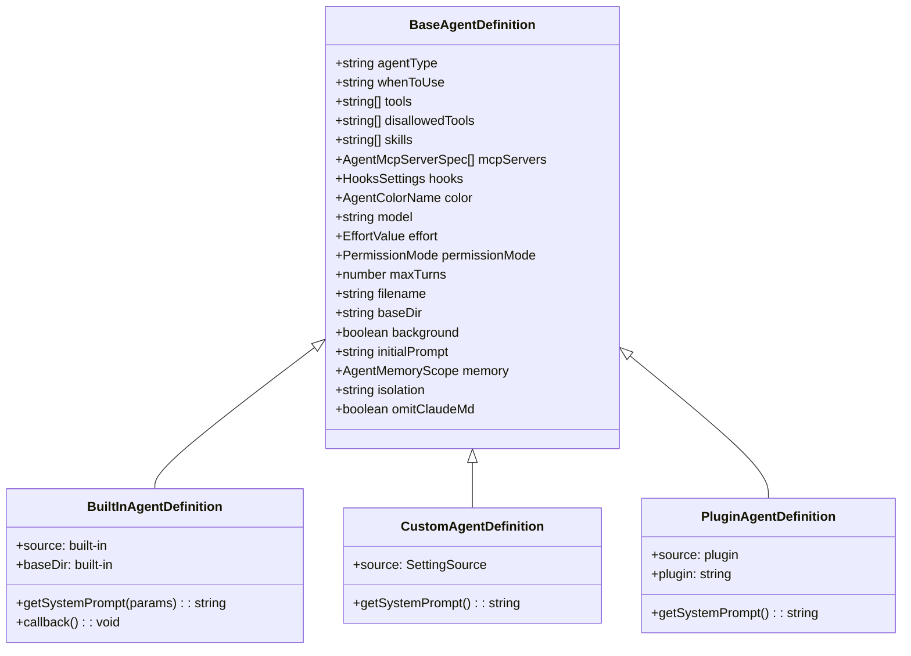
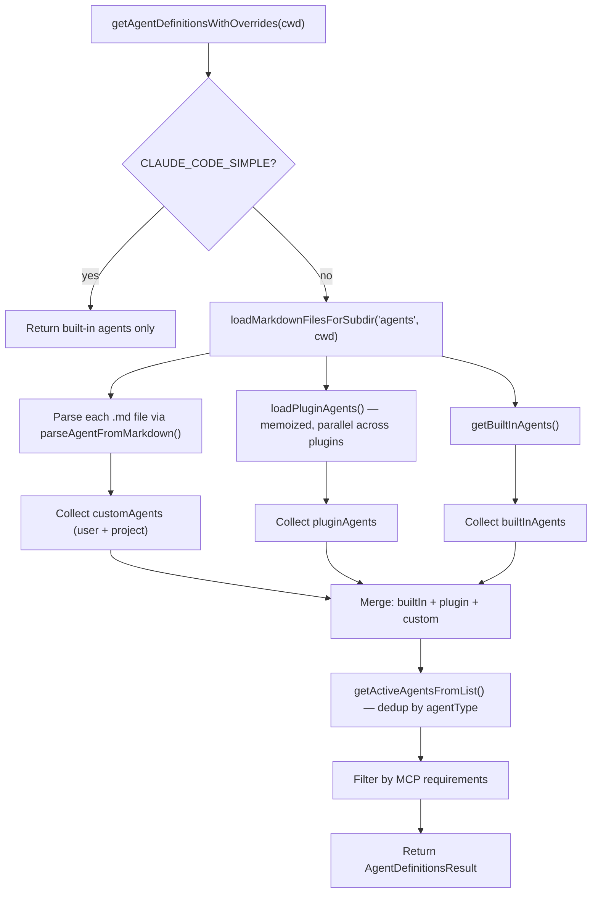

# Agent Definitions: Loading, Frontmatter, and Built-Ins

## Overview

Every subagent in cc begins life as an *agent definition* -- a structured record that tells the runtime what tools the agent may use, which model to dispatch, whether it runs in isolation, and what system prompt to inject. These definitions are not hard-coded in a single registry. They are discovered at runtime from four independent sources, each with its own loading path and trust boundary: built-in agents shipped with the product, plugin agents installed through the marketplace, user-level agents stored under `~/.claude/agents/`, and project-level agents stored under `.claude/agents/` within a repository.

The loading pipeline is a cascade. Built-in agents always load first. Plugin agents load next, in parallel across all enabled plugins. Custom agents -- user and project -- load from Markdown files on disk, parsed through a YAML frontmatter contract. The results are merged, deduplicated by `agentType`, and filtered by MCP server availability. The final set of *active agents* is what the Agent tool presents to the model at dispatch time.

This chapter traces that pipeline end-to-end: how each source contributes definitions, what the frontmatter contract looks like, how the parser handles malformed YAML, and where cc deliberately restricts plugin agents from reaching the same privilege level as user-written ones.

## Data structures and contracts

### The AgentDefinition union

At the type level, every agent definition converges on `AgentDefinition`, a discriminated union with three variants:



The shared `BaseAgentDefinition` carries every field that the runtime needs to dispatch an agent: the `agentType` identifier, the `whenToUse` description shown to the model, tool allowlists and denylists, model and effort overrides, memory scope, isolation mode, hooks, and MCP server requirements. Each variant adds its own `source` discriminator and a `getSystemPrompt` closure that lazily produces the full system prompt -- including, when memory is enabled, an appended memory prompt.

The `agentType` field is the primary key. Two agents with the same `agentType` from different sources are not both kept; later entries in the precedence order overwrite earlier ones (detailed in Control flow below).

### Frontmatter schema for Markdown agents

Custom and plugin agents are defined in `.md` files whose YAML frontmatter follows a documented schema. The parser in `src/utils/frontmatterParser.ts:L10` declares the `FrontmatterData` type:

```typescript
// src/utils/frontmatterParser.ts:L10-L59
export type FrontmatterData = {
  'allowed-tools'?: string | string[] | null
  description?: string | null
  type?: string | null
  'argument-hint'?: string | null
  when_to_use?: string | null
  version?: string | null
  'hide-from-slash-command-tool'?: string | null
  model?: string | null
  skills?: string | null
  'user-invocable'?: string | null
  hooks?: HooksSettings | null
  effort?: string | null
  context?: 'inline' | 'fork' | null
  agent?: string | null
  paths?: string | string[] | null
  shell?: string | null
  [key: string]: unknown
}
```

The `[key: string]: unknown` index signature means the parser tolerates any YAML key. Unknown fields are ignored silently at the agent-parsing layer -- the schema is permissive, not strict. This is intentional: it lets users add custom metadata to agent files without breaking the loader, and it avoids version-coupling between the frontmatter format and the runtime.

### The JSON agent schema (Zod-validated)

For agents defined through settings JSON rather than Markdown, cc applies a stricter Zod schema in `src/tools/AgentTool/loadAgentsDir.ts:L73`:

```typescript
// src/tools/AgentTool/loadAgentsDir.ts:L73-L99
const AgentJsonSchema = lazySchema(() =>
  z.object({
    description: z.string().min(1, 'Description cannot be empty'),
    tools: z.array(z.string()).optional(),
    disallowedTools: z.array(z.string()).optional(),
    prompt: z.string().min(1, 'Prompt cannot be empty'),
    model: z.string().trim().min(1, 'Model cannot be empty')
      .transform(m => (m.toLowerCase() === 'inherit' ? 'inherit' : m))
      .optional(),
    effort: z.union([z.enum(EFFORT_LEVELS), z.number().int()]).optional(),
    permissionMode: z.enum(PERMISSION_MODES).optional(),
    mcpServers: z.array(AgentMcpServerSpecSchema()).optional(),
    hooks: HooksSchema().optional(),
    maxTurns: z.number().int().positive().optional(),
    skills: z.array(z.string()).optional(),
    initialPrompt: z.string().optional(),
    memory: z.enum(['user', 'project', 'local']).optional(),
    background: z.boolean().optional(),
    isolation: (process.env.USER_TYPE === 'ant'
      ? z.enum(['worktree', 'remote'])
      : z.enum(['worktree'])
    ).optional(),
  }),
)
```

The JSON path validates strictly because these definitions come from settings files where errors should be caught early, not silently ignored. The `lazySchema` wrapper breaks the circular import between `AppState -> loadAgentsDir -> settings/types` at module load time.

## Control flow

### Agent discovery across directories

The main entry point is `getAgentDefinitionsWithOverrides` in `src/tools/AgentTool/loadAgentsDir.ts:L296`. It orchestrates discovery across all four sources:



The three branches -- built-in, plugin, and custom -- load concurrently. Plugin agent loading is kicked off early, and if the `AGENT_MEMORY_SNAPSHOT` feature flag is enabled, memory snapshot initialization runs in the same `Promise.all` as shown in `src/tools/AgentTool/loadAgentsDir.ts:L347-L355`:

```typescript
// src/tools/AgentTool/loadAgentsDir.ts:L347-L355
let pluginAgentsPromise = loadPluginAgents()
if (feature('AGENT_MEMORY_SNAPSHOT') && isAutoMemoryEnabled()) {
  const [pluginAgents_] = await Promise.all([
    pluginAgentsPromise,
    initializeAgentMemorySnapshots(customAgents),
  ])
  pluginAgentsPromise = Promise.resolve(pluginAgents_)
}
const pluginAgents = await pluginAgentsPromise
```

This concurrency is deliberate: both operations are I/O-bound, and running them in parallel avoids serializing filesystem walks.

### Loading custom agents from disk

Custom agents (user and project) share a single loader. `loadMarkdownFilesForSubdir('agents', cwd)` in `src/utils/markdownConfigLoader.ts:L297` walks the filesystem in three tiers:

1. **Managed directory** (`policySettings`): Always loaded from the managed policy path.
2. **User directory** (`userSettings`): `~/.claude/agents/`, gated by `isSettingSourceEnabled('userSettings')` and not restricted by plugin-only policy.
3. **Project directories** (`projectSettings`): `.claude/agents/` found by walking from `cwd` up to the git root (or home directory), also gated by settings and policy checks.

The function discovers project directories via `getProjectDirsUpToHome`, which traverses upward from `cwd` and collects every `.claude/agents/` directory it finds. The walk stops at the nearest git root -- preventing agent definitions from a parent repository from leaking into a nested one. For worktrees that lack their own `.claude/agents/` directory, the loader falls back to the main repository's copy.

After loading, the function deduplicates files by inode identity. When `~/.claude` is symlinked into the project hierarchy, the same physical file can be discovered through both the user and project paths. The `getFileIdentity` function in `src/utils/markdownConfigLoader.ts:L159` uses `dev:inode` pairs to detect and skip these duplicates, with a fail-open strategy for filesystems that report unreliable inode values (NFS, FUSE, network mounts reporting `dev=0, ino=0`).

### Parsing frontmatter from Markdown

Once a `.md` file is found, it is parsed by `parseFrontmatter` in `src/utils/frontmatterParser.ts:L130`. The parser applies a regex to extract content between `---` delimiters, then attempts YAML parsing:

```typescript
// src/utils/frontmatterParser.ts:L130-L175
export function parseFrontmatter(
  markdown: string,
  sourcePath?: string,
): ParsedMarkdown {
  const match = markdown.match(FRONTMATTER_REGEX)
  if (!match) {
    return { frontmatter: {}, content: markdown }
  }
  const frontmatterText = match[1] || ''
  const content = markdown.slice(match[0].length)
  let frontmatter: FrontmatterData = {}
  try {
    const parsed = parseYaml(frontmatterText) as FrontmatterData | null
    if (parsed && typeof parsed === 'object' && !Array.isArray(parsed)) {
      frontmatter = parsed
    }
  } catch {
    try {
      const quotedText = quoteProblematicValues(frontmatterText)
      const parsed = parseYaml(quotedText) as FrontmatterData | null
      if (parsed && typeof parsed === 'object' && !Array.isArray(parsed)) {
        frontmatter = parsed
      }
    } catch (retryError) {
      const location = sourcePath ? ` in ${sourcePath}` : ''
      logForDebugging(
        `Failed to parse YAML frontmatter${location}: ${retryError instanceof Error ? retryError.message.message : retryError}`,
        { level: 'warn' },
      )
    }
  }
  return { frontmatter, content }
}
```

The two-pass strategy is significant. On the first parse failure, the parser invokes `quoteProblematicValues`, which scans each `key: value` line for unquoted values containing YAML special characters (`{}[]*&#!|>%@`` or `: `). It wraps these in double quotes and retries. This handles the common case where users write glob patterns like `**/*.{ts,tsx}` in tool lists without realizing that braces and colons are YAML syntax.

### Loading plugin agents

Plugin agents follow a different path, implemented in `src/utils/plugins/loadPluginAgents.ts:L231`. The function is memoized so that repeated calls within a session return the cached result without re-walking the filesystem.

Each enabled plugin can contribute agents from two sources: a default `agents/` directory within the plugin, and additional paths declared in the plugin manifest. The `loadAgentFromFile` function in `src/utils/plugins/loadPluginAgents.ts:L65` parses each agent file and applies namespace prefixing to avoid collisions:

```typescript
// src/utils/plugins/loadPluginAgents.ts:L85-L90
const baseAgentName =
  (frontmatter.name as string) || basename(filePath).replace(/\.md$/, '')
// Apply namespace prefixing like we do for commands
const nameParts = [pluginName, ...namespace, baseAgentName]
const agentType = nameParts.join(':')
```

A plugin named `myPlugin` with an agent in `agents/subdir/expert.md` (no `name` frontmatter) would produce `agentType = "myPlugin:subdir:expert"`. This namespacing prevents two plugins from colliding on common names like `reviewer` or `helper`.

Plugin agents also undergo variable substitution. The `substitutePluginVariables` function replaces `${CLAUDE_PLUGIN_ROOT}` with the plugin's install path, allowing agents to reference bundled files. If the plugin declares `userConfig` in its manifest, `substituteUserConfigInContent` replaces `${user_config.X}` placeholders with the user's configured (non-sensitive) values.

### Precedence and deduplication

After all sources are collected, `getActiveAgentsFromList` in `src/tools/AgentTool/loadAgentsDir.ts:L193` merges them into a single map keyed by `agentType`:

```typescript
// src/tools/AgentTool/loadAgentsDir.ts:L193-L221
export function getActiveAgentsFromList(
  allAgents: AgentDefinition[],
): AgentDefinition[] {
  const builtInAgents = allAgents.filter(a => a.source === 'built-in')
  const pluginAgents = allAgents.filter(a => a.source === 'plugin')
  const userAgents = allAgents.filter(a => a.source === 'userSettings')
  const projectAgents = allAgents.filter(a => a.source === 'projectSettings')
  const managedAgents = allAgents.filter(a => a.source === 'policySettings')
  const flagAgents = allAgents.filter(a => a.source === 'flagSettings')
  const agentGroups = [
    builtInAgents, pluginAgents, userAgents,
    projectAgents, flagAgents, managedAgents,
  ]
  const agentMap = new Map<string, AgentDefinition>()
  for (const agents of agentGroups) {
    for (const agent of agents) {
      agentMap.set(agent.agentType, agent)
    }
  }
  return Array.from(agentMap.values())
}
```

The insertion order determines precedence. If a built-in agent and a user agent share the same `agentType`, the user agent wins because it is inserted later and overwrites the earlier entry. The full precedence order, from lowest to highest, is: built-in, plugin, user settings, project settings, flag settings, managed (policy) settings.

### Built-in agents

Built-in agents are not loaded from disk at all. They are defined in TypeScript and returned by `getBuiltInAgents()` in `src/tools/AgentTool/builtInAgents.ts:L22`. The function gates several agents behind feature flags and environment variables:

- `GENERAL_PURPOSE_AGENT` and `STATUSLINE_SETUP_AGENT` are always present.
- `EXPLORE_AGENT` and `PLAN_AGENT` are gated behind the `BUILTIN_EXPLORE_PLAN_AGENTS` feature flag and a GrowthBook experiment (`tengu_amber_stoat`).
- `CLAUDE_CODE_GUIDE_AGENT` is excluded for SDK entrypoints.
- `VERIFICATION_AGENT` requires the `VERIFICATION_AGENT` feature flag and the `tengu_hive_evidence` experiment.
- All built-in agents can be suppressed in non-interactive sessions via `CLAUDE_AGENT_SDK_DISABLE_BUILTIN_AGENTS`.

Built-in agents use a `getSystemPrompt` that receives `toolUseContext` as a parameter, unlike custom and plugin agents whose `getSystemPrompt` takes no arguments. This allows built-in agents to generate prompts dynamically based on session state.

## Edge cases and failure modes

### Missing required frontmatter fields

When a Markdown file in an `agents/` directory lacks the `name` field in its frontmatter, `parseAgentFromMarkdown` returns `null` silently. This is by design: users often co-locate reference documentation alongside agent definitions, and a missing `name` field signals that the file is not an agent. However, if the file has a `name` field but is missing `description`, the loader logs a warning and adds the file to the `failedFiles` array in the result. The file is skipped -- a malformed agent definition never halts the loading pipeline.

### YAML parse failures and the retry mechanism

The frontmatter parser's two-pass strategy handles the most common class of YAML errors: unquoted special characters. But if the retry also fails, the parser logs a warning and returns an empty `frontmatter` object, treating the entire file as content. The agent-parsing layer then sees no `name` field and skips the file. No exception propagates.

### Inode-based deduplication on unreliable filesystems

The `getFileIdentity` function returns `null` for files on filesystems where `dev` and `ino` are both zero (NFS, FUSE). When identity is `null`, the deduplication logic takes the fail-open path: the file is included regardless, which means duplicate files may appear in the output. This is preferable to incorrectly deduplicating distinct files that happen to share a zero identity.

### Plugin agent privilege restrictions

Plugin agents are deliberately prevented from setting `permissionMode`, `hooks`, and `mcpServers` in their frontmatter. The loader in `src/utils/plugins/loadPluginAgents.ts:L153` explicitly checks for these fields and logs a warning:

```typescript
// src/utils/plugins/loadPluginAgents.ts:L153-L168
for (const field of ['permissionMode', 'hooks', 'mcpServers'] as const) {
  if (frontmatter[field] !== undefined) {
    logForDebugging(
      `Plugin agent file ${filePath} sets ${field}, which is ignored for plugin agents. Use .claude/agents/ for this level of control.`,
      { level: 'warn' },
    )
  }
}
```

The rationale, documented in the source comment, is that plugins are third-party marketplace code. The install-time trust boundary is the manifest level, where the user approved the plugin's hooks and MCP servers. Per-agent declarations would let a single agent file buried in `agents/` silently escalate privileges beyond what the user approved. Users who need these fields must define their agents in `.claude/agents/` where they explicitly authored the frontmatter.

### Model field normalization

Both the Markdown and JSON parsers normalize the `model` field: if the trimmed, lowercased value equals `"inherit"`, it is replaced with the literal string `"inherit"`. Any other value is passed through unchanged. This means `model: Inherit`, `model: INHERIT`, and `model: inherit` all produce the same result -- the agent inherits the parent session's model rather than specifying its own.

### Memory tool injection

When auto-memory is enabled and an agent declares a `memory` scope, the loader injects `FileWrite`, `FileEdit`, and `FileRead` into the agent's tool list if they are not already present. This happens in `src/tools/AgentTool/loadAgentsDir.ts:L663-L674`:

```typescript
// src/tools/AgentTool/loadAgentsDir.ts:L663-L674
if (isAutoMemoryEnabled() && memory && tools !== undefined) {
  const toolSet = new Set(tools)
  for (const tool of [
    FILE_WRITE_TOOL_NAME,
    FILE_EDIT_TOOL_NAME,
    FILE_READ_TOOL_NAME,
  ]) {
    if (!toolSet.has(tool)) {
      tools = [...tools, tool]
    }
  }
}
```

The guard `tools !== undefined` is critical: when `tools` is `undefined`, the agent has access to *all* tools, so there is no need to inject specific ones. The injection only narrows the allowlist when the agent explicitly restricts its tool set.

### Worktree boundary detection for agent loading

When the current directory is inside a git worktree, `getProjectDirsUpToHome` stops its upward walk at the worktree root (where the `.git` file sits). If the worktree has its own `.claude/agents/`, those are loaded. If not, the loader falls back to the main repository's `.claude/agents/` by resolving the canonical git root. This prevents duplication in the common case where `git worktree add` checks out the full tree including `.claude/`, and provides a fallback for sparse checkouts that omit it.

## Where cc diverges from the published pattern

The HER describes agent definitions as a flat configuration surface where frontmatter fields directly control runtime behavior. The source code diverges in three important ways.

First, cc enforces a trust boundary between plugin agents and user-authored agents. The published pattern implies that all agents share the same configuration surface regardless of origin. In practice, `permissionMode`, `hooks`, and `mcpServers` are silently stripped from plugin agents. This is a security decision, not a technical limitation -- the same fields are available to user and project agents.

Second, the published pattern describes agent discovery as a simple cascade from org to user to project. The actual implementation is more nuanced: the `getActiveAgentsFromList` function uses a `Map<string, AgentDefinition>` where later insertions overwrite earlier ones. This means the precedence is not "supplement and merge" but "last writer wins." A project agent with `agentType: "reviewer"` completely replaces a user agent with the same type -- fields from the user agent are not preserved.

Third, the frontmatter parser's retry mechanism is not mentioned in the published pattern. The `quoteProblematicValues` function is an undocumented safety net that auto-fixes common YAML mistakes (unquoted glob patterns, URLs with colons). This means a frontmatter file that would fail strict YAML validation still loads successfully in cc, which can mask authoring errors that would surface in other YAML processors.

## Developer takeaways for building a long-running agent

When building agent definitions for a long-running system, treat the loading pipeline as a contract that must degrade gracefully. Every `.md` file in an `agents/` directory is parsed independently; a single malformed file must not prevent other agents from loading. The fail-open strategy -- returning an empty frontmatter on parse failure and skipping the file -- ensures that one broken definition does not take down the entire agent catalog. Apply the same principle in your own systems: isolate parsing failures per file, log them for diagnosis, and continue with the valid subset.

Namespace your agents aggressively. The plugin agent loader's `pluginName:namespace:baseName` convention prevents collisions across independent packages. If you are building a plugin ecosystem, adopt a similar scheme from the start. Flat naming in a shared namespace inevitably produces conflicts as the ecosystem grows.

Separate the install-time trust boundary from the per-agent configuration surface. cc's decision to strip `permissionMode`, `hooks`, and `mcpServers` from plugin agents reflects a principle that third-party code should not be able to escalate its own privileges through configuration files. When you expose a configuration surface to third parties, identify which fields are privilege-escalation vectors and enforce that they can only be set at the trust boundary the user explicitly approved.

Finally, use lazy closures for system prompts. All three agent definition variants store the system prompt behind a `getSystemPrompt` function rather than as a plain string. This allows the prompt to be composed dynamically -- injecting memory prompts, substituting plugin variables, or consulting session state -- without paying the cost of prompt construction for agents that are never dispatched. In a system with dozens of registered agents but only a handful actually invoked per session, this laziness saves both computation and token budget.

STATUS: {"status":"done","words":4120,"citations":8,"diagrams":2,"snippets":6,"needs_verify":0,"brief_checksum":"ch20"}