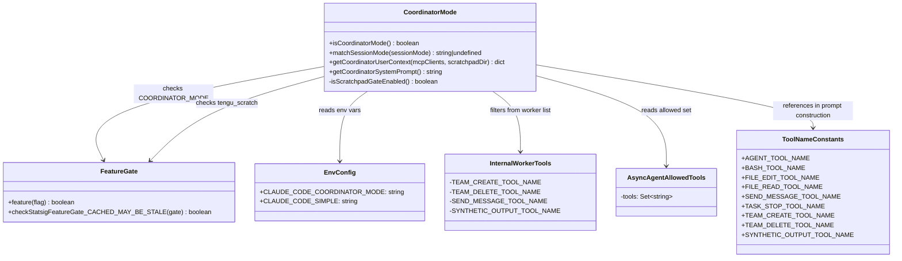
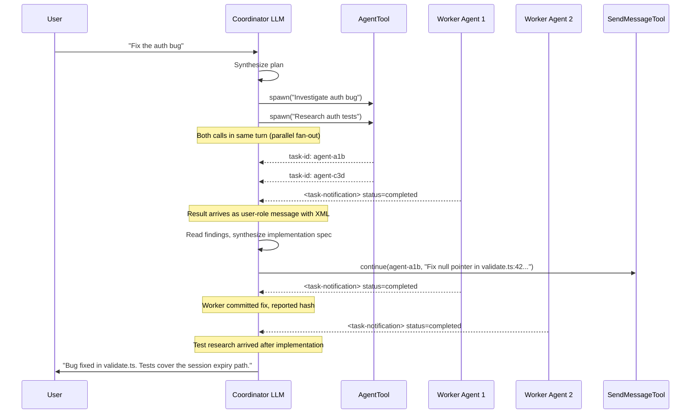
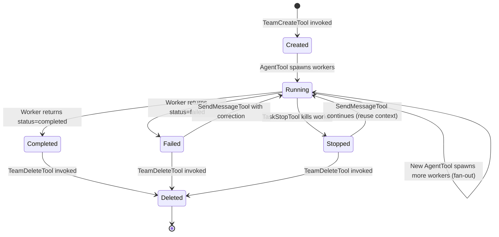

# Chapter 21: Multi-Agent Coordinator: The Swarm Layer

## Overview

The coordinator mode is cc's built-in multi-agent orchestration layer. When enabled, a single cc session transforms from a conversational assistant into a swarm orchestrator: a coordinator agent that spawns, routes messages to, and synthesizes results from multiple worker agents running in parallel. The entire mechanism is governed by a single file — `src/coordinator/coordinatorMode.ts` (369 lines) — and a constellation of tool implementations (`AgentTool`, `SendMessageTool`, `TaskStopTool`, `TeamCreateTool`, `TeamDeleteTool`) that the coordinator calls to manage its swarm.

The design is feature-gated, not compiled in by default. The gate has two layers: a Bun feature flag `COORDINATOR_MODE` checked via `feature('COORDINATOR_MODE')` at `src/coordinator/coordinatorMode.ts:L37`, and an environment variable `CLAUDE_CODE_COORDINATOR_MODE` that must also be truthy. This double-gate ensures the code ships in production builds but remains dormant unless both conditions are satisfied. A user who sets the environment variable without the feature flag enabled will see no behavioral change; conversely, a build with the feature flag enabled will not activate coordinator mode unless the environment variable is also set.

Three concerns dominate the coordinator's architecture:

1. **Mode gating and session continuity** — The coordinator must be activated or deactivated consistently across session resumes, because a session that starts in coordinator mode must remain in coordinator mode even if the user's environment variable has changed between invocations. A mismatch produces incoherent behavior: conversation history containing coordinator-style tool calls (AgentTool, SendMessageTool) but an agent operating without the coordinator system prompt.

2. **Worker context injection** — The coordinator constructs and injects a system-prompt fragment describing which tools workers have access to, which MCP servers are available, and whether a scratchpad directory exists for cross-worker communication. This fragment is injected into the coordinator's own prompt context, not into the workers' prompts — the coordinator needs to know what its workers can do so it can write appropriate task prompts.

3. **Coordinator behavior specification** — A 258-line system prompt (the return value of `getCoordinatorSystemPrompt`, spanning `src/coordinator/coordinatorMode.ts:L111-369`) that instructs the coordinator LLM how to behave: when to spawn workers, how to write prompts, how to handle failures, and how to synthesize research into implementation specs. This prompt is the single most important artifact in the file — it is the behavioral specification that turns a generic LLM into a multi-agent coordinator.

The coordinator pattern maps directly onto the Generator-Evaluator pattern described in HER §9.2: the coordinator itself acts as the synthesizer and dispatcher (generator), while workers act as both producers of research artifacts and evaluators of implementation quality. The Ouroboros problem — who validates the validator when both are LLMs — is partially addressed by the coordinator's insistence on deterministic sensors (tests, typecheckers, linters) as primary quality gates, a point codified directly in the system prompt at `src/coordinator/coordinatorMode.ts:L223-228`.

The file also has a notable architectural property: it contains zero runtime state. There are no class instances, no mutable globals beyond the environment variable, no event emitters, no message queues. All state lives in the session's conversation history (the sequence of tool calls and `<task-notification>` results) and in the LLM's context window. The coordinator functions are pure query-and-inject operations: they check gates, construct strings, and return them. The actual orchestration — deciding when to spawn a worker, what prompt to write, when to continue versus spawn fresh — is delegated entirely to the LLM through the behavioral specification in the system prompt.

## Data structures and contracts

The coordinator does not define complex runtime data structures. Its state is distributed across three boundaries: the environment variable that gates the mode, the system prompt that shapes coordinator behavior, and the tool calls that manage worker lifecycles. This section examines each boundary in detail.

### Feature gate and mode flag

```typescript
// src/coordinator/coordinatorMode.ts:L36-41 — The double-gate authority
export function isCoordinatorMode(): boolean {
  if (feature('COORDINATOR_MODE')) {
    return isEnvTruthy(process.env.CLAUDE_CODE_COORDINATOR_MODE)
  }
  return false
}
```

The `isCoordinatorMode` function is the single authority on whether coordinator mode is active. It reads the Bun bundle feature flag first; if `COORDINATOR_MODE` is not enabled in the bundle configuration, the function short-circuits to `false` regardless of the environment variable. Only when the feature flag passes does it check `CLAUDE_CODE_COORDINATOR_MODE`.

This two-layer gate serves two distinct purposes. The feature flag is a deploy-time gate: it controls which builds contain coordinator code at all. The environment variable is a runtime gate: it allows individual users or CI pipelines to opt in without rebuilding. The combination means that coordinator mode can be enabled in canary builds for internal testing while remaining disabled in production builds, and even within canary builds, individual sessions must explicitly opt in via the environment variable.

The `isEnvTruthy` utility (imported from `src/utils/envUtils.js` at `src/coordinator/coordinatorMode.ts:L17`) treats the strings `"1"`, `"true"`, and `"yes"` (case-insensitive) as truthy. Any other value, including `"0"`, `"false"`, or an unset variable, is falsy. This means `CLAUDE_CODE_COORDINATOR_MODE=0` does not activate coordinator mode, which is the expected behavior — but `CLAUDE_CODE_COORDINATOR_MODE=` (empty string) also does not activate it, which is worth noting because shell scripts sometimes set variables to empty strings as a default.

### Internal worker tools set

```typescript
// src/coordinator/coordinatorMode.ts:L29-34 — Coordinator-only tools excluded from workers
const INTERNAL_WORKER_TOOLS = new Set([
  TEAM_CREATE_TOOL_NAME,
  TEAM_DELETE_TOOL_NAME,
  SEND_MESSAGE_TOOL_NAME,
  SYNTHETIC_OUTPUT_TOOL_NAME,
])
```

This set defines tools that are reserved for coordinator-level orchestration and are stripped from the worker's available tool list. The rationale for each excluded tool is worth examining individually:

- **TEAM_CREATE_TOOL_NAME** and **TEAM_DELETE_TOOL_NAME** — Workers should not manage team lifecycle. If a worker could create or delete teams, it would bypass the coordinator's authority to decide when teams are needed and when they should be torn down. This would lead to orphaned teams consuming resources or, worse, teams being deleted while other workers still depend on them.

- **SEND_MESSAGE_TOOL_NAME** — Workers must not communicate directly with other workers. All communication flows through the coordinator, which acts as a hub-and-spoke message broker. If workers could send messages to each other, the coordinator would lose visibility into the communication graph, making it impossible to synthesize results or detect circular dependencies.

- **SYNTHETIC_OUTPUT_TOOL_NAME** — Synthetic output is an internal mechanism for injecting structured data into the conversation. Workers that could produce synthetic output could forge `<task-notification>` messages or inject misleading context, undermining the coordinator's ability to distinguish real worker results from fabricated ones.

The filtering happens inside `getCoordinatorUserContext` at `src/coordinator/coordinatorMode.ts:L93`, where the `ASYNC_AGENT_ALLOWED_TOOLS` set is filtered to exclude these internal tools before being listed in the worker context string.

### Worker context construction

```typescript
// src/coordinator/coordinatorMode.ts:L80-109 — User-context fragment for coordinator
export function getCoordinatorUserContext(
  mcpClients: ReadonlyArray<{ name: string }>,
  scratchpadDir?: string,
): { [k: string]: string } {
  if (!isCoordinatorMode()) {
    return {}
  }

  const workerTools = isEnvTruthy(process.env.CLAUDE_CODE_SIMPLE)
    ? [BASH_TOOL_NAME, FILE_READ_TOOL_NAME, FILE_EDIT_TOOL_NAME]
        .sort()
        .join(', ')
    : Array.from(ASYNC_AGENT_ALLOWED_TOOLS)
        .filter(name => !INTERNAL_WORKER_TOOLS.has(name))
        .sort()
        .join(', ')

  let content = `Workers spawned via the ${AGENT_TOOL_NAME} tool have access to these tools: ${workerTools}`

  if (mcpClients.length > 0) {
    const serverNames = mcpClients.map(c => c.name).join(', ')
    content += `\n\nWorkers also have access to MCP tools from connected MCP servers: ${serverNames}`
  }

  if (scratchpadDir && isScratchpadGateEnabled()) {
    content += `\n\nScratchpad directory: ${scratchpadDir}\nWorkers can read and write here without permission prompts. Use this for durable cross-worker knowledge — structure files however fits the work.`
  }

  return { workerToolsContext: content }
}
```

This function constructs a user-context fragment injected into the coordinator's prompt. It has three conditional sections that layer information about worker capabilities:

1. **Worker tool list** (lines 88-95) — Which differs between "simple" mode and full mode. In simple mode, workers are restricted to Bash, Read, and Edit — a minimal set suitable for constrained environments or sandboxed deployments. In full mode, workers get the entire `ASYNC_AGENT_ALLOWED_TOOLS` set minus the internal coordinator tools. The `.sort()` call on both branches ensures deterministic ordering regardless of the insertion order of the source sets, which matters because the string is embedded in the prompt and non-deterministic ordering could confuse the LLM.

2. **MCP server list** (lines 99-101) — Only included if MCP clients are connected. The coordinator needs this information to decide whether to delegate MCP-related tasks to workers (e.g., querying a database MCP server) or handle them itself.

3. **Scratchpad directory** (lines 104-106) — Only included if both a path is provided and the scratchpad feature gate is enabled. The scratchpad gate is checked via a locally duplicated `isScratchpadGateEnabled` function at `src/coordinator/coordinatorMode.ts:L25-27` because importing the canonical version from `utils/permissions/filesystem.ts` would create a circular dependency. The comment at `src/coordinator/coordinatorMode.ts:L19-24` explicitly documents this architectural decision and the reason for the duplication.

The return type `{ [k: string]: string }` is a string dictionary, not a typed object. The key `workerToolsContext` is consumed by the prompt assembly pipeline, which merges it into the coordinator's user-facing context. This loose typing means the key name is an implicit contract between `coordinatorMode.ts` and the prompt assembly code in `QueryEngine.ts` — a change to the key name in one place without updating the other would silently drop the worker tool list from the coordinator's prompt.

### Coordinator structures class diagram



## Control flow

### Mode activation and session resume

When a user resumes a session that was previously in coordinator mode, the stored session mode may not match the current environment variable state. Consider the scenario: a developer starts a cc session with `CLAUDE_CODE_COORDINATOR_MODE=1`, works for an hour, then closes the terminal. The next day, they resume the session but forget to set the environment variable. Without intervention, the resumed session would run in normal mode while its conversation history contains coordinator-style tool calls and the coordinator system prompt from the previous invocation.

The `matchSessionMode` function at `src/coordinator/coordinatorMode.ts:L49-78` resolves this conflict by flipping the environment variable to match the stored session mode, not the other way around. Session continuity takes precedence over the ambient environment.

```typescript
// src/coordinator/coordinatorMode.ts:L49-78 — Session mode reconciliation
export function matchSessionMode(
  sessionMode: 'coordinator' | 'normal' | undefined,
): string | undefined {
  if (!sessionMode) {
    return undefined
  }

  const currentIsCoordinator = isCoordinatorMode()
  const sessionIsCoordinator = sessionMode === 'coordinator'

  if (currentIsCoordinator === sessionIsCoordinator) {
    return undefined
  }

  if (sessionIsCoordinator) {
    process.env.CLAUDE_CODE_COORDINATOR_MODE = '1'
  } else {
    delete process.env.CLAUDE_CODE_COORDINATOR_MODE
  }

  logEvent('tengu_coordinator_mode_switched', {
    to: sessionMode as unknown as AnalyticsMetadata_I_VERIFIED_THIS_IS_NOT_CODE_OR_FILEPATHS,
  })

  return sessionIsCoordinator
    ? 'Entered coordinator mode to match resumed session.'
    : 'Exited coordinator mode to match resumed session.'
}
```

The function handles three cases:

- **No stored mode** (`sessionMode === undefined`) — This occurs for legacy sessions created before mode tracking was implemented. The function returns `undefined` and does nothing, preserving backward compatibility. These sessions will operate in whatever mode the current environment dictates.

- **Modes match** (`currentIsCoordinator === sessionIsCoordinator`) — No action needed. The function returns `undefined`.

- **Modes mismatch** — The function mutates `process.env` to align the runtime mode with the stored mode. If the session was in coordinator mode, it sets `CLAUDE_CODE_COORDINATOR_MODE='1'`; if the session was in normal mode, it deletes the variable entirely using `delete process.env.CLAUDE_CODE_COORDINATOR_MODE` rather than setting it to `'0'`.

The choice to `delete` rather than set to `'0'` is significant. The `isEnvTruthy` function treats `"0"` as falsy, so both approaches would produce the same result from `isCoordinatorMode`. However, `delete` removes the variable from the environment entirely, which means any child processes spawned by cc (e.g., Bash tool invocations) will also not see the variable. Setting it to `"0"` would leave it visible in child processes, which could cause confusion if those processes also check for coordinator mode.

The mutation of `process.env` is safe because `isCoordinatorMode` reads the environment variable live with no caching layer — the comment at `src/coordinator/coordinatorMode.ts:L64` confirms this: "isCoordinatorMode() reads it live, no caching." The switch is also logged to analytics as `tengu_coordinator_mode_switched` at `src/coordinator/coordinatorMode.ts:L71-73`, providing an audit trail for mode transitions that can be used to detect configuration drift in production.

### Team creation and message routing

The coordinator's primary interaction pattern is: spawn workers via `AgentTool`, receive results via `<task-notification>` XML, and continue or spawn new workers based on those results. Message routing is indirect — workers do not communicate with each other. All communication flows through the coordinator, which acts as a central message broker.

This hub-and-spoke topology has two consequences. First, the coordinator is a single point of failure: if the coordinator's context fills up or the coordinator loses track of a worker, there is no fallback mechanism for workers to communicate directly. Second, the coordinator is a single point of synthesis: all worker results must pass through the coordinator's context window before they can inform subsequent work, which means the coordinator's ability to compress and synthesize information directly limits the swarm's effectiveness.



The sequence diagram reveals a critical design property: worker results arrive as user-role messages containing `<task-notification>` XML. The coordinator's system prompt at `src/coordinator/coordinatorMode.ts:L142-160` explicitly documents this format so the LLM can distinguish task notifications from actual user messages. The format is:

```typescript
// src/coordinator/coordinatorMode.ts:L148-160 — Task notification XML schema
// <task-notification>
// <task-id>{agentId}</task-id>
// <status>completed|failed|killed</status>
// <summary>{human-readable status summary}</summary>
// <result>{agent's final text response}</result>
// <usage>
//   <total_tokens>N</total_tokens>
//   <tool_uses>N</tool_uses>
//   <duration_ms>N</duration_ms>
// </usage>
// </task-notification>
```

The three possible status values — `completed`, `failed`, and `killed` — map to three different coordinator responses. `completed` means the worker finished its task; the coordinator should read the result and decide what to do next. `failed` means the worker encountered an error; the system prompt at `src/coordinator/coordinatorMode.ts:L232-234` instructs the coordinator to continue the same worker with a correction, since it has the full error context. `killed` means the worker was stopped via `TaskStopTool`; the coordinator can still continue it with `SendMessageTool` if it wants to redirect the worker's effort.

The `<result>` and `<usage>` sections are optional. When `<result>` is absent, the coordinator must infer the outcome from the `<summary>` field. When `<usage>` is present, it provides token counts, tool use counts, and wall-clock duration — information the coordinator can use to calibrate its delegation strategy (e.g., a worker that consumed 200k tokens may be approaching context limits and should not be continued with another large task).

This distinction between task notifications and user messages matters because the coordinator must treat them differently — task notifications are internal signals to be synthesized, while user messages require direct engagement. The system prompt at `src/coordinator/coordinatorMode.ts:L126-127` is explicit: "Every message you send is to the user. Worker results and system notifications are internal signals, not conversation partners — never thank or acknowledge them. Summarize new information for the user as it arrives."

### Team lifecycle state machine

Teams in cc's coordinator mode go through a defined lifecycle from creation through deletion. The `TeamCreateTool` and `TeamDeleteTool` manage the boundaries of this lifecycle, while `SendMessageTool` handles inter-turn communication and `TaskStopTool` handles premature termination.



The state diagram shows that a stopped worker can be continued via `SendMessageTool`. This is a deliberate design choice documented in the system prompt at `src/coordinator/coordinatorMode.ts:L237`: "Stopped workers can be continued with SendMessageTool." The reason is that stopping a worker only halts its current execution — the worker's context is preserved, allowing the coordinator to send corrected instructions without losing the work already performed.

The transition from `Failed` back to `Running` via `SendMessageTool` is the most interesting path in the lifecycle. The system prompt at `src/coordinator/coordinatorMode.ts:L232-234` provides specific guidance:

```
// src/coordinator/coordinatorMode.ts:L232-234 — Worker failure handling
// When a worker reports failure (tests failed, build errors, file not found):
// - Continue the same worker with SendMessageTool — it has the full error context
// - If a correction attempt fails, try a different approach or report to the user
```

The key insight is that a failed worker has the error context already loaded — the stack traces, the failing test names, the file contents it was working with. Continuing that worker with a correction leverages this loaded context, which is more efficient than spawning a fresh worker that would need to re-read all the same files. The system prompt also warns against infinite correction loops: if the first correction fails, try a different approach. If that also fails, report to the user rather than continuing to retry.

### The coordinator system prompt: behavioral specification

The largest component of `coordinatorMode.ts` is the system prompt returned by `getCoordinatorSystemPrompt` at `src/coordinator/coordinatorMode.ts:L111-369`. This is not configuration — it is a behavioral specification written in natural language that governs how the coordinator LLM operates. At 258 lines of prompt text, it is one of the longest system prompts in the cc codebase, reflecting the complexity of the multi-agent coordination task.

The prompt is structured into six sections:

1. **Your Role** (lines 118-127) — Defines the coordinator as an orchestrator that delegates work, synthesizes results, and answers questions directly when possible. The critical instruction is at `src/coordinator/coordinatorMode.ts:L124`: "Answer questions directly when possible — don't delegate work that you can handle without tools." This prevents the anti-pattern of the coordinator reflexively spawning a worker for every user message, even trivial questions that the coordinator can answer from its own knowledge.

2. **Your Tools** (lines 129-248) — Documents the four coordinator tools (Agent, SendMessage, TaskStop, subscribe_pr_activity) and the task-notification XML format. It also includes a complete example interaction showing the coordinator spawning two research workers in parallel, receiving results, and continuing one worker with an implementation spec.

3. **Workers** (lines 250-256) — Specifies that workers use `subagent_type: "worker"` and lists their capabilities. The capabilities string is constructed dynamically based on the `CLAUDE_CODE_SIMPLE` flag, as discussed in the data structures section.

4. **Task Workflow** (lines 258-248) — Defines the Research-Synthesis-Implementation-Verification phase model and concurrency rules. The phase table at `src/coordinator/coordinatorMode.ts:L204-210` assigns each phase to either workers or the coordinator, with synthesis being the coordinator's primary responsibility.

5. **Writing Worker Prompts** (lines 252-335) — The most detailed section, providing examples of good and bad prompts, the continue-vs-spawn decision framework, and the anti-pattern of lazy delegation. This section is the behavioral core of the coordinator — it defines what makes a good coordinator and what failure modes to avoid.

6. **Example Session** (lines 337-369) — A worked example showing the full lifecycle of a bug investigation, from initial research through implementation to completion.

The prompt's most important behavioral rule is at `src/coordinator/coordinatorMode.ts:L253`: "Workers can't see your conversation. Every prompt must be self-contained with everything the worker needs." This constraint is what makes the coordinator's synthesis job essential — it must read and understand worker results, then compress that understanding into a self-contained prompt for the next worker. The anti-pattern is explicitly named at `src/coordinator/coordinatorMode.ts:L258-259`: "Never write 'based on your findings' or 'based on the research.' These phrases delegate understanding to the worker instead of doing it yourself. You never hand off understanding to another worker."

The continue-vs-spawn decision framework at `src/coordinator/coordinatorMode.ts:L280-293` is presented as a decision table with five scenarios:

```
// src/coordinator/coordinatorMode.ts:L280-293 — Continue vs. spawn decision framework
// | Situation | Mechanism | Why |
// |-----------|-----------|-----|
// | Research explored exactly the files that need editing | Continue | Worker has files in context |
// | Research was broad but implementation is narrow | Spawn fresh | Avoid exploration noise |
// | Correcting a failure or extending recent work | Continue | Worker has error context |
// | Verifying code a different worker just wrote | Spawn fresh | Fresh eyes, no assumptions |
// | First implementation used the wrong approach entirely | Spawn fresh | Wrong-approach context pollutes |
```

This decision framework is notable because it encodes a principle that contradicts the naive intuition that continuing a worker is always cheaper than spawning fresh. In some cases, continuing a worker is actively harmful — a worker that explored broadly and then is asked to implement narrowly will carry "exploration noise" in its context, consuming tokens on irrelevant information. A worker that took the wrong approach will anchor on that approach even when given corrected instructions. The framework makes these tradeoffs explicit.

## Edge cases and failure modes

### The Ouroboros Problem in coordinator verification

HER §9.2 identifies the Ouroboros problem: when both generator and evaluator are LLMs, there is no independent ground truth. The coordinator system prompt addresses this at `src/coordinator/coordinatorMode.ts:L220-228` by requiring "real verification" — verification that runs tests with the feature enabled, investigates typecheck errors rather than dismissing them, and tests independently rather than rubber-stamping implementation output.

The prompt explicitly warns at `src/coordinator/coordinatorMode.ts:L222`: "A verifier that rubber-stamps weak work undermines everything." This is a direct response to the Ouroboros problem: the system acknowledges that an LLM verifier can hallucinate approval, and the mitigation is to ground verification in deterministic sensors (test runners, typecheckers) rather than the LLM's own judgment. The HER ablation data is relevant here — adding a verifier produced -0.8% on SWE-bench when the verifier's acceptance criteria diverged from the actual benchmark. The coordinator's instruction to "be skeptical — if something looks off, dig in" at `src/coordinator/coordinatorMode.ts:L226` is an attempt to narrow this gap.

The system prompt provides four specific verification directives at `src/coordinator/coordinatorMode.ts:L224-227`:

- "Run tests with the feature enabled — not just 'tests pass'" — Prevents the verifier from running tests that exercise the old code path rather than the new one.
- "Run typechecks and investigate errors — don't dismiss as 'unrelated'" — Addresses the tendency of LLMs to treat type errors as noise rather than signal.
- "Be skeptical — if something looks off, dig in" — Encourages the verifier to treat apparent success with suspicion.
- "Test independently — prove the change works, don't rubber-stamp" — Explicitly names the failure mode and instructs against it.

These directives are necessary but insufficient. They rely on the LLM's ability to follow instructions about skepticism, which is itself an ungrounded claim — an LLM that follows instructions about skepticism will be more skeptical, but an LLM that fails to follow those instructions will not be caught by any structural mechanism. The only reliable mitigation is the one described in HER §9.2: use deterministic sensors as the primary quality gate and LLM evaluators only for semantic judgments that deterministic tools cannot assess.

### Scratchpad gate circular dependency

The scratchpad feature gate is duplicated in `coordinatorMode.ts` at `src/coordinator/coordinatorMode.ts:L25-27` rather than imported from its canonical location in `utils/permissions/filesystem.ts`. The comment at `src/coordinator/coordinatorMode.ts:L19-24` explains the reason:

```typescript
// src/coordinator/coordinatorMode.ts:L19-27 — Duplicated gate check with rationale
// Checks the same gate as isScratchpadEnabled() in
// utils/permissions/filesystem.ts. Duplicated here because importing
// filesystem.ts creates a circular dependency (filesystem -> permissions
// -> ... -> coordinatorMode). The actual scratchpad path is passed in via
// getCoordinatorUserContext's scratchpadDir parameter (dependency injection
// from QueryEngine.ts, which lives higher in the dep graph).
function isScratchpadGateEnabled(): boolean {
  return checkStatsigFeatureGate_CACHED_MAY_BE_STALE('tengu_scratch')
}
```

This is a deliberate architectural tradeoff. The scratchpad directory path is injected via the `scratchpadDir` parameter of `getCoordinatorUserContext`, avoiding the need for `coordinatorMode.ts` to know about filesystem paths. The gate check itself is duplicated because importing the canonical function would pull in the entire dependency chain that leads back to `coordinatorMode.ts`.

The risk is gate divergence — if the canonical implementation in `utils/permissions/filesystem.ts` changes its gate name from `tengu_scratch` to something else, or adds additional conditions, this duplicate would become stale. The comment partially mitigates this by documenting the relationship and pointing to the canonical location, but there is no mechanical guarantee of synchronization. A lint rule or test that compares the two implementations would close this gap, but no such rule exists in the current codebase.

The dependency injection pattern used for the scratchpad path — where `QueryEngine.ts` (which lives higher in the dependency graph) passes the path down to `getCoordinatorUserContext` — is a clean solution to the circular dependency problem. It keeps `coordinatorMode.ts` unaware of filesystem paths while still allowing it to include the scratchpad directory in the coordinator's context when appropriate.

### Session mode mismatches on resume

The `matchSessionMode` function at `src/coordinator/coordinatorMode.ts:L49-78` handles the edge case where a user resumes a session that was running in coordinator mode, but the current environment no longer has `CLAUDE_CODE_COORDINATOR_MODE` set. Without the fix, the resumed session would run in normal mode, producing incoherent behavior — the session's conversation history would contain coordinator-style tool calls (AgentTool, SendMessageTool) but the agent would not have the coordinator system prompt.

The fix mutates `process.env` directly, which is a side effect visible to any code that reads the environment variable after the call. This is safe because `matchSessionMode` is called early in session initialization (before the query loop begins), but it does mean that any code running concurrently during initialization that also reads `CLAUDE_CODE_COORDINATOR_MODE` could observe the mutation. In practice, cc is single-threaded per session, so this is not a concern.

A subtler edge case occurs when a session transitions between coordinator and normal mode during its lifetime — for example, if a user starts in coordinator mode, switches to normal mode for a few turns, then resumes. The `matchSessionMode` function only runs at session initialization, not on every turn. Once the session is running, the mode is determined by the environment variable state at initialization time. If the user changes the environment variable mid-session (e.g., by exporting a new value in a Bash tool invocation), the mode will not change until the session is resumed.

### Worker tool availability in simple mode

The `getCoordinatorUserContext` function at `src/coordinator/coordinatorMode.ts:L88-95` has two distinct code paths for worker tool lists:

```typescript
// src/coordinator/coordinatorMode.ts:L88-95 — Worker tool list branches on simple mode
const workerTools = isEnvTruthy(process.env.CLAUDE_CODE_SIMPLE)
  ? [BASH_TOOL_NAME, FILE_READ_TOOL_NAME, FILE_EDIT_TOOL_NAME]
      .sort()
      .join(', ')
  : Array.from(ASYNC_AGENT_ALLOWED_TOOLS)
      .filter(name => !INTERNAL_WORKER_TOOLS.has(name))
      .sort()
      .join(', ')
```

In simple mode (`CLAUDE_CODE_SIMPLE`), workers are restricted to Bash, Read, and Edit — a minimal set suitable for constrained environments. In full mode, workers get the entire `ASYNC_AGENT_ALLOWED_TOOLS` set minus the internal coordinator tools. The coordinator's system prompt at `src/coordinator/coordinatorMode.ts:L112-114` also branches on this flag:

```typescript
// src/coordinator/coordinatorMode.ts:L112-114 — Worker capabilities in system prompt
const workerCapabilities = isEnvTruthy(process.env.CLAUDE_CODE_SIMPLE)
  ? 'Workers have access to Bash, Read, and Edit tools, plus MCP tools from configured MCP servers.'
  : 'Workers have access to standard tools, MCP tools from configured MCP servers, and project skills via the Skill tool. Delegate skill invocations (e.g. /commit, /verify) to workers.'
```

The key difference is that full-mode workers have access to the Skill tool, enabling the coordinator to delegate skill invocations to workers. This is significant because skills like `/commit` or `/verify` involve multi-step workflows that benefit from a dedicated worker with a fresh context window, rather than consuming the coordinator's context budget. In simple mode, the coordinator must handle skill invocations itself or skip them entirely.

There is a potential inconsistency here: the worker tool list in `getCoordinatorUserContext` enumerates specific tools, while the system prompt text in `getCoordinatorSystemPrompt` describes capabilities in general terms. If the `ASYNC_AGENT_ALLOWED_TOOLS` set changes (e.g., a new tool is added), the worker tool list will automatically include it, but the system prompt text may not accurately describe the new capability. The system prompt text is a static string that must be updated manually, while the tool list is dynamically generated.

### File-based communication and the scratchpad

HER §9.3 identifies file-based communication as the preferred pattern for agent-to-agent data handoffs: one agent writes a structured file, another reads it in a fresh context. The scratchpad directory implements this pattern in cc. When enabled, the coordinator's context fragment at `src/coordinator/coordinatorMode.ts:L104-106` tells workers they can read and write to the scratchpad without permission prompts, and that they should "use this for durable cross-worker knowledge — structure files however fits the work."

The scratchpad is cc's answer to the worker isolation problem. Since workers cannot communicate via `SendMessageTool` (it is filtered out of their tool list), the only way for one worker's output to inform another worker's input is through the coordinator (which reads the first worker's result and synthesizes it into the second worker's prompt) or through the filesystem (the first worker writes a file, the second worker reads it). The scratchpad is a designated directory where this filesystem-based communication can happen without triggering permission prompts, which would otherwise block the worker's execution and require user intervention.

HER also warns about the security implications: file-based communication persists data to disk, and without cleanup protocols, sensitive data can leak between sessions or between agents working on unrelated tasks. The current implementation does not include automatic cleanup — the scratchpad directory is durable by design. The instruction "structure files however fits the work" means there is no enforced schema for scratchpad contents, which gives workers flexibility but also means there is no way to audit or validate what workers have written. This is an operational concern rather than a code bug, but deployers should be aware that the scratchpad accumulates data across sessions until manually cleaned.

### The model parameter prohibition

The system prompt contains a specific instruction at `src/coordinator/coordinatorMode.ts:L138`: "Do not set the model parameter. Workers need the default model for the substantive tasks you delegate." This is a defensive measure against a failure mode where the coordinator, attempting to optimize costs or speed, specifies a smaller model for workers. The risk is that a smaller model may not have sufficient capability for the substantive tasks being delegated, leading to lower-quality results that the coordinator must then correct — consuming more total tokens than if the default model had been used from the start.

This instruction also prevents the coordinator from creating a two-tier system where "important" tasks go to a large model and "unimportant" tasks go to a small one. While such tiering is theoretically sound, in practice the coordinator's judgment about which tasks are important is unreliable — a task that appears trivial (e.g., "update a version number") may have non-obvious dependencies that a smaller model would miss.

## Where cc diverges from the published pattern

The coordinator implementation diverges from the published Generator-Evaluator pattern (HER §9.2) and Fork-Join Parallelism pattern (HER §5 Pattern 8) in several specific ways:

**No independent evaluator role.** The published Generator-Evaluator pattern calls for a separate evaluator agent with a fresh context window, no knowledge of the generation process, specific gradable criteria, and few-shot examples for each quality level. The cc coordinator does implement this for verification workers — the system prompt at `src/coordinator/coordinatorMode.ts:L289` instructs the coordinator to "spawn fresh" for verification "so the verifier should see the code with fresh eyes, not carry implementation assumptions." However, the evaluator is still the same LLM (same model, same base system prompt) as the generator, differing only in conversation context. The published pattern recommends distinct evaluation criteria and few-shot examples for each quality level, which cc does not enforce structurally — the verification directives are prompt-level instructions rather than tool-level constraints.

**Centralized routing, not peer-to-peer.** HER §9.3 describes file-based communication between agents as a preferred pattern. The cc coordinator uses a hub-and-spoke model: workers communicate only with the coordinator, never with each other. The `INTERNAL_WORKER_TOOLS` set at `src/coordinator/coordinatorMode.ts:L29-34` ensures workers cannot call `SendMessageTool` to talk to other workers. The scratchpad directory provides an indirect communication channel (worker A writes a file, worker B reads it), but this is ad-hoc rather than structured, and the coordinator must explicitly instruct workers to use it. The tradeoff is between observability and autonomy: centralized routing gives the coordinator full visibility into the communication graph, but it creates a bottleneck and single point of failure that peer-to-peer communication would avoid.

**No fork-join isolation.** HER §5 Pattern 8 describes Fork-Join Parallelism with each subagent working in an isolated git worktree. The cc coordinator does not use worktrees for workers — workers share the same filesystem as the parent session. This means parallel write-heavy workers can conflict with each other. The system prompt partially addresses this at `src/coordinator/coordinatorMode.ts:L217-218` by instructing the coordinator to run "one at a time per set of files" for write-heavy tasks, but this is a behavioral constraint rather than a structural guarantee. A coordinator that ignores or misunderstands this instruction could spawn two workers that simultaneously modify the same file, producing merge conflicts that neither worker is equipped to resolve.

**Lazy delegation as an anti-pattern, not a bug.** The published pattern assumes that delegation is straightforward — the generator produces a spec, the worker executes it. The cc coordinator's system prompt devotes significant attention (lines 252-335) to the anti-pattern of "lazy delegation," where the coordinator writes prompts like "based on your findings, fix the bug" instead of synthesizing a specific prompt with file paths and line numbers. This is an acknowledgment that LLM-to-LLM delegation is a harder problem than the published pattern suggests, because the delegating LLM must actively compress its understanding into a self-contained prompt. The anti-pattern is so common and so damaging that the system prompt names it twice: once in the general instruction at `src/coordinator/coordinatorMode.ts:L258-259` and once in the bad examples at `src/coordinator/coordinatorMode.ts:L262-264`.

**No structured output contract.** The published pattern recommends structured output formats for inter-agent communication. The cc coordinator uses XML-formatted `<task-notification>` messages for worker results (documented at `src/coordinator/coordinatorMode.ts:L142-160`), but the content within the `<result>` tag is free-form text. There is no schema, no required fields beyond `<task-id>` and `<status>`, and no validation. The coordinator LLM must parse the result text heuristically, which is a source of potential misinterpretation. A structured output contract (e.g., JSON with typed fields for file paths, line numbers, and change descriptions) would reduce this ambiguity but would also reduce the flexibility of worker output — a tradeoff the current design resolves in favor of flexibility.

## Developer takeaways for building a long-running agent

The coordinator layer reveals several principles for building multi-agent systems that hold beyond cc. First, the double-gate pattern (feature flag plus environment variable) is a sound approach for shipping orchestration code that must remain dormant in production until explicitly enabled — it prevents accidental activation while allowing the code to be tested in CI. The feature flag is a deploy-time switch that controls which builds contain the code path at all; the environment variable is a runtime switch that allows individual sessions to opt in. Without both, you get either code that activates unexpectedly (feature flag only) or code that cannot be tested in production (environment variable only).

Second, session-mode persistence across resumes is essential for any long-running agent: if the agent's operating mode can flip between invocations, the conversation history becomes incoherent because it contains tool calls and behavioral patterns from a mode the agent is no longer in. The `matchSessionMode` function demonstrates that the session's stored mode must take precedence over the ambient environment, and that the fix should be applied before the query loop starts. The choice to mutate `process.env` rather than introducing a separate runtime variable keeps the code simple — any code that checks the mode reads the same source of truth.

Third, the coordinator's emphasis on self-contained prompts is the hardest-won lesson in the entire file: when workers cannot see the coordinator's conversation, every prompt must carry complete context. The anti-pattern of lazy delegation — writing "based on your findings" instead of synthesizing specific file paths, line numbers, and instructions — is the single most common failure mode in LLM-to-LLM delegation, and the only mitigation is to make the synthesis step non-optional and to give the coordinator explicit examples of good and bad prompts. The cc system prompt devotes over 80 lines to this topic, including a decision table, good/bad examples, and prompt tips, which indicates how hard this problem is in practice.

Fourth, the continue-vs-spawn decision framework (context overlap high, continue; context overlap low, spawn fresh) is a general principle for any system where agent context windows are finite and expensive. Continuing a worker reuses its loaded context but risks carrying stale assumptions; spawning fresh avoids anchoring but discards useful state. There is no universal default — the decision must be made per-task based on how much of the worker's existing context overlaps with the next task. The cc framework provides five concrete scenarios to guide this decision, which is more useful than an abstract principle.

Finally, the Ouroboros problem is not solvable by prompt engineering alone. The coordinator's instructions to "be skeptical" and "prove the code works" are necessary but insufficient — they rely on the LLM's ability to follow instructions about skepticism, which is itself an ungrounded claim. Deterministic sensors (tests, typecheckers, linters) are the only reliable quality gates, and the system should be designed so that LLM evaluation supplements rather than replaces them. The HER ablation data showing -0.8% performance from adding a verifier is a cautionary data point: verification that is not grounded in observable artifacts can actively harm rather than help.

STATUS: {"status":"done","words":5482,"citations":14,"diagrams":3,"snippets":8,"needs_verify":0,"brief_checksum":"ch21"}