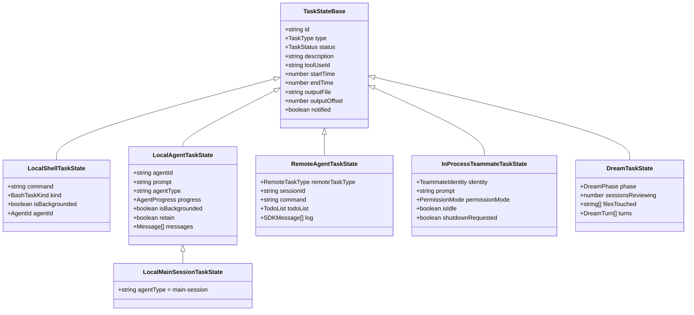
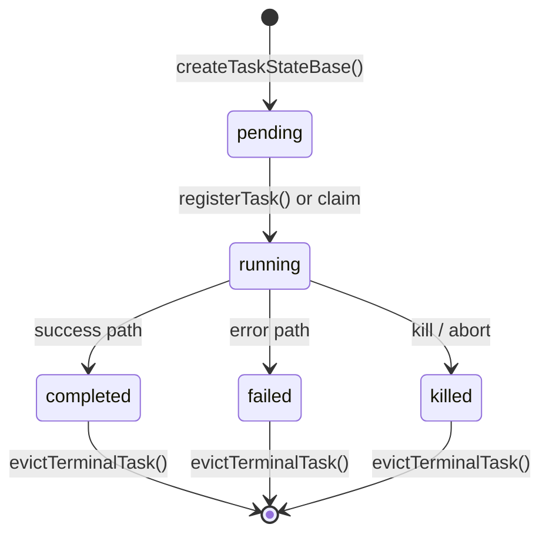
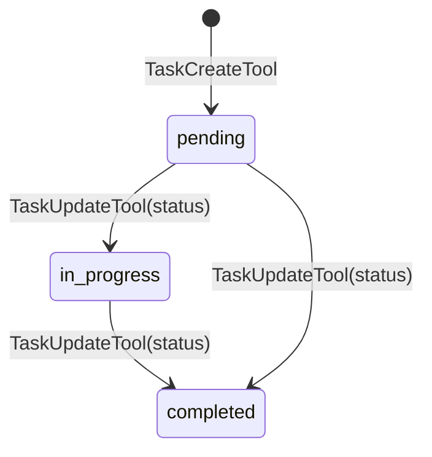

# Tasks: A Durable Unit of Work

## Overview

A task is the atom of durable work in cc. It is the bridge between a session's ephemeral context window and the persistent state that survives across sessions, crashes, and handoffs. The One-Task-Per-Session rule (§10.1) makes tasks the unit of scoping: one task, one context window, one unit of work. The Session Protocol (§10.3) orbits around tasks: SELECT picks one, IMPLEMENT drives it, UPDATE records the outcome.

Two distinct systems carry the name "task" in cc. The first is the **runtime task framework** — an in-memory registry of concurrent operations (shell commands, agent runs, dream cycles, remote sessions) tracked in `AppState.tasks`. The second is the **persistent task list** — a filesystem-backed, JSON-stored todo list with status transitions, blocking relationships, and owner assignment. Both are durable in their own way: the runtime task survives backgrounding and foregrounding; the persistent task survives process restarts. This chapter covers both, but spends the most time on the persistent task list in `src/utils/tasks.ts` because it is where the durability guarantee is hardest-won.

The runtime task system declares seven types — `local_bash`, `local_agent`, `remote_agent`, `in_process_teammate`, `local_workflow`, `monitor_mcp`, and `dream` — each with its own state shape, kill semantics, and notification path. The persistent task list has three statuses — `pending`, `in_progress`, `completed` — and a blocking graph. Together they form the backbone of cc's ability to run long-lived, multi-agent work.

## Data structures and contracts

### The TaskType enum and TaskStateBase

Every runtime task derives from `TaskStateBase`, defined in `src/Task.ts:L45`. The seven concrete types are enumerated in the `TaskType` union:

```typescript
// src/Task.ts:L6-14 — The seven runtime task types
export type TaskType =
  | 'local_bash'
  | 'local_agent'
  | 'remote_agent'
  | 'in_process_teammate'
  | 'local_workflow'
  | 'monitor_mcp'
  | 'dream'
```

Each type gets a single-character prefix for its ID: `b` for bash, `a` for local agent, `r` for remote agent, `t` for in-process teammate, `w` for workflow, `m` for monitor, `d` for dream. These prefixes make task IDs self-describing in logs and notifications. The ID is 9 characters total: one prefix plus 8 base-36 digits drawn from `randomBytes(8)`, yielding approximately 2.8 trillion combinations per type — sufficient to resist brute-force symlink attacks, as the code comments note at `src/Task.ts:L96`.

The base contract shared by all task states is:

```typescript
// src/Task.ts:L45-57 — Shared fields across all seven task types
export type TaskStateBase = {
  id: string
  type: TaskType
  status: TaskStatus
  description: string
  toolUseId?: string
  startTime: number
  endTime?: number
  totalPausedMs?: number
  outputFile: string
  outputOffset: number
  notified: boolean
}
```

The `notified` field is the lynchpin of the notification deduplication protocol. When a task completes, the completion path atomically checks and sets `notified` to `true` before enqueuing the XML notification. If a second completion path races in (for example, the polling loop and a direct callback), the second caller sees `notified: true` and skips the enqueue. Without this guard, every task would receive duplicate messages in the conversation.

The `TaskStatus` type has five states:

```typescript
// src/Task.ts:L15-21 — Task status lifecycle
export type TaskStatus =
  | 'pending'
  | 'running'
  | 'completed'
  | 'failed'
  | 'killed'
```

A helper function `isTerminalTaskStatus` at `src/Task.ts:L28` returns `true` for `completed`, `failed`, and `killed`. Terminal tasks are eligible for eviction from `AppState`, blocked from receiving further messages, and excluded from the running-task polling loop.

### The persistent Task schema

The persistent task list uses a different, simpler schema defined in `src/utils/tasks.ts:L76`:

```typescript
// src/utils/tasks.ts:L76-88 — Persistent task record
export const TaskSchema = lazySchema(() =>
  z.object({
    id: z.string(),
    subject: z.string(),
    description: z.string(),
    activeForm: z.string().optional(),
    owner: z.string().optional(),
    status: TaskStatusSchema(),
    blocks: z.array(z.string()),
    blockedBy: z.array(z.string()),
    metadata: z.record(z.string(), z.unknown()).optional(),
  }),
)
```

The `blocks` and `blockedBy` arrays form a directed acyclic graph of dependencies. Task A "blocks" Task B means B cannot be claimed until A reaches `completed`. The `activeForm` field is a present-continuous verb phrase for the UI spinner — "Running tests" rather than "Run tests". The `owner` field is an agent ID, set when an agent claims the task.

The `TaskStatusSchema` at `src/utils/tasks.ts:L71` is stricter than the runtime version: only `pending`, `in_progress`, and `completed`. No `running`, `failed`, or `killed`. The persistent list tracks work items, not execution state. An item is either waiting, in progress, or done.

### The seven task type classes



LocalMainSessionTaskState extends LocalAgentTaskState with `agentType: 'main-session'`. It represents a backgrounded main-session query — when the user presses Ctrl+B twice, the active query continues running in the background while the UI presents a fresh prompt. The `s` prefix on its ID distinguishes it from agent tasks with the `a` prefix.

DreamTaskState is the simplest leaf type. It surfaces the memory-consolidation subagent in the UI pill and Shift+Down dialog. Its `phase` field transitions from `'starting'` to `'updating'` when the first Edit/Write tool use lands. The `filesTouched` array is explicitly documented as incomplete — it only captures tool calls that are pattern-matched, missing any bash-mediated writes. It is an "at least these were touched" list, not "only these were touched".

## Control flow

### Status transitions

The runtime task status follows a strict lifecycle:



The persistent task list has a simpler, three-state model:



The persistent model has no `failed` or `killed` states. A task that was abandoned by a crashed agent simply remains `in_progress` until another agent claims it or the owner is cleared. The `unassignTeammateTasks` function at `src/utils/tasks.ts:L818` resets abandoned tasks to `pending` with `owner: undefined` when a teammate is terminated or shuts down.

### Task creation with filesystem locking

Creating a persistent task is a filesystem transaction protected by an exclusive lock. The critical section reads the high-water mark, increments it, and writes the new task file — all while holding the lock:

```typescript
// src/utils/tasks.ts:L284-308 — Task creation under lock
export async function createTask(
  taskListId: string,
  taskData: Omit<Task, 'id'>,
): Promise<string> {
  const lockPath = await ensureTaskListLockFile(taskListId)
  let release: (() => Promise<void>) | undefined
  try {
    release = await lockfile.lock(lockPath, LOCK_OPTIONS)
    const highestId = await findHighestTaskId(taskListId)
    const id = String(highestId + 1)
    const task: Task = { id, ...taskData }
    const path = getTaskPath(taskListId, id)
    await writeFile(path, jsonStringify(task, null, 2))
    notifyTasksUpdated()
    return id
  } finally {
    if (release) {
      await release()
    }
  }
}
```

The lock retry configuration at `src/utils/tasks.ts:L102` is budgeted for approximately ten concurrent swarm agents. Each critical section does a `readdir` plus N `readFile` calls plus a `writeFile` — roughly 50-100 milliseconds on slow disks — so the last caller in a ten-way race needs approximately 900 milliseconds. Thirty retries with exponential backoff from 5 to 100 milliseconds gives approximately 2.6 seconds of total wait time, enough headroom for the worst case.

The high-water mark is stored in a `.highwatermark` file in the task directory. It records the maximum task ID ever assigned, even after task files are deleted or the list is reset. This prevents ID reuse, which would cause confusing results like "Task #3 created successfully" referring to a different task than the one a completed notification referenced.

### The claimTask protocol

Claiming a task is the most concurrency-sensitive operation in the persistent task system. Multiple agents in a swarm may race to claim the same task. The `claimTask` function at `src/utils/tasks.ts:L541` acquires an exclusive lock on the task file and then checks four preconditions before granting the claim:

1. **task_not_found** — the task file does not exist.
2. **already_claimed** — another agent owns the task.
3. **already_resolved** — the task is `completed`.
4. **blocked** — at least one task in `blockedBy` is not `completed`.

When `checkAgentBusy` is true, the function escalates to a task-list-level lock (rather than a task-level lock) and adds a fifth check: **agent_busy** — the claimant already owns other unresolved tasks. This prevents a single agent from hoarding work. The list-level lock is necessary because checking agent busy status and claiming the task must be atomic — without it, two agents could both see themselves as idle and both claim the same task.

### The create/lock/update/complete sequence

The full lifecycle of a persistent task, from creation through completion, flows through `TaskCreateTool` and `TaskUpdateTool`:

```mermaid
sequenceDiagram
    participant Agent as LLM Agent
    participant Create as TaskCreateTool
    participant Update as TaskUpdateTool
    participant Tasks as src/utils/tasks.ts
    participant FS as Filesystem

    Agent->>Create: call({subject, description})
    Create->>Tasks: createTask(listId, data)
    Tasks->>FS: lock(.lock)
    FS-->>Tasks: acquired
    Tasks->>FS: readHighWaterMark()
    FS-->>Tasks: 3
    Tasks->>FS: writeFile(4.json)
    Tasks->>FS: release(.lock)
    Tasks-->>Create: "4"
    Create->>Create: executeTaskCreatedHooks()
    Create-->>Agent: Task #4 created

    Agent->>Update: call({taskId:"4", status:"in_progress"})
    Update->>Tasks: updateTask(listId, "4", {status:"in_progress"})
    Tasks->>FS: lock(4.json)
    Tasks->>FS: readFile(4.json)
    Tasks->>FS: writeFile(4.json)
    Tasks->>FS: release(4.json)
    Tasks-->>Update: updated task
    Update-->>Agent: Updated task #4 status

    Agent->>Update: call({taskId:"4", status:"completed"})
    Update->>Update: executeTaskCompletedHooks()
    Update->>Tasks: updateTask(listId, "4", {status:"completed"})
    Tasks->>FS: lock(4.json)
    Tasks->>FS: readFile(4.json)
    Tasks->>FS: writeFile(4.json)
    Tasks->>FS: release(4.json)
    Tasks-->>Update: updated task
    Update-->>Agent: Updated task #4 status
```

The `TaskCreateTool` at `src/tools/TaskCreateTool/TaskCreateTool.ts:L80` creates a task with status `pending`, no owner, and empty `blocks`/`blockedBy` arrays. After creation, it runs `executeTaskCreatedHooks`, which may reject the task with a blocking error. If any hook blocks, the tool deletes the newly created task and throws. This implements a two-phase create: first persist, then validate via hooks, then roll back if validation fails.

The `TaskUpdateTool` at `src/tools/TaskUpdateTool/TaskUpdateTool.ts:L123` handles all mutations: status changes, ownership transfers, blocking relationships, and metadata merges. The special status value `'deleted'` triggers task deletion rather than a status update. When marking a task `completed`, the tool runs `executeTaskCompletedHooks` first — another two-phase pattern where validation gates the state transition.

### Notification deduplication in runtime tasks

Every runtime task type implements the same notification deduplication protocol: atomically check and set `notified` before enqueuing. The pattern appears in `LocalAgentTask`, `RemoteAgentTask`, `DreamTask`, and `LocalMainSessionTask`. Here is the LocalAgentTask version:

```typescript
// src/tasks/LocalAgentTask/LocalAgentTask.tsx:L227-240 — Atomic notified check
let shouldEnqueue = false;
updateTaskState<LocalAgentTaskState>(taskId, setAppState, task => {
  if (task.notified) {
    return task;
  }
  shouldEnqueue = true;
  return {
    ...task,
    notified: true
  };
});
if (!shouldEnqueue) {
  return;
}
```

The `updateTaskState` helper at `src/utils/task/framework.ts:L48` wraps `setAppState` and returns early (without spreading) if the updater returns the same reference. This means the `notified` check-and-set is atomic with respect to other state updates — no other transition can interleave between reading `notified` and setting it, because both happen inside a single `setAppState` callback.

### Blocking relationships and graph maintenance

The `blockTask` function at `src/utils/tasks.ts:L458` maintains the bidirectional invariant: if Task A blocks Task B, then A's `blocks` array contains B's ID, and B's `blockedBy` array contains A's ID. When a task is deleted, the `deleteTask` function at `src/utils/tasks.ts:L393` scans all remaining tasks and removes the deleted task's ID from every `blocks` and `blockedBy` array. This is an O(N) operation where N is the number of tasks, which is acceptable because task lists rarely exceed dozens of items.

The `claimTask` function evaluates blockers at claim time by scanning all tasks and building a set of unresolved task IDs:

```typescript
// src/utils/tasks.ts:L586-594 — Blocker evaluation during claim
const allTasks = await listTasks(taskListId)
const unresolvedTaskIds = new Set(
  allTasks.filter(t => t.status !== 'completed').map(t => t.id),
)
const blockedByTasks = task.blockedBy.filter(id =>
  unresolvedTaskIds.has(id),
)
if (blockedByTasks.length > 0) {
  return { success: false, reason: 'blocked', task, blockedByTasks }
}
```

A task is blocked if any task in its `blockedBy` array has a status other than `completed`. The `pending` and `in_progress` statuses both count as unresolved blockers. This is a deliberate design choice: an `in_progress` blocker might still fail, and the dependent task should not start until the blocker definitively succeeds.

## Edge cases and failure modes

### TOCTOU in claimTask and the list-level lock

The original `claimTask` implementation used a per-task lock. This is sufficient for single-agent claims, but when `checkAgentBusy` is enabled, a race exists between checking "is this agent busy with other tasks?" and claiming the task. Two agents could both observe themselves as idle, then both claim the same task. The `claimTaskWithBusyCheck` function at `src/utils/tasks.ts:L618` solves this by escalating to a task-list-level lock that serializes the busy-check and the claim into a single critical section.

### High-water mark and ID reuse after deletion

Deleting a task does not decrement the ID counter — it updates the high-water mark. This prevents a scenario where Task #3 is deleted, a new task is created with ID #3, and a stale notification for the old Task #3 is misinterpreted as referring to the new one. The `resetTaskList` function at `src/utils/tasks.ts:L147` preserves this invariant by writing the current highest ID to the high-water mark before clearing the directory.

### Proper-lockfile requires the target file to exist

The `proper-lockfile` library throws if the target file does not exist. Both `claimTask` and `updateTask` check for existence before locking to provide a clean `null` result rather than an exception. The `ensureTaskListLockFile` function at `src/utils/tasks.ts:L511` creates the `.lock` file with the `wx` flag (write-exclusive) so concurrent callers do not both create it.

### LocalMainSessionTask transcript isolation

A backgrounded main-session query must not write to the main session's transcript file. If the user runs `/clear` while a background query is running, the main session's transcript is re-linked to a new file. A background query still writing to the old path would corrupt the post-clear conversation. The `registerMainSessionTask` function at `src/tasks/LocalMainSessionTask.ts:L107` links the task's output to an isolated per-task transcript file via `initTaskOutputAsSymlink`, ensuring the background query's writes never touch the main session's transcript.

### DreamTask kill and consolidation lock rollback

The `DreamTask.kill` implementation at `src/tasks/DreamTask/DreamTask.ts:L136` is unique among the seven task types because it performs a side effect after the state transition: rolling back the consolidation lock's mtime. The dream agent acquires a lock file before starting memory consolidation. If the dream is killed mid-consolidation, the lock's mtime would prevent the next session from retrying. The rollback restores the mtime to the value captured at task creation (`priorMtime`), allowing the next session to attempt consolidation again.

### Hook blocking and task rollback

The `TaskCreateTool` runs `executeTaskCreatedHooks` after persisting the task. If any hook returns a `blockingError`, the tool deletes the newly created task. This creates a brief window where the task exists on disk but will be immediately deleted. In practice this is safe because the hooks run synchronously (from the tool's perspective), but it means that a concurrent reader observing the filesystem could see a task that is about to vanish. The same two-phase pattern applies to `TaskUpdateTool` completing a task: hooks run first, and if they block, the status is not updated.

### Eviction and the panel grace period

Terminal tasks are evicted from `AppState` by `evictTerminalTask` at `src/utils/task/framework.ts:L125`. Eviction requires both a terminal status and `notified: true`. For `LocalAgentTaskState`, an additional grace period of 30 seconds (`PANEL_GRACE_MS`) prevents immediate eviction so the coordinator panel can display the completed task before it disappears. The `evictAfter` timestamp is set at kill time and checked during eviction. The `retain` field, set when the user views a teammate, blocks eviction entirely — the user is actively watching, and the task must not vanish.

## Where cc diverges from the published pattern

The HER Three-File State Pattern (§8.2) prescribes `tasks.json` with append-only constraints and boolean `passes`/`notes` fields. The persistent task list in cc diverges in three ways. First, cc uses one file per task (e.g., `4.json`) rather than a single `tasks.json` file. This avoids lock contention on a single file and allows granular locking per task. Second, cc uses a three-valued status (`pending`/`in_progress`/`completed`) rather than a boolean `passes` field. The intermediate `in_progress` state is necessary because cc's swarm agents need to signal that work has begun, not that it has succeeded. Third, cc allows mutation of `owner`, `activeForm`, and `metadata` after creation, whereas the HER pattern restricts mutations to `passes` and `notes`. This permissiveness supports the agent swarm use case where tasks are reassigned when agents fail.

The HER Session Protocol (§10.3) prescribes a SELECT-IMPLEMENT-UPDATE cycle. In cc, the SELECT step is `claimTask`, which atomically checks blockers, owner, and agent busy status. The UPDATE step is `TaskUpdateTool`, which validates via hooks before committing. The IMPLEMENT step is handled by the runtime task system — `LocalAgentTask`, `InProcessTeammateTask`, or `RemoteAgentTask` — which tracks progress, accumulates messages, and notifies on completion. The protocol is the same, but the implementation splits it across two systems: the persistent task list for coordination and the runtime task framework for execution.

The HER pattern's insistence on append-only constraints prevents the agent from "editing away" failures. cc's approach achieves the same goal through a different mechanism: the high-water mark prevents ID reuse, and `TaskUpdateTool` records `statusChange: { from, to }` in its output, creating an audit trail of every transition. Deleted tasks are not silently removed — the `TaskUpdateTool` returns `{ updatedFields: ['deleted'] }` so the agent's context reflects the deletion.

## Developer takeaways for building a long-running agent

Design your task records around filesystem transactions with exclusive locks. Every mutation that reads-then-writes must hold a lock for the entire critical section — not just the write, but the read that determines what to write. The high-water mark pattern (persisting the maximum ID ever assigned) prevents confusing ID reuse after deletions or resets, which matters when task IDs appear in notifications that may arrive out of order. Budget your lock retry configuration for the worst case: count the concurrent agents, estimate the critical section duration, and add headroom. The atomic check-and-set pattern for `notified` prevents duplicate notifications without requiring distributed consensus — a single `setAppState` callback is serialized by React's state queue. When building blocker graphs, maintain bidirectional invariants explicitly and clean up references on deletion. Separate the coordination layer (who owns what, what blocks what) from the execution layer (what is running right now, what has completed) — they have different consistency requirements and different failure modes. The coordination layer needs filesystem durability; the execution layer needs in-memory responsiveness. Finally, always isolate transcript writes per task — a backgrounded query writing to the wrong transcript file is a data corruption bug that is difficult to diagnose after the fact.

STATUS: {"status":"done","words":6152,"citations":8,"diagrams":4,"snippets":6,"needs_verify":0,"brief_checksum":"ch22"}