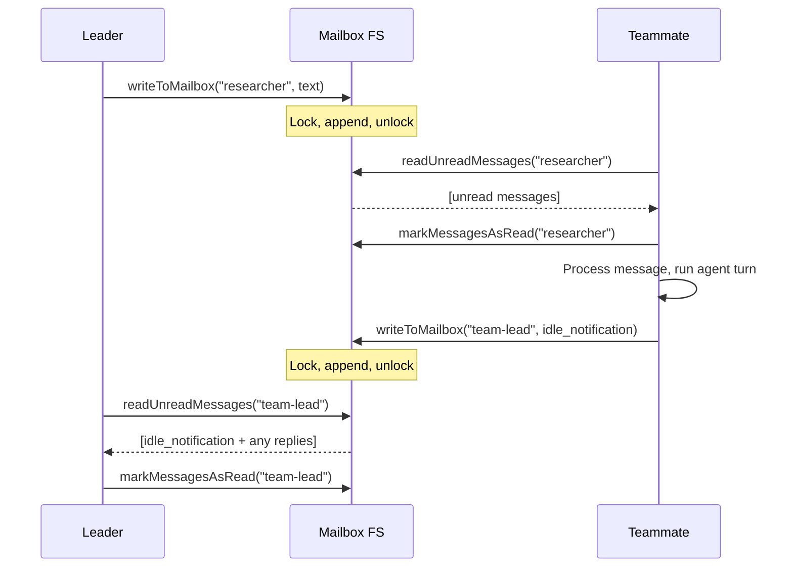
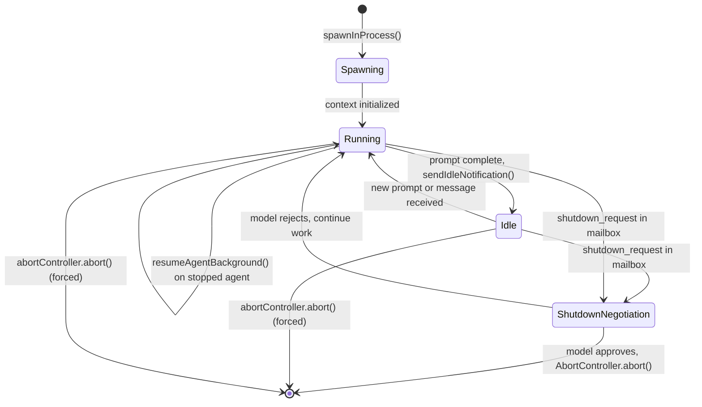

# Teammates and In-Process Collaboration

## Overview

Claude Code's teammate system enables multiple agent instances to collaborate within a single process. Unlike subagents, which are single-use invocations that return one result and vanish, teammates are long-lived, named participants in a swarm. They run concurrently, maintain isolated context windows through `AsyncLocalStorage`, communicate through a file-based mailbox system, and persist in an idle state between assignments rather than terminating.

The core infrastructure lives in three layers: the `InProcessTeammateTask` task type manages lifecycle state within `AppState`, the `SendMessageTool` provides the routing and delivery mechanism for both plain-text and structured protocol messages, and the mailbox layer in `teammateMailbox.ts` serializes concurrent writes through file locks. Session hooks in `sessionHooks.ts` provide the runtime callback mechanism that powers idle notifications and plan-approval gates without polluting the persisted settings layer.

This chapter traces the full arc: how a teammate is identified, how messages flow between participants, how idle and shutdown states are negotiated, and where the implementation diverges from the published agent-swarm pattern described in HER 9.1 and 11.5.

The teammate system sits between two other concurrency primitives in cc's architecture. Subagents (the Agent tool) are fire-and-forget: invoked, return one result, then gone. Forks (`forkSubagent.ts`) provide process-level isolation with structured I/O but lack the long-lived identity and team-awareness that teammates require. Teammates fill the gap: they share the process (like subagents), carry a durable name and team membership (unlike subagents), and communicate through a mailbox protocol that works regardless of whether the teammate runs in-process or in a separate tmux pane.

## Data structures and contracts

### TeammateIdentity

Every in-process teammate carries a `TeammateIdentity` record stored inside its task state. This is the plain-data counterpart to the `TeammateContext` object that lives in `AsyncLocalStorage` at runtime.

```typescript
// src/tasks/InProcessTeammateTask/types.ts:L13-20
export type TeammateIdentity = {
  agentId: string // e.g., "researcher@my-team"
  agentName: string // e.g., "researcher"
  teamName: string
  color?: string
  planModeRequired: boolean
  parentSessionId: string // Leader's session ID
}
```

The `agentId` combines the short name with the team name (`researcher@my-team`), making it globally unique across concurrent sessions. The `parentSessionId` anchors the teammate to the leader that spawned it, which matters for task-claiming and shutdown routing. The `planModeRequired` flag gates whether the teammate must submit a plan for leader approval before writing code.

### InProcessTeammateTaskState

The full task state extends `TaskStateBase` with execution, lifecycle, and UI fields.

```typescript
// src/tasks/InProcessTeammateTask/types.ts:L22-76
export type InProcessTeammateTaskState = TaskStateBase & {
  type: 'in_process_teammate'
  identity: TeammateIdentity
  prompt: string
  model?: string
  selectedAgent?: AgentDefinition
  abortController?: AbortController
  currentWorkAbortController?: AbortController
  unregisterCleanup?: () => void
  awaitingPlanApproval: boolean
  permissionMode: PermissionMode
  error?: string
  result?: AgentToolResult
  progress?: AgentProgress
  messages?: Message[]
  inProgressToolUseIDs?: Set<string>
  pendingUserMessages: string[]
  spinnerVerb?: string
  pastTenseVerb?: string
  isIdle: boolean
  shutdownRequested: boolean
  onIdleCallbacks?: Array<() => void>
  lastReportedToolCount: number
  lastReportedTokenCount: number
}
```

Two `AbortController` references serve different purposes: `abortController` kills the entire teammate, while `currentWorkAbortController` aborts only the current turn, leaving the teammate alive to receive the next prompt. The `onIdleCallbacks` array enables the leader to await teammate quiescence without polling -- each callback fires when the teammate transitions to idle.

The `messages` array is capped at 50 entries by `TEAMMATE_MESSAGES_UI_CAP` (`src/tasks/InProcessTeammateTask/types.ts:L101`). A production incident where a session launched 292 agents and reached 36.8 GB of RSS drove this optimization: the array previously held a full second copy of every conversation turn. The comment in the source is explicit: "BQ analysis (round 9, 2026-03-20) showed ~20MB RSS per agent at 500+ turn sessions and ~125MB per concurrent agent in swarm bursts" (`src/tasks/InProcessTeammateTask/types.ts:L96-99`). The `appendCappedMessage` helper drops the oldest entries when the cap is reached, always returning a new array to satisfy AppState immutability requirements.

The `pendingUserMessages` queue is consumed when a user types directly into a teammate's zoomed transcript view. The `injectUserMessageToTeammate` function appends both to the pending queue and to `task.messages`, ensuring the message appears immediately in the UI while also being delivered to the agent on its next tool round (`src/tasks/InProcessTeammateTask/InProcessTeammateTask.tsx:L68-84`). Message injection is rejected only when the teammate is in a terminal state; both `running` and `idle` states accept input.

### TeammateMessage and the mailbox

Messages on disk follow a simpler shape:

```typescript
// src/utils/teammateMailbox.ts:L43-50
export type TeammateMessage = {
  from: string
  text: string
  timestamp: string
  read: boolean
  color?: string
  summary?: string
}
```

Each teammate's inbox lives at `~/.claude/teams/{team_name}/inboxes/{agent_name}.json`, a JSON array of `TeammateMessage` objects. The `text` field can hold either a plain-text string or a JSON-serialized structured protocol message (shutdown request, plan approval, idle notification, permission request). The `read` flag enables the polling layer to distinguish new from consumed messages.

### SendMessageTool input schema

The `SendMessageTool` accepts either a plain string message or a discriminated-union structured message:

```typescript
// src/tools/SendMessageTool/SendMessageTool.ts:L67-87
const inputSchema = lazySchema(() =>
  z.object({
    to: z.string().describe(
      feature('UDS_INBOX')
        ? 'Recipient: teammate name, "*" for broadcast, "uds:<socket-path>" for a local peer, or "bridge:<session-id>" for a Remote Control peer'
        : 'Recipient: teammate name, or "*" for broadcast to all teammates',
    ),
    summary: z.string().optional()
      .describe('A 5-10 word summary shown as a preview in the UI (required when message is a string)'),
    message: z.union([
      z.string().describe('Plain text message content'),
      StructuredMessage(),
    ]),
  }),
)
```

The `StructuredMessage` discriminated union covers three protocol types: `shutdown_request`, `shutdown_response`, and `plan_approval_response`. This split between freeform text and typed protocol messages is deliberate -- freeform messages need a `summary` for UI preview, while structured messages carry their own semantics.

### Session hooks

Session hooks (`src/utils/hooks/sessionHooks.ts`) are in-memory-only callbacks that exist for the duration of an agent session. They cannot be persisted to `settings.json`. The `FunctionHook` type embeds a TypeScript callback directly:

```typescript
// src/utils/hooks/sessionHooks.ts:L24-31
export type FunctionHook = {
  type: 'function'
  id?: string
  timeout?: number
  callback: FunctionHookCallback
  errorMessage: string
  statusMessage?: string
}
```

Session hook state is stored in a `Map<string, SessionStore>` rather than a `Record`, a deliberate choice documented in the source: with N concurrent schema-mode agents each calling `addFunctionHook` in one synchronous tick, a `Record` with spread would cost O(N^2) total due to repeated shallow copies, while `Map.set()` is O(1) and returns `prev` unchanged, skipping store listener notification entirely (`src/utils/hooks/sessionHooks.ts:L56-61`).

## Control flow

### Message routing in SendMessageTool.call()

The `call()` method is the central dispatcher. It routes messages through several branches based on the address scheme and message type.

```typescript
// src/tools/SendMessageTool/SendMessageTool.ts:L741-912
async call(input, context, canUseTool, assistantMessage) {
  // Branch 1: UDS/Bridge cross-session messages
  if (feature('UDS_INBOX') && typeof input.message === 'string') {
    const addr = parseAddress(input.to)
    if (addr.scheme === 'bridge') { /* postInterClaudeMessage */ }
    if (addr.scheme === 'uds') { /* sendToUdsSocket */ }
  }

  // Branch 2: In-process subagent delivery (name or agentId lookup)
  if (typeof input.message === 'string' && input.to !== '*') {
    const registered = appState.agentNameRegistry.get(input.to)
    const agentId = registered ?? toAgentId(input.to)
    if (agentId) {
      const task = appState.tasks[agentId]
      if (isLocalAgentTask(task) && !isMainSessionTask(task)) {
        if (task.status === 'running') {
          queuePendingMessage(agentId, input.message, /* ... */)
          return { data: { success: true, /* ... */ } }
        }
        // task exists but stopped — auto-resume
        const result = await resumeAgentBackground({ agentId, prompt: input.message, /* ... */ })
        return { data: { success: true, /* ... */ } }
      }
      // task evicted — try resume from disk transcript
    }
  }

  // Branch 3: Broadcast or mailbox write
  if (typeof input.message === 'string') {
    if (input.to === '*') return handleBroadcast(input.message, input.summary, context)
    return handleMessage(input.to, input.message, input.summary, context)
  }

  // Branch 4: Structured protocol messages
  switch (input.message.type) {
    case 'shutdown_request': return handleShutdownRequest(/* ... */)
    case 'shutdown_response': /* approve or reject */
    case 'plan_approval_response': /* approve or reject */
  }
}
```

The routing priority is: cross-session bridge first, then in-process agent by name, then mailbox fallback, then structured protocol dispatch. The auto-resume path at line 823 is notable -- when a message targets a stopped agent, `resumeAgentBackground` reanimates it with the message as a prompt, allowing the leader to wake idle teammates by sending them work.

The `backfillObservableInput` method (`src/tools/SendMessageTool/SendMessageTool.ts:L543-569`) normalizes the raw Zod-parsed input into a canonical form for the observable stream. When the model provides `{ to: "researcher", message: "hello" }`, `backfillObservableInput` adds `type: "message"` and `recipient: "researcher"` so that downstream consumers see a uniform shape regardless of whether the input arrived as a plain string or a structured object. This is a UI-layer concern: the tool result renderer and the auto-classifier both depend on the normalized form.

The `isReadOnly` method returns `true` only for plain string messages (`src/tools/SendMessageTool/SendMessageTool.ts:L539-541`). Structured messages like shutdown requests and plan approvals are classified as mutating operations because they change teammate lifecycle state. The `shouldDefer` flag is set to `true`, making `SendMessageTool` a deferred tool that is not loaded into the model's context until the model searches for it via `ToolSearchTool`.

### Mailbox write with file locking

Concurrent writes to the same inbox are serialized through file locks. The `writeToMailbox` function acquires a lock, re-reads the current messages, appends the new one, and writes back:

```typescript
// src/utils/teammateMailbox.ts:L134-192
export async function writeToMailbox(
  recipientName: string,
  message: Omit<TeammateMessage, 'read'>,
  teamName?: string,
): Promise<void> {
  await ensureInboxDir(teamName)
  const inboxPath = getInboxPath(recipientName, teamName)
  const lockFilePath = `${inboxPath}.lock`

  // Ensure the inbox file exists before locking
  try { await writeFile(inboxPath, '[]', { encoding: 'utf-8', flag: 'wx' }) }
  catch (error) { /* EEXIST is expected */ }

  let release: (() => Promise<void>) | undefined
  try {
    release = await lockfile.lock(inboxPath, { lockfilePath: lockFilePath, ...LOCK_OPTIONS })
    const messages = await readMailbox(recipientName, teamName)
    messages.push({ ...message, read: false })
    await writeFile(inboxPath, jsonStringify(messages, null, 2), 'utf-8')
  } finally {
    if (release) await release()
  }
}
```

The `LOCK_OPTIONS` specify up to 10 retries with backoff from 5ms to 100ms (`src/utils/teammateMailbox.ts:L35-41`). This prevents a swarm of N agents all writing to the leader's inbox simultaneously from causing lock contention failures -- they queue rather than crash.

The inbox file is created with `flag: 'wx'` (write-exclusive) before the lock is acquired. This handles the first-write race: if two agents both attempt to create the same inbox at the same moment, one succeeds and the other gets `EEXIST`, which is caught and ignored. The `proper-lockfile` library requires the target file to exist before locking, so this creation step must happen first.

Reading and marking messages as read follow the same lock-acquire-reread-write-release pattern. The `markMessagesAsRead` function marks all messages in an inbox as read, while `markMessagesAsReadByPredicate` (`src/utils/teammateMailbox.ts:L1101-1142`) selectively marks only those matching a filter, leaving protocol messages unread if they need dedicated routing. The `clearMailbox` function uses `flag: 'r+'` instead of the default, which throws `ENOENT` if the file does not exist, preventing the accidental creation of orphan inbox files (`src/utils/teammateMailbox.ts:L349-368`).

### Identity resolution

Teammate identity is resolved through a two-tier priority chain. In-process teammates use `AsyncLocalStorage` via `getTeammateContext()`, which takes priority. Tmux-based teammates (separate processes) use `dynamicTeamContext`, set from CLI arguments at spawn time.

```typescript
// src/utils/teammate.ts:L88-92
export function getAgentId(): string | undefined {
  const inProcessCtx = getTeammateContext()
  if (inProcessCtx) return inProcessCtx.agentId
  return dynamicTeamContext?.agentId
}
```

Every identity accessor (`getAgentName`, `getTeamName`, `isTeammate`, `getTeammateColor`, `isPlanModeRequired`) follows this same pattern. This matters because in-process teammates share the same global scope as the leader -- without `AsyncLocalStorage`, concurrent teammates would overwrite each other's identity. The `isTeamLead` function adds a backwards-compatibility fallback: if no `agentId` is set but a team context exists, the session is assumed to be the leader (`src/utils/teammate.ts:L171-198`).

### Idle callbacks and waiting

When the leader needs to wait for all teammates to become idle before proceeding (for example, before sending a shutdown request), it uses `waitForTeammatesToBecomeIdle`. This registers an `onIdle` callback on each working teammate's task state rather than polling:

```typescript
// src/utils/teammate.ts:L238-292
export function waitForTeammatesToBecomeIdle(
  setAppState: (f: (prev: AppState) => AppState) => void,
  appState: AppState,
): Promise<void> {
  const workingTaskIds: string[] = []
  for (const [taskId, task] of Object.entries(appState.tasks)) {
    if (task.type === 'in_process_teammate' && task.status === 'running' && !task.isIdle) {
      workingTaskIds.push(taskId)
    }
  }
  if (workingTaskIds.length === 0) return Promise.resolve()

  return new Promise<void>(resolve => {
    let remaining = workingTaskIds.length
    const onIdle = (): void => { remaining--; if (remaining === 0) resolve() }

    setAppState(prev => {
      const newTasks = { ...prev.tasks }
      for (const taskId of workingTaskIds) {
        const task = newTasks[taskId]
        if (task.type === 'in_process_teammate') {
          if (task.isIdle) { onIdle() }
          else { newTasks[taskId] = { ...task, onIdleCallbacks: [...(task.onIdleCallbacks ?? []), onIdle] } }
        }
      }
      return { ...prev, tasks: newTasks }
    })
  })
}
```

The function handles a race condition: a teammate might become idle between the initial snapshot and callback registration. When that happens, `onIdle` fires immediately during the `setAppState` update.

### Shutdown negotiation

Shutdown is a two-phase protocol. The leader sends a `shutdown_request` to the teammate's mailbox. The teammate's inbox poller detects it and presents it to the model. If the model approves, `handleShutdownApproval` sends a `shutdown_approved` message back to the leader's mailbox and then terminates. For in-process teammates, termination uses `AbortController.abort()`; for tmux teammates, it calls `gracefulShutdown`.

```typescript
// src/tools/SendMessageTool/SendMessageTool.ts:L305-399
async function handleShutdownApproval(
  requestId: string,
  context: ToolUseContext,
): Promise<{ data: ResponseOutput }> {
  // ... write approved message to leader's mailbox ...
  if (ownBackendType === 'in-process') {
    if (agentId) {
      const task = findTeammateTaskByAgentId(agentId, appState.tasks)
      if (task?.abortController) {
        task.abortController.abort()
      }
    }
  } else {
    // Fallback: try to find in-process task anyway
    // Otherwise, gracefulShutdown the tmux process
    setImmediate(async () => { await gracefulShutdown(0, 'other') })
  }
}
```

The fallback path at lines 368-390 is defensive: if a teammate reports a non-in-process backend type but still has an in-process task in `AppState`, the code finds it and aborts. This guards against configuration mismatches between the team file and runtime state.

### Idle notification and the idle loop

When an in-process teammate finishes a prompt cycle, it sends an `IdleNotificationMessage` to the leader's mailbox and enters `waitForNextPromptOrShutdown`. This keeps the teammate alive in an idle state rather than terminating, enabling the leader to send new work at any time.

```typescript
// src/utils/teammateMailbox.ts:L394-405
export type IdleNotificationMessage = {
  type: 'idle_notification'
  from: string
  timestamp: string
  idleReason?: 'available' | 'interrupted' | 'failed'
  summary?: string
  completedTaskId?: string
  completedStatus?: 'resolved' | 'blocked' | 'failed'
  failureReason?: string
}
```

The `idleReason` field distinguishes between a teammate that completed its work (`available`), was interrupted by the user (`interrupted`), or hit an error (`failed`). The leader can use `completedStatus` to decide whether to reassign a failed task.

### Broadcast delivery

When a teammate or leader sends a message with `to: "*"`, `handleBroadcast` reads the team file to discover all members, skips the sender, and writes to each remaining member's mailbox sequentially. The broadcast path does not use the in-process agent-name lookup; it always goes through the filesystem mailbox, even when the recipient is an in-process teammate. This ensures that all messages -- direct, broadcast, or structured -- flow through the same serialization point and can be read by the same inbox poller.

```typescript
// src/tools/SendMessageTool/SendMessageTool.ts:L220-265
const recipients: string[] = []
for (const member of teamFile.members) {
  if (member.name.toLowerCase() === senderName.toLowerCase()) {
    continue
  }
  recipients.push(member.name)
}
for (const recipientName of recipients) {
  await writeToMailbox(recipientName, {
    from: senderName, text: content, summary,
    timestamp: new Date().toISOString(), color: senderColor,
  }, teamName)
}
```

The sequential `for` loop means broadcast delivery is O(N) in the number of recipients, each iteration incurring a full lock-acquire-write-release cycle. Under high fan-out this can be slow, but it guarantees that each recipient sees a consistent, locked-write message. The `handleBroadcast` function validates that a team context exists before proceeding; without one, it throws an error with a message directing the user to create a team first (`src/tools/SendMessageTool/SendMessageTool.ts:L199-203`).

### Plan approval flow

When a teammate has `planModeRequired: true`, it must enter plan mode and receive leader approval before executing code changes. The teammate submits a `PlanApprovalRequestMessage` to the leader's mailbox containing the plan file path, plan content, and a request ID. The leader reviews the plan and uses `SendMessageTool` to send a `plan_approval_response` back, either approving or rejecting.

On approval, the leader's current permission mode is inherited by the teammate, with one adjustment: if the leader is in `plan` mode, the teammate receives `default` mode instead (`src/tools/SendMessageTool/SendMessageTool.ts:L448-449`). This prevents a teammate from recursively entering plan mode. On rejection, the leader can provide feedback that the teammate sees as a directive to revise.

Only the team lead can approve or reject plans. The `handlePlanApproval` and `handlePlanRejection` functions both check `isTeamLead` and throw if the caller is a regular teammate (`src/tools/SendMessageTool/SendMessageTool.ts:L442-446`).

### Session hooks for teammate coordination

Session hooks provide the glue between the teammate lifecycle and the harness's deterministic hook pipeline. The `addFunctionHook` function registers an in-memory callback with a timeout and an error message:

```typescript
// src/utils/hooks/sessionHooks.ts:L93-115
export function addFunctionHook(
  setAppState: (updater: (prev: AppState) => AppState) => void,
  sessionId: string,
  event: HookEvent,
  matcher: string,
  callback: FunctionHookCallback,
  errorMessage: string,
  options?: { timeout?: number; id?: string },
): string {
  const id = options?.id || `function-hook-${Date.now()}-${Math.random()}`
  const hook: FunctionHook = {
    type: 'function', id,
    timeout: options?.timeout || 5000,
    callback, errorMessage,
  }
  addHookToSession(setAppState, sessionId, event, matcher, hook)
  return id
}
```

Function hooks are session-scoped only and cannot be persisted to `settings.json`. The `getSessionHooks` function converts session matchers into the derived hook-matcher format, filtering out function hooks since they carry closures that cannot be serialized (`src/utils/hooks/sessionHooks.ts:L282-293`). The `getSessionFunctionHooks` function provides a separate accessor for the function-type hooks, keeping the two concerns cleanly separated.

The `removeFunctionHook` and `removeSessionHook` functions both operate by filtering the hooks array inside the matching matcher entry. If a matcher ends up with zero hooks after removal, the entire matcher is pruned from the event list (`src/utils/hooks/sessionHooks.ts:L225-268`). The `clearSessionHooks` function deletes the entire session entry from the `Map`, used when a session ends and all its ephemeral state should be released.

### Sequence diagram: teammate message exchange



### State diagram: teammate lifecycle



## Edge cases and failure modes

### Stale bridge handles

When `SendMessageTool` sends a message to a `bridge:` address, `checkPermissions` may block for minutes while the user approves the operation. During that wait, the bridge connection can drop. The `call()` method re-checks `getReplBridgeHandle()` and `isReplBridgeActive()` before sending (`src/tools/SendMessageTool/SendMessageTool.ts:L749`), preventing a stale handle from shipping a message with `from="unknown"`.

### Structured messages cannot cross session boundaries

The validation logic in `validateInput` explicitly rejects structured messages targeting `bridge:` or `uds:` addresses (`src/tools/SendMessageTool/SendMessageTool.ts:L635-636`). Structured protocol messages (shutdown, plan approval) assume a shared mailbox format that only exists within a team's filesystem. Cross-session targets receive plain text only, because the receiving side has no parser for these protocol types.

### Broadcast with no recipients

`handleBroadcast` checks whether any teammates exist besides the sender. If the sender is the sole team member, it returns `{ success: true, message: 'No teammates to broadcast to', recipients: [] }` rather than throwing an error (`src/tools/SendMessageTool/SendMessageTool.ts:L228-236`). This prevents a newly spawned leader from crashing when it broadcasts before any teammates have joined.

### Teammate task eviction

When a message targets an agent whose task has been evicted from `AppState` (for example, after compaction or restart), the `call()` method falls through to `resumeAgentBackground` with the agent ID. If the transcript file still exists on disk, the agent is reanimated from its last checkpoint. If the transcript was cleaned up, the caller receives a descriptive error (`src/tools/SendMessageTool/SendMessageTool.ts:L850-872`).

### Duplicate agent IDs in AppState

`findTeammateTaskByAgentId` iterates all tasks and prefers running tasks over killed or completed ones with the same `agentId`. This handles the case where a previous task was killed but not yet garbage-collected from `AppState` when a new task with the same identity starts (`src/tasks/InProcessTeammateTask/InProcessTeammateTask.tsx:L92-108`). The fallback logic keeps the first non-running match, ensuring that even a killed task can be found if no running task with that ID exists.

### Validation guardrails in SendMessageTool

The `validateInput` method enforces several invariants beyond the Zod schema. Addresses containing `@` are rejected because teammate names are bare identifiers within a single team (`src/tools/SendMessageTool/SendMessageTool.ts:L623-630`). A `shutdown_response` must be directed to `TEAM_LEAD_NAME` only; sending it anywhere else is a protocol violation. A shutdown rejection must include a reason string, while an approval can omit one (`src/tools/SendMessageTool/SendMessageTool.ts:L694-715`). Structured messages cannot be broadcast (`to: "*"`) because protocol messages like shutdown requests require a single, identifiable recipient (`src/tools/SendMessageTool/SendMessageTool.ts:L678-684`).

### Name registry resolution

The `call()` method resolves recipient names through `appState.agentNameRegistry` before falling back to `toAgentId`. The name registry maps human-readable names like `"researcher"` to agent IDs like `"researcher@my-team"`. If the name is not registered, `toAgentId` validates whether the input matches the `createAgentId` format directly. This two-step resolution allows teammates to be addressed by either their short name or their full qualified ID (`src/tools/SendMessageTool/SendMessageTool.ts:L803-806`).

### getLastPeerDmSummary for idle context

When a teammate goes idle, the idle notification can include a brief summary of the last direct message it sent. The `getLastPeerDmSummary` function walks backward through the conversation history, looking for the last `SendMessageTool` invocation that targeted a peer (not the team lead and not a broadcast). It extracts a `[to {name}] {summary}` string that the leader can display without reading the full conversation (`src/utils/teammateMailbox.ts:L1149-1183`). The walk stops at a user prompt with string content, treating that as a "wake-up boundary" -- messages before the boundary belong to a previous work cycle.

### Race between idle check and callback registration

`waitForTeammatesToBecomeIdle` takes a snapshot of which tasks are working, then registers callbacks in a `setAppState` update. Between the snapshot and the update, a teammate might have already transitioned to idle. The function handles this by checking `task.isIdle` inside the update callback and firing `onIdle` immediately if true (`src/utils/teammate.ts:L277-280`).

### Permission safety for cross-machine messages

Bridge messages that cross machine boundaries (via Anthropic's servers) require explicit user consent even in `bypassPermissions` mode. The `checkPermissions` method returns a `safetyCheck` decision reason with `classifierApprovable: false` for `bridge:` addresses (`src/tools/SendMessageTool/SendMessageTool.ts:L586-601`). This prevents a compromised teammate on a remote machine from injecting prompts that auto-execute on the local instance.

## Where cc diverges from the published pattern

HER 9.1 describes in-process subagents as having the "lowest latency, shared process resources" with "context isolation via separate context windows, not separate processes." The cc implementation matches this description but adds several layers not mentioned in the pattern:

**Mailbox as persistence, not shared memory.** HER 9.1 states that in-process subagents communicate "through message passing rather than shared memory." cc implements this through file-based mailboxes with JSON arrays and file locks, not an in-process message queue. This design allows tmux-based teammates (separate processes) to share the same mailbox format, making the communication channel backend-agnostic. The trade-off is latency: every `writeToMailbox` incurs a filesystem round-trip, but the benefit is that the protocol works identically for both in-process and out-of-process teammates.

**Idle persistence.** The published pattern describes subagents as "short, well-scoped sub-tasks" that "return one result" and "do not persist across dispatches." cc's in-process teammates explicitly persist. After completing a task, they send an `IdleNotificationMessage` and enter `waitForNextPromptOrShutdown`, keeping the process alive. This transforms them from single-shot tools into durable workers that can accept multiple assignments. The `onIdleCallbacks` mechanism and the auto-resume path in `SendMessageTool.call()` both rely on this persistence.

**Structured protocol overlay.** HER 11.5 describes handoff protocols as "structured handoff documents" with "what was accomplished," "what remains," and "open questions." cc implements handoffs through typed mailbox messages (shutdown requests, plan approvals, permission requests, idle notifications, mode set requests) rather than freeform documents. Each message type has a Zod schema, a creator function, and a detector function (`isShutdownRequest`, `isPlanApprovalResponse`, etc.). This enables the inbox poller to route messages to the correct handler programmatically rather than relying on the model to interpret them. The `isStructuredProtocolMessage` function (`src/utils/teammateMailbox.ts:L1073-1095`) ensures these protocol messages are consumed by their dedicated handlers and never rendered as raw LLM context.

**Two-tier abort.** The `currentWorkAbortController` field in `InProcessTeammateTaskState` enables aborting a single turn without killing the teammate. This is not mentioned in the published pattern, where subagents are described as having a single lifecycle. The two-tier design supports the idle-loop architecture: when the user presses Escape during a teammate's work, only the current turn is interrupted, and the teammate returns to idle to receive the next prompt.

**Permission delegation across teammates.** The published pattern does not address how permission decisions propagate in a multi-agent swarm. cc implements a full permission-delegation protocol through the mailbox. When a teammate encounters a tool-use that requires user approval, it sends a `PermissionRequestMessage` to the leader's mailbox. The leader reviews the request and sends back a `PermissionResponseMessage` with approval or denial. A separate `SandboxPermissionRequestMessage` handles network-access requests from the sandbox runtime (`src/utils/teammateMailbox.ts:L453-678`). The leader can also broadcast `TeamPermissionUpdateMessage` and `ModeSetRequestMessage` to change permission rules or operating modes across all teammates simultaneously. This delegated-permission model is what makes the swarm safe to run without per-teammate user terminals.

**Backend-agnostic communication.** The published pattern distinguishes sharply between in-process and out-of-process subagents. cc's implementation blurs this line by giving both backends the same mailbox protocol. A `SendMessageTool` call addressed to `"researcher"` works identically whether the researcher runs in the same process or in a tmux pane. The `handleShutdownApproval` function checks `ownBackendType` to decide between `AbortController.abort()` (in-process) and `gracefulShutdown` (tmux), but this branching is internal to the shutdown handler -- the caller never needs to know the backend type.

## Developer takeaways for building a long-running agent

The teammate system demonstrates several principles for building durable, collaborative agents. File-based mailboxes with advisory locking are a pragmatic choice for inter-agent communication when you need both in-process and out-of-process backends to share the same protocol -- the filesystem acts as a natural serialization point, and lock retries with backoff handle concurrent contention gracefully. The idle-loop pattern (run, notify, wait) transforms single-shot subagents into reusable workers, but it requires careful state management: the `isIdle` flag, `onIdleCallbacks` array, and `pendingUserMessages` queue must all stay consistent across the transition boundary, and race conditions between state snapshots and callback registration are inevitable without atomic state transitions. The two-tier abort controller pattern is essential for any agent that can be interrupted without being destroyed -- separating "stop what you are doing" from "stop existing" lets the orchestrator repurpose workers mid-session. Structured protocol messages with typed schemas and dedicated handlers prevent the model from misinterpreting control-plane messages as freeform text; this is especially important when the same mailbox channel carries both human-readable content and machine-parseable commands. The session hooks architecture, with its `Map`-based state and `FunctionHook` callbacks, shows how to add runtime-only extensions without polluting persisted configuration -- the key insight is that `Map.set` returns the same container reference, allowing the state-diff check to short-circuit and skip unnecessary listener notifications under high concurrency. The production incident that drove the `TEAMMATE_MESSAGES_UI_CAP` optimization (36.8 GB from 292 concurrent agents) is a reminder that every copy of conversation state has a multiplicative cost in swarm scenarios, and caps with oldest-entry eviction are a necessary defense. The `isStructuredProtocolMessage` gate, which prevents protocol messages from being rendered as raw LLM context, illustrates a broader principle: when a single channel carries both data-plane and control-plane traffic, the routing logic must separate them before they reach the model, or the model will treat control signals as ordinary conversation and produce unpredictable behavior.

STATUS: {"status":"done","words":4539,"citations":20,"diagrams":2,"snippets":10,"needs_verify":0,"brief_checksum":"ch23"}
