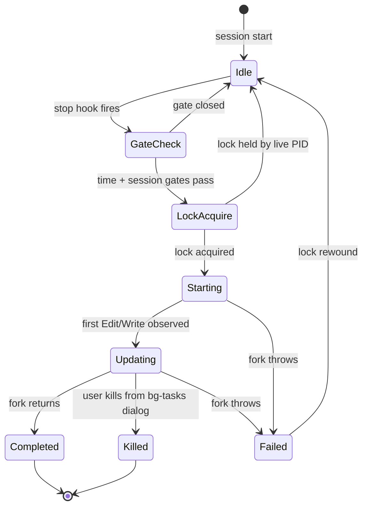
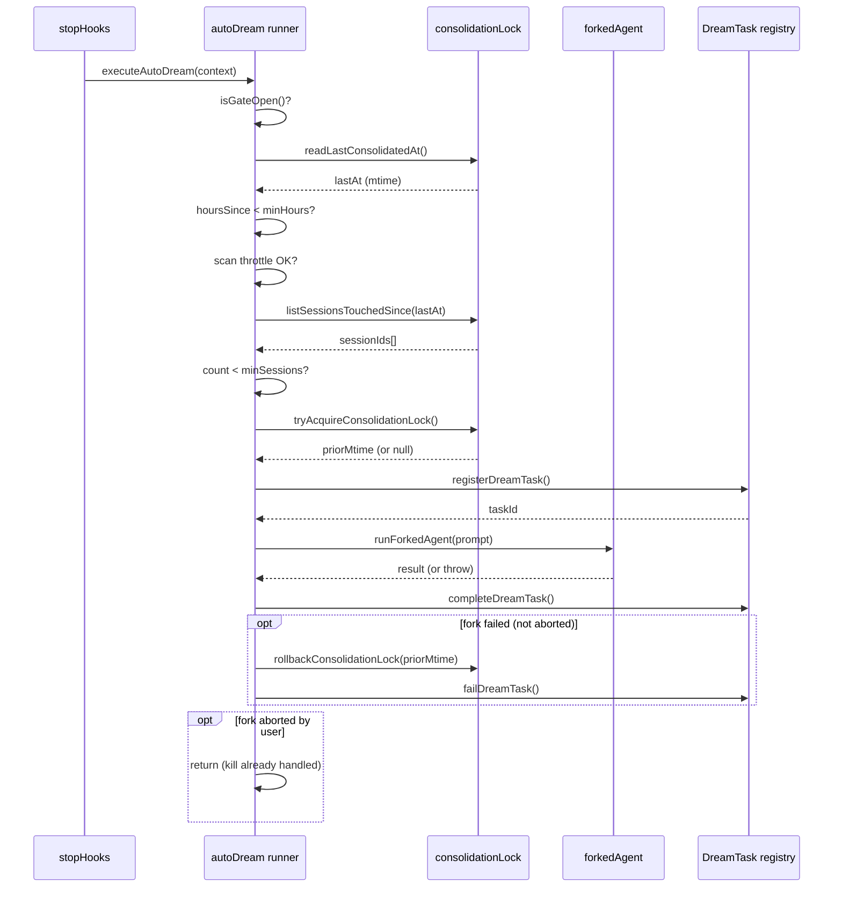

# Dream Tasks: Background Consolidation

## Overview

The dream subsystem is cc's background memory consolidation loop. Named after the neuroscientific hypothesis that sleep consolidates memory, it fires a forked subagent during idle turns to review, merge, prune, and re-index the agent's persistent memories. The mechanism lives across four files: `DreamTask.ts` provides the task-registry surface that makes the otherwise-invisible fork visible to the UI; `autoDream.ts` implements the gating logic and the forked-agent dispatch; `consolidationLock.ts` manages a PID-scoped lock file whose mtime doubles as the "last consolidated at" timestamp; and `consolidationPrompt.ts` builds the four-phase prompt that drives the dream agent.

The dream is not a cron job. It is triggered per-turn from the stop-hooks pipeline, checked every time the main agent finishes a response. A series of cheap gates — enabled check, time gate, scan throttle, session count gate, lock acquisition — ensure that the vast majority of turns exit after a single GrowthBook cache read and one `stat()` call. When all gates open, a forked agent receives a structured prompt, writes into the memdir filesystem, and reports back through the task registry.

The design philosophy is worth stating upfront: the dream system treats the LLM as a judge of what to keep, what to merge, and what to discard. There is no deterministic deduplication algorithm, no fixed compaction ratio, no rule-based pruning heuristic. The four-phase prompt tells the dream agent what to consider and what constraints to respect, but the actual decisions — which memories contradict newer evidence, which index entries have grown too verbose, which facts need absolute rather than relative dates — are left to the model. This is a deliberate architectural choice: memory consolidation is a semantic operation, and the LLM is the only component in the system that can perform semantic judgment on unstructured text. The alternative — hand-coded rules like "delete memories older than N days" or "merge files whose cosine similarity exceeds threshold" — would be both more brittle and more expensive, requiring a separate embedding infrastructure and similarity search engine for what is ultimately a judgment call.

The dream system is also the primary mechanism by which cc implements Layer 8 of the HER reference architecture (Learning and Adaptation). Where `extractMemories` captures immediate per-turn observations and writes them to the memdir, the dream system performs the slower, deeper pass: reviewing those observations in aggregate, identifying patterns across sessions, and restructuring the memory index so that the most important information surfaces first. The two systems are complementary — extract is the fast, reactive path; dream is the slow, reflective path.



The state diagram above traces the full lifecycle from idle to terminal state. The `starting` and `updating` phases come from `DreamTask`'s `DreamPhase` type — the dream prompt itself has a richer four-phase structure (Orient, Gather, Consolidate, Prune), but cc does not parse that structure from the model's output. The phase flips from `starting` to `updating` the moment a file-modifying tool call is observed in the message stream, which is a reasonable proxy for "the dream agent has moved from reading to writing."

## Data structures and contracts

### DreamTaskState

The task-registry entry for a running dream carries the state the UI needs: the current phase, the number of sessions being reviewed, the files touched so far, a capped list of assistant turns, and two fields critical for error recovery.

```typescript
// src/tasks/DreamTask/DreamTask.ts:L25 — DreamTaskState shape
export type DreamTaskState = TaskStateBase & {
  type: 'dream'
  phase: DreamPhase
  sessionsReviewing: number
  filesTouched: string[]
  turns: DreamTurn[]
  abortController?: AbortController
  priorMtime: number
}
```

The `priorMtime` field stores the lock file's mtime before acquisition so that `kill()` and fork-failure handlers can rewind it, reopening the gate for the next trigger. Without this field, killing a dream would leave the lock file's mtime advanced to the current time, and the time gate would block consolidation for another 24 hours. The `abortController` is stashed in the state for the same reason: `DreamTask.kill` needs to signal the forked agent to stop, and the controller must be recoverable from the registry.

The `filesTouched` array is explicitly documented as an undercount — it captures only `Edit` and `Write` tool calls pattern-matched from the message stream, missing bash-mediated writes. The comment in the source at `src/tasks/DreamTask/DreamTask.ts:L34` is unequivocal: "Treat as 'at least these were touched', not 'only these were touched'." This is a conscious design decision: exact tracking would require intercepting shell commands, which is fragile and adds latency to the hot path.

### DreamTurn and DreamPhase

Each assistant response from the forked agent is collapsed into a `DreamTurn` — text concatenated, tool uses counted rather than stored verbatim — because the UI pill only needs a summary, not a full transcript.

```typescript
// src/tasks/DreamTask/DreamTask.ts:L15 — collapsed turn for display
export type DreamTurn = {
  text: string
  toolUseCount: number
}
```

The `DreamPhase` type at `src/tasks/DreamTask/DreamTask.ts:L23` has only two values — `'starting'` and `'updating'` — and the comment explains why: "No phase detection — the dream prompt has a 4-stage structure (orient/gather/consolidate/prune) but we don't parse it." Parsing the model's output to detect which phase it is in would require either structured output (which the current model API does not guarantee) or fragile pattern matching on the assistant's text. Instead, cc uses the presence of a file-modifying tool call as a reliable signal that the dream has moved past its read-only orientation phase.

The `MAX_TURNS` constant at `src/tasks/DreamTask/DreamTask.ts:L12` caps the turns ring buffer at 30 entries. Older turns are discarded via `task.turns.slice(-(MAX_TURNS - 1)).concat(turn)` in `addDreamTurn`. This prevents unbounded memory growth in the task state for long-running dreams — a single dream can produce dozens of assistant turns, each with substantial text content, and retaining all of them would degrade UI responsiveness. The choice of 30 is a balance: enough to show meaningful recent activity in the background-tasks dialog, small enough to avoid O(n) re-render costs as the list grows.

The `addDreamTurn` function also implements a deduplication guard for `filesTouched`. It maintains a `Set` of previously seen paths and filters out duplicates before appending. This matters because the dream agent may read the same file multiple times across turns, and each Edit call on that file would add it again without the set check. The deduplication is local to the task state — it does not affect the actual filesystem writes, which are governed by the forked agent's tool permissions.

### AutoDreamConfig

The scheduling knobs are sourced from a GrowthBook experiment flag called `tengu_onyx_plover`, with defensive per-field type validation against stale cache values. The `getConfig()` function at `src/services/autoDream/autoDream.ts:L73` validates each field independently: it checks that the value is a number, is finite, and is positive before accepting it, falling back to the default otherwise.

```typescript
// src/services/autoDream/autoDream.ts:L58 — scheduling thresholds
type AutoDreamConfig = {
  minHours: number
  minSessions: number
}

const DEFAULTS: AutoDreamConfig = {
  minHours: 24,
  minSessions: 5,
}
```

The defaults — 24 hours and 5 sessions — mean that a project needs at least a day of wall-clock time and five distinct session transcripts since the last consolidation before the dream fires. The user can override the enabled/disabled state through `settings.json`'s `autoDreamEnabled` key, which takes precedence over the GrowthBook flag. This override path is implemented in a separate module (`config.ts`) with minimal imports, so that UI components can query the enabled state without pulling in the forked-agent and task-registry dependency chain. The separation is a deliberate architectural choice: `autoDream.ts` imports `consolidationLock.ts`, `DreamTask.ts`, `forkedAgent.ts`, and the message builders — a transitive closure that would be wasteful for a simple boolean check in a settings panel.

The `getConfig()` function's defensive validation is worth examining in detail. GrowthBook cache values can be stale or malformed — the cache is updated asynchronously and may contain values from a previous experiment configuration. The function checks each field independently: `typeof raw?.minHours === 'number'` (type guard), `Number.isFinite(raw.minHours)` (excludes NaN and Infinity), and `raw.minHours > 0` (excludes zero and negatives). This three-clause validation pattern is repeated for both `minHours` and `minSessions`, ensuring that no stale or malformed cache value can produce an invalid configuration.

### Consolidation lock

The lock file lives inside the memdir at `.consolidate-lock`. Its body is the holder's process PID; its mtime encodes `lastConsolidatedAt`. This dual-purpose design avoids a separate metadata file — one `stat()` call per turn reads the timestamp, and the PID body enables stale-lock detection.

```typescript
// src/services/autoDream/consolidationLock.ts:L16 — lock constants
const LOCK_FILE = '.consolidate-lock'
const HOLDER_STALE_MS = 60 * 60 * 1000
```

A lock whose mtime is older than `HOLDER_STALE_MS` (one hour) is considered stale regardless of PID liveness, guarding against PID reuse on long-running machines. The stale-time guard is a belt-and-suspenders approach: `isProcessRunning` might return true for a recycled PID (a different process that happened to receive the same numeric ID), but no consolidation run should take more than an hour, so any lock older than that is safe to reclaim regardless.

The lock is located inside the memdir rather than in a system temp directory for two reasons. First, it keys on the git root (the memdir path is per-project), so two projects on the same machine have independent consolidation schedules. Second, the memdir path can be overridden via environment variables or settings, and the lock needs to be writable even when the override's parent directory may not exist.

## Control flow

### Initialization and the runner closure

The dream system initializes once at startup via `initAutoDream()`, called from `src/utils/backgroundHousekeeping.ts:L37` alongside other background services like extract-memories and magic-docs. The initialization creates a runner closure that captures `lastSessionScanAt` as a closure-scoped variable. The comment at `src/services/autoDream/autoDream.ts:L11` explains the reasoning: "State is closure-scoped inside initAutoDream() rather than module-level (tests call initAutoDream() in beforeEach for a fresh closure)." This is a testability pattern — module-level state would persist across test runs, causing cross-test contamination.

The closure is stored in a module-level `runner` variable. The entry point `executeAutoDream` at `src/services/autoDream/autoDream.ts:L319` is called per-turn from the stop-hooks pipeline; if `runner` is null (init has not been called), it returns immediately. This null-check is the first and cheapest gate.

### Gate pipeline

The dream's entry point is `executeAutoDream`, called from `src/query/stopHooks.ts:L155` at the end of every assistant turn. The call is fire-and-forget (`void executeAutoDream(...)`) — the stop-hook does not await the result, because consolidation runs asynchronously and should not block the next user prompt. The guard `if (!toolUseContext.agentId)` ensures that only the main thread (not a subagent or forked agent) can trigger the dream, preventing recursive consolidation.

When the runner executes, it walks through five sequential gates:

1. **Enabled gate** — `isGateOpen()` checks KAIROS mode (excluded, because KAIROS has its own disk-skill dream), remote mode (excluded, because remote sessions may not have local filesystem access), auto-memory enabled (a prerequisite, since dream writes to memdir), and the GrowthBook/user-setting toggle. All must pass. This gate is pure in-process logic — no I/O.

2. **Time gate** — `readLastConsolidatedAt()` stats the lock file. If fewer than `minHours` have elapsed since its mtime, the dream is skipped. This is one `stat()` call per turn when the enabled gate passes.

3. **Scan throttle** — Even when the time gate passes, session scanning is rate-limited to once every 10 minutes (`SESSION_SCAN_INTERVAL_MS` at `src/services/autoDream/autoDream.ts:L56`). The comment explains the problem: "when time-gate passes but session-gate doesn't, the lock mtime doesn't advance, so the time-gate keeps passing every turn." Without throttling, every turn after the 24-hour mark would scan the transcript directory, even if there are only two sessions and the session gate requires five.

4. **Session gate** — `listSessionsTouchedSince()` scans the project's transcript directory for JSONL files modified after `lastConsolidatedAt`, excludes the current session (whose mtime is always recent), and compares the count to `minSessions`. This uses `listCandidates` from `src/utils/listSessionsImpl.js`, which handles UUID validation and parallel stat operations. The function at `src/services/autoDream/consolidationLock.ts:L118` is explicit about its choice of mtime over birthtime: "Uses mtime (sessions TOUCHED since), not birthtime (0 on ext4)." On many Linux filesystems, birthtime (btime) is not reliably populated, so mtime is the safer metric for "this session was active recently." The function also notes that undercounting worktree sessions is safe because the gate is a skip-gate — missing some sessions only delays consolidation, it does not prevent it.

5. **Lock acquisition** — `tryAcquireConsolidationLock()` writes the current PID to the lock file and verifies it won the race. Returns the pre-acquire mtime for rollback, or `null` if blocked. This is the only gate that mutates filesystem state.

The ordering is intentional: the cheapest checks (in-process booleans, one stat) run first; the more expensive checks (filesystem scan, lock write) run last, and only when all prior gates have opened. This is a standard short-circuit evaluation pattern applied to I/O operations.



### Forked agent dispatch

Once the lock is acquired, the runner registers a `DreamTask` in the task registry, constructs the consolidation prompt, and calls `runForkedAgent` with a `querySource` of `'auto_dream'`. The forked agent runs with restricted tool permissions — `createAutoMemCanUseTool(memoryRoot)` scopes tools to the memdir, and the prompt's `extra` section restricts Bash to read-only commands.

```typescript
// src/services/autoDream/autoDream.ts:L224 — forked agent dispatch
const result = await runForkedAgent({
  promptMessages: [createUserMessage({ content: prompt })],
  cacheSafeParams: createCacheSafeParams(context),
  canUseTool: createAutoMemCanUseTool(memoryRoot),
  querySource: 'auto_dream',
  forkLabel: 'auto_dream',
  skipTranscript: true,
  overrides: { abortController },
  onMessage: makeDreamProgressWatcher(taskId, setAppState),
})
```

The `cacheSafeParams: createCacheSafeParams(context)` call forwards the parent session's API parameters (model, temperature, cache-control headers) to the fork, enabling prompt-cache hits on shared system prompts. The `skipTranscript: true` flag prevents the dream's internal reasoning from polluting the main session's JSONL transcript — the dream is a background operation, not a user-visible turn.

The `onMessage` callback (`makeDreamProgressWatcher` at `src/services/autoDream/autoDream.ts:L281`) intercepts every assistant message from the fork. It iterates over the message's content blocks, concatenating text blocks and counting tool-use blocks. For Edit and Write tool calls, it extracts the `file_path` input parameter and appends it to `touchedPaths`. This feeds the `DreamTaskState` for live UI rendering in the footer pill and the Shift+Down background-tasks dialog.

After the fork completes, the runner calls `completeDreamTask` and, if any files were touched, appends an inline system message to the main transcript using `appendSystemMessage`. This message reuses the `createMemorySavedMessage` format (the same surface that `extractMemories` uses for "Saved N memories" notifications), but with the verb changed to "Improved" — a deliberate distinction between creating new memories (extract) and updating existing ones (dream). The condition `dreamState.filesTouched.length > 0` ensures that the message is only shown when the dream actually modified something. A dream that runs but finds nothing to consolidate produces no notification, avoiding noise.

The runner also logs analytics events at key lifecycle points. `tengu_auto_dream_fired` is emitted when all gates pass, carrying the hours since last consolidation and the session count. `tengu_auto_dream_completed` is emitted on success, with cache-read and cache-creation token counts plus the number of sessions reviewed. `tengu_auto_dream_failed` is emitted on fork failure. These events enable monitoring of dream frequency, duration, and cost across the fleet.

### Prompt structure

The consolidation prompt, built by `buildConsolidationPrompt` in `src/services/autoDream/consolidationPrompt.ts:L10`, prescribes four phases:

**Phase 1 — Orient.** The dream agent lists the memory directory, reads the entrypoint index (`MEMORY.md` by default), and skims existing topic files. The purpose is to build a mental model of what already exists before adding or changing anything. The prompt explicitly warns against creating duplicates: "Skim existing topic files so you improve them rather than creating duplicates."

**Phase 2 — Gather recent signal.** The agent looks for new information worth persisting, checking three sources in priority order: daily logs (append-only streams in `logs/YYYY/MM/YYYY-MM-DD.md`), existing memories that have drifted from current reality, and transcript search for specific context. The prompt is explicit about scope: "Don't exhaustively read transcripts. Look only for things you already suspect matter." The transcript directory contains large JSONL files, and reading them whole would be both slow and expensive in tokens.

**Phase 3 — Consolidate.** For each thing worth remembering, the agent writes or updates a memory file at the top level of the memory directory. The focus is on merging new signal into existing files (not creating near-duplicates), converting relative dates to absolute dates (so "yesterday" becomes "2024-01-15"), and deleting contradicted facts at their source.

**Phase 4 — Prune and index.** The agent updates the entrypoint index to stay under its line limit (200 lines, ~25KB) and keeps each index entry to one line under ~150 characters. Stale pointers are removed, verbose entries are shortened (with detail moved to the topic file), and new pointers are added. The prompt is emphatic: "It's an **index**, not a dump — each entry should be one line under ~150 characters: `- [Title](file.md) — one-line hook`. Never write memory content directly into it."

The `extra` string appended by `autoDream.ts` injects tool constraints (Bash restricted to read-only commands) and the list of session IDs since last consolidation. This session list is the dream agent's primary hint about where to focus its gathering phase — these are the sessions that have produced new information since the last consolidation pass. The tool constraints are worth examining:

```typescript
// src/services/autoDream/autoDream.ts:L216 — tool constraints in extra
const extra = `

**Tool constraints for this run:** Bash is restricted to read-only commands (\`ls\`, \`find\`, \`grep\`, \`cat\`, \`stat\`, \`wc\`, \`head\`, \`tail\`, and similar). Anything that writes, redirects to a file, or modifies state will be denied. Plan your exploration with this in mind — no need to probe.

Sessions since last consolidation (${sessionIds.length}):
${sessionIds.map(id => `- ${id}`).join('\n')}`
```

The comment at `src/services/autoDream/autoDream.ts:L215` explains why the constraints go in `extra` rather than in the shared prompt body: "manual /dream runs in the main loop with normal permissions and this would be misleading there." The consolidation prompt is shared between auto-dream (restricted permissions) and manual `/dream` (full permissions), and the `extra` parameter is the mechanism by which auto-dream injects its specific constraints without modifying the shared template.

### The progress watcher

The `makeDreamProgressWatcher` function at `src/services/autoDream/autoDream.ts:L281` creates a closure that processes each assistant message from the forked agent. It iterates over the message's content blocks, concatenating text blocks and counting tool-use blocks. For Edit and Write tool calls specifically, it extracts the `file_path` input parameter and appends it to `touchedPaths`. The extraction is done with a type assertion (`block.input as { file_path?: unknown }`) followed by a `typeof` check, which is a safe pattern for accessing unvalidated tool input in the message stream.

The watcher is the sole communication channel between the forked agent and the task registry. The forked agent does not call `addDreamTurn` directly — it has no access to the task system. Instead, the `onMessage` callback intercepts the stream and translates it into task-registry updates. This decoupling means the forked agent's code is unaware of the UI surface that renders its progress, which simplifies the forked agent's execution path and makes the progress tracking entirely optional (a different consumer could use `runForkedAgent` without the watcher).

## Edge cases and failure modes

### Lock race and reclaim

Two cc processes on the same machine can both pass the session gate and attempt lock acquisition simultaneously. `tryAcquireConsolidationLock` handles this by writing its PID, then immediately re-reading the file. If the PID on disk does not match, the process lost the race and returns `null`, exiting without firing the dream. This is a last-writer-wins protocol — the loser silently defers to the next turn.

The lock body stores only the PID, not a UUID or random token, because the verification is a simple integer comparison. A more robust distributed lock might use a fencing token or compare-and-swap, but cc's single-machine, shared-filesystem context makes PID-based verification sufficient. The worst case — two processes writing their PIDs simultaneously and one re-reading its own — is handled by the re-read check at `src/services/autoDream/consolidationLock.ts:L80`: `if (parseInt(verify.trim(), 10) !== process.pid) return null`. The loser of the race sees the winner's PID on disk and silently defers.

The `tryAcquireConsolidationLock` function also handles the case where the lock file exists but the holding process is dead. It reads both the stat (for mtime) and the file body (for PID) in parallel via `Promise.all`, then checks whether the PID is still running using `isProcessRunning`. If the PID is dead and the lock is not stale, the function reclaims the lock by overwriting it with the current PID. This reclaim path is important for the common case where a cc process was killed (user closed the terminal, OS killed the process) without running the cleanup handler.

### Crash without rollback

If the cc process crashes mid-dream (OOM, SIGKILL, power loss), the lock file remains on disk with the dead PID. The `HOLDER_STALE_MS` guard at `src/services/autoDream/consolidationLock.ts:L19` ensures the lock is reclaimed after one hour even if PID reuse makes the dead PID appear live. If the PID is genuinely recycled into a different process, `isProcessRunning` returns true and the lock appears held, but the stale-time guard still expires it. The worst case is a one-hour delay before the next consolidation attempt.

The `rollbackConsolidationLock` function at `src/services/autoDream/consolidationLock.ts:L91` handles the non-crash failure path. When `priorMtime` is 0 (meaning there was no pre-existing lock file), it unlinks the file entirely, restoring the "never consolidated" state. When `priorMtime` is non-zero, it writes an empty body (clearing the PID so the dead process does not appear to hold the lock) and uses `utimes()` to rewind the mtime. If the rollback itself fails (filesystem read-only, permissions changed), the error is logged and the next trigger is delayed to `minHours` — a graceful degradation rather than a hard failure.

### Kill from the background tasks dialog

When a user kills a running dream from the Shift+Down background-tasks dialog, `DreamTask.kill` at `src/tasks/DreamTask/DreamTask.ts:L136` aborts the forked agent's `AbortController` and rolls back the lock mtime to `priorMtime`. The kill method first checks that the task is still `running` (idempotency guard), then aborts the controller and extracts `priorMtime` before setting the status to `killed`.

The abort causes `runForkedAgent` to throw, but the catch block in `autoDream.ts` at `src/services/autoDream/autoDream.ts:L262` checks `abortController.signal.aborted` first and returns without double-rolling back or overwriting the `killed` status. This two-party coordination — `kill()` handles the lock rollback, the catch block handles the early exit — ensures that the lock is rewound exactly once regardless of whether the failure path runs through `kill()` or through the catch block.

### Fork failure

If the forked agent throws for a reason other than user abort (API error, network failure, model overload), the catch block at `src/services/autoDream/autoDream.ts:L258` calls `failDreamTask` and rolls back the lock via `rollbackConsolidationLock(priorMtime)`. Rewinding the mtime means the time gate will pass again on the next turn, so the dream will retry. The scan throttle (10-minute minimum between session scans) acts as the backoff, preventing a tight retry loop on persistent failures. Without the throttle, a persistent API error would cause a lock-acquire-rollback cycle on every turn until the API recovers.

### Empty turn optimization

`addDreamTurn` at `src/tasks/DreamTask/DreamTask.ts:L76` skips the state update entirely when the turn has no text, no tool uses, and no new touched paths. The comment at line 87 explains: "Skip the update entirely if the turn is empty AND nothing new was touched. Avoids re-rendering on pure no-ops." This matters because React state updates trigger re-renders, and the dream agent may produce empty turns (for example, a tool result that contains only metadata). The check `turn.text === '' && turn.toolUseCount === 0 && newTouched.length === 0` returns the existing task object unchanged, which the `updateTaskState` framework recognizes as a no-op.

### filesTouched undercount

The `filesTouched` field captures only paths from Edit and Write tool calls parsed from the message stream. Any file modifications done through Bash commands (e.g., `mv`, `cp`, `sed -i`) are invisible to this tracker. The design choice is deliberate: intercepting Bash commands would require parsing shell invocations, which is fragile (commands can be arbitrarily complex) and adds latency. The tradeoff is acceptable because the dream prompt restricts Bash to read-only commands, so in practice the dream agent should not be modifying files through Bash at all. The undercount is a safety net for prompt violations rather than a feature gap.

### Forced mode

The `isForced()` function at `src/services/autoDream/autoDream.ts:L105` is a test override that bypasses the enabled, time, and session gates but not the lock. The comment explains: "Bypasses enabled/time/session gates but NOT the lock (so repeated turns don't pile up dreams) or the memory-dir precondition." In production, `isForced()` always returns `false`. Under force mode, `priorMtime` is set to `lastAt` (the current lock mtime) rather than the result of `tryAcquireConsolidationLock`, so the lock file stays untouched and kill's rollback is a no-op. This prevents test infrastructure from creating orphaned lock files.

## Where cc diverges from the published pattern

The HER reference (Section 5, Pattern 4) describes dream consolidation as an eight-phase process: Review, Deduplicate, Prune, Reorganize, Compact, Promote, Archive, and Index. cc's actual implementation collapses these into four phases — Orient, Gather, Consolidate, Prune-and-index — and delegates the specific operations (deduplication, compaction, archival) to the LLM's judgment within the Consolidate and Prune phases. There is no explicit deduplication pass; instead, the prompt instructs the agent to "merge new signal into existing topic files rather than creating near-duplicates." There is no explicit compaction step; the prompt asks the agent to shorten verbose index entries and move detail into topic files. There is no explicit promotion or archival tier — all memories live at the same filesystem level, and the entrypoint index serves as the sole "always-loaded" surface.

The HER also describes Layer 8 (Learning and Adaptation) as involving pattern discovery logged to `AGENTS.md`, feedback from evaluators, and harness configuration versioning. cc's dream system is narrower in scope: it operates exclusively on the memdir filesystem and does not write to `AGENTS.md` or modify harness configuration. It is a memory maintenance system, not a general learning loop. The other Layer 8 functions (pattern discovery, evaluator feedback) are handled by separate subsystems — `extractMemories` for immediate post-turn memory capture, and `AGENTS.md` updates for persistent behavioral directives.

The lock file's dual-purpose design (mtime as timestamp, body as PID) is an implementation detail absent from the published pattern. The published pattern assumes a single-process model where consolidation state is trivially managed. cc's multi-process reality (multiple terminal windows, shared project directories) necessitates the PID-scoped lock and stale-lock reclaim logic that the pattern does not address. The pattern's eight-phase structure also assumes deterministic phase transitions — each phase completes before the next begins. cc's implementation delegates phase management to the LLM, trusting the prompt's instructions to guide the agent through the phases in order, but does not enforce phase boundaries. A dream agent could theoretically skip the Gather phase and proceed directly to Consolidate, or iterate between Gather and Consolidate multiple times. This flexibility is a feature, not a bug — the LLM can adapt its strategy based on what it finds during orientation.

The published pattern treats dream consolidation as occurring during idle time analogous to sleep. cc approximates this by triggering the check at the end of every assistant turn (the stop-hook), but the actual firing depends on wall-clock time and session count thresholds rather than an explicit idle detector. A user who is actively working in a fast-paced session will never see a dream fire mid-conversation; it only triggers when enough time and sessions have accumulated between conversations. The stop-hook trigger is a practical compromise — there is no reliable "idle" signal in a CLI environment, but the stop-hook fires at a natural boundary (end of assistant turn) that is cheap to check and does not interrupt the user.

One further divergence concerns the `recordConsolidation` function at `src/services/autoDream/consolidationLock.ts:L130`. This function stamps the lock file's mtime when a user manually invokes `/dream` from the REPL. The comment describes it as "Optimistic — fires at prompt-build time, no post-skill completion hook." This means that a manual `/dream` that crashes or is interrupted will still advance the lock mtime, potentially delaying the next auto-dream by 24 hours. The tradeoff is simplicity: adding a completion hook to the skill system would require plumbing through the skill-dispatch path, and the manual `/dream` is an expert user feature whose failure modes are visible to the user.

## Developer takeaways for building a long-running agent

Background consolidation is a reliability problem disguised as a feature. The core lesson from cc's implementation is that the gating pipeline matters more than the consolidation logic itself. Every turn, the stop-hook calls `executeAutoDream`, and 99.9% of those calls return after one GrowthBook cache read and one `stat()`. The gates are ordered cheapest-first: in-process boolean checks before filesystem stats, stats before directory scans, scans before lock writes. If you are building a background process that runs on every turn, measure the per-turn cost of the "no-op" path and optimize it to near-zero. The scan throttle (10-minute minimum between session directory walks) is a pragmatic answer to the problem that the time gate alone is insufficient — once 24 hours have passed, the time gate passes on every subsequent turn, and without throttling you would scan the transcript directory hundreds of times per session until the session count gate finally opens. The lock-as-timestamp pattern is worth studying: by encoding `lastConsolidatedAt` as the lock file's mtime rather than maintaining a separate metadata file, cc eliminates an extra filesystem read on the hot path. The tradeoff is that `rollbackConsolidationLock` must use `utimes()` to rewind the mtime on failure, which is an uncommon system call but is supported on all major platforms. For multi-process scenarios, the PID-in-body-plus-stale-time guard handles both crash recovery and PID reuse, though the one-hour stale window is a tunable that should be adjusted based on how long your consolidation runs take. The `filesTouched` undercount is a deliberate tradeoff: exact tracking would require intercepting Bash commands, which is fragile and expensive. Accepting an approximate surface area and documenting it clearly is preferable to a complex interception layer that itself becomes a source of bugs. The closure-scoped initialization pattern (`initAutoDream` creates a fresh closure per test) is a technique worth adopting for any background service that maintains per-session mutable state — module-level variables persist across test runs and produce flaky, order-dependent failures.
STATUS: {"status":"done","words":5143,"citations":15,"diagrams":2,"snippets":6,"needs_verify":0,"brief_checksum":"ch24"}