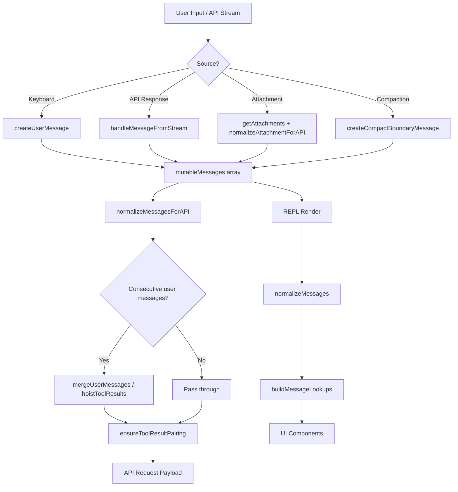

# Messages and the Conversation Model

## Overview

Every interaction with the cc agent flows through a single, unified message stream. The file `src/utils/messages.ts` defines the message types, factory functions, normalization logic, and API-preparation pipeline that turns a heterogeneous conversation history into a valid Anthropic Messages API request. At over 5,500 lines, this module is the largest utility in the codebase and the single most important data structure to understand when debugging conversation behavior, context management, or API errors.

The conversation model rests on a discriminated union of message types -- `user`, `assistant`, `system`, `attachment`, `progress`, and `tombstone` -- each carrying different payloads and obeying different compaction semantics. Attachments, defined in `src/utils/attachments.ts`, provide the secondary channel through which context enters the stream: file contents, hook responses, task status updates, and compaction markers are all injected as attachments before being normalized into user messages bound for the API.

This chapter walks through the type hierarchy, the lifecycle of a message from creation through streaming to API submission, the compaction boundary markers that preserve agent coherence over long sessions, and the edge cases that arise when tool-use pairing breaks or consecutive user messages must be merged for Bedrock compatibility.

## Data structures and contracts

### The message type union

The central type `Message` is a discriminated union imported from `../types/message.js`. Although the brief references `src/types/message.ts`, the actual type definitions live in a generated module outside the `src/types/` directory on disk; the consumer code in `src/utils/messages.ts` imports them at line 73. The key variants are:

- **UserMessage** -- carries `content: string | ContentBlockParam[]`, plus metadata flags `isMeta`, `isCompactSummary`, `isVisibleInTranscriptOnly`, `isVirtual`, and provenance via `origin?: MessageOrigin`.
- **AssistantMessage** -- wraps a `BetaMessage` from the Anthropic SDK, plus `apiError`, `error`, `errorDetails`, and `isApiErrorMessage` fields for error-path messages.
- **SystemMessage** -- a wide discriminated union itself, subtyped by `subtype` (`informational`, `compact_boundary`, `microcompact_boundary`, `api_error`, `permission_retry`, etc.).
- **AttachmentMessage** -- wraps an `Attachment` object (from `src/utils/attachments.ts`) alongside a `toolUseID` linking it to a specific tool invocation.
- **ProgressMessage** -- carries typed progress data for in-flight tool executions, keyed by `toolUseID` and `parentToolUseID`.
- **TombstoneMessage** -- a deletion directive; when processed by `handleMessageFromStream`, it removes a targeted message from the array rather than appending one.

```mermaid
classDiagram
    class Message {
        <<union>>
        +type: string
        +uuid: UUID
        +timestamp: string
    }
    class UserMessage {
        +type: user
        +message: {role, content}
        +isMeta?: true
        +isCompactSummary?: true
        +isVisibleInTranscriptOnly?: true
        +isVirtual?: true
        +toolUseResult?: unknown
        +origin?: MessageOrigin
    }
    class AssistantMessage {
        +type: assistant
        +message: BetaMessage
        +apiError?
        +error?
        +isApiErrorMessage?: true
        +isVirtual?: true
        +advisorModel?
    }
    class SystemMessage {
        +type: system
        +subtype: string
        +content: string
        +level: SystemMessageLevel
    }
    class AttachmentMessage {
        +type: attachment
        +attachment: Attachment
        +toolUseID: string
    }
    class ProgressMessage {
        +type: progress
        +data: Progress
        +toolUseID: string
        +parentToolUseID: string
    }
    class TombstoneMessage {
        +type: tombstone
        +message: Message
    }
    Message <|--- UserMessage
    Message <|--- AssistantMessage
    Message <|--- SystemMessage
    Message <|--- AttachmentMessage
    Message <|--- ProgressMessage
    Message <|--- TombstoneMessage

    class SystemCompactBoundaryMessage {
        +subtype: compact_boundary
        +compactMetadata: object
        +logicalParentUuid?: UUID
    }
    class SystemMicrocompactBoundaryMessage {
        +subtype: microcompact_boundary
        +microcompactMetadata: object
    }
    SystemMessage <|--- SystemCompactBoundaryMessage
    SystemMessage <|--- SystemMicrocompactBoundaryMessage
```

### UserMessage factory and the isMeta flag

The `createUserMessage` function at `src/utils/messages.ts:460` is the primary factory for user-turn messages. Its signature accepts a `content` parameter that can be a plain string or an array of `ContentBlockParam` objects, plus a set of optional metadata flags:

```typescript
// src/utils/messages.ts:460 — createUserMessage signature
export function createUserMessage({
  content,
  isMeta,
  isVisibleInTranscriptOnly,
  isVirtual,
  isCompactSummary,
  summarizeMetadata,
  toolUseResult,
  mcpMeta,
  uuid,
  timestamp,
  imagePasteIds,
  sourceToolAssistantUUID,
  permissionMode,
  origin,
}: {
  content: string | ContentBlockParam[]
  isMeta?: true
  isVisibleInTranscriptOnly?: true
  isVirtual?: true
  isCompactSummary?: true
  // ...
}): UserMessage
```

The `isMeta` flag is the most consequential of these. A meta message is invisible to the user in the REPL transcript but is sent to the model as part of the conversation. It is the mechanism by which the harness injects system reminders, file-change notifications, compaction nudges, and hook outputs without cluttering the visible chat. When `normalizeMessagesForAPI` merges consecutive user messages, the `isMeta` flag propagates carefully -- a merged message is only meta if all operands are meta. If any operand carries real user content, the result must not be flagged `isMeta`, so that `[id:]` tags get injected and the message is treated as user-visible by downstream systems.

### AssistantMessage and synthetic errors

The `createAssistantMessage` factory at `src/utils/messages.ts:411` wraps content blocks into the SDK's `BetaMessage` shape. Its sibling, `createAssistantAPIErrorMessage` at line 435, produces a special variant where `isApiErrorMessage` is set to `true` and the model is set to the sentinel `SYNTHETIC_MODEL` value (`<synthetic>`). These messages are never sent to the API; they exist to surface API errors within the REPL's message stream so the user can see what went wrong. During `normalizeMessagesForAPI`, synthetic error messages are filtered out, and their error information is used to strip problematic content blocks (oversized PDFs, images) from preceding user messages to prevent re-sending them on retry.

### The Attachment type

`src/utils/attachments.ts:440` defines `Attachment` as a large discriminated union spanning over 30 variants. Each variant corresponds to a distinct context-injection event:

```typescript
// src/utils/attachments.ts:440 — Attachment union (partial)
export type Attachment =
  | FileAttachment
  | CompactFileReferenceAttachment
  | PDFReferenceAttachment
  | AlreadyReadFileAttachment
  | { type: 'edited_text_file'; filename: string; snippet: string }
  | { type: 'directory'; path: string; content: string; displayPath: string }
  | { type: 'todo_reminder'; content: TodoList; itemCount: number }
  | { type: 'compaction_reminder' }
  | { type: 'context_efficiency' }
  | { type: 'date_change'; newDate: string }
  // ... 20+ more variants
```

The `normalizeAttachmentForAPI` function at `src/utils/messages.ts:3453` converts each attachment variant into one or more `UserMessage` objects, typically wrapped in `<system-reminder>` tags via `wrapMessagesInSystemReminder`. This is where attachments -- which are internal data structures -- become model-visible content. Different attachment types require different rendering strategies: file attachments become synthetic tool-use/tool-result pairs, hook outputs become meta user messages, and compaction reminders become gentle nudges about auto-compact behavior.

### Compact boundary messages

Compaction is the process of reducing conversation context size to stay within token limits. The message model implements compaction through two system message subtypes:

```typescript
// src/utils/messages.ts:4530 — Compact boundary factory
export function createCompactBoundaryMessage(
  trigger: 'manual' | 'auto',
  preTokens: number,
  lastPreCompactMessageUuid?: UUID,
  userContext?: string,
  messagesSummarized?: number,
): SystemCompactBoundaryMessage {
  return {
    type: 'system',
    subtype: 'compact_boundary',
    content: `Conversation compacted`,
    isMeta: false,
    timestamp: new Date().toISOString(),
    uuid: randomUUID(),
    level: 'info',
    compactMetadata: {
      trigger,
      preTokens,
      userContext,
      messagesSummarized,
    },
    ...(lastPreCompactMessageUuid && {
      logicalParentUuid: lastPreCompactMessageUuid,
    }),
  }
}
```

The `logicalParentUuid` field links the compact boundary to the last message before compaction occurred, enabling the UI to reconstruct the conversation timeline even when messages have been summarized away. The microcompact boundary, created by `createMicrocompactBoundaryMessage` at line 4557, carries additional metadata about which tool results were cleared and how many tokens were saved:

```typescript
// src/utils/messages.ts:4557 — Microcompact boundary factory
export function createMicrocompactBoundaryMessage(
  trigger: 'auto',
  preTokens: number,
  tokensSaved: number,
  compactedToolIds: string[],
  clearedAttachmentUUIDs: string[],
): SystemMicrocompactBoundaryMessage
```

The `getMessagesAfterCompactBoundary` function at line 4643 uses these boundaries to slice the message array: only messages from the last compact boundary onward are sent to the model. When the `HISTORY_SNIP` feature flag is active, the function also applies `projectSnippedView` to filter snipped (summarized) messages from the remaining window.

## Control flow

### Message lifecycle: from stream to API

A message traverses three major stages: creation (via factory or streaming), storage in the mutable messages array, and normalization for the API. The following diagram traces this lifecycle:



### Streaming: handleMessageFromStream

The `handleMessageFromStream` function at `src/utils/messages.ts:2930` is the bridge between the Anthropic streaming API and the internal message array. It receives `StreamEvent` objects (content_block_start, content_block_delta, content_block_stop, message_start, message_stop, message_delta) and dispatches them to the appropriate UI callbacks:

```typescript
// src/utils/messages.ts:2930 — Stream event dispatcher (abridged)
export function handleMessageFromStream(
  message: Message | TombstoneMessage | StreamEvent | RequestStartEvent,
  onMessage: (message: Message) => void,
  onUpdateLength: (newContent: string) => void,
  onSetStreamMode: (mode: SpinnerMode) => void,
  onStreamingToolUses: (f: (streamingToolUse: StreamingToolUse[]) => StreamingToolUse[]) => void,
  // ...
): void
```

For complete messages (type `assistant`, `user`, etc.), the function calls `onMessage` directly. Tombstone messages trigger `onTombstone` to remove a targeted message. Stream events update the spinner mode (thinking, responding, tool-input) and accumulate streaming tool-use input via `onStreamingToolUses`. Notably, `content_block_delta` events for `text_delta` and `input_json_delta` types call `onUpdateLength` with the delta text, driving the animated token counter in the REPL.

### Normalization for the API

`normalizeMessagesForAPI` at `src/utils/messages.ts:1989` is the most complex function in the module. It takes the full message array and produces a flat list of `UserMessage | AssistantMessage` objects suitable for the API. The pipeline runs these steps in order:

1. **Reorder attachments** -- `reorderAttachmentsForAPI` bubbles attachment messages up until they hit a tool result or assistant message, ensuring the model sees hook context alongside the relevant tool output.
2. **Filter virtual messages** -- messages with `isVirtual: true` are stripped; they exist for display only.
3. **Build error-to-strip map** -- synthetic API error messages (oversized files) are matched back to the user message that contained the problematic content, producing a `stripTargets` map.
4. **Filter and transform** -- progress messages, system messages (except `local_command`), and synthetic error messages are excluded. `local_command` system messages are converted to user messages.
5. **Strip unavailable tool references** -- when tool search is disabled, all `tool_reference` blocks are removed from tool_result content; when enabled, only references to disconnected MCP servers are stripped.
6. **Merge consecutive user messages** -- Bedrock does not support multiple user messages in a row, so adjacent user messages are merged via `mergeUserMessages` at line 2411.
7. **Ensure tool result pairing** -- `ensureToolResultPairing` at line 5133 validates that every `tool_use` block has a matching `tool_result` and vice versa, inserting synthetic placeholders or stripping orphans as needed.

The merge step is particularly subtle. The `mergeUserMessages` function must decide which UUID to preserve (the non-meta message's UUID, for stable `[id:]` tags), whether the merged result is still `isMeta`, and how to join adjacent text blocks. The `joinTextAtSeam` helper at line 2505 appends a `\n` to the last text block of the first message when both operands end and begin with text, preventing the concatenation artifact where `"2 + 2"` + `"3 + 3"` would otherwise reach the model as `"2 + 23 + 3"`.

### The isCompactSummary flag and summarizeMetadata

When compaction replaces a segment of conversation with a summary, the resulting user message carries `isCompactSummary?: true` and a `summarizeMetadata` object:

```typescript
// src/utils/messages.ts:494 — summarizeMetadata shape
summarizeMetadata?: {
  messagesSummarized: number
  userContext?: string
  direction?: PartialCompactDirection
}
```

This metadata tracks how many messages were collapsed, any user-provided context about the summary, and the direction of compaction (forward or backward). The `PartialCompactDirection` type, imported from `../types/message.js`, enables the compaction service to indicate whether the summary covers messages at the beginning of the conversation (backward compaction) or messages surrounding a specific point (forward compaction).

## Edge cases and failure modes

### Tool-use / tool-result pairing breaks

The Anthropic API requires every `tool_use` block in an assistant message to have a corresponding `tool_result` in a subsequent user message. When this pairing breaks -- due to session resume after a crash, compaction that removes the assistant but not the result, or a race condition in streaming -- the API returns a 400 error and the session deadlocks. The `ensureToolResultPairing` function at `src/utils/messages.ts:5133` is the defensive repair mechanism:

```typescript
// src/utils/messages.ts:5133 — Defensive pairing validation (abridged)
export function ensureToolResultPairing(
  messages: (UserMessage | AssistantMessage)[],
): (UserMessage | AssistantMessage)[] {
  const result: (UserMessage | AssistantMessage)[] = []
  let repaired = false
  const allSeenToolUseIds = new Set<string>()

  for (let i = 0; i < messages.length; i++) {
    const msg = messages[i]!
    // Forward: insert synthetic error tool_result for missing results
    // Reverse: strip orphaned tool_result referencing non-existent tool_use
    // ...
  }
```

In strict mode (when `getStrictToolResultPairing()` returns true, used for training data collection), any mismatch throws instead of repairing. This prevents tainted trajectories where a model response was conditioned on synthetic placeholder content from polluting the training pipeline.

### Consecutive user message merging

The Bedrock API does not accept two consecutive user-turn messages. The `mergeAdjacentUserMessages` function at line 2451 handles this by iterating the array and merging any adjacent pair. The `hoistToolResults` helper at line 2470 ensures that after merging, all `tool_result` blocks appear first in the content array -- the API requires tool results to follow their corresponding tool use, and mixing them with text blocks inside the same user message can cause ordering violations.

### Orphaned tool results on session resume

When a session is resumed from a JSONL transcript, the first message in the array might be a `tool_result` whose paired `tool_use` was in a message dropped by compaction. Sending this to the API produces the error `"messages.0.content: unexpected tool_use_id"`. The `ensureToolResultPairing` function detects this case: if a user message with `tool_result` blocks appears at the start of the array with no preceding assistant message, the orphaned tool results are stripped. If this empties the message entirely, a placeholder text block is inserted so the payload still starts with a user message.

### Synthetic messages and the SYNTHETIC_MESSAGES set

Several well-known message strings are tracked in the `SYNTHETIC_MESSAGES` set at line 302:

```typescript
// src/utils/messages.ts:302 — Synthetic message detection
export const SYNTHETIC_MESSAGES = new Set([
  INTERRUPT_MESSAGE,
  INTERRUPT_MESSAGE_FOR_TOOL_USE,
  CANCEL_MESSAGE,
  REJECT_MESSAGE,
  NO_RESPONSE_REQUESTED,
])
```

The `isSyntheticMessage` function at line 310 checks whether a message's first text block matches one of these sentinel values. Synthetic messages are real messages from the API's perspective, but they represent user actions (interruptions, rejections) rather than natural conversation turns. Downstream consumers use this check to avoid counting synthetic messages for analytics or context-budget calculations.

## Where cc diverges from the published pattern

The published Anthropic Messages API follows a strict user/assistant/user/assistant alternation. CC diverges from this pattern in several deliberate ways:

**Attachment injection as user messages.** The harness injects dozens of attachment types as `isMeta: true` user messages between natural turns. These include file-change notifications, hook responses, task status updates, and compaction reminders. The `normalizeMessagesForAPI` pipeline must then merge these with the adjacent real user messages, producing user turns that contain both tool results and meta content. The API never sees the attachment layer -- it is an internal abstraction that gets flattened before the request is sent.

**Compact boundary markers as in-band signals.** Rather than maintaining a separate metadata channel for compaction state, CC embeds compact boundaries as system messages in the message stream. The `SystemCompactBoundaryMessage` and `SystemMicrocompactBoundaryMessage` subtypes carry structured metadata (token counts, compacted tool IDs, trigger type) that downstream consumers query via `isCompactBoundaryMessage` and `findLastCompactBoundaryIndex`. This in-band approach means compaction state is preserved across session resume -- the JSONL transcript contains the boundary markers -- but it also means the boundary messages must be carefully filtered from the API payload since the API does not recognize system message types.

**Tool-reference blocks and the tool-search beta.** The `tool_reference` content block type is a beta feature that allows tool results to reference deferred tools. The constraint is that `tool_reference` blocks cannot be mixed with other block types inside a `tool_result`'s content array -- doing so produces a server ValueError. The `smooshIntoToolResult` function at line 2534 returns `null` when it encounters this situation, preventing the merge from creating an invalid payload. This is a divergence from the simpler "concatenate all blocks" approach that would work for text-only tool results.

**The `[id:]` tag system for snip referencing.** The `deriveShortMessageId` function at line 200 produces a 6-character base36 identifier from a message UUID. These tags are injected into API-bound messages as `[id:...]` annotations, enabling the `HISTORY_SNIP` compaction layer to reference specific messages by their short IDs in summarization prompts. This is a purely internal mechanism with no counterpart in the published API contract.

## Developer takeaways for building a long-running agent

The message model in cc demonstrates that a long-running agent cannot treat its conversation history as a simple append-only log. The conversation stream must support deletion (tombstone messages), mutation (merging adjacent turns for API compatibility), summarization (compact boundary markers with structured metadata), and layered filtering (snip projection for model-facing paths, full history for UI scrollback). Each of these operations must be idempotent and safe to re-run on every API call, because the message array is the single source of truth and the API payload is derived from it on every turn. The `isMeta` flag is the key design decision that makes this work: it separates harness-injected context from user-authored content, enabling the normalization pipeline to merge, strip, and reorder messages without losing the user's actual words. When building your own agent, adopt this two-tier approach early. Introduce a metadata flag on every message that distinguishes "this came from the human" from "this was injected by the harness," and make sure every pipeline stage that transforms the message array preserves this distinction. Without it, compaction and merging will silently corrupt user intent, and debugging the resulting API errors will be far more expensive than adding the flag upfront.

STATUS: {"status":"done","words":4587,"citations":14,"diagrams":2,"snippets":5,"needs_verify":0,"brief_checksum":"ch25"}