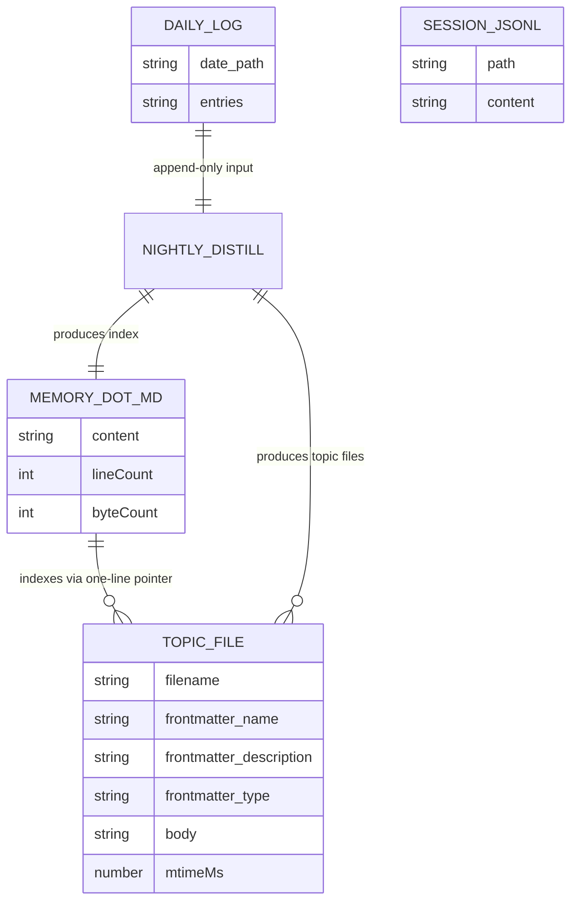
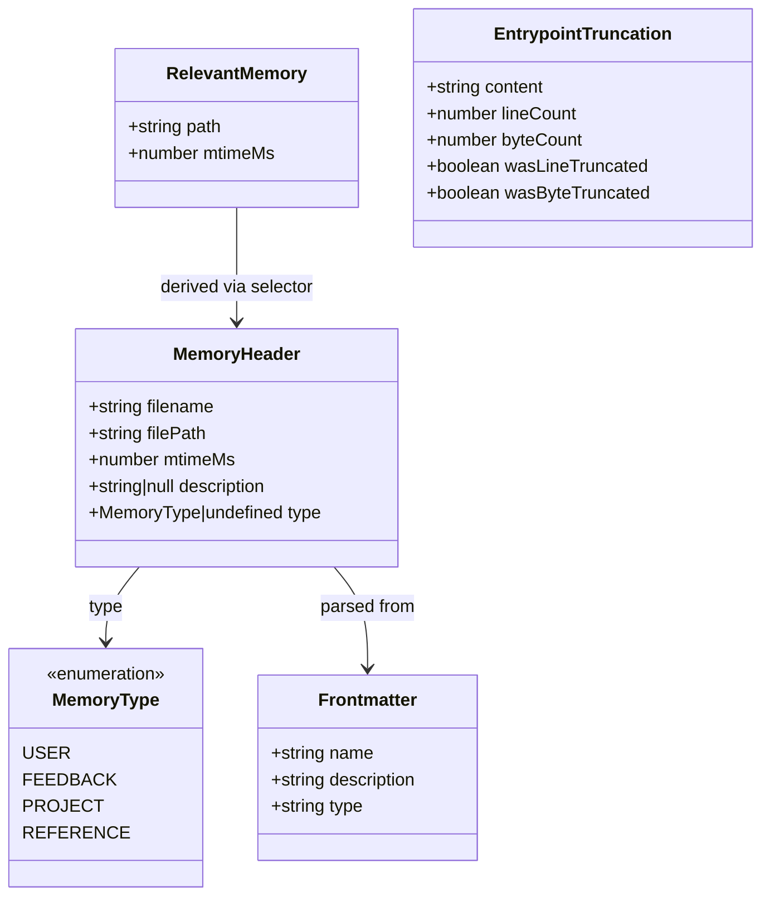
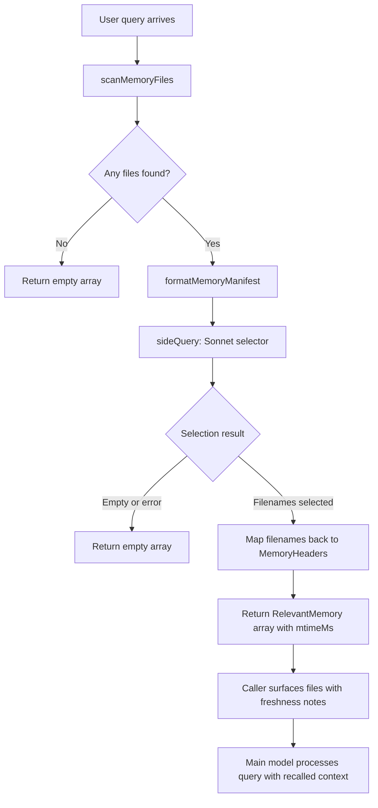

# Memdir: Tiered Memory on Disk

## Overview

A long-running agent that forgets everything between sessions is a glorified stateless function. CC's memdir system gives the agent a persistent, file-based memory that survives context resets, session boundaries, and even host restarts. The design follows the Tiered Memory pattern: a compact index (MEMORY.md) always in context as the hot tier, individual topic files loaded on demand as the warm tier, and full session transcripts on disk as the cold tier.

The entire system lives under `src/memdir/`, spanning six source files that divide responsibility along clear seams: path resolution and security validation (`paths.ts`), type taxonomy and prompt assembly (`memoryTypes.ts`, `memdir.ts`), on-disk scanning (`memoryScan.ts`), relevance retrieval (`findRelevantMemories.ts`), and age/staleness tracking (`memoryAge.ts`). This chapter walks through each layer, from the disk layout up through the Sonnet-based relevance selector, showing how CC balances context budget against recall fidelity.



## Data structures and contracts

### The entrypoint: MEMORY.md

MEMORY.md is the hot tier — a markdown index that is always loaded into the agent's context. Its size is aggressively capped at 200 lines and 25,000 bytes, because every line competes with the user's actual query for context window space.

```typescript
// src/memdir/memdir.ts:L34-38 — Entrypoint constants
export const ENTRYPOINT_NAME = 'MEMORY.md'
export const MAX_ENTRYPOINT_LINES = 200
// ~125 chars/line at 200 lines. At p97 today; catches long-line indexes that
// slip past the line cap (p100 observed: 197KB under 200 lines).
export const MAX_ENTRYPOINT_BYTES = 25_000
```

The byte cap exists because an adversarial or poorly structured index can pack 197 KB under 200 lines by using very long lines. The truncation function enforces both caps, line-truncating first (natural boundary) then byte-truncating at the last newline before the cap, and appending a diagnostic warning that names which cap fired.

### The MemoryHeader contract

Every memory file on disk is represented at scan time by a `MemoryHeader` — a lightweight descriptor that carries the file's path, modification time, frontmatter `description`, and parsed `type`. This header is the unit of exchange between the scan layer and the retrieval layer.

```typescript
// src/memdir/memoryScan.ts:L13-21 — MemoryHeader type
export type MemoryHeader = {
  filename: string
  filePath: string
  mtimeMs: number
  description: string | null
  type: MemoryType | undefined
}
```

The `type` field is `undefined` when the frontmatter is missing or contains an unrecognized value, rather than defaulting to a fallback. This intentional permissiveness means legacy memory files without a `type:` field keep working, and files with unknown types degrade gracefully rather than disappearing from the scan.

### Memory types and frontmatter

Memories are constrained to a closed four-type taxonomy. Content that is derivable from the current project state — code patterns, architecture, git history, file structure — is explicitly excluded from the memory system.

```typescript
// src/memdir/memoryTypes.ts:L14-21 — Type taxonomy
export const MEMORY_TYPES = [
  'user',
  'feedback',
  'project',
  'reference',
] as const

export type MemoryType = (typeof MEMORY_TYPES)[number]
```

Each type serves a distinct recall purpose:

- **user** — Information about the user's role, goals, and knowledge. Always private. Enables the agent to tailor explanations to the user's expertise level.
- **feedback** — Guidance about how to approach work, both corrections ("stop doing X") and confirmations ("yes, keep doing that"). The most important type for behavioral coherence across sessions. Feedback memories carry a `body_structure` convention: lead with the rule, then a **Why:** line (the reason) and a **How to apply:** line (when this guidance kicks in).
- **project** — Ongoing work context that is not derivable from code or git history: deadlines, incidents, decisions and their rationale. These memories decay fast, so the **Why** helps future instances judge whether the memory is still load-bearing. Relative dates in user messages are always converted to absolute dates when saving.
- **reference** — Pointers to external systems: dashboards, issue trackers, Slack channels. These are bookmarks, not content — the memory tells the agent where to look, not what it will find.

The frontmatter format that each memory file must follow is codified in a template:

```typescript
// src/memdir/memoryTypes.ts:L261-271 — Frontmatter template
export const MEMORY_FRONTMATTER_EXAMPLE: readonly string[] = [
  '```markdown',
  '---',
  'name: {{memory name}}',
  'description: {{one-line description — used to decide relevance in future conversations, so be specific}}',
  `type: {{${MEMORY_TYPES.join(', ')}}}`,
  '---',
  '',
  '{{memory content — for feedback/project types, structure as: rule/fact, then **Why:** and **How to apply:** lines}}',
  '```',
]
```

The `description` field is the lynchpin of the retrieval system. It is the text that the Sonnet-based selector reads when deciding whether a memory is relevant to a query. Vague descriptions ("useful info") produce false negatives; specific descriptions ("user prefers integration tests over mocks due to past migration incident") enable precise retrieval.



### The "What NOT to save" exclusion

The exclusion list is as important as the type taxonomy itself. It prevents the memory system from duplicating information that is already available through other channels:

```typescript
// src/memdir/memoryTypes.ts:L183-195 — Exclusion section
export const WHAT_NOT_TO_SAVE_SECTION: readonly string[] = [
  '## What NOT to save in memory',
  '',
  '- Code patterns, conventions, architecture, file paths, or project structure — these can be derived by reading the current project state.',
  '- Git history, recent changes, or who-changed-what — `git log` / `git blame` are authoritative.',
  '- Debugging solutions or fix recipes — the fix is in the code; the commit message has the context.',
  '- Anything already documented in CLAUDE.md files.',
  '- Ephemeral task details: in-progress work, temporary state, current conversation context.',
  '',
  'These exclusions apply even when the user explicitly asks you to save. If they ask you to save a PR list or activity summary, ask what was *surprising* or *non-obvious* about it — that is the part worth keeping.',
]
```

The last bullet is the key behavioral gate. Without it, the agent saves activity-log noise (PR lists, session summaries) that bloats MEMORY.md without improving recall. The instruction redirects the agent toward the *surprising* or *non-obvious* content — the kind of information that cannot be re-derived from code or git.

## Control flow

### Path resolution and security

Before any memory file can be read or written, the system must resolve the memory directory path. The resolution order for `getAutoMemPath()` is: environment variable override, settings.json override, then the default computed path.

```typescript
// src/memdir/paths.ts:L223-235 — Path resolution
export const getAutoMemPath = memoize(
  (): string => {
    const override = getAutoMemPathOverride() ?? getAutoMemPathSetting()
    if (override) {
      return override
    }
    const projectsDir = join(getMemoryBaseDir(), 'projects')
    return (
      join(projectsDir, sanitizePath(getAutoMemBase()), AUTO_MEM_DIRNAME) + sep
    ).normalize('NFC')
  },
  () => getProjectRoot(),
)
```

The default path shape is `~/.claude/projects/<sanitized-git-root>/memory/`, where `getAutoMemBase()` returns the canonical git repo root (so all worktrees of the same repo share one memory directory). The function is memoized on `projectRoot` because render-path callers fire per tool-use message per Messages re-render, and each cache miss would trigger four `parseSettingsFile` calls (realpathSync + readFileSync per settings source).

Path validation rejects dangerous inputs that could expand the filesystem trust boundary:

```typescript
// src/memdir/paths.ts:L109-150 — validateMemoryPath (core checks)
function validateMemoryPath(
  raw: string | undefined,
  expandTilde: boolean,
): string | undefined {
  if (!raw) return undefined
  let candidate = raw
  if (expandTilde && (candidate.startsWith('~/') || candidate.startsWith('~\\'))) {
    const rest = candidate.slice(2)
    const restNorm = normalize(rest || '.')
    if (restNorm === '.' || restNorm === '..') return undefined
    candidate = join(homedir(), rest)
  }
  const normalized = normalize(candidate).replace(/[/\\]+$/, '')
  if (
    !isAbsolute(normalized) ||
    normalized.length < 3 ||
    /^[A-Za-z]:$/.test(normalized) ||
    normalized.startsWith('\\\\') ||
    normalized.startsWith('//') ||
    normalized.includes('\0')
  ) {
    return undefined
  }
  return (normalized + sep).normalize('NFC')
}
```

This function is the security gate that prevents a malicious settings file from redirecting memory writes to sensitive directories like `~/.ssh`. Project-level settings (`.claude/settings.json` committed to the repo) are intentionally excluded from the override chain — only trusted sources (policy, local, user) are consulted. The trailing separator contract (`normalized + sep`) ensures `isAutoMemPath()` can do prefix matching without false positives on sibling directories.

### Prompt assembly: buildMemoryLines

The behavioral instructions that tell the agent how to use memory are assembled by `buildMemoryLines()`. This function produces the full prompt text — type definitions, exclusion rules, save instructions, access guidance, and the trust-before-recommend section — without the MEMORY.md content itself.

```typescript
// src/memdir/memdir.ts:L199-204 — buildMemoryLines signature
export function buildMemoryLines(
  displayName: string,
  memoryDir: string,
  extraGuidelines?: string[],
  skipIndex = false,
): string[] {
```

The `skipIndex` parameter controls whether the save instructions include the two-step process (write file + update MEMORY.md) or the simpler one-step process (write file only). When `skipIndex` is true, MEMORY.md is not maintained as a live index by the current session — this is used in the KAIROS daily-log mode, where a nightly distillation process produces the index instead.

The prompt includes the "Before recommending from memory" section, which is a hard-won lesson from eval iteration:

```typescript
// src/memdir/memoryTypes.ts:L240-256 — Trust-before-recommend section
export const TRUSTING_RECALL_SECTION: readonly string[] = [
  '## Before recommending from memory',
  '',
  'A memory that names a specific function, file, or flag is a claim that it existed *when the memory was written*. It may have been renamed, removed, or never merged. Before recommending it:',
  '',
  '- If the memory names a file path: check the file exists.',
  '- If the memory names a function or flag: grep for it.',
  '- If the user is about to act on your recommendation (not just asking about history), verify first.',
  '',
  '"The memory says X exists" is not the same as "X exists now."',
  '',
  'A memory that summarizes repo state (activity logs, architecture snapshots) is frozen in time. If the user asks about *recent* or *current* state, prefer `git log` or reading the code over recalling the snapshot.',
]
```

The header wording "Before recommending from memory" was selected through eval testing: the action cue ("before recommending") at the decision point tested better than the abstract "Trusting what you recall." The same body text with the abstract header went 0/3 in-place; the action-oriented header went 3/3.

### Loading the prompt: loadMemoryPrompt

`loadMemoryPrompt()` is the top-level entry point, called once per session via the `systemPromptSection` cache. It dispatches based on which memory systems are enabled.

```typescript
// src/memdir/memdir.ts:L419-438 — Dispatch logic
export async function loadMemoryPrompt(): Promise<string | null> {
  const autoEnabled = isAutoMemoryEnabled()
  const skipIndex = getFeatureValue_CACHED_MAY_BE_STALE('tengu_moth_copse', false)

  if (feature('KAIROS') && autoEnabled && getKairosActive()) {
    logMemoryDirCounts(getAutoMemPath(), {
      memory_type: 'auto' as AnalyticsMetadata_I_VERIFIED_THIS_IS_NOT_CODE_OR_FILEPATHS,
    })
    return buildAssistantDailyLogPrompt(skipIndex)
  }
```

The dispatch order is significant. KAIROS daily-log mode takes precedence over team memory because the append-only log paradigm does not compose with team sync, which expects a shared MEMORY.md that both sides read and write. If auto memory is disabled entirely, the function returns null and logs telemetry about why it was disabled (env var vs. settings).

Before returning, the function calls `ensureMemoryDirExists()` to create the memory directory if it does not exist. This is done preemptively so the agent never wastes a turn on `ls`/`mkdir -p` before writing its first memory.

### Scanning: scanMemoryFiles

When the agent needs to find relevant memories at query time, the first step is scanning the memory directory for `.md` files and extracting their frontmatter.

```typescript
// src/memdir/memoryScan.ts:L35-53 — scanMemoryFiles
export async function scanMemoryFiles(
  memoryDir: string,
  signal: AbortSignal,
): Promise<MemoryHeader[]> {
  try {
    const entries = await readdir(memoryDir, { recursive: true })
    const mdFiles = entries.filter(
      f => f.endsWith('.md') && basename(f) !== 'MEMORY.md',
    )
    const headerResults = await Promise.allSettled(
      mdFiles.map(async (relativePath): Promise<MemoryHeader> => {
        const filePath = join(memoryDir, relativePath)
        const { content, mtimeMs } = await readFileInRange(
          filePath, 0, FRONTMATTER_MAX_LINES, undefined, signal,
        )
        const { frontmatter } = parseFrontmatter(content, filePath)
        return {
          filename: relativePath,
          filePath,
          mtimeMs,
          description: frontmatter.description || null,
          type: parseMemoryType(frontmatter.type),
        }
      }),
    )
```

The scan reads only the first 30 lines of each file (`FRONTMATTER_MAX_LINES = 30`), not the full body. This is sufficient to extract the frontmatter while keeping I/O minimal. MEMORY.md is explicitly excluded from the scan because it is already loaded in the system prompt — including it would duplicate information and waste the relevance selector's budget.

The scan uses `Promise.allSettled` rather than `Promise.all` so that a single corrupted or unreadable file does not kill the entire scan. Failed reads are silently dropped. The results are sorted newest-first and capped at 200 files (`MAX_MEMORY_FILES`), which prevents unbounded memory directories from causing latency spikes.

### Retrieval: findRelevantMemories

Once the memory headers are scanned, the system must decide which ones are relevant to the current query. This is done by asking Sonnet to select up to five files from the manifest.

```typescript
// src/memdir/findRelevantMemories.ts:L18-24 — Selector system prompt
const SELECT_MEMORIES_SYSTEM_PROMPT = `You are selecting memories that will be useful to Claude Code as it processes a user's query. You will be given the user's query and a list of available memory files with their filenames and descriptions.

Return a list of filenames for the memories that will clearly be useful to Claude Code as it processes the user's query (up to 5). Only include memories that you are certain will be helpful based on their name and description.
- If you are unsure if a memory will be useful in processing the user's query, then do not include it in your list. Be selective and discerning.
- If there are no memories in the list that would clearly be useful, feel free to return an empty list.
- If a list of recently-used tools is provided, do not select memories that are usage reference or API documentation for those tools (Claude Code is already exercising them). DO still select memories containing warnings, gotchas, or known issues about those tools — active use is exactly when those matter.
`
```

The selector's bias toward precision over recall is deliberate. A false positive (irrelevant memory injected into context) wastes tokens and can mislead the main model. A false negative (relevant memory not surfaced) is recoverable because the MEMORY.md index is always in context — the agent can notice the pointer and request the file manually.



The `alreadySurfaced` parameter in `findRelevantMemories()` filters out paths that were shown in prior turns. This prevents the selector from re-picking the same files across multiple retrieval calls within a single session, ensuring the five-slot budget is spent on fresh candidates.

The selector uses structured output (JSON schema) to ensure parseable results:

```typescript
// src/memdir/findRelevantMemories.ts:L98-122 — sideQuery call
const result = await sideQuery({
  model: getDefaultSonnetModel(),
  system: SELECT_MEMORIES_SYSTEM_PROMPT,
  skipSystemPromptPrefix: true,
  messages: [
    {
      role: 'user',
      content: `Query: ${query}\n\nAvailable memories:\n${manifest}${toolsSection}`,
    },
  ],
  max_tokens: 256,
  output_format: {
    type: 'json_schema',
    schema: {
      type: 'object',
      properties: {
        selected_memories: { type: 'array', items: { type: 'string' } },
      },
      required: ['selected_memories'],
      additionalProperties: false,
    },
  },
  signal,
  querySource: 'memdir_relevance',
})
```

The `sideQuery` mechanism routes through a separate API call (not the main conversation), so the selection does not consume the main model's context budget. The `recentTools` section is appended to the manifest when the agent is actively using tools — it prevents the selector from surfacing reference documentation for tools the agent is already exercising, while still selecting memories about known issues or gotchas related to those tools.

### Age and staleness tracking

Memory files carry mtimeMs timestamps that are threaded through from the scan layer to the retrieval layer to the final presentation. The age system converts raw timestamps into human-readable strings that trigger staleness reasoning in the model.

```typescript
// src/memdir/memoryAge.ts:L6-20 — Age calculation
export function memoryAgeDays(mtimeMs: number): number {
  return Math.max(0, Math.floor((Date.now() - mtimeMs) / 86_400_000))
}

export function memoryAge(mtimeMs: number): string {
  const d = memoryAgeDays(mtimeMs)
  if (d === 0) return 'today'
  if (d === 1) return 'yesterday'
  return `${d} days ago`
}
```

The key insight is that models are poor at date arithmetic. A raw ISO timestamp like `2026-03-15T10:30:00Z` does not trigger staleness reasoning the way "26 days ago" does. The age string is a cognitive prompt, not a data field.

For memories older than one day, a staleness caveat is appended:

```typescript
// src/memdir/memoryAge.ts:L33-42 — Freshness text
export function memoryFreshnessText(mtimeMs: number): string {
  const d = memoryAgeDays(mtimeMs)
  if (d <= 1) return ''
  return (
    `This memory is ${d} days old. ` +
    `Memories are point-in-time observations, not live state — ` +
    `claims about code behavior or file:line citations may be outdated. ` +
    `Verify against current code before asserting as fact.`
  )
}
```

Freshness notes are suppressed for memories created today or yesterday. This is deliberate — warning on a memory the agent wrote an hour ago would be noise that trains the model to ignore all warnings. The staleness caveat targets the specific failure mode where a memory's `file:line` citation makes a stale claim sound authoritative rather than suspect.

### KAIROS: The daily-log mode

For long-lived assistant sessions, CC offers an alternative to the standard MEMORY.md index: the KAIROS daily-log mode. Instead of maintaining MEMORY.md as a live index, the agent appends timestamped bullets to a date-named log file.

```typescript
// src/memdir/memdir.ts:L327-348 — Daily-log prompt
function buildAssistantDailyLogPrompt(skipIndex = false): string {
  const memoryDir = getAutoMemPath()
  const logPathPattern = join(memoryDir, 'logs', 'YYYY', 'MM', 'YYYY-MM-DD.md')

  const lines: string[] = [
    '# auto memory',
    '',
    `You have a persistent, file-based memory system found at: \`${memoryDir}\``,
    '',
    "This session is long-lived. As you work, record anything worth remembering by **appending** to today's daily log file:",
    '',
    `\`${logPathPattern}\``,
    '',
    "Substitute today's date (from `currentDate` in your context) for `YYYY-MM-DD`. When the date rolls over mid-session, start appending to the new day's file.",
    '',
    'Write each entry as a short timestamped bullet. Create the file (and parent directories) on first write if it does not exist. Do not rewrite or reorganize the log — it is append-only. A separate nightly process distills these logs into `MEMORY.md` and topic files.',
```

The log path pattern uses `YYYY/MM/YYYY-MM-DD.md` rather than inlining today's literal date because the prompt is cached by `systemPromptSection('memory', ...)` and not invalidated on date change. The model derives the current date from the `date_change` attachment (appended at the tail on midnight rollover) rather than the user-context message — the latter is intentionally left stale to preserve the prompt cache prefix across midnight.

## Edge cases and failure modes

### Truncation of oversized indexes

When MEMORY.md exceeds 200 lines or 25,000 bytes, `truncateEntrypointContent()` cuts the content and appends a diagnostic warning. The warning is specific about which cap fired — line count, byte count, or both — because the remediation differs. Long lines need shorter descriptions; too many entries need consolidation into topic files. A generic "MEMORY.md was truncated" warning gives the agent no actionable signal.

### Scan failure tolerance

`scanMemoryFiles()` uses `Promise.allSettled` and wraps the entire function in a try/catch that returns an empty array on any top-level error (directory unreadable, permission denied, etc.). This means a corrupted memory directory silently degrades to "no memories found" rather than crashing the session. The agent still has MEMORY.md in context, so it can still operate — it just cannot retrieve individual topic files.

### Selector failure and abort handling

The Sonnet-based relevance selector can fail for network reasons, rate limits, or model errors. When this happens, `selectRelevantMemories()` logs the error and returns an empty selection. This is the correct fallback: the main model still has MEMORY.md and can request files manually. The `signal` parameter allows the caller to abort an in-flight selection (e.g., when the user sends a new message), and `signal.aborted` is checked before logging to avoid noise from intentional cancellations.

### Path traversal and security

`validateMemoryPath()` rejects relative paths, root paths, Windows drive roots, UNC paths, and null bytes. These checks prevent a malicious settings file from redirecting memory writes to sensitive directories. The trailing separator contract in `getAutoMemPath()` ensures `isAutoMemPath()` can do prefix matching: `~/.claude/projects/foo/memory/` will not match `~/.claude/projects/foo/memorybackup/`.

The `isAutoMemPath()` function has an important nuance: when `CLAUDE_COWORK_MEMORY_PATH_OVERRIDE` is set, `isAutoMemPath()` returns true for files in the override directory, but the filesystem write carve-out (which bypasses DANGEROUS_DIRECTORIES checks) is gated on `!hasAutoMemPathOverride()`. This means the override directory does not get elevated write permissions — it must be in a location the agent could already write to.

### The "ignore memory" instruction

The "When to access memories" section includes a specific anti-pattern bullet: if the user says to ignore or not use memory, the agent must proceed as if MEMORY.md were empty. It must not apply remembered facts, cite them, compare against them, or mention memory content at all. This addresses the observed failure mode where the model treats "ignore" as "acknowledge then override" — reading the code correctly but adding "not Y as noted in memory," which is still referencing the memory the user asked to ignore.

### Stale memories and file:line citations

The combination of `memoryFreshnessText()` and `TRUSTING_RECALL_SECTION` addresses a specific failure mode: stale memories that cite `file:line` locations. The citation makes the stale claim sound more authoritative, not less. The freshness text explicitly warns that "claims about code behavior or file:line citations may be outdated," and the trust section instructs the agent to verify file paths exist and grep for function names before recommending them.

## Where cc diverges from the published pattern

The HER describes Tiered Memory as three static tiers (hot index, warm topic files, cold transcripts). CC's implementation diverges in several ways:

**Dynamic relevance selection, not static tier promotion.** The published pattern implies that warm-tier files are loaded when the model "requests them." CC implements this as an automated Sonnet-based selector (`findRelevantMemories`) that runs before the main model sees the query. The model does not explicitly request files — a background process decides which files to surface. This reduces latency (no round-trip for the model to ask "show me X") at the cost of occasional false positives from the selector.

**Append-only daily logs as an alternative hot tier.** The KAIROS mode replaces the live MEMORY.md index with an append-only daily log. This is not described in the published pattern at all. The rationale is that long-lived assistant sessions generate memory faster than a curated index can absorb, and the append-only log avoids the complexity of concurrent read-modify-write on MEMORY.md. A nightly distillation process converts logs into the standard MEMORY.md + topic files structure.

**Four-type closed taxonomy with exclusion rules.** The published pattern does not constrain what can be stored in memory. CC's implementation enforces a closed type system (user, feedback, project, reference) and explicitly excludes derivable information (code patterns, git history, CLAUDE.md content). This prevents the memory system from becoming a redundant cache of information already available through other channels.

**Staleness tracking as a first-class concern.** The published pattern treats memory as a static store. CC threads `mtimeMs` through the entire pipeline and surfaces human-readable age strings plus freshness caveats. This addresses the specific failure mode of stale `file:line` citations that sound authoritative.

**Security-validated path resolution.** The published pattern does not address the security implications of a file-based memory system. CC's `validateMemoryPath()` function prevents path traversal attacks, and the separation between trusted and untrusted settings sources prevents a malicious repo from redirecting memory writes to sensitive directories.

## Developer takeaways for building a long-running agent

The memdir system demonstrates several principles that generalize to any agent requiring persistent memory. First, cap your hot tier aggressively — 200 lines and 25 KB is enough for a useful index, and any larger index will crowd out the user's query from the context window. Second, bias your relevance selector toward precision over recall: a false negative is recoverable (the agent can manually request a file), but a false positive wastes context tokens and can mislead the model. Third, thread timestamps through every layer and surface human-readable age strings — models cannot do date arithmetic, and "47 days ago" triggers staleness reasoning that a raw ISO timestamp does not. Fourth, exclude derivable information from the memory system entirely. If the agent can re-derive a fact from code, git, or CLAUDE.md, storing it in memory is waste that bloats the index and creates staleness risk. Fifth, make your memory directory idempotently creatable at prompt-load time so the agent never wastes a turn on mkdir. Sixth, handle scan and selector failures gracefully by returning empty results rather than errors — the agent can still function with just the hot-tier index. Seventh, use structured output (JSON schema) for your selector to ensure parseable results, and validate the selector's output against the known file list to prevent hallucinated filenames.
STATUS: {"status":"done","words":6158,"citations":12,"diagrams":3,"snippets":7,"needs_verify":0,"brief_checksum":"ch26"}