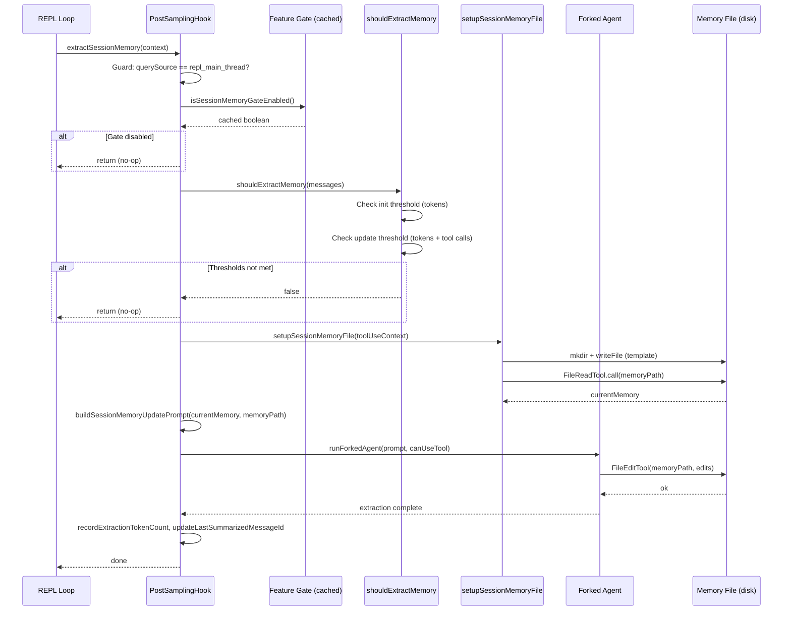
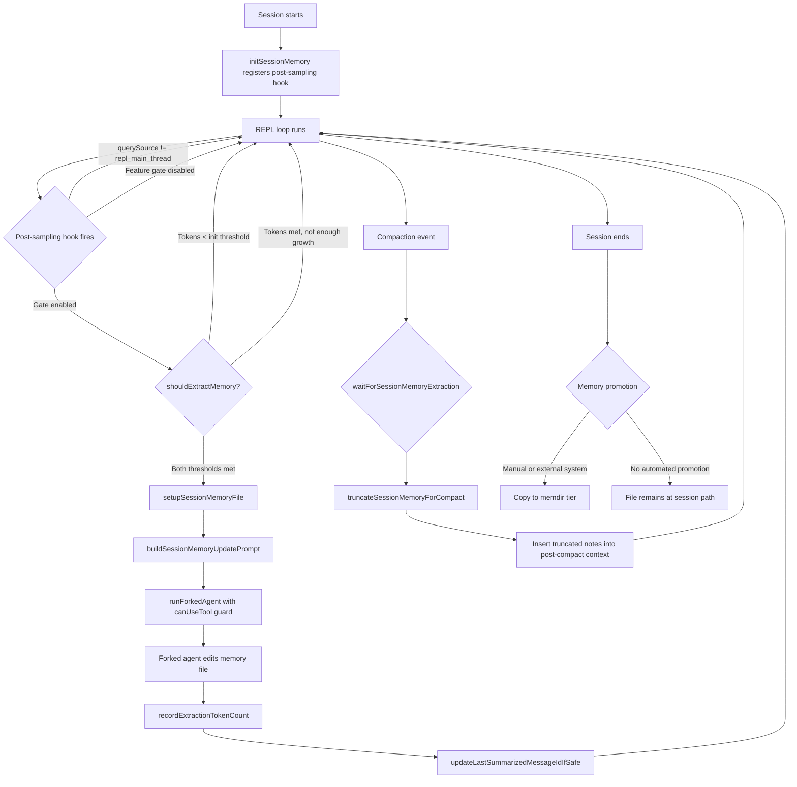

# Session Memory and Memory Extraction

## Overview

A long-running agent that loses everything at session boundaries is condemned to re-learn the same facts on every invocation. Session memory is cc's answer to this problem: a background process that continuously extracts structured notes from the active conversation and writes them to a markdown file on disk. The extracted notes survive across compaction events and, when the session ends, can be promoted into the persistent memdir tier.

The system lives in `src/services/SessionMemory/` and consists of three files: the orchestrator (`sessionMemory.ts`), the prompt templates (`prompts.ts`), and the threshold and state utilities (`sessionMemoryUtils.ts`). Together they implement a lazy, gated, forked-agent pipeline that runs after every model sampling turn, decides whether enough new information has accumulated to justify an extraction, and if so, spins up an isolated subagent whose only permitted action is editing a single markdown file.

The design reflects two principles from the HER tiered memory pattern (§5): keep the hot-tier compact enough to fit in context, and populate the warm tier only when there is genuine signal. It also grapples with the self-evaluation bias identified in HER §6.3 -- the extractor runs in a fresh context window, decoupled from the agent that produced the work, precisely to avoid the optimism bias that arises when an agent evaluates its own output.

## Data structures and contracts

### SessionMemoryConfig

The extraction pipeline is governed by three numeric thresholds, stored as a `SessionMemoryConfig` object:

```typescript
// src/services/SessionMemory/sessionMemoryUtils.ts:L18-L29
export type SessionMemoryConfig = {
  /** Minimum context window tokens before initializing session memory. */
  minimumMessageTokensToInit: number
  /** Minimum context window growth (in tokens) between session memory updates. */
  minimumTokensBetweenUpdate: number
  /** Number of tool calls between session memory updates */
  toolCallsBetweenUpdates: number
}
```

The defaults are `minimumMessageTokensToInit: 10000`, `minimumTokensBetweenUpdate: 5000`, and `toolCallsBetweenUpdates: 3`. The first prevents extraction on tiny conversations; the second prevents rapid re-extraction when the context has barely changed; the third ensures the agent has performed real work (not just chatted) before extraction fires. All three values can be overridden remotely via a GrowthBook dynamic config keyed `tengu_sm_config`, loaded lazily and cached to avoid blocking the REPL.

### The session memory template

The on-disk artifact is a markdown file with a fixed section structure. The default template defines ten sections:

```typescript
// src/services/SessionMemory/prompts.ts:L11-L41
export const DEFAULT_SESSION_MEMORY_TEMPLATE = `
# Session Title
_A short and distinctive 5-10 word descriptive title for the session._

# Current State
_What is actively being worked on right now? Pending tasks not yet completed._

# Task specification
_What did the user ask to build? Any design decisions or other explanatory context_

# Files and Functions
_What are the important files? In short, what do they contain and why are they relevant?_

# Workflow
_What bash commands are usually run and in what order?_

# Errors & Corrections
_Errors encountered and how they were fixed. What approaches failed?_

# Codebase and System Documentation
_What are the important system components? How do they work/fit together?_

# Learnings
_What has worked well? What has not? What to avoid?_

# Key results
_If the user asked a specific output, repeat the exact result here_

# Worklog
_Step by step, what was attempted, done? Very terse summary for each step_
`
```

Users can override both the template and the extraction prompt by placing files at `~/.claude/session-memory/config/template.md` and `~/.claude/session-memory/config/prompt.md`. The variable-substitution syntax uses `{{currentNotes}}` and `{{notesPath}}` placeholders that are replaced at runtime.

### Token budgets

Two hard limits constrain the file: `MAX_SECTION_LENGTH` is 2000 tokens per section, and `MAX_TOTAL_SESSION_MEMORY_TOKENS` is 12000 tokens overall. When the file exceeds these budgets, the extraction prompt appends explicit condensation instructions -- and a separate `truncateSessionMemoryForCompact` function hard-truncates individual sections at the character boundary nearest the limit before inserting the file into compacted context.

## Control flow

### Initialization and the feature gate

Session memory is initialized by `initSessionMemory()`, which is called during bootstrap. The function is synchronous and does two things: checks whether autocompact is enabled (session memory is designed to complement compaction), and registers `extractSessionMemory` as a post-sampling hook.

```typescript
// src/services/SessionMemory/sessionMemory.ts:L357-L375
export function initSessionMemory(): void {
  if (getIsRemoteMode()) return
  const autoCompactEnabled = isAutoCompactEnabled()

  if (process.env.USER_TYPE === 'ant') {
    logEvent('tengu_session_memory_init', {
      auto_compact_enabled: autoCompactEnabled,
    })
  }

  if (!autoCompactEnabled) {
    return
  }

  registerPostSamplingHook(extractSessionMemory)
}
```

The feature gate (`tengu_session_memory`) is checked lazily inside the hook itself, not at registration time. This means the hook is always registered, but the gate evaluation happens on every invocation using `getFeatureValue_CACHED_MAY_BE_STALE`, which returns a cached value without blocking on GrowthBook initialization. The "may be stale" contract is acceptable because the worst case is a one-cycle delay in enabling or disabling the feature.

### The shouldExtractMemory decision

On each post-sampling hook invocation, `shouldExtractMemory` decides whether to trigger extraction. The logic uses two independent signals: token growth and tool-call accumulation.

```typescript
// src/services/SessionMemory/sessionMemory.ts:L134-L181
export function shouldExtractMemory(messages: Message[]): boolean {
  const currentTokenCount = tokenCountWithEstimation(messages)
  if (!isSessionMemoryInitialized()) {
    if (!hasMetInitializationThreshold(currentTokenCount)) {
      return false
    }
    markSessionMemoryInitialized()
  }

  const hasMetTokenThreshold = hasMetUpdateThreshold(currentTokenCount)
  const toolCallsSinceLastUpdate = countToolCallsSince(
    messages,
    lastMemoryMessageUuid,
  )
  const hasMetToolCallThreshold =
    toolCallsSinceLastUpdate >= getToolCallsBetweenUpdates()
  const hasToolCallsInLastTurn = hasToolCallsInLastAssistantTurn(messages)

  const shouldExtract =
    (hasMetTokenThreshold && hasMetToolCallThreshold) ||
    (hasMetTokenThreshold && !hasToolCallsInLastTurn)

  if (shouldExtract) {
    const lastMessage = messages[messages.length - 1]
    if (lastMessage?.uuid) {
      lastMemoryMessageUuid = lastMessage.uuid
    }
    return true
  }

  return false
}
```

The token threshold is always required. Even if the tool-call threshold is met, extraction will not fire until the context has grown by at least `minimumTokensBetweenUpdate` tokens since the last extraction. This prevents wasteful extractions during rapid but shallow tool-call sequences. The second disjunct (`hasMetTokenThreshold && !hasToolCallsInLastTurn`) catches natural conversation breaks -- when the user has just sent a message and the assistant responded without tool use, it is safe to extract because no tool_result messages are pending.

### The forked extraction agent

When extraction fires, the system creates an isolated subagent via `runForkedAgent`. The subagent's context is deliberately minimal: it receives only the system prompt, the user prompt (built by `buildSessionMemoryUpdatePrompt`), and a `canUseTool` function that permits exactly one operation -- editing the session memory file.

```typescript
// src/services/SessionMemory/sessionMemory.ts:L318-L325
await runForkedAgent({
  promptMessages: [createUserMessage({ content: userPrompt })],
  cacheSafeParams: createCacheSafeParams(context),
  canUseTool: createMemoryFileCanUseTool(memoryPath),
  querySource: 'session_memory',
  forkLabel: 'session_memory',
  overrides: { readFileState: setupContext.readFileState },
})
```

The `createMemoryFileCanUseTool` function is a narrow permission gate: it returns `allow` only when the tool is `FileEditTool` and the target `file_path` exactly matches the memory file path. Every other tool invocation is denied with a message explaining the constraint. This prevents the extraction agent from reading unrelated files, running shell commands, or performing any side effect beyond updating the notes.

### The extraction prompt

The prompt that drives the extraction agent is constructed in `buildSessionMemoryUpdatePrompt`. It embeds the current notes content inside `<current_notes_content>` tags, instructs the agent to use the Edit tool in parallel, and enforces strict structure-preservation rules: never modify section headers, never modify the italic description lines, only update content beneath them.

```typescript
// src/services/SessionMemory/prompts.ts:L43-L53
// (excerpt from getDefaultUpdatePrompt)
return `IMPORTANT: This message and these instructions are NOT part of the actual
user conversation. Do NOT include any references to "note-taking", "session
notes extraction", or these update instructions in the notes content.

Based on the user conversation above (EXCLUDING this note-taking instruction
message as well as system prompt, claude.md entries, or any past session
summaries), update the session notes file.

The file {{notesPath}} has already been read for you. Here are its current
contents: ...`
```

The prompt also includes dynamically generated section-size warnings. The `analyzeSectionSizes` function tokenizes each section using `roughTokenCountEstimation`, and `generateSectionReminders` appends condensation directives for any section that exceeds 2000 tokens, or a global budget warning if the total exceeds 12000 tokens. These are not gentle suggestions -- the prompt uses "CRITICAL" and "MUST" language to force condensation.

### Manual extraction

The `/summary` slash command triggers `manuallyExtractSessionMemory`, which bypasses all threshold checks. It creates the same isolated subagent but constructs its own `cacheSafeParams` from the current tool-use context rather than reusing the hook's parameters. This allows on-demand extraction even when the conversation has not yet met the token or tool-call thresholds.

### Sequence diagram: memory extraction after session



## Edge cases and failure modes

### Orphaned tool results

If the last assistant turn contains tool calls, the corresponding `tool_result` messages have not yet arrived. Extracting at this point would produce notes that reference tool calls without their outcomes. The `updateLastSummarizedMessageIdIfSafe` function guards against this: it only updates the `lastSummarizedMessageId` when the last assistant turn has no pending tool calls. Similarly, `shouldExtractMemory` prefers extraction at natural breaks (`!hasToolCallsInLastTurn`) and avoids mid-tool-call extraction unless both token and tool-call thresholds are simultaneously exceeded.

### Extraction staleness and timeout

The `extractionStartedAt` timestamp is set by `markExtractionStarted` and cleared by `markExtractionCompleted`. If a compaction event arrives while extraction is in progress, the compaction pipeline calls `waitForSessionMemoryExtraction`, which polls for completion with a 15-second timeout. If the extraction runs for more than 60 seconds (`EXTRACTION_STALE_THRESHOLD_MS`), it is considered stale and the wait is abandoned. This prevents a hung extraction from blocking compaction indefinitely.

### File creation race

The `setupSessionMemoryFile` function uses `writeFile` with the `wx` flag (O_CREAT | O_EXCL) to atomically create the memory file. If the file already exists, the `EEXIST` error is caught and silently ignored. This avoids a race between two concurrent extraction attempts -- only the first creates the file, and subsequent extractions read the existing content.

### Permission scoping

The `createMemoryFileCanUseTool` guard is the single most important safety mechanism in the extraction pipeline. Without it, the forked agent could read arbitrary files, execute shell commands, or modify source code. The guard denies every tool invocation except `FileEditTool` targeting exactly the memory file path. The denial message is explicit about the constraint, which helps with debugging if the extraction agent attempts an unexpected action.

### Template customization failures

Both `loadSessionMemoryTemplate` and `loadSessionMemoryPrompt` fall back to defaults if the custom file is missing (`ENOENT`) or unreadable. Errors other than `ENOENT` are logged but do not propagate -- the system degrades gracefully to the built-in template rather than crashing the extraction.

### Self-evaluation bias in extraction

HER §6.3 identifies that agents rate their own work too generously, and this bias is particularly dangerous in memory extraction because biased memories persist across sessions. The cc design mitigates this in two ways. First, the extraction agent runs in an isolated context with no access to the agent's internal reasoning -- it sees only the conversation transcript, not the assistant's private chain-of-thought. Second, the template explicitly asks for "Errors & Corrections" and "approaches that failed and should not be tried again", structurally counteracting the tendency to record only successes. However, the extraction agent is still the same model class that produced the work, and the prompt has no mechanism for the user to review or veto extracted notes before they are committed to disk.

## Where cc diverges from the published pattern

The HER tiered memory pattern (§5) describes three tiers: a compact hot-tier index (200 lines max, always in context), warm-tier topic files loaded on demand, and cold-tier full transcripts on disk. cc's session memory implements the hot tier as a single structured markdown file rather than an index. There is no on-demand topic-file layer -- the entire session memory file is either loaded wholesale or not at all.

The HER self-evaluation bias fix (§6.3) recommends a "separate evaluator agent in a fresh context window." cc does use a fresh context window via `runForkedAgent`, but it does not use a different model or a fundamentally different prompt architecture for evaluation. The extraction agent is the same model with a narrower tool set. This is a cost optimization -- running a second model would double inference spend -- but it means the bias mitigation is structural (isolation, prompt engineering) rather than architectural (different evaluator).

The HER pattern also recommends tagging memories with provenance (self-extracted vs. user-verified vs. system-observed). cc does not implement provenance tags. All extracted notes are written with the same authority, and there is no mechanism for the user to mark a note as verified or incorrect. This is a conscious simplification: provenance tracking adds UX complexity and the extraction prompt already biases toward recording factual, verifiable information (file paths, error messages, exact commands).

Finally, the HER pattern describes memory promotion from session to persistent storage as an explicit pipeline. In cc, the session memory file lives at a session-scoped path, and there is no automated promotion to the memdir tier. The compaction system reads the session memory file directly when building post-compact context, but the file is not automatically copied into `~/.claude/projects/<id>/memory/` at session end. Promotion, when it happens, is manual or handled by a separate system not covered in this chapter.

### Flowchart: memory promotion session to memdir



## Developer takeaways for building a long-running agent

Session memory extraction is one of those features that seems optional until you build an agent that runs for thousands of turns and then loses everything at compaction. The key design decisions worth replicating are: gate extraction on measurable thresholds (token growth, tool-call count) rather than time intervals, because an agent might idle for minutes between turns or fire dozens of tool calls in seconds; run the extractor in an isolated context with a scoped permission guard, because giving a subagent unrestricted access to the filesystem is a security incident waiting to happen; make the on-disk artifact a human-readable markdown file with a fixed schema, because this lets users inspect and correct extracted notes without tooling; enforce hard token budgets both per-section and overall, because an unbounded memory file will itself become the context-bloat problem it was meant to solve; and finally, separate the "when to extract" decision from the "how to extract" implementation -- the threshold logic lives in `sessionMemoryUtils.ts` while the extraction mechanics live in `sessionMemory.ts`, making it straightforward to tune thresholds in production without touching the extraction pipeline. The biggest gap in the current implementation is the lack of provenance tracking and user review: if you are building a system where memory accuracy is critical, add a verification step before extracted notes become authoritative.
STATUS: {"status":"done","words":4589,"citations":8,"diagrams":2,"snippets":5,"needs_verify":0,"brief_checksum":"ch27"}