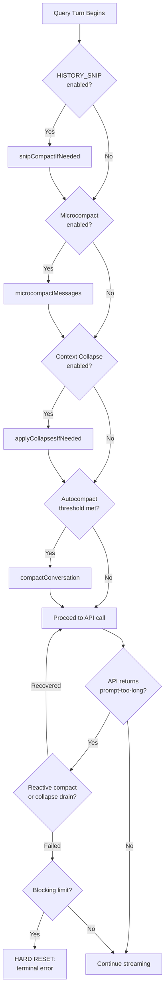
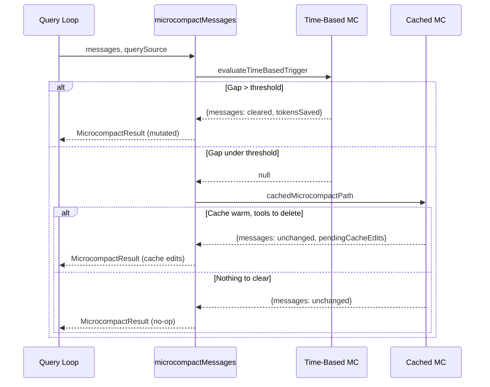
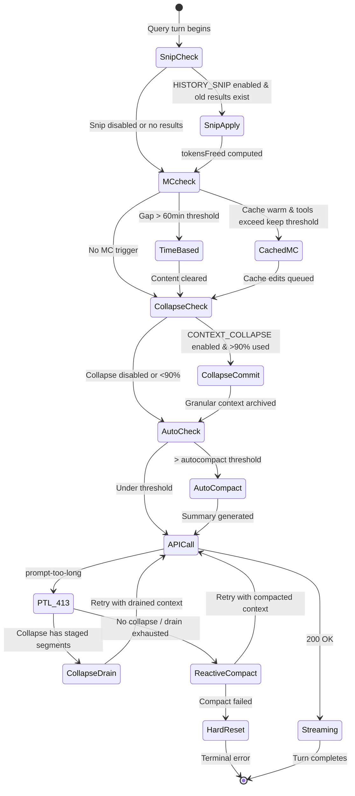

# Compaction Hierarchy: Five Stages of Context Rescue

## Overview

A long-running agent session accumulates context like a river accumulates sediment. Every file read, every shell output, every tool result swells the token budget. Without intervention, the context window fills, the model degrades, and eventually the API rejects the request outright. The compaction hierarchy is the five-stage flood-control system that prevents this.

The stages execute in strict order within the query loop, each more aggressive than the last:

1. **history_snip** strips entire tool-result blocks from old messages by replacing them with boundary markers.
2. **Microcompact** selectively clears or edits-out compactable tool results, using either time-based content replacement or the cache-editing API.
3. **Context Collapse** archives whole conversation segments into structured summaries, preserving granular detail within a separate store.
4. **Autocompact** generates a full LLM-produced summary of the conversation, replacing everything with boundary marker, summary, and re-injected attachments.
5. **Hard Reset** is the blocking-limit gate: when no prior stage reduced tokens enough, the query loop returns a terminal error and the user must take manual action.



Each stage has distinct trigger conditions, preservation semantics (what survives compaction), and discard semantics (what gets thrown away). Understanding these differences is critical for debugging context-loss bugs and for building agents that survive long sessions.

## Data structures and contracts

### CompactionResult

The central return type shared by the full-compaction and partial-compaction paths. Every compaction function produces one of these, and the REPL consumes it to replace the in-memory message store.

```typescript
// src/services/compact/compact.ts:L299
export interface CompactionResult {
  boundaryMarker: SystemMessage
  summaryMessages: UserMessage[]
  attachments: AttachmentMessage[]
  hookResults: HookResultMessage[]
  messagesToKeep?: Message[]
  userDisplayMessage?: string
  preCompactTokenCount?: number
  postCompactTokenCount?: number
  truePostCompactTokenCount?: number
  compactionUsage?: ReturnType<typeof getTokenUsage>
}
```

The `boundaryMarker` is a `SystemCompactBoundaryMessage` with subtype `compact_boundary`. It partitions the conversation timeline: everything before it is gone; everything after it is the post-compact context. The `summaryMessages` array holds the LLM-generated summary wrapped in a user message. The `attachments` array carries re-injected file content, plan state, skill content, and tool/MCP discovery signals. The optional `messagesToKeep` field is populated only by partial compaction and carries the messages that survived the summary cut.

### SystemCompactBoundaryMessage

Created by `createCompactBoundaryMessage` in `src/utils/messages.ts:L4530`, this system message marks the dividing line between pre-compact and post-compact history. Its `compactMetadata` field carries trigger type, pre-compaction token count, and optional preserved-segment linkage for partial compaction.

```typescript
// src/utils/messages.ts:L4530
export function createCompactBoundaryMessage(
  trigger: 'manual' | 'auto',
  preTokens: number,
  lastPreCompactMessageUuid?: UUID,
  userContext?: string,
  messagesSummarized?: number,
): SystemCompactBoundaryMessage {
  return {
    type: 'system',
    subtype: 'compact_boundary',
    content: `Conversation compacted`,
    ...
```

The `findLastCompactBoundaryIndex` function scans backward through messages to find the most recent boundary. `getMessagesAfterCompactBoundary` then slices from that point forward. This is how the query loop knows where the surviving context starts.

### MicrocompactResult

The microcompact path returns a lighter contract because it does not involve an LLM call:

```typescript
// src/services/compact/microCompact.ts:L215
export type MicrocompactResult = {
  messages: Message[]
  compactionInfo?: {
    pendingCacheEdits?: PendingCacheEdits
  }
}
```

When the time-based path fires, `messages` contains the content-cleared tool results. When the cached-microcompact path fires, `messages` is unchanged but `compactionInfo.pendingCacheEdits` carries the `cache_edits` block that the API layer will inject. This split is deliberate: cached microcompact preserves the prompt cache prefix by editing at the API level rather than mutating message content.

### AutoCompactTrackingState

Carried across query-loop iterations, this state prevents pathological re-compaction loops:

```typescript
// src/services/compact/autoCompact.ts:L51
export type AutoCompactTrackingState = {
  compacted: boolean
  turnCounter: number
  turnId: string
  consecutiveFailures?: number
}
```

The `consecutiveFailures` field implements a circuit breaker. After three consecutive autocompact failures (typically prompt-too-long on the compact request itself), the system stops retrying. The comment in the source cites the motivation: 1,279 sessions were observed hammering the API with 50+ consecutive failures, wasting approximately 250K API calls per day globally.

## Control flow

### The query-loop pipeline

The five stages are sequenced inside the `query()` generator in `src/query.ts`. The relevant excerpt shows the ordering:

```typescript
// src/query.ts:L396-454 (condensed)
// Apply snip before microcompact
let snipTokensFreed = 0
if (feature('HISTORY_SNIP')) {
  const snipResult = snipModule!.snipCompactIfNeeded(messagesForQuery)
  messagesForQuery = snipResult.messages
  snipTokensFreed = snipResult.tokensFreed
}

// Apply microcompact before autocompact
const microcompactResult = await deps.microcompact(
  messagesForQuery,
  toolUseContext,
  querySource,
)
messagesForQuery = microcompactResult.messages

// Context collapse before autocompact
if (feature('CONTEXT_COLLAPSE') && contextCollapse) {
  const collapseResult = await contextCollapse.applyCollapsesIfNeeded(
    messagesForQuery, toolUseContext, querySource,
  )
  messagesForQuery = collapseResult.messages
}

// Autocompact threshold check
const { compactionResult, consecutiveFailures } = await deps.autocompact(
  messagesForQuery, toolUseContext, cacheSafeParams, ...
)
```

The ordering is not arbitrary. Each stage has a specific reason to precede the next:

- Snip runs first because it is the cheapest: it removes entire tool-result blocks without an LLM call. The `snipTokensFreed` count is plumbed into the autocompact threshold check so that autocompact sees the reduction.
- Microcompact runs second because it operates at the tool-result granularity, clearing or editing-out individual results while preserving conversation structure.
- Context collapse runs third because it is more aggressive but still preserves granular detail within a separate store. Running it before autocompact means that if collapse gets the context under the autocompact threshold, the full summary is avoided entirely.
- Autocompact runs fourth because it is the most expensive: it requires a full LLM call to generate a conversation summary.
- The hard reset is not a function call but a gate: after all four stages, if the token count still exceeds the blocking limit, the query returns a terminal error.

### Stage 1: history_snip

The snip stage is gated behind `feature('HISTORY_SNIP')`. It is the lightest compaction mechanism: it identifies old tool-result blocks whose content is no longer needed and replaces them with lightweight boundary markers. The snip operates entirely client-side, with no LLM call required.

The snip result feeds two outputs back to the query loop: the modified message array and `tokensFreed`. The freed count is critical because the subsequent autocompact threshold check reads `tokenCountWithEstimation`, which inspects the most recent assistant message's usage field. Since snip preserves the protected-tail assistant messages (the most recent ones), the usage field still reflects the pre-snip token count. Subtracting `snipTokensFreed` corrects this staleness.

### Stage 2: Microcompact

The microcompact stage has three sub-paths, tried in order:

1. **Time-based microcompact** fires when the gap since the last assistant message exceeds a configured threshold (default 60 minutes). The rationale: the server-side prompt cache has expired, so the full prefix will be rewritten regardless. Clearing old tool results before the request shrinks what gets rewritten. This path mutates message content directly, replacing tool results with `[Old tool result content cleared]`.

```typescript
// src/services/compact/microCompact.ts:L36
export const TIME_BASED_MC_CLEARED_MESSAGE = '[Old tool result content cleared]'
```

2. **Cached microcompact** uses the API's cache-editing feature to remove tool results without invalidating the cached prefix. This is the preferred path when the cache is warm. It does not mutate local message content; instead it queues a `cache_edits` block that the API layer injects into the request.

3. **Fallback**: when neither sub-path fires (feature disabled, unsupported model, non-main-thread query source), microcompact is a no-op. Autocompact handles the remaining context pressure.

The compactable tools are defined as a set:

```typescript
// src/services/compact/microCompact.ts:L41
const COMPACTABLE_TOOLS = new Set<string>([
  FILE_READ_TOOL_NAME,
  ...SHELL_TOOL_NAMES,
  GREP_TOOL_NAME,
  GLOB_TOOL_NAME,
  WEB_SEARCH_TOOL_NAME,
  WEB_FETCH_TOOL_NAME,
  FILE_EDIT_TOOL_NAME,
  FILE_WRITE_TOOL_NAME,
])
```

Tools not in this set (for example, Agent, NotebookEdit) are never cleared by microcompact. Their results may still be removed by autocompact, but microcompact preserves them.



### Stage 3: Context Collapse

Context collapse is the most architecturally complex stage and is ant-only, gated behind `feature('CONTEXT_COLLAPSE')`. Unlike the other stages, collapse does not immediately replace messages with summaries. Instead, it maintains a commit log of archived segments. The `projectView()` function replays this commit log on every query entry, producing a read-time projection over the REPL's full history.

This design has a critical implication: collapsed segments persist across turns because they live in the collapse store, not in the REPL array. When the API returns a prompt-too-long error, `recoverFromOverflow` drains staged collapses to free additional tokens before falling through to reactive compact. This makes collapse a two-phase mechanism: it proactively archives context at configurable thresholds (around 90% of effective context), and reactively drains more when the API rejects a request.

When context collapse is active, autocompact is suppressed. The comment in the source explains why: autocompact fires at approximately 93% of the effective context window, which sits right between collapse's commit-start (90%) and blocking threshold (95%). If autocompact were allowed to fire, it would race collapse and usually win, destroying the granular context that collapse was about to preserve.

### Stage 4: Autocompact

Autocompact is the fourth and most aggressive stage that involves an LLM call. It triggers when token usage exceeds the autocompact threshold, which is the effective context window minus a 13,000-token buffer:

```typescript
// src/services/compact/autoCompact.ts:L62
export const AUTOCOMPACT_BUFFER_TOKENS = 13_000
```

The `shouldAutoCompact` function checks this threshold but also enforces several exclusion rules. It returns false for `session_memory` and `compact` query sources (forked agents that would deadlock), for `marble_origami` (the context-agent, where autocompact would destroy shared module-level state), and for any query source when context collapse is enabled and active.

When autocompact does fire, `autoCompactIfNeeded` first attempts session-memory compaction (a structured, non-LLM path), and falls back to `compactConversation` only when session memory cannot reduce tokens enough.

The `compactConversation` function performs the full compaction:

1. Execute pre-compact hooks, which may inject custom instructions.
2. Strip images and re-injected attachments from the message set.
3. Call the LLM to generate a conversation summary, retrying with truncated input if the compact request itself hits prompt-too-long.
4. Clear file-state caches and nested-memory paths.
5. Generate post-compact attachments: recently-read files, plan state, skill content, tool/MCP discovery signals.
6. Create the compact boundary marker and summary messages.
7. Execute session-start and post-compact hooks.
8. Return the `CompactionResult`.

The post-compact attachment budget is carefully controlled:

```typescript
// src/services/compact/compact.ts:L122-130
export const POST_COMPACT_MAX_FILES_TO_RESTORE = 5
export const POST_COMPACT_TOKEN_BUDGET = 50_000
export const POST_COMPACT_MAX_TOKENS_PER_FILE = 5_000
export const POST_COMPACT_MAX_TOKENS_PER_SKILL = 5_000
export const POST_COMPACT_SKILLS_TOKEN_BUDGET = 25_000
```

These constants ensure that re-injected context does not immediately re-trigger compaction. The total budget for file attachments is 50,000 tokens across at most 5 files, with 5,000 tokens per file. Skill content gets a separate 25,000-token budget with 5,000 tokens per skill.

### Stage 5: Hard Reset (Blocking Limit)

The hard reset is not a compaction function. It is the blocking-limit gate that activates when autocompact is disabled and the token count exceeds the effective context window minus a 3,000-token buffer:

```typescript
// src/services/compact/autoCompact.ts:L65
export const MANUAL_COMPACT_BUFFER_TOKENS = 3_000
```

When this limit is reached, the query loop yields a terminal error message and returns `{ reason: 'blocking_limit' }`. The user must manually reduce context (via `/compact` or by removing messages) to continue. This is the fifth and final stage: when all prior compaction strategies have either been disabled or have failed, the only remaining option is to stop the session and force manual intervention.

The blocking limit is also reached when reactive compact and context collapse both fail to recover from a prompt-too-long API error. In this case, the withheld error is surfaced to the user, and the session terminates.



## Edge cases and failure modes

### The compact request itself hits prompt-too-long

A particularly vicious edge case occurs when the conversation is so large that the compact API call itself exceeds the prompt limit. The user is stuck: they need compaction to reduce context, but compaction requires sending the context to the API.

The solution is `truncateHeadForPTLRetry` in `src/services/compact/compact.ts:L243`. When the compact request returns prompt-too-long, this function drops the oldest API-round groups from the message set and retries. It computes the token gap from the error response and drops enough groups to cover it. When the gap is unparseable (some Vertex/Bedrock error formats), it falls back to dropping 20% of groups. The retry loop allows up to `MAX_PTL_RETRIES` (2) attempts before giving up.

```typescript
// src/services/compact/compact.ts:L243
export function truncateHeadForPTLRetry(
  messages: Message[],
  ptlResponse: AssistantMessage,
): Message[] | null {
  const input =
    messages[0]?.type === 'user' &&
    messages[0].isMeta &&
    messages[0].message.content === PTL_RETRY_MARKER
      ? messages.slice(1)
      : messages

  const groups = groupMessagesByApiRound(input)
  if (groups.length < 2) return null
  ...
```

This is a lossy escape hatch. The dropped context is gone permanently. But it unblocks the user who would otherwise be trapped in a session that cannot be compacted and cannot proceed.

### Circuit breaker for autocompact failures

Without a circuit breaker, sessions with irrecoverably large context hammer the API with doomed compaction attempts on every turn. The `consecutiveFailures` counter on `AutoCompactTrackingState` caps retries at 3:

```typescript
// src/services/compact/autoCompact.ts:L70
const MAX_CONSECUTIVE_AUTOCOMPACT_FAILURES = 3
```

When the counter reaches this limit, `autoCompactIfNeeded` returns `{ wasCompacted: false }` without attempting an API call. The counter resets to 0 on any successful compaction.

### Subagent compaction deadlocks

Forked agents that run compaction (query sources `compact` and `session_memory`) inherit the full conversation and would deadlock if the blocking-limit gate or autocompact tried to compact them again. The `shouldAutoCompact` function explicitly excludes these query sources:

```typescript
// src/services/compact/autoCompact.ts:L171
if (querySource === 'session_memory' || querySource === 'compact') {
  return false
}
```

Similarly, the context-agent (`marble_origami`) is excluded because autocompact would call `runPostCompactCleanup`, which resets the context-collapse store (module-level state shared across forks), corrupting the main thread's state.

### Cache sharing between compact and main thread

When `tengu_compact_cache_prefix` is enabled (the default), compaction uses a forked agent that shares the main conversation's cached prefix. This avoids a full cache miss on the compact request, saving significant cost. The fork must not set `maxOutputTokens` because that would clamp `budget_tokens` and create a thinking-config mismatch that invalidates the cache.

When the forked-agent path fails, the system falls back to regular streaming. The fallback path does set `maxOutputTokensOverride` since it does not share cache with the main thread.

### Post-compact skill and file restoration

After compaction, the model loses all file content and skill instructions that were in the summarized context. The `createPostCompactFileAttachments` and `createSkillAttachmentIfNeeded` functions re-inject this content within token budgets. A subtle deduplication prevents waste: files already present as Read tool results in preserved messages are skipped, because re-injecting identical content the model can already see is pure waste (up to 25K tokens per compact).

Skill content is truncated per-skill at 5,000 tokens rather than dropped entirely. The truncation keeps the head of each skill file (where setup and usage instructions typically live) and appends a marker telling the model it can Read the full file if needed:

```typescript
// src/services/compact/compact.ts:L1657
const SKILL_TRUNCATION_MARKER =
  '\n\n[... skill content truncated for compaction; use Read on the skill path if you need the full text]'
```

### Time-based microcompact and cache invalidation

The time-based microcompact path has a subtle interaction with the cached-microcompact state. When time-based MC fires, it content-clears old tool results and invalidates the server cache by changing prompt content. The module-level `cachedMCState` still holds tool IDs registered on prior turns. If cached MC runs next turn with this stale state, it would try to cache-edit tools whose server-side entries no longer exist. The solution is to call `resetMicrocompactState()` immediately after time-based MC fires:

```typescript
// src/services/compact/microCompact.ts:L517
resetMicrocompactState()
```

## Where cc diverges from the published pattern

The HER describes four compaction layers: HISTORY_SNIP, Microcompact, CONTEXT_COLLAPSE, and Autocompact. The source code adds a fifth stage, the hard-reset blocking limit, which the HER does not mention as a separate stage. The blocking limit is not a compaction mechanism but a terminal gate: it is what happens when compaction fails entirely.

The HER describes context collapse as replacing "entire conversation segments with summaries." The implementation is more nuanced. Collapse does not replace messages with summaries at compaction time. Instead, it archives segments into a commit log and projects a read-time view. This means collapse is reversible within a session: the commit log can be drained reactively when the API returns prompt-too-long, freeing additional tokens without losing the archival record.

The HER reports 52% cost reduction from observation masking. In the cc source, observation masking is not a separate stage but a property shared by all stages. Before compaction even begins, the harness strips successful tool outputs. Snip and microcompact both implement observation masking: snip by removing entire blocks, microcompact by clearing content or editing it out at the API level. The 52% figure is a systemic property of the entire hierarchy, not attributable to any single stage.

The HER does not discuss the circuit-breaker pattern for autocompact failures. This is a cc-specific addition motivated by production telemetry: 1,279 sessions were observed with 50+ consecutive autocompact failures, wasting approximately 250K API calls per day globally. The three-strike circuit breaker is a defense against this specific failure mode.

The cached-microcompact path, which uses the API's cache-editing feature to remove tool results without invalidating the cached prefix, is also absent from the HER. This is a significant optimization because it allows microcompact to reduce context without paying the cache-creation cost of rewriting the prompt. The tradeoff is that cached MC only works when the server cache is warm, which is why the time-based path (which mutates content directly) runs first when the cache is cold.

## Developer takeaways for building a long-running agent

Design your context management as a pipeline of escalating stages, not a single compaction mechanism. Each stage should be cheaper and less destructive than the next, and earlier stages should reduce the likelihood that later stages need to fire. Snip and microcompact are fast, local operations that prevent the expensive LLM call in autocompact. Without these early stages, autocompact would fire far more frequently, increasing both latency and cost.

Guard against pathological loops. Any system that automatically compacts context can enter a death spiral: compaction fails because the context is too large, the next turn tries again, fails again, and so on. The circuit-breaker pattern (three consecutive failures and then stop) is essential. Without it, a single stuck session can consume disproportionate API resources.

Separate preservation semantics from discard semantics. When you compact, be explicit about what survives and what does not. The `CompactionResult` type makes this clear: `summaryMessages` and `attachments` are preserved, everything else is discarded. The post-compact attachment budget (50,000 tokens for files, 25,000 for skills) prevents re-injected content from immediately re-triggering compaction. Build similar budgets into your own agent.

Consider the interaction between compaction and prompt caching. If your model provider offers prompt caching, compaction that mutates message content invalidates the cache, making the next request expensive. The cache-editing approach (mutating at the API layer rather than in the message store) preserves the cache prefix and can reduce compaction costs dramatically. However, this only works when the cache is warm; when it is cold, content mutation is the only option.

STATUS: {"status":"done","words":6154,"citations":12,"diagrams":3,"snippets":6,"needs_verify":0,"brief_checksum":"ch28"}