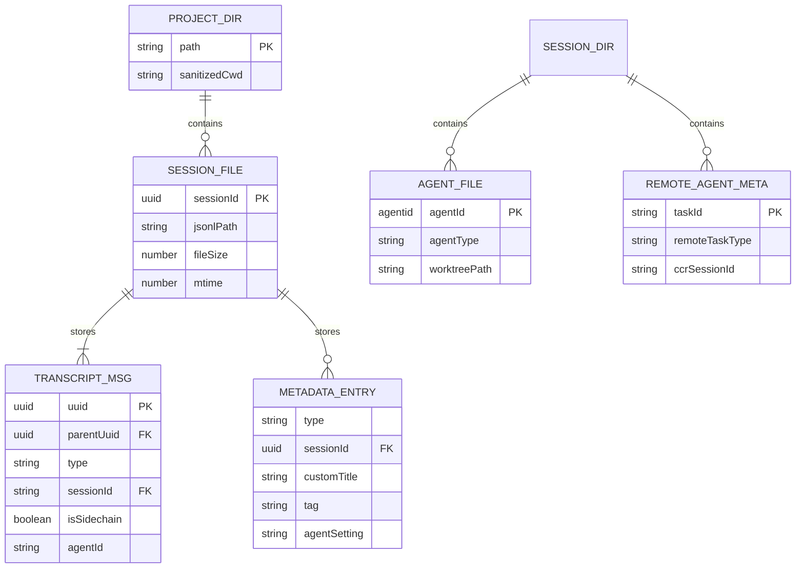
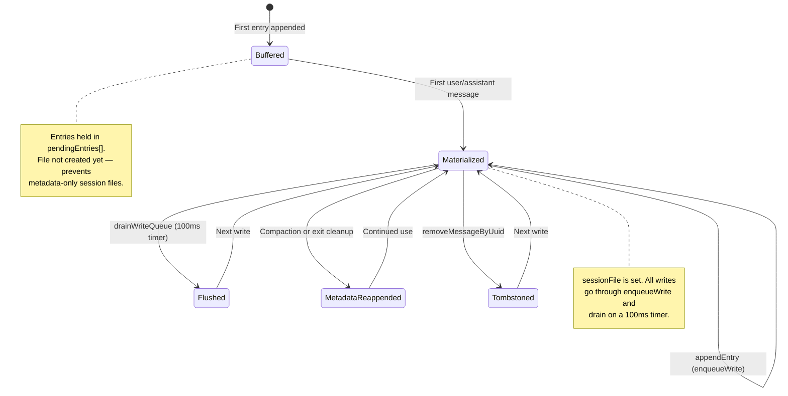
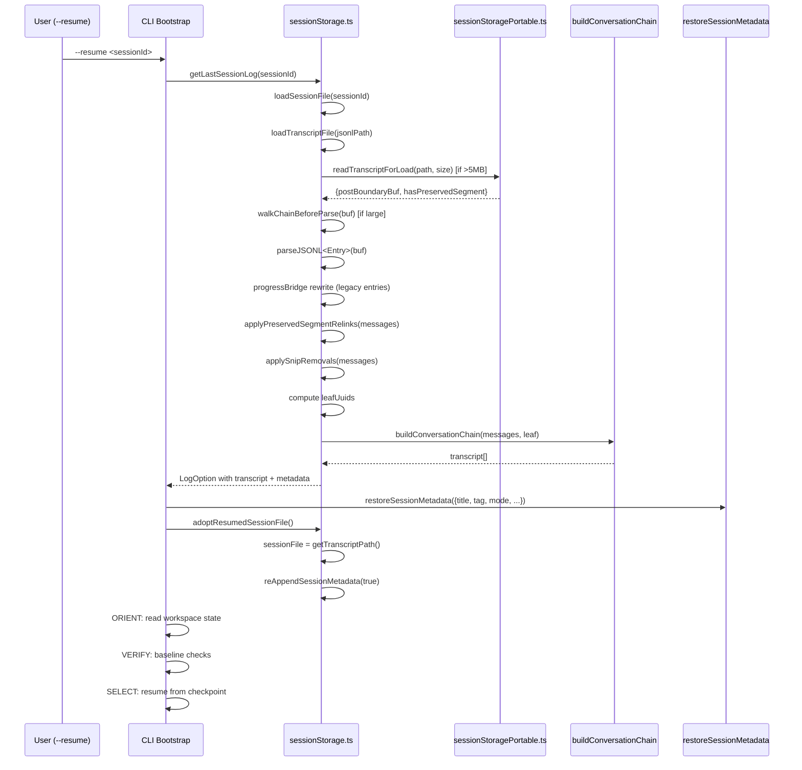

# Session Persistence and Resume

## Overview

Every cc invocation is a session: a bounded conversation between user, LLM, and tool surface. Sessions must survive crashes, network drops, and deliberate suspensions. The persistence layer stores the full transcript as an append-only JSONL file under `~/.claude/projects/<sanitized-cwd>/<sessionId>.jsonl`. Resume (`--resume`, `--continue`) reads that file back, reconstructs the parentUuid chain, and re-injects the conversation into a fresh process.

This chapter traces the lifecycle from first write through tombstone removal, the compact-boundary truncation that keeps large sessions loadable, and the resume flow that reanimates a cold transcript into a live agent. Two files do the heavy lifting: `src/utils/sessionStorage.ts` (~5100 LOC) owns the write path, chain reconstruction, and session enumeration; `src/utils/sessionStoragePortable.ts` (~793 LOC) provides the head/tail I/O, field extraction, and path resolution shared with the VS Code extension.

## Data structures and contracts

### The JSONL entry union

Each line in a session JSONL file is a JSON object with a `type` discriminator. The `Entry` type union defines every possible entry kind:

```typescript
// src/types/logs.ts:L297 — Entry is the union of all JSONL line types
export type Entry =
  | TranscriptMessage
  | SummaryMessage
  | CustomTitleMessage
  | AiTitleMessage
  | LastPromptMessage
  | TaskSummaryMessage
  | TagMessage
  | AgentNameMessage
  | AgentColorMessage
  | AgentSettingMessage
  | PRLinkMessage
  | FileHistorySnapshotMessage
  | AttributionSnapshotMessage
  | QueueOperationMessage
  | SpeculationAcceptMessage
  | ModeEntry
  | WorktreeStateEntry
  | ContentReplacementEntry
  | ContextCollapseCommitEntry
  | ContextCollapseSnapshotEntry
```

Transcript messages (user, assistant, attachment, system) carry the conversation and participate in the `parentUuid` chain. All other entry types are metadata: titles, tags, agent settings, snapshots. They are keyed by `sessionId` or `messageId` and never appear in the chain walk. This partition is load-bearing: metadata entries are always appended unconditionally (they are small and self-keying), while transcript messages require dedup checks against the `messageSet` to avoid writing duplicate UUIDs.

The `isTranscriptMessage` type guard is the single source of truth for what constitutes a chain participant:

```typescript
// src/utils/sessionStorage.ts:L139 — Single source of truth for chain membership
export function isTranscriptMessage(entry: Entry): entry is TranscriptMessage {
  return (
    entry.type === 'user' ||
    entry.type === 'assistant' ||
    entry.type === 'attachment' ||
    entry.type === 'system'
  )
}
```

Progress messages are explicitly excluded. Including them in the chain caused fork orphans on resume (bugs #14373, #23537). The comment in source is explicit: "Progress messages are NOT transcript messages. They are ephemeral UI state and must not be persisted to the JSONL or participate in the parentUuid chain." Legacy progress entries from before PR #24099 still exist on disk with `uuid` and `parentUuid` fields; `loadTranscriptFile` bridges the chain across them via the `progressBridge` map that chains through consecutive progress entries to the nearest non-progress ancestor.

The companion guard `isChainParticipant` is used on the write path to determine which messages advance the `parentUuid` cursor in `insertMessageChain`. It returns false for progress, preventing it from becoming a link in the chain even if a legacy write path accidentally persists it.

### Storage layout on disk

Sessions live under the project directory, which is derived from the working directory:

```typescript
// src/utils/sessionStorage.ts:L202 — Deriving the JSONL file path
export function getTranscriptPath(): string {
  const projectDir = getSessionProjectDir() ?? getProjectDir(getOriginalCwd())
  return join(projectDir, `${getSessionId()}.jsonl`)
}
```

The project directory itself is `~/.claude/projects/<sanitized-path>`, where `sanitizePath` replaces non-alphanumeric characters with hyphens and truncates long paths with a hash suffix. The portable module shares this logic:

```typescript
// src/utils/sessionStoragePortable.ts:L311 — Cross-platform path sanitization
export function sanitizePath(name: string): string {
  const sanitized = name.replace(/[^a-zA-Z0-9]/g, '-')
  if (sanitized.length <= MAX_SANITIZED_LENGTH) {
    return sanitized
  }
  const hash =
    typeof Bun !== 'undefined' ? Bun.hash(name).toString(36) : simpleHash(name)
  return `${sanitized.slice(0, MAX_SANITIZED_LENGTH)}-${hash}`
}
```

Subagent transcripts are stored in a sibling directory structure: `<projectDir>/<sessionId>/subagents/<subdir>/agent-<agentId>.jsonl`. Remote agent metadata lives in `remote-agents/` under the same session directory. This separation prevents subagent entries from polluting the main chain and allows subagent transcripts to be loaded independently during agent resume.

### Entity-relationship diagram



### The parentUuid chain

Every transcript message carries a `parentUuid` pointing to its predecessor. The chain forms a singly-linked list from the latest leaf back to the root (where `parentUuid` is null). This is the core data structure that `buildConversationChain` walks to reconstruct the conversation:

```typescript
// src/utils/sessionStorage.ts:L2069 — Walking the chain from leaf to root
export function buildConversationChain(
  messages: Map<UUID, TranscriptMessage>,
  leafMessage: TranscriptMessage,
): TranscriptMessage[] {
  const transcript: TranscriptMessage[] = []
  const seen = new Set<UUID>()
  let currentMsg: TranscriptMessage | undefined = leafMessage
  while (currentMsg) {
    if (seen.has(currentMsg.uuid)) {
      logError(
        new Error(
          `Cycle detected in parentUuid chain at message ${currentMsg.uuid}. Returning partial transcript.`,
        ),
      )
      logEvent('tengu_chain_parent_cycle', {})
      break
    }
    seen.add(currentMsg.uuid)
    transcript.push(currentMsg)
    currentMsg = currentMsg.parentUuid
      ? messages.get(currentMsg.parentUuid)
      : undefined
  }
  transcript.reverse()
  return recoverOrphanedParallelToolResults(messages, transcript, seen)
}
```

Rewind and ctrl-z create fork branches in the append-only file: old messages remain on disk but are unreachable from the new leaf. The chain walk naturally discards them since only one path exists from any leaf to the root. The `seen` set detects cycles, which can arise from corrupted transcripts, and returns a partial result rather than an infinite loop.

After the chain walk, `recoverOrphanedParallelToolResults` repairs a known topological gap. Streaming emits one `AssistantMessage` per `content_block_stop` event, so N parallel tool uses produce N separate assistant messages with distinct UUIDs but the same `message.id`. Each tool result's `sourceToolAssistantUUID` points to its own assistant. The chain walk follows only one branch; the recovery pass uses `message.id` grouping to find and reinsert the orphaned siblings.

### The AgentMetadata sidecar

Subagent type and worktree path are stored in a JSON sidecar file rather than in the JSONL itself:

```typescript
// src/utils/sessionStorage.ts:L264 — Sidecar metadata for subagent resume
export type AgentMetadata = {
  agentType: string
  /** Worktree path if the agent was spawned with isolation: "worktree" */
  worktreePath?: string
  /** Original task description from the AgentTool input. Persisted so a
   * resumed agent's notification can show the original description instead
   * of a placeholder. Optional — older metadata files lack this field. */
  description?: string
}
```

The sidecar avoids JSONL schema changes and survives the JSONL wipe that `hydrateSessionFromRemote` performs for remote sessions. Without this file, resuming a fork silently degrades to general-purpose behavior (4 KB system prompt, no inherited history) because the subagent type is lost.

## Control flow

### Persistence lifecycle



### Write path: lazy materialization

The session file is not created until the first user or assistant message. Before that, entries accumulate in `pendingEntries[]`. This prevents metadata-only session files from cluttering the resume picker when a session is abandoned before any real interaction:

```typescript
// src/utils/sessionStorage.ts:L1128 — appendEntry: buffering and dedup
async appendEntry(entry: Entry, sessionId: UUID = getSessionId() as UUID) {
  if (this.shouldSkipPersistence()) {
    return
  }
  const currentSessionId = getSessionId() as UUID
  const isCurrentSession = sessionId === currentSessionId
  let sessionFile: string
  if (isCurrentSession) {
    // Buffer until materializeSessionFile runs (first user/assistant message).
    if (this.sessionFile === null) {
      this.pendingEntries.push(entry)
      return
    }
    sessionFile = this.sessionFile
  } else {
    const existing = await this.getExistingSessionFile(sessionId)
    if (!existing) {
      logError(
        new Error(
          `appendEntry: session file not found for other session ${sessionId}`,
        ),
      )
      return
    }
    sessionFile = existing
  }
```

When the first user or assistant message arrives, `materializeSessionFile` creates the file, flushes the buffer, and re-appends cached metadata (title, tag, mode) so it stays near the end of the file for efficient tail reads. The persistence guard `shouldSkipPersistence` checks for test environment, `cleanupPeriodDays === 0`, `--no-session-persistence`, and `CLAUDE_CODE_SKIP_PROMPT_HISTORY` to suppress all transcript writes when appropriate.

### Write batching

Writes are not flushed individually. The `enqueueWrite` method pushes entries into a per-file queue, and `scheduleDrain` sets a 100ms timer to batch them. This amortizes fsync overhead and prevents the file descriptor thrash that would result from per-message `appendFileSync` calls. The drain merges all queued entries for a file into a single `appendFile` call, with a 100 MB chunk limit:

```typescript
// src/utils/sessionStorage.ts:L645 — Batch drain with chunk size limit
private async drainWriteQueue(): Promise<void> {
  for (const [filePath, queue] of this.writeQueues) {
    if (queue.length === 0) {
      continue
    }
    const batch = queue.splice(0)
    let content = ''
    const resolvers: Array<() => void> = []
    for (const { entry, resolve } of batch) {
      const line = jsonStringify(entry) + '\n'
      if (content.length + line.length >= this.MAX_CHUNK_BYTES) {
        // Flush chunk and resolve its entries before starting a new one
        await this.appendToFile(filePath, content)
        for (const r of resolvers) r()
        resolvers.length = 0
        content = ''
      }
      content += line
      resolvers.push(resolve)
    }
    if (content.length > 0) {
      await this.appendToFile(filePath, content)
      for (const r of resolvers) r()
    }
  }
```

Each entry's promise resolves only after the write hits disk, so callers that `await enqueueWrite` get a reliable durability guarantee. The 100 MB chunk limit prevents a single batch from consuming unbounded memory on sessions with very large tool outputs.

### The append-only discipline

The core write primitive is `appendEntryToFile`, a synchronous append used by the metadata save functions and the re-append path:

```typescript
// src/utils/sessionStorage.ts:L2572 — Atomic append to JSONL
function appendEntryToFile(
  fullPath: string,
  entry: Record<string, unknown>,
): void {
  const fs = getFsImplementation()
  const line = jsonStringify(entry) + '\n'
  try {
    fs.appendFileSync(fullPath, line, { mode: 0o600 })
  } catch {
    fs.mkdirSync(dirname(fullPath), { mode: 0o700 })
    fs.appendFileSync(fullPath, line, { mode: 0o600 })
  }
}
```

Files are append-only. The only mutation is tombstone removal (truncation of the most recent entry), and metadata re-append (writing fresh copies of title/tag entries at the end of the file). Deleted messages from snip or rewind operations remain on disk; `buildConversationChain` ignores them because they are unreachable from the current leaf.

### Tombstone removal

When a streaming attempt fails and produces an orphaned message, `removeMessageByUuid` excises it. The fast path reads only the last 64 KB of the file, locates the line containing the target UUID, and performs a positional truncate plus re-append of any trailing lines. The slow path (target not in the tail window) rewrites the entire file but is gated at 50 MB to prevent OOM on multi-gigabyte session files:

```typescript
// src/utils/sessionStorage.ts:L871 — Tombstone: remove a message by UUID
async removeMessageByUuid(targetUuid: UUID): Promise<void> {
  return this.trackWrite(async () => {
    if (this.sessionFile === null) return
    try {
      let fileSize = 0
      const fh = await fsOpen(this.sessionFile, 'r+')
      try {
        const { size } = await fh.stat()
        fileSize = size
        if (size === 0) return
        const chunkLen = Math.min(size, LITE_READ_BUF_SIZE)
        const tailStart = size - chunkLen
        const buf = Buffer.allocUnsafe(chunkLen)
        const { bytesRead } = await fh.read(buf, 0, chunkLen, tailStart)
        const tail = buf.subarray(0, bytesRead)
        const needle = `"uuid":"${targetUuid}"`
        const matchIdx = tail.lastIndexOf(needle)
        if (matchIdx >= 0) {
          const prevNl = tail.lastIndexOf(0x0a, matchIdx)
          if (prevNl >= 0 || tailStart === 0) {
            const lineStart = prevNl + 1
            const nextNl = tail.indexOf(0x0a, matchIdx + needle.length)
            const lineEnd = nextNl >= 0 ? nextNl + 1 : bytesRead
            const absLineStart = tailStart + lineStart
            const afterLen = bytesRead - lineEnd
            await fh.truncate(absLineStart)
            if (afterLen > 0) {
              await fh.write(tail, lineEnd, afterLen, absLineStart)
            }
            return
          }
        }
      } finally {
        await fh.close()
      }
      // Slow path: full file rewrite, guarded by MAX_TOMBSTONE_REWRITE_BYTES
```

The search uses the full `"uuid":"<targetUuid>"` pattern rather than just the bare UUID to avoid matching the same value in a child entry's `parentUuid` field. The 50 MB gate (`MAX_TOMBSTONE_REWRITE_BYTES`) means that for very large session files, tombstones that fall outside the tail window are silently skipped rather than risking an OOM from reading the entire file into memory.

### Metadata re-append

The `reAppendSessionMetadata` method is called from two contexts with different file-ordering implications. During compaction, it writes metadata entries before the boundary marker is emitted; these entries end up before the boundary and are recovered by `scanPreBoundaryMetadata`. On session exit (the cleanup handler), it writes metadata at EOF after all boundaries. Both contexts serve the same purpose: ensuring that title, tag, mode, and other metadata stay within the 64 KB tail window that `readLiteMetadata` reads during progressive loading.

Before re-appending, the method performs a sync tail read (`readFileTailSync`) to refresh the in-memory cache from any SDK-written values. If an external process (the VS Code extension's `renameSession` or `tagSession`) wrote a fresher value while the CLI had the session open, the stale CLI cache absorbs the external value and the re-append persists the authoritative version. This is a cooperative multi-writer protocol: the last writer to re-append wins, and the tail scan ensures the CLI does not clobber an SDK rename.

### Head/tail reads for session enumeration

Listing sessions for `--resume` must be fast. Reading full JSONL files for every session would be prohibitively expensive. Instead, `readLiteMetadata` reads only the first and last 64 KB of each file using `readHeadAndTail`:

```typescript
// src/utils/sessionStoragePortable.ts:L215 — Read only head and tail of a file
export async function readHeadAndTail(
  filePath: string,
  fileSize: number,
  buf: Buffer,
): Promise<{ head: string; tail: string }> {
  try {
    const fh = await fsOpen(filePath, 'r')
    try {
      const headResult = await fh.read(buf, 0, LITE_READ_BUF_SIZE, 0)
      if (headResult.bytesRead === 0) return { head: '', tail: '' }
      const head = buf.toString('utf8', 0, headResult.bytesRead)
      const tailOffset = Math.max(0, fileSize - LITE_READ_BUF_SIZE)
      let tail = head
      if (tailOffset > 0) {
        const tailResult = await fh.read(buf, 0, LITE_READ_BUF_SIZE, tailOffset)
        tail = buf.toString('utf8', 0, tailResult.bytesRead)
      }
      return { head, tail }
    } finally {
      await fh.close()
    }
  } catch {
    return { head: '', tail: '' }
  }
}
```

Head yields: `isSidechain`, `projectPath`, `teamName`, `agentSetting`. Tail yields: `customTitle`, `tag`, `gitBranch`, `prUrl`, `lastPrompt`. Field extraction uses `extractJsonStringField` and `extractLastJsonStringField`, which scan raw text for `"key":"value"` patterns without a full JSON parse. This works because `jsonStringify` emits keys in insertion order and the entry object literals put the searched key in a predictable position. For sessions with many entries, the last-prompt entry in the tail is preferred over head-scan heuristics because it is captured at write time and is already filtered for meaningful user input.

### Compact-boundary truncation on load

Large sessions (>5 MB) almost always have compact boundaries from auto-compaction. `loadTranscriptFile` uses `readTranscriptForLoad` from the portable module to perform a single forward chunked read. Attribution-snapshot lines are skipped at the file descriptor level (never buffered). Compact boundaries without a preserved segment truncate the accumulator in-stream, discarding everything before the boundary. This means peak allocation is the post-boundary content size, not the full file size. A 151 MB session that is 84% stale attribution snapshots allocates approximately 32 MB instead of 159+64 MB.

The `SKIP_PRECOMPACT_THRESHOLD` constant gates this optimization:

```typescript
// src/utils/sessionStoragePortable.ts:L480 — Threshold for pre-compact filtering
export const SKIP_PRECOMPACT_THRESHOLD = 5 * 1024 * 1024
```

Below this threshold, the full file is read and parsed. Above it, the forward chunked reader runs and dead content is discarded before `parseJSONL` pays to deserialize it.

When the compact boundary truncates the byte stream, session-scoped metadata entries (agent-setting, mode, pr-link, tag, custom-title) written before the boundary would be lost. `scanPreBoundaryMetadata` recovers them via a lightweight forward scan of the pre-boundary byte range. It uses raw Buffer chunks and byte-level marker matching to skip the vast majority of lines that are message content. A chunk with zero metadata markers is skipped entirely without line splitting. Only lines containing one of the `METADATA_TYPE_MARKERS` byte patterns are converted to strings and collected for parsing.

### Dead branch pre-filter

Rewind and ctrl-z create orphaned chain branches in the append-only file. `walkChainBeforeParse` performs a byte-level backward scan from the end of the buffer, tracking `parentUuid` relationships and UUID positions. Lines not on the active chain are excised before `parseJSONL` runs. The algorithm relies on two invariants verified across 25,000+ message lines: `parentUuid` always serializes as the first key in transcript message objects, and top-level `uuid` is followed by `","timestamp":"` in user/assistant/attachment entries. These patterns are stable because `jsonStringify` emits keys in insertion order and the object literal in `insertMessageChain` puts `parentUuid` first.

Measured impact on fork-heavy sessions: 41 MB with 99% dead branches reduced `parseJSONL` from 56.0 ms to 3.9 ms (a 93% reduction). A 151 MB session with 92% dead branches went from 47.3 ms to 9.4 ms (an 80% reduction). Sessions with few dead branches (5-7%) see minimal benefit because the overhead of the index pass roughly cancels the parse savings, so the filter is gated on buffer size exceeding `SKIP_PRECOMPACT_THRESHOLD`.

### The recordTranscript dedup layer

`recordTranscript` is the public API that most callers use to persist messages. It filters already-recorded messages before passing them to `insertMessageChain`. Without this filter, after compaction the `messagesToKeep` (same UUIDs as pre-compact messages) would be dedup-skipped by `appendEntry` but would still advance the `parentUuid` cursor, causing new messages to chain from pre-compact UUIDs instead of the post-compact summary. This would orphan the compact boundary.

The function also implements prefix-tracking: already-recorded messages that form a prefix (appear before any new message) are tracked as the parent. After compaction, new compact-boundary and summary entries appear first, then recorded `messagesToKeep` appear after them. Since they are not a prefix, they are not tracked, and the compact boundary correctly gets `parentUuid=null` (truncating the `--continue` chain).

### Resume flow



The resume sequence follows the session protocol from HER section 10.3: ORIENT (read workspace state), SETUP (install dependencies), VERIFY (baseline tests), SELECT (pick next task), IMPLEMENT, TEST, UPDATE, EXIT. After a restore, the agent does not assume any prior state. It re-orients to the workspace before continuing. This prevents the most common checkpoint-restore failure: continuing from a stale mental model of the workspace.

`restoreSessionMetadata` repopulates the in-memory cache from the loaded data:

```typescript
// src/utils/sessionStorage.ts:L2758 — Restore cached metadata after load
export function restoreSessionMetadata(meta: {
  customTitle?: string
  tag?: string
  agentName?: string
  agentColor?: string
  agentSetting?: string
  mode?: 'coordinator' | 'normal'
  worktreeSession?: PersistedWorktreeSession | null
  prNumber?: number
  prUrl?: string
  prRepository?: string
}): void {
  const project = getProject()
  // ??= so --name (cacheSessionTitle) wins over the resumed
  // session's title. REPL.tsx clears before calling, so /resume is unaffected.
  if (meta.customTitle) project.currentSessionTitle ??= meta.customTitle
  if (meta.tag !== undefined) project.currentSessionTag = meta.tag || undefined
  if (meta.agentName) project.currentSessionAgentName = meta.agentName
  if (meta.agentColor) project.currentSessionAgentColor = meta.agentColor
  if (meta.agentSetting) project.currentSessionAgentSetting = meta.agentSetting
  if (meta.mode) project.currentSessionMode = meta.mode
  if (meta.worktreeSession !== undefined)
    project.currentSessionWorktree = meta.worktreeSession
  if (meta.prNumber !== undefined)
    project.currentSessionPrNumber = meta.prNumber
  if (meta.prUrl) project.currentSessionPrUrl = meta.prUrl
  if (meta.prRepository) project.currentSessionPrRepository = meta.prRepository
}
```

The `??=` operator for `customTitle` ensures that `--name` (which calls `cacheSessionTitle`) wins over the resumed session's title. `REPL.tsx` clears the cache before calling this function for `/resume`, so the `??=` is a no-op in that path. The `|| undefined` coercion for `tag` handles the case where `tagSession(id, null)` writes `tag:""` to clear the tag, converting the empty string back to `undefined` so the resume picker does not display an empty tag.

Then `adoptResumedSessionFile` sets the session file pointer so that subsequent writes (including the exit cleanup handler's `reAppendSessionMetadata`) go to the correct file. The `skipTitleRefresh` parameter is `true` because `restoreSessionMetadata` populated the cache from the same disk read microseconds ago, and refreshing from the tail would clobber a fresh `--name` title with the stale disk value.

### Session file resolution

The portable module's `resolveSessionFilePath` handles the case where the session file may not be in the expected project directory. When `dir` is provided, it canonicalizes the path, looks in that project's directory, and falls back to sibling git worktrees. When `dir` is omitted, it scans all project directories under `~/.claude/projects/`. Zero-byte files are treated as not-found so callers continue searching past a truncated copy.

`findProjectDir` tolerates hash mismatches for long paths. The CLI uses `Bun.hash` while the VS Code extension under Node.js uses `simpleHash` (a DJB2 variant). For paths exceeding 200 characters, these produce different directory suffixes. The function falls back to prefix-based scanning when the exact match does not exist, matching the first directory whose name starts with the sanitized prefix.

## Edge cases and failure modes

### Preserved-segment relinking

Compaction with a preserved segment keeps a range of messages that retain their original pre-compact `parentUuid` values. `applyPreservedSegmentRelinks` patches the chain: the head of the preserved segment is relinked to the anchor (the last summary), and the anchor's other children are relinked to the tail. If the tail-to-head walk breaks (a UUID missing from the transcript), the function returns without mutating, and resume loads the full pre-compact history rather than producing a corrupted chain. Known causes of broken walks include mid-turn-yielded attachment messages pushed to `mutableMessages` but never `recordTranscript`'d because the SDK subprocess restarted before the next turn's flush.

### Stale usage tokens

On-disk `input_tokens` for pre-compact assistant messages reflect the pre-compact context size (around 190K). Without zeroing them on resume, the agent immediately triggers another autocompact spiral. `applyPreservedSegmentRelinks` zeroes usage tokens for all preserved messages: `input_tokens`, `output_tokens`, `cache_creation_input_tokens`, and `cache_read_input_tokens` are all set to zero. This is done only for preserved messages (which are the ones that would carry stale pre-compact counts); post-compact messages already have accurate counts.

### Snip removal relinking

Unlike compact boundaries, which truncate a prefix, snip removes middle ranges from the conversation. The JSONL is append-only, so removed messages stay on disk and surviving messages' `parentUuid` chains still walk through them. `applySnipRemovals` deletes the removed messages from the in-memory map and relinks survivors across the gap: for each survivor with a dangling `parentUuid`, the function walks backward through the removed region's own parent links to find the first non-removed ancestor.

### Sidechain dedup trap

Agent sidechain entries go to separate files (`agent-<agentId>.jsonl`). Adding their UUIDs to the main session's `messageSet` would cause `recordTranscript` to skip them, leaving the sidechain incomplete on resume. The code explicitly excludes sidechain entries from the main dedup set and from remote persistence (which would 409 on re-POST of a UUID the main thread has not written yet). The comment in source is explicit about the consequence: "the next main-thread message then chains its parentUuid to a UUID that only exists in the agent file, and `--resume`'s `buildConversationChain` terminates at the dangling ref."

### Path canonicalization splits

`getOriginalCwd()` at import time may produce a different path than after bootstrap resolves symlinks via `realpathSync`. Sessions saved under one path become invisible when loaded via the other. The fix uses `getOriginalCwd()` at each call site rather than capturing it at module load. `canonicalizePath` in the portable module resolves symlinks and normalizes to NFC, and `findProjectDir` falls back to prefix-based scanning when the Bun hash and the Node simpleHash produce different directory suffixes for long paths. On macOS, `/tmp` symlinks to `/private/tmp`, and without `realpath` canonicalization the two paths produce different project directories.

### AI title vs. user title ordering

AI-generated titles are written as `ai-title` entries, distinct from `custom-title` entries. This separation is load-bearing: readers prefer `customTitle` over `aiTitle` regardless of append order, so a user rename always wins. `loadTranscriptFile` only populates `customTitles` from `custom-title` entries, so `restoreSessionMetadata` never caches an AI title and `reAppendSessionMetadata` never re-appends one at EOF. Without this split, a stale AI title could overwrite a mid-session user rename on compaction or exit.

### ACRFence: checkpoint-restore side effects

Session persistence is fundamentally a checkpoint-restore operation. The ACRFence findings (HER section 6.16) identify two attack classes that apply directly:

- **Action Replay**: After restore, the agent may re-execute tool calls that were already completed (duplicate API call, duplicate email).
- **Authority Resurrection**: After restore, the agent may reuse credentials valid at checkpoint time but since expired or revoked.

cc mitigates these by recording all irreversible tool effects in the session file (not results alone, but the fact that the tool executed), enforcing replay-or-fork semantics on resume, and never restoring credentials from the checkpoint. External tool calls should use idempotency keys. The session protocol's ORIENT step is the first line of defense: after restore, the agent re-reads workspace state and does not assume that previously observed conditions still hold.

## Where cc diverges from the published pattern

Most LLM agent frameworks store conversation state in a database or an in-memory object serialized to JSON. cc's append-only JSONL approach diverges in several ways:

1. **Append-only, never mutate in place.** Deleted messages stay on disk. The chain walk makes them unreachable, and the pre-filter (`walkChainBeforeParse`) strips them before parsing. This trades disk space for crash safety: a process killed mid-rewrite cannot corrupt the file because there is no rewrite in the normal path. Session files can grow to multiple gigabytes (incident inc-3930), but the dead-branch pre-filter and compact-boundary truncation keep parse times manageable.

2. **Head/tail reads instead of indexes.** Rather than maintaining a separate index file, cc reads the first and last 64 KB of each JSONL to extract metadata. This eliminates the consistency problem of index-file and data-file drifting out of sync after a crash. The tradeoff is that metadata entries must be periodically re-appended at the end of the file to stay within the tail window, and the re-append must be cooperative with external writers (the VS Code SDK).

3. **Compact-boundary truncation during load, not during write.** Compaction appends a `compact_boundary` entry but does not rewrite the file. The truncation happens at load time: `readTranscriptForLoad` discards everything before the last boundary. This means a crash during compaction cannot lose data, because the pre-compact content is still on disk. The tradeoff is that the file grows monotonically until the next load, and very large files require the chunked reader to avoid OOM.

4. **Sidecar metadata files for agents.** Subagent type and worktree path are stored in `agent-<agentId>.meta.json` rather than in the JSONL. This avoids schema changes to the entry union and survives the JSONL wipe that `hydrateSessionFromRemote` performs for remote sessions. The tradeoff is an additional file per subagent that must be cleaned up alongside the JSONL.

5. **Portable read layer.** The head/tail reader, field extraction, and path resolution live in a separate module (`sessionStoragePortable.ts`) with no internal dependencies on feature flags, experiments, or the analytics layer. This allows the VS Code extension to reuse the same read path without pulling in the entire CLI dependency graph. The tradeoff is that the portable module must duplicate some logic (path sanitization, UUID validation) that exists elsewhere in the codebase.

6. **Byte-level pre-filters before JSON parse.** Two separate byte-level passes run before `parseJSONL`: the compact-boundary scan in `readTranscriptForLoad` and the dead-branch excision in `walkChainBeforeParse`. Both rely on stable serialization invariants (key order in `jsonStringify`, the `"uuid":"<36>","timestamp":"` suffix pattern) rather than parsing the JSON first. This is a performance optimization that trades maintainability (the invariants must be preserved across code changes) for a 80-93% reduction in parse time for large, fork-heavy sessions.

## Developer takeaways for building a long-running agent

Session persistence for a long-running agent demands an append-only storage discipline where writes are atomic (one line, one fsync) and reads are reconstructive (walk the chain from the leaf). Never mutate the file in place; instead, make stale entries unreachable by advancing the chain head. Lazy materialization prevents empty session files from polluting the resume list, while the head/tail read pattern eliminates the need for a separate index that could drift out of sync after a crash. On resume, follow the ORIENT-VERIFY-SELECT protocol: never assume the workspace is in the same state it was at checkpoint time. Record every irreversible tool effect in the session file, not for display, but so the restore path can detect and skip re-execution. Use idempotency keys for all external operations. Zero stale usage tokens from pre-compact messages to prevent autocompact spirals. Gate expensive operations like tombstone rewrites and dead-branch pre-filters by file size, because session files can grow to multiple gigabytes in production. Finally, isolate the read path into a dependency-free module so that alternate clients (extensions, SDK consumers) can enumerate and load sessions without importing the entire agent runtime.

STATUS: {"status":"done","words":4834,"citations":13,"diagrams":3,"snippets":13,"needs_verify":0,"brief_checksum":"ch29"}
