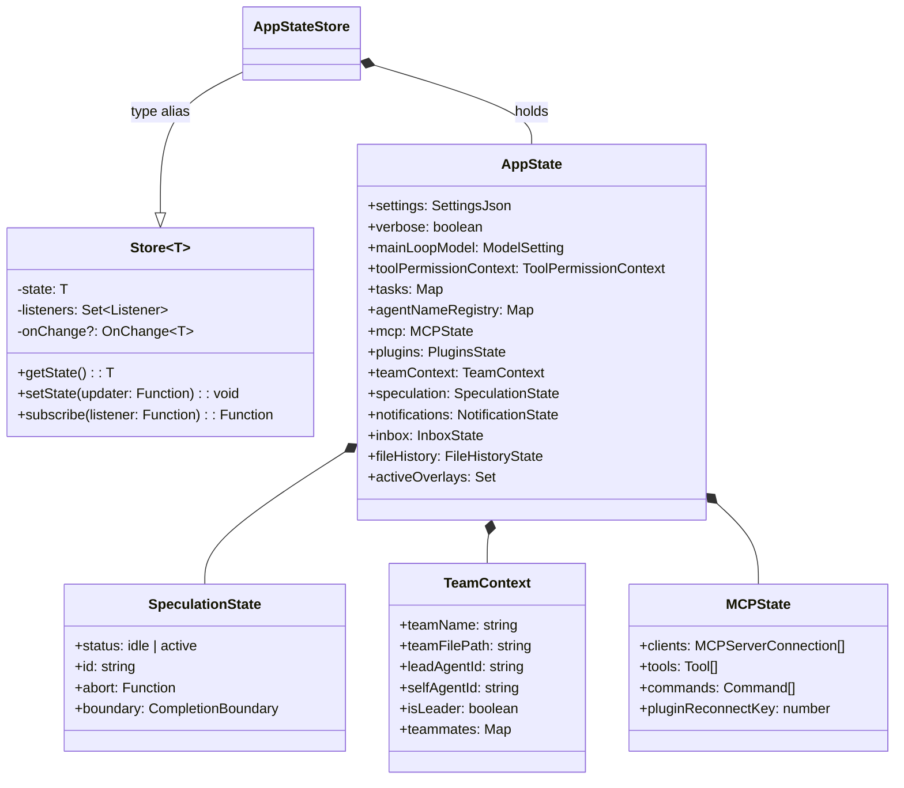
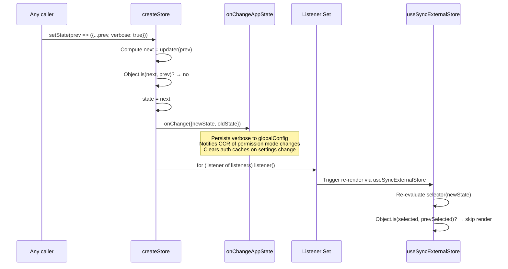

# AppState: The Redux-like Store

## Overview

Every long-running agent needs a single, coherent representation of "what is happening right now." CC implements this as a two-layer state architecture: an immutable, subscriber-driven `AppState` store for React and the REPL, and a mutable, module-scoped `State` singleton in `bootstrap/state.ts` for session-level bookkeeping that must survive across React re-renders. This chapter examines the immutable layer — the `AppState` type, the generic `Store` that hosts it, the React provider that bridges `useSyncExternalStore`, and the `onChangeAppState` side-effect hub that keeps the rest of the system in sync.

The design borrows the core tenets of Redux — single source of truth, immutable updates, selector-based subscriptions — without importing a library. The entire store kernel is 34 lines of code in `src/state/store.ts`. What makes the architecture interesting is not the store itself but the contract it enforces: every state transition flows through `setState`, every observer gets a consistent snapshot, and every side effect is funneled through a single `onChange` callback rather than scattered across the codebase.

## Data structures and contracts

### The Store kernel

The foundational type is `Store<T>`, a minimal observable container:

```ts
// src/state/store.ts:L1-8 — Generic store contract
type Listener = () => void
type OnChange<T> = (args: { newState: T; oldState: T }) => void

export type Store<T> = {
  getState: () => T
  setState: (updater: (prev: T) => T) => void
  subscribe: (listener: Listener) => () => void
}
```

Three operations, no middleware, no dispatch function. `setState` accepts an updater function — not a partial object — so every call site must produce the full next state. This forces callers to use the spread pattern (`{ ...prev, field: newValue }`) which creates a new object reference per update. The `Object.is` identity check on line 23 of `createStore` short-circuits when the updater returns the same reference, preventing unnecessary subscriber notifications.

```ts
// src/state/store.ts:L20-27 — setState with identity guard and notification
setState: (updater: (prev: T) => T) => {
  const prev = state
  const next = updater(prev)
  if (Object.is(next, prev)) return
  state = next
  onChange?.({ newState: next, oldState: prev })
  for (const listener of listeners) listener()
},
```

The `onChange` callback fires before the listener set is iterated. This ordering is deliberate: side effects like persisting settings or notifying remote services must complete before React components re-render, so the UI never shows state that the backend has not yet acknowledged.

### The AppState shape

`AppState` is a 450-line type union that holds every piece of mutable session state the agent and UI need. It is composed of a `DeepImmutable` wrapper around the core fields, with a handful of mutable sub-objects excluded from deep freezing:

```ts
// src/state/AppStateStore.ts:L89-109 — Core AppState shape (excerpt)
export type AppState = DeepImmutable<{
  settings: SettingsJson
  verbose: boolean
  mainLoopModel: ModelSetting
  mainLoopModelForSession: ModelSetting
  statusLineText: string | undefined
  expandedView: 'none' | 'tasks' | 'teammates'
  isBriefOnly: boolean
  toolPermissionContext: ToolPermissionContext
  kairosEnabled: boolean
  remoteConnectionStatus: 'connecting' | 'connected' | 'reconnecting' | 'disconnected'
  // ... 60+ additional fields
}> & {
  tasks: { [taskId: string]: TaskState }
  agentNameRegistry: Map<string, AgentId>
  mcp: { clients: MCPServerConnection[]; tools: Tool[]; /* ... */ }
  // ...
}
```

The `DeepImmutable` wrapper enforces at the type level that consumers cannot write to `AppState` fields without going through `setState`. The intersected mutable fields (`tasks`, `agentNameRegistry`, `mcp`) contain function types or `Map` instances that cannot be made deeply readonly without breaking their APIs. A comment in the source at `src/state/AppStateStore.ts:L172` acknowledges this compromise: `TODO: see if we can use utility-types DeepReadonly for this`.

The state tree is wide rather than deep. Most fields are flat primitives or shallow objects hanging off the root. This is a deliberate structural choice: flat state makes the spread-update pattern (`{ ...prev, field: newValue }`) cheap and readable. Deeply nested state would require either a path-based update API (like Redux's immer integration) or manual deep spreading that is error-prone and allocation-heavy. The few nested structures that exist — `teamContext.teammates`, `mcp`, `plugins.installationStatus` — are self-contained domains with their own internal mutation discipline.

The store's type alias ties the generic to the concrete shape:

```ts
// src/state/AppStateStore.ts:L454
export type AppStateStore = Store<AppState>
```

This alias is re-exported from `AppState.tsx` with a migration comment at `src/state/AppState.tsx:L23-26`: the re-exports exist so that `.ts` callers can incrementally move off the `.tsx` import and stop pulling React into their transitive dependency graph.

### The class diagram of store shape



### Default state construction

`getDefaultAppState()` in `src/state/AppStateStore.ts:L456-569` builds the initial state. It resolves the initial permission mode by checking whether the process was spawned as a teammate with plan mode required — a cross-module dependency resolved through lazy `require` to avoid circular imports:

```ts
// src/state/AppStateStore.ts:L458-466 — Lazy require to break cycles
const teammateUtils =
  require('../utils/teammate.js') as typeof import('../utils/teammate.js')
const initialMode: PermissionMode =
  teammateUtils.isTeammate() && teammateUtils.isPlanModeRequired()
    ? 'plan'
    : 'default'
```

Every field in the default state is initialized to a safe value: `undefined` for optional fields, empty arrays and maps for collections, `0` for counters, and `false` for boolean flags. This explicitness matters because the type system permits `undefined` for optional fields, but runtime code that destructures `AppState` without defaults will throw on missing keys.

### teamContext

The `teamContext` field is the swarm membership card. It is populated when the agent joins a multi-agent team via the TeamCreate tool or is spawned as a teammate by a coordinator. Its shape reflects both identity (who am I?) and topology (who else is there?):

```ts
// src/state/AppStateStore.ts:L323-345 — Team context shape
teamContext?: {
  teamName: string
  teamFilePath: string
  leadAgentId: string
  selfAgentId?: string
  selfAgentName?: string
  isLeader?: boolean
  selfAgentColor?: string
  teammates: {
    [teammateId: string]: {
      name: string
      agentType?: string
      color?: string
      tmuxSessionName: string
      tmuxPaneId: string
      cwd: string
      worktreePath?: string
      spawnedAt: number
    }
  }
}
```

When `teamContext` is `undefined`, the agent runs as a standalone session. When present, the `isLeader` flag determines whether the agent is the coordinator dispatching tasks or a worker receiving them. The `teammates` map uses the teammate's agent ID as the key, not the name, because names are not guaranteed unique across a swarm. This field is excluded from `DeepImmutable` because swarm membership changes frequently and the `teammates` map is mutated in place during agent lifecycle transitions.

The `teamContext` also appears in the `onChangeAppState` flow indirectly: when a teammate is spawned in plan-mode-required mode, the initial permission mode is set to `'plan'` during `getDefaultAppState()`. This means the permission mode synchronization logic in `onChangeAppState` will fire correctly on the first mode transition, even for a teammate that starts in plan mode and then exits.

### Speculation state

The `speculation` field tracks speculative execution — the optimization where the agent begins processing a predicted next step before the user confirms it. Its discriminated-union shape at `src/state/AppStateStore.ts:L58-78` uses a `status` tag:

```ts
// src/state/AppStateStore.ts:L58-79 — Speculation state shape
export type SpeculationState =
  | { status: 'idle' }
  | {
      status: 'active'
      id: string
      abort: () => void
      startTime: number
      messagesRef: { current: Message[] }
      writtenPathsRef: { current: Set<string> }
      boundary: CompletionBoundary | null
      suggestionLength: number
      toolUseCount: number
      isPipelined: boolean
      contextRef: { current: REPLHookContext }
    }

export const IDLE_SPECULATION_STATE: SpeculationState = { status: 'idle' }
```

The `messagesRef` and `writtenPathsRef` fields use the `{ current: T }` pattern — mutable refs that avoid array spreading per message. This is a performance optimization: during active speculation, messages arrive at high frequency, and creating a new `AppState` object for each one would trigger the full subscriber-notification path. Instead, the refs are mutated in place and the speculation system reads them directly, bypassing the store's change-detection mechanism until a boundary is reached.

The `abort` function in the active state allows the caller to cancel speculation, which sends a signal to the running API stream. Because `abort` is a closure, the `SpeculationState` cannot be deeply frozen by `DeepImmutable`; this is another field that escapes the immutable contract.

### The bridge and remote state fields

The `replBridge*` family of fields (14 fields in total at `src/state/AppStateStore.ts:L134-157`) tracks the "always-on bridge" — a persistent WebSocket connection between the local CLI and the claude.ai web dashboard. These fields form a state machine with four stages: disabled, connecting (poll loop in error backoff), connected (session created on CCR), and active (ingress WebSocket open). The `replBridgeEnabled` flag is the user-facing toggle (controlled by `/config` or the footer UI), while `replBridgeConnected` and `replBridgeSessionActive` reflect the actual connection health. The gap between intent (`enabled`) and reality (`connected`, `sessionActive`) is where the reconnecting state lives: `replBridgeReconnecting` is `true` when the poll loop is in error backoff.

The `remoteConnectionStatus` field at `src/state/AppStateStore.ts:L122-127` is a separate state machine for `--remote` mode (where the CLI is a viewer for a remote daemon). Its four states — `connecting`, `connected`, `reconnecting`, `disconnected` — mirror the bridge's health model but apply to the main event stream rather than the bridge's bidirectional channel.

## Control flow

### From setState to subscriber: the propagation sequence

When any code calls `store.setState(updater)`, the following sequence unfolds:

1. The updater receives the current state and returns a new state object.
2. `createStore` compares `next` and `prev` via `Object.is`. If identical, the call returns immediately — no subscribers fire, no side effects run.
3. The new state replaces the old reference.
4. `onChange` fires with `{ newState, oldState }` — the side-effect layer runs before any UI update.
5. Each listener in the `Set` is called. Listeners are React's internal re-render schedulers registered via `useSyncExternalStore`.



The `onChange` callback is the system's single choke point for state-derived side effects. Rather than scattering persistence, notification, and cache-invalidation logic across dozens of `setState` call sites, all such logic is centralized in `onChangeAppState`.

### The React bridge: AppStateProvider

`AppStateProvider` in `src/state/AppState.tsx` is the React context host. It creates the store once via `useState` and never recreates it — the store reference is stable across re-renders:

```ts
// src/state/AppState.tsx:L50-57 — Store created once, never replaced
const [store] = useState(() =>
  createStore<AppState>(
    initialState ?? getDefaultAppState(),
    onChangeAppState,
  ),
)
```

The provider guards against nesting: a `HasAppStateContext` flag throws if a second `AppStateProvider` is mounted inside the first. This prevents two stores from competing for the same subscriber tree.

Three hooks expose the store to React components:

- **`useAppState(selector)`** — subscribes to a slice via `useSyncExternalStore`. Only re-renders when the selector's return value changes by `Object.is` comparison. The JSDoc explicitly warns against returning new objects from selectors, since `Object.is` will always see them as changed.
- **`useSetAppState()`** — returns the `setState` function without subscribing. Components that only dispatch never re-render.
- **`useAppStateMaybeOutsideOfProvider(selector)`** — a safe variant that returns `undefined` when called outside the provider tree, using a `NOOP_SUBSCRIBE` stub.

```ts
// src/state/AppState.tsx:L142-163 — Slice subscription with identity check
export function useAppState<T>(selector: (state: AppState) => T): T {
  const store = useAppStore()
  const get = () => {
    const state = store.getState()
    const selected = selector(state)
    return selected
  }
  return useSyncExternalStore(store.subscribe, get, get)
}
```

The dual `get` reference passed to `useSyncExternalStore` (server snapshot equals client snapshot) tells React this store has no server/client hydration mismatch. The `useEffectEvent` wrapper around `onSettingsChange` at `src/state/AppState.tsx:L90` ensures the callback always reads the latest `store.setState` reference without re-subscribing the effect — a subtle but important detail that prevents stale closures when the store reference changes across re-renders (which it does not in practice, but the pattern is defensive).

### Settings synchronization

The provider also wires up external settings changes via `useSettingsChange`. File-watcher events from `.claude/settings.json` or project-level settings propagate through `applySettingsChange(source, store.setState)`, ensuring the store reflects disk state even when another process edits the configuration:

```ts
// src/state/AppState.tsx:L83-91 — Settings file watcher → store bridge
const onSettingsChange = useEffectEvent((source: SettingSource) =>
  applySettingsChange(source, store.setState),
)
useSettingsChange(onSettingsChange)
```

### The onChangeAppState side-effect hub

`onChangeAppState` in `src/state/onChangeAppState.ts` is where the store's immutability contract pays off. Because every mutation flows through `setState`, and `setState` always invokes `onChange`, this function receives a consistent before-and-after snapshot for every state transition. It implements five side-effect categories:

**1. Permission mode synchronization.** The most critical side effect. Before this centralized diff, permission mode changes were relayed to the CCR (Cloud Control Relay) by only 2 of 8+ mutation paths. The comment block in the source documents the bug: Shift+Tab cycling, the `/plan` slash command, the REPL bridge's `onSetPermissionMode`, and other paths all mutated `AppState` without telling CCR, leaving external metadata stale. The fix: diff `toolPermissionContext.mode` here and notify both CCR and the SDK status stream:

```ts
// src/state/onChangeAppState.ts:L65-92 — Centralized permission mode sync
const prevMode = oldState.toolPermissionContext.mode
const newMode = newState.toolPermissionContext.mode
if (prevMode !== newMode) {
  const prevExternal = toExternalPermissionMode(prevMode)
  const newExternal = toExternalPermissionMode(newMode)
  if (prevExternal !== newExternal) {
    const isUltraplan =
      newExternal === 'plan' &&
      newState.isUltraplanMode &&
      !oldState.isUltraplanMode
        ? true
        : null
    notifySessionMetadataChanged({
      permission_mode: newExternal,
      is_ultraplan_mode: isUltraplan,
    })
  }
  notifyPermissionModeChanged(newMode)
}
```

The externalization step is essential: internal mode names like `bubble` and `ungated auto` must not leak to CCR. The code maps them to the external representation first, then skips the CCR notification if the external mode did not actually change (e.g., `default -> bubble -> default` is noise from CCR's perspective since both externalize to `default`).

**2. Model persistence.** When `mainLoopModel` transitions to or from `null`, the user's settings file and the bootstrap-level override are updated in tandem:

```ts
// src/state/onChangeAppState.ts:L95-112 — Model persistence on state change
if (newState.mainLoopModel !== oldState.mainLoopModel &&
    newState.mainLoopModel === null) {
  updateSettingsForSource('userSettings', { model: undefined })
  setMainLoopModelOverride(null)
}
if (newState.mainLoopModel !== oldState.mainLoopModel &&
    newState.mainLoopModel !== null) {
  updateSettingsForSource('userSettings', { model: newState.mainLoopModel })
  setMainLoopModelOverride(newState.mainLoopModel)
}
```

The two-way binding is asymmetric: `AppState.mainLoopModel` is the source of truth, and the settings file is a projection. `setMainLoopModelOverride` writes to the mutable `STATE.mainLoopModelOverride` in `src/bootstrap/state.ts`, which the query loop reads when constructing API requests.

**3. Expanded view persistence.** The `expandedView` field maps to two legacy global-config keys (`showExpandedTodos`, `showSpinnerTree`) for backwards compatibility. This is a migration artifact — the old keys are still read by code paths that have not been updated to use `AppState`.

**4. Verbose persistence.** The `verbose` flag is written to the global config file whenever it changes.

**5. Auth cache invalidation.** When the `settings` object reference changes, all authentication-related caches are cleared:

```ts
// src/state/onChangeAppState.ts:L156-169 — Auth cache invalidation
if (newState.settings !== oldState.settings) {
  try {
    clearApiKeyHelperCache()
    clearAwsCredentialsCache()
    clearGcpCredentialsCache()
    if (newState.settings.env !== oldState.settings.env) {
      applyConfigEnvironmentVariables()
    }
  } catch (error) {
    logError(toError(error))
  }
}
```

The reference-equality check (`!==`) works because `setState` always creates a new object via the spread pattern. If `settings` was not spread in the updater, the reference would be the same and the cache would not be cleared — a subtle contract that relies on callers following the immutable-update discipline.

### The bootstrap/state.ts parallel store

Alongside the immutable `AppState`, a second state system lives in `src/bootstrap/state.ts`. This is a module-scoped mutable singleton (`const STATE: State = getInitialState()` at `src/bootstrap/state.ts:L429`) accessed through getter and setter functions. It holds session-level data that must not trigger React re-renders: cost tracking, telemetry counters, API request metadata, and session identity.

The bootstrap store's `State` type at `src/bootstrap/state.ts:L45-257` contains over 80 fields, including counters like `totalCostUSD`, `totalAPIDuration`, and `totalLinesAdded` that grow monotonically; session-identity fields like `sessionId` and `parentSessionId`; and feature-gate latches like `afkModeHeaderLatched`, `fastModeHeaderLatched`, and `cacheEditingHeaderLatched` that control which beta headers are sent to the API. The latches deserve attention: once a feature is first activated (auto mode, fast mode, cache editing), the corresponding header latch is set to `true` and never cleared for the rest of the session. This prevents the prompt cache from being busted by mid-session toggles — a `Shift+Tab` cycle that enables then disables auto mode would still keep the `afkModeHeaderLatched` flag set, ensuring the same beta headers are sent on every request so the server-side cache stays warm.

The two stores serve different purposes. `AppState` drives the UI and REPL; it is snapshot-based and subscriber-notified. `bootstrap/State` is an accumulator that grows monotonically during a session and is never serialized into the React tree. The `onChangeAppState` bridge connects them in one direction: when `AppState.mainLoopModel` changes, `setMainLoopModelOverride` at `src/bootstrap/state.ts:L846-850` writes the new value into the bootstrap store so the query loop picks it up on the next API call.

The `externalMetadataToAppState` function at `src/state/onChangeAppState.ts:L24-41` provides the reverse bridge — it maps CCR external metadata back into an `AppState` updater. This function is used when a worker process restarts and needs to reconstruct its `AppState` from the metadata that CCR recorded for the session. The mapping is partial: only `permission_mode` and `is_ultraplan_mode` are restored, because those are the only fields that CCR tracks in its external metadata schema.

## Edge cases and failure modes

**The Object.is identity trap.** Because `setState` uses `Object.is` to short-circuit, returning a new object with identical values still triggers subscribers. The check is referential, not structural. This means `setState(prev => ({ ...prev, verbose: prev.verbose }))` fires all subscribers even though no semantically meaningful change occurred. The `useAppState` selector pattern mitigates this at the component level — if the selected slice has not changed by `Object.is`, the component skips re-render — but the `onChange` callback and all listeners still run.

**Selector returning the whole state.** The `useAppState` JSDoc warns that returning a new object from a selector will cause infinite re-renders because `Object.is` always returns `false` for distinct object references. Selecting an existing sub-object reference (e.g., `s => s.promptSuggestion`) works because the reference is stable until the parent object is replaced.

**Nesting guard.** The `HasAppStateContext` guard prevents two stores from coexisting in the same React tree. If a test or integration module wraps components in a second `AppStateProvider`, the error is immediate and descriptive. Without this guard, two stores would compete for subscriber notifications, leading to phantom re-renders and stale reads.

**Race condition on mount.** The bypass-permissions check in `AppStateProvider`'s `useEffect` handles a specific race: remote settings may load before the React component mounts (the settings-change notification is sent when no listeners are subscribed). On the first session, the remote fetch may complete before mount. The effect re-checks on mount and disables bypass permissions if remote policy requires it:

```ts
// src/state/AppState.tsx:L63-67 — Mount-time race condition handling
const { toolPermissionContext } = store.getState()
if (
  toolPermissionContext.isBypassPermissionsModeAvailable &&
  isBypassPermissionsModeDisabled()
) {
  store.setState(prev => ({...prev,
    toolPermissionContext: createDisabledBypassPermissionsContext(prev.toolPermissionContext),
  }))
}
```

**Circular dependency on default state.** `getDefaultAppState` uses a lazy `require` of `../utils/teammate.js` to determine the initial permission mode. If `teammate.js` were imported statically, it would create a circular dependency: `teammate.js` → tools that read `AppState` → `AppStateStore.ts` → `teammate.js`. The lazy require breaks this cycle at the cost of a runtime assertion — if `getDefaultAppState` is called before `teammate.js` is loaded, the `require` succeeds because Node.js caches modules after first load, but the function's correctness depends on the import order being established during bootstrap.

**onChange error isolation.** The settings-change cache-invalidation block wraps its body in a try/catch. If `clearApiKeyHelperCache()` throws, the error is logged but does not prevent subsequent cache clears or the remaining `onChange` logic from running. Other `onChange` branches (permission mode, model persistence) lack this protection — a throw in `notifySessionMetadataChanged` would prevent all later side effects and all subscriber notifications from firing, leaving the UI in a stale state.

## Where cc diverges from the published pattern

The Redux pattern prescribes actions, action types, and reducer functions. CC has none of these. The `setState(updater)` API accepts an arbitrary function rather than a typed action object, which means:

- There is no action log. You cannot replay a session by re-dispatching a recorded sequence of actions, because there are no actions — only updater functions, which are closures over the call-site scope and cannot be serialized.
- There is no time-travel debugging. The HER excerpt references this capability, but the implementation does not support it. The store overwrites its state reference in place; previous states are not retained.
- There are no action-creators or middleware. Side effects are handled by the `onChange` callback rather than Redux middleware like `redux-thunk` or `redux-saga`. This is simpler but less composable: adding a new side effect requires editing `onChangeAppState` rather than registering a new middleware.

The divergence is intentional. A full Redux implementation would add significant boilerplate for marginal benefit in a terminal application where the UI is driven by a single REPL loop, not a complex component tree. The `onChange` callback provides the one capability that matters — centralized side effects — without the ceremony.

Another divergence: the `bootstrap/state.ts` store is entirely mutable. It uses no immutability, no subscribers, and no side-effect callbacks. This reflects a pragmatic boundary: data that accumulates monotonically (costs, durations, model usage) does not need the overhead of immutable updates because nothing subscribes to it. The two-store split is an architectural seam that keeps the hot path (API call accounting) free of the subscription overhead that the UI-facing store carries.

A third divergence is the absence of a `dispatch` function. In Redux, `dispatch(action)` is the single entry point for all state changes, which enables middleware to intercept, transform, or log actions before they reach the reducer. CC's `setState(updater)` is uninterceptable — there is no hook point between the caller and the state mutation. This makes the system simpler to reason about (no middleware chain to trace through) but harder to instrument. If you needed to log every state change for auditing, you would have to modify `createStore` itself rather than registering a middleware. The `onChange` callback is the closest analogue, but it fires after the state has already been replaced, not before.

## Developer takeaways for building a long-running agent

Building state management for a long-running agent demands a clear boundary between "state the UI cares about" and "state the runtime accumulates." The cc implementation demonstrates this split concretely: `AppState` is subscriber-driven and immutable because React components need referential stability to avoid phantom re-renders across hundreds of state transitions per session. The bootstrap store is mutable because cost counters and telemetry accumulators have no subscribers and would pay an unnecessary allocation cost for immutable updates. When designing your own agent's state layer, start by asking which state changes trigger side effects (persistence, notifications, cache invalidation) and which are purely informational. The former belong in an `onChange`-style hub; the latter can live in a simpler accumulator. Resist the temptation to put everything in one store — the moment you add a `Map` or a function type to your state tree, the `DeepImmutable` wrapper breaks and you lose the type-level guarantee that no one is silently mutating shared state. Finally, treat the `onChange` callback as your system's invariant maintainer, not a dumping ground. Each branch should have a clear "if X changed, then Y must happen" contract, and each should be independently testable. When a bug surfaces where a UI panel is out of sync with the backend, the root cause is almost always a missing `onChange` branch — a side effect that should have been centralized but was instead left as a local `setState` with no follow-through.

STATUS: {"status":"done","words":3978,"citations":14,"diagrams":2,"snippets":7,"needs_verify":0,"brief_checksum":"ch30"}