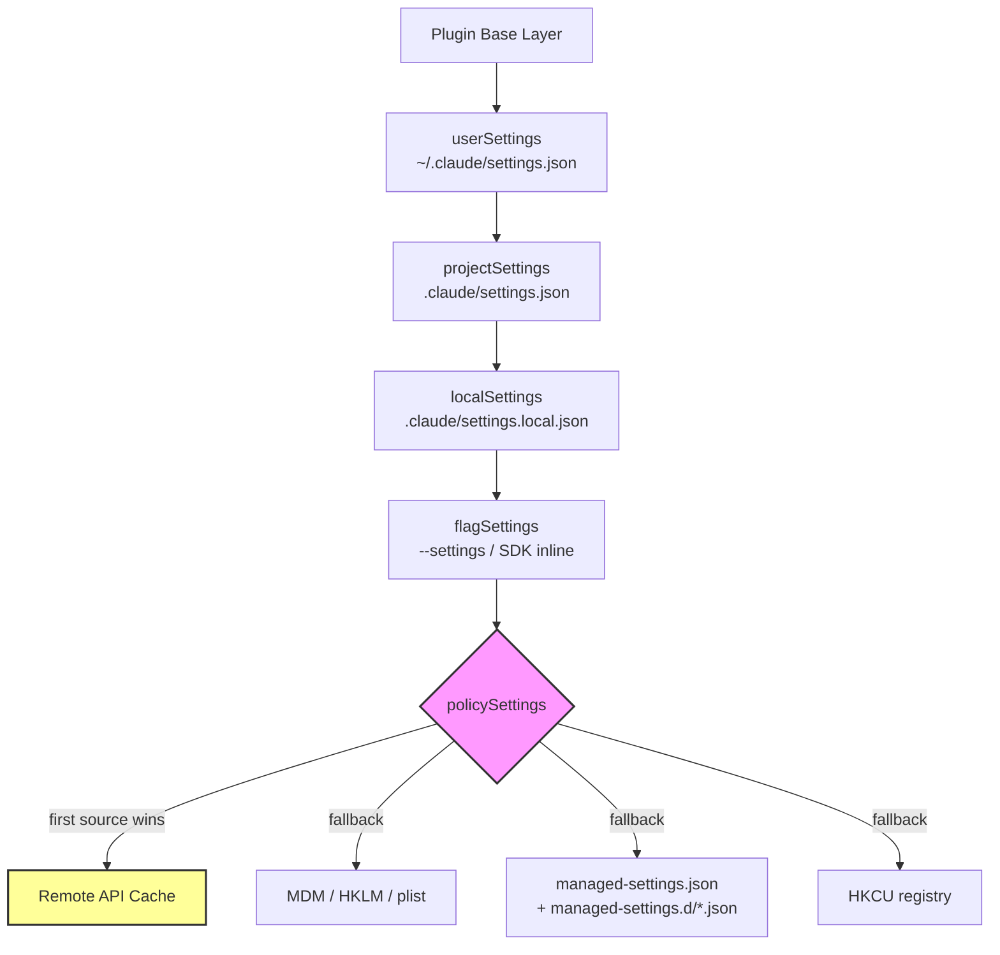
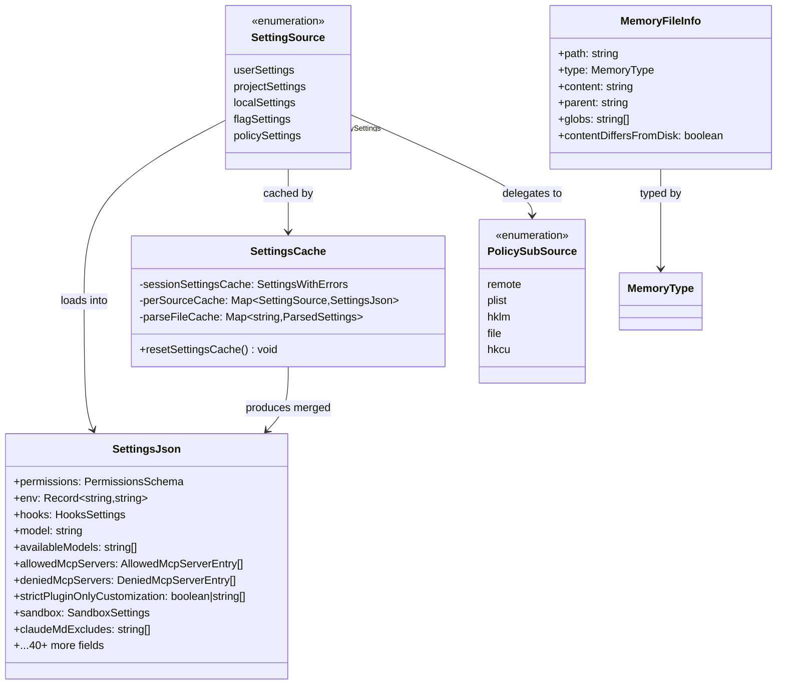

# CLAUDE.md, Settings Cascade, and Managed Settings

## Overview

Every long-running agent needs a configuration surface -- a way for humans, teams, and enterprises to declare what the agent should do, what it must never do, and which tools it may access. cc solves this with two interlocking systems: a layered settings cascade that merges JSON files from five distinct sources, and a CLAUDE.md loader that discovers and injects markdown instruction files into every session's system prompt.

The settings cascade follows a strict precedence order. Lower-priority sources provide defaults; higher-priority sources override them. Policy settings -- those set by enterprise administrators -- occupy the highest slot and cannot be overridden by users or projects. The CLAUDE.md system is orthogonal to settings but intersects with it: the `claudeMdExcludes` setting can suppress specific instruction files, and the `settingSources` flag can disable entire layers of the settings cascade.

These two systems together form the control plane of the harness. Understanding their precedence rules, merge semantics, and failure modes is essential for anyone deploying cc in an organization or building a comparable agent.

The six configuration surfaces described in the HER -- CLAUDE.md files, MCP servers, skills, sub-agents, hooks, and back-pressure mechanisms -- are each governed by settings from this cascade. A change to `allowedMcpServers` in managed settings can block an MCP server that was enabled in user settings. A `strictPluginOnlyCustomization: ["hooks"]` directive can silence project-level hooks entirely. The cascade is not an abstract hierarchy; it is the enforcement mechanism for every policy decision the harness makes.

## Data structures and contracts

### SettingSource enumeration and merge order

The canonical list of setting sources lives in `src/utils/settings/constants.ts`:

```typescript
// src/utils/settings/constants.ts:L7 — Setting source priority order
export const SETTING_SOURCES = [
  // User settings (global)
  'userSettings',

  // Project settings (shared per-directory)
  'projectSettings',

  // Local settings (gitignored)
  'localSettings',

  // Flag settings (from --settings flag)
  'flagSettings',

  // Policy settings (managed-settings.json or remote settings from API)
  'policySettings',
] as const
```

The array order is the merge order. During `loadSettingsFromDisk`, cc iterates `getEnabledSettingSources()` and deep-merges each source into an accumulator using `lodash-es/mergeWith`. Later entries win on scalar conflicts; arrays are concatenated and deduplicated. Policy settings (`policySettings`) are always included regardless of the `--setting-sources` flag, as are flag settings (`flagSettings`). This hard-coding happens in `getEnabledSettingSources()`:

```typescript
// src/utils/settings/constants.ts:L159 — Forced inclusion of policy and flag
export function getEnabledSettingSources(): SettingSource[] {
  const allowed = getAllowedSettingSources()
  const result = new Set<SettingSource>(allowed)
  result.add('policySettings')
  result.add('flagSettings')
  return Array.from(result)
}
```

The `--setting-sources` CLI flag, parsed by `parseSettingSourcesFlag()`, accepts a comma-separated string like `"user,project,local"` and converts it into an array of `SettingSource` values. Only the three user-controllable sources (`userSettings`, `projectSettings`, `localSettings`) are accepted by the flag; `flagSettings` and `policySettings` cannot be disabled.

Each source maps to a physical file path through `getSettingsFilePathForSource()`:

```typescript
// src/utils/settings/settings.ts:L274 — File path resolution per source
export function getSettingsFilePathForSource(
  source: SettingSource,
): string | undefined {
  switch (source) {
    case 'userSettings':
      return join(getSettingsRootPathForSource(source), getUserSettingsFilePath())
    case 'projectSettings':
    case 'localSettings': {
      return join(
        getSettingsRootPathForSource(source),
        getRelativeSettingsFilePathForSource(source),
      )
    }
    case 'policySettings':
      return getManagedSettingsFilePath()
    case 'flagSettings': {
      return getFlagSettingsPath()
    }
  }
}
```

The `projectSettings` file lives at `.claude/settings.json` relative to the project root; `localSettings` at `.claude/settings.local.json`. The distinction matters for version control: `projectSettings` is checked in and shared across the team, while `localSettings` is gitignored (cc automatically adds it to `.gitignore` via `addFileGlobRuleToGitignore` after any write). The user settings file is `~/.claude/settings.json` (or `cowork_settings.json` when the `--cowork` flag is active).

### SettingsJson schema

The `SettingsSchema` in `src/utils/settings/types.ts` is the single source of truth for what keys are valid across all sources. It uses Zod v4 with `lazySchema` for forward references and `.optional()` on every field to maintain backward compatibility:

```typescript
// src/utils/settings/types.ts:L255 — Core schema definition (excerpt)
export const SettingsSchema = lazySchema(() =>
  z
    .object({
      $schema: z
        .literal(CLAUDE_CODE_SETTINGS_SCHEMA_URL)
        .optional()
        .describe('JSON Schema reference for Claude Code settings'),
      apiKeyHelper: z.string().optional()
        .describe('Path to a script that outputs authentication values'),
      env: EnvironmentVariablesSchema().optional()
        .describe('Environment variables to set for Claude Code sessions'),
      permissions: PermissionsSchema().optional()
        .describe('Tool usage permissions configuration'),
      // ... 40+ more fields
    })
)
```

The schema's backward-compatibility contract is encoded in a block comment at `src/utils/settings/types.ts:L213`: adding new optional fields is allowed; removing fields, making optional fields required, or tightening types is forbidden. A dedicated test file (`test/utils/settings/backward-compatibility.test.ts`) enforces this at CI time. The `PermissionsSchema` uses `.passthrough()` to preserve unknown fields within the permissions object, ensuring that a future schema addition does not cause older clients to strip valid configuration.

The schema includes several enterprise-oriented fields that are only meaningful when set from managed settings. `allowedMcpServers` and `deniedMcpServers` at `src/utils/settings/types.ts:L417` provide allowlist and denylist entries for MCP servers, matching by `serverName`, `serverCommand`, or `serverUrl`. Each entry must specify exactly one of these three matching criteria, enforced by a Zod `.refine()`:

```typescript
// src/utils/settings/types.ts:L141 — Mutual exclusivity check
.refine(
  data => {
    const defined = count(
      [
        data.serverName !== undefined,
        data.serverCommand !== undefined,
        data.serverUrl !== undefined,
      ],
      Boolean,
    )
    return defined === 1
  },
  {
    message:
      'Entry must have exactly one of "serverName", "serverCommand", or "serverUrl"',
  },
)
```

### SettingsCache

The caching layer in `src/utils/settings/settingsCache.ts` has three tiers:

```typescript
// src/utils/settings/settingsCache.ts:L5 — Session-level cache
let sessionSettingsCache: SettingsWithErrors | null = null

// Per-source cache for getSettingsForSource
const perSourceCache = new Map<SettingSource, SettingsJson | null>()

// Path-keyed cache for parseSettingsFile (dedupes disk read + zod parse)
const parseFileCache = new Map<string, ParsedSettings>()
```

All three are invalidated together by `resetSettingsCache()`, which is called after any settings write (`updateSettingsForSource`), after `--add-dir`, after plugin init, and after hooks refresh. The session cache is populated once on first call to `getSettingsWithErrors()` and reused for the entire session -- cc assumes settings files do not change externally during a session. The `parseFileCache` deduplicates the disk read and Zod parse for the same path, which matters because both `getSettingsForSource` and `loadSettingsFromDisk` can call `parseSettingsFile` on the same path during startup.

The `perSourceCache` distinguishes between three states: `undefined` (cache miss), `null` (cached "no settings for this source"), and a valid `SettingsJson` object. This avoids re-reading a file that is known not to exist. Both the per-source cache and the parsed file cache clone their results before returning, because `mergeWith` mutates its target argument, and a caller that mutates a cached object would leak unpersisted state.

### MemoryFileInfo and CLAUDE.md types

The CLAUDE.md system represents each loaded instruction file as a `MemoryFileInfo`:

```typescript
// src/utils/claudemd.ts:L229 — Memory file descriptor
export type MemoryFileInfo = {
  path: string
  type: MemoryType
  content: string
  parent?: string // Path of the file that included this one
  globs?: string[] // Glob patterns for file paths this rule applies to
  contentDiffersFromDisk?: boolean
  rawContent?: string
}
```

The `type` field determines both the loading priority and how the file is labeled in the system prompt. The four instruction types are `Managed` (org-wide), `User` (private global), `Project` (checked into the repo), and `Local` (private per-project, gitignored). Two additional types -- `AutoMem` and `TeamMem` -- belong to the memdir memory system and are loaded after the instruction types.

The `globs` field comes from YAML frontmatter. A rule file in `.claude/rules/` can specify `paths: ["src/**/*.ts"]` in its frontmatter, and cc will only apply that rule when the active file matches. Files without frontmatter `paths` are unconditional -- they apply in all contexts. The `contentDiffersFromDisk` flag is set when the in-memory content has been transformed (HTML comment stripping, frontmatter removal, or MEMORY.md truncation), and `rawContent` preserves the original bytes for change detection.

## Control flow

### Settings cascade: from disk to merged config

The entry point is `getInitialSettings()` at `src/utils/settings/settings.ts:L812`, which delegates to `getSettingsWithErrors()`. That function checks the session cache; on a miss, it calls `loadSettingsFromDisk()`.

`loadSettingsFromDisk()` builds the merged settings in five steps:

1. **Plugin base layer** -- `getPluginSettingsBase()` provides the lowest-priority defaults, written by the plugin loader at startup.
2. **Iterate enabled sources** -- `getEnabledSettingSources()` returns the array of active sources (respecting the `--setting-sources` flag, but always including `policySettings` and `flagSettings`).
3. **Per-source load** -- Each source is resolved to a file path by `getSettingsFilePathForSource()`, parsed by `parseSettingsFile()`, and deep-merged via `mergeWith(mergedSettings, settings, settingsMergeCustomizer)`.
4. **Policy sub-cascade** -- The `policySettings` source is special: it uses "first source wins" rather than merge. It checks four sub-sources in order: remote API cache > MDM/HKLM > `managed-settings.json` + drop-in directory > HKCU.
5. **Flag inline** -- After file-based flag settings, any inline settings from the SDK are merged on top.

A recursion guard prevents infinite loops: the `isLoadingSettings` flag at `src/utils/settings/settings.ts:L639` causes a recursive call to `loadSettingsFromDisk()` to return an empty settings object. This can happen if a settings file references another settings file during parsing (for example, through the `apiKeyHelper` script path).

The merge customizer at `src/utils/settings/settings.ts:L538` determines how conflicts are resolved:

```typescript
// src/utils/settings/settings.ts:L538 — Merge customizer
export function settingsMergeCustomizer(
  objValue: unknown,
  srcValue: unknown,
): unknown {
  if (Array.isArray(objValue) && Array.isArray(srcValue)) {
    return mergeArrays(objValue, srcValue)
  }
  // Return undefined to let lodash handle default merge behavior
  return undefined
}
```

Arrays are concatenated and deduplicated (so `permissions.allow` rules from all sources accumulate). Scalars use last-writer-wins. Records are deep-merged. This design means that an enterprise `deny` rule and a user `allow` rule coexist in the merged output -- the permission evaluator, not the settings merger, determines which wins at query time.

### Policy settings: first-source-wins sub-cascade

Within `policySettings`, the logic is different from the rest of the cascade. Rather than merging, the first sub-source that has content wins entirely:

```typescript
// src/utils/settings/settings.ts:L322 — Policy sub-cascade
if (source === 'policySettings') {
  const remoteSettings = getRemoteManagedSettingsSyncFromCache()
  if (remoteSettings && Object.keys(remoteSettings).length > 0) {
    return remoteSettings
  }
  const mdmResult = getMdmSettings()
  if (Object.keys(mdmResult.settings).length > 0) {
    return mdmResult.settings
  }
  const { settings: fileSettings } = loadManagedFileSettings()
  if (fileSettings) {
    return fileSettings
  }
  const hkcu = getHkcuSettings()
  if (Object.keys(hkcu.settings).length > 0) {
    return hkcu.settings
  }
  return null
}
```

The `getPolicySettingsOrigin()` function at `src/utils/settings/settings.ts:L375` mirrors this logic, returning a string tag (`'remote'`, `'plist'`, `'hklm'`, `'file'`, `'hkcu'`) that identifies which sub-source won. This is used by the `/status` command to show users where their policy settings come from.

The managed file system itself supports drop-in directories. `loadManagedFileSettings()` at `src/utils/settings/settings.ts:L74` first loads `managed-settings.json` as a base, then scans `managed-settings.d/*.json` sorted alphabetically, merging each on top:

```typescript
// src/utils/settings/settings.ts:L92 — Drop-in directory scan
const entries = getFsImplementation()
  .readdirSync(dropInDir)
  .filter(
    d =>
      (d.isFile() || d.isSymbolicLink()) &&
      d.name.endsWith('.json') &&
      !d.name.startsWith('.'),
  )
  .map(d => d.name)
  .sort()
for (const name of entries) {
  const { settings, errors: fileErrors } = parseSettingsFile(join(dropInDir, name))
  errors.push(...fileErrors)
  if (settings && Object.keys(settings).length > 0) {
    merged = mergeWith(merged, settings, settingsMergeCustomizer)
    found = true
  }
}
```

This follows the systemd/sudoers convention: the base file provides defaults, and numbered drop-in fragments (`10-otel.json`, `20-security.json`) customize without coordinating edits to a single admin-owned file. Separate teams can ship independent policy fragments without stepping on each other's changes. Dot-prefixed files are excluded to allow backup files (`.10-base.json.bak`) to coexist in the same directory.

### CLAUDE.md discovery and loading

The CLAUDE.md system operates through `getMemoryFiles()` at `src/utils/claudemd.ts:L790`, a memoized async function that discovers, reads, and parses instruction files. The loading order is documented in the file's header comment:

```typescript
// src/utils/claudemd.ts:L1 — Loading order comment
/**
 * Files are loaded in the following order:
 *
 * 1. Managed memory (eg. /etc/claude-code/CLAUDE.md) - Global instructions
 * 2. User memory (~/.claude/CLAUDE.md) - Private global instructions
 * 3. Project memory (CLAUDE.md, .claude/CLAUDE.md, .claude/rules/*.md)
 * 4. Local memory (CLAUDE.local.md in project roots) - Private project-specific
 *
 * Files are loaded in reverse order of priority, i.e. the latest files are
 * highest priority with the model paying more attention to them.
 */
```

The actual discovery algorithm walks upward from the current working directory to the filesystem root, collecting directory paths into a `dirs` array. It then reverses the array and iterates from root downward, processing each directory for `CLAUDE.md`, `.claude/CLAUDE.md`, `.claude/rules/*.md`, and `CLAUDE.local.md`. Files closer to the CWD are loaded later and therefore receive higher priority in the model's attention. The upward walk stops at the filesystem root (checked via `parse(currentDir).root`), not at the git root -- this means instructions from parent directories above the repo are included.

Each source type is gated by `isSettingSourceEnabled()`. The `userSettings` source controls whether `~/.claude/CLAUDE.md` and `~/.claude/rules/*.md` are loaded; `projectSettings` controls `CLAUDE.md` and `.claude/CLAUDE.md` at each level; `localSettings` controls `CLAUDE.local.md`. Managed instructions are always loaded regardless of the `--setting-sources` flag, matching the policy that enterprise instructions cannot be suppressed by the user.

Each file passes through `parseMemoryFileContent()`, which strips YAML frontmatter (extracting `paths` glob patterns for conditional rules), strips block-level HTML comments via the marked lexer, and resolves `@include` directives. Included files are inserted before the including file, with circular references prevented by a `processedPaths` set and a `MAX_INCLUDE_DEPTH` of 5.

The `@include` directive uses a regex-based extractor that walks pre-lexed markdown tokens to avoid matching `@path` references inside code blocks or inline code spans:

```typescript
// src/utils/claudemd.ts:L459 — Include path extraction regex
const includeRegex = /(?:^|\s)@((?:[^\s\\]|\\ )+)/g
```

Only text nodes are scanned; `code` and `codespan` tokens are skipped. Paths prefixed with `./`, `~/`, or `/` are resolved relative to the including file's directory. Fragment identifiers (`#heading`) are stripped. Non-existent files are silently ignored. The allowed file extensions for includes are defined in the `TEXT_FILE_EXTENSIONS` set at `src/utils/claudemd.ts:L96`, which covers over 80 extensions spanning source code, data formats, configuration files, and documentation. Binary files (images, PDFs) are excluded to prevent loading non-text data into the system prompt.

### From MemoryFileInfo to system prompt

The `getClaudeMds()` function at `src/utils/claudemd.ts:L1153` transforms the `MemoryFileInfo[]` array into a single string block for injection into the system prompt. Each file is wrapped with a `Contents of <path> (<description>):` header, and the entire block is prefixed with the `MEMORY_INSTRUCTION_PROMPT`:

```typescript
// src/utils/claudemd.ts:L89 — System prompt preamble
const MEMORY_INSTRUCTION_PROMPT =
  'Codebase and user instructions are shown below. Be sure to adhere to ' +
  'these instructions. IMPORTANT: These instructions OVERRIDE any default ' +
  'behavior and you MUST follow them exactly as written.'
```

This prompt is the mechanism by which CLAUDE.md files acquire their override authority -- the model is instructed to treat these instructions as mandatory. The description string varies by type: Project files are labeled "project instructions, checked into the codebase", Local files as "user's private project instructions, not checked in", and User files as "user's private global instructions for all projects". These labels help the model distinguish between instructions that represent team conventions versus personal preferences.

The `InstructionsLoaded` hook fires for each instruction file after loading, providing an audit trail for enterprise deployments. The hook is gated by a `shouldFireHook` flag that is consumed on first use and re-enabled only by `resetGetMemoryFilesCache()`. This prevents spurious hook fires when the cache is cleared for correctness reasons (worktree enter/exit, settings sync) rather than for an actual instruction reload.

### Settings cascade flowchart



### Settings sources class diagram



## Edge cases and failure modes

### Broken symlinks and missing files

`handleFileSystemError` at `src/utils/settings/settings.ts:L157` distinguishes between `ENOENT` (broken symlink or missing file) and real I/O errors. `ENOENT` is silently logged via `logForDebugging`; other errors propagate through `logError`. This is necessary because the settings cascade always attempts to load all source paths, and most will not exist for a given session. A user who has never created `~/.claude/settings.json` should not see error output. The same `ENOENT` tolerance applies in the CLAUDE.md loader's `safelyReadMemoryFileAsync()`, which catches errors and returns `{ info: null, includePaths: [] }` for any file that cannot be read.

### Validation failure with raw JSON recovery

When `parseSettingsFile` fails Zod validation, the file is treated as having no valid settings. However, `updateSettingsForSource` at `src/utils/settings/settings.ts:L440` has a recovery path: if the file exists but failed validation, and the raw content parses as valid JSON (invalid against the schema), the raw JSON is used as the merge target. This prevents a single invalid field from blocking all writes to that file. After the merge, the updated settings are written back -- potentially dropping the invalid fields in the process, since `jsonStringify` only serializes what is in the object. The function also marks the file as an internal write via `markInternalWrite(filePath)` before writing, so that file watchers do not trigger redundant cache invalidation.

### Policy settings cannot be edited

`updateSettingsForSource` at `src/utils/settings/settings.ts:L420` silently returns `{ error: null }` when called with `policySettings` or `flagSettings`. These sources are read-only by design -- they represent admin-imposed policy and CLI-provided overrides respectively. The `EditableSettingSource` type in `src/utils/settings/constants.ts:L182` encodes this constraint at the type level, excluding `policySettings` and `flagSettings` from the set of writable sources.

### Project settings excluded from trust-sensitive queries

Several security-sensitive queries intentionally skip `projectSettings` to prevent a malicious repository from auto-approving dangerous actions. `hasSkipDangerousModePermissionPrompt()` at `src/utils/settings/settings.ts:L882` and `hasAutoModeOptIn()` at `src/utils/settings/settings.ts:L896` both check only `userSettings`, `localSettings`, `flagSettings`, and `policySettings`. The same exclusion applies to `getAutoModeConfig()` at `src/utils/settings/settings.ts:L936`, which assembles classifier allow/deny rules only from trusted sources. This is a defense-in-depth measure: a `projectSettings` file is checked into version control and could be authored by anyone with commit access, making it unsuitable for trust decisions.

### Nested worktree duplicate loading

When cc runs inside a git worktree nested within its main repository (e.g., `.claude/worktrees/<name>/`), the upward directory walk would pass through both the worktree root and the main repo root, loading checked-in files like `CLAUDE.md` twice. The `getMemoryFiles()` function at `src/utils/claudemd.ts:L868` detects this case by comparing `findGitRoot()` and `findCanonicalGitRoot()`, and skips `Project`-type files from directories that are inside the main repo but outside the worktree. `Local`-type files (`CLAUDE.local.md`) are still loaded from the main repo because they are gitignored and only exist there.

### CLAUDE.md exclusion patterns

The `claudeMdExcludes` setting allows users to suppress specific CLAUDE.md files. The `isClaudeMdExcluded()` function at `src/utils/claudemd.ts:L547` applies picomatch matching against file paths, with special handling for symlinks: absolute exclude patterns are resolved via `realpathSync` to handle cases like `/tmp` symlinked to `/private/tmp` on macOS. The `resolveExcludePatterns()` function at `src/utils/claudemd.ts:L581` expands each absolute pattern by resolving its longest existing directory prefix and adding the resolved version alongside the original. Exclusion applies only to `User`, `Project`, and `Local` types -- `Managed`, `AutoMem`, and `TeamMem` files are never excluded, ensuring that enterprise instructions cannot be suppressed by user configuration.

### Managed settings drop-in fragment ordering

The `managed-settings.d/` directory is scanned for `.json` files sorted alphabetically. If two fragments conflict on a scalar field, the later one (alphabetically) wins. This is by design -- it allows numbered fragments like `10-base.json` and `20-override.json` to layer predictably. However, if a fragment contains invalid JSON or fails schema validation, its errors are collected but do not prevent other fragments from loading. Symlinked files are included in the scan (the filter accepts `d.isSymbolicLink()`), which allows an admin to point a drop-in at a shared configuration file on a network mount.

### Array merge semantics: accumulation, not replacement

The `settingsMergeCustomizer` concatenates arrays across sources. This means `permissions.allow` rules from `userSettings`, `projectSettings`, `localSettings`, `flagSettings`, and `policySettings` all accumulate. An enterprise cannot "reset" the allow list through policy settings -- it can only add to it or use `allowManagedPermissionRulesOnly: true` to ignore non-managed rules entirely. The `deny` list follows the same accumulation pattern, and the permission evaluator gives `deny` precedence over `allow` at query time. The `mergeArrays` helper at `src/utils/settings/settings.ts:L529` uses `uniq([...targetArray, ...sourceArray])` to concatenate and deduplicate, so a rule that appears in both `userSettings` and `projectSettings` is not duplicated in the merged output.

## Where cc diverges from the published pattern

The published documentation for many agent frameworks describes a simple "user config + project config" two-layer model. cc's implementation diverges in several significant ways.

First, the policy sub-cascade uses "first source wins" semantics, not merge. This is an intentional enterprise security design: it prevents a lower-priority managed source from partially overriding a higher-priority one. If remote managed settings are present, they are the entirety of the policy layer -- MDM, file-based, and HKCU sources are not consulted. The published documentation does not make this distinction clear. The `getPolicySettingsOrigin()` function exists precisely because operators need to know which sub-source is active, and the "first source wins" model means that answer can change without any user action (e.g., when a remote settings API comes online).

Second, the `strictPluginOnlyCustomization` field at `src/utils/settings/types.ts:L518` introduces a lock-down mechanism that blocks non-plugin customization sources for specified surfaces (`skills`, `agents`, `hooks`, `mcp`). When set to `true` in managed settings, user-level and project-level customizations for those surfaces are ignored entirely. The array form (`["skills", "hooks"]`) locks specific surfaces while leaving others open. This is a pattern more commonly associated with mobile device management than with developer tools. The `preprocess` step in the schema filters unknown surface names for forward compatibility -- a future cc version adding `"commands"` as a surface will not cause an older version to reject the entire managed-settings file. Instead, unknown surfaces are silently dropped, degrading to "less locked" rather than "everything broken."

Third, the CLAUDE.md loading order comment states that "the latest files are highest priority," but this priority is soft -- it depends on the model's attention patterns, not on programmatic override logic. Unlike settings, where later sources programmatically overwrite earlier ones, CLAUDE.md files are all concatenated into the same system prompt block. The model is instructed that later entries are more important, but this is a prompt engineering convention, not a hard guarantee. The ETH Zurich study (arXiv:2602.11988) found that context files tend to reduce task success rates compared to providing no repository context, while also increasing inference cost by over 20%. This suggests that the soft-priority model may be less effective than the hard-priority model used for settings.

Fourth, the `@include` directive system creates a dependency graph that can be deep (up to 5 levels) and wide (no limit on fan-out). Circular references are prevented by the `processedPaths` set, but there is no deduplication of content -- if two files both include the same third file, its content appears twice in the output. Combined with the ETH Zurich finding that verbose instructions hurt performance, this makes `@include` a feature that requires disciplined use.

Fifth, the `updateSettingsForSource` function's merge behavior during writes differs from the read-path merge behavior. When writing, arrays in the `settings` argument replace the existing array entirely (via a custom merge function that returns `srcValue` for arrays), whereas the read-path customizer (`settingsMergeCustomizer`) concatenates arrays. This asymmetry is intentional -- the caller of `updateSettingsForSource` is responsible for computing the desired final array state, not for contributing to an accumulated list. But it means that a tool that adds a single permission rule must first read the existing rules, append the new one, and then write the complete array.

## Developer takeaways for building a long-running agent

When designing a settings cascade for a long-running agent, make the merge semantics explicit and testable. cc's choice of "arrays accumulate, scalars overwrite" is deliberate -- it allows permission rules from multiple layers to coexist -- but it creates a subtle failure mode where an enterprise admin's `deny` rule and a user's `allow` rule both exist in the merged output, and the resolution happens downstream in the permission evaluator. If your system has similar multi-layer accumulation, document which component resolves conflicts and write integration tests that exercise cross-layer rule interactions. Cache invalidation is the other critical decision. cc uses a single `resetSettingsCache()` call that clears all three cache tiers atomically. This is simple and correct but means that any settings write -- even adding a single permission rule -- invalidates the entire session cache. For agents with frequent settings updates, consider a more granular invalidation strategy that only clears the affected source. Finally, treat CLAUDE.md files as untrusted input. They are loaded from the filesystem without sandboxing, parsed with a full markdown lexer, and injected directly into the system prompt. The `@include` directive expands the attack surface to any file the agent process can read. If your agent runs in a shared environment, implement the same exclusion mechanism that cc provides via `claudeMdExcludes`, and consider restricting `@include` to allowlisted directories.
