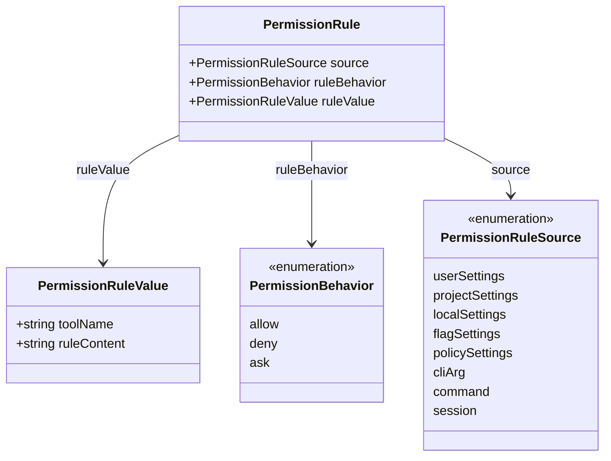
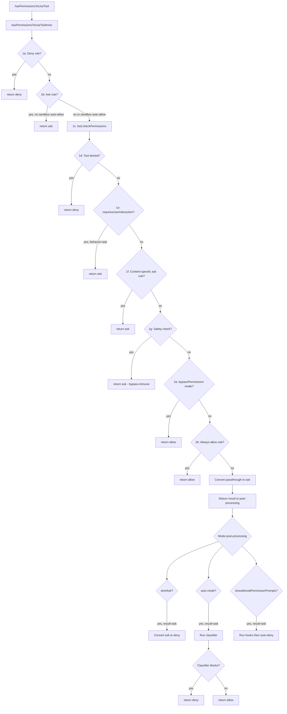

# The Permission Model: Modes and Rules

## Overview

Every tool invocation in cc passes through a permission gate before execution. This gate is governed by two orthogonal mechanisms: the session-level **permission mode** (default, plan, acceptEdits, bypassPermissions, dontAsk, auto) and the **permission rules** (allow, deny, ask) loaded from settings files, CLI arguments, and session state. The mode determines *how* the agent responds when a tool needs approval; the rules determine *whether* a tool needs approval in the first place. Together, they implement the human-in-the-loop tiered escalation described in HER section 11: deterministic checks at Tier 1, agent self-correction at Tier 2, and human approval at Tiers 3 and 4.

The permission model is also the primary defense against prompt injection (HER section 6.13). Even if a malicious file manipulates the agent into requesting a destructive command, the model ensures that command cannot execute without explicit approval. Least-privilege rules limit the blast radius of any successful injection, and safety checks on sensitive paths (.git/, .claude/) are bypass-immune, requiring human confirmation regardless of mode.

This chapter traces the full lifecycle: how modes are declared and configured, how rules are parsed from strings and evaluated in a strict ordering, and how auto mode's classifier integrates an AI-driven decision layer on top of the deterministic rule engine.

## Data structures and contracts

### Permission modes

The mode enumeration lives in `src/types/permissions.ts`, split between external and internal surfaces. External modes are the user-addressable set exposed through settings.json, CLI flags, and conversation recovery. Internal modes add `auto` and `bubble`, which are gated behind feature flags and only available in certain build configurations.

```typescript
// src/types/permissions.ts:L16-29
export const EXTERNAL_PERMISSION_MODES = [
  'acceptEdits',
  'bypassPermissions',
  'default',
  'dontAsk',
  'plan',
] as const

export type ExternalPermissionMode = (typeof EXTERNAL_PERMISSION_MODES)[number]
export type InternalPermissionMode = ExternalPermissionMode | 'auto' | 'bubble'
export type PermissionMode = InternalPermissionMode
```

The external set is deliberately ordered alphabetically, not by privilege level. The internal set conditionally includes `auto` only when the `TRANSCRIPT_CLASSIFIER` feature flag is active. The `bubble` mode exists at the type level but has no runtime config entry.

Each mode carries display metadata -- title, short title, symbol, color key, and its external projection -- in a `PermissionModeConfig` record defined in `src/utils/permissions/PermissionMode.ts`.

```typescript
// src/utils/permissions/PermissionMode.ts:L34-44
type PermissionModeConfig = {
  title: string
  shortTitle: string
  symbol: string
  color: ModeColorKey
  external: ExternalPermissionMode
}

const PERMISSION_MODE_CONFIG: Partial<
  Record<PermissionMode, PermissionModeConfig>
> = {
```

The `Partial<Record<...>>` type means not every mode requires a config entry. Modes without an explicit config fall back to the `default` entry via `getModeConfig`, which returns `PERMISSION_MODE_CONFIG[mode] ?? PERMISSION_MODE_CONFIG.default!`. The `auto` mode is conditionally included based on the `TRANSCRIPT_CLASSIFIER` feature flag. The `isExternalPermissionMode` function ensures that `auto` is never exposed to non-ant users: if `process.env.USER_TYPE !== 'ant'`, all modes are considered external; otherwise, `auto` and `bubble` are excluded.

### Permission rules

A permission rule is a triple: where it came from (source), what it does (behavior), and what it targets (value).

```typescript
// src/types/permissions.ts:L53-79
export type PermissionRuleSource =
  | 'userSettings'
  | 'projectSettings'
  | 'localSettings'
  | 'flagSettings'
  | 'policySettings'
  | 'cliArg'
  | 'command'
  | 'session'

export type PermissionRuleValue = {
  toolName: string
  ruleContent?: string
}

export type PermissionRule = {
  source: PermissionRuleSource
  ruleBehavior: PermissionBehavior
  ruleValue: PermissionRuleValue
}
```

The `PermissionBehavior` union is `'allow' | 'deny' | 'ask'`. A rule with no `ruleContent` targets the entire tool (e.g., `Bash` denies all Bash usage). A rule with `ruleContent` targets a specific sub-operation (e.g., `Bash(npm publish)` asks before publishing). The `PermissionRuleSource` hierarchy matters for precedence: deny rules always take priority over allow rules, and within each behavior, rules from all sources are flattened into a single list.



### Tool permission context

The `ToolPermissionContext` bundles everything the permission pipeline needs: the current mode, rule sets indexed by source, additional working directories, and flags like `isBypassPermissionsModeAvailable` and `shouldAvoidPermissionPrompts`.

```typescript
// src/types/permissions.ts:L427-441
export type ToolPermissionContext = {
  readonly mode: PermissionMode
  readonly additionalWorkingDirectories: ReadonlyMap<
    string,
    AdditionalWorkingDirectory
  >
  readonly alwaysAllowRules: ToolPermissionRulesBySource
  readonly alwaysDenyRules: ToolPermissionRulesBySource
  readonly alwaysAskRules: ToolPermissionRulesBySource
  readonly isBypassPermissionsModeAvailable: boolean
  readonly strippedDangerousRules?: ToolPermissionRulesBySource
  readonly shouldAvoidPermissionPrompts?: boolean
  readonly awaitAutomatedChecksBeforeDialog?: boolean
  readonly prePlanMode?: PermissionMode
}
```

The `alwaysAllowRules`, `alwaysDenyRules`, and `alwaysAskRules` fields are each a `ToolPermissionRulesBySource` -- a partial map from source to an array of rule strings. This indexing by source enables the `syncPermissionRulesFromDisk` function to clear disk-based sources (userSettings, projectSettings, localSettings) and replace them atomically without touching in-memory sources (cliArg, session). The `prePlanMode` field stores the mode that was active before entering plan mode, so exiting plan mode can restore it.

### Decision and result types

The pipeline returns a `PermissionDecision`, which is one of three variants: `PermissionAllowDecision`, `PermissionAskDecision`, or `PermissionDenyDecision`. There is also `PermissionResult`, which adds a `passthrough` variant -- used internally when a tool's `checkPermissions` has no opinion and wants to defer to the default behavior.

Every decision carries a `decisionReason` that explains *why* the decision was made. This is critical for auditability and for the permission prompt UI, which displays the reason to the user. The `PermissionDecisionReason` is a tagged union with variants for rules (`'rule'`), mode (`'mode'`), hooks (`'hook'`), classifiers (`'classifier'`), safety checks (`'safetyCheck'`), subcommand results (`'subcommandResults'`), and more.

## Control flow

### Permission mode state diagram

The six modes form a privilege lattice. `default` sits at the bottom, requiring approval for most operations. `plan` enforces read-only during exploration. `acceptEdits` auto-approves file edits in the working directory but still asks for shell commands. `auto` uses an AI classifier to decide. `dontAsk` converts all asks to denies. `bypassPermissions` allows everything except bypass-immune safety checks.

```mermaid
stateDiagram-v2
    [*] --> default
    default --> plan : EnterPlanModeTool
    default --> acceptEdits : /accept-edits
    default --> auto : --permission-mode auto (flag)
    default --> dontAsk : dontAsk session flag
    default --> bypassPermissions : --dangerously-skip-permissions (flag)

    plan --> default : ExitPlanModeTool
    plan --> acceptEdits : /accept-edits
    plan --> bypassPermissions : if isBypassPermissionsModeAvailable

    acceptEdits --> default : /accept-edits (toggle off)
    acceptEdits --> plan : EnterPlanModeTool

    auto --> default : session end / mode change
    dontAsk --> default : session end / mode change
    bypassPermissions --> default : session end / mode change

    state "bypass-immune checks" as immune {
        [*] --> still_asks
    }

    note right of immune
        Safety checks on .git/, .claude/,
        shell configs always prompt
        regardless of mode
    end note
```

Transitions between modes are triggered by tools (EnterPlanModeTool), slash commands (/accept-edits), CLI flags, or session state. The `plan` mode is special because it can inherit `bypassPermissions` behavior: if the user originally started with `--dangerously-skip-permissions` and then entered plan mode, `isBypassPermissionsModeAvailable` is true, and the plan mode will bypass permissions rather than enforce read-only.

### The permission check pipeline

The core function is `hasPermissionsToUseTool` at `src/utils/permissions/permissions.ts:L473`. It delegates to `hasPermissionsToUseToolInner`, which runs a strict sequence of checks, then applies mode-based post-processing. The pipeline is a waterfall: the first check that produces a deny or ask short-circuits the rest.



The numbered steps in the code comments (1a through 2b) correspond to the flowchart nodes. The key invariant is that **deny always wins first**: step 1a checks deny rules before anything else, and step 1d checks tool-implementation denies. This means even if a tool has an allow rule, a deny rule from any source will block it.

Steps 1f and 1g are the bypass-immune checks. A content-specific ask rule (e.g., `Bash(npm publish:*)`) forces a prompt even in `bypassPermissions` mode. Safety checks on sensitive paths (`.git/`, `.claude/`, `.vscode/`, shell configurations) are also bypass-immune. This is the implementation of HER section 12's principle of privilege boundaries: certain operations are too dangerous to automate away.

Step 2a checks whether the current mode should bypass all remaining checks. The condition is either direct `bypassPermissions` mode or `plan` mode when `isBypassPermissionsModeAvailable` is true. Step 2b is the last chance for an automatic allow: if the tool has an always-allow rule matching the entire tool (not a prefix rule), it is permitted.

### Rule evaluation: parsing and matching

Rules are stored as strings in settings files (e.g., `"Bash(npm install)"` in the `alwaysAllowRules` array). The `permissionRuleValueFromString` function in `src/utils/permissions/permissionRuleParser.ts` parses these strings into `PermissionRuleValue` objects.

```typescript
// src/utils/permissions/permissionRuleParser.ts:L93-133
export function permissionRuleValueFromString(
  ruleString: string,
): PermissionRuleValue {
  const openParenIndex = findFirstUnescapedChar(ruleString, '(')
  if (openParenIndex === -1) {
    return { toolName: normalizeLegacyToolName(ruleString) }
  }

  const closeParenIndex = findLastUnescapedChar(ruleString, ')')
  if (closeParenIndex === -1 || closeParenIndex <= openParenIndex) {
    return { toolName: normalizeLegacyToolName(ruleString) }
  }

  if (closeParenIndex !== ruleString.length - 1) {
    return { toolName: normalizeLegacyToolName(ruleString) }
  }

  const toolName = ruleString.substring(0, openParenIndex)
  const rawContent = ruleString.substring(openParenIndex + 1, closeParenIndex)

  if (!toolName) {
    return { toolName: normalizeLegacyToolName(ruleString) }
  }

  if (rawContent === '' || rawContent === '*') {
    return { toolName: normalizeLegacyToolName(toolName) }
  }

  const ruleContent = unescapeRuleContent(rawContent)
  return { toolName: normalizeLegacyToolName(toolName), ruleContent }
}
```

The parser is defensive: any malformed input (missing closing paren, content after the closing paren, empty tool name) falls back to treating the entire string as a tool name. Empty or wildcard content (`Bash()` or `Bash(*)`) is normalized to a tool-wide rule. Parentheses inside content are escaped with backslashes (`\(`, `\)`) and the parser uses `findFirstUnescapedChar` and `findLastUnescapedChar` to locate the structural delimiters. The escaping order matters: backslashes are escaped first, then parentheses, so that `psycopg2.connect()` becomes `psycopg2.connect\(\)` in storage.

The `normalizeLegacyToolName` function maps old tool names to their current canonical names. When a tool is renamed (e.g., `Task` to `Agent`), the alias is added to `LEGACY_TOOL_NAME_ALIASES` so existing permission rules continue to work.

Rule matching happens in `toolMatchesRule` at `src/utils/permissions/permissions.ts:L238`. A rule without `ruleContent` matches the entire tool by name. For MCP tools, the matching supports both fully-qualified names (`mcp__server__tool`) and server-level wildcards (`mcp__server1__*` matches all tools from that server). This lets administrators grant or revoke access at the server granularity without enumerating every tool.

### Auto mode and the classifier

Auto mode is the most complex permission mode. When the inner pipeline returns `ask`, auto mode intercepts the result and runs an AI classifier to decide whether to allow or deny the operation. Before invoking the classifier, several fast-path optimizations skip the expensive API call.

The fast paths, evaluated in order, are:

1. **Safety check bypass**: Non-classifier-approvable safety checks (Windows path bypass, cross-machine bridge messages) are immune to auto-approve and return `ask` immediately.

2. **acceptEdits fast-path**: The tool's `checkPermissions` is re-run with `acceptEdits` mode. If the result would be `allow`, the operation is auto-approved without calling the classifier. This avoids an API call for safe operations like file edits.

3. **Safe-tool allowlist**: Tools on the `isAutoModeAllowlistedTool` list are auto-approved. These are tools that are inherently safe (read-only operations, etc.).

Only after all fast paths fail does the system invoke `classifyYoloAction`, which sends the conversation transcript and the proposed action to an AI model. The classifier returns a `YoloClassifierResult` with `shouldBlock`, `reason`, and metadata about token usage and latency.

```typescript
// src/utils/permissions/permissions.ts:L688-702
const action = formatActionForClassifier(tool.name, input)
setClassifierChecking(toolUseID)
let classifierResult
try {
  classifierResult = await classifyYoloAction(
    context.messages,
    action,
    context.options.tools,
    appState.toolPermissionContext,
    context.abortController.signal,
  )
} finally {
  clearClassifierChecking(toolUseID)
}
```

The `setClassifierChecking`/`clearClassifierChecking` calls bracket the classifier invocation so the UI can display a checking indicator. The classifier has its own failure modes: if the API is unavailable, the `tengu_iron_gate_closed` feature flag determines whether to fail closed (deny with retry guidance) or fail open (fall back to normal prompting). If the transcript exceeds the classifier's context window, the system falls back to prompting in interactive mode or throws an `AbortError` in headless mode, because the transcript will only grow and retrying would be futile.

### Denial tracking

Auto mode tracks consecutive and total denials to prevent runaway loops. The `DenialTrackingState` at `src/utils/permissions/denialTracking.ts` is a simple counter pair.

```typescript
// src/utils/permissions/denialTracking.ts:L7-15
export type DenialTrackingState = {
  consecutiveDenials: number
  totalDenials: number
}

export const DENIAL_LIMITS = {
  maxConsecutive: 3,
  maxTotal: 20,
} as const
```

When the classifier blocks an action, `recordDenial` increments both counters. When the classifier allows an action, `recordSuccess` resets the consecutive counter. When consecutive denials reach 3 or total denials reach 20, `shouldFallbackToPrompting` returns true, and the system falls back to prompting the user in interactive mode or throws an `AbortError` in headless mode. This implements HER section 12's rate-limiting safety pattern: a compromised or confused agent cannot silently deny forever, and eventually the human is brought back into the loop.

The `handleDenialLimitExceeded` function at `src/utils/permissions/permissions.ts:L984` preserves the original classifier reason so the user can see what was blocked. When the total limit is hit, it also resets both counters so the user gets a fresh start after reviewing the transcript.

### Rule-based permission subset

The `checkRuleBasedPermissions` function at `src/utils/permissions/permissions.ts:L1071` exposes a subset of the pipeline that respects deny and ask rules but skips mode-based transformations, the classifier, and bypass checks. This is used by `bypassPermissions` mode itself: even when permissions are bypassed, deny rules (step 1a), tool-implementation denies (step 1d), content-specific ask rules (step 1f), and safety checks (step 1g) are still enforced. The function returns null if no rule objects, letting the caller proceed to mode-based logic.

## Edge cases and failure modes

### MCP tool name collisions

When the `CLAUDE_AGENT_SDK_MCP_NO_PREFIX` flag is set, MCP tools have unprefixed display names that can collide with builtin names (e.g., an MCP tool named "Write" vs. the builtin Write tool). The `toolMatchesRule` function handles this by using `getToolNameForPermissionCheck`, which returns the fully-qualified `mcp__server__tool` name for MCP tools. Rules targeting builtin names will not accidentally match their MCP replacements, and vice versa.

### PowerShell in auto mode

PowerShell is excluded from the auto mode classifier by default. The guard at `src/utils/permissions/permissions.ts:L572` checks `tool.name === POWERSHELL_TOOL_NAME && !feature('POWERSHELL_AUTO_MODE')` and returns the `ask` result directly, skipping the classifier. The rationale is that PowerShell commands like `iex (iwr ...)` (download and execute) are inherently dangerous and should not be auto-approved without specific safeguards. When `POWERSHELL_AUTO_MODE` is enabled, PowerShell flows through to the classifier with additional deny guidance appended to the classifier prompt.

### Agent and REPL bypass immunity

The `Agent` and `REPL` tools skip the acceptEdits fast-path in auto mode. The code at `src/utils/permissions/permissions.ts:L600` explicitly excludes them: `tool.name !== AGENT_TOOL_NAME && tool.name !== REPL_TOOL_NAME`. The reason is that their `checkPermissions` returns `allow` for acceptEdits mode, which would silently bypass the classifier. For REPL, the concern is that JavaScript code can contain VM escapes between inner tool calls, and the classifier must see the full glue code, not individual inner calls.

### Headless agent permission denial

When `shouldAvoidPermissionPrompts` is true (e.g., for background or async agents), the pipeline cannot show a permission prompt. Before auto-denying, it runs `runPermissionRequestHooksForHeadlessAgent` at `src/utils/permissions/permissions.ts:L400` to give hooks a chance to allow or deny. Only if no hook provides a decision does the system auto-deny with `AUTO_REJECT_MESSAGE`. This ensures that automated workflows can still be governed by hooks even when interactive prompts are unavailable.

### Session-to-disk rule synchronization

The `syncPermissionRulesFromDisk` function at `src/utils/permissions/permissions.ts:L1419` handles the case where rules are modified on disk while a session is running. It first clears all disk-based source-behavior combinations, then applies the new rules. This prevents stale rules from persisting when a user removes a rule from settings: without the clear step, `convertRulesToUpdates` would only generate `replaceRules` for source-behavior pairs that have rules, and an empty group would produce no update, leaving old rules in the context.

When `shouldAllowManagedPermissionRulesOnly` is enabled, the function also clears all non-policy sources (userSettings, projectSettings, localSettings, cliArg, session) before applying disk rules. This enforces enterprise policy: only policy settings can define rules, and user/project overrides are stripped.

## Where cc diverges from the published pattern

The published HER pattern (section 11) describes a clean four-tier escalation model where each tier is independent and deterministic. cc's implementation diverges in several ways:

First, the `auto` mode introduces a non-deterministic tier between Tier 1 (automated checks) and Tier 2 (agent self-correction). The classifier is an AI model that can make different decisions on the same input, and its failure modes (unavailable API, context window overflow) are handled by feature flags rather than the tiered escalation pattern. The `tengu_iron_gate_closed` flag controls whether classifier failures fail closed or fail open, which is a deployment-level decision rather than an architectural one.

Second, the bypass-immune checks (steps 1f and 1g) violate the strict tier separation. In the published pattern, bypassing permissions should bypass all checks below a certain tier. In cc, content-specific ask rules and safety checks are enforced even in `bypassPermissions` mode, creating a "tier 0" that cannot be overridden by any mode. This is a deliberate safety decision: certain operations (editing `.git/` contents, running `npm publish`) are too dangerous to automate away, regardless of the user's privilege level.

Third, the `dontAsk` mode is not a separate privilege level but a post-processing transformation that converts `ask` results to `deny`. This means a tool that would normally prompt the user is silently denied, with no feedback mechanism. The published pattern would recommend converting `ask` to `deny` with a reason and a suggestion for how to grant permission, but `dontAsk` uses a generic `DONT_ASK_REJECT_MESSAGE` without suggestions.

Fourth, the rule source hierarchy is flattened rather than strictly ordered. The `getAllowRules`, `getDenyRules`, and `getAskRules` functions concatenate rules from all sources into a single list using `PERMISSION_RULE_SOURCES` order, but the only strict precedence is that deny rules (step 1a) are checked before allow rules (step 2b). Within the same behavior, rules from different sources are treated equally: a `userSettings` allow rule has the same weight as a `cliArg` allow rule.

## Developer takeaways for building a long-running agent

The permission model in cc demonstrates a critical design principle for long-running agents: the permission pipeline must be a strict waterfall with well-defined short-circuit points, not a scoring system or a weighted vote. Deny always wins first, bypass-immune checks always win over mode settings, and every decision carries a machine-readable reason. When building your own agent, implement the pipeline as a numbered sequence of checks where each step returns a terminal decision or falls through to the next. Avoid the temptation to collect votes from multiple sources and aggregate them; the ordering semantics (deny before allow, safety before convenience) are what make the system auditable and predictable. For auto-approve paths, layer fast-path optimizations (deterministic checks, allowlists, mode-based shortcuts) before any expensive AI classifier call, and always implement fail-closed behavior with a feature flag to switch to fail-open during incidents. Track denial counts with both consecutive and total limits, and fall back to human prompting when limits are exceeded -- this prevents both runaway approval loops and silent denial storms. Finally, treat rule synchronization as a replace-not-merge operation: when settings change on disk, clear the affected source-behavior combinations atomically before applying new rules, or stale entries will persist indefinitely.

STATUS: {"status":"done","words":5547,"citations":8,"diagrams":3,"snippets":6,"needs_verify":0,"brief_checksum":"ch32"}
