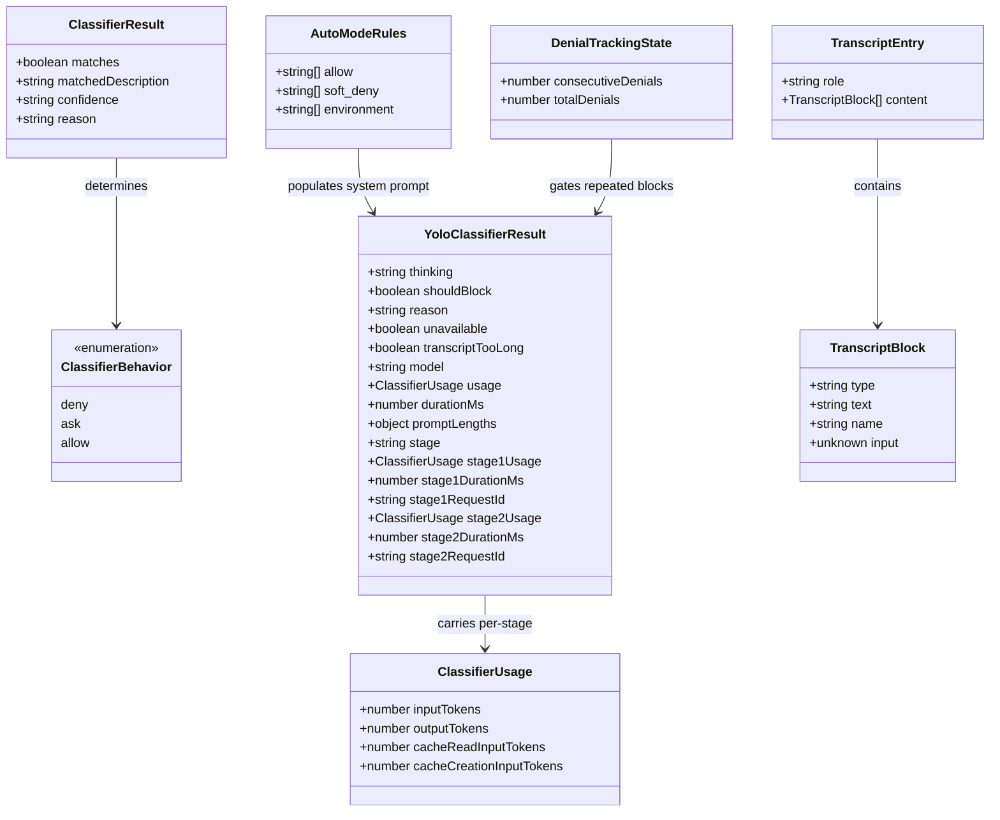
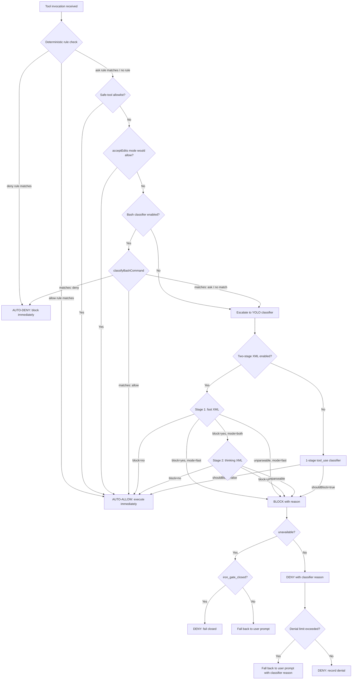

# Bash Classifier and YOLO Scoring

## Overview

When a long-running agent operates autonomously, every shell command it emits must be vetted before execution. CC implements this vetting through two complementary classifiers: a deterministic **bash classifier** that maps commands to risk bands via pattern matching, and an LLM-backed **YOLO classifier** that evaluates the full conversational context to decide whether a proposed action should be blocked. The bash classifier, at 61 lines, is the stub visible in external builds; the YOLO classifier, at nearly 1500 lines, is the production engine that powers the `auto` permission mode. Together they implement what HER §5 calls Command Risk Classification -- a deterministic pre-parsing layer that prevents prompt injection from bypassing security, and a contextual evaluation layer that can distinguish between a destructive `rm -rf /` in one context and a safe `rm build_artifact.tmp` in another.

The key architectural insight is the separation of concerns: deterministic checks never delegate to the model, because a model under prompt injection could classify a malicious command as safe. The YOLO classifier sits above the deterministic layer and can override it only in the permissive direction (allowing actions the deterministic layer flagged as ambiguous), never in the dangerous direction. This two-tier design reflects the security principle articulated in HER §12.4: use deterministic validation, not LLM judgment, for security-critical decisions.

The bash classifier in the external build is a 61-line stub. Every function returns a disabled default: `isClassifierPermissionsEnabled()` returns `false`, `getBashPromptDenyDescriptions()` returns an empty array, and `classifyBashCommand()` returns `{ matches: false, confidence: 'high', reason: 'This feature is disabled' }`. The stub exists to break a build-time dependency cycle and to provide the type contracts that `yoloClassifier.ts` imports. The real deterministic matching happens at the permission rule layer in `permissions.ts`. The bash classifier is the ANT-only build variant that adds semantic command matching on top of the rule system.

The YOLO classifier powers the `auto` permission mode, where the agent operates without per-action user confirmation. In auto mode, every tool invocation that would normally trigger an `ask` prompt is instead routed to the YOLO classifier, which evaluates the action against the conversation history and the permission rules. The classifier's `shouldBlock` boolean becomes the gate: `false` means allow, `true` means deny. When the classifier is unavailable due to an API error, the system defaults to blocking -- a fail-closed posture that prevents the agent from running unchecked when its security oracle is down.

## Data structures and contracts

The classifier pipeline is built on three core types. The bash classifier exports `ClassifierResult`, which captures whether a rule matched and with what confidence:

```typescript
// src/utils/permissions/bashClassifier.ts:L5 — Bash classifier result type
export type ClassifierResult = {
  matches: boolean
  matchedDescription?: string
  confidence: 'high' | 'medium' | 'low'
  reason: string
}
```

Every classification returns one of three confidence levels. A `high`-confidence match on a deny rule blocks immediately. A `low`-confidence match escalates to the YOLO classifier. A `medium`-confidence match may proceed depending on the configured `ClassifierBehavior`. The `ClassifierBehavior` type at `src/utils/permissions/bashClassifier.ts:L12` defines the three-band outcome:

```typescript
// src/utils/permissions/bashClassifier.ts:L12 — Classifier behavior bands
export type ClassifierBehavior = 'deny' | 'ask' | 'allow'
```

These three bands map directly to the permission system's three outcomes. A `deny` result blocks the action without further evaluation. An `allow` result passes the action through to execution. An `ask` result defers to the next layer -- in auto mode, this means the YOLO classifier.

The bash classifier also exports a `PROMPT_PREFIX` constant and helper functions for managing prompt-based rules:

```typescript
// src/utils/permissions/bashClassifier.ts:L3 — Prompt prefix for classifier rules
export const PROMPT_PREFIX = 'prompt:'

export function createPromptRuleContent(description: string): string {
  return `${PROMPT_PREFIX} ${description.trim()}`
}
```

The `prompt:` prefix convention allows permission rules to carry a natural-language description of what the rule allows or denies. For example, a rule `Bash(prompt: "list files in project directory")` matches any bash command that the classifier determines fits that description. The `extractPromptDescription` function parses the description out of a rule content string; in the external stub, it always returns `null`.

The YOLO classifier returns a far richer result. The `YoloClassifierResult` type at `src/types/permissions.ts:L346` carries the decision, the reason, telemetry data, and stage-by-stage breakdown:

```typescript
// src/types/permissions.ts:L346 — YOLO classifier result
export type YoloClassifierResult = {
  thinking?: string
  shouldBlock: boolean
  reason: string
  unavailable?: boolean
  transcriptTooLong?: boolean
  model: string
  usage?: ClassifierUsage
  durationMs?: number
  promptLengths?: {
    systemPrompt: number
    toolCalls: number
    userPrompts: number
  }
  errorDumpPath?: string
  stage?: 'fast' | 'thinking'
  stage1Usage?: ClassifierUsage
  stage1DurationMs?: number
  stage1RequestId?: string
  stage1MsgId?: string
  stage2Usage?: ClassifierUsage
  stage2DurationMs?: number
  stage2RequestId?: string
  stage2MsgId?: string
}
```

The `unavailable` flag is the critical safety signal. When the classifier API fails -- network error, rate limit, server error -- `unavailable` is set to `true` and `shouldBlock` is set to `true`. This implements fail-closed semantics: if the security oracle cannot be reached, the system blocks the action rather than allowing it through. The `transcriptTooLong` flag handles a different failure mode: the serialized conversation exceeds the classifier model's context window, producing a deterministic 400 error from the API. Unlike transient failures, this error will not resolve on retry because the transcript only grows.

The `stage` field records which classifier stage produced the final decision. The `stage1*` and `stage2*` fields carry per-stage telemetry: token usage, duration, and API request/message IDs. These enable post-hoc analysis of classifier cost and latency, and the request IDs allow joining analytics events to server-side API logs.

The `ClassifierUsage` type at `src/types/permissions.ts:L339` tracks the token economics of each classifier call:

```typescript
// src/types/permissions.ts:L339 — Classifier token usage tracking
export type ClassifierUsage = {
  inputTokens: number
  outputTokens: number
  cacheReadInputTokens: number
  cacheCreationInputTokens: number
}
```

The cache-aware breakdown distinguishes between uncached input tokens (expensive), cache-read tokens (cheap), and cache-creation tokens (moderately expensive). The permission system at `src/utils/permissions/permissions.ts:L726` computes a dollar cost from these numbers for overhead telemetry.

The `AutoModeRules` type at `src/utils/permissions/yoloClassifier.ts:L85` defines the three sections of the classifier prompt that users can customize:

```typescript
// src/utils/permissions/yoloClassifier.ts:L85 — Auto mode rule sections
export type AutoModeRules = {
  allow: string[]
  soft_deny: string[]
  environment: string[]
}
```

These three arrays -- allow, soft_deny, and environment -- correspond to the `<user_allow_rules_to_replace>`, `<user_deny_rules_to_replace>`, and `<user_environment_to_replace>` tags in the classifier's system prompt template. When user rules are present, they replace the template defaults entirely (external template) or append to them (Anthropic-internal template). The `environment` array carries contextual information about the user's setup -- for example, "This project uses Docker and requires `docker build` commands" -- that helps the classifier make informed decisions about commands that are ambiguous in isolation.

The `TranscriptEntry` type at `src/utils/permissions/yoloClassifier.ts:L291` defines the shape of the conversation history that gets serialized for the classifier:

```typescript
// src/utils/permissions/yoloClassifier.ts:L291 — Transcript entry for classifier
export type TranscriptBlock =
  | { type: 'text'; text: string }
  | { type: 'tool_use'; name: string; input: unknown }

export type TranscriptEntry = {
  role: 'user' | 'assistant'
  content: TranscriptBlock[]
}
```

This is a deliberately reduced representation of the full `Message` type. Assistant text blocks are excluded because model-authored text could be crafted to influence the classifier -- only `tool_use` blocks from assistant turns survive the projection. User text messages are included because they represent the user's intent. This is a direct mitigation for the indirect prompt injection threat described in HER §12.4: a malicious instruction embedded in a file the agent reads could influence the model's next action, but it cannot influence the classifier through the assistant's own words.



## Control flow

The classifier decision tree proceeds through four layers, from fastest and most deterministic to slowest and most contextual. Each layer can short-circuit: once a layer produces a definitive allow or deny, no further layers are consulted.



### Pre-classifier fast paths

Before the YOLO classifier is invoked, the permission system at `src/utils/permissions/permissions.ts` runs three fast-path checks that skip the expensive API call entirely.

The **safe-tool allowlist** at `src/utils/permissions/permissions.ts:L660` checks whether the tool name appears on a hardcoded list of tools that pose no security risk. Tools like `Read` or `Glob` that only observe without modifying state are allowlisted. When a tool is on the allowlist, the permission system returns `behavior: 'allow'` with `confidence: 'high'` and `fastPath: 'allowlist'`, bypassing the classifier.

The **acceptEdits shortcut** at `src/utils/permissions/permissions.ts:L600` checks whether the action would be allowed in `acceptEdits` mode. This avoids expensive classifier API calls for safe operations like file edits in the working directory. The check re-runs the tool's `checkPermissions` method with the mode overridden to `acceptEdits`. If that mode would allow the action, the classifier is skipped. Two tools are excluded from this shortcut: the `Agent` tool and the `REPL` tool, because their `checkPermissions` returns `allow` in acceptEdits mode, which would silently bypass the classifier. REPL code can contain VM escapes between inner tool calls; the classifier must see the full context.

The **PowerShell guard** at `src/utils/permissions/permissions.ts:L572` blocks PowerShell commands from reaching the classifier unless the `POWERSHELL_AUTO_MODE` build feature flag is enabled. Without the flag, PowerShell requires interactive approval because the classifier's prompt templates were originally designed for Bash commands. When enabled, the classifier prompt receives PowerShell-specific deny guidance (at `src/utils/permissions/yoloClassifier.ts:L1402`) that maps PowerShell idioms to the existing BLOCK categories.

### Transcript construction and encoding

The YOLO classifier's entry point is `classifyYoloAction` at `src/utils/permissions/yoloClassifier.ts:L1012`. Its first task is to format the proposed action as a `TranscriptEntry` via `formatActionForClassifier` at `src/utils/permissions/yoloClassifier.ts:L1487`, then serialize it to a compact string representation.

The `buildTranscriptEntries` function at `src/utils/permissions/yoloClassifier.ts:L302` converts the full message history into the reduced `TranscriptEntry[]` format. It handles three message types: `attachment` messages with `queued_command` type are extracted as user text turns; `user` messages yield their text blocks; `assistant` messages yield only their `tool_use` blocks, discarding model-authored text.

The `toCompactBlock` function at `src/utils/permissions/yoloClassifier.ts:L384` serializes each transcript block into a compact string. For `tool_use` blocks, it calls the tool's `toAutoClassifierInput` method, which each tool implements to project only the security-relevant fields. For example, the Bash tool projects its `command` field; the FileWrite tool projects its `file_path` and `content` fields. Tools that declare no security relevance return `''`, which causes the block to be omitted entirely.

When the JSONL transcript format is enabled (via the `jsonlTranscript` GrowthBook flag), each block is serialized as a JSON dict: `{"Bash":"ls -la"}` for tool calls, `{"user":"fix the tests"}` for user text. The JSON escaping ensures that hostile content in tool inputs cannot break out of its string context to forge a fake user message line. Without JSONL, the older text-prefix format is used: `Bash "ls -la"` for tools, `User: fix the tests` for user text.

### System prompt assembly

The `buildYoloSystemPrompt` function at `src/utils/permissions/yoloClassifier.ts:L484` assembles the classifier's system prompt from three components: the base prompt template, the permissions template (external or Anthropic-internal), and the user's custom rules.

The function first determines which permissions template to use via `isUsingExternalPermissions` at `src/utils/permissions/yoloClassifier.ts:L71`. External users always get the external template; Anthropic-internal users get the Anthropic template unless the `forceExternalPermissions` GrowthBook flag is set for dogfooding.

The template substitution uses a tag-replacement pattern. Each section of the permissions template wraps its defaults in `<user_*_to_replace>` tags:

```typescript
// src/utils/permissions/yoloClassifier.ts:L517 — Template substitution
const userAllow = allowDescriptions.length
  ? allowDescriptions.map(d => `- ${d}`).join('\n')
  : undefined
// ...
return systemPrompt
  .replace(
    /<user_allow_rules_to_replace>([\s\S]*?)<\/user_allow_rules_to_replace>/,
    (_m, defaults: string) => userAllow ?? defaults,
  )
```

When the user has provided custom rules, those rules replace the tag content entirely. When the user has not provided custom rules, the defaults inside the tags are kept. This means the external template's defaults are self-contained within the tags, while the Anthropic template's defaults live outside the tags and are augmented by user-provided values.

The allow descriptions come from two sources: the bash classifier's `getBashPromptAllowDescriptions` (when the `BASH_CLASSIFIER` feature flag is enabled and the user is on the Anthropic-internal template) and the `autoMode.allow` settings array. The deny descriptions similarly merge bash classifier deny rules, PowerShell-specific deny guidance, and the `autoMode.soft_deny` settings.

### Two-stage XML classifier

The two-stage XML classifier at `src/utils/permissions/yoloClassifier.ts:L711` implements a fast-then-thorough pattern. Stage 1 sends a compact prompt with `max_tokens=64` and a `</block>` stop sequence, asking for an immediate `<block>yes</block>` or `<block>no</block>`. If stage 1 returns "allow," the action proceeds without waiting for stage 2. If stage 1 returns "block," stage 2 runs with `max_tokens=4096`, chain-of-thought reasoning, and a more deliberate suffix:

```typescript
// src/utils/permissions/yoloClassifier.ts:L550 — Stage 1: nudge for immediate decision
const XML_S1_SUFFIX = '\nErr on the side of blocking. <block> immediately.'

// src/utils/permissions/yoloClassifier.ts:L560 — Stage 2: deliberate reasoning
const XML_S2_SUFFIX =
  '\nReview the classification process and follow it carefully, making sure ' +
  'you deny actions that should be blocked. As a reminder, explicit (not ' +
  'suggestive or implicit) user confirmation is required to override blocks. ' +
  'Use <thinking> before responding with <block>.'
```

Stage 1 errs on the side of blocking; stage 2 provides the second chance. This asymmetry reduces false-positive blocks while maintaining the safety property that dangerous actions must face at least one barrier. The transcript content is shared across both stages, and prompt caching ensures the second stage gets a cache hit on the full prefix.

The `TwoStageMode` type at `src/utils/permissions/yoloClassifier.ts:L1308` controls which stages run:

```typescript
// src/utils/permissions/yoloClassifier.ts:L1308 — Two-stage mode selector
type TwoStageMode = 'both' | 'fast' | 'thinking'
```

The `'both'` mode (default) runs stage 1 then conditionally stage 2. The `'fast'` mode runs only stage 1 with a higher `max_tokens` of 256 so it can include a `<reason>` tag, and its verdict is final. The `'thinking'` mode skips stage 1 entirely and goes straight to the deliberative stage 2. The mode is resolved from environment variables (`CLAUDE_CODE_TWO_STAGE_CLASSIFIER`) and GrowthBook feature flags at `src/utils/permissions/yoloClassifier.ts:L1353`.

The classifier model is resolved by `getClassifierModel` at `src/utils/permissions/yoloClassifier.ts:L1334`. The resolution order is: ANT-only environment variable `CLAUDE_CODE_AUTO_MODE_MODEL`, then GrowthBook JSON config override, then the main loop model. This allows the classifier to run on a cheaper or faster model than the main agent.

### Result interpretation and denial tracking

When the classifier returns a result, the permission system at `src/utils/permissions/permissions.ts:L818` interprets it through several branching paths.

A `shouldBlock: true` result with `transcriptTooLong: true` falls back to normal user prompting rather than retrying. The transcript cannot shrink, so retrying is pointless. In headless mode (where `shouldAvoidPermissionPrompts` is true), this triggers an `AbortError` to prevent an infinite deny-retry-deny loop.

A `shouldBlock: true` with `unavailable: true` checks the `tengu_iron_gate_closed` feature flag at `src/utils/permissions/permissions.ts:L847`. When true, the system fails closed and denies the action with a message explaining the classifier is unavailable. When false, it fails open and falls back to normal permission handling, presenting the user with an approval prompt.

When the classifier actively blocks an action (not unavailable, not transcript overflow), the denial tracking system at `src/utils/permissions/denialTracking.ts` records the denial. The `DENIAL_LIMITS` constant defines the thresholds:

```typescript
// src/utils/permissions/denialTracking.ts:L12 — Denial limit thresholds
export const DENIAL_LIMITS = {
  maxConsecutive: 3,
  maxTotal: 20,
} as const
```

When the consecutive denial count reaches 3, or the total reaches 20, the permission system falls back to user prompting. This prevents a stuck agent from burning tokens in a loop where the classifier blocks every action. A successful tool use resets the consecutive denial counter to zero, even if the success came from a deterministic allow rule rather than the classifier.

The `handleDenialLimitExceeded` function at `src/utils/permissions/permissions.ts:L890` includes the classifier's reason in the user prompt when the denial limit is hit. This gives the user context about why the agent has been repeatedly blocked, enabling them to adjust their rules or change their approach.

## Edge cases and failure modes

**Unparseable classifier output.** When the XML parser at `src/utils/permissions/yoloClassifier.ts:L578` cannot find a `<block>yes</block>` or `<block>no</block>` tag in the model's response, it returns `null`. The classifier treats `null` as "unparseable" and returns `shouldBlock: true` with the reason "Classifier stage N unparseable - blocking for safety." In the two-stage classifier, if stage 1 returns unparseable in `'fast'` mode, the block is final. In `'both'` mode, an unparseable stage 1 is treated as a block, which escalates to stage 2. An unparseable stage 2 is also treated as a block. This is another fail-closed decision: ambiguous output is treated as a block.

**Prompt injection via transcript.** The `buildTranscriptEntries` function at `src/utils/permissions/yoloClassifier.ts:L302` excludes assistant text blocks from the transcript, keeping only `tool_use` blocks. The comment at line 346 explains the rationale: "assistant text is model-authored and could be crafted to influence the classifier's decision." This is a direct implementation of HER §12.4's mitigation for indirect prompt injection. A model that has been compromised by a prompt injection in a file it read cannot use its own text output to persuade the classifier to allow a dangerous subsequent action.

**Thinking tag injection.** The `stripThinking` function at `src/utils/permissions/yoloClassifier.ts:L567` removes `<thinking>...</thinking>` content before parsing `<block>` and `<reason>` tags. It handles two cases: complete thinking blocks with closing tags, and unterminated thinking blocks that extend to the end of the response. Without this guard, a model could emit a chain-of-thought containing `<block>no</block>` inside thinking tags, which the parser would match before the real answer outside the thinking block. The `parseXmlBlock` function at line 578 calls `stripThinking` before running its regex, ensuring that only the final decision tags are matched.

**Transcript overflow.** When the serialized conversation exceeds the classifier model's context window, the API returns a "prompt is too long" 400 error. The `detectPromptTooLong` function at `src/utils/permissions/yoloClassifier.ts:L1463` recognizes this pattern and sets `transcriptTooLong: true` on the result. Unlike transient failures (429, 5xx) that `sideQuery` retries internally, this error is deterministic -- the same transcript will produce the same error. The permission system at `src/utils/permissions/permissions.ts:L822` then falls back to user prompting. In headless mode, an `AbortError` is thrown because the condition is permanent (the transcript only grows) and a deny-retry-deny loop would waste tokens without resolution.

**Malformed tool input.** The `toCompactBlock` function at `src/utils/permissions/yoloClassifier.ts:L384` calls each tool's `toAutoClassifierInput` method. Because `block.input` comes from unvalidated model history -- a tool_use rejected for bad params still lands in the transcript -- the call can throw. The try/catch at line 399 falls back to the raw input object and logs a `tengu_auto_mode_malformed_tool_input` analytics event, preventing a single bad tool invocation from crashing the entire classifier pipeline. The fallback ensures the classifier still sees the action, even if it cannot be properly projected.

**Always-on-thinking model compatibility.** Some models reject `thinking: { type: 'disabled' }` with a 400 error. The `getClassifierThinkingConfig` function at `src/utils/permissions/yoloClassifier.ts:L683` detects these models via the `resolveAntModel` lookup's `alwaysOnThinking` flag and returns a `thinkingPadding` of 2048 tokens. This padding is added to `max_tokens`, ensuring adaptive thinking does not exhaust the output budget before the `<block>` tag is emitted. Without this headroom, a `stop_reason=max_tokens` truncation yields an empty text response, which `parseXmlBlock` treats as unparseable, which blocks the action -- a false-positive block caused not by the classifier's judgment but by an undersized token budget.

**Cache control budget.** The classifier uses `cache_control` blocks on the system prompt, the CLAUDE.md prefix, and the action block. The API limits the total to four cache breakpoints. The budget calculation at `src/utils/permissions/yoloClassifier.ts:L1101` counts: system (1) + CLAUDE.md (0-1) + action (1) = 2-3, under the limit. The action block's cache_control is placed at the boundary between the transcript prefix and the new action, so stage 2 of the two-stage classifier gets a guaranteed cache hit on the full prefix.

**CLAUDE.md integration.** The `buildClaudeMdMessage` function at `src/utils/permissions/yoloClassifier.ts:L460` wraps the user's CLAUDE.md content in `<user_claude_md>` tags and prepends it as a user message to the classifier. The comment at line 455 explains the architectural reason for reading from the bootstrap state cache rather than importing `claudemd.ts` directly: the import chain `claudemd -> permissions/filesystem -> permissions -> yoloClassifier` would create a cycle. The content is marked with `cache_control` because it is static per session, making the system + CLAUDE.md prefix a stable cache prefix across classifier calls.

## Where cc diverges from the published pattern

HER §5 describes Command Risk Classification as a deterministic system using pattern matching, allowlists, and denylists to classify commands into risk bands. CC implements this faithfully in the bash classifier stub, but the production system diverges in several ways.

First, the bash classifier at `src/utils/permissions/bashClassifier.ts` is a 61-line stub that returns `false` for `isClassifierPermissionsEnabled()` and empty arrays for all description getters. The real deterministic matching happens at the permission rule layer in `permissions.ts`, not in the bash classifier itself. The stub exists to break a build-time dependency cycle and to provide the type contracts that `yoloClassifier.ts` imports. The comment on line 1 states this explicitly: "Stub for external builds - classifier permissions feature is ANT-ONLY."

Second, the YOLO classifier introduces an LLM-in-the-loop that HER §5 does not discuss. The published pattern warns against relying on model judgment for security-critical decisions, and CC respects this constraint: the deterministic layer runs first and can block without consulting the model. The LLM classifier can only allow actions the deterministic layer marked as ambiguous (`ask`), not override a deterministic deny. This preserves the security invariant while adding contextual intelligence for the gray area.

Third, the two-stage classifier architecture is a cc-specific innovation. The fast-then-thinking pattern at `src/utils/permissions/yoloClassifier.ts:L711` trades a small amount of latency on blocked actions (stage 2 must run) for a significant reduction in false-positive blocks on allowed actions (stage 1 short-circuits). HER §5 treats classification as a single-pass operation. The two-stage design recognizes that the cost of a false-positive block (user frustration, agent stuckness) is different from the cost of a false-negative allow (security breach), and optimizes accordingly.

Fourth, the transcript projection -- excluding assistant text, encoding only tool inputs via `toAutoClassifierInput` -- goes beyond HER §12.4's recommendation to "treat tool outputs as untrusted." CC treats model-authored text as untrusted too, recognizing that a prompt-injected model could generate text designed to influence the classifier's decision on a subsequent action. The `toAutoClassifierInput` contract gives each tool control over exactly which fields are exposed to the classifier, enabling fine-grained information hiding.

Fifth, the denial tracking system at `src/utils/permissions/denialTracking.ts` introduces a safety escape hatch that HER §5 does not discuss. When the classifier blocks too many consecutive actions, the system falls back to user prompting, preventing a misconfigured classifier from permanently locking the agent. The limits (3 consecutive, 20 total) are tuned to allow the classifier to correct occasional misclassifications while catching systematic errors.

Sixth, the `iron_gate_closed` feature flag at `src/utils/permissions/permissions.ts:L847` provides a configurable fail-closed/fail-open behavior when the classifier is unavailable. HER §5 does not address this case because its model assumes the deterministic classifier is always available. CC's LLM-based classifier introduces the possibility of API failures, and the feature flag allows operators to choose between maximum security (fail closed) and maximum availability (fail open) based on their threat model.

## Developer takeaways for building a long-running agent

Any long-running agent that executes shell commands needs a multi-layer permission system. Start with deterministic rules: pattern-match known-dangerous commands (destructive flags, force-push, credential paths) and block them without consulting the model. This layer must be fast, reliable, and immune to prompt injection because a compromised model cannot be trusted to classify its own actions. Build the deterministic layer as a separate module with its own type contracts so it can be tested independently and stubbed for external builds. CC's bash classifier stub demonstrates this pattern: the types live in the stub, the implementation lives behind a feature flag, and the rest of the system imports from the stub without knowing whether the real implementation is active.

Above the deterministic layer, consider an LLM-based classifier for contextual decisions. Design it to be fail-closed: when the API is unreachable, the output is unparseable, or the transcript overflows, block the action. Implement a two-stage evaluation where a fast stage errs on the side of blocking and a thinking stage provides a second chance with reasoning. This reduces false positives while maintaining the safety invariant that dangerous actions face multiple barriers. The fast-then-thinking pattern is particularly valuable when the classifier model is expensive: most actions are safe, and stage 1 short-circuits them with a 64-token response, reserving the 4096-token deliberation for the ambiguous cases.

Keep the classifier's transcript projection separate from the main conversation: exclude model-authored text and encode only structured tool inputs to prevent the model from crafting text that influences its own security evaluation. The `toAutoClassifierInput` contract gives each tool a projection function that decides what the classifier sees, enabling fine-grained information hiding. Tools that pose no security risk can return `''` to skip the classifier entirely.

Make the classifier model configurable and track its token usage alongside the main loop's context, because the classifier's context grows in proportion to the conversation and will eventually overflow if the main loop does not compact aggressively enough. CC's `tokenCountWithEstimation` comparison at `src/utils/permissions/yoloClassifier.ts:L1075` monitors this ratio; when the classifier's context exceeds the main loop's, auto-compact should fire before the classifier overflows. Add denial tracking with configurable limits to prevent a misconfigured classifier from permanently locking the agent, and include the classifier's reason in the fallback prompt so the user can diagnose the issue. Finally, implement a configurable fail-closed/fail-open behavior for API failures, because the right choice depends on the deployment context: a CI/CD agent should fail open to avoid blocking pipelines, while a security-sensitive agent should fail closed to prevent unchecked execution.

STATUS: {"status":"done","words":4463,"citations":11,"diagrams":2,"snippets":6,"needs_verify":0,"brief_checksum":"ch33"}
