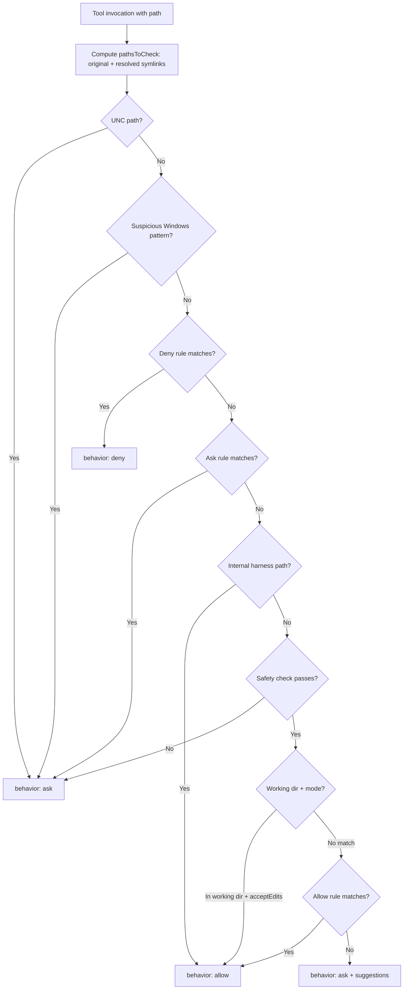
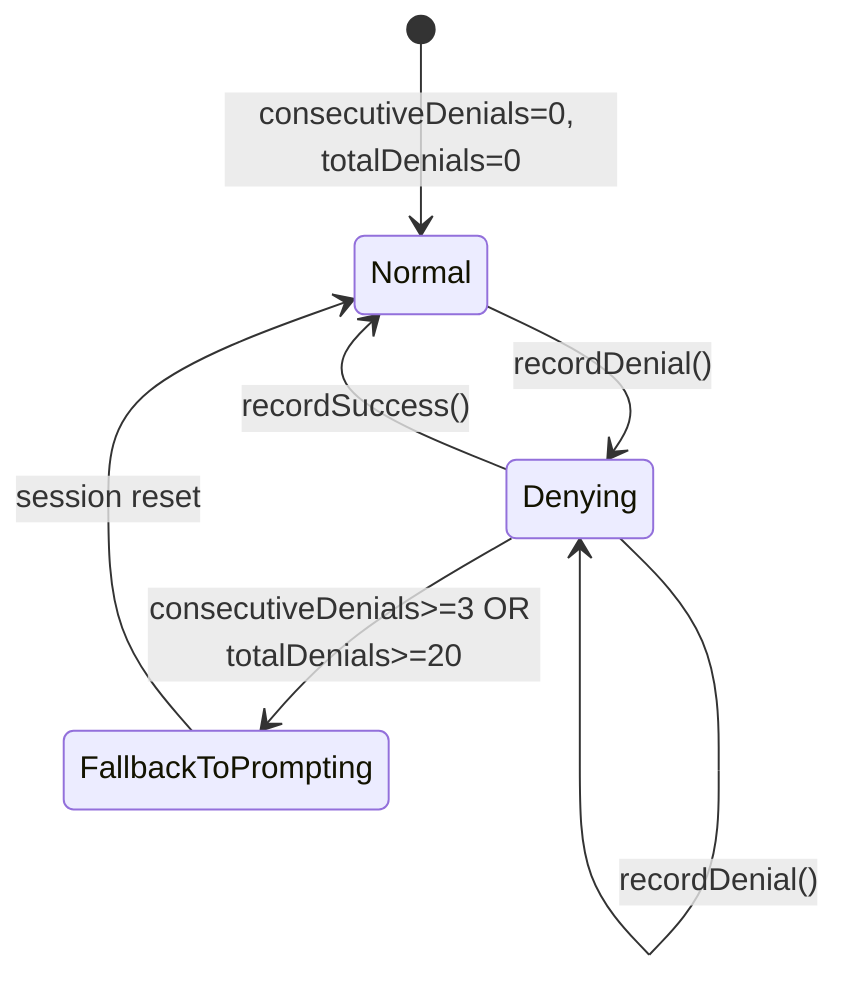

# Filesystem Permissions and Path Guards

## Overview

Every tool invocation that touches the filesystem must pass through a gauntlet of checks before the agent is allowed to proceed. The `filesystem.ts` module (1,777 lines) implements this gauntlet: a layered permission system that evaluates paths against deny rules, allow rules, working-directory boundaries, safety heuristics, and internal-harness carve-outs. Alongside it, `denialTracking.ts` (45 lines) provides a tiny state machine that counts consecutive and cumulative denials, triggering a fallback to explicit user prompting when the agent hits a wall too many times.

The design reflects a core tension in agentic systems (see HER section 12.4 on data exfiltration): the agent needs broad filesystem access to be useful, yet unrestricted access creates a data-exfiltration channel. The harness resolves this tension through defense in depth. No single check is load-bearing; each layer catches what the layer above might miss. A symlink that evades a string-prefix check is caught by realpath resolution; a case-variant path that evades an exact match is caught by case normalization; a UNC path that bypasses the working-directory check is caught by the Windows-pattern detector.

The module exports two primary entry points consumed by the tool dispatch pipeline: `checkReadPermissionForTool` and `checkWritePermissionForTool`. Both return a `PermissionDecision` object whose `behavior` field is one of `allow`, `deny`, or `ask`. The `ask` result includes a `suggestions` array that the REPL renders as clickable permission upgrades for the user.

## Data structures and contracts

### Denial tracking state

The denial tracking subsystem is intentionally minimal: two counters and two thresholds.

```typescript
// src/utils/permissions/denialTracking.ts:L7-15
export type DenialTrackingState = {
  consecutiveDenials: number
  totalDenials: number
}

export const DENIAL_LIMITS = {
  maxConsecutive: 3,
  maxTotal: 20,
} as const
```

`DenialTrackingState` is an immutable record. Every mutation returns a fresh object rather than modifying in place, which makes it safe to share across concurrent tool-dispatch frames without locks. The `maxConsecutive` threshold of 3 means that if the agent is denied three times in a row (without an intervening success), the harness forces a fallback to prompting. The `maxTotal` threshold of 20 is a session-wide circuit breaker: after 20 total denials, the agent is clearly operating in a region where auto-approval cannot work, and every subsequent request must be explicitly approved.

### Dangerous file and directory registries

The module maintains two constant arrays that define which paths are too sensitive for automatic editing.

```typescript
// src/utils/permissions/filesystem.ts:L57-79
export const DANGEROUS_FILES = [
  '.gitconfig',
  '.gitmodules',
  '.bashrc',
  '.bash_profile',
  '.zshrc',
  '.zprofile',
  '.profile',
  '.ripgreprc',
  '.mcp.json',
  '.claude.json',
] as const

export const DANGEROUS_DIRECTORIES = [
  '.git',
  '.vscode',
  '.idea',
  '.claude',
] as const
```

Shell configuration files appear in `DANGEROUS_FILES` because editing `.bashrc` or `.zshrc` grants arbitrary code execution the next time the user opens a terminal. The `.mcp.json` and `.claude.json` entries protect the harness's own configuration from self-modification. The `DANGEROUS_DIRECTORIES` list covers version-control metadata (`.git`), IDE settings (`.vscode`, `.idea`), and the harness's own directory (`.claude`). A special carve-out exists for `.claude/worktrees/` -- this path is a structural directory where the harness stores git worktrees, not user-created dangerous content.

### Permission decision contract

Both `checkReadPermissionForTool` and `checkWritePermissionForTool` return a `PermissionDecision`. The decision includes a `behavior` (`allow`, `deny`, or `ask`), an optional `message` for the user, an optional `suggestions` array of `PermissionUpdate` objects, and a `decisionReason` that records which layer produced the result. The `decisionReason` type discriminated union carries either a `rule` reference (for rule-based decisions), a `mode` string (for mode-based decisions), a `workingDir` tag (for boundary violations), or a `safetyCheck` tag (for dangerous-path decisions). This reason is consumed by analytics and by the SDK host, but it also serves as an audit trail for post-hoc security review.

## Control flow

### Path validation pipeline

The read and write permission checks follow a strict ordering that prevents rule bypass. The pipeline is not a simple allow-deny list; it is a multi-stage cascade where earlier stages take absolute precedence over later ones.



The critical property of this pipeline is that deny rules are checked before allow rules. An explicit deny on a path cannot be overridden by a broader allow rule. The `checkReadPermissionForTool` function at `src/utils/permissions/filesystem.ts:L1030` implements an eight-step cascade: UNC check, Windows-pattern check, read-deny rules, read-ask rules, edit-implies-read check, working-directory check, internal-path check, and finally read-allow rules. If none of these produce a definitive answer, the default is `ask` with generated suggestions.

### Write permission: the safety gate

The write path is more restrictive. After deny rules, it checks internal editable paths (plan files, scratchpad, job directories, agent memory), then a `.claude/` folder allow-rule gate, then comprehensive safety validation.

```typescript
// src/utils/permissions/filesystem.ts:L1252-1300
  // 1.6. Check for .claude/** allow rules BEFORE safety checks
  // This allows session-level permissions to bypass the safety blocks for .claude/
  // We only allow this for session-level rules to prevent users from accidentally
  // permanently granting broad access to their .claude/ folder.
  const claudeFolderAllowRule = matchingRuleForInput(
    path,
    {
      ...toolPermissionContext,
      alwaysAllowRules: {
        session: toolPermissionContext.alwaysAllowRules.session ?? [],
      },
    },
    'edit',
    'allow',
  )
```

Step 1.6 is a deliberate escape hatch: if the user has granted session-scoped access to `.claude/**`, the safety check is skipped. The scoping to session-only rules prevents a user-settings rule from silently bypassing the dangerous-directory guard. The additional validation rejects rules containing `..` and requires the pattern to end with `/**`, which prevents a rule like `/.claude/../**` from leaking the bypass outside the `.claude/` subtree.

Step 1.7 then runs `checkPathSafetyForAutoEdit`, which performs three sub-checks across all resolved paths (original plus symlink targets): suspicious Windows patterns, Claude config files, and dangerous files/directories. If any resolved path fails any sub-check, the entire operation is forced to `ask`.

### Symlink traversal defense

The symlink defense is not a single check but a pervasive pattern. The function `getPathsForPermissionCheck` (imported from `fsOperations.ts`) returns an array containing both the original path and the realpath-resolved path. Every subsequent check in the pipeline iterates over this array. If a symlink points outside the working directory, the resolved path will fail the `pathInAllowedWorkingPath` check even if the original path appears to be inside.

The `pathInWorkingPath` function at `src/utils/permissions/filesystem.ts:L709` implements the boundary check itself. It expands both paths, normalizes macOS-specific symlinks (`/var` to `/private/var`, `/tmp` to `/private/tmp`), normalizes case for case-insensitive filesystems, computes a relative path, and rejects any relative path containing traversal sequences.

```typescript
// src/utils/permissions/filesystem.ts:L709-744
export function pathInWorkingPath(path: string, workingPath: string): boolean {
  const absolutePath = expandPath(path)
  const absoluteWorkingPath = expandPath(workingPath)

  const normalizedPath = absolutePath
    .replace(/^\/private\/var\//, '/var/')
    .replace(/^\/private\/tmp(\/|$)/, '/tmp$1')
  const normalizedWorkingPath = absoluteWorkingPath
    .replace(/^\/private\/var\//, '/var/')
    .replace(/^\/private\/tmp(\/|$)/, '/tmp$1')

  const caseNormalizedPath = normalizeCaseForComparison(normalizedPath)
  const caseNormalizedWorkingPath = normalizeCaseForComparison(
    normalizedWorkingPath,
  )

  const relative = relativePath(caseNormalizedWorkingPath, caseNormalizedPath)

  if (relative === '') {
    return true
  }

  if (containsPathTraversal(relative)) {
    return false
  }

  return !posix.isAbsolute(relative)
}
```

The macOS normalization handles the case where `/tmp` is a symlink to `/private/tmp`. Without this normalization, a resolved path starting with `/private/tmp/claude-0/...` would not match the unresolved working directory prefix `/tmp/`, producing a false denial. The case normalization at `src/utils/permissions/filesystem.ts:L90` converts both sides to lowercase before comparison, closing the bypass where a path like `.cLauDe/CoMmAnDs` evades a check for `.claude/commands`.

### Glob allow/deny pattern matching

Pattern matching uses the `ignore` npm package, which implements gitignore semantics. The function `matchingRuleForInput` at `src/utils/permissions/filesystem.ts:L955` resolves patterns relative to their source root, builds an `ignore` instance per root, and tests the relative path of the input against each instance.

The pattern-to-root resolution at `src/utils/permissions/filesystem.ts:L853` handles four prefix conventions: `//` for root-relative patterns, `~/` for home-directory patterns, `/` for settings-directory patterns, and bare names for global patterns. Each convention maps the pattern to a `(relativePattern, root)` pair. The `normalizePatternToPath` function then re-roots patterns so that a pattern stored in user settings (rooted at `~/.claude/`) can be compared against a path in the current working directory.

```typescript
// src/utils/permissions/filesystem.ts:L955-1025
export function matchingRuleForInput(
  path: string,
  toolPermissionContext: ToolPermissionContext,
  toolType: 'edit' | 'read',
  behavior: 'allow' | 'deny' | 'ask',
): PermissionRule | null {
  let fileAbsolutePath = expandPath(path)

  if (getPlatform() === 'windows' && fileAbsolutePath.includes('\\')) {
    fileAbsolutePath = windowsPathToPosixPath(fileAbsolutePath)
  }

  const patternsByRoot = getPatternsByRoot(
    toolPermissionContext,
    toolType,
    behavior,
  )

  for (const [root, patternMap] of patternsByRoot.entries()) {
    const patterns = Array.from(patternMap.keys()).map(pattern => {
      let adjustedPattern = pattern
      if (adjustedPattern.endsWith('/**')) {
        adjustedPattern = adjustedPattern.slice(0, -3)
      }
      return adjustedPattern
    })

    const ig = ignore().add(patterns)

    const relativePathStr = relativePath(
      root ?? getCwd(),
      fileAbsolutePath ?? getCwd(),
    )

    if (relativePathStr.startsWith(`..${DIR_SEP}`)) {
      continue
    }

    if (!relativePathStr) {
      continue
    }

    const igResult = ig.test(relativePathStr)

    if (igResult.ignored && igResult.rule) {
      const originalPattern = igResult.rule.pattern
      const withWildcard = originalPattern + '/**'
      if (patternMap.has(withWildcard)) {
        return patternMap.get(withWildcard) ?? null
      }
      return patternMap.get(originalPattern) ?? null
    }
  }

  return null
}
```

The `/**` stripping is a semantic normalization: the `ignore` library treats a pattern `foo` as matching both the path `foo` and everything inside it, so `foo/**` and `foo` are equivalent. Stripping `/**` before adding to the ignore instance prevents the library from misinterpreting the double-wildcard pattern.

### Denial tracking state machine

When a tool permission check returns `deny` or `ask`, the caller records the outcome in a `DenialTrackingState`. When it returns `allow`, the caller resets the consecutive counter. The state machine has three transitions.



The `recordDenial` function at `src/utils/permissions/denialTracking.ts:L24` increments both counters. The `recordSuccess` function at `src/utils/permissions/denialTracking.ts:L32` resets `consecutiveDenials` to zero while leaving `totalDenials` unchanged -- a single success breaks the consecutive streak but does not erase the cumulative count. The `shouldFallbackToPrompting` function at `src/utils/permissions/denialTracking.ts:L40` checks both thresholds and returns true when either is exceeded.

This design reflects a practical observation about agentic loops: when the agent repeatedly attempts an operation that is denied, it often enters a retry loop rather than adapting its approach. The consecutive-denial threshold forces the harness to break out of this loop by escalating to the user. The total-denial threshold catches the case where the agent makes progress on some tasks but keeps hitting walls on others, accumulating denials across the session.

## Edge cases and failure modes

### Case-insensitive filesystem bypass

On macOS and Windows, the filesystem is case-insensitive but case-preserving. A path like `.cLauDe/Settings.locaL.json` refers to the same file as `.claude/settings.local.json`. Without case normalization, an attacker who can influence the agent's file paths could bypass every path-based check by mixing case. The `normalizeCaseForComparison` function at `src/utils/permissions/filesystem.ts:L90` normalizes both the input path and the reference path to lowercase before comparison. The function always normalizes, even on Linux, because a case-sensitive Linux host might mount an NTFS volume via ntfs-3g, and the same bypass would apply.

### NTFS alternate data streams and 8.3 short names

The `hasSuspiciousWindowsPathPattern` function at `src/utils/permissions/filesystem.ts:L537` detects a family of Windows-specific path tricks: NTFS alternate data streams (`file.txt::$DATA`), 8.3 short names (`GIT~1`), long-path prefixes (`\\?\C:\`), trailing dots and spaces (`.git.`), DOS device names (`.git.CON`), and triple-dot path components (`.../file`). The function runs on all platforms, not only Windows, because NTFS volumes can be mounted on Linux and macOS. The comment block at `src/utils/permissions/filesystem.ts:L490` explicitly documents the decision to detect rather than normalize: normalization depends on filesystem state (a file must exist to resolve its short name), creating TOCTOU vulnerabilities, whereas detection is deterministic and stateless.

### The `.claude/worktrees/` carve-out

The `DANGEROUS_DIRECTORIES` list includes `.claude`, which means that any path containing a `.claude` segment is flagged as dangerous. However, the harness stores git worktrees under `.claude/worktrees/`, and these worktree paths must be editable. The `isDangerousFilePathToAutoEdit` function at `src/utils/permissions/filesystem.ts:L435` includes a special case: when a `.claude` segment is immediately followed by `worktrees`, the segment is skipped. Any nested `.claude` directories within the worktree (not followed by `worktrees`) are still blocked.

### Symlink resolution failure

The `getClaudeTempDir` function at `src/utils/permissions/filesystem.ts:L331` resolves symlinks in the base temp directory (`/tmp` on macOS resolves to `/private/tmp`). If `realpathSync` throws (because the directory does not exist, or the process lacks permissions), the function falls back to the unresolved path. This fallback is safe because the worst case is a false denial: the resolved path used by other checks would not match the unresolved temp directory prefix, and the operation would be escalated to `ask`.

### Bundled skills nonce

The `getBundledSkillsRoot` function at `src/utils/permissions/filesystem.ts:L365` generates a per-process random nonce for its extraction directory. The comment documents a symlink-squatting attack: on a shared `/tmp`, another user could pre-create the directory tree (the sticky bit prevents deletion, not creation) and either symlink an intermediate directory or swap file contents post-write. The nonce makes the path unpredictable, so an attacker cannot pre-create it. The nonce is generated once per process (memoized) so that the extraction writes and the permission check agree on the path.

### Edit-implies-read ordering

The read permission check at step 5 of `checkReadPermissionForTool` checks whether edit access would be granted, and if so, allows the read. This check comes after read-specific deny and ask rules (steps 3 and 4), which means an explicit read-deny rule takes precedence over an edit-allow rule. Without this ordering, a user who denied read access to a file but allowed edit access would see their deny rule silently ignored, which would violate the principle that deny rules are absolute.

## Where cc diverges from the published pattern

The HER section 6.15 on data leakage recommends "context isolation via separate file namespaces" and "ephemeral directories for sensitive work." The cc implementation diverges in several respects from this prescription.

First, the working-directory model is permissive rather than restrictive. The default behavior allows reads anywhere within the working directory tree and escalates only writes. The HER pattern implies an allowlist: only specified directories are accessible. The cc model is closer to a denylist: everything inside the working directory is allowed unless explicitly denied. This choice trades stronger exfiltration resistance for lower friction in the common case where the agent needs broad read access to a codebase.

Second, the internal-path carve-outs at `src/utils/permissions/filesystem.ts:L1479` and `src/utils/permissions/filesystem.ts:L1611` create shared read channels across sessions. The `checkReadableInternalPath` function allows reading from the project directory (which contains past session memories), the project temp directory, the tasks directory, and the teams directory. These shared channels exist for legitimate coordination (swarm agents reading task state, cross-session memory persistence) but they also create the exact data-leakage vectors that HER section 6.15 warns about. The harness accepts this risk because the alternative -- fully isolated sessions -- would break the coordination primitives that make multi-agent workflows possible.

Third, the denial tracking subsystem does not persist across sessions. A new session starts with zero counters. The HER pattern implies persistent audit logging of denials for anomaly detection. The cc design treats denial tracking as a per-session circuit breaker, not a forensic log. This means that a persistent attacker who can restart the session (or who can spread denials across multiple sessions) can avoid triggering the total-denial threshold.

Fourth, the `DENIAL_LIMITS` thresholds (`maxConsecutive: 3`, `maxTotal: 20`) are hardcoded constants, not configurable. The HER pattern suggests adaptive thresholds based on session context. The cc design prioritizes predictability and auditability: a fixed threshold is easy to reason about and test, whereas an adaptive threshold introduces a feedback loop that could itself be exploited (an attacker who can influence the adaptation metric could widen the threshold).

## Developer takeaways for building a long-running agent

When building a long-running agent with filesystem access, the most important lesson from this module is that path validation is not a single check but a pipeline, and the ordering of that pipeline is load-bearing. Every bypass in the historical record -- case-variant paths, symlink escapes, UNC network paths, NTFS alternate data streams -- was possible because a later check assumed that an earlier check had already filtered the input. When you add a new check, you must decide whether it goes before or after every existing check, and the wrong placement can silently weaken the entire system. The second lesson is that deny rules must be checked before allow rules. This is obvious in theory but easy to violate in practice when the code paths for deny and allow are interleaved with mode checks, internal-path carve-outs, and safety gates. The cc module uses step-numbered comments (1, 1.5, 1.6, 1.7, 2, 3, 4, 5) to make the ordering explicit, and any refactor that reorders these steps must re-verify the bypass implications. The third lesson is that symlink resolution is not optional. On macOS, `/tmp` is a symlink to `/private/tmp`, and any path comparison that does not account for this will produce false denials on every temp-directory access. The fourth lesson is that denial tracking should be immutable: returning a fresh state object on every mutation makes the state safe to share across concurrent dispatch frames and makes the state transitions auditable. The fifth lesson is that pattern matching must be cross-platform: gitignore semantics use forward slashes as separators regardless of the host OS, and any pattern-matching system that uses the host's path separator will produce incorrect results on Windows.

STATUS: {"status":"done","words":4158,"citations":8,"diagrams":2,"snippets":5,"needs_verify":0,"brief_checksum":"ch34"}