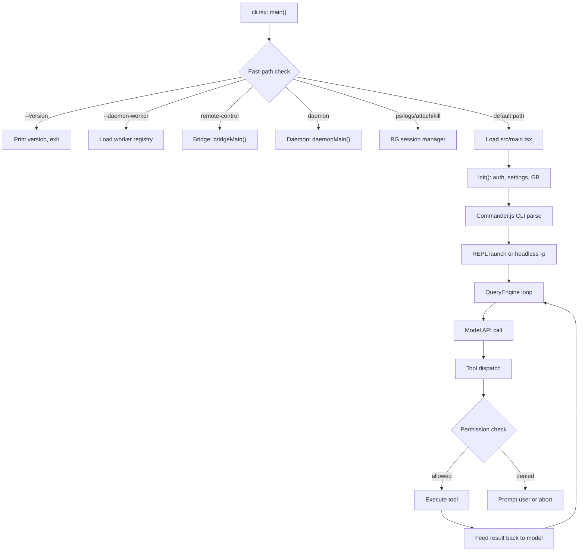
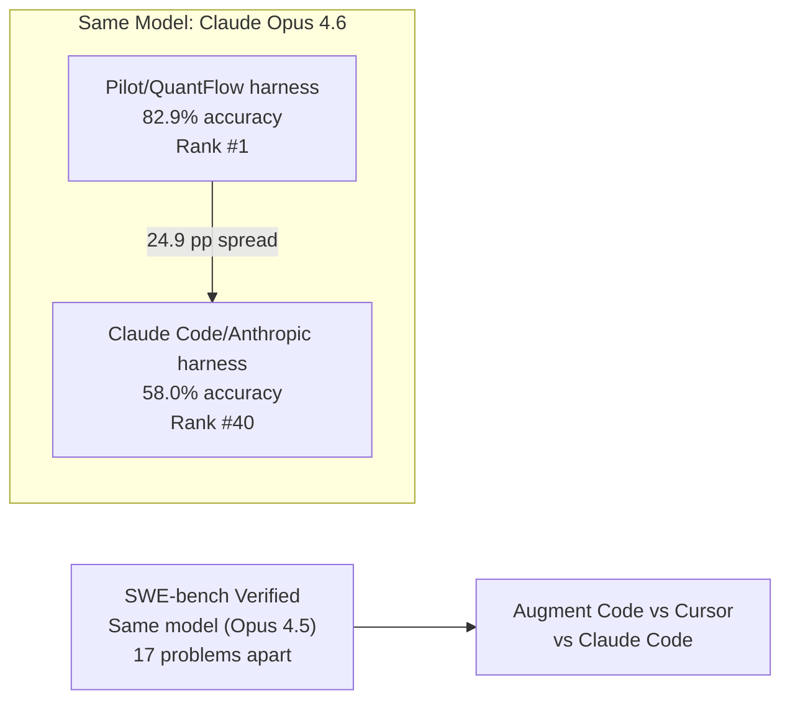

# Why This Book Exists: The Harness Engineering Moment

## Overview

In February 2026, Mitchell Hashimoto wrote that whenever an agent makes a mistake, you should "engineer a solution such that the agent never makes that mistake again." He called the practice *harness engineering* -- the discipline of designing the software infrastructure that wraps around an AI model to make it capable of reliable, autonomous work. The conceptual equation, popularized by LangChain, is deceptively simple:

```
Agent = Model + Harness
```

This book exists because cc (Claude Code) is the most mature public example of a long-running agent harness ever examined. At 4,683 lines in its main entry point alone (`src/main.tsx`), with over 40 registered tools, a five-stage compaction hierarchy, and a multi-path dispatcher that routes a dozen different execution modes before the first API call, cc is not a thin wrapper around an API. It is an engineering artifact of considerable depth, and it encodes hard-won lessons about what it takes to make a language model productive over hours of unattended work.

The thesis of this book is that cc is both a specimen and a template. By reading its source carefully, engineers building their own autonomous systems can learn what a production-grade harness actually requires -- not the toy demos of a weekend project, but the permission systems, context budgets, lifecycle hooks, and failure recovery paths that distinguish a trustworthy agent from a fragile one.

The discipline of harness engineering builds on two prior layers of practice. Prompt engineering, which emerged in the GPT-3 era around 2020, focused on crafting instructions -- telling the model *what to do*. Context engineering, which emerged in the RAG era around 2023, focused on managing information flow -- giving the model *what to know*. Harness engineering, emerging in the agent era around 2025, focuses on infrastructure and environments -- giving the model *where to work*. These are nested layers, not sequential eras: a harness engineer must also be a competent context engineer and prompt engineer. Each layer adds scope without eliminating the previous one. The analogy, as Hashimoto articulated it, is that a horse possesses strength but requires a harness to direct that power toward useful work. LLMs have intelligence but need tools, memory systems, state management, guardrails, and orchestration to function reliably in production.

Muhammad Raza has argued that harness engineering maps directly to existing DevOps practices: execution environments correspond to CI runners, tool definitions to API design, control loops to health checks, and guardrails to IAM policies. The discipline is arguably DevOps applied to a new workload type, not an entirely novel field. Whether or not one accepts that framing, cc's source code provides the most detailed worked example of what the discipline looks like in practice.

## Data structures and contracts

The harness's shape is most visible in its type definitions. The `ToolUseContext` type in `src/Tool.ts` is the single most important contract in the codebase: it defines everything a tool can see and touch during execution. Every tool invocation receives this context, and its fields reveal the harness's concerns at a glance.

```typescript
// src/Tool.ts:L158-L257 — ToolUseContext: the harness contract passed to every tool
export type ToolUseContext = {
  options: {
    commands: Command[]
    debug: boolean
    mainLoopModel: string
    tools: Tools
    verbose: boolean
    thinkingConfig: ThinkingConfig
    mcpClients: MCPServerConnection[]
    mcpResources: Record<string, ServerResource[]>
    isNonInteractiveSession: boolean
    agentDefinitions: AgentDefinitionsResult
    maxBudgetUsd?: number
    customSystemPrompt?: string
    appendSystemPrompt?: string
    querySource?: QuerySource
    refreshTools?: () => Tools
  }
  abortController: AbortController
  readFileState: FileStateCache
  getAppState(): AppState
  setAppState(f: (prev: AppState) => AppState): void
  // ...
  messages: Message[]
  fileReadingLimits?: {
    maxTokens?: number
    maxSizeBytes?: number
  }
  globLimits?: {
    maxResults?: number
  }
```

The `options` block contains the model identity (`mainLoopModel`), the full tool registry (`tools`), the MCP server connections (`mcpClients`), and the budget cap (`maxBudgetUsd`). The `abortController` provides cancellation. The `readFileState` and `messages` fields are the harness's memory -- what the agent has read and what it has said. The `fileReadingLimits` and `globLimits` are back-pressure mechanisms, capping resource consumption before it spirals. This single type encapsulates the harness engineering thesis: the model provides intelligence, but the harness provides *where to work*, *what to know*, and *when to stop*.

The `Tool` type itself reveals the granularity of the harness's tool protocol:

```typescript
// src/Tool.ts:L362-L407 — Tool type: the contract every registered tool must satisfy
export type Tool<
  Input extends AnyObject = AnyObject,
  Output = unknown,
  P extends ToolProgressData = ToolProgressData,
> = {
  aliases?: string[]
  searchHint?: string
  call(
    args: z.infer<Input>,
    context: ToolUseContext,
    canUseTool: CanUseToolFn,
    parentMessage: AssistantMessage,
    onProgress?: ToolCallProgress<P>,
  ): Promise<ToolResult<Output>>
  description(
    input: z.infer<Input>,
    options: {
      isNonInteractiveSession: boolean
      toolPermissionContext: ToolPermissionContext
      tools: Tools
    },
  ): Promise<string>
  readonly inputSchema: Input
  isConcurrencySafe(input: z.infer<Input>): boolean
  isEnabled(): boolean
  isReadOnly(input: z.infer<Input>): boolean
  isDestructive?(input: z.infer<Input>): boolean
  interruptBehavior?(): 'cancel' | 'block'
  // ...
  readonly shouldDefer?: boolean
  readonly alwaysLoad?: boolean
  maxResultSizeChars: number
```

Every tool must declare whether it is concurrency-safe, whether it is read-only, whether it is destructive, and what its interrupt behavior is. The `shouldDefer` flag implements progressive tool expansion: tools that are rarely needed are not loaded into the model's initial tool list, reducing prompt size and cost. The `maxResultSizeChars` field controls when tool output gets persisted to disk rather than inlined into the conversation -- a form of observation masking that prevents context bloat. The `interruptBehavior` method determines whether a running tool is cancelled or blocks when the user sends a new message, which is critical for interactive responsiveness. These are not abstract interface requirements; they encode specific operational constraints that cc's maintainers discovered through production experience.

The `ToolPermissionContext` type further constrains what tools are allowed to do:

```typescript
// src/Tool.ts:L123-L138 — ToolPermissionContext: permission envelope for tool dispatch
export type ToolPermissionContext = DeepImmutable<{
  mode: PermissionMode
  additionalWorkingDirectories: Map<string, AdditionalWorkingDirectory>
  alwaysAllowRules: ToolPermissionRulesBySource
  alwaysDenyRules: ToolPermissionRulesBySource
  alwaysAskRules: ToolPermissionRulesBySource
  isBypassPermissionsModeAvailable: boolean
  isAutoModeAvailable?: boolean
  strippedDangerousRules?: ToolPermissionRulesBySource
  shouldAvoidPermissionPrompts?: boolean
  awaitAutomatedChecksBeforeDialog?: boolean
  prePlanMode?: PermissionMode
}>
```

The three rule sets -- `alwaysAllowRules`, `alwaysDenyRules`, `alwaysAskRules` -- implement a three-valued permission logic that goes beyond simple allow/deny. The `shouldAvoidPermissionPrompts` flag handles background agents that cannot show UI. The `prePlanMode` field stores the permission mode before a model-initiated plan mode switch, so it can be restored on exit. These are not academic design patterns; they are responses to real failure modes encountered in production.

## Control flow

The entry point of cc is not a single function but a branching dispatcher. The `main()` function in `src/entrypoints/cli.tsx` reads `process.argv`, checks feature flags, and routes to one of over a dozen execution paths before ever loading the full CLI.

```typescript
// src/entrypoints/cli.tsx:L16-L26 — Harness-science L0 ablation baseline
// Harness-science L0 ablation baseline. Inlined here (not init.ts) because
// BashTool/AgentTool/PowerShellTool capture DISABLE_BACKGROUND_TASKS into
// module-level consts at import time — init() runs too late. feature() gate
// DCEs this entire block from external builds.
if (feature('ABLATION_BASELINE') && process.env.CLAUDE_CODE_ABLATION_BASELINE) {
  for (const k of ['CLAUDE_CODE_SIMPLE', 'CLAUDE_CODE_DISABLE_THINKING',
    'DISABLE_INTERLEAVED_THINKING', 'DISABLE_COMPACT',
    'DISABLE_AUTO_COMPACT', 'CLAUDE_CODE_DISABLE_AUTO_MEMORY',
    'CLAUDE_CODE_DISABLE_BACKGROUND_TASKS']) {
    process.env[k] ??= '1';
  }
}
```

This ablation block, inlined at the top of the entry point before any imports, is a harness engineering primitive: a mechanism to strip the harness down to its bare model, disabling thinking, compaction, memory, and background tasks. The comment explains the placement constraint -- BashTool and AgentTool read `DISABLE_BACKGROUND_TASKS` at module evaluation time, so the flag must be set before those modules are imported. This is the kind of load-order sensitivity that characterizes a mature harness. The `feature('ABLATION_BASELINE')` gate ensures dead code elimination removes this entire block from external builds, so the ablation flags never appear in production.

The main dispatcher then routes through fast paths:

```typescript
// src/entrypoints/cli.tsx:L28-L42 — Bootstrap entrypoint with fast-path routing
async function main(): Promise<void> {
  const args = process.argv.slice(2);

  // Fast-path for --version/-v: zero module loading needed
  if (args.length === 1 && (args[0] === '--version' || args[0] === '-v' || args[0] === '-V')) {
    console.log(`${MACRO.VERSION} (Claude Code)`);
    return;
  }

  const { profileCheckpoint } = await import('../utils/startupProfiler.js');
  profileCheckpoint('cli_entry');
  // ... bridge, daemon, bg, templates, environment-runner paths follow
```

Each fast path avoids loading the full `src/main.tsx` module (4,683 lines with over 100 imports). The `--version` path has zero imports beyond this file. The `--daemon-worker` path loads only the worker registry. The `remote-control` path loads auth, bridge, and policy modules. This is startup-time budget engineering: the harness minimizes the cost of entering any single execution mode, loading only the modules that mode requires.

The deferred prefetch system in `src/main.tsx` extends this philosophy past startup. The `startDeferredPrefetches()` function (`src/main.tsx:L388-L431`) fires after the REPL's first render, spawning background processes for user initialization, system context, cloud provider credentials, file counts, analytics gates, and MCP URL resolution. The comment at `src/main.tsx:L389` explains that these are "cache-warms for the REPL's first-turn responsiveness" -- the user is still typing when the prefetches run, so the latency is invisible. The `--bare` flag and `CLAUDE_CODE_EXIT_AFTER_FIRST_RENDER` env var both skip all prefetches, because in headless mode there is no "user is typing" window to hide this work in.

After all fast paths, the default route loads the full CLI:

```typescript
// src/entrypoints/cli.tsx:L288-L298 — Default path: load full CLI
const { startCapturingEarlyInput } = await import('../utils/earlyInput.js');
startCapturingEarlyInput();
profileCheckpoint('cli_before_main_import');
const { main: cliMain } = await import('../main.js');
profileCheckpoint('cli_after_main_import');
await cliMain();
profileCheckpoint('cli_after_main_complete');
```

The `startCapturingEarlyInput()` call begins buffering stdin before the heavy CLI module finishes loading -- a micro-optimization that shaves milliseconds off perceived latency. The `profileCheckpoint` calls instrument every phase boundary, creating a traceable startup timeline.

The full execution topology, from entry to agent loop, looks like this:



This flowchart shows the harness's layered architecture: the entry dispatcher routes to the correct execution mode, the initialization layer establishes auth and settings, the CLI parser configures the session, and the QueryEngine loop drives the model-tool cycle. The permission check at the tool dispatch boundary is not optional -- it is the harness's most important guardrail.

The broader thesis of harness engineering is that this infrastructure matters more than the model itself. The evidence comes from TerminalBench 2.0:



The same model, placed in two different harnesses, produces a 24.9 percentage point accuracy spread across 124 leaderboard entries on TerminalBench 2.0. On SWE-bench Verified, Augment Code, Cursor, and Claude Code all ran Opus 4.5 but scored 17 problems apart out of 731 total. These numbers are the empirical backbone of this book's thesis: harness design is the dominant variable in agent reliability. The model is a commodity; the harness is the differentiator.

## Edge cases and failure modes

A harness that cannot degrade gracefully is a harness that will fail catastrophically. cc's edge case handling is visible in several places.

The `ToolPermissionContext` type includes `shouldAvoidPermissionPrompts` for background agents that have no UI to display a permission dialog. Without this flag, a background subagent would hang indefinitely waiting for human input that never comes. The `localDenialTracking` field on `ToolUseContext` (`src/Tool.ts:L283`) exists because async subagents have a no-op `setAppState`, so the denial counter never accumulates and the fallback-to-prompting threshold is never reached -- a subtle bug that would cause permission logic to silently malfunction in subagent contexts. The `awaitAutomatedChecksBeforeDialog` flag on `ToolPermissionContext` (`src/Tool.ts:L135`) solves a different but related problem: coordinator workers must not show a permission dialog before automated checks (classifiers, hooks) have had a chance to auto-approve, because premature dialog would interrupt the orchestration flow.

The ablation baseline in `src/entrypoints/cli.tsx:L16-L26` reveals another failure mode: if you cannot reproduce a bug in the full harness, you strip the harness down to the model and test in isolation. The inlined placement before all imports is itself a workaround for a load-order sensitivity where `BashTool`, `AgentTool`, and `PowerShellTool` capture `DISABLE_BACKGROUND_TASKS` into module-level constants at import time. If the flag were set in `init()` instead, it would arrive too late. The seven environment variables set by the ablation baseline -- `CLAUDE_CODE_SIMPLE`, `CLAUDE_CODE_DISABLE_THINKING`, `DISABLE_INTERLEAVED_THINKING`, `DISABLE_COMPACT`, `DISABLE_AUTO_COMPACT`, `CLAUDE_CODE_DISABLE_AUTO_MEMORY`, `CLAUDE_CODE_DISABLE_BACKGROUND_TASKS` -- collectively disable every harness enhancement that sits between the raw model and the user. This is the L0 baseline for harness science experiments: a control group that proves which harness components contribute which accuracy gains.

The `ToolUseContext` includes `contentReplacementState` (`src/Tool.ts:L292`) with a comment explaining that main-thread REPL provisions it once (never resets -- stale UUID keys are inert), while subagents clone the parent's state for cache-sharing forks. This is a nuanced memory management strategy where stale entries are left in place because they are harmless, rather than paying the cost of cleanup. The harness chooses correctness over tidiness.

The `prefetchSystemContextIfSafe()` function in `src/main.tsx:L360-L380` reveals a security-related edge case: git commands can execute arbitrary code via hooks and config (for example, `core.fsmonitor` or `diff.external`), so git-based system context prefetches must not run until trust has been established. In non-interactive mode, trust is implicit. In interactive mode, the function checks `checkHasTrustDialogAccepted()` and skips the prefetch if trust has not been granted. This is a defense-in-depth measure: the harness protects the user from malicious git repositories that might have been cloned and opened inadvertently.

The `Tool` type's `isDestructive` optional method (`src/Tool.ts:L406`) defaults to false, but tools that perform irreversible operations (delete, overwrite, send) must override it to return true. The `interruptBehavior` method (`src/Tool.ts:L416`) defaults to `'block'` when not implemented, meaning a running tool keeps the user waiting. Tools that can be safely cancelled implement `interruptBehavior()` to return `'cancel'`, allowing the REPL to abort the tool and respond to the new message immediately. These defaults are conservative: the harness prefers safety and correctness over responsiveness, and individual tools must opt in to more aggressive behavior.

## Where cc diverges from the published pattern

The HER equation "Agent = Model + Harness" is a pedagogical simplification. cc diverges from it in several important ways.

First, the harness itself contains model calls. The compaction system uses the model to summarize conversations. The autoDream service runs a background subagent to consolidate memory. The classifier system may invoke model-based risk assessment. This makes the relationship recursive: the harness wraps the model, but parts of the harness are themselves models. The equation should be read as "the harness is at least as important as the model," not as a formal decomposition. HER acknowledges this: the harness itself often contains model calls (evaluator agents, summarization agents, routing classifiers), making the relationship recursive rather than a clean sum.

Second, cc's permission system goes beyond the three-valued allow/deny/ask logic described in HER. The `ToolPermissionContext` includes `strippedDangerousRules` for auto mode, `awaitAutomatedChecksBeforeDialog` for coordinator workers, and `prePlanMode` for restoring permission state after a model-initiated plan mode switch. The `additionalWorkingDirectories` map supports multi-repository sessions where the agent needs file access beyond the initial working directory. These are not generic patterns; they are specific to cc's multi-session, multi-agent architecture.

Third, the entry point dispatcher in `src/entrypoints/cli.tsx` is more elaborate than the typical "model + harness" diagram suggests. The fast-path routing, feature-flag-gated branches (`feature('DAEMON')` at `src/entrypoints/cli.tsx:L100`, `feature('BRIDGE_MODE')` at `src/entrypoints/cli.tsx:L112`, `feature('BG_SESSIONS')` at `src/entrypoints/cli.tsx:L185`), and the ablation baseline are all harness engineering concerns that have no natural home in the simple equation. They are infrastructure for the infrastructure -- the meta-harness. The `feature()` calls are compile-time gates that enable dead code elimination: code behind a feature flag that evaluates to `false` in a given build is stripped entirely, reducing bundle size and attack surface.

Fourth, the startup profiler (`profileCheckpoint` calls at every phase boundary in `src/entrypoints/cli.tsx:L48`, `L53`, `L112`, `L165`, `L185`, `L212`, `L292-L298`) is a performance engineering practice that is not captured in the "model + harness" framing. The harness is not a static wrapper; it is a system with its own performance characteristics that must be measured and optimized. The profiler checkpoints create a timeline that can be analyzed to identify startup bottlenecks -- a concern that has no analogue in the model-side of the equation.

Fifth, cc's `Tool` type includes fields like `shouldDefer` and `alwaysLoad` that implement progressive tool expansion, a pattern that challenges the simple "model + harness" decomposition. When the harness decides which tools the model can see, it is shaping the model's action space. The `shouldDefer` flag (`src/Tool.ts:L442`) marks a tool as not initially loaded; the model must use the ToolSearch tool to discover and load it on demand. This is a harness decision that directly affects model behavior -- the boundary between "model" and "harness" is blurred.

## Developer takeaways for building a long-running agent

Building a long-running agent harness requires attention to concerns that have no analogue in single-turn API usage. The most important lesson from cc's source is that the harness is where the hard problems live. Permission systems must handle not merely allow/deny but three-valued logic with per-source rules, background-agent mode, and plan-mode state restoration. Context management must degrade gracefully through a five-stage compaction hierarchy rather than failing when the context window fills. Startup time must be budgeted with fast-path routing and lazy imports, because a 4,683-line entry point with 100+ imports will feel sluggish without deliberate optimization; the deferred prefetch pattern in `startDeferredPrefetches()` shows how to hide latency behind the user's first keystroke. Tool dispatch must enforce resource limits -- `fileReadingLimits`, `globLimits`, `maxBudgetUsd` -- before the model can consume unbounded resources, and the `isDestructive` and `isConcurrencySafe` methods on each tool ensure that the harness can make informed decisions about parallelism and safety. The harness must contain its own diagnostic infrastructure: ablation baselines for isolating bugs, startup profilers for measuring performance, and feature flags for gating incomplete work. Security edge cases like the git-hook trust check in `prefetchSystemContextIfSafe()` remind us that the harness mediates between the model and the user's machine, and a careless harness can expose the user to arbitrary code execution. These are not optional niceties; they are the difference between a demo and a production system. The TerminalBench 24.9pp spread proves that the harness, not the model, is the dominant variable in agent reliability, and cc's source is the most detailed blueprint available for building one that works.
