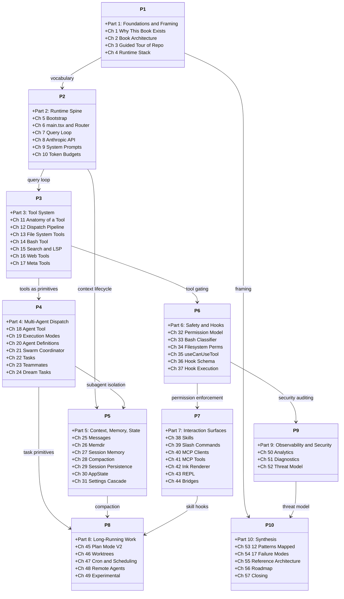

# Book Architecture, Reading Paths, and Citation Conventions

## Overview

This book comprises 57 chapters organized into 10 parts, progressing from framing and orientation through the runtime spine, tool system, multi-agent dispatch, context management, safety infrastructure, interaction surfaces, long-running work patterns, observability, and finally synthesis. The structure mirrors the dependency graph of the cc codebase itself: Part 1 gives you the conceptual vocabulary, Part 2 walks the startup-to-loop path, and each subsequent part adds a layer that depends on the one before it.

The book is not meant to be read strictly front-to-back. Three primary reading paths serve different audiences:

- **The harness builder** reads Parts 1 through 6 sequentially, then jumps to Part 10. This path covers every component you would need to replicate or fork.
- **The tool author** starts at Part 3, skips to Part 6 for permissions, then Part 7 for skills and MCP integration. Chapter 11 (Anatomy of a Tool) is the essential entry point.
- **The security auditor** reads Part 1 for framing, Part 6 for the full permission and hook stack, Part 9 for observability, and Chapter 52 for the threat model. This path covers the defense-in-depth layers identified in HER §12.

Every chapter cross-references the Harness Engineering Report (HER) that accompanies this book. The HER provides the empirical and theoretical substrate; this book provides the source-code evidence. When a chapter claims that cc implements "Progressive Tool Expansion" (HER §5, Pattern 9), the claim is backed by file paths, line numbers, and quoted code.

## Data structures and contracts

### Citation format

Every factual claim is cited inline using one of two formats:

- **Source-file citations**: `src/path/to/file.ts:Lnnn` for a single line, or `src/path/to/file.ts:Lnnn-Lmmm` for a range. These point to exact lines in the cc repository.
- **HER citations**: `HER §N` or `HER §N.M` for a specific subsection. These point to the Harness Engineering Report that accompanies this book.
- **Manifest citations**: `manifest.json:Lnn` for structural claims about the book itself.

For this chapter, which is a meta-chapter with no primary source files, citations reference the manifest structure and HER sections rather than `src/` paths. All subsequent chapters use the source-file citation format exclusively.

### The manifest

The book's build state is tracked in a single manifest file. Each chapter entry records its ID, title, slug, part number, source files, HER cross-references, diagram requirements, word-count targets, and quality metrics. The manifest is the authoritative source for which chapters exist, their dependencies, and their current build status.

```json
// manifest.json:L24-L42 — Chapter 2 manifest entry
{
  "id": 2, "id_padded": "02",
  "title": "Book Architecture, Reading Paths, and Citation Conventions",
  "slug": "book-architecture",
  "part": 1,
  "synopsis": "Explains how to read the book, citation format, diagram conventions, cross-ref table from HER patterns/failure modes/best practices to chapters.",
  "source_files": [],
  "her_refs": ["§5 12 patterns index", "§6 17 failure modes index", "§20 12 best practices"],
  "diagram_reqs": [
    {"type": "classDiagram", "topic": "book's parts and dependencies"},
    {"type": "flowchart", "topic": "HER patterns to chapter numbers mapping"}
  ],
  "target_words": 3000, "min_words": 2550, "max_words": 3750,
  "status": "pending",
  "pass_counts": {"accuracy":0,"crossref":0,"diagrams":0,"polish":0,"consistency":0,"gaps":0,"critical":0}
}
```

The `source_files` array for this chapter is empty because it is a meta-chapter. The `her_refs` array names the three HER sections that this chapter indexes: the 12 agentic harness patterns from HER §5, the 17 failure modes from HER §6, and the 12 best practices from HER §20. The `diagram_reqs` array specifies the minimum diagrams required; the types are drawn from the approved set (flowchart, sequenceDiagram, stateDiagram-v2, classDiagram, erDiagram).

### Terminology registry

The book uses a shared terminology registry at `terminology.json` to enforce consistent usage of domain-specific terms. Each entry defines a term with a single authoritative definition.

```json
// terminology.json:L2-L5 — Term entry structure
{ "term": "tool", "definition": "A single-purpose capability exposed to the model via the tool dispatch pipeline. Each tool has a Zod/JSONSchema input schema, a call() method, concurrency flags, and optional deferral. Registered in src/Tool.ts." }
```

```json
// terminology.json:L23-L24 — harness definition
{ "term": "harness", "definition": "The engineering layer surrounding a language model that provides tools, context assembly, permission enforcement, lifecycle hooks, and state management. An agent = model + harness." }
```

The `tool` entry specifies the canonical definition used throughout the book: a tool is not merely a function call but a structured capability with a schema, execution method, concurrency semantics, and optional deferral. The `harness` definition establishes the foundational equation of this book -- an agent equals a model plus a harness -- and appears first in Chapter 1.

### Diagram conventions

All diagrams in this book use Mermaid syntax and are rendered as fenced code blocks tagged with `mermaid`. Only five diagram types are used:

| Type | Purpose |
|------|---------|
| `flowchart` | Decision trees, data flow, process steps |
| `sequenceDiagram` | Time-ordered interactions between components |
| `stateDiagram-v2` | State machines with transitions |
| `classDiagram` | Type hierarchies, interface contracts |
| `erDiagram` | Storage layouts, entity relationships |

Diagrams are numbered within each chapter. Captions follow the diagram block in plain text, not inside the Mermaid code.

## Control flow

### Book structure and part dependencies

The ten parts form a dependency chain. Part 1 (Foundations) establishes vocabulary and orientation. Part 2 (Runtime Spine) walks the code path from `bun run` through the query loop, which every subsequent part assumes you understand. Part 3 (Tool System) depends on the spine. Part 4 (Multi-Agent) depends on tools. Part 5 (Context and Memory) depends on the spine for the query loop and on Part 4 for subagent isolation. Part 6 (Safety) depends on tools and the spine. Part 7 (Interaction Surfaces) depends on skills, permissions, and the Ink renderer. Part 8 (Long-Running Work) synthesizes tools, agents, and context. Part 9 (Observability) is broadly orthogonal but references permission enforcement. Part 10 (Synthesis) draws on all prior parts.



Figure 2.1: The book's ten parts and their dependency relationships. Solid arrows indicate that the target part assumes familiarity with the source part.

### HER patterns to chapters mapping

The 12 agentic harness patterns identified in HER §5 are the analytical backbone of this book. Each pattern appears in at least two chapters: once in the implementation chapter that covers the cc source code, and again in Chapter 53 (The 12 HER Patterns Mapped to CC) which provides the synthesis view.

```mermaid
flowchart TD
    P1["Pattern 1: Persistent Instruction File"]
    P2["Pattern 2: Scoped Context Assembly"]
    P3["Pattern 3: Tiered Memory"]
    P4["Pattern 4: Dream Consolidation"]
    P5["Pattern 5: Progressive Context Compaction"]
    P6["Pattern 6: Explore-Plan-Act Loop"]
    P7["Pattern 7: Context-Isolated Subagents"]
    P8["Pattern 8: Fork-Join Parallelism"]
    P9["Pattern 9: Progressive Tool Expansion"]
    P10["Pattern 10: Command Risk Classification"]
    P11["Pattern 11: Single-Purpose Tool Design"]
    P12["Pattern 12: Deterministic Lifecycle Hooks"]

    P1 --> C9["Ch 9: System Prompts"]
    P1 --> C31["Ch 31: Settings Cascade"]
    P2 --> C9
    P2 --> C20["Ch 20: Agent Definitions"]
    P3 --> C26["Ch 26: Memdir"]
    P3 --> C27["Ch 27: Session Memory"]
    P4 --> C24["Ch 24: Dream Tasks"]
    P5 --> C17["Ch 17: Meta Tools"]
    P5 --> C25["Ch 25: Messages"]
    P5 --> C28["Ch 28: Compaction"]
    P6 --> C7["Ch 7: Query Loop"]
    P6 --> C45["Ch 45: Plan Mode V2"]
    P7 --> C18["Ch 18: Agent Tool"]
    P7 --> C19["Ch 19: Execution Modes"]
    P8 --> C21["Ch 21: Swarm Coordinator"]
    P8 --> C46["Ch 46: Worktrees"]
    P9 --> C15["Ch 15: Search and LSP Tools"]
    P9 --> C38["Ch 38: Skills"]
    P9 --> C41["Ch 41: MCP Tools"]
    P10 --> C14["Ch 14: Bash Tool"]
    P10 --> C33["Ch 33: Bash Classifier"]
    P11 --> C11["Ch 11: Anatomy of a Tool"]
    P11 --> C13["Ch 13: File System Tools"]
    P12 --> C12["Ch 12: Dispatch Pipeline"]
    P12 --> C36["Ch 36: Hook Schema"]
    P12 --> C37["Ch 37: Hook Execution"]
```



Figure 2.2: Mapping from the 12 HER agentic harness patterns to their primary implementation chapters.

Pattern 5 (Progressive Context Compaction) has the widest chapter footprint because compaction touches the message model (Ch 25), the meta-tools that trigger it (Ch 17), and the five-stage compaction hierarchy itself (Ch 28). Pattern 9 (Progressive Tool Expansion) appears in three chapters because the deferred-loading mechanism spans ToolSearch (Ch 15), skill discovery (Ch 38), and MCP tool passthrough (Ch 41).

### HER failure modes to chapters mapping

The 17 failure modes from HER §6 are distributed across the chapters that implement the relevant defenses. The following table provides the cross-reference:

| Failure Mode | HER § | Primary Chapter(s) |
|---|---|---|
| Context Rot | §6.1 | Ch 7, Ch 25, Ch 28 |
| Premature Completion | §6.2 | Ch 7 |
| Self-Evaluation Bias | §6.3 | Ch 27 |
| Placeholder Implementations | §6.4 | Ch 13 |
| Context Anxiety | §6.5 | Ch 19 |
| Silent Failures | §6.6 | Ch 12, Ch 51 |
| Infinite Loops | §6.7 | Ch 7 |
| Tool Explosion | §6.8 | Ch 12, Ch 15 |
| Compounding Bugs Across Sessions | §6.9 | Ch 22 |
| Yak Shaving / Scope Creep | §6.10 | Ch 22 |
| Cost Explosion / Runaway Spending | §6.11 | Ch 50 |
| Hallucinated Tool Calls | §6.12 | Ch 16, Ch 41 |
| Security Vulnerabilities / Prompt Injection | §6.13 | Ch 16, Ch 32, Ch 41, Ch 52 |
| Model Regression from Provider Updates | §6.14 | Ch 8 |
| Data Leakage Between Contexts | §6.15 | Ch 13, Ch 40, Ch 52 |
| Checkpoint-Restore Side Effects | §6.16 | Ch 29, Ch 48 |
| Goal Misinterpretation / Specification Gaming | §6.17 | Ch 17 |

Failure modes §6.1 (Context Rot) and §6.13 (Prompt Injection) have the widest coverage because their defenses are distributed across multiple subsystems. Context rot is mitigated by the compaction hierarchy (Ch 28), the message model that defines compact boundaries (Ch 25), and the query loop's token-budget checks (Ch 7). Prompt injection is mitigated by permission gating (Ch 32), input sanitization in web tools (Ch 16), MCP output filtering (Ch 41), and the comprehensive threat model in Chapter 52.

### HER best practices to chapters mapping

The 12 best practices from HER §20 connect to chapters as follows:

| Best Practice | HER §20 | Primary Chapter(s) |
|---|---|---|
| Context windows are the constraint | §20.1 | Ch 25, Ch 28 |
| Separate generation from evaluation | §20.2 | Ch 21, Ch 27 |
| One task per session | §20.3 | Ch 22 |
| Verify before building | §20.4 | Ch 5 |
| Wire in fast feedback loops | §20.5 | Ch 12 |
| Repository is single source of truth | §20.6 | Ch 29 |
| Humans steer, agents execute | §20.7 | Ch 17, Ch 32 |
| Expect eventual consistency | §20.8 | Ch 28 |
| Simplify relentlessly | §20.9 | Ch 55 |
| Control costs actively | §20.10 | Ch 8, Ch 50 |
| Observe everything | §20.11 | Ch 50, Ch 51 |
| Secure by default | §20.12 | Ch 32, Ch 52 |

## Edge cases and failure modes

This chapter is itself an edge case in the book: it has no `source_files` and therefore no source-file citations. Subsequent chapters cite `src/` paths exclusively. If you encounter a claim in a later chapter that lacks a citation, that claim has not been verified against the codebase and should be treated with caution.

The cross-reference tables above are derived from the `her_refs` field in each chapter's manifest entry. A failure mode or best practice that does not appear in any chapter's `her_refs` indicates a gap -- either the book does not cover that defense, or the coverage is implicit. For example, HER §6.17 (Goal Misinterpretation) appears only in Chapter 17's references, which covers the AskUserQuestion tool as a mechanism for clarifying intent. The absence of a dedicated chapter on specification gaming means the book addresses it incidentally rather than systematically.

The mapping from patterns to chapters is many-to-many. A single chapter may implement multiple patterns, and a single pattern may span multiple chapters. Chapter 9 (System Prompts and Prompt Assembly), for instance, implements both Pattern 1 (Persistent Instruction File) and Pattern 2 (Scoped Context Assembly) because the prompt assembly pipeline loads CLAUDE.md files and assembles context from multiple scopes in the same code path.

## Where cc diverges from the published pattern

This book diverges from a conventional technical monograph in three ways:

First, it is source-code-first. Every chapter is anchored to specific files in the cc repository. The citation format (`src/path/to/file.ts:Lnnn`) makes it possible to verify any claim by opening the file at the cited line. This differs from books that describe architecture at the whiteboard level without grounding each assertion in the implementation.

Second, it is HER-driven rather than feature-driven. The chapter topics were selected by mapping HER patterns and failure modes to cc subsystems, not by listing features of the codebase. This means some prominent cc features receive less attention than their code size would suggest, while some small but architecturally significant components receive dedicated chapters. The Bash classifier (Ch 33) is a ~2,000 LOC module that gets its own chapter because it embodies HER Pattern 10 (Command Risk Classification), a pattern that other agent frameworks often omit entirely.

Third, the synthesis chapters (Part 10) are not appendices. They are the culmination of the book's argument. Chapter 53 maps all 12 patterns to cc, Chapter 54 maps all 17 failure modes, and Chapter 55 constructs a reference architecture from the evidence gathered in Parts 1 through 9. Reading Part 10 without the earlier parts would miss the source-code evidence that makes the synthesis credible.

```json
// terminology.json:L26-L27 — deferred tool definition
{ "term": "deferred tool", "definition": "A tool that is not loaded into the model's tool list at session start but is discovered on-demand via ToolSearch. Implements HER Pattern 9 Progressive Tool Expansion." }
```

The `deferred tool` definition explicitly references HER Pattern 9, illustrating how the terminology registry ties the book's vocabulary to the HER framework. This cross-linking ensures that every chapter uses "deferred tool" to mean the same thing: a tool hidden from the initial tool list and surfaced by the ToolSearch mechanism, not a tool that is lazily instantiated or conditionally compiled.

## Developer takeaways for building a long-running agent

When building a long-running agent, the book's structure itself offers a lesson: organize your harness documentation around the patterns that matter, not the files that happen to exist. The 12 HER patterns, 17 failure modes, and 12 best practices form a three-dimensional index into the codebase. If you are debugging context rot, the index sends you to Ch 7 (query loop token budgets), Ch 25 (message compact boundaries), and Ch 28 (the five-stage compaction hierarchy). If you are designing a permission model, the index sends you to Ch 32 (modes and rules), Ch 33 (command classification), and Ch 52 (threat model). This kind of structured cross-reference is more useful than a file-tree index because it answers the question "what does the codebase do about X?" rather than "where is file Y?" Adopt this pattern in your own documentation: maintain a mapping from failure modes to implementation modules, and keep it current as the codebase evolves. The manifest format used here, with its `her_refs` field per chapter, is one concrete way to enforce that discipline.
