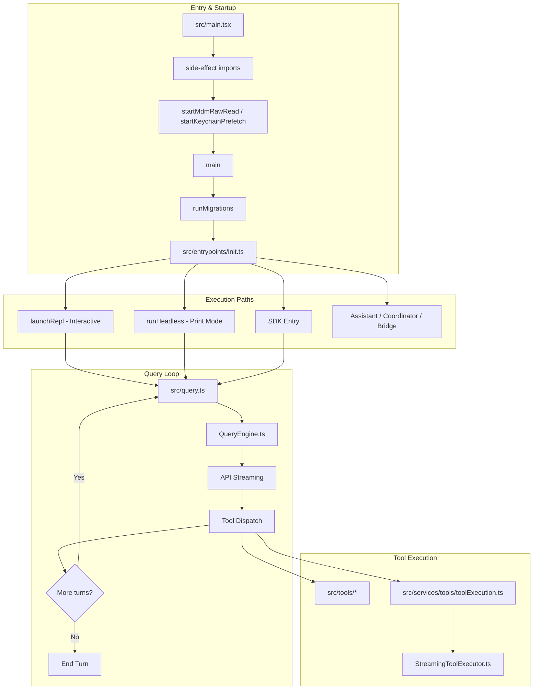
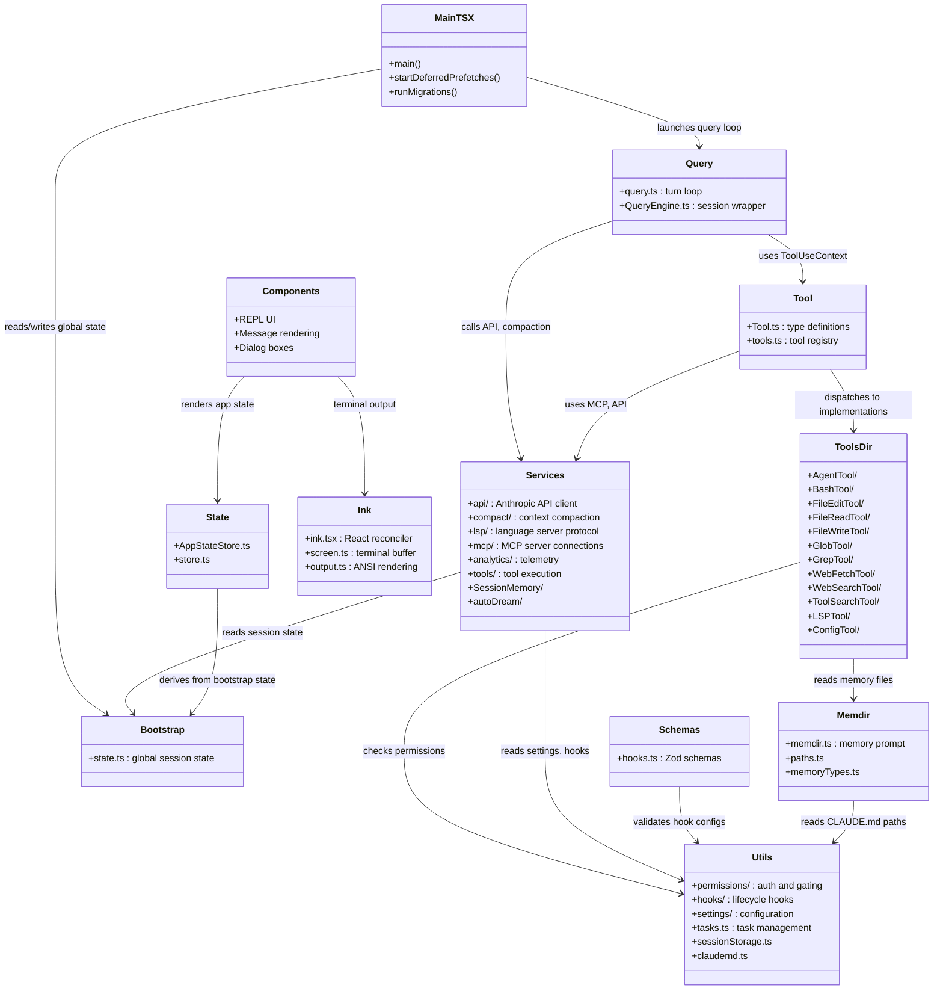
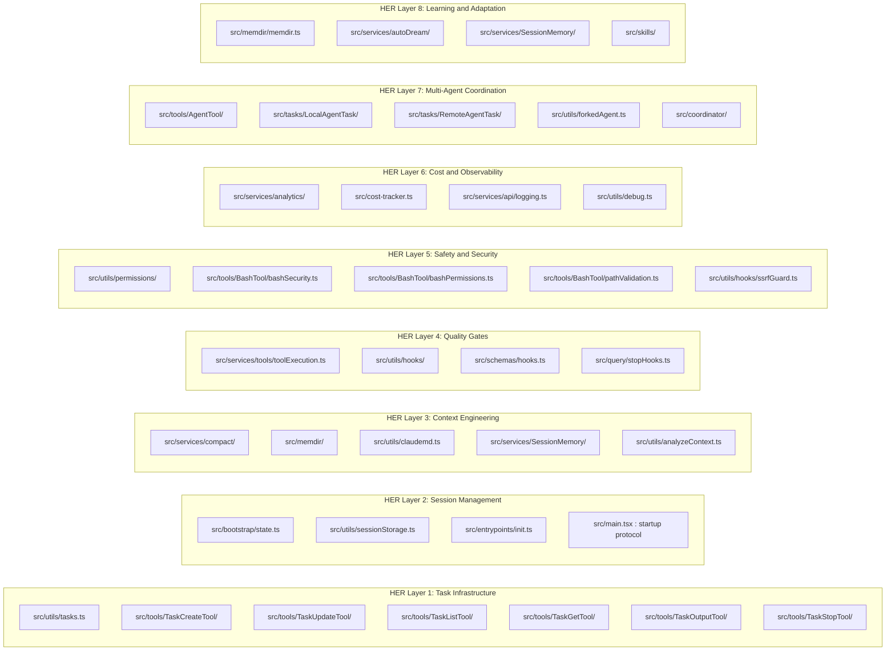

# A Guided Tour of the Repository

## Overview

The cc codebase lives entirely under a single `src/` directory with a flat top-level layout: no `packages/` monorepo, no `apps/` workspace split. The repository root contains only `src/`, `assets/`, and a `README.md`. This monolithic structure is deliberate -- every module shares the same TypeScript compilation context and can import any other module with a relative path, which keeps the build simple and enables the aggressive dead-code elimination that cc depends on to strip internal-only features from the external release.

The entry point `src/main.tsx` (4683 lines) is the spine of the application. Its first 200 lines are side-effect imports that parallelize startup I/O: MDM subprocess reads, keychain prefetches, and profiling checkpoints fire before the `main()` function is even defined `src/main.tsx:L1-L20`. From there, the flow branches into interactive REPL mode, headless print mode, SDK mode, or one of several feature-gated sub-modes (assistant, coordinator, bridge). Every major subsystem is rooted in a sibling directory of `src/`, and the directory names are the first guide to the architecture.

This chapter maps that directory tree. For each major folder it answers: what lives here, why, and how it connects to its neighbors. The map that follows is the orientation you need before the deeper dives into the agent loop, the tool pipeline, and the permission system in later chapters.

The top-level `src/` directory contains roughly 35 subdirectories and a handful of standalone files. The standalone files are the architectural keystones: `main.tsx` (entry), `Tool.ts` (type definitions), `tools.ts` (tool registry), `QueryEngine.ts` (session-level query orchestration), `query.ts` (single-turn loop), `commands.ts` (slash command registry), `cost-tracker.ts` (usage accounting), and `Task.ts` (task type definitions). Each of these standalone files imports heavily from the surrounding directories and re-exports types that the directories consume.

The directories themselves cluster into functional groups. The **entry and bootstrap** group (`entrypoints/`, `bootstrap/`) handles process startup and global state. The **query loop** group (`query/`, `services/compact/`) manages the agent turn cycle and context window. The **tool system** group (`tools/`, `services/tools/`) implements tool dispatch and execution. The **UI and rendering** group (`components/`, `ink/`, `hooks/`, `screens/`, `state/`) drives the terminal interface. The **infrastructure** group (`services/mcp/`, `services/api/`, `services/analytics/`, `services/lsp/`, `upstreamproxy/`, `server/`) handles external communication. The **persistence and memory** group (`memdir/`, `utils/sessionStorage.ts`, `services/SessionMemory/`, `services/autoDream/`) manages what the agent remembers across turns and sessions. The **safety and permissions** group (`utils/permissions/`, `schemas/`, `utils/hooks/`) gates tool execution and validates configuration. The **coordination** group (`tools/AgentTool/`, `tasks/`, `coordinator/`, `bridge/`) manages multi-agent workflows. The remaining directories serve specialized roles: `migrations/` for settings schema evolution, `skills/` for reusable prompt templates, `vim/` for modal editing, `buddy/` for the desktop companion sprite, `voice/` for speech input, and `constants/` for magic strings.

## Data structures and contracts

The central type contract for the tool system lives in `src/Tool.ts`. The `ToolUseContext` type is the bundle of capabilities that every tool receives when the harness calls it -- permission state, abort controller, file-read cache, app-state getters and setters, MCP clients, and dozens of optional callbacks:

```typescript
// src/Tool.ts:L158-L249
export type ToolUseContext = {
  options: {
    commands: Command[]
    debug: boolean
    mainLoopModel: string
    tools: Tools
    verbose: boolean
    thinkingConfig: ThinkingConfig
    mcpClients: MCPServerConnection[]
    mcpResources: Record<string, ServerResource[]>
    isNonInteractiveSession: boolean
    agentDefinitions: AgentDefinitionsResult
    maxBudgetUsd?: number
    customSystemPrompt?: string
    appendSystemPrompt?: string
    querySource?: QuerySource
    refreshTools?: () => Tools
  }
  abortController: AbortController
  readFileState: FileStateCache
  getAppState(): AppState
  setAppState(f: (prev: AppState) => AppState): void
  setAppStateForTasks?: (f: (prev: AppState) => AppState) => void
  handleElicitation?: (
    serverName: string,
    params: ElicitRequestURLParams,
    signal: AbortSignal,
  ) => Promise<ElicitResult>
  setToolJSX?: SetToolJSXFn
  addNotification?: (notif: Notification) => void
  appendSystemMessage?: (
    msg: Exclude<SystemMessage, SystemLocalCommandMessage>,
  ) => void
  sendOSNotification?: (opts: {
    message: string
    notificationType: string
  }) => void
  // ...additional fields continue
```

The `ToolUseContext` type is the seam between the agent loop and the tool implementations. The `options` field carries the static configuration (commands, model name, tools list), while the remaining fields are runtime capabilities. The `setAppState` function lets tools mutate shared UI state; `abortController` enables cooperative cancellation; `handleElicitation` is the MCP URL-authorization callback. Tools that run in non-interactive mode (SDK, headless) see `undefined` for REPL-only callbacks like `setToolJSX` and `sendOSNotification`, which keeps the contract honest about what modes support.

The global session state is concentrated in `src/bootstrap/state.ts`. It holds mutable fields like `originalCwd`, `totalCostUSD`, `mainLoopModelOverride`, and `isInteractive`, exposed through getter/setter pairs that are imported throughout the codebase `src/bootstrap/state.ts:L45-L80`. This file is the single source of truth for session-scoped configuration, and its comment -- "DO NOT ADD MORE STATE HERE - BE JUDICIOUS WITH GLOBAL STATE" -- signals that the authors consider uncontrolled global state a liability.

The hook system's contract is defined in `src/schemas/hooks.ts`. Each hook type (command, prompt, http, agent) has a Zod schema that validates the hook configuration at load time. The `BashCommandHookSchema` shows the shape:

```typescript
// src/schemas/hooks.ts:L32-L65
const BashCommandHookSchema = z.object({
  type: z.literal('command').describe('Shell command hook type'),
  command: z.string().describe('Shell command to execute'),
  if: IfConditionSchema(),
  shell: z
    .enum(SHELL_TYPES)
    .optional()
    .describe(
      "Shell interpreter. 'bash' uses your $SHELL (bash/zsh/sh); 'powershell' uses pwsh. Defaults to bash.",
    ),
  timeout: z
    .number()
    .positive()
    .optional()
    .describe('Timeout in seconds for this specific command'),
  statusMessage: z
    .string()
    .optional()
    .describe('Custom status message to display in spinner while hook runs'),
  once: z
    .boolean()
    .optional()
    .describe('If true, hook runs once and is removed after execution'),
  async: z
    .boolean()
    .optional()
    .describe('If true, hook runs in background without blocking'),
  asyncRewake: z
    .boolean()
    .optional()
    .describe(
      'If true, hook runs in background and wakes the model on exit code 2 (blocking error). Implies async.',
    ),
})
```

The `if` field uses permission-rule syntax (e.g., `Bash(git *)`) to gate when the hook fires, avoiding unnecessary process spawns. The `once` flag removes the hook after its first execution, and `asyncRewake` lets background hooks re-activate the model loop on error. This schema is the contract between the user's `settings.json` and the runtime hook executor.

The memory type taxonomy in `src/memdir/memoryTypes.ts` defines the four memory categories that cc persists across sessions:

```typescript
// src/memdir/memoryTypes.ts:L14-L31
export const MEMORY_TYPES = [
  'user',
  'feedback',
  'project',
  'reference',
] as const

export type MemoryType = (typeof MEMORY_TYPES)[number]

/**
 * Parse a raw frontmatter value into a MemoryType.
 * Invalid or missing values return undefined — legacy files without a
 * `type:` field keep working, files with unknown types degrade gracefully.
 */
export function parseMemoryType(raw: unknown): MemoryType | undefined {
  if (typeof raw !== 'string') return undefined
  return MEMORY_TYPES.find(t => t === raw)
}
```

The four types -- `user`, `feedback`, `project`, `reference` -- capture context not derivable from the current project state. Code patterns, architecture, git history, and file structure are all derivable via grep, git, and CLAUDE.md, and the memory system explicitly excludes them. The `parseMemoryType` function degrades gracefully on unknown types, which is a deliberate design choice for forward compatibility when new memory types are added in future versions.

## Control flow

The top-level control flow begins in `src/main.tsx` with the `main()` async function at line 585. Before `main()` runs, a sequence of side-effect imports fires: `profileCheckpoint('main_tsx_entry')` marks the entry timestamp, `startMdmRawRead()` launches MDM subprocess reads, and `startKeychainPrefetch()` fires keychain reads in parallel `src/main.tsx:L9-L20`. These prefetches overlap with the remaining ~135ms of module evaluation, a deliberate optimization that the comments call out explicitly.

Once `main()` starts, it processes CLI arguments, runs settings migrations (`runMigrations()` at `src/main.tsx:L326-L347`), initializes the analytics pipeline, and then branches into one of several execution paths. The `startDeferredPrefetches()` function, exported at `src/main.tsx:L388-L431`, runs after the REPL renders its first frame -- it fires user-identity lookups, git-status prefetches, and feature-flag refreshes that would otherwise block initial paint:

```typescript
// src/main.tsx:L388-L431
export function startDeferredPrefetches(): void {
  // This function runs after first render, so it doesn't block the initial paint.
  // However, the spawned processes and async work still contend for CPU and event
  // loop time, which skews startup benchmarks (CPU profiles, time-to-first-render
  // measurements). Skip all of it when we're only measuring startup performance.
  if (isEnvTruthy(process.env.CLAUDE_CODE_EXIT_AFTER_FIRST_RENDER) ||
  isBareMode()) {
    return;
  }

  // Process-spawning prefetches (consumed at first API call, user is still typing)
  void initUser();
  void getUserContext();
  prefetchSystemContextIfSafe();
  void getRelevantTips();
  if (isEnvTruthy(process.env.CLAUDE_CODE_USE_BEDROCK) && !isEnvTruthy(process.env.CLAUDE_CODE_SKIP_BEDROCK_AUTH)) {
    void prefetchAwsCredentialsAndBedRockInfoIfSafe();
  }
  if (isEnvTruthy(process.env.CLAUDE_CODE_USE_VERTEX) && !isEnvTruthy(process.env.CLAUDE_CODE_SKIP_VERTEX_AUTH)) {
    void prefetchGcpCredentialsIfSafe();
  }
  void countFilesRoundedRg(getCwd(), AbortSignal.timeout(3000), []);

  // Analytics and feature flag initialization
  void initializeAnalyticsGates();
  void prefetchOfficialMcpUrls();
  void refreshModelCapabilities();

  // File change detectors deferred from init() to unblock first render
  void settingsChangeDetector.initialize();
  if (!isBareMode()) {
    void skillChangeDetector.initialize();
  }
}
```

The `void` prefix on each call is intentional: these are fire-and-forget async operations whose results are consumed later (by the time the user submits their first query, the data is warm in cache). The `isBareMode()` check skips all prefetches in headless `-p` mode, because those calls have no "user is typing" window to hide latency in.

After the REPL renders and the user submits a query, control flows to `src/query.ts` (1729 lines), which orchestrates a single turn: it assembles the system prompt, feeds messages to the API, processes the streaming response, dispatches tool calls, and loops until the model emits `end_turn` or the abort controller fires. The `src/QueryEngine.ts` (1295 lines) wraps `query.ts` with session-level concerns: compaction triggers, usage tracking, SDK message formatting, and message-queue management.

The initialization path goes through `src/entrypoints/init.ts`, which is a memoized async function that sets up the configuration system, applies environment variables, initializes TLS certificates, and launches telemetry `src/entrypoints/init.ts:L57-L80`. The `init` function is called once per process and cached by `memoize`, so repeated calls are no-ops.

The tool registry lives in `src/tools.ts`. The `getAllBaseTools()` function is the single source of truth for every tool that the model can invoke:

```typescript
// src/tools.ts:L193-L249
export function getAllBaseTools(): Tools {
  return [
    AgentTool,
    TaskOutputTool,
    BashTool,
    ...(hasEmbeddedSearchTools() ? [] : [GlobTool, GrepTool]),
    ExitPlanModeV2Tool,
    FileReadTool,
    FileEditTool,
    FileWriteTool,
    NotebookEditTool,
    WebFetchTool,
    TodoWriteTool,
    WebSearchTool,
    TaskStopTool,
    AskUserQuestionTool,
    SkillTool,
    EnterPlanModeTool,
    ...(process.env.USER_TYPE === 'ant' ? [ConfigTool] : []),
    ...(process.env.USER_TYPE === 'ant' ? [TungstenTool] : []),
    ...(SuggestBackgroundPRTool ? [SuggestBackgroundPRTool] : []),
    ...(WebBrowserTool ? [WebBrowserTool] : []),
    ...(isTodoV2Enabled()
      ? [TaskCreateTool, TaskGetTool, TaskUpdateTool, TaskListTool]
      : []),
    ...(OverflowTestTool ? [OverflowTestTool] : []),
    ...(CtxInspectTool ? [CtxInspectTool] : []),
    ...(TerminalCaptureTool ? [TerminalCaptureTool] : []),
    ...(isEnvTruthy(process.env.ENABLE_LSP_TOOL) ? [LSPTool] : []),
    ...(isWorktreeModeEnabled() ? [EnterWorktreeTool, ExitWorktreeTool] : []),
    getSendMessageTool(),
    ...(ListPeersTool ? [ListPeersTool] : []),
    ...(isAgentSwarmsEnabled()
      ? [getTeamCreateTool(), getTeamDeleteTool()]
      : []),
    ...(VerifyPlanExecutionTool ? [VerifyPlanExecutionTool] : []),
    ...(process.env.USER_TYPE === 'ant' && REPLTool ? [REPLTool] : []),
    ...(WorkflowTool ? [WorkflowTool] : []),
    ...(SleepTool ? [SleepTool] : []),
    ...cronTools,
    ...(RemoteTriggerTool ? [RemoteTriggerTool] : []),
    ...(MonitorTool ? [MonitorTool] : []),
    BriefTool,
    ...(SendUserFileTool ? [SendUserFileTool] : []),
    ...(PushNotificationTool ? [PushNotificationTool] : []),
    ...(SubscribePRTool ? [SubscribePRTool] : []),
    ...(getPowerShellTool() ? [getPowerShellTool()] : []),
    ...(SnipTool ? [SnipTool] : []),
    ...(process.env.NODE_ENV === 'test' ? [TestingPermissionTool] : []),
    ListMcpResourcesTool,
    ReadMcpResourceTool,
    ...(isToolSearchEnabledOptimistic() ? [ToolSearchTool] : []),
  ]
}
```

The spread-operator pattern (`...`) is used throughout to conditionally include tools based on feature flags, environment variables, and user type. The comment at line 191 notes that this list must stay in sync with the Statsig caching configuration, because the tool list is part of the system prompt and affects prompt-cache hit rates. The `hasEmbeddedSearchTools()` check is notable: when the Bun binary has bfs/ugrep embedded, the dedicated `GlobTool` and `GrepTool` are omitted because the shell's find/grep are already aliased to the fast implementations.

The `src/services/mcp/types.ts` file defines the MCP server configuration schema, which controls how cc connects to external tool servers. The `ConfigScopeSchema` enumerates seven configuration scopes:

```typescript
// src/services/mcp/types.ts:L10-L21
export const ConfigScopeSchema = lazySchema(() =>
  z.enum([
    'local',
    'user',
    'project',
    'dynamic',
    'enterprise',
    'claudeai',
    'managed',
  ]),
)
export type ConfigScope = z.infer<ReturnType<typeof ConfigScopeSchema>>
```

The `local` scope is per-project `.claude/settings.json`; `user` is `~/.claude/settings.json`; `project` is shared project-level settings; `dynamic` comes from feature flags; `enterprise` from MDM policy; `claudeai` from the Claude.ai web service; and `managed` from remote managed settings. This layered scope system is how cc resolves conflicting configuration from multiple sources, with later scopes overriding earlier ones.



The directory dependency graph below shows how the major source folders relate to each other. Arrows indicate import direction -- a folder at the tail imports from the folder at the head:



The third diagram maps the HER 8-layer reference architecture onto the cc directory structure. Each HER layer corresponds to one or more directories, though no single directory maps to only one layer:



The mapping reveals that cc's directory structure does not align 1:1 with the HER layers. The `src/utils/` directory spans Layers 1-6, and `src/services/compact/` implements Layer 3 but also participates in Layer 4 (via `compactWarningHook.ts`). The `src/tools/AgentTool/` directory is the primary implementation of Layer 7, but the `src/coordinator/coordinatorMode.ts` module adds a parallel coordination mode. This cross-cutting is typical of production codebases that evolve organically rather than being architected top-down.

### Directory-by-directory detail

**src/bootstrap/** (1 file, `state.ts` at 1758 lines) is the global state module. Every other directory imports from it. The `state.ts` file holds session-level mutable state in a plain object with getter/setter functions: `getSessionId()`, `getTotalCostUSD()`, `getMainLoopModel()`, `isInteractive()`, and dozens more. The `cost-tracker.ts` file at the `src/` level re-exports cost-related getters and setters from `bootstrap/state.ts`, providing a facade that insulates consumers from the raw state module `src/cost-tracker.ts:L1-L69`. The state object includes OpenTelemetry meter providers, metric counters, and attributed counters, making this file the nexus of the observability stack as well.

**src/entrypoints/** (4 files) contains the initialization and entry-point logic. The `init.ts` file (340 lines) is a memoized async function that enables configs, applies environment variables, sets up TLS certificates, and initializes telemetry `src/entrypoints/init.ts:L57-L80`. The `cli.tsx` file handles the CLI argument parsing via Commander.js. The `mcp.ts` file (196 lines) implements the MCP server mode, where cc acts as an MCP server rather than a client. The `agentSdkTypes.ts` file defines the SDK-facing types.

**src/query/** (4 files) supports the query loop. The `config.ts` and `deps.ts` files are small dependency-injection helpers. The `tokenBudget.ts` file (93 lines) computes token budget allocations for system prompts and tool descriptions. The `stopHooks.ts` file (473 lines) implements the stop-hook mechanism that allows hooks to intercept and modify the model's response before it reaches the user.

**src/services/** is the largest directory cluster, containing 15 subdirectories. The **api/** subdirectory (20 files) is the Anthropic API client layer. The `claude.ts` file (3419 lines) handles streaming requests, retry logic, and model routing. The `errors.ts` file (1207 lines) defines error categories and retry strategies. The `logging.ts` file (788 lines) tracks API usage and token counts. The **compact/** subdirectory (11 files) implements the five-stage compaction hierarchy: `compact.ts` (1705 lines) is the orchestrator, `microCompact.ts` (530 lines) handles the second stage of selective message summarization, `autoCompact.ts` (351 lines) triggers automatic compaction when the context window fills, and `sessionMemoryCompact.ts` (630 lines) compacts session memory. The **mcp/** subdirectory (23 files) manages MCP server connections, configuration, OAuth flows, and the XAA (Cross-App Access) identity provider. The **lsp/** subdirectory (7 files) implements a Language Server Protocol client that provides code intelligence to the LSPTool. The **analytics/** subdirectory (9 files) handles event logging, GrowthBook feature flags, DataDog metrics, and first-party event export. The **tools/** subdirectory (4 files) contains the tool execution pipeline: `toolExecution.ts` (1745 lines) dispatches tool calls, `StreamingToolExecutor.ts` (530 lines) handles streaming tool output, `toolHooks.ts` (650 lines) fires PreToolUse and PostToolUse hooks, and `toolOrchestration.ts` (188 lines) coordinates parallel tool execution.

**src/tools/** is the second-largest directory cluster, with each tool occupying its own subdirectory. The most complex tools are **BashTool/** (17 files, 2600+ lines total), which implements shell command execution with sandboxing, permission classification, path validation, and sed-edit parsing; **AgentTool/** (14 files), which implements the subagent dispatch system including fork-based execution, agent memory, color management, and agent definition loading; and **PowerShellTool/** (17 files), which mirrors BashTool for Windows environments. Smaller tools like **GlobTool/** (3 files), **GrepTool/** (3 files), and **WebFetchTool/** (5 files) follow a consistent pattern: a main implementation file, a UI rendering file, and a prompt-description file.

**src/utils/** is the largest single directory, containing 200+ files and 5 subdirectories. The **permissions/** subdirectory (23 files) implements the permission system: `PermissionMode.ts` (141 lines) defines the six permission modes, `bashClassifier.ts` (61 lines) classifies bash commands by risk level, `permissions.ts` (1486 lines) is the main permission evaluation engine, and `filesystem.ts` (1777 lines) handles filesystem-access rules. The **hooks/** subdirectory (17 files) implements the hook lifecycle: `hooksSettings.ts` (271 lines) parses hook configuration from settings, `execAgentHook.ts` (339 lines) runs agent-type hooks, `execHttpHook.ts` (242 lines) runs HTTP hooks, `hookEvents.ts` (192 lines) defines hook event types, and `ssrfGuard.ts` (294 lines) protects against server-side request forgery in HTTP hooks. The **settings/** subdirectory (16 files) manages configuration from all sources: `settings.ts` (1015 lines) is the main settings loader, `types.ts` (1148 lines) defines the full settings schema, and `validation.ts` handles schema validation.

**src/memdir/** (8 files) implements the persistent memory system. The `memdir.ts` file (507 lines) builds the memory prompt that is injected into the system prompt. The `paths.ts` file (278 lines) resolves memory directory locations. The `memoryTypes.ts` file (271 lines) defines the four memory type taxonomy and the XML-structured prompt sections that teach the model when and how to save memories. The `findRelevantMemories.ts` file (141 lines) searches memory files for relevance to the current query.

**src/bridge/** (30 files) implements the remote-bridge mode, where cc connects to an IDE or remote control server. The `bridgeMain.ts` file (2999 lines) and `replBridge.ts` file (2406 lines) are the two largest files, handling bidirectional message passing between the REPL and the bridge client. The bridge system supports JetBrains IDEs, VS Code, and a generic HTTP bridge.

**src/state/** (6 files) manages React application state. The `AppStateStore.ts` file (569 lines) defines the `AppState` type and the `getDefaultAppState` function. The `store.ts` file implements a simple state container with subscription support. The `onChangeAppState.ts` file (171 lines) registers side effects that run when app state changes.

**src/ink/** (44 files) is a custom fork of the Ink terminal rendering library. It provides a React reconciler for the terminal (`ink.tsx` at 1722 lines), a screen buffer (`screen.ts` at 1486 lines), ANSI output rendering (`output.ts` at 797 lines), and terminal I/O handling (`termio/`). This fork adds features like selection support, search highlighting, and terminal-querier integration that the upstream Ink library does not provide.

**src/components/** (100+ files) contains the React components that render the REPL UI. The `App.tsx` file is the root component. Key components include `Messages.tsx` and `Message.tsx` for rendering the conversation, `PromptInput/` for the input field, `StatusLine.tsx` for the bottom status bar, `CompactSummary.tsx` for compaction notifications, and dozens of dialog components for settings, permissions, and onboarding.

**src/hooks/** (75+ files) contains React hooks that wire UI components to the underlying systems. Examples include `useCanUseTool.tsx` for permission checks, `useGlobalKeybindings.tsx` for keyboard shortcuts, `useTypeahead.tsx` (1384 lines) for command completion, `useVoice.ts` (1144 lines) for speech input, and `useSettings.ts` for reactive settings updates.

**src/migrations/** (11 files) handles schema evolution for settings. Each migration file corresponds to a specific settings change: `migrateAutoUpdatesToSettings.ts`, `migrateBypassPermissionsAcceptedToSettings.ts`, `migrateSonnet45ToSonnet46.ts`, and so on. The `CURRENT_MIGRATION_VERSION` constant in `src/main.tsx:L325` is bumped when a new migration is added, and `runMigrations()` at `src/main.tsx:L326-L347` runs the full set if the stored version is out of date.

**src/coordinator/** (1 file, `coordinatorMode.ts` at 369 lines) implements a parallel coordination mode where a coordinator agent dispatches work to worker agents. This is feature-gated behind the `COORDINATOR_MODE` flag and loaded via conditional `require()` to enable dead-code elimination `src/main.tsx:L76-L77`.

**src/skills/** (3 files) manages the skill system. The `bundledSkills.ts` file (220 lines) registers built-in skills. The `loadSkillsDir.ts` file (1086 lines) discovers and loads user-defined skills from the filesystem, parsing YAML frontmatter and registering hook-based triggers. The `mcpSkillBuilders.ts` file creates skill wrappers around MCP tools.

## Edge cases and failure modes

The startup path in `src/main.tsx` has several edge-case branches that are easy to overlook. The `isBeingDebugged()` function at line 232 checks `process.execArgv`, `NODE_OPTIONS`, and the Node inspector URL, then calls `process.exit(1)` if any debug flag is detected `src/main.tsx:L232-L271`. This is a security measure: debuggers can be used to inspect model outputs and API keys in transit. The check runs at module top level, before `main()` is called, which means it fires even if the process is imported as a library. The implementation handles a Bun-specific bug where application arguments from `process.argv` leak into `process.execArgv` in single-file executables, so the Bun branch only checks for `--inspect` variants while the Node.js branch also checks for the legacy `--debug` flag.

The `startDeferredPrefetches()` function skips all background work when `CLAUDE_CODE_EXIT_AFTER_FIRST_RENDER` or bare mode is active `src/main.tsx:L393-L401`. In bare mode (`-p` / `--print`), the process has no interactive session, so prefetching user identity, git status, and feature flags is pure overhead that adds latency to the critical path.

The `prefetchSystemContextIfSafe()` function at line 360 shows a subtle trust boundary: git commands can execute arbitrary code via hooks and config (e.g., `core.fsmonitor`, `diff.external`), so cc only prefetches git status after the trust dialog has been accepted or in non-interactive mode where trust is implicit `src/main.tsx:L360-L380`. A malicious git repository could otherwise achieve code execution during the startup window before the user has granted trust.

The `ToolUseContext` type has many optional fields (`setToolJSX`, `handleElicitation`, `sendOSNotification`) that are `undefined` in SDK or headless mode. Tools that unconditionally call these callbacks will throw a TypeError. The type system makes this explicit through the `?` modifier, but runtime crashes can still occur if a tool assumes a REPL context that does not exist.

The tool registry in `getAllBaseTools()` uses spread operators to conditionally include tools. A tool that is included when `isToolSearchEnabledOptimistic()` returns true but then disabled at request time will be absent from the model's tool list without any error. The "optimistic" in the function name signals that the inclusion decision may be revised later, and tool-search-aware code must handle the case where a tool that was registered is no longer available when the model tries to call it.

The `src/utils/tasks.ts` file uses filesystem-based locking for task operations. The `lockfile` import at line 10 provides mutual exclusion for concurrent processes that might try to update the same task list simultaneously `src/utils/tasks.ts:L10`. The `notifyTasksUpdated()` function at line 61 wraps its signal emission in try/catch so that listener failures never propagate to callers, because task mutations must succeed from the caller's perspective even if the UI update fails.

## Where cc diverges from the published pattern

The HER reference architecture describes an 8-layer stack, but no public implementation covers all eight layers. The cc codebase provides partial coverage: Layer 1 (tasks) is well-implemented with Zod-validated schemas and filesystem-backed persistence; Layer 2 (session management) is split between `src/bootstrap/state.ts` and `src/utils/sessionStorage.ts` but lacks the structured session-to-session handoff that HER prescribes; Layer 3 (context engineering) is cc's strongest layer, with a five-stage compaction hierarchy and the memdir system; Layer 5 (safety) is comprehensive in the BashTool but thinner for other tools.

One notable divergence is in Layer 7 (multi-agent coordination). HER prescribes file-based inter-agent communication and git-based conflict resolution as the coordination mechanism. cc implements this through the `src/tools/AgentTool/` directory, which uses a fork-based subprocess model (`src/tools/AgentTool/forkSubagent.ts` at 210 lines) rather than the file-based approach. The `src/coordinator/coordinatorMode.ts` module adds a parallel coordinator pattern that is closer to the HER generator-evaluator pattern, but it is feature-gated behind `COORDINATOR_MODE` and not the default.

The permission model in `src/utils/permissions/PermissionMode.ts` diverges from HER's three-tier model (read-only, discuss, full access). cc implements six modes: `default`, `plan`, `acceptEdits`, `bypassPermissions`, `dontAsk`, and conditionally `auto` `src/utils/permissions/PermissionMode.ts:L44-L91`. The `auto` mode, which uses a transcript classifier to decide whether to approve tool calls automatically, has no HER analogue and represents an additional safety layer that goes beyond the published pattern.

Layer 8 (learning and adaptation) is partially implemented through the memdir system and `src/services/autoDream/`, which performs offline consolidation of session memory. However, HER's "stale assumptions pruned as models improve" and "harness configuration versioning and A/B testing" capabilities are not present in the codebase. The `src/services/analytics/growthbook.ts` module provides feature-flag A/B testing for cc's own features, but this is operational telemetry, not the meta-harness self-improvement loop that HER describes.

The bridge system (`src/bridge/`) is a cc-specific addition with no HER analogue. It implements a bidirectional communication channel between the cc REPL and an IDE or remote control server, supporting JetBrains, VS Code, and a generic HTTP protocol. The bridge module includes JWT-based authentication, session management, and capacity-aware wake mechanisms. This represents a production concern (IDE integration) that the HER reference architecture abstracts away.

The migration system (`src/migrations/`) is another cc-specific pattern not addressed by HER. Settings schemas evolve over time, and the migration system ensures that user configurations are updated automatically when cc is upgraded. The `CURRENT_MIGRATION_VERSION` constant is incremented with each new migration, and `runMigrations()` applies the full set if the stored version is stale `src/main.tsx:L325-L347`. This is a pragmatic solution to the schema-evolution problem that long-running agent systems face when configuration formats change between releases.

## Developer takeaways for building a long-running agent

Building a long-running agent from this codebase teaches three lessons. First, concentrate global mutable state in a single module with getter/setter pairs, as `src/bootstrap/state.ts` does, rather than scattering it across closure variables and module-level `let` bindings. The comment "DO NOT ADD MORE STATE HERE" is a discipline mechanism that forces new state to justify its existence against the existing set. The `cost-tracker.ts` facade shows how to re-export a focused subset of state accessors so that consumers do not need to know about the full state object. Second, separate the startup path into overlapping phases: side-effect imports for I/O that can run in parallel with module evaluation, synchronous initialization for data needed before first render, and deferred prefetches for data consumed later. The `startDeferredPrefetches()` pattern at `src/main.tsx:L388-L431` is worth copying because it makes the time-to-first-render measurable and tunable. The `void` prefix on fire-and-forget calls is a convention that makes the non-blocking intent explicit at the call site. Third, make the tool execution context a single typed object (`ToolUseContext`) rather than passing individual parameters. This makes it straightforward to add new capabilities (like `handleElicitation` for MCP URL authorization) without changing every tool's signature, and the `?` optional markers make mode-dependent capabilities explicit at the type level. The cost of this approach is that the context type grows large, but the alternative -- thread-local globals or implicit context -- is worse for a system that runs subagents with different permission levels in the same process.
