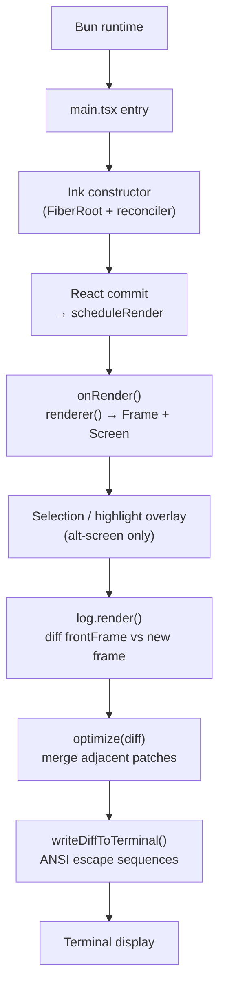
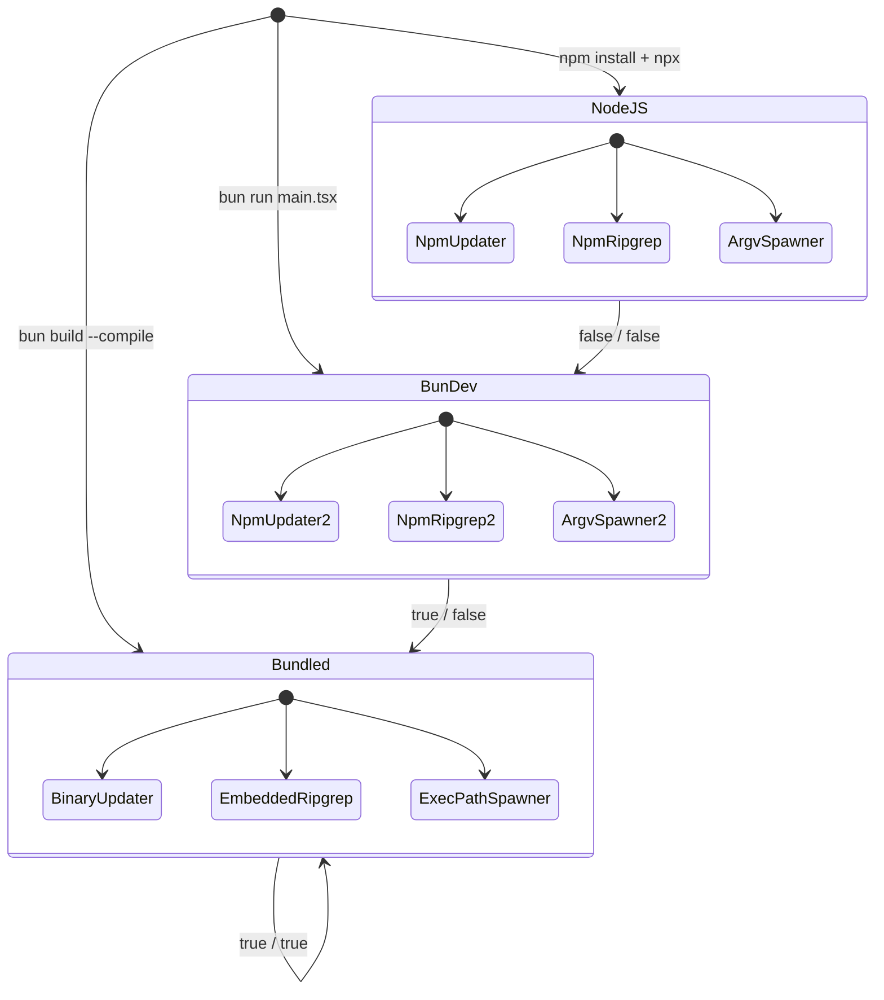

# TypeScript, Bun, React, Ink: The Unusual Runtime Stack

## Overview

cc runs on a runtime stack that would have been impractical five years ago: TypeScript transpiled by Bun, a React tree rendered into a terminal by Ink, and feature-flagged bundling that produces either an npm package or a standalone binary. The choice is deliberate. TypeScript gives the harness strong typing for its tool schemas and state transitions; Bun delivers sub-100ms startup and native-speed file I/O; React's component model gives cc a structured terminal UI with diff-based rendering; and `isInBundledMode()` gates runtime paths that differ between the npm distribution and the compiled executable. Each layer was chosen to solve a concrete problem in agent harness engineering, not for novelty.

Why not Python, the language of most agent frameworks? Python's dynamic typing makes runtime schema validation the only enforcement mechanism, and its startup time (especially with heavy ML dependencies) is measured in seconds, not milliseconds. Why not Go or Rust, which compile to fast single binaries? Neither has a component model like React that decomposes a complex terminal UI into independently testable pieces. The TypeScript + React combination gives cc two things the alternatives cannot: compile-time enforcement of tool input schemas and UI component boundaries, and a diff-based rendering model that scales to 60 fps streaming output without frame drops.

This chapter traces the runtime stack from the Bun entry point through the Ink rendering pipeline to the terminal, examines the data structures that make Ink's diff engine fast enough for interactive use, and connects cc's choices to the broader thesis from HER §4: harness quality depends on language and runtime affordances. Fowler's observation that "strongly typed languages" and "clear module boundaries" improve harnessability applies directly — TypeScript's type system is what makes cc's tool schema definitions reliable, and React's component tree is what makes the terminal UI composable and testable. Fowler also notes that "legacy systems with technical debt face particular challenges: harnesses are most necessary where hardest to build." cc's greenfield status meant the team could choose a stack optimized for harnessability from the start, rather than retrofitting controls onto an existing codebase.

## Data structures and contracts

### Bundled-mode detection

The smallest module in the codebase, `src/utils/bundledMode.ts`, defines two boolean predicates that gate runtime behavior across at least twelve call sites:

```typescript
// src/utils/bundledMode.ts:L7-L22 — Bun and bundled-mode detection
export function isRunningWithBun(): boolean {
  // https://bun.com/guides/util/detect-bun
  return process.versions.bun !== undefined
}

export function isInBundledMode(): boolean {
  return (
    typeof Bun !== 'undefined' &&
    Array.isArray(Bun.embeddedFiles) &&
    Bun.embeddedFiles.length > 0
  )
}
```

The `isRunningWithBun()` function checks `process.versions.bun`, the canonical detection hook Bun provides. The `isInBundledMode()` function goes further: it checks for `Bun.embeddedFiles`, a property that exists only in Bun-compiled standalone executables where static assets (ripgrep binaries, skill templates, default configs) are baked into the binary. When `isInBundledMode()` returns true, cc skips npm-specific paths — the auto-updater uses a different download URL, ripgrep is loaded from embedded files rather than a node_modules path, and the subagent spawner uses `process.execPath` instead of `process.argv[1]` to locate the binary. This two-tier detection contract — Bun vs. bundled — is the seam that lets the same TypeScript codebase ship as both an npm package and a self-contained binary.

### Screen buffer: packed typed arrays

Ink's rendering pipeline centers on a `Screen` type that stores terminal cell data in packed `Int32Array` buffers instead of per-cell objects. For a 200x120 terminal, this avoids allocating 24,000 objects per frame.

```typescript
// src/ink/screen.ts:L366-L415 — Screen type with packed cell layout
export type Screen = Size & {
  cells: Int32Array
  cells64: BigInt64Array
  charPool: CharPool
  hyperlinkPool: HyperlinkPool
  emptyStyleId: number
  damage: Rectangle | undefined
  noSelect: Uint8Array
  softWrap: Int32Array
}
```

Each cell occupies two consecutive `Int32` elements: word0 holds the charId (index into `CharPool`), word1 packs styleId, hyperlinkId, and CellWidth into a single 32-bit word. The `cells64` field is a `BigInt64Array` view over the same `ArrayBuffer`, enabling bulk fill via `BigInt64Array.fill()` for screen clears — one native call instead of a per-cell loop. The `damage` rectangle tracks which cells were written during rendering, so the diff pass can skip unchanged regions. The `noSelect` bitmap marks gutter cells (line numbers, diff sigils) that should be excluded from text selection. The `softWrap` array tracks per-row word-wrap continuation so that selection copy joins wrapped lines without spurious newlines.

### Cell width enum and character pools

The `CellWidth` const enum handles double-wide characters (CJK, emoji) by explicitly classifying each cell as Narrow, Wide, SpacerTail, or SpacerHead. This avoids inferring width at render time and makes cursor positioning straightforward.

```typescript
// src/ink/screen.ts:L289-L300 — CellWidth classification
export const enum CellWidth {
  Narrow = 0,
  Wide = 1,
  SpacerTail = 2,
  SpacerHead = 3,
}
```

The `CharPool` class interns character strings into a shared index. ASCII characters (code < 128) use a fast-path `Int32Array` lookup; Unicode characters fall through to a `Map<string, number>`. Because the pool is shared across all screens, `blitRegion` can copy char IDs directly without re-interning, and the diff engine can compare IDs as integers rather than strings.

### StylePool: interning and bit-0 visibility

The `StylePool` class manages ANSI escape sequences (SGR codes for bold, inverse, underline, colors) with a space-efficient encoding. Each distinct combination of SGR codes receives an integer ID. The lowest bit of the ID encodes whether the style has a visible effect on space characters — background colors, inverse, underline, and strikethrough all set this bit. This single-bit flag lets the renderer skip invisible spaces with a single bitmask check, which matters because a typical frame contains far more whitespace than visible text.

```typescript
// src/ink/screen.ts:L129-L141 — StylePool.intern with bit-0 visibility encoding
intern(styles: AnsiCode[]): number {
  const key = styles.length === 0 ? '' : styles.map(s => s.code).join('\0')
  let id = this.ids.get(key)
  if (id === undefined) {
    const rawId = this.styles.length
    this.styles.push(styles.length === 0 ? [] : styles)
    id =
      (rawId << 1) |
      (styles.length > 0 && hasVisibleSpaceEffect(styles) ? 1 : 0)
    this.ids.set(key, id)
  }
  return id
}
```

The `transition()` method on `StylePool` pre-computes and caches the ANSI escape string needed to transition from one style to another, keyed by `(fromId, toId)`. After the first call for a given pair, subsequent transitions produce zero allocations. This caching is critical for the diff engine: each cell transition in a frame can look up the minimal ANSI sequence without recomputing the SGR diff. The `withInverse()`, `withCurrentMatch()`, and `withSelectionBg()` methods build composite styles (inverse, yellow-highlight, selection overlay) on top of base styles with their own caches, preventing repeated array scans for the same base ID.

## Control flow

### The render pipeline: from React tree to terminal bytes

The Ink class orchestrates a synchronous render pipeline on every frame. The flow begins when React's reconciler calls `scheduleRender` (a throttled wrapper around `queueMicrotask(onRender)`) after a commit. Inside `onRender`, the renderer converts the React DOM tree into a `Frame` containing a `Screen` buffer, the diff engine compares the new frame against the previous one, and the resulting patches are written to the terminal.



The `onRender` method is the performance-critical center. It flushes interaction time, calls the renderer to produce a new frame, applies selection and search-highlight overlays (alt-screen only), runs the diff, optimizes the patch list, and writes the result. Timing is tracked per phase (renderer, diff, optimize, write) and emitted via the `onFrame` callback for profiling. The render is throttled at `FRAME_INTERVAL_MS` with both leading and trailing edges, ensuring that rapid React commits (e.g., streaming tokens) are batched into frames at a sustainable rate while the final state is always rendered.

### Double-buffering and frame swap

Ink maintains two frame buffers — `frontFrame` (currently displayed) and `backFrame` (previous, reused for the next render). After diffing, they are swapped by reference:

```typescript
// src/ink/ink.tsx:L594-L595 — Buffer swap after diff
this.backFrame = this.frontFrame;
this.frontFrame = frame;
```

This swap is a pointer reassignment, not a copy. The old `backFrame` is discarded and the renderer reuses its screen buffer via `resetScreen`, which zeroes the typed arrays in place rather than allocating new ones. Pool growth is bounded by periodic resets — every 5 minutes, `resetPools()` creates fresh `CharPool` and `HyperlinkPool` instances and migrates the front frame's IDs into them, preventing unbounded string accumulation during long sessions (`src/ink/ink.tsx:L600-L604`).

The `resetScreen` function is the workhorse that prepares a screen for reuse without allocation. It checks whether the existing `ArrayBuffer` is large enough and only reallocates if the new dimensions exceed the buffer's capacity. The cell data is cleared with a single `BigInt64Array.fill(0n)` call, which the V8/Bun runtime translates to a `memset` — dramatically faster than a per-cell loop. The `noSelect` and `softWrap` arrays are similarly bulk-cleared:

```typescript
// src/ink/screen.ts:L531-L544 — Bulk-clear in resetScreen
screen.cells64.fill(EMPTY_CELL_VALUE, 0, size)
screen.noSelect.fill(0, 0, size)
screen.softWrap.fill(0, 0, height)

screen.width = width
screen.height = height
screen.damage = undefined
```

The `EMPTY_CELL_VALUE` constant is `0n` (BigInt zero), which matches the zero-initialized state of the packed cell format: word0 = `EMPTY_CHAR_INDEX` (0, which maps to space in CharPool), word1 = `packWord1(emptyStyleId, 0, CellWidth.Narrow)` = 0. This zero-convention means that `resetScreen` and `createScreen` produce identical empty states — a fresh screen from `createScreen` and a recycled screen from `resetScreen` are indistinguishable to the diff engine.

### Bundled-mode state machine

The two detection functions in `bundledMode.ts` create three runtime states that affect behavior throughout the codebase:



In NodeJS mode (`isRunningWithBun() === false`), cc runs as a standard npm package: the auto-updater downloads new npm versions, ripgrep is resolved from node_modules, and subagent spawning uses `process.argv[1]` to locate the script. In BunDev mode (Bun runtime but not compiled), behavior is largely the same as NodeJS for distribution-specific paths. In Bundled mode (`isInBundledMode() === true`), cc is a standalone binary: the auto-updater downloads a new binary, ripgrep is loaded from `Bun.embeddedFiles`, and subagent spawning uses `process.execPath`. The `isInBundledMode()` guard appears at multiple call sites — IPC endpoint selection in the bridge module, embedded image processing binary resolution, and ripgrep resolution — gating each path between npm and embedded-asset alternatives.

The bundled-mode branching is not merely a convenience — it has security implications aligned with HER §12's supply-chain threat model. When running from npm, the tool resolution path traverses `node_modules`, which is susceptible to dependency confusion and prototype pollution attacks. When running in bundled mode, the tool binaries are embedded in the executable at compile time, eliminating the npm resolution chain entirely. This reduces the attack surface but introduces a different trust assumption: the build pipeline that produces the binary must be trusted not to inject malicious embedded files. The `Bun.embeddedFiles` API provides no integrity verification — a tampered build would be undetectable at runtime. This tradeoff between distribution-chain trust and npm-chain trust is a recurring theme in agent system design, and `isInBundledMode()` is the branching point where cc chooses between them.

### Yoga layout and the render-commit cycle

Ink uses Facebook's Yoga layout engine to compute flexbox positions in the terminal. The `onComputeLayout` callback runs during React's commit phase:

```typescript
// src/ink/ink.tsx:L239-L258 — Yoga layout computation during React commit
this.rootNode.onComputeLayout = () => {
  if (this.isUnmounted) {
    return;
  }
  if (this.rootNode.yogaNode) {
    const t0 = performance.now();
    this.rootNode.yogaNode.setWidth(this.terminalColumns);
    this.rootNode.yogaNode.calculateLayout(this.terminalColumns);
    const ms = performance.now() - t0;
    recordYogaMs(ms);
    const c = getYogaCounters();
    this.lastYogaCounters = {
      ms,
      ...c
    };
  }
};
```

The Yoga layout is calculated synchronously during React's commit phase so that `useLayoutEffect` hooks have access to fresh position data. This is critical for the cursor declaration system: the `useDeclaredCursor` hook sets the cursor position in a layout effect, and the deferred microtask render runs after layout effects have committed, so the native terminal cursor tracks the input caret without a one-keystroke lag (`src/ink/ink.tsx:L206-L211`).

## Edge cases and failure modes

### Startup-time implications of the Bun choice

Bun's primary advantage over Node.js for an agent harness is startup speed. cc's entry module imports over 100 modules, and Bun's transpiler handles them in a single pass without a separate bundling step. The `isRunningWithBun()` detection function in `src/utils/bundledMode.ts:L7` marks the first runtime fork — Bun's startup advantage comes from two sources: its JavaScriptCore-based runtime has faster module evaluation than V8's just-in-time compilation warmup, and its built-in bundler eliminates the need for a separate transpile step during development. The tradeoff is ecosystem compatibility: some npm packages that depend on Node.js internals (native addons, specific `fs` semantics) may not work under Bun, requiring runtime detection via `isRunningWithBun()` to fall back to compatible alternatives.

### Alt-screen desync and self-healing

The alt-screen mode (DEC private mode 1049) is fragile. External processes — tmux pane redraws, SSH reconnections, laptop sleep/wake — can drop cc out of alt-screen mode while `altScreenActive` remains true in memory. Ink implements multiple self-healing paths: `reassertTerminalModes()` re-enables extended key reporting and mouse tracking after a >5s stdin silence gap (`src/ink/ink.tsx:L896-L918`), and `handleResume()` re-enters alt-screen on SIGCONT (`src/ink/ink.tsx:L280-L301`). The `reenterAltScreen()` method writes `ENTER_ALT_SCREEN + ERASE_SCREEN + CURSOR_HOME` and resets both frame buffers, forcing a full repaint from scratch (`src/ink/ink.tsx:L964-L967`).

### Wide-character orphan cleanup

When a wide character (CJK, emoji) is overwritten by a narrow character, its SpacerTail cell can be left behind as a ghost. The `setCellAt` function handles this by detecting the width transition and explicitly clearing the orphan:

```typescript
// src/ink/screen.ts:L706-L720 — Wide-to-Narrow overwrite cleanup
const prevWidth = cells[ci + 1]! & WIDTH_MASK
if (prevWidth === CellWidth.Wide && cell.width !== CellWidth.Wide) {
  const spacerX = x + 1
  if (spacerX < screen.width) {
    const spacerCI = ci + 2
    if ((cells[spacerCI + 1]! & WIDTH_MASK) === CellWidth.SpacerTail) {
      cells[spacerCI] = EMPTY_CHAR_INDEX
      cells[spacerCI + 1] = packWord1(
        screen.emptyStyleId,
        0,
        CellWidth.Narrow,
      )
    }
  }
}
```

The same logic runs in reverse when a SpacerTail is overwritten by a non-spacer cell — the orphaned Wide character at the previous column is cleared. Without this cleanup, stale characters from previous frames would leak through the diff pipeline because the diff engine only compares cells within the damage rectangle.

### Stderr corruption in alt-screen

Stray `process.stderr.write` calls from third-party dependencies (config parsers, hook executors) corrupt the alt-screen buffer because they write at the parked cursor position, scrolling content and desyncing the physical terminal from Ink's frame model. Ink patches `process.stderr.write` to intercept these writes and route them to the debug log instead (`src/ink/ink.tsx:L1604-L1639`). When stderr interception fires during alt-screen mode, it sets `prevFrameContaminated = true` and schedules a full-damage repaint as defensive recovery.

### Pool growth during long sessions

The `CharPool` and `HyperlinkPool` accumulate entries monotonically — every unique character or URL encountered during a session adds a permanent entry. For a long-running session processing many files, this growth is unbounded. The `resetPools()` method creates fresh pool instances every 5 minutes and re-interns the front frame's cell data into the new pools via `migrateScreenPools` (`src/ink/screen.ts:L554-L587`). The migration is O(width * height) but runs infrequently enough that the cost is negligible.

The migration process itself is instructive. For each cell in the front frame's screen, `migrateScreenPools` reads the old charId and hyperlinkId from the packed typed arrays, looks up the corresponding string in the old pool, re-interns it in the new pool, and writes the new ID back:

```typescript
// src/ink/screen.ts:L567-L583 — Pool migration re-interns cell data
for (let ci = 0; ci < size << 1; ci += 2) {
  const oldCharId = cells[ci]!
  cells[ci] = charPool.intern(oldCharPool.get(oldCharId))

  const word1 = cells[ci + 1]!
  const oldHyperlinkId = (word1 >>> HYPERLINK_SHIFT) & HYPERLINK_MASK
  if (oldHyperlinkId !== 0) {
    const oldStr = oldHyperlinkPool.get(oldHyperlinkId)
    const newHyperlinkId = hyperlinkPool.intern(oldStr)
    const styleId = word1 >>> STYLE_SHIFT
    const width = word1 & WIDTH_MASK
    cells[ci + 1] = packWord1(styleId, newHyperlinkId, width)
  }
}
```

The back frame does not need migration because `resetScreen` zeroes it before any reads. However, its pool references are updated to point at the new pools so that the next frame's `createScreen` call uses the correct pool instances for interning new characters. After migration, the old pools become unreachable and can be garbage collected.

## Where cc diverges from the published pattern

HER §4 identifies "strongly typed languages" and "clear module boundaries" as factors that improve harnessability. cc's use of TypeScript and React's component model aligns with this prediction — tool schemas are defined as Zod types that compile to JSON Schema, and the UI is decomposed into React components with explicit prop contracts. However, cc diverges from the typical web-React pattern in three ways.

First, Ink uses a synchronous render cycle. Unlike the browser, where React batches updates and commits asynchronously, Ink's `onRender` runs inside a microtask that completes before the next event-loop turn. This is necessary because the terminal has no retained-mode rendering — every frame must produce a complete set of ANSI escape sequences that update the physical display. The `queueMicrotask` deferral exists only to wait for layout effects, not for scheduling flexibility.

Second, cc's Screen type uses packed typed arrays instead of objects. Standard Ink (the open-source library) uses a `Output` class that builds strings line-by-line. cc's fork replaces this with `Int32Array`-based cell storage, `CharPool` interning, and a diff engine that compares packed integers rather than strings. This is a performance optimization driven by the agent's streaming output pattern: the model emits tokens continuously, producing 30-60 frames per second during active generation, and string-based diff would be too slow.

Third, the bundled-mode detection (`isInBundledMode()`) is a cc-specific concern that has no equivalent in standard Ink or in the HER taxonomy. The ability to compile the same TypeScript codebase into a standalone binary with embedded static assets is a Bun-specific affordance. HER §12's supply-chain concerns are relevant here: a compiled binary reduces the attack surface by eliminating the npm resolution chain, but it introduces a different risk — the binary itself becomes the supply chain, and `Bun.embeddedFiles` could theoretically be tampered during the build. The bundled-mode flag gates security-relevant paths (IPC endpoint selection, ripgrep resolution), making it a trust boundary that the harness must protect.

Fourth, cc's Ink implementation includes a terminal-mode self-healing layer that goes well beyond what standard Ink or browser-based React applications require. The `reassertTerminalModes()` method, the `prevFrameContaminated` flag, and the stderr interception patch are all defensive mechanisms that exist because the terminal is a shared resource — external processes (tmux, shell job control, SSH disconnections) can mutate the terminal state out from under Ink, and no React lifecycle hook can detect these changes. This is a manifestation of HER §4's Ashby's Law observation: "a regulator must have at least as much variety as the system it governs." The terminal's variety (modes that can be toggled by any process sharing the TTY) exceeds what a pure React model can regulate, so cc adds an imperative self-healing layer on top.

## Developer takeaways for building a long-running agent

Choosing a runtime stack for an agent harness involves three interlocking constraints: startup latency (users expect sub-second response), UI responsiveness (streaming tokens must render without visible lag), and distribution simplicity (users should not need to manage Node versions or npm dependencies). Bun solves startup and distribution; React + Ink solves UI responsiveness through diff-based rendering; TypeScript solves developer productivity through type-checked tool schemas and state transitions. The key lesson from cc's implementation is that each layer must be tuned for the agent's specific workload: Ink's typed-array Screen exists because standard Ink's string-based rendering was too slow for 30+ fps streaming output; `isInBundledMode()` exists because the npm distribution path and the binary distribution path diverge at security-relevant seams; and pool-reset timing (5 minutes) was chosen to balance memory growth against the O(cells) migration cost during long sessions. When evaluating a runtime for your own agent, measure the render pipeline end-to-end under realistic load, test the bundled-mode paths explicitly (they are easy to neglect during development), and ensure that self-healing mechanisms cover the terminal-mode desync scenarios that integration tests rarely reproduce.
