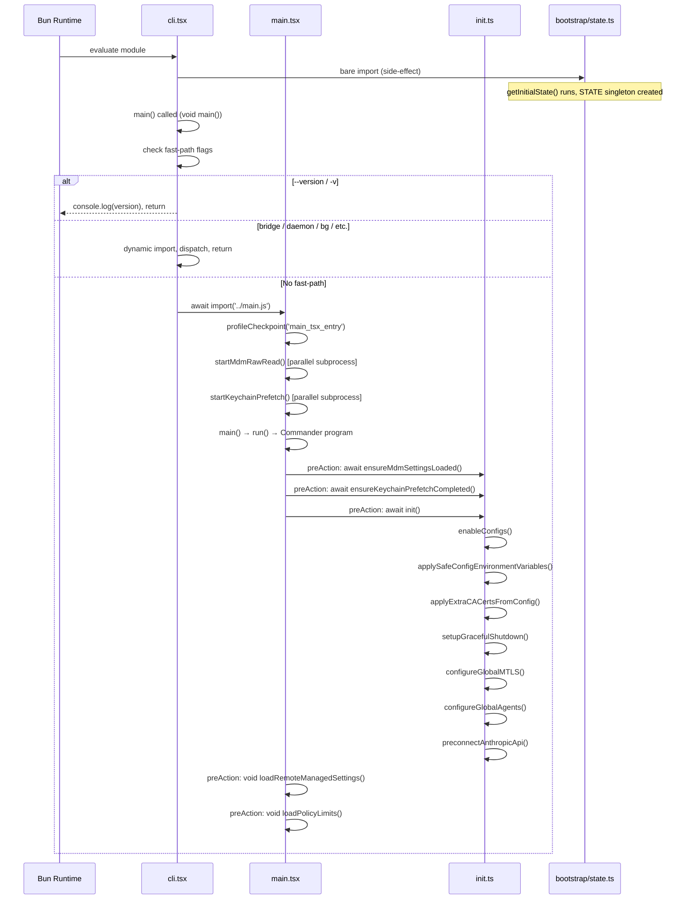
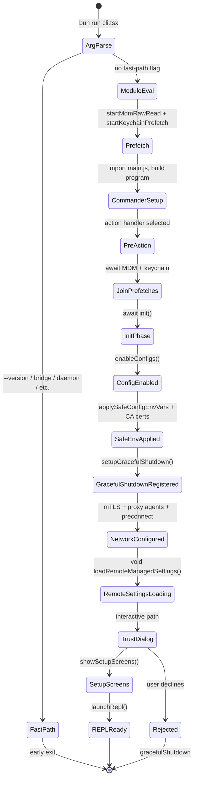

# Bootstrap: From `bun run` to Running Loop

## Overview

Every cc session begins the same way: the Bun runtime evaluates `src/entrypoints/cli.tsx`, which funnels through a cascade of fast-path checks, module-level side-effects, and an async initialization gauntlet before handing control to the interactive REPL. This chapter traces that exact path -- from the `void main()` call at the bottom of `cli.tsx` to the point where `init.ts` completes and the Commander `preAction` hook fires. The boot sequence is not a straight line; it is a state machine with early exits, parallel prefetches, and a carefully ordered series of security gates (MDM, keychain, TLS, mTLS, OAuth, policy limits). Understanding this ordering is essential for anyone extending cc: a missed prefetch means a 65ms blocking read on the critical path, and a misplaced security check means a credential leak before trust is established.

The HER session protocol (ORIENT/SETUP) describes the ideal startup sequence for long-running agents: orient to workspace state, run init scripts, verify baselines, then implement. cc's bootstrap embodies this pattern in code: `cli.tsx` orients by checking argv for fast-path flags; `init.ts` runs setup by configuring TLS, mTLS, proxy agents, and policy limits; the Commander `preAction` hook verifies by awaiting MDM and keychain prefetches before calling `init()`. The session does not proceed to the IMPLEMENT phase until the entire harness is wired.

The boot path is also a performance story. The `profileCheckpoint()` calls sprinkled throughout `cli.tsx`, `main.tsx`, and `init.ts` are not decorative logging -- they form a timing budget that the team uses to keep startup under ~300ms on a warm machine. Every `await` and every `void` (fire-and-forget) in the sequence reflects a conscious decision about what blocks the first render and what can run in the background while the user reads the trust dialog.

## Data structures and contracts

### The global State singleton

The `State` type in `src/bootstrap/state.ts` is the single mutable root of all session-scoped data. It is initialized once at module evaluation time by `getInitialState()`, which resolves the current working directory (with symlink and NFC normalization), generates a `sessionId` via `randomUUID()`, and sets every counter, latch, and flag to its default value.

```typescript
// src/bootstrap/state.ts:L45-L58 — State type definition (abbreviated)
type State = {
  originalCwd: string
  projectRoot: string
  totalCostUSD: number
  totalAPIDuration: number
  totalAPIDurationWithoutRetries: number
  totalToolDuration: number
  turnHookDurationMs: number
  turnToolDurationMs: number
  turnClassifierDurationMs: number
  turnToolCount: number
  turnHookCount: number
  turnClassifierCount: number
  startTime: number
  lastInteractionTime: number
```

The `State` type contains over 70 fields tracking cost, model usage, permission latches, telemetry counters, and session lifecycle flags. The comment `DO NOT ADD MORE STATE HERE - BE JUDICIOUS WITH GLOBAL STATE` at `src/bootstrap/state.ts:L31` signals that this file is a constrained resource: every addition broadens the surface area that `resetStateForTests()` must clear and that the import DAG must accommodate. The `bootstrap/state.ts` file is a leaf node in the import DAG -- it imports almost nothing from the rest of the codebase -- which means it can be safely imported from anywhere without creating cycles. This is an intentional architectural constraint: if `State` imported from `src/utils/`, then `src/utils/` could not import from `State`, and half the codebase would need an indirection layer.

The singleton `STATE` at `src/bootstrap/state.ts:L429` is created by calling `getInitialState()` at module scope. Because `src/entrypoints/cli.tsx:L2` imports `'../bootstrap/state.js'` as a bare side-effect import, this singleton exists before any code in `main()` runs. The file also exposes `resetStateForTests()` at `src/bootstrap/state.ts:L919`, which overwrites every key from a fresh `getInitialState()` return -- a strong indicator that the state contract is intentionally flat (no nested objects that survive across resets) and that test isolation depends on total reset rather than selective patching.

Two fields deserve particular attention for the boot sequence. `originalCwd` at `src/bootstrap/state.ts:L278` is set once by `getInitialState()` and never mutated by mid-session worktree changes; `projectRoot` at `src/bootstrap/state.ts:L279` is similarly stable. The distinction matters: when a user enters a worktree via `EnterWorktreeTool` mid-session, `originalCwd` stays anchored to where `claude` was launched, while `cwd` (the working directory for file operations) follows the worktree. This separation ensures that session history, skill directories, and `.claude/` paths remain consistent regardless of mid-session directory changes.

### The AttributedCounter interface

```typescript
// src/bootstrap/state.ts:L41-L44 — AttributedCounter type
export type AttributedCounter = {
  add(value: number, additionalAttributes?: Attributes): void
}
```

This thin abstraction wraps OpenTelemetry counters so that `STATE.sessionCounter`, `STATE.locCounter`, and friends can be set after the meter provider initializes asynchronously in `setMeterState()`. Until then, the counter fields are `null` and `getSessionCounter()` returns `null`, which `init.ts` handles at `src/entrypoints/init.ts:L338` by calling `getSessionCounter()?.add(1)` -- the optional chain silently drops the increment until the meter is ready. The `AttributedCounter` type is defined in `bootstrap/state.ts` rather than in the telemetry module because the bootstrap layer cannot import from `src/utils/telemetry/` (that would break the DAG-leaf constraint). Instead, the factory function `createAttributedCounter` is passed into `setMeter()` from `init.ts`, which bridges the two layers.

### Settings merge hierarchy

The settings system implements a five-source merge chain with a dual strategy depending on the source type. The enabled sources are enumerated in `STATE.allowedSettingSources`, which defaults to `['userSettings', 'projectSettings', 'localSettings', 'flagSettings', 'policySettings']` at `src/bootstrap/state.ts:L313-L319`.

```typescript
// src/utils/settings/settings.ts:L674-L684 — Policy settings "first source wins" chain
if (source === 'policySettings') {
  let policySettings: SettingsJson | null = null
  const policyErrors: ValidationError[] = []

  // 1. Remote (highest priority)
  const remoteSettings = getRemoteManagedSettingsSyncFromCache()
  if (remoteSettings && Object.keys(remoteSettings).length > 0) {
    const result = SettingsSchema().safeParse(remoteSettings)
    if (result.success) {
      policySettings = result.data
    }
```

For `policySettings`, the "first source wins" rule selects the highest-priority source that has content (remote > HKLM/plist > managed-settings.json > HKCU). This is the opposite of the merge strategy used for other sources: when two policy sources conflict, the administrator's intent is captured by the highest-priority source that has content, not by combining them. For all other sources (`userSettings`, `projectSettings`, `localSettings`, `flagSettings`), `lodash.mergeWith` deep-merges in priority order so later sources override earlier ones. Arrays are concatenated and deduplicated via `settingsMergeCustomizer` at `src/utils/settings/settings.ts:L538`.

The managed settings file system also supports drop-in directories (`managed-settings.d/*.json`), following the systemd/sudoers convention. The `loadManagedFileSettings()` function at `src/utils/settings/settings.ts:L74` sorts drop-in files alphabetically and merges them on top of the base `managed-settings.json`, with later filenames winning. This allows separate teams to ship independent policy fragments (e.g., `10-otel.json`, `20-security.json`) without coordinating edits to a single admin-owned file.

### The session ID and session switching contract

Every session gets a unique `sessionId` generated by `randomUUID()` at `src/bootstrap/state.ts:L331`. The `switchSession()` function at `src/bootstrap/state.ts:L468` atomically updates both `sessionId` and `sessionProjectDir` together -- there is no separate setter for either, so they cannot drift out of sync. The comment at `src/bootstrap/state.ts:L457` labels this invariant as "CC-34." When a session is switched (e.g., via `/resume`), the outgoing session's plan-slug entry is deleted from `planSlugCache` to keep the Map bounded across repeated resume operations. The `onSessionSwitch` signal at `src/bootstrap/state.ts:L489` allows other modules (like `concurrentSessions.ts`) to react to session changes without importing a listener directly into the bootstrap layer.

## Control flow

### The cli.tsx fast-path dispatcher

When `bun run` evaluates `cli.tsx`, three things happen before `main()` is called:

1. `COREPACK_ENABLE_AUTO_PIN` is set to `'0'` to prevent corepack from mutating `package.json` (`src/entrypoints/cli.tsx:L5`).
2. If `CLAUDE_CODE_REMOTE === 'true'`, the `NODE_OPTIONS` flag `--max-old-space-size=8192` is appended for container environments that have 16GB of memory but default Node heap limits (`src/entrypoints/cli.tsx:L9-L14`).
3. If `feature('ABLATION_BASELINE')` is enabled and the environment variable is set, a cascade of `CLAUDE_CODE_SIMPLE`, `DISABLE_*`, and `DISABLE_AUTO_*` flags are turned on (`src/entrypoints/cli.tsx:L21-L26`). This block must live in `cli.tsx` rather than `init.ts` because BashTool, AgentTool, and PowerShellTool capture `DISABLE_BACKGROUND_TASKS` into module-level constants at import time -- `init()` runs too late to affect those captures.

```typescript
// src/entrypoints/cli.tsx:L33-L42 — main() entry and --version fast-path
async function main(): Promise<void> {
  const args = process.argv.slice(2);

  // Fast-path for --version/-v: zero module loading needed
  if (
    args.length === 1 &&
    (args[0] === '--version' || args[0] === '-v' || args[0] === '-V')
  ) {
    // MACRO.VERSION is inlined at build time
    // biome-ignore lint/suspicious/noConsole:: intentional console output
    console.log(`${MACRO.VERSION} (Claude Code)`);
    return;
  }
```

The `--version` fast-path exits without importing anything beyond what `cli.tsx` already loaded. The `MACRO.VERSION` value is inlined at build time by the Bun bundler, so no filesystem reads or config parsing are needed. Every subsequent fast-path (bridge mode, daemon, background sessions, templates, environment-runner, self-hosted-runner, tmux+worktree) uses dynamic `await import(...)` to load only the modules it needs. The `feature('...')` calls are inlined so the Bun bundler can dead-code-eliminate entire blocks from external builds. This architecture means a non-privileged `claude --version` invocation touches essentially zero of the codebase.

The bridge mode fast-path at `src/entrypoints/cli.tsx:L112-L162` is the most complex of the early exits. It must check OAuth authentication before the GrowthBook gate, because without auth headers, GrowthBook has no user context and would return a stale default. It then checks policy limits via `waitForPolicyLimitsToLoad()` and `isPolicyAllowed('allow_remote_control')` before proceeding. This ordering -- auth before feature flags before policy -- is a microcosm of the entire bootstrap philosophy: each gate depends on the previous gate having completed.

If no fast-path matches, the function loads the startup profiler, starts capturing early input (so keystrokes typed during the ~135ms import window are not lost), and dynamically imports `main.tsx`:

```typescript
// src/entrypoints/cli.tsx:L287-L298 — Fall-through to full CLI
  // No special flags detected, load and run the full CLI
  const {
    startCapturingEarlyInput
  } = await import('../utils/earlyInput.js');
  startCapturingEarlyInput();
  profileCheckpoint('cli_before_main_import');
  const {
    main: cliMain
  } = await import('../main.js');
  profileCheckpoint('cli_after_main_import');
  await cliMain();
  profileCheckpoint('cli_after_main_complete');
}
```

The `startCapturingEarlyInput()` call is a small but important detail: it begins buffering stdin before the heavy `main.tsx` import chain loads, so that users who start typing immediately after pressing Enter at the shell prompt do not lose their input. The `profileCheckpoint` calls bracket the `main.tsx` import so the team can measure how much of the ~135ms startup budget is consumed by module evaluation versus the `main()` function body.

### Module-level prefetches in main.tsx

Before `main()` in `main.tsx` executes, three side-effect imports fire at module scope:

1. `profileCheckpoint('main_tsx_entry')` marks the timestamp (`src/main.tsx:L12`).
2. `startMdmRawRead()` spawns `plutil` (macOS) or `reg query` (Windows) subprocesses to read MDM (Mobile Device Management) policy data in parallel with the remaining imports (`src/main.tsx:L16`).
3. `startKeychainPrefetch()` spawns two macOS `security find-generic-password` subprocesses in parallel -- one for OAuth credentials, one for the legacy API key (`src/main.tsx:L20`).

The `startKeychainPrefetch()` function at `src/main.tsx:L20` fires immediately at module scope. On macOS, it spawns two `security find-generic-password` subprocesses in parallel -- one for OAuth credentials, one for the legacy API key -- and stores the combined promise for later awaiting. The function guards against double-spawning with a module-scoped `prefetchPromise` variable, and returns immediately on non-macOS platforms or in bare mode where keychain reads are disabled.

These prefetches are the single biggest startup optimization in the codebase. Without them, `applySafeConfigEnvironmentVariables()` in `init.ts` would trigger a synchronous `spawnSync` inside `isRemoteManagedSettingsEligible()`, blocking the event loop for ~65ms on macOS. By starting the subprocesses at module-evaluation time, their results are ready by the time `init()` needs them. The `--bare` flag disables keychain prefetch entirely because bare mode never reads OAuth or keychain credentials.

The MDM raw read follows the same pattern: `startMdmRawRead()` at `src/utils/settings/mdm/rawRead.ts:L120` fires `fireRawRead()` and stores the promise. The `ensureMdmSettingsLoaded()` call in the `preAction` hook later awaits this promise. On macOS, `fireRawRead()` runs `plutil -convert json -o -` against the MDM plist; on Windows, it runs `reg query` against the HKLM registry key. Both are slow synchronous operations when called inline but are effectively free when overlapped with the import chain.

### The init() function

The `init()` function in `src/entrypoints/init.ts` is wrapped in `memoize()` so it runs exactly once per process. Its body proceeds through a strict ordering of security-relevant steps:

```typescript
// src/entrypoints/init.ts:L57-L88 — init() core sequence (abbreviated)
export const init = memoize(async (): Promise<void> => {
  const initStartTime = Date.now()
  logForDiagnosticsNoPII('info', 'init_started')
  profileCheckpoint('init_function_start')

  try {
    const configsStart = Date.now()
    enableConfigs()
    // ...
    applySafeConfigEnvironmentVariables()
    applyExtraCACertsFromConfig()
    // ...
    setupGracefulShutdown()
    // ...
    void populateOAuthAccountInfoIfNeeded()
    void initJetBrainsDetection()
    void detectCurrentRepository()
    // ...
    configureGlobalMTLS()
    configureGlobalAgents()
    preconnectAnthropicApi()
```

The ordering is not arbitrary. `applySafeConfigEnvironmentVariables()` at `src/entrypoints/init.ts:L74` applies only "safe" environment variables (ones that do not expose credentials) before the trust dialog has been accepted. The full `applyConfigEnvironmentVariables()` is called later in `initializeTelemetryAfterTrust()` at `src/entrypoints/init.ts:L269`, after trust is established and remote managed settings have been loaded. This two-phase approach prevents a malicious project's `.claude/settings.json` from injecting environment variables that could leak credentials before the user has consented to trusting the directory.

`applyExtraCACertsFromConfig()` must run before the first TLS handshake because Bun caches the TLS certificate store at boot via BoringSSL -- once a connection is made, the cert store is fixed. The comment at `src/entrypoints/init.ts:L77-L78` is explicit: "Bun caches the TLS cert store at boot via BoringSSL, so this must happen before the first TLS handshake." If you reverse this ordering and `preconnectAnthropicApi()` runs first, the warmed connection will not include the custom CA certificates, and subsequent API calls will fail with certificate verification errors in corporate environments that use private CAs.

`configureGlobalMTLS()` and `configureGlobalAgents()` must precede `preconnectAnthropicApi()` because the warmed connection must use the correct transport (proxy, mTLS, or direct). The comment at `src/entrypoints/init.ts:L153-L158` explains that `preconnectAnthropicApi()` overlaps the TCP+TLS handshake (~100-200ms) with the ~100ms of action-handler work before the first API request. The preconnect is skipped for proxy, mTLS, and unix-socket transports where the SDK's dispatcher would not reuse the global connection pool.

After the network stack is configured, `init()` registers cleanup handlers. The `registerCleanup(shutdownLspServerManager)` call at `src/entrypoints/init.ts:L189` ensures that LSP server processes are terminated on shutdown. A second cleanup handler at `src/entrypoints/init.ts:L195-L200` removes teams created during the session (via `TeamCreate`), addressing a bug (gh-32730) where subagent-created teams would persist on disk indefinitely.

### The Commander preAction hook

In `main.tsx`, the Commander program's `preAction` hook at `src/main.tsx:L907` is the synchronization point where MDM and keychain prefetches are awaited, `init()` is called, and remote managed settings and policy limits are loaded. The hook's first action is `await Promise.all([ensureMdmSettingsLoaded(), ensureKeychainPrefetchCompleted()])` -- the join point for the two subprocess prefetches started at module evaluation. By the time `preAction` runs, the ~135ms of import evaluation has elapsed, and the subprocesses have likely already completed. The `await` is nearly free in the common case but guarantees correctness in the slow case (e.g., a macOS keychain that requires user approval for access). The hook uses Commander's `preAction` rather than a raw `await` so that help displays (`claude --help`) do not trigger initialization -- a user checking version or help should not pay the cost of config parsing, network preconnects, and subprocess spawns.

After `init()`, the hook loads remote managed settings and policy limits asynchronously (fail-open) via `void loadRemoteManagedSettings()` and `void loadPolicyLimits()` at `src/main.tsx:L953-L958`. These are fire-and-forget because they are not required for the first render; they arrive via hot-reload when ready. Policy limits gate specific features (like `allow_remote_control` in the bridge path at `src/entrypoints/cli.tsx:L157`), but the main interactive path does not block on them. The `preAction` hook also runs `runMigrations()` at `src/main.tsx:L950`, which executes a series of one-time settings migrations (e.g., migrating auto-update preferences, resetting model defaults). The migration version is tracked in the global config file, and migrations are idempotent -- running them twice is a no-op because the version check short-circuits.

### Graceful shutdown registration

The `setupGracefulShutdown()` call at `src/entrypoints/init.ts:L87` wires the process's exit handlers. The `gracefulShutdown()` function at `src/utils/gracefulShutdown.ts:L391` runs cleanup functions registered via `registerCleanup()`, sends terminal reset sequences (disabling Kitty keyboard protocol, mouse tracking, alternate screen), executes SessionEnd hooks with a configurable timeout, drains telemetry, and finally calls `process.exit()`. The `gracefulShutdownSync()` wrapper at `src/utils/gracefulShutdown.ts:L336` sets `process.exitCode` synchronously and then kicks off the async shutdown -- this is called from signal handlers where returning without setting the exit code would cause the process to exit with code 0 even on error.

The `onExit` import from `signal-exit` at `src/utils/gracefulShutdown.ts:L4` handles the full taxonomy of exit scenarios: SIGTERM, SIGINT, `process.exit()`, and even uncaught exceptions. The `shutdownInProgress` flag at `src/utils/gracefulShutdown.ts:L361` prevents re-entrant shutdown if a cleanup function itself triggers an exit. The function also arms a failsafe timer that forces `process.exit()` after a timeout, ensuring that the process terminates even if a cleanup function hangs.

### Telemetry initialization after trust

The `initializeTelemetryAfterTrust()` function at `src/entrypoints/init.ts:L247` is called after the trust dialog has been accepted. For users eligible for remote managed settings, it first waits for those settings to load, then re-applies environment variables (to include remote settings like proxy configuration) before initializing telemetry. For non-eligible users, telemetry initializes immediately. The function handles a special case for SDK/headless mode with beta tracing enabled: in that scenario, telemetry is initialized eagerly before the async remote-settings path completes, because the tracer must be ready before the first query runs. The `doInitializeTelemetry()` guard at `src/entrypoints/init.ts:L288` uses the `telemetryInitialized` flag to prevent double initialization from the eager path and the async path racing.

The `setMeterState()` function at `src/entrypoints/init.ts:L305` lazy-loads the OpenTelemetry instrumentation module (~400KB of OTel + protobuf), and the gRPC exporters (~700KB) are further lazy-loaded within `instrumentation.ts`. This deferral means that a session that never initializes telemetry (e.g., analytics disabled) never pays the module-load cost.

### Sequence diagram



### Boot state machine



## Edge cases and failure modes

### ConfigParseError and non-interactive sessions

When `init()` encounters a `ConfigParseError`, the handler checks `getIsNonInteractiveSession()`. In non-interactive mode (e.g., `--print` or SDK invocation), the error is written to stderr and `gracefulShutdownSync(1)` is called -- there is no way to render an Ink dialog. In interactive mode, `init()` dynamically imports `showInvalidConfigDialog` and returns its promise, which renders a React-based dialog and handles `process.exit` internally (`src/entrypoints/init.ts:L216-L232`). The dynamic import avoids loading React at init time for the common case where configs are valid. This is a recurring pattern in the codebase: any module that transitively depends on React (which includes all Ink components) is dynamically imported only in the error path, keeping the hot path lean.

### Broken symlinks and EPERM on startup

`getInitialState()` at `src/bootstrap/state.ts:L264-L276` calls `realpathSync(cwd())` to resolve symlinks, with a fallback for `EPERM` errors on CloudStorage mounts (macOS File Provider). If `realpathSync` throws, the raw `cwd()` is used after NFC normalization. The NFC normalization at line 271 (`.normalize('NFC')`) ensures consistent string comparison across platforms that may decompose Unicode characters differently. This defensive pattern ensures that even a broken symlink in the working directory path does not prevent the session from starting.

### Keychain prefetch timeouts

The `startKeychainPrefetch()` function at `src/utils/secureStorage/keychainPrefetch.ts:L69` fires two `security` subprocesses in parallel. If either times out, the prefetch result is discarded (not primed into the cache), and the synchronous read path retries with its own longer timeout. This "prefetch-best-effort, fallback-to-sync" pattern avoids penalizing users with slow keychain access while still gaining the ~65ms savings on fast machines. The guard `if (process.platform !== 'darwin' || prefetchPromise || isBareMode()) return` at line 70 ensures the prefetch only runs on macOS (where the keychain exists), only once (the `prefetchPromise` guard), and never in bare mode (which explicitly opts out of keychain reads).

### Policy limits fail-open

Both `loadRemoteManagedSettings()` and `loadPolicyLimits()` are called with `void` (fire-and-forget) in the `preAction` hook. If the network fetch fails or times out, the session proceeds without remote settings or policy limits. This fail-open design means that a transient network outage cannot prevent a developer from using cc. The tradeoff is that policy-gated features (like remote control) may briefly appear available until the fetch completes and hot-reloads the restriction. The `isEligibleForRemoteManagedSettings()` and `isPolicyLimitsEligible()` checks at `src/entrypoints/init.ts:L123-L128` gate the initialization promises so that non-eligible users (e.g., those without an active subscription) do not even start the network requests.

### Upstream proxy initialization failure

In CCR (Claude Code Remote) environments, `init()` attempts to start the upstream proxy relay at `src/entrypoints/init.ts:L167-L183`. The entire block is wrapped in a try/catch that logs the error and continues without the proxy. The comment `fail-open on any error` makes the design intent explicit: a broken proxy configuration must not prevent the core REPL from starting. The block is gated on `isEnvTruthy(process.env.CLAUDE_CODE_REMOTE)` so that non-CCR startups skip the entire lazy-import chain entirely. The `registerUpstreamProxyEnvFn(getUpstreamProxyEnv)` call inside the block registers a function that subprocess spawning can use to inject proxy environment variables without a static import of the upstreamproxy module, avoiding a circular dependency.

### Double telemetry initialization

The `telemetryInitialized` flag at `src/entrypoints/init.ts:L55` prevents `doInitializeTelemetry()` from running twice. The flag is set before the async `setMeterState()` call and reset on failure so subsequent calls can retry (`src/entrypoints/init.ts:L288-L302`). Without this guard, `initializeTelemetryAfterTrust()` -- which is called after the trust dialog -- could race with the eager initialization path for SDK/headless sessions with beta tracing enabled. The `telemetryInitialized` flag is module-scoped rather than stored in `STATE` because it is an implementation detail of the initialization sequence, not a session property that other modules need to read.

### Early input buffering under non-interactive mode

When `isNonInteractive` is detected in `main.tsx` at `src/main.tsx:L806`, `stopCapturingEarlyInput()` is called immediately. If this were not done, the early-input buffer would consume stdin data intended for the `--print` path, causing piped input to be silently dropped. The early-input mechanism is designed exclusively for interactive sessions where the user may begin typing before the REPL renders.

## Where cc diverges from the published pattern

The HER session protocol prescribes a linear ORIENT/SETUP/VERIFY sequence. cc's bootstrap diverges in three ways:

First, cc overlaps phases aggressively. The MDM prefetch and keychain prefetch run during module evaluation (before `main()`), which means SETUP work (reading policy configuration) begins during what the HER calls ORIENT (reading workspace state). This is intentional: the subprocesses are I/O-bound and their overlap with CPU-bound import evaluation is a net win. The HER's own guidance acknowledges this possibility: "Session startup sequence" lists `pwd` (ORIENT) before "Run init script" (SETUP), but notes that the ordering is a recommendation, not a constraint. cc's implementation shows that the recommendation can be profitably violated when the SETUP work is I/O-bound and can be pipelined.

Second, cc's VERIFY phase is deferred. The HER protocol says to run baseline tests before implementing, but cc does not have a built-in test runner at startup. Instead, verification happens at the tool level (e.g., BashTool's `readOnlyValidation` checks commands before execution) and at the session level (e.g., `checkQuotaStatus` verifies API access before the first query). This aligns with HER's own "Privilege Boundaries" pattern from section 12.3: different components have different verification responsibilities, and verification is distributed rather than centralized at a single checkpoint.

Third, the HER's five-layer defense-in-depth model from section 12.1 places prompt-level guardrails first, followed by schema-level restrictions, runtime approval, tool-level validation, and lifecycle hooks. cc's bootstrap inverts this ordering for the first two layers: schema validation (Zod/SettingsSchema) runs during settings loading at `init()` time, while prompt-level guardrails (system prompt instructions) are assembled much later in the query loop. This inversion is correct for a tool-first architecture: you must validate the configuration that determines which tools are available before you can construct the prompt that tells the model how to use them. A tool that is blocked by schema validation never appears in the tool list, which means the prompt never needs to tell the model not to use it.

The TLS/mTLS defense-in-depth from HER section 12 is directly reflected in cc's ordering: `applyExtraCACertsFromConfig()` runs before `configureGlobalMTLS()`, which runs before `configureGlobalAgents()`, which runs before `preconnectAnthropicApi()`. Each layer adds a constraint (custom CA certs, then mutual TLS client certificates, then HTTP proxy agents, then the actual TLS handshake) that the next layer depends on. Skipping any layer would produce a connection that lacks the organization's required security posture. The HER's "Rate Limiting" pattern from section 12.3 is also reflected: `loadPolicyLimits()` at `src/main.tsx:L958` fetches organizational rate-limit and feature-gate policies that are enforced at runtime by `isPolicyAllowed()` checks throughout the codebase.

## Developer takeaways for building a long-running agent

The cc bootstrap demonstrates four principles worth internalizing. Start subprocess-based I/O as early as possible -- module-evaluation side-effects are free real estate for overlapping I/O with import resolution, and cc saves ~65ms per session by firing MDM and keychain reads before `main()` runs. Order your security gates by dependency: CA certs before mTLS, mTLS before proxy agents, proxy agents before the first TLS handshake; reversing any pair produces a connection that violates organizational policy. Design for fail-open on non-critical paths: remote managed settings, policy limits, and upstream proxy initialization all proceed without blocking the session, because a transient network failure should not prevent a developer from working. Finally, memoize your initialization function and guard against double invocation: `init()` uses `lodash.memoize` to ensure it runs once, and `telemetryInitialized` prevents the post-trust initialization from racing with the eager path. These patterns compose: the early prefetches make the `await` in `preAction` nearly free, the fail-open design makes the `await` on remote settings unnecessary, and the memoization makes it safe to call `init()` from multiple code paths without coordination.
