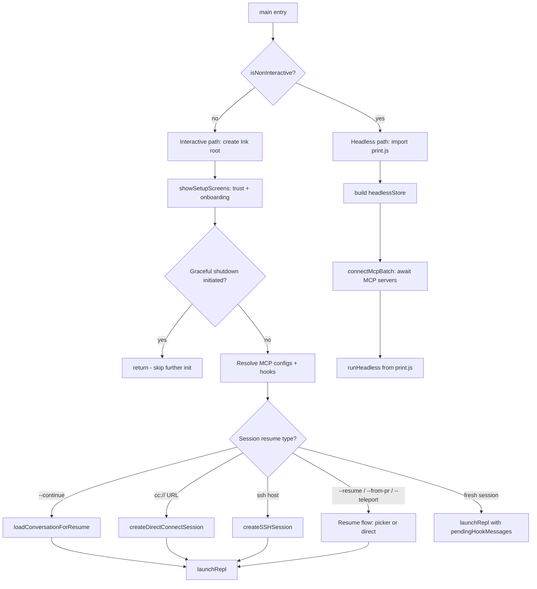
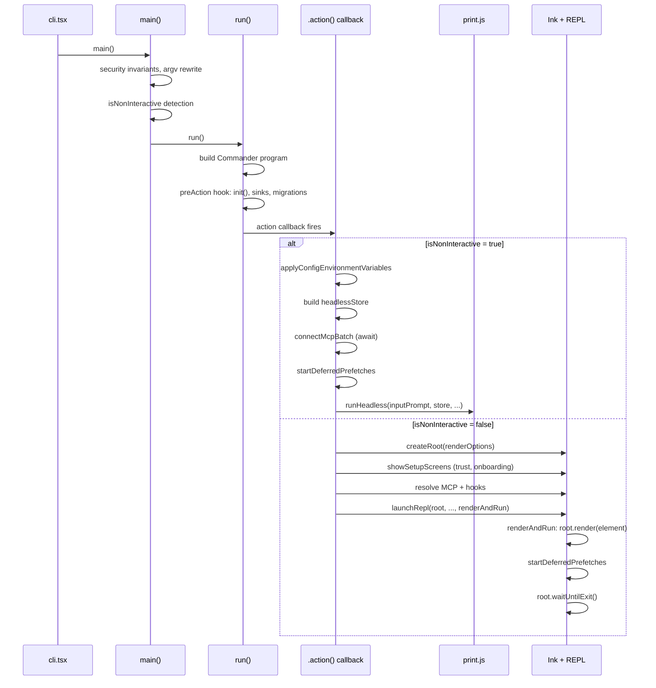

# `main.tsx` and the Command Router

## Overview

At 4,683 lines, `src/main.tsx` is the largest single file in the cc codebase and the sole entry point for every invocation of the CLI. It is where the process is born, where its identity is established, and where its fate -- interactive REPL or headless query -- is decided. The file is not a monolith in the architectural sense; it is a single dispatch surface whose breadth comes from the combinatorial explosion of entry flags, subcommands, feature gates, and bifurcation paths that a production-grade agent CLI must support. Understanding `main.tsx` is understanding how cc goes from `process.argv` to a running agent loop.

The file's structure follows a strict temporal order: top-level side effects run at module evaluation time, the `main()` function establishes process-level invariants and performs early argv rewriting, `run()` constructs the Commander.js program tree, and the `.action()` callback on the default command is the 2,700-line engine that processes every flag and decides the session's destiny. This chapter traces that journey from first import to final render.

## Data structures and contracts

The command router's decision logic depends on several key types that capture the state of the pending session before the REPL or headless loop begins. These types are allocated at module scope, gated by feature flags, and populated by early argv rewriting -- a pattern that lets the default command action access pre-parsed state without re-parsing `process.argv`.

```typescript
// src/main.tsx:L543-L552 — PendingConnect: state for cc:// URL sessions
type PendingConnect = {
  url: string | undefined;
  authToken: string | undefined;
  dangerouslySkipPermissions: boolean;
};
```

The `PendingConnect` type holds parsed connection state for `cc://` URL sessions. It is allocated at module scope only when the `DIRECT_CONNECT` feature gate is active, and its fields are populated by early argv rewriting in `main()` before Commander.js ever runs. The `undefined` defaults are intentional: a `cc://` URL with no token leaves `authToken` undefined, and the downstream `createDirectConnectSession` call must handle that case. The `dangerouslySkipPermissions` field is populated from a separate `--dangerously-skip-permissions` flag that accompanies the URL, not from the URL itself.

```typescript
// src/main.tsx:L564-L576 — PendingSSH: state for remote SSH sessions
type PendingSSH = {
  host: string | undefined;
  cwd: string | undefined;
  permissionMode: string | undefined;
  dangerouslySkipPermissions: boolean;
  local: boolean;
  extraCliArgs: string[];
};
```

The `PendingSSH` type captures the full state of a `claude ssh <host> [dir]` invocation. The `local` field enables an e2e test mode that spawns the child CLI directly, skipping SSH probe and deploy. The `extraCliArgs` array accumulates flags (`--continue`, `--resume`, `--model`) that are forwarded to the remote CLI on its initial spawn. This forwarding is necessary because the remote CLI is a separate process that never sees the local `process.argv`.

```typescript
// src/main.tsx:L4657-L4666 — TeammateOptions: identity for swarm agents
type TeammateOptions = {
  agentId?: string;
  agentName?: string;
  teamName?: string;
  agentColor?: string;
  planModeRequired?: boolean;
  parentSessionId?: string;
  teammateMode?: 'auto' | 'tmux' | 'in-process';
  agentType?: string;
};
```

The `TeammateOptions` type is the identity contract for agents spawned as part of a tmux swarm. When a leader spawns a teammate, it passes these fields via CLI flags (`--agent-id`, `--agent-name`, `--team-name`), and `extractTeammateOptions` at `src/main.tsx:L4667` unpacks them from the Commander options object. The `teammateMode` field controls whether the teammate runs in a tmux pane, an in-process fork, or lets the runtime decide automatically. The `planModeRequired` flag forces the teammate into the plan-only `permission mode` before it can write to the filesystem. At `src/main.tsx:L1194-L1199`, the action handler validates that either all three identity fields (agentId, agentName, teamName) are provided or none are, rejecting partial configurations with an error.

## Control flow

The control flow through `main.tsx` follows a four-phase pipeline: module evaluation, `main()`, `run()`, and the default command action. Each phase has a distinct responsibility and a strict temporal relationship to the next.

### Phase 1: Module evaluation side effects

Before any function runs, the top-level module body executes three side effects that are carefully ordered to overlap I/O with the subsequent ~135ms of imports. The `profileCheckpoint('main_tsx_entry')` call at `src/main.tsx:L12` marks the entry for the startup profiler. Then `startMdmRawRead()` at `src/main.tsx:L16` fires MDM subprocess reads (plutil/reg query) so they complete in parallel with the remaining imports. Finally, `startKeychainPrefetch()` at `src/main.tsx:L20` launches both macOS keychain reads (OAuth and legacy API key) concurrently, eliminating what was previously a ~65ms sequential bottleneck during `applySafeConfigEnvironmentVariables()`.

After the side effects, the module imports ~200 symbols across ~140 import statements. The import block at `src/main.tsx:L21-L200` includes several lazy `require()` calls for modules with circular dependency risks: `getTeammateUtils` at `src/main.tsx:L70`, `coordinatorModeModule` at `src/main.tsx:L76`, and `assistantModule` at `src/main.tsx:L80`. These conditional requires use dead code elimination via `feature('COORDINATOR_MODE')` and `feature('KAIROS')` so that external builds never pay the cost of importing assistant-mode modules.

### Phase 2: main() -- process invariants and argv rewriting

The `main()` function, exported at `src/main.tsx:L585`, is the first function called by the `cli.tsx` entry point. It establishes security invariants, detects the session mode (interactive vs. headless), and rewrites `process.argv` for special URL-based invocations.

```typescript
// src/main.tsx:L797-L804 — Detecting non-interactive mode
const cliArgs = process.argv.slice(2);
const hasPrintFlag = cliArgs.includes('-p') || cliArgs.includes('--print');
const hasInitOnlyFlag = cliArgs.includes('--init-only');
const hasSdkUrl = cliArgs.some(arg => arg.startsWith('--sdk-url'));
const isNonInteractive = hasPrintFlag || hasInitOnlyFlag || hasSdkUrl || !process.stdout.isTTY;
```

The `isNonInteractive` determination at `src/main.tsx:L803` is the single most important boolean in the entire file. It gates whether the process enters the interactive REPL path (Ink rendering, trust dialog, REPL component) or the headless `runHeadless` path (imported from `src/cli/print.js`). Four conditions trigger headless mode: the `-p`/`--print` flag, the `--init-only` flag, the `--sdk-url` flag, or a non-TTY stdout. This last condition -- `!process.stdout.isTTY` -- means that piping the output of `claude` anywhere (e.g., `claude -p "list files" | head`) automatically forces headless mode. Once computed, the value is persisted to `setIsInteractive(isInteractive)` at `src/main.tsx:L812` so that downstream code can query it without re-parsing argv.

Before mode detection, `main()` performs argv rewriting for three special invocation patterns. The `cc://` URL rewriting at `src/main.tsx:L612-L642` detects `cc://` or `cc+unix://` URLs in argv, parses them via `parseConnectUrl`, and either rewrites to the internal `open` subcommand (for headless) or stashes the parsed URL in `_pendingConnect` for the interactive path. The `assistant` subcommand rewriting at `src/main.tsx:L685-L700` checks if `rawArgs[0] === 'assistant'` (position-0 only, to avoid false-positive on `claude -p "explain assistant"`), and if the next argument is a session ID, stashes it in `_pendingAssistantChat.sessionId`. The `ssh` subcommand rewriting at `src/main.tsx:L706-L795` follows the same pattern but is substantially more complex: it must extract SSH-specific flags (`--permission-mode`, `--dangerously-skip-permissions`, `--local`) from the argv before checking for the host positional, and it must forward session-resume and model flags to the remote CLI via the `extractFlag` helper defined inline at `src/main.tsx:L739-L759`.

A crucial security measure runs before all of this: the debug-mode detector at `src/main.tsx:L232-L271`. The `isBeingDebugged()` function checks `process.execArgv` for `--inspect`/`--debug` flags, checks `NODE_OPTIONS` for the same, and even attempts to read `inspector.url()` from the global object. In external builds, if debugging is detected, the process exits immediately at `src/main.tsx:L270`. This prevents runtime inspection of the agent in production environments. The Bun-specific branch at `src/main.tsx:L237-L242` handles a Bun quirk where single-file executables leak application arguments into `process.execArgv` (issue oven-sh/bun#11673); without this branch, every Bun-built binary would falsely detect debugging and refuse to start.

After argv rewriting, `main()` also handles the `initializeEntrypoint` function at `src/main.tsx:L517-L540`. This function sets the `CLAUDE_CODE_ENTRYPOINT` environment variable based on the invocation context. The entrypoint is used throughout the codebase for telemetry segmentation and feature gating. The logic checks for MCP serve, GitHub Actions, and various SDK entrypoints before defaulting to `sdk-cli` (non-interactive) or `cli` (interactive). The `clientType` resolution at `src/main.tsx:L818-L834` further refines this into a more granular identifier (e.g., `sdk-typescript`, `sdk-python`, `claude-vscode`, `remote`, `local-agent`) that determines UI behavior, telemetry tagging, and feature access.

### Phase 3: run() -- the Commander.js program tree

The `run()` function at `src/main.tsx:L884` constructs the Commander.js program tree. It creates the top-level `program` command, attaches a `preAction` hook, defines approximately 50 options on the default command, registers approximately 20 subcommands, and finally calls `program.parseAsync(process.argv)`.

The `preAction` hook at `src/main.tsx:L907-L967` is the initialization gate. It awaits MDM settings and keychain prefetches via `Promise.all([ensureMdmSettingsLoaded(), ensureKeychainPrefetchCompleted()])` at `src/main.tsx:L914`, calls `init()` to bootstrap the analytics and auth subsystems, attaches logging sinks, wires up `--plugin-dir`, and runs migrations. This hook fires before any action handler, ensuring that every subcommand (not just the default) has a fully initialized environment. The migration system at `src/main.tsx:L326-L352` tracks a `CURRENT_MIGRATION_VERSION` counter (currently 11) and runs all outstanding migrations in sequence when the stored version is stale.

The default command options span an enormous surface. The `--print`/`-p` flag at `src/main.tsx:L976` enables headless mode. The `--bare` flag at `src/main.tsx:L976` strips all optional subsystems. The `--permission-mode` flag at `src/main.tsx:L976` accepts one of the six modes defined in `PERMISSION_MODES` from `src/utils/permissions/PermissionMode.ts`. The `--output-format` flag at `src/main.tsx:L976` controls headless output: `text`, `json`, or `stream-json`. The `--model` flag at `src/main.tsx:L976` accepts either an alias (e.g., `sonnet`, `opus`) or a full model name. The `--allowedTools` and `--disallowedTools` flags at `src/main.tsx:L976` control tool availability at the granularity of individual tool names with glob patterns (e.g., `Bash(git:*)`).

A critical optimization occurs at `src/main.tsx:L3883-L3890`: when the process is in print mode (`-p`/`--print`) and there is no `cc://` URL, the function skips subcommand registration entirely. The comment explains that the 52 subcommands' registration path was measured at ~65ms on baseline -- mostly the `isBridgeEnabled()` call (25ms settings Zod parse + 40ms sync keychain subprocess) -- and none of them are ever dispatched in print mode. This optimization saves significant startup time for the common `-p` usage pattern.

The subcommand tree, registered only for interactive mode, includes `mcp` (with `serve`, `add`, `remove`, `list`, `get`, `add-json`, `add-from-claude-desktop`, `reset-project-choices`), `auth` (with `login`, `status`, `logout`), `plugin` (with `validate`, `list`, `install`, `uninstall`, `enable`, `disable`, `update`, and the nested `marketplace` subcommands), `server`, `doctor`, `update`, `agents`, and several ant-only commands. Each subcommand uses dynamic `import()` in its action handler to load the handler module on demand, keeping the registration phase lightweight.

### Phase 4: The default command action -- the bifurcation engine

The `.action()` callback at `src/main.tsx:L1006` is the heart of `main.tsx`. It is a ~2,700-line function that processes every CLI flag, loads MCP configs, resolves the permission mode, and then makes the critical bifurcation decision between the headless path and the interactive path.

The following flowchart illustrates the command routing decisions:



The action callback begins by extracting all Commander options into local variables at `src/main.tsx:L1090-L1107`. It then processes a sequence of configuration steps in a specific order that matters: the `--bare` flag must set `CLAUDE_CODE_SIMPLE=1` before `setup()` runs; the `--settings` flag must be parsed by `eagerLoadSettings()` before `init()` runs; the `permissionMode` must be resolved by `initialPermissionModeFromCLI()` at `src/main.tsx:L1390-L1392` before `initializeToolPermissionContext()` at `src/main.tsx:L1747-L1754` runs; and the MCP config loading at `src/main.tsx:L1809-L1814` must start before `setup()` but be awaited after it.

The permission mode resolution is particularly nuanced. The `initialPermissionModeFromCLI` function at `src/main.tsx:L1390` takes the raw CLI flag (`permissionModeCli`) and the `dangerouslySkipPermissions` boolean, and returns a resolved mode plus a notification string. If `dangerouslySkipPermissions` is set, the mode resolves to `bypassPermissions` regardless of the `--permission-mode` flag. The resolved mode is then stored in `setSessionBypassPermissionsMode` at `src/main.tsx:L1398` for the trust dialog check: the trust dialog can block `bypassPermissions` mode in interactive sessions.

```typescript
// src/main.tsx:L2456-L2461 — ThinkingConfig resolution
let thinkingEnabled = shouldEnableThinkingByDefault();
let thinkingConfig: ThinkingConfig = thinkingEnabled !== false ? {
  type: 'adaptive'
} : {
  type: 'disabled'
};
```

The thinking configuration at `src/main.tsx:L2456-L2461` shows the default-first approach. The `shouldEnableThinkingByDefault()` function returns a boolean or undefined, and the default is `adaptive` (extended thinking with automatic budget). The `--thinking` flag at `src/main.tsx:L2462-L2467` can override this to `enabled`, `adaptive`, or `disabled`. The deprecated `--max-thinking-tokens` flag at `src/main.tsx:L2473-L2487` provides a budget override for backward compatibility.

The bifurcation between headless and interactive modes is the most consequential branch in the file. The headless path at `src/main.tsx:L2584-L2861` applies environment variables unconditionally (trust is implicit in `-p` mode), builds a `headlessStore` with `createStore`, connects MCP servers synchronously via `connectMcpBatch`, and then delegates to `runHeadless` imported from `src/cli/print.js`. The interactive path at `src/main.tsx:L2218-L3807` creates an Ink root, shows setup screens (trust dialog, onboarding, MCP approvals), and then branches into one of six launch paths: continue, direct connect, SSH, assistant, resume/teleport, or fresh session. All six converge on `launchRepl`.

The following sequence diagram shows the headless vs. interactive launch sequence:



The interactive path's `showSetupScreens` function at `src/interactiveHelpers.tsx:L104` is a multi-stage gate. It first checks for onboarding completion, then shows the trust dialog (skipped if the CWD is already trusted via the fast-path at `src/interactiveHelpers.tsx:L135`), then handles MCP server approvals for `.mcp.json` entries, and finally checks for external CLAUDE.md includes that need user consent. Each stage is a blocking `await` that renders an Ink dialog and waits for user input. The entire function returns a boolean indicating whether onboarding was shown, which the action handler uses to decide whether to skip a `/login` command that the user may have typed as their first prompt.

The `renderAndRun` function at `src/interactiveHelpers.tsx:L98-L103` is the terminal function for every interactive session. It renders the React element tree into the Ink root, starts deferred prefetches, and then blocks on `root.waitUntilExit()`. When the REPL exits (user types `/exit`, presses Ctrl+C, or the process receives SIGTERM), `renderAndRun` calls `gracefulShutdown(0)`.

```typescript
// src/interactiveHelpers.tsx:L98-L103 — renderAndRun: terminal function for interactive sessions
export async function renderAndRun(root: Root, element: React.ReactNode): Promise<void> {
  root.render(element);
  startDeferredPrefetches();
  await root.waitUntilExit();
  await gracefulShutdown(0);
}
```

The `renderAndRun` function is passed as a callback to `launchRepl` at `src/replLauncher.tsx:L12`, which wraps the App and REPL components into the element tree. This callback pattern exists so that special launch paths (SSH, assistant, direct connect) can pass their own custom element trees while sharing the same render-and-wait lifecycle. The `launchRepl` function itself is a thin wrapper that dynamically imports the App and REPL components and calls `renderAndRun` with the composed JSX tree.

The headless path's MCP connection uses a different strategy than the interactive path. In the headless path, `connectMcpBatch` at `src/main.tsx:L2691-L2719` first pushes pending clients into `headlessStore` (so that `ToolSearch`'s pending-client check works), then calls `getMcpToolsCommandsAndResources` which connects each server and updates the store as connections settle. The claude.ai MCP connector fetch has a bounded timeout of 5,000ms at `src/main.tsx:L2738`: if fetch and connect do not complete within that window, the headless session proceeds anyway, and the promise continues running in the background so that turn 2+ still sees the connectors. In the interactive path, by contrast, MCP connections are never awaited before the first render. The `mcpPromise` at `src/main.tsx:L2426-L2430` is fired and forgotten; `useManageMCPConnections` populates `appState.mcp` asynchronously as servers connect, and turn 1 sees whatever has connected by query time. This design ensures that a single slow MCP server never blocks the REPL from rendering.

The `AppState` initialization at `src/main.tsx:L2926-L3036` is one of the largest object constructions in the codebase. It includes settings, tasks, verbose mode, model configuration, permission context, agent definitions, MCP state, plugin state, bridge state, notification queue, thinking configuration, and dozens more fields. The `initialMessage` field at `src/main.tsx:L3019-L3023` is set when the user provides a prompt via CLI: it creates a `createUserMessage` with the prompt content, which the REPL will process as the first turn. The `teamContext` field at `src/main.tsx:L3035-L3036` is computed synchronously to avoid a `useEffect` `setState` during render; it prefers `assistantTeamContext` (from the KAIROS block) over `computeInitialTeamContext` (from tmux teammates), reflecting the precedence of the assistant mode's in-process team over the tmux identity.

## Edge cases and failure modes

The command router must handle several non-obvious edge cases that arise from the interaction of multiple flags and feature gates.

**Print mode skips subcommand registration.** At `src/main.tsx:L3883-L3890`, when `-p`/`--print` is present without a `cc://` URL, `run()` skips all subcommand registration and calls `program.parseAsync` immediately. This means that `claude -p "hello" mcp serve` does NOT invoke the `mcp serve` subcommand; Commander routes the entire string to the default action. The `cc://` URL exception exists because argv rewriting has already transformed `cc://... -p` into the `open` subcommand before the print-mode check runs.

**The `--bare` mode short-circuits prefetches.** The `--bare` flag at `src/main.tsx:L1014-L1016` sets `CLAUDE_CODE_SIMPLE=1`, which gates off CLAUDE.md auto-discovery, skills, hooks, LSP, plugin sync, attribution, auto-memory, and keychain reads. The `startDeferredPrefetches` function at `src/main.tsx:L388-L401` early-returns when `isBareMode()` is true, and the MCP config loading at `src/main.tsx:L1809-L1814` skips auto-discovered configs entirely in bare mode. However, `--bare` does not prevent `--mcp-config` from working: dynamic MCP configs are still spread onto `allMcpConfigs` at `src/main.tsx:L2386-L2389`, so a scripted call can still access external tools.

**The 3-second stdin timeout in headless mode.** The `getInputPrompt` function at `src/main.tsx:L857-L883` waits up to 3 seconds for stdin data when running in a non-TTY pipe. If no data arrives, it prints a warning and proceeds with the prompt alone. This prevents headless invocations from hanging indefinitely when the parent process fails to write to stdin. The 3-second window covers slow producers like `curl`, `jq` on large files, and Python with import overhead.

**The `--init-only` early exit.** At `src/main.tsx:L2572-L2582`, when `--init-only` is set, the action handler runs setup hooks with `forceSyncExecution: true`, fires session start hooks, and then calls `gracefulShutdownSync(0)`. This path never enters the REPL or the headless loop. It exists for CI/CD pipelines that need to run initialization hooks (e.g., dependency installation, environment setup) without starting an agent session.

**The `process.exitCode` guard.** After `showSetupScreens` in the interactive path, the code checks `process.exitCode !== undefined` at `src/main.tsx:L2312-L2315`. If the user rejected the trust dialog, `gracefulShutdown` sets `process.exitCode` but does not immediately terminate the process (the exit is deferred to the next tick). The guard prevents subsequent initialization code (which could trigger `apiKeyHelper` execution in an untrusted directory) from running before the process exits. This is a defense-in-depth measure: even if an `await` point in the setup screens path allows microtasks to drain, the exitCode check ensures no untrusted code runs.

**The `--session-id` validation.** At `src/main.tsx:L1277-L1302`, when a session ID is provided, the code validates that it is a valid UUID and that it does not already exist on disk. The existence check prevents accidental overwrites of existing session transcripts. However, when `--sdk-url` is provided, the session ID is a server-assigned tagged ID (e.g., `session_local_01...`) rather than a UUID, so UUID validation is skipped entirely.

**The `--settings` flag with JSON strings.** The `loadSettingsFromFlag` function at `src/main.tsx:L432-L483` accepts either a file path or a raw JSON string. When the input starts with `{` and ends with `}`, it is parsed as JSON and written to a temporary file. The temp file path is computed using a content hash rather than a random UUID, as explained at `src/main.tsx:L449-L453`: a random UUID per subprocess changes the tool description sent to the API, invalidating the prompt cache prefix and causing a 12x input token cost penalty for SDK callers that spawn a new process per query.

**The SSH headless rejection.** At `src/main.tsx:L786-L789`, if `--print`/`-p` is detected alongside `ssh`, the process exits with an error message. SSH sessions need the local REPL to drive them (for interrupt handling and permission prompts), so headless mode is fundamentally incompatible. This early rejection prevents the flag from silently causing local execution instead of remote.

## Where cc diverges from the published pattern

The HER identifies entry flags as a "first-class configuration surface" in section 7.6, noting that they determine model selection, permission levels, tool availability, and context management strategy before the first prompt is processed. cc implements this surface more expansively than the HER describes: the `run()` function registers over 50 top-level options, many of which are hidden from help output (`.hideHelp()`) because they are intended only for internal use (e.g., `--agent-id`, `--agent-name`, `--team-name` for swarm teammates, `--sdk-url` for SDK integration, `--messaging-socket-path` for UDS inbox).

The HER's recommendation that "the model is probably fine, it's just a skill issue" when an agent underperforms implies that the harness configuration surface is the primary lever for agent behavior. cc takes this seriously: the `--permission-mode` flag alone can switch the agent between six operational modes (default, plan, acceptEdits, bypassPermissions, dontAsk, auto), and the `--bare` flag essentially turns cc into a stateless API client with no harness at all. The interaction between `--bare`, `--settings`, and `--mcp-config` creates a combinatorial configuration space that the HER does not address -- the entry flags do not compose orthogonally. For example, `--bare` disables CLAUDE.md auto-discovery, but `--add-dir` can re-add CLAUDE.md directories, and `--settings` can override the SIMPLE flag's effects on specific settings keys.

The HER's "back-pressure" principle (section 7.6) -- "swallow the output and only surface errors" -- is reflected in cc's headless mode design. The `runHeadless` function in `print.js` emits only the final result in text mode, and `stream-json` mode provides structured output with optional partial messages and hook events. This is a deliberate departure from the interactive mode, where Ink renders every intermediate state (tool calls, permissions, streaming text) in real time. The headless path's `--include-partial-messages` flag at `src/main.tsx:L1848-L1853` is only valid with `--print` and `--output-format=stream-json`, enforcing a strict separation between the two output regimes.

The HER's section 7.3 on skills as "progressive disclosure" is mirrored in cc's `--disable-slash-commands` flag at `src/main.tsx:L1134`, which suppresses all skill resolution. In headless mode at `src/main.tsx:L2622`, commands are further filtered to only `prompt`-type commands with `disableNonInteractive` unset, plus `local`-type commands with `supportsNonInteractive` set. This filtering ensures that interactive-only commands (like `/theme` or `/status`) do not appear in SDK sessions where they would be meaningless.

## Developer takeaways for building a long-running agent

Building a long-running agent CLI that supports both interactive and headless modes demands a clear separation between the initialization path and the execution path. In cc, `main.tsx` is the initialization path and `QueryEngine` is the execution path. The initialization path must be idempotent: every flag must have a sane default, and the combination of flags must produce a deterministic session configuration regardless of order. The argv rewriting pattern (strip positionals before Commander, stash in module-scoped variables) avoids coupling the command parser to the session configuration. The `preAction` hook pattern ensures that every subcommand gets a fully initialized environment without duplicating init calls. The most important lesson from `main.tsx` is that startup latency is a feature. Every `await` on the critical path is measured, and the parallelization strategy (fire promises early, await them at the last responsible moment) is what keeps the interactive path's time-to-first-render under one second despite loading MCP servers, evaluating skills, and connecting to plugins. The `--bare` flag demonstrates the ultimate expression of this principle: when you strip away every optional subsystem, the agent starts in milliseconds because there is nothing to initialize. The content-hash-based settings path at `src/main.tsx:L449-L453` shows that even the choice of temporary file names has performance implications -- a random UUID in a tool description invalidates prompt caching, and the fix (deterministic hashing) required understanding the interaction between the CLI layer, the API layer, and the caching layer.
