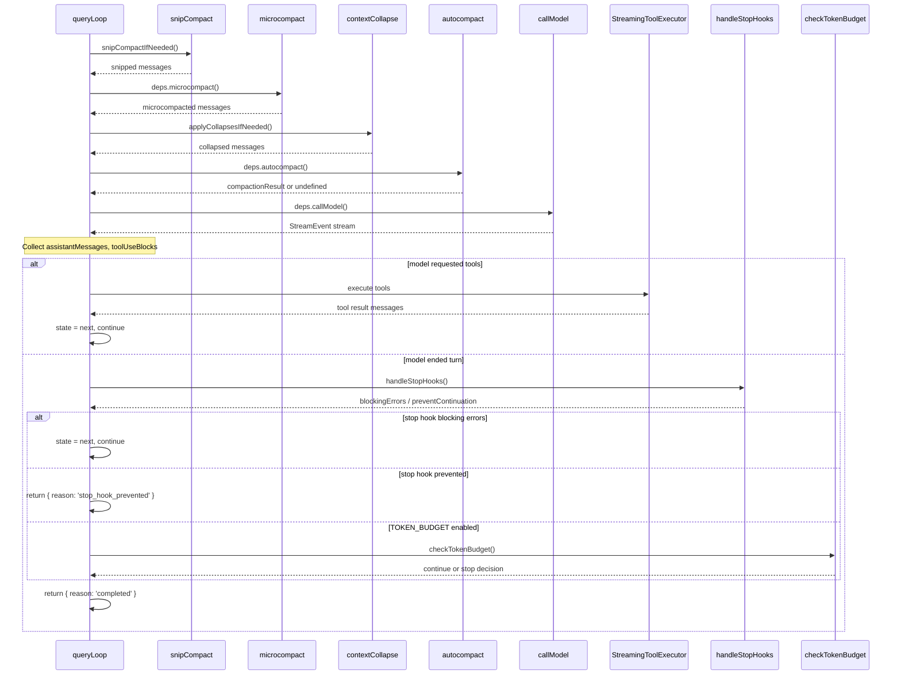
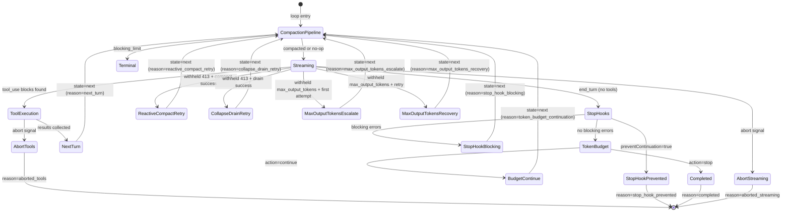
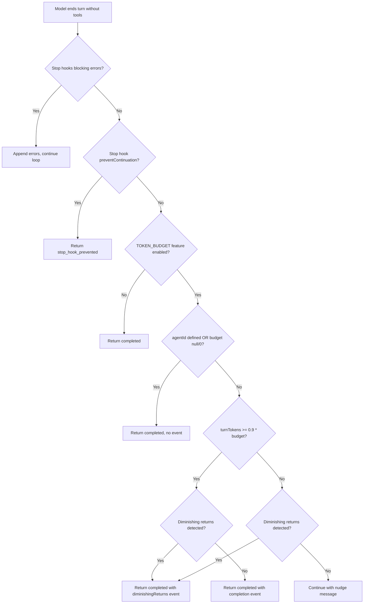

# The Query Loop: Heartbeat of the Agent

## Overview

Every agent framework has a central loop that drives its behavior: receive a response from the model, decide whether to execute tools, feed tool results back, and repeat. In cc, that loop is `queryLoop()` in `src/query.ts`. It is an async generator that yields a heterogeneous stream of events -- model tokens, tool results, compaction boundaries, stop-hook progress -- while carrying mutable state across iterations until the agent either completes its task or hits a termination condition. The loop is not a thin wrapper around an API call. It is a state machine with seven distinct continue-sites, five compaction stages, three interrupt surfaces, and a token-budget governor that can extend or curtail execution mid-turn. Understanding this loop is understanding how cc actually runs.

The `queryLoop` function is invoked exclusively through its thin wrapper `query()`, also in `src/query.ts:L219-L239`. That wrapper handles post-loop cleanup -- notifying command lifecycle for consumed queue entries via `notifyCommandLifecycle(uuid, 'completed')` -- and returns the `Terminal` result to callers. The two primary callers are `QueryEngine.submitMessage()` in `src/QueryEngine.ts` (the SDK and headless path) and the REPL's `ask()` function. Both consume the same async generator stream; the difference is in how they map yielded events into UI or SDK messages. The `QueryEngine` class, defined at `src/QueryEngine.ts:L184`, owns the query lifecycle and session state for a conversation. Its `submitMessage` method at `src/QueryEngine.ts:L209-L1156` wraps the raw generator from `query()`, mapping each yielded message type into the appropriate SDK message format, tracking cumulative usage, and enforcing USD budget limits.

The query loop's async generator protocol is central to its design. By yielding `StreamEvent`, `Message`, `TombstoneMessage`, and `ToolUseSummaryMessage` values, the loop decouples production from consumption: the REPL can render streaming tokens in real time, the SDK can accumulate results, and test harnesses can collect all events without blocking. The `yield*` delegation operator is used extensively -- `yield* handleStopHooks(...)` at `src/query.ts:L1267` delegates the entire stop-hook generator, and `yield* yieldMissingToolResultBlocks(...)` at `src/query.ts:L903` emits synthetic error blocks when a streaming fallback invalidates prior assistant messages.

## Data structures and contracts

### QueryParams

The entry point accepts a `QueryParams` object that bundles everything the loop needs to run one user turn:

```typescript
// src/query.ts:L181-L199 — QueryParams type definition
export type QueryParams = {
  messages: Message[]
  systemPrompt: SystemPrompt
  userContext: { [k: string]: string }
  systemContext: { [k: string]: string }
  canUseTool: CanUseToolFn
  toolUseContext: ToolUseContext
  fallbackModel?: string
  querySource: QuerySource
  maxOutputTokensOverride?: number
  maxTurns?: number
  skipCacheWrite?: boolean
  taskBudget?: { total: number }
  deps?: QueryDeps
}
```

The `messages` field holds the full conversation history up to the current turn. `systemPrompt`, `userContext`, and `systemContext` are the assembled prompt parts -- `userContext` carries key-value pairs like the current working directory and OS, while `systemContext` appends project-specific instructions. `canUseTool` is the permission-check callback that gates every tool execution against the current `permission mode`. `toolUseContext` carries the runtime context including the abort controller, tool list, and query-tracking metadata. The `taskBudget` field at `src/query.ts:L197` provides an API-level output budget distinct from the client-side `tokenBudget` feature -- `total` is the budget for the whole agentic turn, and `remaining` is computed per iteration from cumulative API usage. The `deps` field enables dependency injection for testing, a pattern formalized in `src/query/deps.ts`.

### State

Rather than mutating nine separate variables across loop iterations, cc bundles mutable state into a single `State` object that is replaced wholesale at each continue-site:

```typescript
// src/query.ts:L204-L217 — Loop-iteration state struct
type State = {
  messages: Message[]
  toolUseContext: ToolUseContext
  autoCompactTracking: AutoCompactTrackingState | undefined
  maxOutputTokensRecoveryCount: number
  hasAttemptedReactiveCompact: boolean
  maxOutputTokensOverride: number | undefined
  pendingToolUseSummary: Promise<ToolUseSummaryMessage | null> | undefined
  stopHookActive: boolean | undefined
  turnCount: number
  transition: Continue | undefined
}
```

The `transition` field records why the previous iteration continued -- values like `'next_turn'`, `'stop_hook_blocking'`, `'reactive_compact_retry'`, `'max_output_tokens_recovery'`, `'collapse_drain_retry'`, `'max_output_tokens_escalate'`, and `'token_budget_continuation'`. This lets tests assert which recovery path fired without inspecting message contents. The pattern of replacing the entire `state` object rather than mutating individual fields makes the control flow explicit: every continue-site is a self-contained block that constructs the next state and writes `state = next`. The `autoCompactTracking` field tracks consecutive compaction failures and turn counters for the autocompact circuit breaker, while `maxOutputTokensRecoveryCount` caps recovery attempts at `MAX_OUTPUT_TOKENS_RECOVERY_LIMIT` (3). The `pendingToolUseSummary` carries an asynchronous Haiku-generated summary of the previous turn's tool use, yielded on the next iteration after the model call that triggered it.

### QueryConfig

Immutable runtime gates are snapshotted once at loop entry via `buildQueryConfig()`:

```typescript
// src/query/config.ts:L15-L27 — QueryConfig snapshot type
export type QueryConfig = {
  sessionId: SessionId
  gates: {
    streamingToolExecution: boolean
    emitToolUseSummaries: boolean
    isAnt: boolean
    fastModeEnabled: boolean
  }
}
```

Separating these from per-iteration `State` and the mutable `ToolUseContext` makes a future `step()` extraction tractable -- a pure reducer could take `(state, event, config)` where `config` is plain data. Feature-flag gates (`feature()`) are intentionally excluded from `QueryConfig` because they are tree-shaking boundaries that must stay inline at guarded blocks for dead-code elimination. The `streamingToolExecution` gate controls whether `StreamingToolExecutor` is used instead of the batch `runTools()` path. The `emitToolUseSummaries` gate controls whether Haiku-generated tool summaries are produced. The `isAnt` gate controls dump-prompts capture for internal debugging. The `fastModeEnabled` gate controls whether fast-mode parameters are passed to the API.

### QueryDeps

The dependency-injection layer is defined in `src/query/deps.ts`:

```typescript
// src/query/deps.ts:L21-L31 — Dependency injection type
export type QueryDeps = {
  callModel: typeof queryModelWithStreaming
  microcompact: typeof microcompactMessages
  autocompact: typeof autoCompactIfNeeded
  uuid: () => string
}
```

The scope is intentionally narrow -- four deps covering the model call, two compaction stages, and UUID generation. The `productionDeps()` factory at `src/query/deps.ts:L33-L40` returns the real implementations. Tests inject fakes via `params.deps`, eliminating the need for `spyOn`-per-module boilerplate that was previously duplicated across six to eight test files. The comment at `src/query/deps.ts:L8-L19` explains the rationale: using `typeof fn` keeps signatures in sync with the real implementations automatically, and the scope is kept narrow to prove the pattern before expanding to more deps like `runTools`, `handleStopHooks`, and `logEvent`.

### BudgetTracker

The token-budget tracking structure is defined in `src/query/tokenBudget.ts`:

```typescript
// src/query/tokenBudget.ts:L6-L11 — Budget tracker type
export type BudgetTracker = {
  continuationCount: number
  lastDeltaTokens: number
  lastGlobalTurnTokens: number
  startedAt: number
}
```

The `continuationCount` tracks how many times the budget has been extended. The `lastDeltaTokens` and `lastGlobalTurnTokens` fields enable diminishing-returns detection by comparing the token delta between consecutive checks. The `startedAt` timestamp provides the total duration for completion events. The tracker is created once at loop entry when the `TOKEN_BUDGET` feature flag is enabled (`src/query.ts:L280`) and passed to `checkTokenBudget()` on each iteration where the model ends without requesting tools.

## Control flow

### The main loop

The core loop is a `while (true)` inside an async generator at `src/query.ts:L307-L1728`. Each iteration performs the following phases in order:

1. **Destructure state** (`src/query.ts:L311-L321`) -- Read all fields from the current `State` at the top of the iteration so subsequent code uses bare names like `messages` and `turnCount` rather than `state.messages`.
2. **Prefetch** (`src/query.ts:L331-L335`) -- Fire memory prefetch (once per user turn, using the `using` keyword for disposal) and skill discovery prefetch (per iteration, returns early on non-write iterations via a `findWritePivot` guard).
3. **Yield stream_request_start** (`src/query.ts:L337`) -- Signal to consumers that a new API call is beginning.
4. **Query tracking initialization** (`src/query.ts:L347-L363`) -- Create or increment the `queryTracking` object with a `chainId` and `depth`, so analytics can correlate events across the recursive call chain.
5. **Compaction pipeline** (`src/query.ts:L365-L543`) -- Run tool-result budgeting, snip, microcompact, context collapse, and autocompact in sequence. Each may reduce the message list. Autocompact resets `tracking` on success.
6. **Blocking-limit check** (`src/query.ts:L615-L648`) -- If token count exceeds the hard limit and no compaction path can recover, yield an error and return `{ reason: 'blocking_limit' }`.
7. **Model streaming** (`src/query.ts:L659-L863`) -- Call `deps.callModel()` and iterate its async generator, collecting assistant messages and tool-use blocks. The streaming loop handles backfill of observable tool inputs, withholding of recoverable errors, and streaming fallback.
8. **Post-sampling hooks** (`src/query.ts:L1000-L1009`) -- Fire after model response completes (non-blocking, `void`-discarded).
9. **Abort check** (`src/query.ts:L1015-L1052`) -- If the user interrupted during streaming, consume remaining tool results and return.
10. **Recovery paths** (`src/query.ts:L1062-L1306`) -- When `needsFollowUp` is false, check for withheld prompt-too-long, withheld media-size errors, and max-output-tokens conditions. Each has its own recovery strategy.
11. **Stop hooks** (`src/query.ts:L1267-L1306`) -- Run `handleStopHooks()`, which may produce blocking errors (causing another iteration) or prevent continuation (causing immediate return).
12. **Token budget check** (`src/query.ts:L1308-L1357`) -- If the `TOKEN_BUDGET` feature is enabled, decide whether to continue for another iteration or stop.
13. **Tool execution** (`src/query.ts:L1360-L1408`) -- If the model requested tools, execute them via `StreamingToolExecutor` or `runTools()`.
14. **Attachment collection** (`src/query.ts:L1566-L1657`) -- Gather queued commands, memory prefetch results, and skill discovery results as tool-result attachments.
15. **Continue** (`src/query.ts:L1715-L1727`) -- Construct the next `State` with updated messages, tool results, and metadata, then `continue` the loop.



### StreamEvent vs Message types

The `queryLoop` generator's return type signature at `src/query.ts:L244-L250` declares a union of five yielded types: `StreamEvent`, `RequestStartEvent`, `Message`, `TombstoneMessage`, and `ToolUseSummaryMessage`. Each serves a distinct purpose in the generator-consumer contract.

The `StreamEvent` type wraps raw API server-sent events. These include `message_start` (carrying initial usage), `content_block_start` and `content_block_delta` (carrying incremental text and tool-use data), `content_block_stop` (the signal that causes the loop to push an `AssistantMessage`), `message_delta` (carrying final usage and `stop_reason`), and `message_stop` (the end-of-message signal). The `QueryEngine` consumes these at `src/QueryEngine.ts:L789-L816` to track cumulative usage via `accumulateUsage` and capture `stop_reason` from `message_delta` events. They are not forwarded to SDK callers unless `includePartialMessages` is true.

The `Message` type encompasses `AssistantMessage`, `UserMessage`, `AttachmentMessage`, and `SystemMessage` -- the structured conversation entries that persist in the transcript and flow back to the API on subsequent turns. The `AssistantMessage` is the primary output: each `content_block_stop` event produces one, containing the accumulated content blocks (text, tool_use, thinking) plus usage metadata.

The `TombstoneMessage` is a control signal for removing orphaned messages from the UI after a streaming fallback. When the model triggers a fallback mid-stream, previously yielded assistant messages are invalid because their thinking blocks have signatures bound to the original model. Tombstones at `src/query.ts:L716-L719` instruct consumers to remove those messages from the display.

The `ToolUseSummaryMessage` carries an asynchronous summary of tool use, generated by a separate Haiku call. The summary promise is created at `src/query.ts:L1469-L1481` and resolved on the next iteration at `src/query.ts:L1055-L1060`. This pipelining hides the ~1-second Haiku latency behind the 5-30 second model streaming time.

The `RequestStartEvent` (`{ type: 'stream_request_start' }`) is yielded at `src/query.ts:L337` to signal that a new API call is beginning. The `QueryEngine` uses this to record headless profiler checkpoints.

### Tool dispatch points

Tool execution begins at `src/query.ts:L1360-L1408`. When `needsFollowUp` is true (meaning the model emitted at least one `tool_use` block), the loop dispatches tools through either `StreamingToolExecutor.getRemainingResults()` (when the streaming tool execution gate is enabled) or `runTools()` from `src/services/tools/toolOrchestration.ts` (the batch path). The streaming executor starts processing tools as soon as each `tool_use` block arrives during model streaming, overlapping tool execution with the ongoing stream. The batch path waits for the full response before executing any tools.

The `StreamingToolExecutor` at `src/services/tools/StreamingToolExecutor.ts:L40-L62` manages a queue of `TrackedTool` entries, each with a status lifecycle of `queued -> executing -> completed -> yielded`. The `addTool()` method at `src/services/tools/StreamingToolExecutor.ts:L76` registers a tool and immediately calls `processQueue()`, which starts execution if concurrency conditions allow. Concurrency-safe tools (those whose `isConcurrencySafe()` method returns true) can execute in parallel with other concurrency-safe tools; non-concurrent-safe tools require exclusive access.

Results from both paths are yielded directly and also normalized into `toolResults` for the next iteration's message list. The `normalizeMessagesForAPI` call at `src/query.ts:L1396-L1399` converts raw tool-result messages into the `UserMessage` format that the Anthropic API expects -- tool results must appear as user-role messages containing `tool_result` content blocks, and this normalization handles the mapping from cc's internal `AttachmentMessage` format.

The loop also handles tool-result budgeting before the API call via `applyToolResultBudget()` at `src/query.ts:L379-L394`. This enforces per-message size limits on tool results, replacing oversized content with compressed summaries. The `observation masking` technique -- replacing verbose tool outputs with compressed summaries before feeding them back into the model context -- directly reduces context window consumption and API costs.

### Interruption points

There are three distinct interrupt surfaces in the loop, each handling a different phase of execution:

1. **Streaming abort** (`src/query.ts:L1015-L1052`) -- If the abort controller fires during model streaming, the loop consumes remaining `StreamingToolExecutor` results (which generate synthetic tool_result blocks for aborted tools via the `createSyntheticErrorMessage` method) and returns `{ reason: 'aborted_streaming' }`. Without consuming these, tool_use blocks would lack matching tool_result blocks, causing API errors on the next turn. The `StreamingToolExecutor` checks the abort signal in its `executeTool` method and generates either a `'user_interrupted'` or `'sibling_error'` synthetic result depending on the abort reason.

2. **Tool-execution abort** (`src/query.ts:L1485-L1516`) -- If the abort fires during tool execution, the loop checks the abort reason: if it is `'interrupt'` (a submit-interrupt, where the user typed a new message while tools were running), the interruption message is skipped because the queued user message provides sufficient context. Otherwise, a `createUserInterruptionMessage` is yielded. The max-turns check runs even on abort at `src/query.ts:L1507-L1514` to emit the `max_turns_reached` attachment if applicable.

3. **Stop-hook abort** (`src/query/stopHooks.ts:L283-L294`) -- If the abort fires during stop-hook execution, `handleStopHooks` yields a user-interruption message and returns `{ blockingErrors: [], preventContinuation: true }`, which causes the main loop to return `{ reason: 'stop_hook_prevented' }`. The analytics event `tengu_pre_stop_hooks_cancelled` is logged at `src/query/stopHooks.ts:L284-L290` with the chain ID and query depth.

### The continue-sites

The loop has seven distinct paths that set `state = next` and `continue` rather than returning. Each constructs a complete `State` object with explicit field values, making the transition visible in code review and debug traces:

1. **`next_turn`** (`src/query.ts:L1715-L1727`) -- The normal tool-follow-up path. The model requested tools, they were executed, and the conversation continues with tool results appended. The `messages` field is set to `[...messagesForQuery, ...assistantMessages, ...toolResults]`, and `turnCount` increments by one.

2. **`stop_hook_blocking`** (`src/query.ts:L1283-L1306`) -- Stop hooks returned blocking errors. The errors are appended as user messages so the model can address them, `stopHookActive` is set to `true` to prevent re-running the same hooks on the next iteration, and `maxOutputTokensRecoveryCount` is reset to 0. The `hasAttemptedReactiveCompact` flag is preserved -- resetting it to false caused an infinite loop where compact runs, fails, and the cycle repeats.

3. **`reactive_compact_retry`** (`src/query.ts:L1152-L1166`) -- A withheld prompt-too-long error triggered reactive compaction. The post-compact messages replace the conversation, `hasAttemptedReactiveCompact` is set to `true` to prevent re-triggering, and `autoCompactTracking` is reset to `undefined`.

4. **`collapse_drain_retry`** (`src/query.ts:L1099-L1116`) -- A withheld prompt-too-long error triggered context-collapse drain. Committed collapses are applied and the loop retries. The `transition` field records `committed: drained.committed` for diagnostic purposes.

5. **`max_output_tokens_escalate`** (`src/query.ts:L1207-L1221`) -- The model hit the output token limit. If the escalating-OTK gate is enabled and no override has been attempted yet, retry with `ESCALATED_MAX_TOKENS`. The `maxOutputTokensOverride` field carries the escalated value to the next API call.

6. **`max_output_tokens_recovery`** (`src/query.ts:L1223-L1252`) -- After escalation, if the limit is hit again, inject a meta message telling the model to "resume directly -- no apology, no recap of what you were doing. Pick up mid-thought if that is where the cut happened." This recovery can fire up to `MAX_OUTPUT_TOKENS_RECOVERY_LIMIT` (3) times.

7. **`token_budget_continuation`** (`src/query.ts:L1316-L1341`) -- The token-budget check decided to continue rather than stop. A nudge message is injected via `getBudgetContinuationMessage(pct, turnTokens, budget)` telling the model the current budget utilization, and the loop continues for another iteration.



### How the loop bridges model streaming and tool execution

The `StreamingToolExecutor` at `src/services/tools/StreamingToolExecutor.ts` is the bridge between the model's streaming response and tool execution. During the `for await (const message of deps.callModel(...))` loop at `src/query.ts:L659-L863`, each time an assistant message containing `tool_use` blocks is yielded, those blocks are immediately registered with the executor via `streamingToolExecutor.addTool(toolBlock, message)` at `src/query.ts:L841-L844`. Completed results are drained via `streamingToolExecutor.getCompletedResults()` at `src/query.ts:L851` on each streaming iteration. This overlap means that a long-running tool (e.g., a Bash command) can start executing while the model is still generating subsequent tool_use blocks in the same response.

The executor's concurrency model is governed by `canExecuteTool()` at `src/services/tools/StreamingToolExecutor.ts:L129-L135`. A tool can start if no tools are currently executing, or if the new tool is concurrency-safe and all currently executing tools are also concurrency-safe. Non-concurrent-safe tools block all subsequent tools until they complete. The `siblingAbortController` at `src/services/tools/StreamingToolExecutor.ts:L49` is a child of the main abort controller -- when a Bash tool errors, sibling subprocesses are killed immediately via this controller, but the parent query loop is not aborted.

After the streaming loop ends, any remaining tool results are consumed via `streamingToolExecutor.getRemainingResults()` at `src/query.ts:L1381`. The non-streaming path uses `runTools()` at `src/query.ts:L1382`, which processes all tool_use blocks in a single batch. The `discard()` method at `src/services/tools/StreamingToolExecutor.ts:L69-L71` invalidates the executor when a streaming fallback occurs -- queued tools will not start, and in-progress tools receive synthetic error results.

### The compaction pipeline within the loop

Each loop iteration runs a four-stage compaction pipeline before the API call. The stages are ordered from cheapest to most expensive, and each may reduce the message list independently:

**Snip** (`src/query.ts:L401-L410`) -- Gated behind the `HISTORY_SNIP` feature flag. The `snipCompactIfNeeded()` function removes older messages that are no longer relevant. The `snipTokensFreed` value is plumbed to autocompact so its threshold check reflects what snip removed, since `tokenCountWithEstimation` alone cannot see the freed tokens.

**Microcompact** (`src/query.ts:L413-L426`) -- Selectively summarizes individual messages or message groups while preserving key information. The `deps.microcompact()` call uses the injected dependency so tests can substitute a no-op. When `CACHED_MICROCOMPACT` is enabled, the boundary message is deferred until after the API response to use actual `cache_deleted_input_tokens` values.

**Context collapse** (`src/query.ts:L440-L447`) -- Gated behind `CONTEXT_COLLAPSE`. A read-time projection over the REPL's full history that commits collapses without yielding messages. Summary messages live in the collapse store, not the REPL array. This is what makes collapses persist across turns: `projectView()` replays the commit log on every entry. Within a turn, the view flows forward via `state.messages` at the continue site.

**Autocompact** (`src/query.ts:L453-L543`) -- The most aggressive compaction, generating a full conversation summary. On success, the `tracking` state is reset with `compacted: true` and a fresh `turnId`. The `consecutiveFailures` counter from autocompact is propagated back to `tracking` so the circuit breaker can stop retrying on the next iteration. When `taskBudget` is active, the pre-compact context window is captured at `src/query.ts:L509-L515` to compute the remaining budget.

The order matters: snip and microcompact run before autocompact so that if they bring the context under the autocompact threshold, the expensive full summary is avoided. Context collapse runs before autocompact for the same reason -- if collapse brings the context under threshold, autocompact is a no-op and granular context is preserved.

### Stop-hook evaluation

When the model ends its turn without requesting tools, `handleStopHooks()` at `src/query/stopHooks.ts:L65-L473` runs. It is itself an async generator that yields progress messages, attachment messages (for hook output), and blocking-error messages. Its return value is a `StopHookResult`:

```typescript
// src/query.ts:L60-L63 — Stop-hook result contract
type StopHookResult = {
  blockingErrors: Message[]
  preventContinuation: boolean
}
```

The `blockingErrors` array contains user messages with the hook's blocking error text. When non-empty, the main loop appends them to the conversation and continues, giving the model a chance to address the error. The `preventContinuation` flag is set when a hook explicitly requests that the agent stop -- the loop returns immediately with `{ reason: 'stop_hook_prevented' }`.

Inside `handleStopHooks`, the `executeStopHooks()` generator at `src/query/stopHooks.ts:L180-L295` is consumed with a `for await` loop. Each result may contain a `message` to yield, a `blockingError` to collect, and a `preventContinuation` flag. The hook summary message is created at `src/query/stopHooks.ts:L298-L309` via `createStopHookSummaryMessage`, which includes the hook count, per-hook info (command, prompt text, duration), errors, and whether continuation was prevented. Errors trigger a notification at `src/query/stopHooks.ts:L311-L322` with a keyboard shortcut hint for the transcript view.

Stop hooks also run background bookkeeping: prompt suggestions, memory extraction, auto-dream, job classification, and computer-use cleanup. These are gated behind `isBareMode()` and `toolUseContext.agentId` checks to avoid contaminating subagent contexts or blocking scripted `-p` calls. The `saveCacheSafeParams()` call at `src/query/stopHooks.ts:L96-L98` is scoped to `repl_main_thread` and `sdk` query sources, ensuring subagents never overwrite the main session's cached parameters.

For teammates (agents running in a coordinator), `handleStopHooks` additionally runs `TaskCompleted` hooks for any in-progress tasks owned by the teammate at `src/query/stopHooks.ts:L335-L400`, followed by `TeammateIdle` hooks at `src/query/stopHooks.ts:L403-L441`. Both follow the same blocking-error and prevent-continuation semantics as the main Stop hooks, with their own `teammateHookToolUseID` tracking.

### Token budget checks

The token-budget governor at `src/query/tokenBudget.ts:L45-L93` decides whether the loop should continue for another iteration after the model completes a turn without tool use. It tracks cumulative turn tokens against a budget and detects diminishing returns:

```typescript
// src/query/tokenBudget.ts:L45-L76 — Token budget decision logic
export function checkTokenBudget(
  tracker: BudgetTracker,
  agentId: string | undefined,
  budget: number | null,
  globalTurnTokens: number,
): TokenBudgetDecision {
  if (agentId || budget === null || budget <= 0) {
    return { action: 'stop', completionEvent: null }
  }

  const turnTokens = globalTurnTokens
  const pct = Math.round((turnTokens / budget) * 100)
  const deltaSinceLastCheck = globalTurnTokens - tracker.lastGlobalTurnTokens

  const isDiminishing =
    tracker.continuationCount >= 3 &&
    deltaSinceLastCheck < DIMINISHING_THRESHOLD &&
    tracker.lastDeltaTokens < DIMINISHING_THRESHOLD

  if (!isDiminishing && turnTokens < budget * COMPLETION_THRESHOLD) {
    tracker.continuationCount++
    tracker.lastDeltaTokens = deltaSinceLastCheck
    tracker.lastGlobalTurnTokens = globalTurnTokens
    return {
      action: 'continue',
      nudgeMessage: getBudgetContinuationMessage(pct, turnTokens, budget),
      continuationCount: tracker.continuationCount,
      pct,
      turnTokens,
      budget,
    }
  }
  // ...
}
```

The `COMPLETION_THRESHOLD` at `src/query/tokenBudget.ts:L3` is `0.9` -- the loop continues as long as cumulative tokens are below 90% of budget. The `DIMINISHING_THRESHOLD` at `src/query/tokenBudget.ts:L4` is `500` tokens -- if the last two iterations each produced fewer than 500 tokens of new output and at least three continuations have occurred, the loop stops early with `diminishingReturns: true`. This directly addresses the HER infinite-loop pattern: an agent spinning without making progress is detected and halted before it consumes the entire budget.

Subagents (where `agentId` is defined) always stop immediately at `src/query/tokenBudget.ts:L51-L53` -- token-budget continuation is a top-level-session feature only. This prevents subagents from silently consuming budget without the parent session's knowledge.

The decision type `TokenBudgetDecision` at `src/query/tokenBudget.ts:L43` is a discriminated union with `action: 'continue' | 'stop'`. When the action is `'continue'`, the `nudgeMessage` field carries a human-readable budget utilization message that is injected as a meta user message at `src/query.ts:L1324-L1330`. When the action is `'stop'`, the optional `completionEvent` field carries telemetry data including `continuationCount`, `pct`, `turnTokens`, `budget`, `diminishingReturns`, and `durationMs`.



### Withheld errors and the recovery pipeline

A critical design pattern in the query loop is the withholding of recoverable errors from the stream. The `withheld` boolean at `src/query.ts:L799` is set when a message is a prompt-too-long error, a max-output-tokens error, or a media-size error. Instead of yielding these errors immediately, the loop holds them in `assistantMessages` so the recovery checks below can find them, but does not expose them to consumers.

The recovery pipeline after streaming is ordered by cost:

1. **Context-collapse drain** (`src/query.ts:L1085-L1117`) -- The cheapest recovery. Commits staged collapses that were previously held back, removing old messages while preserving granular context. Gated on `state.transition?.reason !== 'collapse_drain_retry'` to prevent infinite drain loops.

2. **Reactive compact** (`src/query.ts:L1119-L1183`) -- A full compaction when collapse drain is insufficient or unavailable. After compact, the loop retries the API call with the compressed context. The `hasAttemptedReactiveCompact` flag at `src/query.ts:L1157` prevents re-triggering on the next iteration.

3. **Max-output-tokens escalation** (`src/query.ts:L1188-L1256`) -- Escalate the output token limit from the default to `ESCALATED_MAX_TOKENS`, then inject a recovery message on subsequent hits. This is a client-side-only recovery that does not involve compaction.

When all recovery paths fail or are exhausted, the withheld error is finally yielded at `src/query.ts:L1173` or `src/query.ts:L1255`, and the loop returns with the appropriate terminal reason. The `executeStopFailureHooks()` call at `src/query.ts:L1174` fires a different hook event for monitoring, but the loop does not fall through to regular stop hooks because "the model never produced a valid response, so hooks have nothing meaningful to evaluate."

## Edge cases and failure modes

### Streaming fallback and orphaned messages

When the model API triggers a fallback (e.g., from Opus to Sonnet due to capacity), the `FallbackTriggeredError` is caught at `src/query.ts:L894`. The loop must tombstone all previously yielded assistant messages because their thinking blocks have signatures bound to the original model -- replaying a protected-thinking block to an unprotected fallback model produces a 400 error. Tombstones at `src/query.ts:L716-L719` are control signals that remove the orphaned messages from both UI and transcript. The streaming tool executor is also discarded and recreated at `src/query.ts:L734-L740` to prevent orphan tool_results (with old tool_use_ids) from leaking into the retry.

Before the retry, the loop strips signature blocks from `messagesForQuery` at `src/query.ts:L927-L929` when `USER_TYPE === 'ant'`, because thinking signatures are model-bound. The fallback event is logged at `src/query.ts:L932-L941` with the original model, fallback model, and query tracking metadata. A system message is yielded at `src/query.ts:L945-L948` notifying the user of the model switch.

The `streamingFallbackOccured` flag at `src/query.ts:L657` is set by the `onStreamingFallback` callback in the API call options. When this flag is true, each streaming message is checked at `src/query.ts:L712` and, on the first post-fallback message, all previously collected `assistantMessages`, `toolResults`, and `toolUseBlocks` are cleared.

### Prompt-too-long death spiral

The loop carefully avoids running stop hooks on prompt-too-long and other API errors at `src/query.ts:L1262-L1265`. The comment explains the risk: "hooks evaluating it create a death spiral: error, hook blocking, retry, error." Each cycle injects more tokens (the hook's blocking message), making the problem worse. The `hasAttemptedReactiveCompact` flag at `src/query.ts:L1297` is preserved across stop-hook blocking retries for the same reason -- if compact already failed to recover, retrying after a stop-hook error produces the same result, and resetting the flag caused an infinite loop that burned thousands of API calls.

The blocking-limit preempt at `src/query.ts:L628-L648` is also carefully scoped. It is skipped when: compaction just happened (the post-compact token count is already validated); the query source is `compact` or `session_memory` (which would deadlock -- the compact agent needs to run to reduce tokens); reactive compact is enabled (its synthetic error returns before the API call); or context collapse is enabled (its `recoverFromOverflow` handles the real 413 response). The `snipTokensFreed` value is subtracted from the estimated token count at `src/query.ts:L638` to avoid falsely blocking in the window where snip brought the context under the autocompact threshold but the stale usage is still above the blocking limit.

### Max-output-tokens recovery

When the model hits the output token limit, the error is withheld from the stream at `src/query.ts:L820-L822` (via `isWithheldMaxOutputTokens`). The recovery path at `src/query.ts:L1188-L1256` has two stages: first, escalate the output token limit from the default to 64k via `ESCALATED_MAX_TOKENS` at `src/query.ts:L1213`; second, inject a meta message at `src/query.ts:L1224-L1228` telling the model to "Resume directly -- no apology, no recap of what you were doing. Pick up mid-thought if that is where the cut happened. Break remaining work into smaller pieces." This recovery can fire up to `MAX_OUTPUT_TOKENS_RECOVERY_LIMIT` (3) times. Only after all recovery attempts are exhausted is the withheld error surfaced to the consumer.

The `isWithheldMaxOutputTokens` check at `src/query.ts:L175-L179` identifies these errors by their `type === 'assistant'` and `apiError === 'max_output_tokens'` combination. The comment at `src/query.ts:L167-L172` explains that withholding is necessary because SDK callers (e.g., cowork/desktop) terminate the session on any `error` field -- if the error is yielded before the recovery loop completes, the loop keeps running but nobody is listening.

### Context rot within a turn

As noted in HER section 6.1, context rot is the gradual degradation of agent coherence as the context window fills. Information at the beginning and end of a context window is more reliably attended to, while information in the middle degrades fastest. The query loop addresses this through its five-stage compaction pipeline (snip, microcompact, context collapse, autocompact, reactive compact), but the `transition` field on `State` reveals an additional defense: it tracks whether the previous iteration was a compaction-induced retry, preventing the loop from repeatedly compacting and retrying with the same result. The `collapse_drain_retry` transition checks `state.transition?.reason !== 'collapse_drain_retry'` at `src/query.ts:L1092`, ensuring that if a collapse drain followed by a retry still produces a 413, the loop falls through to reactive compact rather than looping forever.

The `autoCompactTracking` field on `State` carries a `consecutiveFailures` counter that propagates from the autocompact call at `src/query.ts:L454` back to `tracking` at `src/query.ts:L536-L543`. When autocompact fails, the failure count is preserved so the circuit breaker can stop retrying on the next iteration. On successful compaction, the counter resets to 0 at `src/query.ts:L525`.

### Task budget across compaction boundaries

The `taskBudgetRemaining` variable at `src/query.ts:L291` tracks API task-budget consumption across compaction boundaries. After a compact, the server sees only the summary and would under-count spend because it cannot see the messages that were summarized away. The remaining budget is computed at `src/query.ts:L509-L515` by subtracting the pre-compact context window (`finalContextTokensFromLastResponse(messagesForQuery)`) from the total, and this value is passed as `taskBudget.remaining` in the next API call at `src/query.ts:L700-L706`. This is tracked as a loop-local variable (not on `State`) to avoid modifying the seven continue-sites. The same carryover logic applies to the reactive-compact path at `src/query.ts:L1138-L1146`.

### Tool-result backfill and streaming tool executor edge cases

The streaming tool executor's `addTool()` method at `src/services/tools/StreamingToolExecutor.ts:L76` handles the case where a tool definition is not found by immediately creating a completed entry with a synthetic error message. This prevents the loop from hanging on an unknown tool name. The `discard()` method at `src/services/tools/StreamingToolExecutor.ts:L69-L71` sets a `discarded` flag that causes all subsequent `addTool` calls to be no-ops and all pending tools to receive `'streaming_fallback'` synthetic errors.

The backfill of observable tool inputs at `src/query.ts:L748-L787` clones assistant messages before yield when a tool's `backfillObservableInput` method adds fields that were not in the original input. The original message is left untouched for the API call because mutating it would break prompt caching (byte mismatch on the serialized form). The `addedFields` check at `src/query.ts:L771-L773` ensures that only additions trigger cloning -- overwrites of existing fields (e.g., file tools expanding `file_path`) do not, because those changes are already visible to the API through `toolExecution.ts`.

### Queue draining and agent scoping

The message queue drain at `src/query.ts:L1566-L1643` handles agent scoping carefully. The queue is a process-global singleton shared by the coordinator and all in-process subagents. Each loop iteration drains only what is addressed to it: the main thread drains entries with `agentId === undefined`, while subagents drain only task-notification entries with their own `agentId`. Slash commands are excluded from mid-turn drain because they must go through `processSlashCommand` after the turn ends, not be sent to the model as text. The `SLEEP_TOOL_NAME` check at `src/query.ts:L1566` determines whether to drain at `'next'` or `'later'` priority -- when the model used the Sleep tool, all pending notifications are drained at `'later'` priority.

## Where cc diverges from the published pattern

HER Pattern 6 (Explore-Plan-Act Loop) prescribes three phases with escalating permissions: read-only exploration, discussion-mode planning, and full-access execution. cc's query loop does not implement this pattern directly. Instead, it provides the mechanism (the `permission mode` governing tool authorization) and the `plan mode` tool (`EnterPlanModeTool` / `ExitPlanModeV2Tool`), but the loop itself is permission-mode-agnostic -- it processes whatever tool-use blocks the model emits, and the `canUseTool` callback enforces permissions at dispatch time. The loop does not enforce a phase transition; the model decides when to move from exploration to action, and the permission system either allows or denies each tool call independently. This is a deliberate design choice: the loop's job is to faithfully execute the model's decisions within the constraints of the current permission mode, not to impose its own phase structure.

The HER infinite-loop pattern (section 6.7) recommends maximum retry counts, exponential backoff, and loop detection. cc implements retry counts (`MAX_OUTPUT_TOKENS_RECOVERY_LIMIT` = 3, `maxTurns` parameter) and loop detection (the token-budget diminishing-returns check), but does not implement exponential backoff within the query loop itself -- that is handled at the API layer in `src/services/api/withRetry.ts`. The `stopHookActive` flag at `src/query.ts:L1300` acts as a per-turn circuit breaker for stop-hook blocking, preventing the same hooks from re-evaluating on consecutive iterations. The `consecutiveFailures` counter on `autoCompactTracking` provides a second circuit breaker for compaction failures.

The HER premature-completion pattern (section 6.2) recommends a comprehensive JSON feature list with all items initially marked "failing." cc does not implement this pattern in the query loop. Instead, it relies on stop hooks and the token-budget continuation mechanism to detect when the model has stopped too early and nudge it to continue. The `checkTokenBudget` function's `action: 'continue'` path injects a nudge message with the current budget utilization percentage, giving the model an explicit signal that more work is expected. This is a softer approach than the JSON feature list -- it trusts the model to recognize when its work is incomplete rather than forcing a specific verification structure.

## Developer takeaways for building a long-running agent

Building a long-running agent loop requires disciplined state management, explicit recovery paths, and careful handling of the space between "the model said something" and "the model is done." The single most important design decision in cc's query loop is the `State` struct with immutable-snapshot semantics -- every continue-site constructs a new state object rather than mutating fields, making each transition auditable and testable. The `transition` field is not decorative; it prevents death spirals by letting downstream logic know what happened on the previous iteration. When building your own loop, separate concerns that snap once at entry (config, gates) from concerns that evolve per-iteration (state), and inject dependencies so that every recovery path can be tested without spinning up a real model. The token-budget governor's diminishing-returns detector is the simplest effective infinite-loop defense: track consecutive low-delta iterations and stop early. The withheld-error pattern -- holding back recoverable errors from the stream until recovery succeeds or exhausts -- prevents SDK consumers from terminating on intermediate states that the loop is already correcting. Finally, the streaming-tool-executor overlap proves that tool execution does not need to wait for the model to finish speaking; registering tool_use blocks as they arrive and draining results incrementally turns serial latency into parallel throughput without sacrificing correctness.
