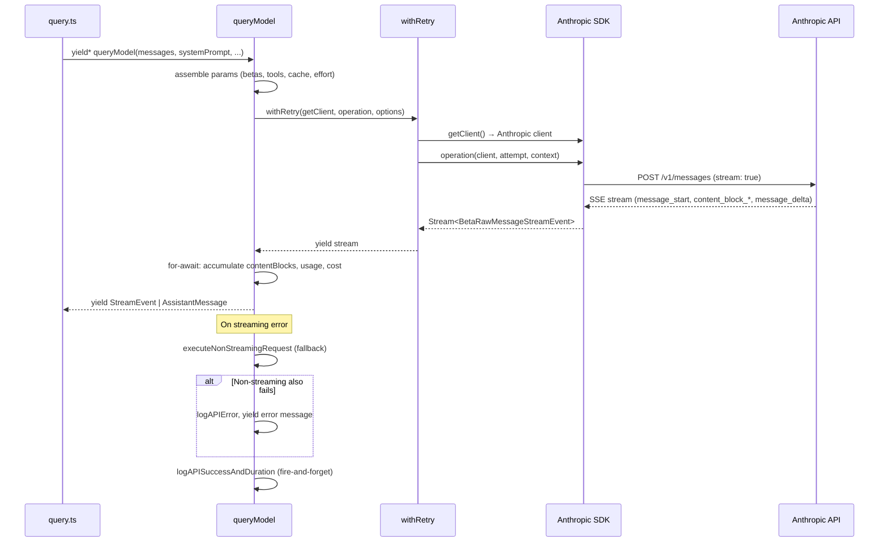
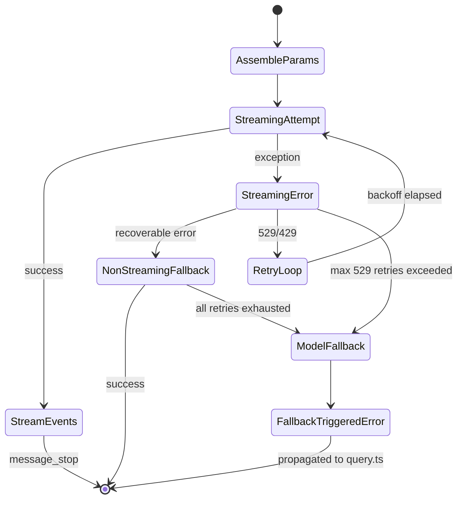
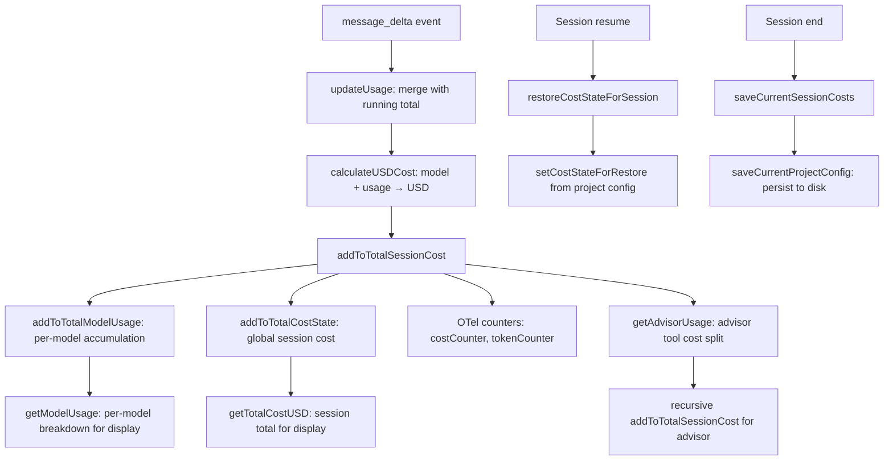

# Talking to Anthropic: `services/api/claude.ts` and Streaming

## Overview

Every time the agent loop in `src/query.ts` needs a model response, control flows into `src/services/api/claude.ts`, a 3419-line module that wraps the Anthropic SDK and turns a conversation history plus a tool manifest into a streaming sequence of assistant messages. This chapter traces the full lifecycle of a single API request: how parameters are assembled, how the streaming response is consumed, how failures trigger retries or model fallback, and how token usage and cost are metered back into session state.

The module is the sole conduit between the harness and the Anthropic inference API. Nothing else in the codebase calls `anthropic.beta.messages.create` directly. This centralization is what makes it possible to implement cross-cutting concerns -- prompt cache break detection, rate-limit classification, non-streaming fallback, usage accumulation -- in one place rather than scattering them across the tool dispatch pipeline.

Supporting modules complete the picture: `src/services/api/errors.ts` (1207 lines) classifies every API error into a user-facing message and an analytics tag; `src/services/api/logging.ts` (788 lines) emits structured events for queries, successes, and failures; `src/services/api/usage.ts` (63 lines) fetches rate-limit utilization from the Anthropic billing endpoint; and `src/services/api/promptCacheBreakDetection.ts` (728 lines) diagnoses why the server-side prompt cache was invalidated across consecutive calls.

## Data structures and contracts

### The Options type

The entry-point function `queryModel` accepts an `Options` object that encodes everything the API layer needs to know about the caller's intent:

```typescript
// src/services/api/claude.ts:L676-L707 — Options type for queryModel
export type Options = {
  getToolPermissionContext: () => Promise<ToolPermissionContext>
  model: string
  toolChoice?: BetaToolChoiceTool | BetaToolChoiceAuto | undefined
  isNonInteractiveSession: boolean
  extraToolSchemas?: BetaToolUnion[]
  maxOutputTokensOverride?: number
  fallbackModel?: string
  onStreamingFallback?: () => void
  querySource: QuerySource
  agents: AgentDefinition[]
  allowedAgentTypes?: string[]
  hasAppendSystemPrompt: boolean
  fetchOverride?: ClientOptions['fetch']
  enablePromptCaching?: boolean
  skipCacheWrite?: boolean
  temperatureOverride?: number
  effortValue?: EffortValue
  mcpTools: Tools
  hasPendingMcpServers?: boolean
  queryTracking?: QueryChainTracking
  agentId?: AgentId
  outputFormat?: BetaJSONOutputFormat
  fastMode?: boolean
  advisorModel?: string
  addNotification?: (notif: Notification) => void
  taskBudget?: { total: number; remaining?: number }
}
```

The `Options` type bundles the model name, tool schemas, thinking configuration, caching preferences, and a `fallbackModel` field that the retry layer uses when the primary model is overloaded. The `querySource` field is a string enum (e.g., `repl_main_thread`, `agent:default`, `compact`) that controls retry aggressiveness and prompt-cache TTL eligibility -- foreground sources retry on 529 errors, background sources bail immediately. The `taskBudget` field, distinct from the `tokenBudget.ts` auto-continue feature, is sent to the API as `output_config.task_budget` so the model can pace its own output within a token budget. The `onStreamingFallback` callback lets callers react when the streaming request fails and a non-streaming retry begins.

### The RetryContext interface

The `RetryContext` interface in the retry module carries mutable state across attempts:

```typescript
// src/services/api/withRetry.ts:L120-L125 — RetryContext interface
export interface RetryContext {
  maxTokensOverride?: number
  model: string
  thinkingConfig: ThinkingConfig
  fastMode?: boolean
}
```

The `RetryContext` is the narrow contract between the retry loop and the operation callback. On each attempt the callback receives the current context and can adjust parameters -- for example, clamping `max_tokens` down after a context-window overflow, or switching the model after a `FallbackTriggeredError`. The `fastMode` field is only present when fast mode is enabled; its absence in the options object suppresses the fast-mode speed header entirely.

### The NonNullableUsage and Utilization types

The `NonNullableUsage` type, re-exported from `src/services/api/logging.ts`, extends the SDK's `BetaUsage` with required fields so downstream consumers never see `undefined` for token counts. It flows through `updateUsage`, `accumulateUsage`, and into `cost-tracker.ts`. The `EMPTY_USAGE` constant provides a zero-valued default for initialization.

For rate-limit visibility, `src/services/api/usage.ts` defines a `Utilization` type that mirrors the Anthropic billing API response:

```typescript
// src/services/api/usage.ts:L12-L31 — Utilization types for rate limit tracking
export type RateLimit = {
  utilization: number | null
  resets_at: string | null
}

export type ExtraUsage = {
  is_enabled: boolean
  monthly_limit: number | null
  used_credits: number | null
  utilization: number | null
}

export type Utilization = {
  five_hour?: RateLimit | null
  seven_day?: RateLimit | null
  seven_day_oauth_apps?: RateLimit | null
  seven_day_opus?: RateLimit | null
  seven_day_sonnet?: RateLimit | null
  extra_usage?: ExtraUsage | null
}
```

The `fetchUtilization` function at `src/services/api/usage.ts:L33` queries `/api/oauth/usage` on the Anthropic billing server. It skips the call entirely if the OAuth token is expired, returning `null` rather than risking a 401. This data feeds the rate-limit display in the REPL and helps the fast-mode cooldown logic decide when to re-enable fast requests after a rate-limit rejection.

## Control flow

### The streaming request with retry

The main code path is the `queryModel` async generator, defined at `src/services/api/claude.ts:L1017`. It performs three major phases: parameter assembly, streaming consumption, and post-request logging.



Parameter assembly is where the bulk of the code complexity lives. The `paramsFromContext` closure (defined around `src/services/api/claude.ts:L1538`) captures the full request-building scope -- system prompt blocks, tool schemas, beta headers, thinking config, effort, fast mode, cache editing state -- and returns a `BetaMessageStreamParams` object. It is called once per attempt so retries can adjust parameters via the `RetryContext` argument. The closure reads the `RetryContext.model` field to determine the current model (which may differ from `options.model` after a fallback), and `RetryContext.maxTokensOverride` to reduce `max_tokens` after a context-window overflow.

Before `paramsFromContext` is called, the `queryModel` function performs a series of preparatory steps that collectively consume several hundred lines: it resolves the model string (including Bedrock inference profile backing models via `getInferenceProfileBackingModel`), merges beta headers via `getMergedBetas`, checks for advisor model eligibility, determines whether tool search is enabled and which tools should be deferred, normalizes messages for the API via `normalizeMessagesForAPI`, repairs tool_use/tool_result pairing mismatches via `ensureToolResultPairing`, strips excess media items, computes a fingerprint for attribution, and prepends deferred tool announcements. Each of these steps has its own checkpoint for the query profiler, so performance regressions can be isolated to a specific phase.

The streaming loop itself starts at `src/services/api/claude.ts:L1940` with a `for await (const part of stream)` that dispatches on `part.type`:

- `message_start`: captures `partialMessage` and first-token timestamp (`ttftMs`).
- `content_block_start`: initializes the correct accumulator for text, thinking, tool_use, or server_tool_use blocks.
- `content_block_delta`: appends deltas to the in-progress accumulator -- `text_delta` appends to `.text`, `thinking_delta` appends to `.thinking`, `input_json_delta` appends to `.input` as a raw string.
- `content_block_stop`: finalizes the block, normalizes it via `normalizeContentFromAPI`, and yields a complete `AssistantMessage`.
- `message_delta`: updates usage via `updateUsage`, computes cost via `calculateUSDCost` and `addToTotalSessionCost`, and detects stop reasons including `max_tokens` and `model_context_window_exceeded`.

```typescript
// src/services/api/claude.ts:L1979-L1983 — Streaming event dispatch (message_start)
case 'message_start': {
  partialMessage = part.message
  ttftMs = Date.now() - start
  usage = updateUsage(usage, part.message?.usage)
  break
}
```

The `ttftMs` calculation at line L1982 measures wall-clock time from the start of the attempt to the arrival of the first `message_start` event. This "time to first token" is one of the key latency metrics logged in `tengu_api_success` and used by the OTLP telemetry pipeline.

### Content block accumulation and the message yield pattern

The streaming loop yields `AssistantMessage` objects at `content_block_stop` boundaries, not at `message_stop`. This design means each tool_use block becomes its own yielded message, allowing the tool dispatch pipeline in `query.ts` to begin executing a tool while the model is still generating subsequent blocks. The `newMessages` array accumulates all yielded messages so that post-request logging can access the full response.

After the `for await` loop completes, the code performs a critical check: if `partialMessage` is set but `newMessages.length === 0` and `stopReason` is null, the stream completed without producing any assistant messages. This covers two proxy failure modes: a proxy that returns 200 with a non-SSE body, and a proxy that returns `message_start` but the stream ends before `content_block_stop`. In both cases, cc throws an error that triggers the non-streaming fallback path, documented at `src/services/api/claude.ts:L2350-L2364`.

The `message_delta` handler at `src/services/api/claude.ts:L2213` performs a direct property mutation on the last yielded message rather than replacing the object. This is essential because the transcript write queue holds a reference to `message.message` and serializes it lazily on a 100ms flush interval. Object replacement would disconnect the queued reference, causing the transcript to miss the final usage and stop_reason values.

### Request lifecycle including fallback

The retry and fallback logic lives in `src/services/api/withRetry.ts`. The `withRetry` async generator wraps an operation with exponential backoff, 529-specific handling, and model-level fallback:



The retry loop at `src/services/api/withRetry.ts:L189` iterates up to `maxRetries + 1` attempts (default `maxRetries = 10`). Key branching decisions:

- **529 errors**: retried up to `MAX_529_RETRIES = 3` for foreground query sources only (defined in `FOREGROUND_529_RETRY_SOURCES` at line L62). Background sources like speculation, session memory, and prompt suggestions bail immediately -- during a capacity cascade, each retry amplifies gateway load, and the user never sees those fail anyway.
- **429 rate limits**: short `retry-after` headers (< 60s) cause an immediate retry with fast mode still active; long delays trigger fast-mode cooldown, which switches to the standard-speed model to avoid cache thrashing.
- **Authentication errors (401/403)**: force a token refresh via `handleOAuth401Error` and recreate the SDK client before retrying.
- **Stale connections (ECONNRESET/EPIPE)**: disable HTTP keep-alive and reconnect with a fresh client.
- **Non-retryable errors** (prompt too long, invalid model): wrapped in `CannotRetryError` and propagated immediately.

The `CannotRetryError` class at `src/services/api/withRetry.ts:L144-L158` preserves the original error's stack trace and carries the `RetryContext` so downstream handlers can determine which model was being used when the error occurred. The `FallbackTriggeredError` class at `src/services/api/withRetry.ts:L160-L168` signals that the primary model has been tried exhaustively and a cheaper fallback model should be used. It propagates all the way up to `query.ts`, which performs the actual model switch and re-invokes `queryModel` with the new model name. This separation of concerns -- the retry layer decides *when* to fall back, the query layer decides *how* -- keeps the retry logic model-agnostic.

### The non-streaming fallback path

When a streaming request fails mid-stream (for example, a proxy returns 200 but then drops the SSE connection), the code falls back to a non-streaming request via `executeNonStreamingRequest` at `src/services/api/claude.ts:L818`. This helper creates its own `withRetry` generator with `maxRetries: 0` on the SDK client (manual retries only) and a bounded timeout -- 120 seconds in CCR (Claude Code Remote) mode, 300 seconds otherwise, as computed by `getNonstreamingFallbackTimeoutMs` at `src/services/api/claude.ts:L807`. The non-streaming path uses the same `paramsFromContext` closure, so betas, tools, and cache breakpoints are identical, but `max_tokens` is capped at `MAX_NON_STREAMING_TOKENS = 64_000` via `adjustParamsForNonStreaming`.

The `adjustParamsForNonStreaming` function at `src/services/api/claude.ts:L3364-L3392` maintains the API constraint that `max_tokens` must be strictly greater than `thinking.budget_tokens`. When the capped `max_tokens` falls below the thinking budget, it clamps the budget to `cappedMaxTokens - 1`. Without this adjustment, the non-streaming fallback would fail with a 400 error for models that have large thinking budgets.

A GrowthBook feature flag (`tengu_disable_streaming_to_non_streaming_fallback`) can disable this fallback when it would cause double tool execution -- the streaming path may have already started executing a tool before the error, and a non-streaming retry would produce the same `tool_use` block again, leading to duplicate side effects. When the flag is active, the streaming error propagates directly to `withRetry` for standard retry handling instead.

There is a second fallback path for 404 errors during stream creation at `src/services/api/claude.ts:L2612-L2687`. Some gateways return 404 for streaming endpoints but work fine with non-streaming requests. Before cc switched to raw streams (instead of `BetaMessageStream`), 404s were thrown during iteration and caught by the inner catch block with the streaming fallback. With raw streams, 404s are thrown during creation and caught by the outer catch block, so a dedicated path is needed.

## Edge cases and failure modes

### Prompt cache break detection

Prompt caching saves thousands of input tokens per request, but only if the server-side cache key remains stable across consecutive calls. cc implements a two-phase detection system in `src/services/api/promptCacheBreakDetection.ts`:

- **Phase 1 (pre-call)**: `recordPromptState` hashes the system prompt, tool schemas, beta headers, effort value, and other cache-key inputs. If any differ from the previous call, it stores a `PendingChanges` object detailing exactly what changed -- system prompt changes, tool schema changes, model changes, beta header additions/removals, fast mode toggles, effort changes, and cache-control scope flips. Per-tool schema hashes identify which specific tool's description changed when the aggregate hash differs but no tools were added or removed (77% of tool-related cache breaks per BigQuery analysis cited in the source).
- **Phase 2 (post-call)**: `checkResponseForCacheBreak` compares the API response's `cache_read_input_tokens` against the previous response. If the drop exceeds 5% and is larger than `MIN_CACHE_MISS_TOKENS = 2000`, it logs a `tengu_prompt_cache_break` event with the change explanation.

The system also tracks common false-positive sources: cached microcompact deletions legitimately reduce cache read tokens (flagged via `notifyCacheDeletion`), and compaction resets the baseline entirely (via `notifyCompaction`). The tracking state is scoped per `querySource` and `agentId`, so concurrent subagents do not clobber each other's cache-break baselines. The map is capped at `MAX_TRACKED_SOURCES = 10` entries to prevent unbounded memory growth from spawning many short-lived subagents.

Beta header latches in `claude.ts` (lines L1412-L1456) prevent mid-session header flips from busting the cache. Once a beta header like `FAST_MODE_BETA_HEADER` is first sent, it continues being sent for the rest of the session even if the user toggles the feature off, so the server-side cache key remains stable. The `thinkingClearLatched` header is activated when the time since the last API completion exceeds `CACHE_TTL_1HOUR_MS` (1 hour), on the assumption that if the cache has already expired due to TTL, clearing thinking blocks will not cause an additional cache miss.

### Error classification and the getAssistantMessageFromError function

The `getAssistantMessageFromError` function in `src/services/api/errors.ts` is a 930-line error classifier that maps API errors to user-facing messages. It handles over 20 distinct error categories, each with its own message template, error type tag, and recovery path. The function is called from two places: the streaming error catch block in `queryModel`, and the `withRetry` loop when all retries are exhausted.

The `classifyAPIError` function at `src/services/api/errors.ts:L965-L1161` provides a parallel classification for analytics. It returns a string tag like `'rate_limit'`, `'prompt_too_long'`, `'tool_use_mismatch'`, `'ssl_cert_error'`, or `'unknown'`. Both `logAPIError` and the error display path use this tag, but they serve different purposes: the analytics tag is for dashboard filtering and alerting, while the user-facing message provides actionable guidance.

Rate limit errors (HTTP 429) receive the most nuanced treatment. When the response includes `anthropic-ratelimit-unified-*` headers, cc extracts the rate limit type, overage status, and reset timestamp to generate specific guidance:

```typescript
// src/services/api/errors.ts:L466-L469 — 429 rate limit header extraction
if (
  error instanceof APIError &&
  error.status === 429 &&
  shouldProcessRateLimits(isClaudeAISubscriber())
) {
  const rateLimitType = error.headers?.get?.(
    'anthropic-ratelimit-unified-representative-claim',
  ) as 'five_hour' | 'seven_day' | 'seven_day_opus' | null
```

When `getRateLimitErrorMessage` returns null, it means the fallback mechanism will handle the error silently -- for example, an Opus-to-Sonnet model fallback for eligible subscribers. In this case, the function returns a message with `content: NO_RESPONSE_REQUESTED`, which records the event in conversation history for Claude to see but displays nothing to the user.

The "extra usage required for long context" error at `src/services/api/errors.ts:L540-L548` provides a model-specific hint: interactive users are told to run `/extra-usage` to enable, while non-interactive sessions suggest the `--model` flag to switch to standard context. This pattern -- different guidance for interactive vs. non-interactive sessions -- repeats throughout the error handler.

A special "capacity off-switch" at `src/services/api/errors.ts:L167` (`CUSTOM_OFF_SWITCH_MESSAGE`) allows Anthropic to emergency-disable Opus for pay-as-you-go users during capacity crises. The check happens before the API call even starts in `queryModel` (lines L1031-L1049), consulting a GrowthBook flag that blocks on initialization to ensure the gate is accurate. This is distinct from a 429 rate limit -- it is a proactive circuit breaker, not a reactive response to a rejected request.

The error handler also addresses a subtle CCR (Claude Code Remote) mode concern. In CCR mode, authentication is handled via JWTs provided by the infrastructure, not via `/login`. Transient auth errors in CCR mode suggest retrying rather than logging in, since the user cannot fix JWT issues through the CLI. The `isCCRMode()` check at `src/services/api/errors.ts:L217` gates this alternate messaging path.

### Gateway detection

The `detectGateway` function in `src/services/api/logging.ts:L107-L139` fingerprints AI gateways from response headers. It recognizes six gateways (LiteLLM, Helicone, Portkey, Cloudflare AI Gateway, Kong, and Braintrust) by matching response header prefixes (e.g., `x-litellm-` for LiteLLM, `helicone-` for Helicone). Databricks is detected by URL hostname suffix (`.cloud.databricks.com`). The detected gateway is included in `tengu_api_success` and `tengu_api_error` events, allowing analytics to segment latency and error rates by gateway provider. This is particularly useful for diagnosing issues that only manifest behind specific proxies.

### Usage accumulation and the zero-overwrite problem

The Anthropic streaming API provides cumulative usage totals, not incremental deltas. Each `message_delta` event contains the complete usage up to that point in the stream. However, the API may also send explicit zero values for input-related fields in `message_delta`, which would incorrectly overwrite the real values from `message_start` if naively assigned. The `updateUsage` function at `src/services/api/claude.ts:L2924-L2987` solves this with a guard: input token fields (`input_tokens`, `cache_creation_input_tokens`, `cache_read_input_tokens`) are only updated from `partUsage` when the value is non-null and greater than zero.

```typescript
// src/services/api/claude.ts:L2931-L2935 — Zero-overwrite guard in updateUsage
input_tokens:
  partUsage.input_tokens !== null && partUsage.input_tokens > 0
    ? partUsage.input_tokens
    : usage.input_tokens,
```

The `cache_deleted_input_tokens` field, returned when cache editing deletes KV cache content, is not included in the SDK types and is kept off `NonNullableUsage` to prevent the string from leaking into external builds via dead code elimination. It uses the same `> 0` guard to prevent `message_delta` from overwriting the real value with zero.

The `accumulateUsage` function at `src/services/api/claude.ts:L2993-L3038` handles cross-turn aggregation -- summing token counts across multiple assistant turns within a session. Fields like `service_tier`, `inference_geo`, `iterations`, and `speed` use the most recent value rather than summing, since they represent the state of the last request, not an accumulating quantity. The `cache_creation` sub-object (with `ephemeral_1h_input_tokens` and `ephemeral_5m_input_tokens`) does sum, since these represent actual token expenditure that should be counted across turns.

### Streaming idle timeout watchdog

The SDK's built-in request timeout only covers the initial `fetch()` call, not the streaming body. If a proxy silently drops the connection after headers arrive, the `for await` loop hangs indefinitely. cc implements a watchdog at `src/services/api/claude.ts:L1874-L1928` that resets a timer on every chunk; if no chunk arrives within `STREAM_IDLE_TIMEOUT_MS` (default 90 seconds, configurable via `CLAUDE_STREAM_IDLE_TIMEOUT_MS`), it aborts the stream and triggers the non-streaming fallback path.

The watchdog fires in two stages: a warning at half the timeout (`STREAM_IDLE_WARNING_MS`), logged via `logForDiagnosticsNoPII`, and then the actual abort at the full timeout. The abort sets `streamIdleAborted = true` and calls `releaseStreamResources()`, which cancels the Response body and aborts the stream controller. When the `for await` loop exits after the watchdog fires, the code detects `streamIdleAborted` and throws an error that lands in the streaming catch block, which then triggers the non-streaming fallback.

A related but separate mechanism tracks streaming stalls: if more than 30 seconds elapse between consecutive events (after the first event), cc logs a `tengu_streaming_stall` event with the gap duration. This captures partial connectivity failures where the stream is not fully dead but is experiencing significant latency spikes.

### Cost accounting and session persistence

The `addToTotalSessionCost` function in `src/cost-tracker.ts` is the central cost hook. It computes the USD cost via `calculateUSDCost`, accumulates per-model usage in `addToTotalModelUsage`, and updates the global cost state via `addToTotalCostState`. It also feeds OpenTelemetry counters for real-time monitoring:

```typescript
// src/cost-tracker.ts:L278-L301 — Cost accumulation and OTel counters
export function addToTotalSessionCost(
  cost: number,
  usage: Usage,
  model: string,
): number {
  const modelUsage = addToTotalModelUsage(cost, usage, model)
  addToTotalCostState(cost, modelUsage, model)

  const attrs =
    isFastModeEnabled() && usage.speed === 'fast'
      ? { model, speed: 'fast' }
      : { model }

  getCostCounter()?.add(cost, attrs)
  getTokenCounter()?.add(usage.input_tokens, { ...attrs, type: 'input' })
  getTokenCounter()?.add(usage.output_tokens, { ...attrs, type: 'output' })
  getTokenCounter()?.add(usage.cache_read_input_tokens ?? 0, {
    ...attrs,
    type: 'cacheRead',
  })
  getTokenCounter()?.add(usage.cache_creation_input_tokens ?? 0, {
    ...attrs,
    type: 'cacheCreation',
  })
```

The `addToTotalModelUsage` function at `src/cost-tracker.ts:L250-L276` groups usage by model name, accumulating input tokens, output tokens, cache read tokens, cache creation tokens, web search requests, and cost. The `getCanonicalName` function normalizes model strings (e.g., `claude-sonnet-4-20250514` becomes `Sonnet 4`) for display purposes. Fast-mode costs are tagged with `speed: 'fast'` so the OTel counters can distinguish fast-mode expenditure from standard-speed expenditure.

Session costs are persisted to project config via `saveCurrentSessionCosts` at `src/cost-tracker.ts:L143` and restored on resume via `restoreCostStateForSession` at `src/cost-tracker.ts:L130`. The `saveCurrentSessionCosts` function writes the full cost snapshot -- total cost, API duration, tool duration, lines changed, per-model usage, and the session ID -- to the project config file. On resume, `restoreCostStateForSession` reads the saved state and verifies the session ID matches before restoring, preventing stale data from a different session from contaminating the current one.

The `formatTotalCost` function at `src/cost-tracker.ts:L228` displays per-model breakdowns including input, output, cache read, cache write, and web search request counts, with costs formatted to 4 decimal places for values under $0.50 and 2 decimal places above.



### The logging pipeline: query, success, and error

The `logging.ts` module emits three structured events for every API request. `logAPIQuery` fires before the request is dispatched, capturing the model, message count, temperature, beta headers, permission mode, query source, thinking type, and effort value. `logAPISuccessAndDuration` fires after a successful response, recording the full usage breakdown (input tokens, output tokens, cache read, cache creation), time to first token, cost in USD, stop reason, duration including retries, attempt number, and gateway detection results. `logAPIError` fires on failure, recording the error type (from `classifyAPIError`), status code, duration, and request IDs for server-log correlation.

Both `logAPISuccessAndDuration` and `logAPIError` end the LLM request span for the OpenTelemetry tracing pipeline via `endLLMRequestSpan`. When beta tracing is enabled, `logAPISuccessAndDuration` extracts model output and thinking output from the `newMessages` array and passes them to the span, enabling end-to-end tracing of model inputs to outputs.

The `logAPISuccess` function at `src/services/api/logging.ts:L398` also tracks `timeSinceLastApiCallMs` and `isPostCompaction` flags, which help identify sessions with unusual API call patterns -- for example, a session that compacts frequently or has long gaps between requests, both of which affect prompt cache hit rates.

### Model regression from provider updates

As the HER report documents in section 6.14, provider model updates can silently break harness behavior. The harness was tuned for specific model behaviors -- how the model responds to certain prompts, how it structures tool calls, how it handles edge cases. When the provider updates the model, these assumptions may no longer hold. The harness continues to operate, but its carefully tuned patterns may now be subtly wrong.

cc addresses this through continuous monitoring rather than model pinning. The `classifyAPIError` function and the structured logging pipeline make it possible to detect regressions by comparing error rates and stop-reason distributions across model versions. The `buildAgeMins` field in `logAPIQuery` records how old the current build is, so regressions introduced by a provider update can be correlated with the deployment timeline. The `cache_deleted_input_tokens` field, tracked when the `CACHED_MICROCOMPACT` feature flag is active, helps detect when cache editing behavior changes across model updates.

The HER report also highlights the paradox that the harness should be simplified as models improve (Principle 9), but provider updates can introduce regressions that require *more* harness complexity. The resolution is continuous monitoring and regression testing, not assuming monotonic improvement. cc's observability pipeline -- structured events, OTel spans, cache-break detection, and per-model error classification -- provides the data foundation for this monitoring.

## Where cc diverges from the published pattern

The Anthropic SDK ships with a `BetaMessageStream` class that handles streaming responses with built-in partial JSON parsing. cc bypasses it entirely, using the raw `Stream<BetaRawMessageStreamEvent>` instead. The reason, documented at `src/services/api/claude.ts:L1818-L1820`, is that `BetaMessageStream` calls `partialParse()` on every `input_json_delta`, which is O(n^2) for large tool inputs. Since cc accumulates tool input as a raw string via `contentBlock.input += delta.partial_json` and only parses it at `content_block_stop`, the raw stream avoids this quadratic overhead entirely.

The `Options` type includes a `fallbackModel` field that is unusual for SDK wrappers. Most applications handle model fallback at the application layer; cc integrates it into the API layer via `FallbackTriggeredError`, which propagates from `withRetry` through `queryModel` to `query.ts`. This tight coupling allows the retry loop to count 529 errors across both streaming and non-streaming attempts, ensuring the total 529 budget is consistent regardless of which request mode first encountered the overload. The `initialConsecutive529Errors` option in `RetryOptions` at `src/services/api/withRetry.ts:L141` seeds the 529 counter when a streaming 529 triggers a non-streaming fallback, so the combined count respects `MAX_529_RETRIES`.

The prompt cache break detection system is also cc-specific. The standard SDK has no mechanism for correlating consecutive requests' cache hit rates with client-side parameter changes. cc's two-phase approach (record state pre-call, check tokens post-call) provides actionable diagnostics: when a cache break occurs, the logged event identifies whether it was caused by a system prompt change, a tool schema change, a beta header flip, or a server-side eviction. The diff files written to `getClaudeTempDir()` capture the exact text differences for debugging.

The `withRetry` generator also diverges from typical retry implementations by yielding `SystemAPIErrorMessage` objects during backoff waits. This allows the consumer to display status messages like "Retrying in 5 seconds..." without blocking the generator. The persistent retry mode for unattended sessions (gated by `CLAUDE_CODE_UNATTENDED_RETRY`) takes this further: it retries 429/529 indefinitely with a maximum backoff of 5 minutes and periodic "heartbeat" yields every 30 seconds, so the host environment does not mark the session as idle mid-wait.

## Developer takeaways for building a long-running agent

Building a reliable API wrapper for a long-running agent requires solving problems that short-lived request-response applications never encounter. The streaming idle timeout is essential: without it, a silently dropped connection hangs the agent loop forever, and the SDK's built-in timeout does not cover the streaming body. The zero-overwrite guard in `updateUsage` prevents cumulative token tracking from resetting to zero on intermediate events, a subtle bug that would corrupt cost displays and make cost-per-outcome metrics unreliable. Beta header latches prevent mid-session feature toggles from busting the server-side prompt cache, which would cost thousands of input tokens per flip -- observation masking (per HER section 13.3, achieving 52% cost reduction via output suppression) only works if the input side is also controlled, and cache stability is the primary mechanism for input cost control. The non-streaming fallback path provides resilience against proxy and gateway failures that return 200 but then drop the SSE stream, though care must be taken to avoid double tool execution when the streaming path has already partially committed. Prompt cache break detection turns an invisible cost regression into a measurable, attributable signal, enabling the cost-per-completed-task tracking that HER section 13.4 recommends. The capacity off-switch demonstrates that the harness must be prepared for the provider to emergency-throttle specific models, and that the check must happen before the API call to avoid wasted latency. Cross-turn usage accumulation and session-persisted cost tracking ensure that cost visibility remains accurate across multi-hour sessions, including after resume from crash or disconnect.
