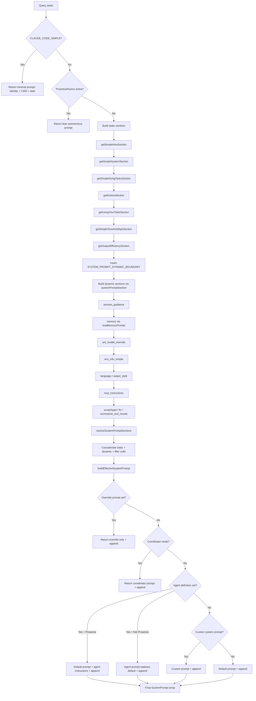
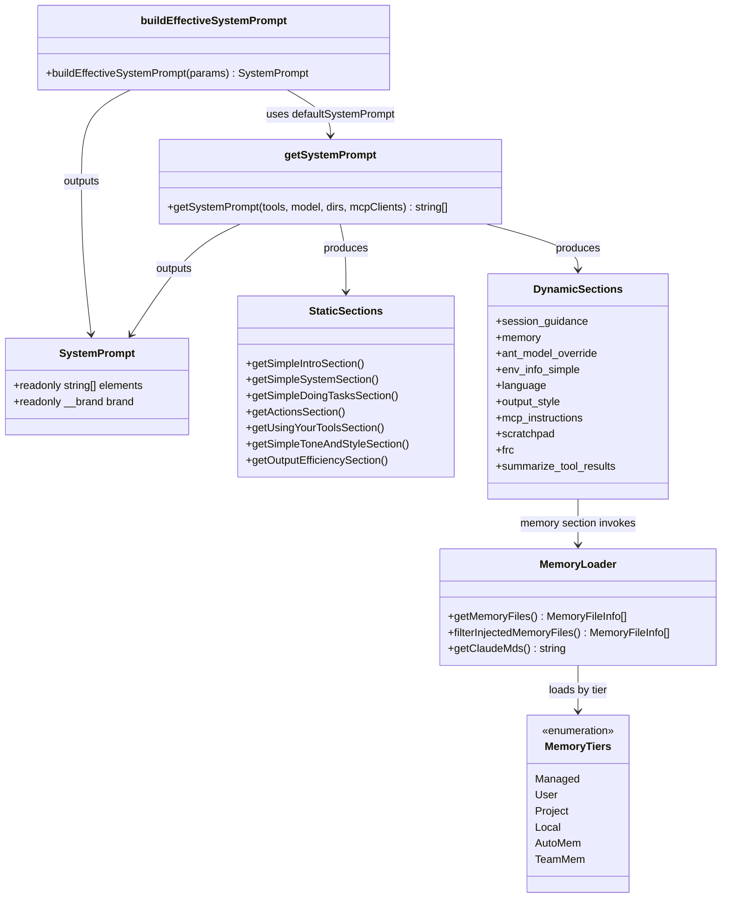

# System Prompts and Prompt Assembly

## Overview

Every query cc sends to the model begins with a system prompt, but that prompt is never a static blob. It is a dynamically assembled array of strings, each produced by a section generator whose output depends on the current session's tools, model, memory files, MCP connections, feature flags, and execution mode. The core assembly function, `getSystemPrompt` in `src/constants/prompts.ts:L444`, orchestrates this process: it produces a `string[]` where each element is a semantically distinct layer, and downstream code in `src/utils/systemPrompt.ts` selects among default, custom, agent, coordinator, or override prompts before emitting the final array to the API. This chapter traces the full lifecycle from the individual section generators through the caching boundary, the memory file loader, and the effective-prompt builder, showing how cc composes the right instruction cocktail for every query.

The prompt assembly system has a direct parallel in the HER's Pattern 2 (Scoped Context Assembly), which describes loading instructions at multiple granularities -- org, user, project, and directory. cc implements this pattern with specific engineering choices around cache-aware section splitting, a branded type system for the prompt array, and a two-phase architecture where section generation and prompt selection are separated. The ETH Zurich AGENTS.md study (arXiv:2602.11988) found that verbose context files tend to reduce task success rates while increasing inference cost by over 20%, a finding that shapes many of cc's design decisions around context volume control.

Understanding prompt assembly is essential for anyone building a harness because the system prompt is the single most expensive token investment per query. In a typical cc session, the system prompt alone can consume 10,000-20,000 tokens before any user message or tool result is added. Every design decision in the assembly pipeline -- from the order of sections to the placement of the cache boundary to the filtering of memory tiers -- directly affects both cost per query and the quality of model outputs. A poorly assembled prompt wastes tokens on irrelevant instructions, degrades model performance through attention dilution, and increases latency by missing prompt cache hits.

## Data structures and contracts

### System prompt as a branded array

The system prompt is not a free-form string but a branded readonly array, defined in `src/utils/systemPromptType.ts`:

```typescript
// src/utils/systemPromptType.ts:L1-L14 — branded SystemPrompt type
/**
 * Branded type for system prompt arrays.
 *
 * This module is intentionally dependency-free so it can be imported
 * from anywhere without risking circular initialization issues.
 */

export type SystemPrompt = readonly string[] & {
  readonly __brand: 'SystemPrompt'
}

export function asSystemPrompt(value: readonly string[]): SystemPrompt {
  return value as SystemPrompt
}
```

The `asSystemPrompt` function wraps a plain `readonly string[]` into the branded type. Each string element represents one logical section (intro, system rules, tool guidance, memory, environment info, etc.). The branding prevents accidental assignment of unvalidated string arrays to API-calling code that expects a fully assembled prompt. The `readonly` modifier on the array itself prevents mutation after construction, which is important because the prompt is shared across the session and mutation would break the cache boundary assumptions. The module is deliberately dependency-free, as the comment explains, because it must be importable from anywhere in the codebase without risking circular initialization -- a real concern given that `systemPrompt.ts` imports from `Tool.ts` which indirectly depends on prompt generation.

### SystemPromptSection and the caching boundary

Dynamic sections are represented as `SystemPromptSection` objects, defined in `src/constants/systemPromptSections.ts`:

```typescript
// src/constants/systemPromptSections.ts:L8-L14 — SystemPromptSection type
type SystemPromptSection = {
  name: string
  compute: ComputeFn
  cacheBreak: boolean
}
```

The `name` field identifies the section for memoization. The `compute` function is an async thunk (`() => string | null | Promise<string | null>`) that returns the section's string content or `null` to omit the section entirely. The `cacheBreak` boolean marks sections that must recompute every turn because their output can change between API calls. Sections with `cacheBreak: false` are computed once and cached until `/clear` or `/compact` resets the cache via `clearSystemPromptSections` at `src/constants/systemPromptSections.ts:L65-L68`, which also resets beta header latches so that a fresh conversation gets fresh evaluation of feature-gated headers.

The caching infrastructure lives in `src/bootstrap/state.ts`, which provides `getSystemPromptSectionCache` and `setSystemPromptSectionCacheEntry`. The cache is a simple `Map<string, string | null>` keyed by section name. This means that once a section is computed, its value persists for the entire session (or until explicit invalidation), which is critical for prompt cache hit rates: recomputing a section that has not changed would produce identical content but could shift the cache boundary, forcing the API to re-read the prompt prefix. Caching `null` results is also important -- it prevents the system from repeatedly computing sections like `ant_model_override` (which returns `null` for non-ant users) or `language` (which returns `null` when no language preference is set) on every turn.

### MemoryFileInfo and the memory file hierarchy

Memory files loaded from CLAUDE.md and related sources are represented as `MemoryFileInfo` objects, defined in `src/utils/claudemd.ts`:

```typescript
// src/utils/claudemd.ts:L229-L243 — MemoryFileInfo type
export type MemoryFileInfo = {
  path: string
  type: MemoryType
  content: string
  parent?: string // Path of the file that included this one
  globs?: string[] // Glob patterns for file paths this rule applies to
  // True when auto-injection transformed `content` (stripped HTML comments,
  // stripped frontmatter, truncated MEMORY.md) such that it no longer matches
  // the bytes on disk. When set, `rawContent` holds the unmodified disk bytes
  // so callers can cache a `isPartialView` readFileState entry — presence in
  // cache provides dedup + change detection, but Edit/Write still require an
  // explicit Read before proceeding.
  contentDiffersFromDisk?: boolean
  rawContent?: string
}
```

The `type` field comes from `MemoryType` (`src/utils/memory/types.ts:L12`), which enumerates the tiers: `User`, `Project`, `Local`, `Managed`, `AutoMem`, and optionally `TeamMem`. The `globs` field enables conditional rules -- `.claude/rules/*.md` files with a `paths:` frontmatter key are only included when the current working file matches a glob pattern. This implements directory-scoped instructions without requiring separate CLAUDE.md files per directory. The `parent` field tracks `@include` directive chains, and circular references are prevented by a `processedPaths` set (`src/utils/claudemd.ts:L629`). The `contentDiffersFromDisk` field is set when the content has been transformed (HTML comments stripped, frontmatter removed, entrypoint truncated) and signals to the file state cache that the cached content is a partial view -- subsequent Edit/Write operations must still read the actual file from disk before proceeding.

### MemoryType enumeration

```typescript
// src/utils/memory/types.ts:L1-L12 — MemoryType definition
import { feature } from 'bun:bundle'

export const MEMORY_TYPE_VALUES = [
  'User',
  'Project',
  'Local',
  'Managed',
  'AutoMem',
  ...(feature('TEAMMEM') ? (['TeamMem'] as const) : []),
] as const

export type MemoryType = (typeof MEMORY_TYPE_VALUES)[number]
```

These tiers directly implement the Scoped Context Assembly pattern from HER section 5: Managed is org-level, User is user-level, Project and Local are project-level with directory scoping, and AutoMem/TeamMem provide persistent cross-session memory. The `feature('TEAMMEM')` conditional inclusion means that external builds of cc that do not enable the feature flag will not have `TeamMem` in the type, and the bundler's dead code elimination will strip all code paths that reference it. The ordering of the type values reflects the loading priority: Managed is loaded first (lowest model attention), followed by User, Project, Local, and finally AutoMem. Files loaded later in the prompt receive more model attention, so the ordering is semantically significant even though the `MemoryType` type itself does not encode priority -- the priority is enforced by the loading order in `getMemoryFiles`.

### ContextData: the token accounting model

The `analyzeContext.ts` module defines the `ContextData` interface at `src/utils/analyzeContext.ts:L190-L232` that captures the full token breakdown for a session. This data structure is what powers the context grid visualization in the UI and drives the autocompact threshold calculation:

```typescript
// src/utils/analyzeContext.ts:L190-L232 — ContextData interface (excerpt)
export interface ContextData {
  readonly categories: ContextCategory[]
  readonly totalTokens: number
  readonly maxTokens: number
  readonly rawMaxTokens: number
  readonly percentage: number
  readonly gridRows: GridSquare[][]
  readonly model: string
  readonly memoryFiles: MemoryFile[]
  readonly mcpTools: McpTool[]
  readonly deferredBuiltinTools?: DeferredBuiltinTool[]
  readonly systemTools?: SystemToolDetail[]
  readonly systemPromptSections?: SystemPromptSectionDetail[]
  readonly agents: Agent[]
  readonly slashCommands?: SlashCommandInfo
  readonly skills?: SkillInfo
  readonly autoCompactThreshold?: number
  readonly isAutoCompactEnabled: boolean
  // ...
}
```

Each `ContextCategory` entry has a `name`, `tokens` count, `color` for the UI, and an `isDeferred` flag. Deferred categories (MCP tools and deferred built-in tools when ToolSearch is enabled) do not count toward the actual context usage -- they represent tools that exist in the session but have not been loaded into the model's tool list. This distinction is critical for accurate autocompact triggering: counting deferred tokens toward the threshold would cause premature compaction.

## Control flow

### The prompt assembly pipeline

The prompt assembly process has two major phases: section generation inside `getSystemPrompt`, and prompt selection inside `buildEffectiveSystemPrompt`. The following flowchart shows the full pipeline from query start to final `SystemPrompt` array:



### getSystemPrompt: section generation

The `getSystemPrompt` function at `src/constants/prompts.ts:L444` is the primary entry point. It accepts the current tool set, model identifier, optional additional working directories, and optional MCP client connections. It has three code paths:

1. **Simple mode** (line 450): When `CLAUDE_CODE_SIMPLE` is set, it returns a two-line prompt containing only identity, CWD, and date. This mode strips all tool guidance, memory files, and behavioral instructions, producing a minimal prompt for constrained environments.

2. **Proactive/Kairos mode** (line 466): When the proactive feature is active, it returns a lean autonomous-agent prompt with memory, environment, and proactive sections but without the full static prompt stack. The proactive prompt at `src/constants/prompts.ts:L860-L913` covers autonomous identity, pacing via the Sleep tool, first-wake behavior, and a bias-toward-action philosophy. This prompt is deliberately shorter than the standard mode, consistent with the ETH Zurich finding that less instruction can yield better outcomes.

3. **Standard mode** (line 491): The main path assembles static sections followed by a cache boundary marker, then dynamic sections resolved through the section registry.

The static sections are deterministic given the same tool set and output style configuration. They cover identity (`getSimpleIntroSection` at line 175), system rules (`getSimpleSystemSection` at line 186), task guidance (`getSimpleDoingTasksSection` at line 199), action caution (`getActionsSection` at line 255), tool usage rules (`getUsingYourToolsSection` at line 269), tone/style (`getSimpleToneAndStyleSection` at line 430), and output efficiency (`getOutputEfficiencySection` at line 402). These sections are computed as plain strings and placed before the boundary marker, making them eligible for cross-organization prompt caching.

The `SYSTEM_PROMPT_DYNAMIC_BOUNDARY` marker at `src/constants/prompts.ts:L114-L115` separates static from dynamic content:

```typescript
// src/constants/prompts.ts:L105-L115 — dynamic boundary marker
/**
 * Boundary marker separating static (cross-org cacheable) content from dynamic content.
 * Everything BEFORE this marker in the system prompt array can use scope: 'global'.
 * Everything AFTER contains user/session-specific content and should not be cached.
 *
 * WARNING: Do not remove or reorder this marker without updating cache logic in:
 * - src/utils/api.ts (splitSysPromptPrefix)
 * - src/services/api/claude.ts (buildSystemPromptBlocks)
 */
export const SYSTEM_PROMPT_DYNAMIC_BOUNDARY =
  '__SYSTEM_PROMPT_DYNAMIC_BOUNDARY__'
```

Everything before the boundary is eligible for cross-organization prompt caching (scope: `global`). Everything after contains session-specific content and must not be cached globally. The `shouldUseGlobalCacheScope()` function gates whether the boundary marker is even inserted. Downstream code in `src/utils/api.ts` and `src/services/api/claude.ts` splits the prompt array at this marker to determine which blocks can use the global cache scope.

### Dynamic section resolution

The dynamic sections array at `src/constants/prompts.ts:L491-L555` lists every dynamic section with its computation function. Here is the full registration:

```typescript
// src/constants/prompts.ts:L491-L555 — dynamic section registration
  const dynamicSections = [
    systemPromptSection('session_guidance', () =>
      getSessionSpecificGuidanceSection(enabledTools, skillToolCommands),
    ),
    systemPromptSection('memory', () => loadMemoryPrompt()),
    systemPromptSection('ant_model_override', () =>
      getAntModelOverrideSection(),
    ),
    systemPromptSection('env_info_simple', () =>
      computeSimpleEnvInfo(model, additionalWorkingDirectories),
    ),
    systemPromptSection('language', () =>
      getLanguageSection(settings.language),
    ),
    systemPromptSection('output_style', () =>
      getOutputStyleSection(outputStyleConfig),
    ),
    // When delta enabled, instructions are announced via persisted
    // mcp_instructions_delta attachments (attachments.ts) instead of this
    // per-turn recompute, which busts the prompt cache on late MCP connect.
    // Gate check inside compute (not selecting between section variants)
    // so a mid-session gate flip doesn't read a stale cached value.
    DANGEROUS_uncachedSystemPromptSection(
      'mcp_instructions',
      () =>
        isMcpInstructionsDeltaEnabled()
          ? null
          : getMcpInstructionsSection(mcpClients),
      'MCP servers connect/disconnect between turns',
    ),
    systemPromptSection('scratchpad', () => getScratchpadInstructions()),
    systemPromptSection('frc', () => getFunctionResultClearingSection(model)),
    systemPromptSection(
      'summarize_tool_results',
      () => SUMMARIZE_TOOL_RESULTS_SECTION,
    ),
    // ...
  ]
```

Note the design choice for the `mcp_instructions` section: the `isMcpInstructionsDeltaEnabled()` check is inside the `compute` function, not outside the section registration. This is deliberate -- the comment at line 511 explains that placing the check inside the compute function means a mid-session feature flag flip does not read a stale cached value. If the check were outside (selecting between two different section objects), a cache hit from a previous turn would return the old variant even after the flag changed.

The `resolveSystemPromptSections` function at `src/constants/systemPromptSections.ts:L43-L58` processes these registrations:

```typescript
// src/constants/systemPromptSections.ts:L43-L58 — section resolution
export async function resolveSystemPromptSections(
  sections: SystemPromptSection[],
): Promise<(string | null)[]> {
  const cache = getSystemPromptSectionCache()

  return Promise.all(
    sections.map(async s => {
      if (!s.cacheBreak && cache.has(s.name)) {
        return cache.get(s.name) ?? null
      }
      const value = await s.compute()
      setSystemPromptSectionCacheEntry(s.name, value)
      return value
    }),
  )
}
```

The function checks the cache for non-`cacheBreak` entries and returns the cached value on hit. For `cacheBreak: true` sections (like `mcp_instructions`), it always recomputes. For cached sections, `setSystemPromptSectionCacheEntry` stores the computed value even for `null` results, preventing re-computation on subsequent turns when the section legitimately has no content (e.g., no output style configured, no language preference set). The `Promise.all` means all section computations run in parallel, which matters because some sections (like `env_info_simple`) perform async I/O to determine git status and system info.

After resolution, the final prompt array is assembled at `src/constants/prompts.ts:L560-L576` by concatenating the static sections, the optional boundary marker, and the resolved dynamic sections, then filtering out `null` values. The `filter(s => s !== null)` call at line 576 is the last step before the array is returned, ensuring that sections which returned `null` (like `ant_model_override` for non-ant users, or `language` when no preference is set) are omitted from the prompt rather than appearing as empty strings.

### buildEffectiveSystemPrompt: priority resolution

Once `getSystemPrompt` produces the default prompt array, `buildEffectiveSystemPrompt` at `src/utils/systemPrompt.ts:L41-L123` applies the priority chain. This function is the single point where the prompt hierarchy is resolved, and it is called from multiple sites: the main REPL loop (`src/screens/REPL.tsx`), the Agent tool (`src/tools/AgentTool/AgentTool.tsx`), the compact command (`src/commands/compact/compact.ts`), and the context analyzer (`src/utils/analyzeContext.ts:L939`).

```typescript
// src/utils/systemPrompt.ts:L41-L123 — effective prompt builder
export function buildEffectiveSystemPrompt({
  mainThreadAgentDefinition,
  toolUseContext,
  customSystemPrompt,
  defaultSystemPrompt,
  appendSystemPrompt,
  overrideSystemPrompt,
}: {
  mainThreadAgentDefinition: AgentDefinition | undefined
  toolUseContext: Pick<ToolUseContext, 'options'>
  customSystemPrompt: string | undefined
  defaultSystemPrompt: string[]
  appendSystemPrompt: string | undefined
  overrideSystemPrompt?: string | null
}): SystemPrompt {
  if (overrideSystemPrompt) {
    return asSystemPrompt([overrideSystemPrompt])
  }
  // Coordinator mode: use coordinator prompt instead of default
  if (
    feature('COORDINATOR_MODE') &&
    isEnvTruthy(process.env.CLAUDE_CODE_COORDINATOR_MODE) &&
    !mainThreadAgentDefinition
  ) {
    const { getCoordinatorSystemPrompt } =
      require('../coordinator/coordinatorMode.js')
    return asSystemPrompt([
      getCoordinatorSystemPrompt(),
      ...(appendSystemPrompt ? [appendSystemPrompt] : []),
    ])
  }

  const agentSystemPrompt = mainThreadAgentDefinition
    ? isBuiltInAgent(mainThreadAgentDefinition)
      ? mainThreadAgentDefinition.getSystemPrompt({
          toolUseContext: { options: toolUseContext.options },
        })
      : mainThreadAgentDefinition.getSystemPrompt()
    : undefined

  // In proactive mode, agent instructions are appended to the default prompt
  if (
    agentSystemPrompt &&
    (feature('PROACTIVE') || feature('KAIROS')) &&
    isProactiveActive_SAFE_TO_CALL_ANYWHERE()
  ) {
    return asSystemPrompt([
      ...defaultSystemPrompt,
      `\n# Custom Agent Instructions\n${agentSystemPrompt}`,
      ...(appendSystemPrompt ? [appendSystemPrompt] : []),
    ])
  }

  return asSystemPrompt([
    ...(agentSystemPrompt
      ? [agentSystemPrompt]
      : customSystemPrompt
        ? [customSystemPrompt]
        : defaultSystemPrompt),
    ...(appendSystemPrompt ? [appendSystemPrompt] : []),
  ])
}
```

The priority chain is: (0) override prompt replaces everything; (1) coordinator mode uses the coordinator prompt; (2) agent prompt either appends to default (proactive mode) or replaces default; (3) custom `--system-prompt` flag replaces default; (4) default system prompt from `getSystemPrompt`. The `appendSystemPrompt` string is always appended except when an override is set, and it is always a single string, not an array.

A notable design choice appears in the proactive-agent path at line 103. When both an agent definition and proactive mode are active, the agent's system prompt is *appended* to the default prompt rather than replacing it. The comment at line 99 explains: "The proactive default prompt is already lean (autonomous agent identity + memory + env + proactive section), and agents add domain-specific behavior on top -- same pattern as teammates do." This means that in proactive mode, the model retains the base behavioral instructions (autonomous pacing, sleep tool usage, etc.) while gaining additional domain-specific guidance from the agent. In non-proactive mode, the agent prompt completely replaces the default, which is appropriate because agents are expected to be self-contained.

The `overrideSystemPrompt` parameter is used by the loop command (the `/loop` slash command) to completely replace the prompt with a user-specified string. This is the only case where `appendSystemPrompt` is also skipped, because the override is meant to be absolute.

The `enhanceSystemPromptWithEnvDetails` function at `src/constants/prompts.ts:L760` serves a different role: it takes an existing system prompt (typically the `DEFAULT_AGENT_PROMPT` at line 758 used by subagents) and appends environment info, agent-specific notes, and optional skill discovery guidance. This function is called by the Agent tool when constructing prompts for subagents, which do not go through `getSystemPrompt` directly. The notes appended at lines 766-770 remind subagents to use absolute paths, share relevant file paths in their response, avoid emojis, and not use colons before tool calls -- conventions that differ slightly from the main session because subagent output is relayed through the parent rather than displayed directly to the user.

### Memory file loading: the scoped context assembly

The `getMemoryFiles` function at `src/utils/claudemd.ts:L790` implements the four-tier Scoped Context Assembly pattern described in HER section 5. It is a memoized function (via `lodash-es/memoize`) that loads memory files in a specific order implementing reverse priority -- files loaded later receive more model attention:

1. **Managed** (`/etc/claude-code/CLAUDE.md` and managed `.claude/rules/*.md`): Organization-wide policy, loaded first (lines 804-823), lowest priority for the model but highest organizational authority. Also loads managed conditional rules.

2. **User** (`~/.claude/CLAUDE.md` and user `~/.claude/rules/*.md`): Developer-specific global preferences, loaded second (lines 826-847), gated on `isSettingSourceEnabled('userSettings')`. User memory can always include external files (the `true` parameter at line 834).

3. **Project** (`CLAUDE.md`, `.claude/CLAUDE.md`, `.claude/rules/*.md`): Project-level conventions, discovered by traversing from root to CWD (lines 849-934) so that files closer to the working directory are loaded later and thus have higher priority. Gated on `isSettingSourceEnabled('projectSettings')`.

4. **Local** (`CLAUDE.local.md`): Private project-specific instructions, also loaded in directory order from root to CWD. Gated on `isSettingSourceEnabled('localSettings')`.

The traversal logic at `src/utils/claudemd.ts:L850-L933` walks from `originalCwd` upward to the filesystem root collecting directories, then reverses to process from root downward to CWD. This means a `CLAUDE.md` in the project root is loaded before one in a subdirectory, giving the subdirectory's instructions higher model attention. The `@include` directive system (lines 618-685) allows memory files to reference other files, resolved via `extractIncludePathsFromTokens` with a maximum depth of 5 (`MAX_INCLUDE_DEPTH`, line 537) to prevent infinite recursion. Circular references are detected via the `processedPaths` set that is threaded through every `processMemoryFile` call.

After the directory traversal, `getMemoryFiles` loads two more optional tiers: AutoMem (the `MEMORY.md` entrypoint from the memdir system, gated on `isAutoMemoryEnabled()` at line 980) and TeamMem (gated on both `feature('TEAMMEM')` and `teamMemPaths.isTeamMemoryEnabled()` at line 995). These tiers represent persistent cross-session and cross-organization memory that survives conversation boundaries.

The `filterInjectedMemoryFiles` function at `src/utils/claudemd.ts:L1142-L1151` removes AutoMem and TeamMem entries from the system prompt when the `tengu_moth_copse` feature flag is on:

```typescript
// src/utils/claudemd.ts:L1142-L1151 — filter for attachment-pipeline memories
export function filterInjectedMemoryFiles(
  files: MemoryFileInfo[],
): MemoryFileInfo[] {
  const skipMemoryIndex = getFeatureValue_CACHED_MAY_BE_STALE(
    'tengu_moth_copse',
    false,
  )
  if (!skipMemoryIndex) return files
  return files.filter(f => f.type !== 'AutoMem' && f.type !== 'TeamMem')
}
```

When this flag is active, AutoMem and TeamMem memories are instead delivered via the attachment pipeline (the `findRelevantMemories` prefetch), which means the model sees them only when the current task makes them relevant. This is a direct response to the ETH Zurich finding that injecting all available context every turn increases cost without improving outcomes.

The final rendering of memory files into a prompt string happens in `getClaudeMds` at `src/utils/claudemd.ts:L1153-L1195`. This function concatenates all memory file contents with descriptive annotations (e.g., "project instructions, checked into the codebase" or "user's private project instructions, not checked in") and prefixes the whole block with `MEMORY_INSTRUCTION_PROMPT` (line 89-90), the directive that tells the model these instructions override default behavior.

### The context window and token accounting

The `analyzeContextUsage` function at `src/utils/analyzeContext.ts:L918` computes a detailed token breakdown of the assembled context. It first calls `getSystemPrompt` to build the default prompt, then `buildEffectiveSystemPrompt` to resolve the effective prompt, and finally counts tokens for each category in parallel:

```typescript
// src/utils/analyzeContext.ts:L939-L947 — building the effective prompt for analysis
  const effectiveSystemPrompt = buildEffectiveSystemPrompt({
    mainThreadAgentDefinition,
    toolUseContext: toolUseContext ?? {
      options: {} as ToolUseContext['options'],
    },
    customSystemPrompt: toolUseContext?.options.customSystemPrompt,
    defaultSystemPrompt,
    appendSystemPrompt: toolUseContext?.options.appendSystemPrompt,
  })
```

The parallel token counting at lines 950-983 covers system prompt sections, memory files, built-in tools, MCP tools, custom agents, slash commands, and messages. The function distinguishes between always-loaded and deferred tools: when ToolSearch is enabled, deferred tools are counted separately and excluded from the actual context usage calculation (the `isDeferred` flag on `ContextCategory` at line 116 prevents them from counting toward the usage total). This reflects that deferred tools occupy no context space until the model discovers them via the ToolSearch tool.

The `ContextCategory` array produced by `analyzeContextUsage` includes sections for System prompt, System tools, MCP tools, MCP tools (deferred), System tools (deferred), Custom agents, Memory files, Skills, Messages, and Free space. Autocompact threshold is computed from the effective context window size minus a buffer (`AUTOCOMPACT_BUFFER_TOKENS`), and the grid visualization fills squares proportionally to each category's token count.

The `TOOL_TOKEN_COUNT_OVERHEAD` constant at `src/utils/analyzeContext.ts:L75` is set to 500 and represents the fixed token overhead added by the API when tools are present. When counting tool tokens individually for the per-tool breakdown, each API call includes this overhead, leading to N times overhead instead of 1 time overhead for N tools. The constant is subtracted from per-tool counts to show accurate tool content sizes and from the bulk count when distributing tokens across individual tools in the `systemToolDetails` breakdown (lines 414-434).

### Prompt fragment sources

The following class diagram shows the relationships between the major data sources that contribute fragments to the final system prompt:



## Edge cases and failure modes

**MCP server mid-session connect**: When an MCP server connects after the first API call, its instructions would normally bust the prompt cache because the `mcp_instructions` section uses `DANGEROUS_uncachedSystemPromptSection`. The `isMcpInstructionsDeltaEnabled()` check at `src/constants/prompts.ts:L513-L520` redirects MCP instructions to delta attachments instead, preserving the cache prefix. A harness builder who does not implement this redirection will suffer repeated cache misses whenever MCP servers reconnect, because the dynamic boundary ensures that MCP instruction changes invalidate the entire cache suffix from the boundary onward.

**Worktree duplicate loading**: When cc runs inside a git worktree nested within its main repository, the upward directory walk from CWD passes through both the worktree root and the main repo root. Both contain checked-in files like `CLAUDE.md`, causing duplicate loading. The `isNestedWorktree` guard at `src/utils/claudemd.ts:L870-L876` skips Project-type files from directories above the worktree but within the main repo, while still loading `CLAUDE.local.md` (which is gitignored and only exists in the main repo). Without this guard, every checked-in instruction file would appear twice in the prompt, doubling the token cost and potentially confusing the model with contradictory guidance from two copies of the same file.

**Memory file exclusion via claudeMdExcludes**: The `isClaudeMdExcluded` function at `src/utils/claudemd.ts:L547` applies user-configured glob patterns to skip specific memory files. This handles cases where a project has a CLAUDE.md that is irrelevant or harmful to a particular workflow. The exclusion only applies to User, Project, and Local types -- Managed, AutoMem, and TeamMem files are never excluded because they represent organization policy or persistent memory that should always be present. The exclusion also resolves symlinks via `realpathSync` (line 600) to handle platform differences like macOS `/tmp` -> `/private/tmp`, where the user's exclude pattern references one path but the filesystem resolves to another.

**Omitting verbose context improves outcomes**: The ETH Zurich study (arXiv:2602.11988) found that context files tend to reduce task success rates compared to providing no repository context at all, while increasing inference cost by over 20%. This applies to both LLM-generated and developer-committed context files. The paper recommends describing only "minimal requirements" -- verbose instructions and detailed directory trees hurt rather than help. The cc codebase implements several mitigations: the `MAX_MEMORY_CHARACTER_COUNT` of 40,000 characters at `src/utils/claudemd.ts:L92`, the `truncateEntrypointContent` function for AutoMem/TeamMem entrypoints, the conditional `globs` filtering for `.claude/rules/*.md` files, and the `tengu_moth_copse` feature flag that removes AutoMem/TeamMem from the system prompt entirely and delivers them through the attachment pipeline where the model sees them only when relevant. The `tengu_paper_halyard` flag in `getClaudeMds` at `src/utils/claudemd.ts:L1158-L1165` takes this further by optionally skipping all Project and Local memory files, which is the most aggressive mitigation -- removing all project-level context in favor of letting the model discover conventions by reading the codebase directly.

**Cache boundary misplacement**: The `SYSTEM_PROMPT_DYNAMIC_BOUNDARY` marker at `src/constants/prompts.ts:L114-L115` carries a WARNING comment: "Do not remove or reorder this marker without updating cache logic in `src/utils/api.ts` and `src/services/api/claude.ts`." If a dynamic section (one that varies per session, like `session_guidance`) were placed before the boundary, it would fragment the static prefix into 2^N cache variants, one for each combination of dynamic values. The `getSessionSpecificGuidanceSection` function at `src/constants/prompts.ts:L352` documents this explicitly: "Each conditional here is a runtime bit that would otherwise multiply the Blake2b prefix hash variants." The comment uses the term "Blake2b" because the Anthropic API computes cache keys from the prompt content, and different content produces different hash prefixes. Placing runtime-variant sections before the boundary would cause the API to treat each variant as a separate cache entry, defeating the purpose of the global cache scope.

**HTML comment stripping and CRLF round-tripping**: The `stripHtmlComments` function at `src/utils/claudemd.ts:L292-L301` strips block-level HTML comments from memory files to allow developers to leave authorial notes that are invisible to the model. However, the marked lexer normalizes `\r\n` during the lex pass, so round-tripping a CRLF file through `token.raw` would spuriously flip line endings. The code at line 371 only rebuilds via tokens when a comment actually needs stripping, avoiding this issue for files without comments. When stripping does occur, `contentDiffersFromDisk` is set to `true` so that the file state cache knows the content is a partial view.

**Frontmatter paths and conditional rules**: The `parseFrontmatterPaths` function at `src/utils/claudemd.ts:L254-L279` extracts `paths:` frontmatter from memory files and converts them into glob patterns for conditional rule matching. A `.claude/rules/python.md` file with `paths: ["src/python/**"]` in its frontmatter will only be included in the prompt when the current working file matches that glob pattern. The `/**` suffix is stripped from patterns (line 268) because the `ignore` library treats a path as matching both the path itself and everything inside it. If all patterns resolve to `**` (match-all), the `globs` field is set to `undefined` rather than an array, treating the file as unconditionally applicable. The conditional rule matching is split into two passes in `processMdRules` (line 697): one for unconditional rules and one for conditional rules, with the `conditionalRule` parameter selecting which pass is active.

**Memory file setting source gating**: Each memory tier is gated on a corresponding `isSettingSourceEnabled` check. At `src/utils/claudemd.ts:L826`, User memory requires `isSettingSourceEnabled('userSettings')`. At line 887, Project memory requires `isSettingSourceEnabled('projectSettings')`. At line 923, Local memory requires `isSettingSourceEnabled('localSettings')`. The SDK, which runs cc programmatically, defaults `settingSources` to an empty array, which disables all tiers except Managed. This means that SDK sessions receive only organization policy instructions and no user or project-level memory, preventing accidental leakage of developer-specific instructions into automated workflows.

## Where cc diverges from the published pattern

The HER describes Scoped Context Assembly as loading instructions at org, user, project, and directory granularities. cc implements this faithfully but adds three extensions not present in the published pattern.

First, cc loads files in **reverse order of priority** so that later-loaded files receive more model attention, as documented in the comment block at `src/utils/claudemd.ts:L1-L9`. This is an inversion of the typical "first-seen wins" override semantics found in configuration systems like VS Code's settings hierarchy. In cc, a `CLAUDE.md` in a subdirectory does not *override* the root's `CLAUDE.md`; both are present in the prompt, but the subdirectory's content appears later and thus receives higher attention weight from the model. This design choice acknowledges that language models attend more strongly to later tokens in the prompt, and that closer-to-CWD instructions are more likely to be relevant to the current task.

Second, cc implements a **feature-gated delta attachment system** for MCP instructions rather than always injecting them into the system prompt. The `isMcpInstructionsDeltaEnabled()` check at `src/constants/prompts.ts:L481` and `L513` swaps the delivery mechanism based on a runtime flag. When enabled, MCP server instructions are appended as persisted attachments per-turn rather than embedded in the system prompt array, which avoids cache breaks when servers connect mid-session. This is not described in the HER's Scoped Context Assembly pattern but directly addresses the ETH Zurich finding that verbose context increases cost without improving outcomes. The attachment pipeline also enables per-turn relevance filtering, so the model sees only the MCP server instructions that are relevant to the current tool set rather than instructions from all connected servers.

Third, the `@include` directive system at `src/utils/claudemd.ts:L19-L26` goes beyond the typical persistent instruction file pattern by allowing memory files to compose from other files. The syntax supports `@path`, `@./relative/path`, `@~/home/path`, and `@/absolute/path` references. The `MAX_INCLUDE_DEPTH` of 5 prevents runaway recursion, and the `processedPaths` set in `processMemoryFile` (line 629) prevents circular references. The include paths are extracted from markdown tokens (not raw text) so that `@path` references inside code blocks and HTML comments are correctly ignored (`src/utils/claudemd.ts:L451-L535`). This is a form of prompt composition that allows teams to share instruction modules across projects without copying content, but it also introduces a risk: a deeply nested include chain could load a large volume of content that the model does not need, which is why the `MAX_INCLUDE_DEPTH` limit exists and why the `MAX_MEMORY_CHARACTER_COUNT` truncation applies at the individual file level.

## Developer takeaways for building a long-running agent

The prompt assembly architecture in cc teaches three principles for harness builders. First, treat the system prompt as an ordered array of semantically typed sections rather than a monolithic string, because this enables independent caching, conditional inclusion, and token accounting per section. The `systemPromptSection` / `DANGEROUS_uncachedSystemPromptSection` split is the mechanism that makes this work: default-cached sections preserve the prompt cache prefix across turns, while volatile sections are clearly marked and isolated. The cache boundary marker is not an implementation detail but a first-class architectural element -- its placement determines which content is globally cacheable and which must be re-evaluated per turn. Second, respect the ETH Zurich finding: more context is not better. Implement scoped loading that filters by tier and file path, truncate verbose entrypoints, and consider moving large reference material out of the system prompt entirely and into on-demand attachments. The `tengu_moth_copse` feature flag demonstrates this approach by removing AutoMem/TeamMem from the prompt and delivering them through the attachment pipeline, while the `globs` conditional rules system ensures that directory-specific instructions are only included when the current working file matches. Third, separate the concerns of prompt generation from prompt selection. The `getSystemPrompt` function builds a default prompt; `buildEffectiveSystemPrompt` applies a priority chain that can override, replace, or augment it. This separation means that new execution modes (coordinator, agent, proactive) can be added without modifying the section generators, and the caching boundary stays stable across mode changes.
