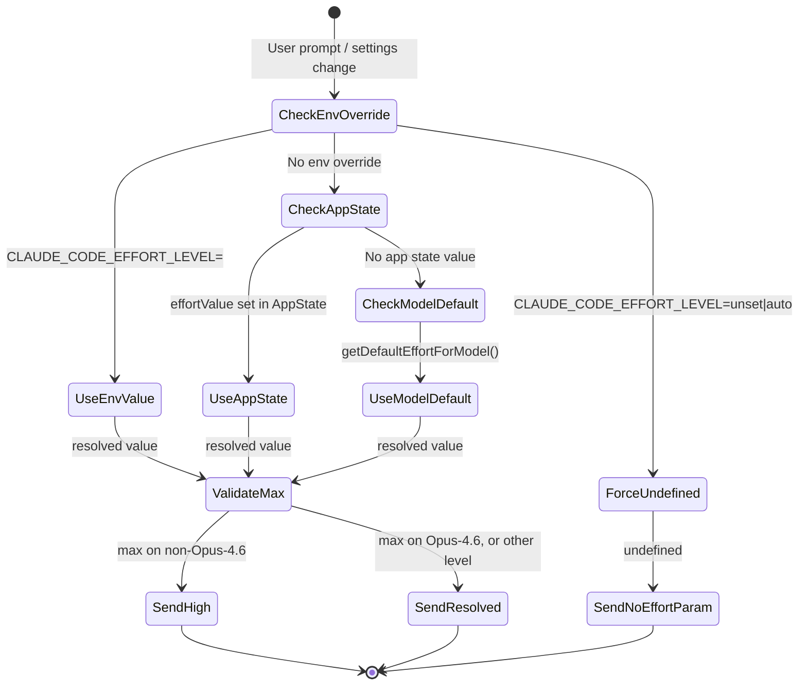
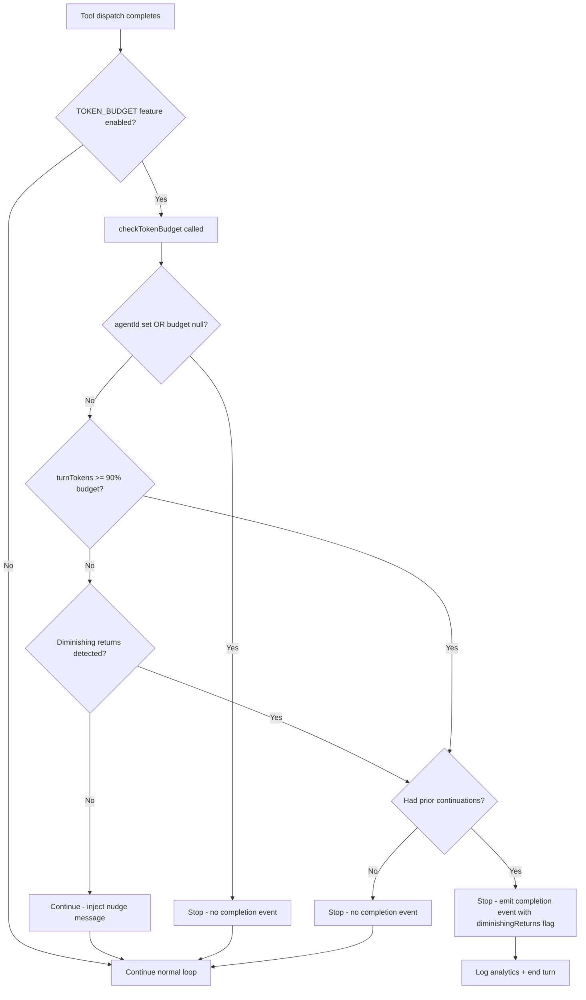

# Token Budgets, Effort, and Fast Mode

## Overview

A long-running agent that does not bound its own consumption will eventually burn through its context window, its user's budget, or both. cc addresses this with three interlocking mechanisms: a token budget tracker that decides whether the query loop should continue or stop, an effort system that controls how hard the model thinks on each request, and a fast mode that routes to a higher-throughput model tier with its own cooldown and org-level gating. Together they implement the back-pressure pattern identified in HER §13 — the mechanism that slows or stops the agent's loop when resource limits are approached, preventing unbounded resource consumption.

The token budget feature is the newest of the three. It detects when the model has consumed a user-specified number of output tokens (e.g., "+500k" in the prompt) and either injects a continuation nudge to keep the model working or terminates the turn when progress stalls. The budget is parsed from natural language in the user's prompt using a set of regular expressions in `src/utils/tokenBudget.ts`, supporting shorthand notation like "+1m", verbose forms like "use 2M tokens", and trailing forms like "+500k." at the end of a sentence. The parsed budget is then stored in the bootstrap state module and consulted on every loop iteration.

The effort system, by contrast, operates at the API-request level: it selects a `low`/`medium`/`high`/`max` effort string that tells the model how deeply to reason. The effort value flows through a precedence chain — environment variable, then app state, then model default — before being passed to the API as an `output_config.effort` parameter or, for internal users, as a numeric `effort_override` in the `anthropic_internal` body field.

Fast mode is the most complex operationally — it is a first-party-only, org-gated, model-gated feature that sends `speed: 'fast'` on Opus 4.6 requests and automatically falls back to normal speed on rate-limit cooldown. Its org-level status is prefetched at session start via a dedicated API endpoint and cached both in memory and on disk, with fallback behavior that varies by user type and network availability.

## Data structures and contracts

The budget tracker is a small mutable record that persists across loop iterations:

```typescript
// src/query/tokenBudget.ts:L6-L11 — BudgetTracker type definition
export type BudgetTracker = {
  continuationCount: number
  lastDeltaTokens: number
  lastGlobalTurnTokens: number
  startedAt: number
}
```

The four fields support the diminishing-returns detector: `continuationCount` tracks how many continuation nudges have been injected, `lastDeltaTokens` and `lastGlobalTurnTokens` capture the token delta between checks so the system can detect when the model is producing fewer and fewer tokens per iteration, and `startedAt` records when the tracker was created for duration telemetry `src/query/tokenBudget.ts:L6-L11`.

The decision type is a discriminated union — either the loop continues with a nudge message or it stops with an optional completion event:

```typescript
// src/query/tokenBudget.ts:L22-L43 — TokenBudgetDecision discriminated union
type ContinueDecision = {
  action: 'continue'
  nudgeMessage: string
  continuationCount: number
  pct: number
  turnTokens: number
  budget: number
}

type StopDecision = {
  action: 'stop'
  completionEvent: {
    continuationCount: number
    pct: number
    turnTokens: number
    budget: number
    diminishingReturns: boolean
    durationMs: number
  } | null
}

export type TokenBudgetDecision = ContinueDecision | StopDecision
```

The `StopDecision.completionEvent` is `null` when the budget check is skipped entirely (the agent is a subagent, or no budget was set). When present, it carries the full telemetry payload including the `diminishingReturns` flag and `durationMs` for analytics `src/query/tokenBudget.ts:L22-L43`.

The token budget itself is parsed from the user's prompt text. The parser in `src/utils/tokenBudget.ts` recognizes three patterns: a shorthand at the start of the message (`+500k`), a shorthand at the end (preceded by whitespace), and a verbose form (`use 2M tokens`). The multipliers map `k` to 1,000, `m` to 1,000,000, and `b` to 1,000,000,000 `src/utils/tokenBudget.ts:L1-L28`. Once parsed, the budget number is stored via `snapshotOutputTokensForTurn()` in the bootstrap state module, which also records `outputTokensAtTurnStart` — the cumulative output token count at the beginning of the turn — so that `getTurnOutputTokens()` can compute the turn-local output by subtracting `src/bootstrap/state.ts:L724-L736`.

Effort values are modeled as a union of string levels and numeric overrides:

```typescript
// src/utils/effort.ts:L13-L21 — EffortValue type and level constants
export const EFFORT_LEVELS = [
  'low',
  'medium',
  'high',
  'max',
] as const satisfies readonly EffortLevel[]

export type EffortValue = EffortLevel | number
```

The four named levels are the user-facing API. Numeric values are ant-only and represent a raw override that is later mapped to a named level via `convertEffortValueToLevel()` — values at or below 50 become `low`, 51–85 become `medium`, 86–100 become `high`, and above 100 becomes `max` `src/utils/effort.ts:L13-L21`.

Fast mode's runtime state is also a discriminated union:

```typescript
// src/utils/fastMode.ts:L183-L186 — FastModeRuntimeState type
export type FastModeRuntimeState =
  | { status: 'active' }
  | { status: 'cooldown'; resetAt: number; reason: CooldownReason }
```

When the API returns a 429 indicating fast-mode rate-limiting, `triggerFastModeCooldown()` transitions the state to `{ status: 'cooldown', resetAt, reason }`. Subsequent calls to `getFastModeRuntimeState()` check whether the reset timestamp has passed and automatically transition back to `active` `src/utils/fastMode.ts:L183-L186`.

The app state stores the user's fast-mode toggle and the resolved effort value as top-level fields:

```typescript
// src/state/AppStateStore.ts:L423-L428 — fastMode and effortValue in AppState
  // Fast mode
  fastMode?: boolean
  // Advisor model for server-side advisor tool (undefined = disabled).
  advisorModel?: string
  // Effort value
  effortValue?: EffortValue
```

These are read in the query loop and passed to the API client. `fastMode` is a user preference (toggle in UI or settings), while `effortValue` is resolved through a precedence chain: environment variable, then app state, then model default `src/state/AppStateStore.ts:L423-L428`.

## Control flow

### Token budget check in the query loop

The token budget check runs after every tool dispatch in the query loop. It is gated behind the `TOKEN_BUDGET` feature flag — if the flag is off, the tracker is `null` and the check is skipped entirely `src/query.ts:L280`. When enabled, the loop creates a fresh `BudgetTracker` at entry and calls `checkTokenBudget()` after each tool-use round:

```typescript
// src/query.ts:L1308-L1341 — Token budget check in queryLoop
      if (feature('TOKEN_BUDGET')) {
        const decision = checkTokenBudget(
          budgetTracker!,
          toolUseContext.agentId,
          getCurrentTurnTokenBudget(),
          getTurnOutputTokens(),
        )

        if (decision.action === 'continue') {
          incrementBudgetContinuationCount()
          logForDebugging(
            `Token budget continuation #${decision.continuationCount}: ${decision.pct}% (${decision.turnTokens.toLocaleString()} / ${decision.budget.toLocaleString()})`,
          )
          state = {
            messages: [
              ...messagesForQuery,
              ...assistantMessages,
              createUserMessage({
                content: decision.nudgeMessage,
                isMeta: true,
              }),
            ],
            toolUseContext,
            autoCompactTracking: tracking,
            maxOutputTokensRecoveryCount: 0,
            hasAttemptedReactiveCompact: false,
            maxOutputTokensOverride: undefined,
            pendingToolUseSummary: undefined,
            stopHookActive: undefined,
            turnCount,
            transition: { reason: 'token_budget_continuation' },
          }
          continue
        }
```

When the decision is `continue`, the loop re-enters with the original messages plus a synthetic user message containing the nudge text (e.g., "Stopped at 72% of token target (360,000 / 500,000). Keep working — do not summarize."). The `transition.reason` field is set to `'token_budget_continuation'` for test assertions `src/query.ts:L1308-L1341`.

When the decision is `stop` with a `completionEvent`, the loop logs a `tengu_token_budget_completed` analytics event carrying the full telemetry payload — `continuationCount`, `pct`, `turnTokens`, `budget`, `diminishingReturns`, and `durationMs` — along with the `queryChainId` and `queryDepth` for correlation `src/query.ts:L1343-L1354`. If the stop was caused by diminishing returns, a separate debug log calls out the early-stop condition.

### The checkTokenBudget decision function

The core decision logic is a three-branch conditional:

```typescript
// src/query/tokenBudget.ts:L45-L93 — checkTokenBudget function body
export function checkTokenBudget(
  tracker: BudgetTracker,
  agentId: string | undefined,
  budget: number | null,
  globalTurnTokens: number,
): TokenBudgetDecision {
  if (agentId || budget === null || budget <= 0) {
    return { action: 'stop', completionEvent: null }
  }

  const turnTokens = globalTurnTokens
  const pct = Math.round((turnTokens / budget) * 100)
  const deltaSinceLastCheck = globalTurnTokens - tracker.lastGlobalTurnTokens

  const isDiminishing =
    tracker.continuationCount >= 3 &&
    deltaSinceLastCheck < DIMINISHING_THRESHOLD &&
    tracker.lastDeltaTokens < DIMINISHING_THRESHOLD

  if (!isDiminishing && turnTokens < budget * COMPLETION_THRESHOLD) {
    tracker.continuationCount++
    tracker.lastDeltaTokens = deltaSinceLastCheck
    tracker.lastGlobalTurnTokens = globalTurnTokens
    return {
      action: 'continue',
      nudgeMessage: getBudgetContinuationMessage(pct, turnTokens, budget),
      continuationCount: tracker.continuationCount,
      pct,
      turnTokens,
      budget,
    }
  }

  if (isDiminishing || tracker.continuationCount > 0) {
    return {
      action: 'stop',
      completionEvent: {
        continuationCount: tracker.continuationCount,
        pct,
        turnTokens,
        budget,
        diminishingReturns: isDiminishing,
        durationMs: Date.now() - tracker.startedAt,
      },
    }
  }

  return { action: 'stop', completionEvent: null }
}
```

The first branch short-circuits when the agent is a subagent (`agentId` is set) or no budget was specified — subagents have their own context and should not inherit the parent's token budget. The second branch (continue) fires when the model has not yet hit 90% of the budget (`COMPLETION_THRESHOLD = 0.9`) and there are no signs of diminishing returns. The diminishing-returns detector requires three prior continuations AND two consecutive deltas below `DIMINISHING_THRESHOLD` (500 tokens) — this catches the case where the model is still technically producing output but the output has become trivially small. The third branch stops the loop when either diminishing returns are detected or at least one continuation has occurred, ensuring that a budget-gated turn always emits a completion event if it was ever continued `src/query/tokenBudget.ts:L45-L93`.

### Effort resolution chain

Effort is resolved through a precedence chain: environment variable override, then app-state value, then model default. The `resolveAppliedEffort()` function implements this:

```typescript
// src/utils/effort.ts:L152-L167 — resolveAppliedEffort precedence chain
export function resolveAppliedEffort(
  model: string,
  appStateEffortValue: EffortValue | undefined,
): EffortValue | undefined {
  const envOverride = getEffortEnvOverride()
  if (envOverride === null) {
    return undefined
  }
  const resolved =
    envOverride ?? appStateEffortValue ?? getDefaultEffortForModel(model)
  // API rejects 'max' on non-Opus-4.6 models — downgrade to 'high'.
  if (resolved === 'max' && !modelSupportsMaxEffort(model)) {
    return 'high'
  }
  return resolved
}
```

The environment variable `CLAUDE_CODE_EFFORT_LEVEL` can be set to a level name, the special values `'unset'` or `'auto'` (which force `null` — meaning "send no effort parameter"), or a numeric value. When `envOverride` is `null` (unset/auto), the function returns `undefined` and no effort parameter is sent to the API, letting the model use its default. The `'max'` level is restricted to Opus 4.6 — attempting to send `max` on a different model is downgraded to `high` before the request is made `src/utils/effort.ts:L152-L167`.

The resolved effort value reaches the API through `configureEffortParams()` in the API client. When the effort is a string level, it is written to `outputConfig.effort` and the effort beta header is appended. When it is a numeric value (ant-only), it is injected into the `anthropic_internal.effort_override` field instead `src/services/api/claude.ts:L440-L466`. This bifurcation exists because the public API only accepts named effort levels, while the internal API supports fine-grained numeric overrides that map to specific thinking budget configurations on the server side.

Model-level defaults vary. For Opus 4.6, Pro subscribers get `medium` by default; Max and Team subscribers also get `medium` when the `tengu_grey_step2` GrowthBook config is enabled. When the ultrathink feature is active and the model supports effort, the default is also `medium`, because ultrathink itself bumps the effective level to `high` — setting the base to `medium` prevents double-counting the thinking budget. All other models default to `undefined`, which the API interprets as `high` `src/utils/effort.ts:L279-L329`.

Persistence of effort settings is selective. The `toPersistableEffort()` function filters out numeric values (which are session-scoped) and the `'max'` level for non-ant users (which is also session-scoped) before writing to the user's settings.json `src/utils/effort.ts:L95-L105`. This prevents a session-ephemeral setting from leaking into a fresh session where the model or subscription tier may have changed.

### Fast mode activation and cooldown

Fast mode is the most heavily gated feature in cc. The `isFastMode` predicate in the API client requires five conditions to be true simultaneously: the feature must be enabled (not disabled by env var), the org must allow it, there must be no active cooldown, the model must be Opus 4.6, and the user must have toggled fast mode on in their settings `src/services/api/claude.ts:L1398-L1403`. When all conditions hold, the request includes `speed: 'fast'` in the streaming parameters `src/services/api/claude.ts:L1646-L1654`.

The beta header for fast mode is latched — once sent for the first time in a session, it keeps being sent to avoid busting the server-side prompt cache (which would lose 50-70K cached tokens). The actual `speed` parameter, however, remains dynamic so that a mid-session cooldown can suppress the fast-mode request without changing the cache key `src/services/api/claude.ts:L1642-L1657`. This architectural split — stable header, dynamic body — is a pattern that applies to any feature where mid-session toggling could affect the prompt cache. The same latching strategy is also used for the AFK-mode and cache-editing beta headers in the same request builder.

When the API returns a 429 that indicates fast-mode rate limiting, `triggerFastModeCooldown()` records the reset timestamp and reason (`'rate_limit'` or `'overloaded'`). The cooldown is checked lazily — `getFastModeRuntimeState()` compares the current time against `resetAt` and auto-transitions back to `active` when the cooldown expires `src/utils/fastMode.ts:L199-L212`. The cooldown triggers a `tengu_fast_mode_fallback_triggered` analytics event with the duration and reason `src/utils/fastMode.ts:L217-L233`.

Org-level fast mode status is resolved through a prefetch mechanism. At session start, `prefetchFastModeStatus()` calls the `/api/claude_code_penguin_mode` endpoint using either OAuth or API-key authentication, with a 30-second throttle between prefetches (`PREFETCH_MIN_INTERVAL_MS`) to avoid hitting the network on every re-render `src/utils/fastMode.ts:L383-L532`. The result is cached both in memory (the `orgStatus` module variable) and on disk (the `penguinModeOrgEnabled` field in global config). When the org disables fast mode, the user's `fastMode` setting in their user settings is cleared and the global config is updated, ensuring the toggle stays off across sessions `src/utils/fastMode.ts:L486-L506`.

The following state diagram shows how effort levels flow from user input to API parameter:



The following flowchart shows the token-budget-triggered actions within the query loop:



## Edge cases and failure modes

**Subagent budget isolation.** When `agentId` is set (indicating the loop is running inside a subagent spawned by the Agent tool), `checkTokenBudget` returns an immediate stop with `completionEvent: null` `src/query/tokenBudget.ts:L51-L52`. This prevents a subagent from inheriting the parent's token budget — subagents have their own context windows and cost caps. A misconfigured subagent that somehow received the parent's budget would cause the parent to observe phantom token consumption.

**Diminishing-returns false positives.** The `DIMINISHING_THRESHOLD` is 500 tokens `src/query/tokenBudget.ts:L4`. A model that pauses to run a long bash command (which produces a large tool-result block but few assistant output tokens) could trigger two consecutive low deltas even while making genuine progress. The three-continuation minimum guard (`tracker.continuationCount >= 3`) mitigates this — the system does not declare diminishing returns until it has seen at least three nudges `src/query/tokenBudget.ts:L59-L62`.

**Fast mode org-status network failures.** The `prefetchFastModeStatus()` function fetches org status from the API at session start. If the network request fails (e.g., behind a corporate proxy that blocks the endpoint), the fallback behavior depends on user type: internal (ant) users default to enabled, while external users fall back to a cached value or are disabled with `network_error` reason `src/utils/fastMode.ts:L510-L524`. The env var `CLAUDE_CODE_SKIP_FAST_MODE_NETWORK_ERRORS` can bypass this check, trusting that the API-side enforcement will catch disabled orgs even if the client-side check fails `src/utils/fastMode.ts:L128-L130`.

**Effort model support mismatches.** The `modelSupportsEffort()` function uses a combination of substring matching and API-provider checks to determine whether a model accepts the effort parameter `src/utils/effort.ts:L23-L48`. Third-party providers (Bedrock, Vertex) have model strings in different formats, so the function delegates to `get3PModelCapabilityOverride()` for those. An unknown model string defaults to `true` on first-party and `false` on third-party — a conservative split that prevents API errors on 3P while allowing new 1P models to work without code changes `src/utils/effort.ts:L45-L48`.

**Fast mode overage rejection.** When a 429 indicates that extra-usage billing is not available, `handleFastModeOverageRejection()` disables fast mode permanently (clearing the user's setting) unless the reason is an out-of-credits condition, which is treated as transient `src/utils/fastMode.ts:L295-L313`. This distinction matters because a user who hits a spending cap may top up and re-enable fast mode, while a user whose org has disabled extra usage should not have their toggle repeatedly re-enabled. The overage rejection handler emits a user-facing message that varies by the specific reason — for example, `'org_level_disabled'` produces "Fast mode disabled — extra usage disabled by your organization" while `'out_of_credits'` produces "Fast mode disabled — extra usage credits exhausted" `src/utils/fastMode.ts:L263-L284`.

**Token estimation fallback inaccuracy.** When the API-based token count is unavailable (e.g., on Bedrock, which does not support `countTokens`), cc falls back to `roughTokenCountEstimation()`, which divides the byte length by a configurable bytes-per-token ratio (default: 4) `src/services/tokenEstimation.ts:L203-L208`. For JSON content, this ratio is reduced to 2 because dense JSON has many single-character tokens (`{`, `}`, `:`, `,`, `"`) that inflate the character count relative to the actual token count `src/services/tokenEstimation.ts:L215-L224`. Images and documents are assigned a fixed estimate of 2000 tokens `src/services/tokenEstimation.ts:L400-L411`. These approximations feed into the compaction decision pipeline and, indirectly, into budget tracking — an underestimate can let an oversized tool result slip into the conversation and push the real token count past the budget without triggering the 90% threshold.

**Effort persistence across model changes.** When the user picks a new model in the ModelPicker, `resolvePickerEffortPersistence()` decides whether the current effort level should be persisted to settings. The logic keeps an explicit prior choice sticky even when it matches the new model's default, while letting purely-default effort fall through to `undefined` so it tracks future model-default changes `src/utils/effort.ts:L126-L134`. This prevents a subtle bug where switching from Sonnet (default: `high`) to Opus (default: `medium`) would leave the user stuck at `high` unless they explicitly changed it.

## Where cc diverges from the published pattern

HER §13 recommends a multi-layered cost control architecture with per-task caps, per-session caps, per-hour spend rate alerts, and a dead-letter queue for over-budget tasks. cc implements none of these layers as a first-class abstraction. The token budget feature is closest to a per-task cost cap, but it operates on output tokens rather than dollar cost, and it is opt-in (the user must type "+500k" in their prompt) rather than a hard default. There is no per-session dollar cap, no hourly spend-rate anomaly detection, and no dead-letter queue. The absence of dollar-based caps is notable given HER §13.5's budget reality check — enterprise agent TCO runs $3,200-$13,000/month and is routinely underestimated by 40-60%. cc's cost-tracker module records per-request spend but does not enforce a cap based on it.

The API-side task budget (`output_config.task_budget`) is a separate mechanism from the client-side token budget. It is sent to the API as `task_budget: { type: 'tokens', total, remaining? }` in the output config, with the `remaining` field computed after compaction events to prevent the server from under-counting spend on the summarized context `src/services/api/claude.ts:L468-L497`. This is a server-side enforcement mechanism — the API itself stops the model when the budget is exhausted — whereas the client-side `checkTokenBudget()` is a cooperative mechanism that relies on the query loop honoring the stop decision.

HER §13.3 recommends semantic routing — routing simple sub-tasks to cheap models and reserving expensive models for planning. cc implements this partially through the effort system (lower effort effectively reduces model thinking time and cost) and the `getSmallFastModel()` / `getDefaultSonnetModel()` routing in `countTokensViaHaikuFallback()` `src/services/tokenEstimation.ts:L251-L277`. However, the main query loop always uses the user's selected model — there is no automatic downgrade from Opus to Sonnet for simple operations.

HER §9.4 describes a three-tier model routing strategy (Opus for planning, Sonnet for implementation, Haiku for summarization). cc's fast mode inverts this: rather than routing down to a cheaper model for simple tasks, it routes up to Opus with `speed: 'fast'` for higher throughput on all tasks. This is a fundamentally different cost model — fast mode is a premium feature that costs more, not less, and is gated behind subscription tiers and org-level approval.

The observation masking technique cited in HER §13.3 (52% cost reduction per JetBrains Research) is implemented in cc through the compaction pipeline (see Chapter 7 on compaction), not through real-time masking of tool outputs. The `roughTokenCountEstimationForBlock()` function applies fixed token estimates for images and documents (2000 tokens) `src/services/tokenEstimation.ts:L400-L411`, which is a form of output compression at the estimation level rather than a true masking layer.

## Developer takeaways for building a long-running agent

Token budgets must be opt-in at the prompt level rather than imposed as a hard default, because imposing a fixed cap on every turn would break tasks that legitimately require extended reasoning. The diminishing-returns detector with its three-continuation minimum and 500-token delta threshold is a pragmatic heuristic — calibrate these constants against your own workload, since agents that make frequent small tool calls will produce low-output-token deltas that look like diminishing returns but represent real forward progress. Effort levels are most valuable when they are model-aware: sending `max` effort to a model that rejects it causes API errors, and the downgrade-to-high guard in `resolveAppliedEffort` is the kind of defensive clamping every agent should implement. Fast mode's latched-beta-header pattern is worth studying — changing the server-side cache key mid-session costs 50-70K tokens, so any request-level feature that affects the prompt must keep its header stable while making the actual behavioral parameter dynamic. For third-party deployments (Bedrock, Vertex), plan for the fact that both fast mode and effort support are gated to first-party or require explicit capability overrides, and the token-counting fallback from API-based counting to rough character-division estimation introduces significant inaccuracy for JSON-heavy tool results where the real bytes-per-token ratio is closer to 2 than the default 4.
