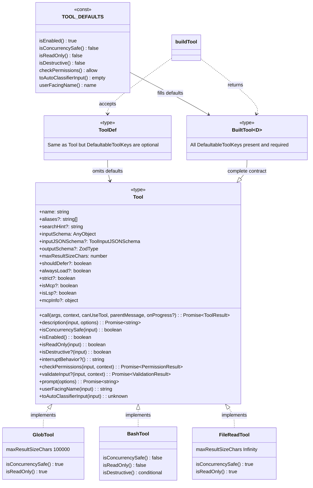
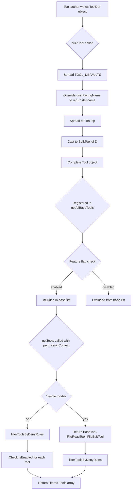

# Anatomy of a Tool: `Tool.ts`, `buildTool`, and the Base Type

## Overview

Every capability the model exercises in cc flows through a single contract: the `Tool` type defined in `src/Tool.ts`. Whether the model reads a file, runs a shell command, or spawns a subagent, the same interface governs how input is validated, how execution proceeds, how results flow back, and how permission checks gate access. This chapter dissects that contract in full -- the Zod/JSONSchema input schema, the `call()` execution method, concurrency flags, deferral mechanics, and the `maxResultSizeChars` budget. It then traces how `buildTool` (also in `src/Tool.ts`) takes a partial tool definition and merges it with safe defaults, producing a complete `Tool` object without requiring every implementor to stub out boilerplate.

The tool registry in `src/tools.ts` wires these definitions into the live session. `getAllBaseTools()` returns the exhaustive list of built-in tools, conditionally including or excluding entries based on feature flags, user type, and environment. `getTools()` further filters by permission context and enabled state. The `assembleToolPool()` function at `src/tools.ts:L345-L367` then merges built-in tools with MCP tools, deduplicates by name (built-ins take precedence), and sorts each partition alphabetically for prompt-cache stability. Together, `Tool.ts` and `tools.ts` form the two halves of cc's tool pipeline: the contract and the catalogue.

Understanding this pipeline matters because every tool the model sees, every permission check that gates execution, and every result that flows back into the context window passes through these two files. The `Tool` type is not a loose suggestion -- it is a hard contract enforced by TypeScript at compile time and by `buildTool` at runtime. When you add a new tool to cc, you implement `ToolDef` and call `buildTool`; when you register it, you add it to `getAllBaseTools()`; when the session starts, `getTools()` and `assembleToolPool()` make it visible (or not) based on environment and permissions. This three-stage pipeline -- define, register, filter -- is the architectural backbone of cc's extensibility model.

## Data structures and contracts

### The `Tool` type

The `Tool` generic type is the central contract. It carries three type parameters -- `Input` (a Zod schema), `Output`, and `P` (progress data) -- and mandates over thirty fields and methods. The core execution contract lives in `call()`, `description()`, and `inputSchema`:

```typescript
// src/Tool.ts:L362-L405
export type Tool<
  Input extends AnyObject = AnyObject,
  Output = unknown,
  P extends ToolProgressData = ToolProgressData,
> = {
  aliases?: string[]
  searchHint?: string
  call(
    args: z.infer<Input>,
    context: ToolUseContext,
    canUseTool: CanUseToolFn,
    parentMessage: AssistantMessage,
    onProgress?: ToolCallProgress<P>,
  ): Promise<ToolResult<Output>>
  description(
    input: z.infer<Input>,
    options: {
      isNonInteractiveSession: boolean
      toolPermissionContext: ToolPermissionContext
      tools: Tools
    },
  ): Promise<string>
  readonly inputSchema: Input
  readonly inputJSONSchema?: ToolInputJSONSchema
  outputSchema?: z.ZodType<unknown>
  inputsEquivalent?(a: z.infer<Input>, b: z.infer<Input>): boolean
  isConcurrencySafe(input: z.infer<Input>): boolean
  isEnabled(): boolean
  isReadOnly(input: z.infer<Input>): boolean
  isDestructive?(input: z.infer<Input>): boolean
  // ...
```

The `Input` parameter is constrained to `AnyObject` (`z.ZodType<{ [key: string]: unknown }>` at `src/Tool.ts:L343`), ensuring every tool's input is a Zod schema that produces a record with string keys. The `call()` method receives the Zod-inferred input type, the full `ToolUseContext`, a `CanUseToolFn` callback for permission gating, the parent `AssistantMessage`, and an optional `onProgress` callback for streaming intermediate results. The `description()` method is async and receives the tool input plus a context object containing session metadata, allowing descriptions to vary based on permission state and available tools.

The `inputJSONSchema` field at `src/Tool.ts:L397` provides an escape hatch for MCP tools that supply their schema in native JSON Schema format rather than converting from Zod, avoiding lossy round-trip translations. When present, the dispatch pipeline uses `inputJSONSchema` directly instead of calling `zodToJsonSchema(inputSchema)`, preserving the MCP server's original schema structure including `anyOf`, `$ref`, and other constructs that Zod's serializer might distort.

The `outputSchema` field at `src/Tool.ts:L400` is optional (the comment notes that TungstenTool does not define it). When present, it allows callers to validate tool output against a Zod schema, and the type system can infer the `Output` generic parameter from it. The `inputsEquivalent` method at `src/Tool.ts:L401` lets the dispatch pipeline determine whether two tool calls with different input objects are semantically identical -- used to deduplicate repeated model requests for the same operation.

### Concurrency, read-only, and destructive flags

Three boolean methods -- `isConcurrencySafe`, `isReadOnly`, and `isDestructive` -- encode behavioral properties that the dispatch pipeline uses to make scheduling and permission decisions:

- `isConcurrencySafe(input)` at `src/Tool.ts:L402`: when true, the tool can run in parallel with other tool calls in the same turn. Read-only tools like GlobTool and GrepTool return `true`, while tools that mutate filesystem or state return `false`.
- `isReadOnly(input)` at `src/Tool.ts:L404`: marks the tool as non-mutating. This flag feeds into the permission system's auto-approval heuristics -- read operations are typically allowed without user confirmation.
- `isDestructive(input)` at `src/Tool.ts:L406`: optional flag for tools performing irreversible operations (delete, overwrite, send). The question-mark prefix means not every tool needs to declare it; when absent, the default is `false`.

These three flags form a lattice. A tool can be read-only and concurrency-safe (like GrepTool), read-only but not concurrency-safe (if it acquires locks), or neither (like BashTool). The destructive flag is orthogonal -- a tool can be non-read-only but also not destructive (e.g., an append-only log writer).

### Deferral and the tool search mechanism

Two readonly properties control how tools interact with cc's progressive tool expansion system (HER Pattern 9). `shouldDefer` at `src/Tool.ts:L442` marks a tool as deferred -- sent to the model with `defer_loading: true`, requiring a ToolSearch round-trip before the model can call it. `alwaysLoad` at `src/Tool.ts:L449` does the opposite: it guarantees the tool's full schema appears in the initial prompt, even when ToolSearch is enabled. This is critical for tools the model must see on turn one, such as core navigation tools.

For MCP tools, `alwaysLoad` can be set via `_meta['anthropic/alwaysLoad']` in the MCP server's tool definition, providing a server-side hint that cc respects at tool assembly time.

The `searchHint` field at `src/Tool.ts:L378` complements deferral by providing a short (3--10 word) capability phrase that ToolSearch uses for keyword matching. When a deferred tool's full schema is not in the prompt, `searchHint` is the only metadata the model sees. For example, NotebookEdit's `searchHint` might be "jupyter" -- a term not present in the tool name but useful for keyword discovery. The comment explicitly recommends preferring terms not already in the tool name, maximizing the chance that a keyword search finds the right tool.

### The `interruptBehavior` method

The `interruptBehavior` method at `src/Tool.ts:L416` determines what happens when the user submits a new message while a tool is running. The two possible return values are `'cancel'` (stop the tool and discard its result) and `'block'` (keep running; the new message waits). When a tool does not implement this method, the default behavior is `'block'`. This design choice reflects a conservative stance: interrupting a running tool mid-execution could leave the filesystem in an inconsistent state, so tools must explicitly opt in to cancellation. A long-running search like GrepTool might choose `'cancel'` because its side effects are negligible, while FileEditTool would choose `'block'` because interrupting a partial write could corrupt the target file.

### Result size budget

The `maxResultSizeChars` field at `src/Tool.ts:L466` sets a hard character budget for tool output. When a tool's result exceeds this limit, the result is persisted to disk and the model receives a preview with the file path instead of the full content. This mechanism prevents large outputs (e.g., a directory listing of thousands of files) from consuming the entire context window. Tools like FileReadTool set this to `Infinity` because persisting their output would create a circular read-file-read loop, and the tool already self-bounds via its own line and token limits.

### ToolResult and context modification

The `ToolResult` type at `src/Tool.ts:L321-L336` wraps the tool's output data and provides two extension points:

```typescript
// src/Tool.ts:L321-L336
export type ToolResult<T> = {
  data: T
  newMessages?: (
    | UserMessage
    | AssistantMessage
    | AttachmentMessage
    | SystemMessage
  )[]
  // contextModifier is only honored for tools that aren't concurrency safe.
  contextModifier?: (context: ToolUseContext) => ToolUseContext
  /** MCP protocol metadata (structuredContent, _meta) to pass through to SDK consumers */
  mcpMeta?: {
    _meta?: Record<string, unknown>
    structuredContent?: Record<string, unknown>
  }
}
```

The `newMessages` field allows a tool to inject additional messages into the conversation after execution -- useful for tools that produce side-channel information or need to surface system reminders. The `contextModifier` callback, explicitly noted as "only honored for tools that aren't concurrency safe," lets a tool mutate the shared `ToolUseContext` for subsequent operations in the same turn. This restriction exists because concurrent tool calls would race on context modifications, producing non-deterministic behavior. A concrete example: FileEditTool uses `contextModifier` to update the file state cache after a write, ensuring that subsequent reads in the same turn see the updated content rather than the stale version.

The `mcpMeta` field at `src/Tool.ts:L331-L335` is a pass-through for MCP protocol metadata. When an MCP tool returns `structuredContent` or `_meta` fields per the MCP specification, cc wraps them in `mcpMeta` so they reach SDK consumers without being filtered by the tool result serialization pipeline. This preserves MCP protocol fidelity while keeping cc's internal `ToolResult` type agnostic to any specific tool protocol.

### The rendering and UI contract

Beyond the execution contract, the `Tool` type mandates a substantial UI surface. Methods like `renderToolUseMessage`, `renderToolResultMessage`, `renderToolUseProgressMessage`, and `renderToolUseErrorMessage` at `src/Tool.ts:L605-L667` give each tool full control over how it appears in the REPL. The `renderGroupedToolUse` method at `src/Tool.ts:L678-L694` handles the display of multiple parallel tool calls of the same type -- for example, three concurrent GrepTool calls rendered as a single collapsible group.

The `isSearchOrReadCommand` method at `src/Tool.ts:L429-L433` drives the UI's condensed display mode. When a tool returns `{ isSearch: true, isRead: false }`, the REPL collapses its output into a compact summary line rather than showing the full result. This is the observation masking technique described in the terminology registry: replacing verbose tool outputs with compressed summaries before they occupy screen real estate, though the full result still reaches the model's context.

## Control flow

### buildTool: merging defaults with definitions

The `buildTool` function at `src/Tool.ts:L783-L792` is the standard constructor for all tool objects. It takes a `ToolDef` (a partial tool definition) and merges it with `TOOL_DEFAULTS`, producing a complete `Tool`:

```typescript
// src/Tool.ts:L757-L792
const TOOL_DEFAULTS = {
  isEnabled: () => true,
  isConcurrencySafe: (_input?: unknown) => false,
  isReadOnly: (_input?: unknown) => false,
  isDestructive: (_input?: unknown) => false,
  checkPermissions: (
    input: { [key: string]: unknown },
    _ctx?: ToolUseContext,
  ): Promise<PermissionResult> =>
    Promise.resolve({ behavior: 'allow', updatedInput: input }),
  toAutoClassifierInput: (_input?: unknown) => '',
  userFacingName: (_input?: unknown) => '',
}

type ToolDefaults = typeof TOOL_DEFAULTS

type AnyToolDef = ToolDef<any, any, any>

export function buildTool<D extends AnyToolDef>(def: D): BuiltTool<D> {
  return {
    ...TOOL_DEFAULTS,
    userFacingName: () => def.name,
    ...def,
  } as BuiltTool<D>
}
```

The runtime spread is straightforward: `TOOL_DEFAULTS` provides the base, then `userFacingName` is set to return `def.name`, then `def` itself is spread on top. The `as BuiltTool<D>` cast bridges the gap between the structural-any constraint and the precise return type. The key design decision is that defaults are fail-closed where security matters: `isConcurrencySafe` defaults to `false` (assume not safe), `isReadOnly` defaults to `false` (assume writes), and `toAutoClassifierInput` defaults to empty string (skip the classifier -- security-relevant tools must explicitly override). The `checkPermissions` default returns `{ behavior: 'allow', updatedInput }`, deferring to the general permission system rather than blocking by default.

### The DefaultableToolKeys and ToolDef types

The type machinery that makes `buildTool` work lives in `DefaultableToolKeys` at `src/Tool.ts:L707-L714`:

```typescript
// src/Tool.ts:L707-L726
type DefaultableToolKeys =
  | 'isEnabled'
  | 'isConcurrencySafe'
  | 'isReadOnly'
  | 'isDestructive'
  | 'checkPermissions'
  | 'toAutoClassifierInput'
  | 'userFacingName'

export type ToolDef<
  Input extends AnyObject = AnyObject,
  Output = unknown,
  P extends ToolProgressData = ToolProgressData,
> = Omit<Tool<Input, Output, P>, DefaultableToolKeys> &
  Partial<Pick<Tool<Input, Output, P>, DefaultableToolKeys>>
```

`ToolDef` takes the full `Tool` type, removes the defaultable keys with `Omit`, then adds them back as `Partial`. This means a tool definition can omit any of the seven defaultable methods and still type-check. The `BuiltTool<D>` type at `src/Tool.ts:L735-L741` reverses this at the type level: for each defaultable key, if the definition provides it as required, the definition's type wins; if it is omitted or optional, the default type fills in. This ensures the return type of `buildTool` always has all seven methods present and required, even though the input type allows them to be absent.

### Tool registration and filtering

The `getAllBaseTools()` function at `src/tools.ts:L193-L251` assembles the exhaustive list of built-in tools:

```typescript
// src/tools.ts:L193-L251
export function getAllBaseTools(): Tools {
  return [
    AgentTool,
    TaskOutputTool,
    BashTool,
    ...(hasEmbeddedSearchTools() ? [] : [GlobTool, GrepTool]),
    ExitPlanModeV2Tool,
    FileReadTool,
    FileEditTool,
    FileWriteTool,
    NotebookEditTool,
    WebFetchTool,
    TodoWriteTool,
    WebSearchTool,
    TaskStopTool,
    AskUserQuestionTool,
    SkillTool,
    EnterPlanModeTool,
    ...(process.env.USER_TYPE === 'ant' ? [ConfigTool] : []),
    ...(process.env.USER_TYPE === 'ant' ? [TungstenTool] : []),
    ...(SuggestBackgroundPRTool ? [SuggestBackgroundPRTool] : []),
    ...(WebBrowserTool ? [WebBrowserTool] : []),
    ...(isTodoV2Enabled()
      ? [TaskCreateTool, TaskGetTool, TaskUpdateTool, TaskListTool]
      : []),
    // ...
    ...(isToolSearchEnabledOptimistic() ? [ToolSearchTool] : []),
  ]
}
```

This function is the single source of truth for the tool catalogue. Conditional inclusion uses spread operators with ternary expressions: tools gated by feature flags (`hasEmbeddedSearchTools()`, `isTodoV2Enabled()`, `isWorktreeModeEnabled()`) appear only when their flag is active. Ant-only tools like `ConfigTool` and `TungstenTool` are gated by `process.env.USER_TYPE === 'ant'`. The `ToolSearchTool` is included optimistically -- its presence in the base list does not mean tools are deferred; the actual deferral decision happens at request time in `claude.ts`.

The `getTools()` function at `src/tools.ts:L271-L327` applies two further filters. First, `filterToolsByDenyRules()` at `src/tools.ts:L262-L269` removes any tool with a blanket deny rule in the permission context, using the same matcher as the runtime permission check. Second, each remaining tool's `isEnabled()` method is called, and only tools returning `true` survive. In simple mode (`CLAUDE_CODE_SIMPLE`), the tool list collapses to just BashTool, FileReadTool, and FileEditTool, unless REPL mode is also active.

### The filterToolsByDenyRules and getTools pipeline

The `filterToolsByDenyRules` function at `src/tools.ts:L262-L269` provides the first runtime filter:

```typescript
// src/tools.ts:L262-L269
export function filterToolsByDenyRules<
  T extends {
    name: string
    mcpInfo?: { serverName: string; toolName: string }
  },
>(tools: readonly T[], permissionContext: ToolPermissionContext): T[] {
  return tools.filter(tool => !getDenyRuleForTool(permissionContext, tool))
}
```

The generic type parameter `T` extends a structural constraint requiring at minimum a `name` string and an optional `mcpInfo` object. This allows the function to operate on both full `Tool` objects and lighter-weight tool references. The `getDenyRuleForTool` call checks the permission context for blanket deny rules matching the tool's name or MCP server prefix. If a deny rule exists with no `ruleContent`, the tool is excluded from the model's tool list entirely -- not at call time, but before the model even sees it. This means MCP server-prefix rules like `mcp__server` strip all tools from that server before the model can request them.

The `getTools()` function at `src/tools.ts:L271-L327` chains `filterToolsByDenyRules` with the `isEnabled()` check. In simple mode (`CLAUDE_CODE_SIMPLE`), the pipeline short-circuits to return only BashTool, FileReadTool, and FileEditTool, unless REPL mode is also active, in which case REPLTool replaces the primitives. The REPL-mode path at `src/tools.ts:L314-L322` further filters out `REPL_ONLY_TOOLS` -- tools that are accessible inside the REPL VM context but hidden from the model's direct tool list.

### How buildTool consumers override defaults

Every concrete tool in cc calls `buildTool` with a `ToolDef` object. Tools that are read-only and concurrency-safe (like GlobTool and GrepTool) override `isConcurrencySafe` to return `true` and `isReadOnly` to return `true`, gaining automatic permission approval and parallel scheduling. Tools that perform writes (FileEditTool, FileWriteTool) leave `isConcurrencySafe` at the default `false` and override `isReadOnly` to return `false`, ensuring they run serially and require permission confirmation. BashTool overrides `isDestructive` to return `true` conditionally based on the command being executed, and provides a custom `checkPermissions` implementation that integrates with the classifier system. The `satisfies ToolDef<InputSchema, Output>` idiom ensures the object literal matches the expected shape without widening the type, so `buildTool` returns the precise `BuiltTool` type with all overrides preserved. Tools that omit `isEnabled`, `isDestructive`, or `checkPermissions` receive the `TOOL_DEFAULTS` values automatically.

### The assembleToolPool merge

The `assembleToolPool` function at `src/tools.ts:L345-L367` combines built-in and MCP tools into a single sorted pool:

```typescript
// src/tools.ts:L362-L367
const byName = (a: Tool, b: Tool) => a.name.localeCompare(b.name)
return uniqBy(
  [...builtInTools].sort(byName).concat(allowedMcpTools.sort(byName)),
  'name',
)
```

Built-in tools are sorted alphabetically as a contiguous prefix, then MCP tools are appended (also sorted). The `uniqBy('name')` at `src/tools.ts:L363-L366` deduplicates by name, and because built-ins come first in the spread, they win on name conflicts. This ordering is not cosmetic -- the server's `claude_code_system_cache_policy` places a global cache breakpoint after the last prefix-matched built-in tool. If MCP tools were interleaved into the built-in list by a flat sort, adding or removing an MCP tool that sorts between existing built-ins would invalidate all downstream cache keys. The two-partition sort preserves cache stability across MCP configuration changes.





## Edge cases and failure modes

**Default override ordering in `buildTool`.** The spread `...TOOL_DEFAULTS, userFacingName: () => def.name, ...def` means that if a `ToolDef` provides `userFacingName`, the definition wins. However, the intermediate `userFacingName: () => def.name` line ensures that even tools that omit `userFacingName` get a sensible default that returns the tool's name. If a tool author accidentally provides `userFacingName` as a function that returns an empty string, the default will not rescue it -- the definition's override takes precedence. This three-stage spread (defaults, then name-based userFacingName, then full def) is the reason `TOOL_DEFAULTS.userFacingName` returns an empty string: the intermediate override at line 789 replaces it before `def` has a chance to override it again.

**`checkPermissions` default and the permission chain.** The default `checkPermissions` at `src/Tool.ts:L762-L766` resolves to `{ behavior: 'allow', updatedInput: input }`, which means "no tool-specific permission logic; defer to the general permission system." This is correct for tools like GlobTool that rely on the global `alwaysAllowRules` and `alwaysDenyRules` in the `ToolPermissionContext`. However, a tool that needs custom permission logic -- for example, BashTool, which classifies commands into risk bands -- must override `checkPermissions` with its own implementation. If a tool author forgets to override `checkPermissions` for a dangerous tool, the default will allow it through to the general permission system, which may or may not catch the risk. The fail-safe here is that the general permission system's default mode (`'default'`) asks the user for confirmation on write operations, but in `bypassPermissions` mode, the tool would execute without any check.

**`maxResultSizeChars` and the Infinity trap.** Tools that set `maxResultSizeChars` to `Infinity` (like FileReadTool) opt out of the result-persistence mechanism entirely. This is correct for tools that self-bound their output, but if a tool sets `Infinity` without internal limits, a large result can consume the entire context window. The comment at `src/Tool.ts:L462-L465` explicitly warns about this: the circular Read-file-Read loop is the motivating case.

**Deferral vs. alwaysLoad conflicts.** If a tool sets both `shouldDefer` and `alwaysLoad` to true, the semantics are contradictory. The codebase does not enforce mutual exclusivity at the type level -- both are optional booleans on the same object. In practice, the dispatch pipeline checks `alwaysLoad` first, so a tool with both flags would never be deferred, but the contradiction indicates a tool definition error.

**Feature-flag-dependent registration.** The `getAllBaseTools()` function uses conditional spreads extensively. A tool that exists in the list but fails `isEnabled()` at `src/tools.ts:L325-L326` is still counted in the threshold calculation for ToolSearch. This means a disabled tool can push the total count above the deferral threshold, causing other tools to be deferred even though the disabled tool is never usable. The `isToolSearchEnabledOptimistic()` check at `src/tools.ts:L249` mitigates this by using an optimistic (pre-filter) count.

**`contextModifier` safety.** The `ToolResult.contextModifier` at `src/Tool.ts:L330` is documented as "only honored for tools that aren't concurrency safe." If a concurrency-safe tool returns a `contextModifier`, the pipeline ignores it. This is a silent failure mode -- the tool author might expect the modification to take effect, but it is discarded. The restriction is necessary for correctness (concurrent modifications would race), but the lack of a warning or log makes it easy to miss.

**`backfillObservableInput` and prompt-cache preservation.** The `backfillObservableInput` method at `src/Tool.ts:L481` is called on copies of `tool_use` input before observers (SDK stream, transcript, `canUseTool`, PreToolUse/PostToolUse hooks) see it. It must be idempotent, and the original API-bound input is never mutated -- preserving prompt cache integrity. If a tool's `backfillObservableInput` mutates the input object in a non-idempotent way (e.g., appending a timestamp), repeated calls would produce different results, breaking the expectation that hook observers see a stable view. The comment at `src/Tool.ts:L477-L480` further notes that when a hook or permission returns a `fresh updatedInput`, backfill is not re-applied -- those own their shape entirely.

## Where cc diverges from the published pattern

HER Pattern 11 (Single-Purpose Tool Design) advocates for tools that do exactly one thing, with clear scope and individual permission rules. cc follows this principle faithfully -- FileReadTool, FileEditTool, GrepTool, and GlobTool are separate tools rather than a monolithic FileTool. Each has its own permission policy: read operations are typically auto-approved, write operations require confirmation, and BashTool carries the highest risk rating.

However, cc diverges from the strict single-purpose ideal in two ways. First, BashTool is inherently multi-purpose -- it can read, write, search, and destroy through shell commands. The single-purpose principle is preserved at the tool level (BashTool's purpose is "execute a shell command"), but the underlying capability is unbounded. cc compensates with the classifier system (the `toAutoClassifierInput` method at `src/Tool.ts:L556`), which decomposes BashTool's input into a risk band, and the `bashClassifier.ts` module that maps command strings to safe/risky/destructive categories. This is the computational control that HER Section 4.2 describes: deterministic, fast, and reliable, but limited to what can be formally specified.

Second, the `interruptBehavior` method at `src/Tool.ts:L416` introduces a behavioral dimension that is not purely about purpose. A tool that returns `'cancel'` on interrupt behaves differently from one that returns `'block'`, even if both perform the same operation. This is an orthogonal concern -- purpose and interrupt policy are independent axes -- and cc correctly models it as a separate method rather than baking it into the tool's identity.

The HER distinction between computational and inferential controls maps directly onto cc's permission architecture. The `checkPermissions` method and the classifier system are computational controls: deterministic checks against rule sets. The model's decision about which tool to invoke is inferential: the model reasons about context and intent, which no static rule can fully capture. The `checkPermissions` default in `TOOL_DEFAULTS` at `src/Tool.ts:L762-L766` returns `{ behavior: 'allow', updatedInput: input }`, deferring to the general computational permission system -- tools with inferential permission logic (like BashTool's classifier) must override this explicitly.

A further divergence lies in the `validateInput` method at `src/Tool.ts:L489-L492`, which runs before `checkPermissions` and can block execution entirely. This two-phase gate (validate then permit) is not mentioned in HER Pattern 11, which assumes a single permission decision point. In cc, `validateInput` serves as a fast, deterministic pre-check that can reject invalid inputs (e.g., a non-existent directory path) before the more expensive permission check runs. This is a computational control that short-circuits the pipeline, saving both user attention and model tokens. The separation between validation and permission is itself a design pattern: validation checks whether the tool *can* run, permission checks whether it *should* run.

## Developer takeaways for building a long-running agent

The `Tool` contract and `buildTool` pattern offer three concrete lessons for building durable agent systems. First, fail-closed defaults are essential for safety at scale. When `buildTool` defaults `isConcurrencySafe` to `false` and `isReadOnly` to `false`, any tool that forgets to declare its safety properties will be treated conservatively -- the agent will not schedule it concurrently and will require explicit permission. This prevents a single omission from creating a silent safety hole across dozens of tools. Second, the separation of `ToolDef` from `Tool` via the `DefaultableToolKeys` mechanism eliminates boilerplate without sacrificing type safety. Tool authors write only what differs from the default, and the type system ensures the resulting `BuiltTool` has every required method. For a system with sixty-plus tools, this pattern pays for itself in reduced defect surface area. Third, the `maxResultSizeChars` budget and the `contextModifier` concurrency restriction illustrate a broader principle: resource limits must be enforced structurally, not by convention. A tool that returns a five-megabyte string can crash the context window; a tool that mutates shared state during concurrent execution can produce non-deterministic bugs. By encoding these constraints in the type contract and dispatch pipeline rather than relying on tool authors to follow guidelines, cc makes entire classes of failure impossible at the architectural level. The lesson for any long-running agent is that the tool contract is not documentation -- it is enforcement.
