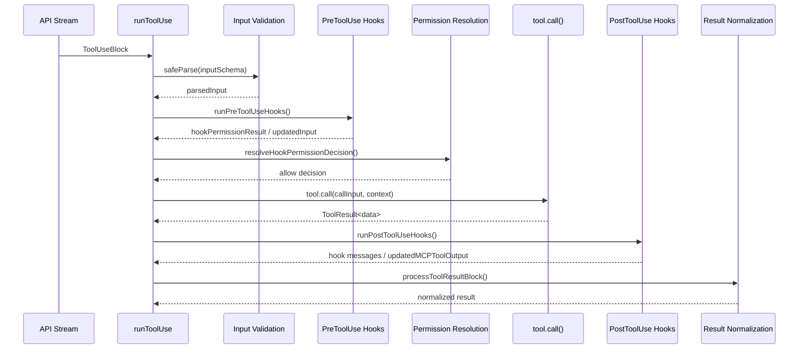
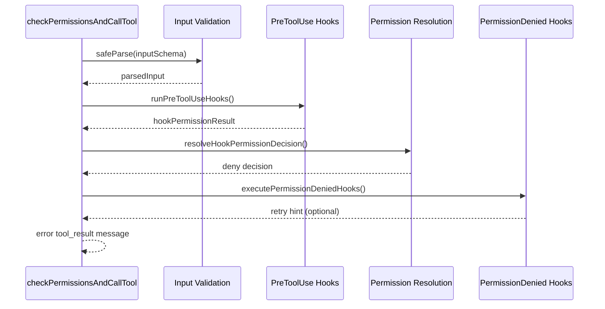
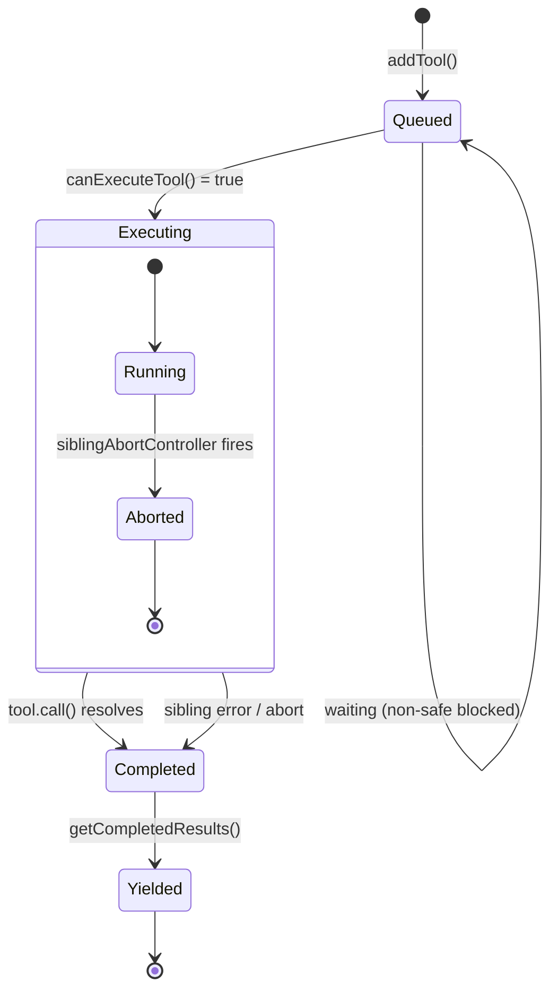

# Tool Dispatch Pipeline

## Overview

When the model emits a `tool_use` block, the harness must decide whether to execute it, how to execute it, and what to feed back. This chapter traces that journey end to end: from the raw `ToolUseBlock` arriving off the API stream through input validation, permission resolution, deterministic lifecycle hooks, tool invocation, and result normalization. The pipeline is not a simple function call; it is a stateful, concurrent, hook-augmented orchestration layer that protects the host machine from model mistakes while preserving the model's ability to act autonomously within its authorized scope.

Two concerns shape the architecture above all others. First, the pipeline must be deterministic where it matters: PreToolUse hooks and permission rules execute regardless of what the model intends, forming a guardrail the model cannot bypass. Second, the pipeline must be concurrent where it can: read-only tools run in parallel to keep latency low, while write tools serialize to prevent filesystem races. The interplay between these two concerns -- deterministic gating plus concurrent execution -- is the subject of this chapter.

The entry point for a single tool dispatch is `runToolUse` in `src/services/tools/toolExecution.ts:L337-L490`. It receives a `ToolUseBlock` from the API, looks up the tool definition, and delegates to `streamedCheckPermissionsAndCallTool` (L492), which wraps the core `checkPermissionsAndCallTool` function (L599) in a `Stream` object so that progress events and final results flow through a single async iterable. This streaming architecture allows the UI to show real-time progress while the tool executes, rather than blocking until completion.

## Data structures and contracts

The pipeline operates over a handful of core types. The most important is the `Tool` type itself, which defines the contract every tool must satisfy:

```typescript
// src/Tool.ts:L362-L405 — Tool type definition (key fields)
export type Tool<
  Input extends AnyObject = AnyObject,
  Output = unknown,
  P extends ToolProgressData = ToolProgressData,
> = {
  aliases?: string[]
  searchHint?: string
  call(
    args: z.infer<Input>,
    context: ToolUseContext,
    canUseTool: CanUseToolFn,
    parentMessage: AssistantMessage,
    onProgress?: ToolCallProgress<P>,
  ): Promise<ToolResult<Output>>
  description(
    input: z.infer<Input>,
    options: {
      isNonInteractiveSession: boolean
      toolPermissionContext: ToolPermissionContext
      tools: Tools
    },
  ): Promise<string>
  readonly inputSchema: Input
  outputSchema?: z.ZodType<unknown>
  inputsEquivalent?(a: z.infer<Input>, b: z.infer<Input>): boolean
  isConcurrencySafe(input: z.infer<Input>): boolean
  isEnabled(): boolean
  isReadOnly(input: z.infer<Input>): boolean
  isDestructive?(input: z.infer<Input>): boolean
  interruptBehavior?(): 'cancel' | 'block'
  // ...
}
```

The `isConcurrencySafe` method on line L402 is the single source of truth for whether a tool invocation can run alongside others. The orchestration layer calls this method after parsing the input with the tool's Zod schema; if the schema parse fails or `isConcurrencySafe` throws, the tool is treated as non-concurrent-safe as a conservative fallback (`src/services/tools/toolOrchestration.ts:L97-L108`). The `call` method on lines L379-L385 is the actual execution entry point, receiving parsed input, the tool-use context, the permission function, the parent assistant message, and an optional progress callback.

The `interruptBehavior` method on L416 controls what happens when the user submits a new message while a tool is running. Tools returning `'cancel'` are aborted immediately; tools returning `'block'` keep running and the new message waits. This distinction matters for the StreamingToolExecutor's `updateInterruptibleState` method (`src/services/tools/StreamingToolExecutor.ts:L254-L259`), which determines whether the UI should allow interruptions at all.

The `ToolResult` type wraps what `call` returns:

```typescript
// src/Tool.ts:L321-L336 — ToolResult type
export type ToolResult<T> = {
  data: T
  newMessages?: (
    | UserMessage
    | AssistantMessage
    | AttachmentMessage
    | SystemMessage
  )[]
  contextModifier?: (context: ToolUseContext) => ToolUseContext
  mcpMeta?: {
    _meta?: Record<string, unknown>
    structuredContent?: Record<string, unknown>
  }
}
```

The `contextModifier` field on L330 allows a tool to mutate the shared `ToolUseContext` for downstream tools -- for example, updating the file-state cache after a write. Critically, the `StreamingToolExecutor` only applies context modifiers from non-concurrent-safe tools (`src/services/tools/StreamingToolExecutor.ts:L391-L395`), since concurrent tools cannot safely mutate shared state. The `newMessages` field lets a tool inject additional messages into the conversation -- the Agent tool uses this to surface subagent output. The `mcpMeta` field passes through MCP protocol metadata like `structuredContent` for SDK consumers.

The `ToolUseContext` (`src/Tool.ts:L158-L300`) carries session-wide state through every dispatch: the abort controller, the tool list, the permission context, message history, and numerous callbacks for UI updates. It is the single dependency-injection container for the entire pipeline. Key fields include `abortController` for cancellation, `readFileState` for tracking which files have been read this turn, `toolDecisions` for logging permission outcomes, and `requireCanUseTool` which forces the permission dialog even when hooks auto-approve (used by speculation for file-path rewriting).

The `CanUseToolFn` type, exported from `src/hooks/useCanUseTool.tsx:L27`, is the permission-check function signature. Every tool dispatch passes through it:

```typescript
// src/hooks/useCanUseTool.tsx:L27 — CanUseToolFn type signature
export type CanUseToolFn<
  Input extends Record<string, unknown> = Record<string, unknown>,
> = (
  tool: ToolType,
  input: Input,
  toolUseContext: ToolUseContext,
  assistantMessage: AssistantMessage,
  toolUseID: string,
  forceDecision?: PermissionDecision<Input>,
) => Promise<PermissionDecision<Input>>
```

The optional `forceDecision` parameter allows PreToolUse hooks to inject a pre-resolved permission decision (for instance, a hook that auto-approves certain file patterns) while still going through the same code path. The `canUseTool` implementation itself is a React hook (`src/hooks/useCanUseTool.tsx:L28-L191`) that creates a Promise-based resolution flow, checking rule-based permissions first and falling through to an interactive dialog when the result is `ask`.

The `ValidationResult` type from `src/Tool.ts:L95-L101` is the return type of `tool.validateInput`. A successful validation returns `{result: true}`; a failed validation returns `{result: false, message: string, errorCode: number}`. The `errorCode` is a numeric identifier that telemetry uses to classify validation failures without logging sensitive input data.

## Control flow

The full dispatch pipeline for a single tool call is orchestrated by `checkPermissionsAndCallTool` in `src/services/tools/toolExecution.ts:L599-L1745`. The function is a long async method that proceeds through six phases: input validation, PreToolUse hooks, permission resolution, tool invocation, PostToolUse hooks, and result normalization. The following diagram shows the successful path:



### Phase 1: Input validation

The pipeline begins by parsing the model-provided input against the tool's Zod schema. This happens at `src/services/tools/toolExecution.ts:L615`:

```typescript
// src/services/tools/toolExecution.ts:L614-L680 — Schema validation and tool-specific validateInput
const parsedInput = tool.inputSchema.safeParse(input)
if (!parsedInput.success) {
  let errorContent = formatZodValidationError(tool.name, parsedInput.error)
  // ... deferred-tool hint injection ...
  return [
    {
      message: createUserMessage({
        content: [
          {
            type: 'tool_result',
            content: `<tool_use_error>InputValidationError: ${errorContent}</tool_use_error>`,
            is_error: true,
            tool_use_id: toolUseID,
          },
        ],
        toolUseResult: `InputValidationError: ${parsedInput.error.message}`,
        sourceToolAssistantUUID: assistantMessage.uuid,
      }),
    },
  ]
}
```

The `safeParse` call on L615 is the first gate: if the model emits a string where the schema expects an array, the dispatch ends immediately with an `InputValidationError`. The `buildSchemaNotSentHint` function on L619 checks whether the tool was a deferred tool whose schema was never sent to the API; if so, it appends a hint telling the model to call ToolSearch first (`src/services/tools/toolExecution.ts:L578-L597`). This directly addresses the HER Tool Explosion pattern: deferred tools keep the initial tool list under 20, but the model may attempt to call them before loading their schemas, producing type-mismatch errors that look like schema violations. The hint text is explicit: "Load the tool first: call ToolSearch with query 'select:{toolName}', then retry this call."

After Zod validation, `tool.validateInput` is called on L683. This is tool-specific semantic validation -- for example, checking that a file path exists or that a bash command does not violate security policy. If `validateInput` returns `{result: false}`, the dispatch aborts before any hooks or permission checks run. The separation between schema validation (structural correctness) and semantic validation (domain correctness) means that a tool can reject a well-typed but invalid input without paying the cost of running hooks or permission dialogs.

Before the hooks phase begins, the pipeline speculatively starts the Bash classifier check for Bash tools (L740-L752). The `startSpeculativeClassifierCheck` function runs in parallel with the PreToolUse hooks, so by the time the permission dialog appears, the classifier may already have resolved. The UI indicator for "classifier running" is not set at this point -- it is only set in `interactiveHandler.ts` when the permission check returns `ask` with a `pendingClassifierCheck`, avoiding a flash of "classifier running" for commands that auto-allow via prefix rules.

### Phase 2: PreToolUse hooks

After validation passes, the pipeline runs `runPreToolUseHooks` (`src/services/tools/toolHooks.ts:L435-L650`). This async generator yields a stream of typed results:

```typescript
// src/services/tools/toolHooks.ts:L444-L461 — PreToolUse hook yield types
export async function* runPreToolUseHooks(
  toolUseContext: ToolUseContext,
  tool: Tool,
  processedInput: Record<string, unknown>,
  toolUseID: string,
  messageId: string,
  requestId: string | undefined,
  mcpServerType: McpServerType,
  mcpServerBaseUrl: string | undefined,
): AsyncGenerator<
  | { type: 'message'; message: MessageUpdateLazy<AttachmentMessage | ProgressMessage<HookProgress>> }
  | { type: 'hookPermissionResult'; hookPermissionResult: PermissionResult }
  | { type: 'hookUpdatedInput'; updatedInput: Record<string, unknown> }
  | { type: 'preventContinuation'; shouldPreventContinuation: boolean }
  | { type: 'stopReason'; stopReason: string }
  | { type: 'additionalContext'; message: MessageUpdateLazy<AttachmentMessage> }
  | { type: 'stop' }
> {
```

The yield types encode the full range of hook behaviors. A `hookPermissionResult` with `behavior: 'deny'` blocks the tool call immediately -- the model cannot bypass this. A `hookUpdatedInput` allows a hook to rewrite the tool's input without making a permission decision (passthrough modification). A `preventContinuation` flag tells the pipeline to stop the entire query turn after the current tool completes, even if the tool succeeds. This maps directly to HER Pattern 12 (Deterministic Lifecycle Hooks): PreToolUse hooks are the most reliable enforcement mechanism because they execute deterministically, independent of model cooperation.

The generator delegates to `executePreToolHooks` (imported from `src/utils/hooks.ts`), passing the tool name, tool-use ID, processed input, and the abort signal. Each hook result is inspected for `permissionBehavior` (`src/services/tools/toolHooks.ts:L510-L554`). When a hook returns `permissionBehavior: 'allow'`, the generator yields a `hookPermissionResult` with the allow decision and any `updatedInput` the hook provided. When a hook returns `permissionBehavior: 'deny'`, the generator yields a deny decision with the hook's blocking message. When a hook returns `permissionBehavior: 'ask'`, the generator yields an ask decision, which forces the interactive permission dialog to appear even if the tool would otherwise auto-approve.

The hook results are consumed in a `for await` loop inside `checkPermissionsAndCallTool` (`src/services/tools/toolExecution.ts:L800-L862`), which accumulates messages, tracks the hook permission result, and records whether continuation should be prevented. If a hook yields `type: 'stop'`, the pipeline returns immediately with a cancellation message. The pipeline also tracks wall-clock hook duration (L863-L870) and logs a warning when PreToolUse hooks take longer than 2 seconds (`SLOW_PHASE_LOG_THRESHOLD_MS` at L137), which helps diagnose why the UI feels stuck during hook execution.

### Phase 3: Permission resolution

The `resolveHookPermissionDecision` function (`src/services/tools/toolHooks.ts:L332-L433`) merges the hook's permission decision with the rule-based permission system. This function encodes a critical invariant: a hook `allow` does not bypass `deny` rules from settings.json:

```typescript
// src/services/tools/toolHooks.ts:L347-L405 — Hook allow does not override deny rules
if (hookPermissionResult?.behavior === 'allow') {
  const hookInput = hookPermissionResult.updatedInput ?? input
  const interactionSatisfied =
    requiresInteraction && hookPermissionResult.updatedInput !== undefined

  if ((requiresInteraction && !interactionSatisfied) || requireCanUseTool) {
    logForDebugging(
      `Hook approved tool use for ${tool.name}, but canUseTool is required`,
    )
    return {
      decision: await canUseTool(tool, hookInput, toolUseContext, assistantMessage, toolUseID),
      input: hookInput,
    }
  }

  // Hook allow skips the interactive prompt, but deny/ask rules still apply.
  const ruleCheck = await checkRuleBasedPermissions(tool, hookInput, toolUseContext)
  if (ruleCheck === null) {
    return { decision: hookPermissionResult, input: hookInput }
  }
  if (ruleCheck.behavior === 'deny') {
    return { decision: ruleCheck, input: hookInput }
  }
  // ask rule — dialog required despite hook approval
  return {
    decision: await canUseTool(tool, hookInput, toolUseContext, assistantMessage, toolUseID),
    input: hookInput,
  }
}
```

The `checkRuleBasedPermissions` call on L373 is the second gate. Even when a hook approves the tool, explicit deny rules in the user's settings.json take precedence. This defense-in-depth design prevents a misconfigured hook from opening a security hole. The `ask` behavior similarly forces the interactive dialog even after a hook allow, ensuring that user-facing confirmation requirements cannot be silently skipped.

A special case on L353-L356 handles interactive tools (tools where `requiresUserInteraction()` returns true). If a hook provides `updatedInput`, the hook itself counts as the user interaction -- for example, a headless wrapper that collected AskUserQuestion answers. This satisfies the interaction requirement without showing the dialog. The `requireCanUseTool` flag (L356) on `ToolUseContext` forces the permission dialog even when hooks auto-approve; it is used by the speculation system for overlay file-path rewriting.

When the hook result is `deny` (L408), the decision is final: the tool is not executed. When the hook result is `ask` or absent, the pipeline falls through to the normal permission flow via `canUseTool` (L423).

The `canUseTool` function itself (`src/hooks/useCanUseTool.tsx:L28-L191`) is a React hook that creates a Promise-based permission resolution flow. It first checks `hasPermissionsToUseTool` for rule-based decisions (allow/deny/ask), then handles the `ask` path. In coordinator mode (`awaitAutomatedChecksBeforeDialog`), the function tries automated checks (classifiers, hooks) before showing the interactive dialog, so background workers do not interrupt the user unnecessarily. In swarm-worker mode, permission requests are forwarded to the leader agent via mailbox callbacks. For the main agent, a speculative classifier check runs with a 2-second timeout (L131); if it resolves with high confidence, the dialog is skipped entirely.

### Phase 4: Tool invocation

If the permission decision is `allow`, the pipeline calls `tool.call()`:

```typescript
// src/services/tools/toolExecution.ts:L1207-L1222 — Tool invocation
const result = await tool.call(
  callInput,
  {
    ...toolUseContext,
    toolUseId: toolUseID,
    userModified: permissionDecision.userModified ?? false,
  },
  canUseTool,
  assistantMessage,
  progress => {
    onToolProgress({
      toolUseID: progress.toolUseID,
      data: progress.data,
    })
  },
)
```

The `callInput` variable on L1207 is the final resolved input after all hook and permission modifications. A subtle detail: if no hook or permission path modified the input, the pipeline restores the model's original field values for the `call()` invocation (L1189-L1205). This is because `backfillObservableInput` may have mutated a copy of the input for hook/permission observation (e.g., expanding `~` to the home directory), but the tool result string should embed the path the model emitted -- not the expanded version -- to keep transcript hashes stable.

The `userModified` flag on L1211 tells the tool whether the user edited the input during the permission dialog. Some tools use this to alter their behavior -- for example, skipping confirmation prompts when the user has already approved a modified command.

The progress callback on L1216-L1220 is wired to the `Stream` object created by `streamedCheckPermissionsAndCallTool` (L509), which enqueues progress messages so they flow to the UI in real time. Each progress event is wrapped in a `createProgressMessage` call and tagged with the tool-use ID and a parent tool-use ID, allowing the UI to nest sub-tool progress under the parent tool.

### Phase 5: PostToolUse hooks

After successful tool invocation, `runPostToolUseHooks` (`src/services/tools/toolHooks.ts:L39-L191`) runs. These hooks can inspect the tool's output, block the result from reaching the model, add additional context, or -- for MCP tools -- modify the output entirely:

```typescript
// src/services/tools/toolHooks.ts:L56-L64 — PostToolUse hook iteration
for await (const result of executePostToolHooks(
  tool.name,
  toolUseID,
  toolInput,
  toolOutput,
  toolUseContext,
  permissionMode,
  toolUseContext.abortController.signal,
)) {
```

The `executePostToolHooks` function (imported from `src/utils/hooks.ts`) iterates over all hooks registered for the `PostToolUse` lifecycle event matching the current tool name. Each hook result is inspected for `blockingError`, `preventContinuation`, `updatedMCPToolOutput`, and `additionalContexts`.

If a hook yields `blockingError`, the tool result is still returned to the model but with an error attachment, and `preventContinuation` stops the query turn. If a hook yields `updatedMCPToolOutput` and the tool is an MCP tool (`src/services/tools/toolHooks.ts:L146`), the output is replaced before being sent to the model. This is how a PostToolUse hook could sanitize MCP responses or inject structured content. For non-MCP tools, the mapped tool result is emitted before PostToolUse hooks run (`src/services/tools/toolExecution.ts:L1477-L1479`), so hooks cannot retroactively modify the tool_result block -- they can only add attachment messages alongside it.

When the tool itself throws an error, `runPostToolUseFailureHooks` runs instead (`src/services/tools/toolHooks.ts:L193-L319`), giving hooks a chance to observe failures and add diagnostic context. The failure hooks receive the error string, a boolean `isInterrupt` indicating whether the error was a user-initiated abort, and the same tool context. Hook errors during PostToolUse execution are caught and logged but do not prevent the tool result from reaching the model -- a failing hook should not break the dispatch pipeline.

### Phase 6: Result normalization

The `addToolResult` closure inside `checkPermissionsAndCallTool` (`src/services/tools/toolExecution.ts:L1403-L1474`) normalizes the tool output into the API's `tool_result` content block format. It calls `processToolResultBlock` (or `processPreMappedToolResultBlock` for non-MCP tools whose hooks did not modify the output), which applies the tool-result character budget, persists oversized results to disk, and returns the compact `ToolResultBlockParam`. The `tool.mapToolResultToToolResultBlockParam` method (L1292) handles the initial mapping from the tool's domain-specific output type to the API's content block format; this mapping is cached and reused by `processPreMappedToolResultBlock` to avoid double serialization.

Accept feedback and attached images from the permission dialog are appended as additional content blocks alongside the tool_result (L1421-L1438). Each image gets a sequential `imagePasteId` so the UI can render it with a distinct label. The `toolUseResult` field on the user message is set to the string representation of the tool output for transcript search indexing, but is omitted for subagents when `preserveToolUseResults` is false (L1461-L1464).

After the tool result and PostToolUse hooks are processed, any `newMessages` from the `ToolResult` are appended (L1566-L1570). If `shouldPreventContinuation` was set by a PreToolUse hook, a `hook_stopped_continuation` attachment is added (L1572-L1582), which signals the query loop to end the turn even though the tool succeeded.

### Denied dispatch

When the permission decision is not `allow`, the pipeline takes a different path. The following diagram shows the denied dispatch:



On the denied path (`src/services/tools/toolExecution.ts:L995-L1103`), the pipeline creates an `is_error: true` tool_result message with the denial reason. The error message content comes from `permissionDecision.message` if available, or from a generic "Execution stopped by PreToolUse hook" string when `shouldPreventContinuation` is set without a specific message (L1025-L1027). Image blocks from the permission dialog (e.g., screenshots the user attached when rejecting) are appended at the top level of the content array, not inside the `tool_result` block, because the API rejects non-text content in error results (L1040-L1044).

If the denial came from the auto-mode classifier (`src/services/tools/toolExecution.ts:L1076-L1101`), `executePermissionDeniedHooks` runs. These hooks can return `{retry: true}`, which causes the pipeline to inject a meta-message telling the model it may retry the command. This is a narrow escape hatch: the classifier denied the command, but a human reviewer (via a PermissionDenied hook) has now approved it, so the model gets a hint that the command is safe to retry. The `recordAutoModeDenial` function (called in `useCanUseTool.tsx:L78-L89`) also logs the denial to a notification buffer, surfacing a "denied by auto mode" indicator in the UI with a link to `/permissions`.

### Concurrency scheduling

The orchestration layer decides which tools run in parallel and which run serially. The `partitionToolCalls` function in `src/services/tools/toolOrchestration.ts:L91-L116` partitions the model's tool-use blocks into batches:

```typescript
// src/services/tools/toolOrchestration.ts:L91-L116 — Partition tool calls into concurrent and serial batches
function partitionToolCalls(
  toolUseMessages: ToolUseBlock[],
  toolUseContext: ToolUseContext,
): Batch[] {
  return toolUseMessages.reduce((acc: Batch[], toolUse) => {
    const tool = findToolByName(toolUseContext.options.tools, toolUse.name)
    const parsedInput = tool?.inputSchema.safeParse(toolUse.input)
    const isConcurrencySafe = parsedInput?.success
      ? (() => {
          try {
            return Boolean(tool?.isConcurrencySafe(parsedInput.data))
          } catch {
            return false
          }
        })()
      : false
    if (isConcurrencySafe && acc[acc.length - 1]?.isConcurrencySafe) {
      acc[acc.length - 1]!.blocks.push(toolUse)
    } else {
      acc.push({ isConcurrencySafe, blocks: [toolUse] })
    }
    return acc
  }, [])
}
```

Consecutive concurrency-safe tools (typically reads and searches) are grouped into a single batch that runs concurrently via `runToolsConcurrently`. Any non-concurrency-safe tool (writes, bash commands) gets its own batch and runs serially via `runToolsSerially`. The `runTools` generator (`src/services/tools/toolOrchestration.ts:L19-L82`) iterates over these batches: for concurrency-safe batches, it uses the `all` combinator from `src/utils/generators.ts` to run tools in parallel with a concurrency limit; for non-concurrency-safe batches, it runs each tool sequentially, threading the `ToolUseContext` through each invocation so context modifiers accumulate.

The maximum concurrency is controlled by `CLAUDE_CODE_MAX_TOOL_USE_CONCURRENCY`, defaulting to 10 (`src/services/tools/toolOrchestration.ts:L8-L12`). Context modifiers from concurrent tools are queued and applied after the entire batch completes (L42-L62), because applying them during concurrent execution would cause races.

The `StreamingToolExecutor` (`src/services/tools/StreamingToolExecutor.ts:L40-L519`) handles the streaming case, where tool-use blocks arrive one at a time from the API response stream rather than all at once. It maintains a queue of `TrackedTool` objects with a state machine:

```typescript
// src/services/tools/StreamingToolExecutor.ts:L19-L32 — TrackedTool state type
type ToolStatus = 'queued' | 'executing' | 'completed' | 'yielded'

type TrackedTool = {
  id: string
  block: ToolUseBlock
  assistantMessage: AssistantMessage
  status: ToolStatus
  isConcurrencySafe: boolean
  promise?: Promise<void>
  results?: Message[]
  pendingProgress: Message[]
  contextModifiers?: Array<(context: ToolUseContext) => ToolUseContext>
}
```

The four-state lifecycle (`queued` -> `executing` -> `completed` -> `yielded`) ensures that results are emitted in tool-receipt order. The `canExecuteTool` method (L129-L135) enforces the concurrency rule: a tool can execute if nothing is running, or if it is concurrency-safe and all currently executing tools are also concurrency-safe. When a Bash tool errors during concurrent execution, the `siblingAbortController` fires to cancel sibling subprocesses immediately (L359-L363), because Bash commands often have implicit dependency chains where a failure makes subsequent commands pointless.



Progress messages are yielded immediately from `pendingProgress` (L419-L421), regardless of tool status, so the user sees real-time feedback. Final results are yielded in tool-receipt order from `getCompletedResults` (L412-L440), which breaks early when it encounters a non-concurrency-safe tool that is still executing, preserving ordering guarantees. The `getRemainingResults` method (L453-L490) waits for all tools to complete, using `Promise.race` against the executing tool promises and a progress-available signal, so the consumer does not block on slow tools when progress is available.

The `addTool` method (L76-L123) handles the initial lookup and scheduling. If the tool name is not found in the current tool definitions, it creates a synthetic error result immediately (L79-L100), avoiding the need for a separate validation phase. The `discard` method (L69-L71) handles streaming fallback: all pending and in-progress tools are abandoned, with in-progress tools receiving synthetic error messages (L174-L205).

The per-tool child abort controller (L301-L318) is a critical safety mechanism. It is a child of the `siblingAbortController`, which is itself a child of the `toolUseContext.abortController`. When a tool's abort controller fires for a reason other than `sibling_error` (e.g., permission rejection), it bubbles up to the parent query controller, ensuring the query loop's post-tool abort check ends the turn. Without this bubble-up, a rejected permission dialog would send a `REJECT_MESSAGE` to the model instead of aborting the turn, causing the model to attempt the same tool again.

## Edge cases and failure modes

**Schema validation failures for deferred tools.** When a deferred tool is called before its schema has been loaded by ToolSearch, the model emits string values where the schema expects arrays or numbers. The Zod parse fails, but the error message alone does not tell the model to re-load the tool. The `buildSchemaNotSentHint` function (`src/services/tools/toolExecution.ts:L578-L597`) appends a targeted hint. This is the concrete implementation of the HER's fix for Tool Explosion: progressive tool expansion avoids overwhelming the model, but requires a recovery path when the model guesses at parameters. The hint function checks three gates before emitting the hint: `isToolSearchEnabledOptimistic()` verifies ToolSearch is available, `isToolSearchToolAvailable()` verifies the ToolSearch tool is in the current tool list, and `isDeferredTool(tool)` confirms the tool is actually deferred. It also checks whether the tool name appears in the `discoveredToolNames` set extracted from message history; if it does, the schema was already loaded and the validation failure is a genuine error, not a missing-schema problem.

**Silent failures from tool errors.** The HER identifies silent failures as one of the most dangerous failure modes: the agent calls a tool, the tool returns an error, and the agent proceeds as if it succeeded. The cc pipeline addresses this through structured error propagation. Every error path -- validation failure (`src/services/tools/toolExecution.ts:L664`), permission denial (L1064), hook block (L853), tool exception (L1715) -- produces an `is_error: true` tool_result message that the model must acknowledge. The pipeline never silently drops an error. The `runPostToolUseFailureHooks` function (L1700) gives hooks a chance to add diagnostic context after failures, addressing the HER's recommendation for structured output validation after every tool call. The `classifyToolError` function (L150-L171) extracts telemetry-safe error information even from minified builds, where `error.constructor.name` is mangled into short identifiers like "nJT" -- it checks for `TelemetrySafeError`, Node.js fs error codes, and stable `.name` properties.

**Bash sibling cancellation.** When multiple Bash tools run concurrently and one fails, the `StreamingToolExecutor` cancels all siblings via `siblingAbortController.abort('sibling_error')` (`src/services/tools/StreamingToolExecutor.ts:L362`). This is Bash-specific; read-only tool failures do not cancel siblings because reads are independent (L358-L363). The per-tool child abort controller (L301-L318) also bubbles up to the parent query controller on certain abort reasons (permission rejection), ensuring the query loop's post-tool abort check ends the turn correctly. The `createSyntheticErrorMessage` method (L153-L205) generates appropriate error messages for the three cancel reasons: `sibling_error` when a parallel Bash command failed, `user_interrupted` when the user pressed Escape, and `streaming_fallback` when the API response was discarded. User interrupts use `REJECT_MESSAGE` so the UI shows "User rejected edit" instead of a generic error.

**Backfill divergence.** The `backfillObservableInput` method mutates a copy of the input for observer consumption (hooks, permissions, SDK stream) while preserving the model's original input for `tool.call()`. If a hook or permission path returns a fresh `updatedInput`, the pipeline uses that instead. But if the input was only backfilled (not replaced), the pipeline restores the original values on L1189-L1205 to keep tool-result strings and VCR fixture hashes stable. A subtle bug arises if the hook-derived input's `file_path` happens to match the backfill-expanded value: the pipeline detects this and restores the model's original path, avoiding a mismatch that would break transcript replay.

**Hook allow vs. deny rules.** The `resolveHookPermissionDecision` function encodes the invariant that a hook `allow` cannot override a `deny` rule in settings.json (`src/services/tools/toolHooks.ts:L373-L389`). If a hook approves a tool but a deny rule exists, the deny wins. This is a deliberate defense-in-depth design: hooks are user-configured shell commands, and a misconfigured hook should not be able to open a security hole. Conversely, a hook `deny` is always final -- there is no rule that can override it.

**Streaming fallback.** The `StreamingToolExecutor.discard()` method (L69-L71) handles the case where the API response triggers a streaming fallback -- the model's first attempt produced invalid output, and the client re-requests. All pending and in-progress tools are abandoned: queued tools won't start, and in-progress tools receive synthetic error messages (L174-L188). This prevents stale results from a failed attempt from contaminating the retry.

**Unknown tool names.** When `runToolUse` receives a `ToolUseBlock` for a tool name that is not in the current tool list, it checks for deprecated aliases (`src/services/tools/toolExecution.ts:L350-L356`). If the name matches an alias of a known tool (e.g., "KillShell" is now an alias for "TaskStop"), the dispatch proceeds with the aliased tool. If no alias matches, the dispatch returns an error immediately (L396-L411). The `StreamingToolExecutor.addTool` method also handles unknown tools by creating a synthetic error result with `isConcurrencySafe: true` (`src/services/tools/StreamingToolExecutor.ts:L79-L100`), which prevents the unknown tool from blocking concurrent execution of other tools.

**MCP authentication errors.** When a tool call throws `McpAuthError` (`src/services/tools/toolExecution.ts:L1601-L1628`), the pipeline updates the MCP client status to `needs-auth` in the app state. This triggers the UI to show a re-authorization prompt for the MCP server. The error is still propagated to the model as an `is_error: true` tool_result, but the side effect of updating the client status means the model will see the server as "needs-auth" on its next tool list refresh.

## Where cc diverges from the published pattern

The HER Pattern 12 describes deterministic lifecycle hooks at "25+ lifecycle points." The cc implementation concentrates on three lifecycle points within the tool dispatch pipeline: `PreToolUse`, `PostToolUse`, and `PostToolUseFailure`. The `PreToolUse` hook is the primary gate; the `PostToolUse` hook is a post-hoc observation and modification point; the `PostToolUseFailure` hook is a failure diagnostic. The cc implementation does not expose `TaskCompleted` or `SessionStart` hooks within the dispatch pipeline itself -- those are handled at the query-loop level. The HER notes that "lifecycle hooks encode assumptions about model limitations in deterministic code" and that "the model cannot bypass a PreToolUse hook." The cc implementation validates this: the hook executes before the permission dialog, and its deny decision is final. However, the cc implementation adds a nuance the HER does not address: a hook `allow` does not bypass deny rules. This is a stricter interpretation than the HER's description, which implies that hooks have full authority over the permission decision.

The HER's fix for Tool Explosion recommends "progressive tool expansion starting with under 20." The cc implementation goes further: it implements a full ToolSearch mechanism (`src/tools/ToolSearchTool/`) where tools are classified as deferred or always-loaded, and the model must explicitly search for and load deferred tools before calling them. The `buildSchemaNotSentHint` function is the recovery mechanism for when the model attempts to call a deferred tool without loading it, providing a targeted hint rather than a generic error. The `shouldDefer` and `alwaysLoad` flags on the `Tool` type (`src/Tool.ts:L442-L449`) control this classification, and MCP tools can opt in via the `_meta['anthropic/alwaysLoad']` annotation.

The HER's fix for Silent Failures recommends "structured output validation after every tool call." The cc implementation enforces this through the type system: every path through `checkPermissionsAndCallTool` either returns an `is_error: true` tool_result or a normal tool_result. There is no path that silently drops a result. The `PostToolUseFailure` hook provides the "structured output validation" the HER recommends -- hooks can inspect the error and add context before it reaches the model. The cc implementation also goes beyond the HER's recommendation by classifying errors for telemetry via `classifyToolError` (L150-L171), which extracts structured error information even from minified builds.

The concurrency model diverges from a naive "run all tools in parallel" approach. The cc implementation distinguishes between read-only parallelism and write serialization based on the `isConcurrencySafe` method, and it uses a sibling abort mechanism to cancel dependent Bash commands when one fails. This is more conservative than the HER suggests, but reflects real-world experience: Bash commands often have implicit ordering dependencies that are not visible to the orchestrator. The context-modifier threading in `runToolsSerially` (`src/services/tools/toolOrchestration.ts:L118-L150`) ensures that write tools see the accumulated state from prior writes, which would not be possible with a fully parallel approach.

## Developer takeaways for building a long-running agent

When building a long-running agent, treat the tool dispatch pipeline as your security boundary, not as a pass-through. Every tool call must pass through validation, deterministic hooks, and permission resolution before reaching execution, and the results must pass through post-execution hooks before reaching the model. This layered approach is what allows the harness to constrain the model's behavior without relying on prompt engineering alone. The invariant that hook-allow cannot override deny rules is essential: it means that your settings.json deny rules are a hard floor that no hook can punch through, which in turn means that adding a new hook cannot accidentally open a security hole. For concurrency, adopt the read-parallel/write-serial pattern early. It is tempting to run everything in parallel for speed, but filesystem races and implicit command dependencies will produce silent corruption that is extremely difficult to debug. The sibling abort mechanism for Bash tools is a practical compromise: cancel dependent commands when a prerequisite fails, but let independent reads finish. Finally, invest in the deferred-tool and ToolSearch pattern from the start. A tool list that grows beyond 20 degrades model selection accuracy, and the recovery cost of adding deferral after the fact is high because you must trace every code path that assumes all tools are always available.
