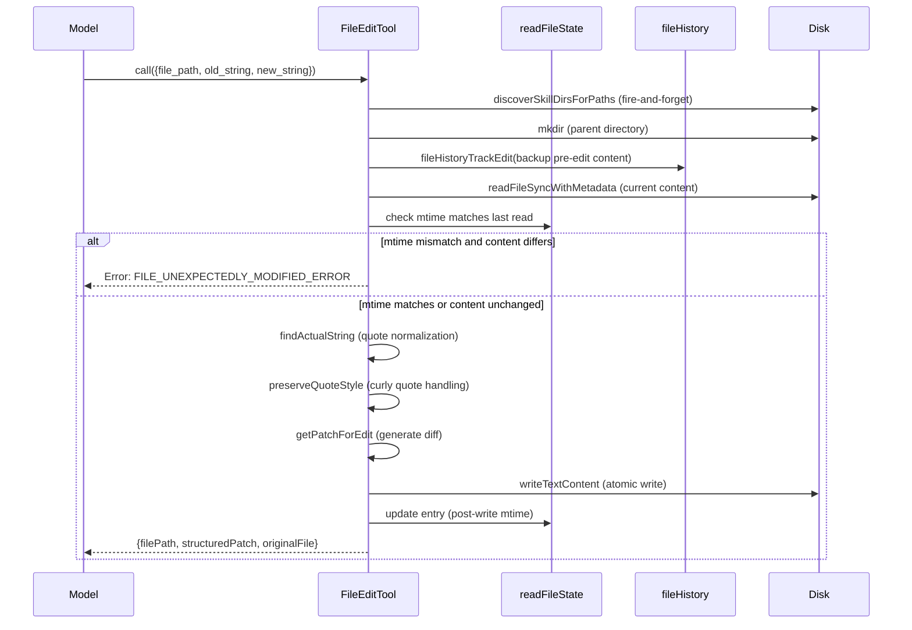
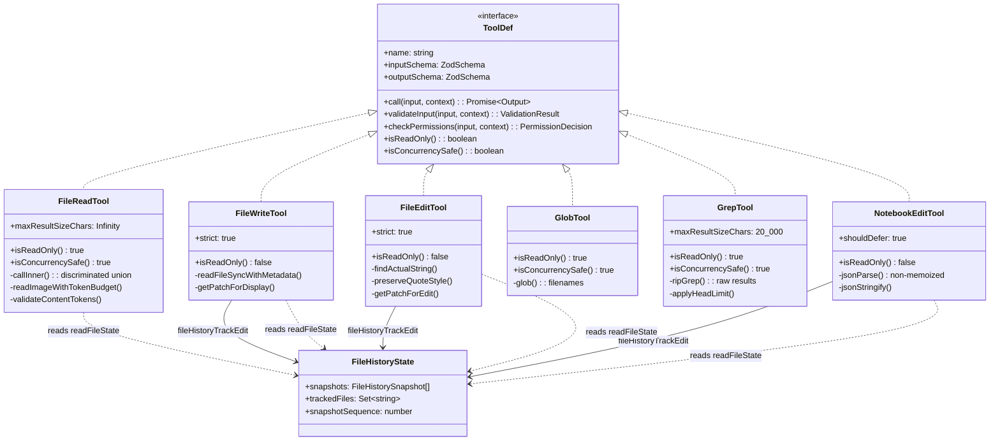

# File System Tools: Read, Write, Edit, Glob, Grep, Notebook

## Overview

The six file-system tools form the largest tool family in cc's harness. FileReadTool, FileWriteTool, FileEditTool, GlobTool, GrepTool, and NotebookEditTool each expose a single, narrow capability to the model: reading, writing, in-place editing, filename search, content search, or notebook cell manipulation. This separation follows HER Pattern 11 (Single-Purpose Tool Design): rather than one monolithic "FileTool," the harness provides six discrete tools so that permission rules, model prompts, and safety checks can be calibrated per operation. A write tool carries stricter guards than a read-only glob; a notebook editor understands cell boundaries that a plain-text editor does not.

Every write-capable tool in the family shares two invariant safety mechanisms. First, a read-before-write gate: the tool checks `readFileState` to confirm the model has previously read the target file, and that the file's on-disk modification time matches the timestamp recorded at read time. If either condition fails, the tool rejects the operation and asks the model to re-read. Second, a file-history snapshot: before overwriting or editing a file, the tool calls `fileHistoryTrackEdit`, which creates a content-hash-keyed backup of the current file version so the user can rewind later. These two mechanisms work in concert -- the read-before-write check prevents the model from operating on stale knowledge, while the snapshot provides a recovery path when the edit itself was incorrect.

The read-only tools (FileReadTool, GlobTool, GrepTool) share a different set of concerns: deduplication, pagination, and result-size bounding. FileReadTool returns a `file_unchanged` stub when the same range of the same file is requested twice without an intervening modification. GrepTool caps results at 250 lines by default and supports offset/head_limit pagination. GlobTool caps at 100 filenames. These caps are not arbitrary -- they are calibrated against the model's context window to prevent a single tool call from consuming disproportionate token budget.

Beyond the six tools, the `fileHistory.ts` module provides the shared checkpoint infrastructure. It is not itself a tool -- no model-facing interface exists for snapshot creation or rewind -- but the three mutation tools depend on it for their pre-write backup. The relationship is asymmetric: the tools call into file history, but file history never calls back into the tools. This unidirectional dependency keeps the checkpoint logic isolated and testable.

## Data structures and contracts

### Input and output schemas

Each tool defines its contract through Zod schemas registered via `buildTool`. The schemas serve triple duty: they validate model-provided input, they generate the JSON Schema fragment that appears in the model's tool definition, and they type the `call()` function's parameters and return values. All schemas use `lazySchema` to defer construction until first access, which breaks circular dependencies between tool modules.

The FileEditTool input schema captures the core find-and-replace contract:

```typescript
// src/tools/FileEditTool/types.ts:L6-L19 — FileEdit input schema with replace_all
const inputSchema = lazySchema(() =>
  z.strictObject({
    file_path: z.string().describe('The absolute path to the file to modify'),
    old_string: z.string().describe('The text to replace'),
    new_string: z
      .string()
      .describe(
        'The text to replace it with (must be different from old_string)',
      ),
    replace_all: semanticBoolean(
      z.boolean().default(false).optional(),
    ).describe('Replace all occurrences of old_string (default false)'),
  }),
)
```

The `replace_all` field uses `semanticBoolean`, a custom Zod preprocessor that accepts multiple truthy representations (`true`, `"true"`, `"yes"`, `1`) and normalizes them to a boolean. This accommodation addresses a common model error: language models sometimes emit `"true"` as a string when a boolean is expected. The `strictObject` variant rejects unknown keys, so a model sending `file_path` plus an accidental `fileName` will receive a validation error rather than silently dropping the typo.

The FileEditTool output schema records both the original and modified file contents alongside a structured patch. This dual representation serves two consumers: the UI renders the structured patch as a diff view for the user, while the `originalFile` field enables the file-history rewind system to identify the pre-edit state without needing to look up a backup.

The FileReadTool output schema is a discriminated union spanning six types: `text`, `image`, `notebook`, `pdf`, `parts`, and `file_unchanged`. Each variant carries only the fields relevant to that content type. The `file_unchanged` type is the dedup stub mentioned earlier -- it carries a `filePath` but no content, because the full content from a prior Read is already in the model's context. The `image` type includes both the base64-encoded data and dimension metadata for coordinate mapping, which enables the model to reason about spatial relationships in screenshots.

### readFileState: the read-before-write gate

The `readFileState` map is a `Map<string, ReadFileStateEntry>` shared across the tool family through `ToolUseContext`. Each entry records the content, mtime timestamp, offset, and limit from the most recent Read. Write-capable tools consult this map during both `validateInput` and `call`:

- During `validateInput`, they check that an entry exists and that `isPartialView` is false. A partial view (offset/limit read) is insufficient because the model has not seen the full file and cannot safely reason about global replacements.
- During `call`, they re-check the mtime against the on-disk modification time. If the file was modified externally between Read and Write (e.g., a linter or the user), the tool throws `FILE_UNEXPECTEDLY_MODIFIED_ERROR`.

The entry is updated after every successful read and after every successful write or edit, ensuring subsequent operations against the same file see the correct post-modification state. This post-write update is critical: without it, a Read-Edit-Read sequence within the same millisecond would return the pre-edit content from `readFileState` rather than the updated file on disk. The `offset: undefined` stored by write operations distinguishes them from Read entries (which always set `offset`), preventing the dedup logic from matching an Edit's `readFileState` entry against a subsequent Read.

### FileHistoryState: snapshots and backups

The file history system maintains a `FileHistoryState` containing an array of `FileHistorySnapshot` objects, a `Set<string>` of tracked file paths, and a monotonically-increasing `snapshotSequence` counter:

```typescript
// src/utils/fileHistory.ts:L33-L52 — FileHistory state types
export type FileHistoryBackup = {
  backupFileName: BackupFileName
  version: number
  backupTime: Date
}

export type FileHistorySnapshot = {
  messageId: UUID
  trackedFileBackups: Record<string, FileHistoryBackup>
  timestamp: Date
}

export type FileHistoryState = {
  snapshots: FileHistorySnapshot[]
  trackedFiles: Set<string>
  snapshotSequence: number
}
```

Backups are keyed by a content hash plus version number (`{sha256_prefix}@v{N}`), making them idempotent: calling `fileHistoryTrackEdit` twice for the same file before a snapshot does not create a second backup. The `trackedFileBackups` map uses a shortened relative path as the key to reduce session-storage size. The snapshot array is capped at `MAX_SNAPSHOTS = 100` (`src/utils/fileHistory.ts:L54`), with older entries evicted on insertion. The `snapshotSequence` counter is never reset even when old snapshots are evicted, which allows the UI to detect snapshot activity even when the snapshot count has plateaued at the cap.

The `BackupFileName` type is `string | null`, where `null` signals that the file did not exist at the time of backup. This sentinel value enables the rewind operation to correctly delete files that were created after the target snapshot: when `applySnapshot` encounters a `null` backup, it calls `unlink` on the file path, removing any file that was created after the snapshot point.

## Control flow

### The Edit tool: pre-read, snapshot, and atomic write

The FileEditTool's `call` method follows a strict sequence to maintain consistency between the model's view of the file and the on-disk state. The sequence matters because any async yield between the staleness check and the disk write creates a window for concurrent modifications to interleave.



The mkdir and `fileHistoryTrackEdit` calls happen before the critical section. The code comment at `src/tools/FileEditTool/FileEditTool.ts:L427-L430` makes this explicit: "These awaits must stay OUTSIDE the critical section below -- a yield between the staleness check and writeTextContent lets concurrent edits interleave." Inside the critical section, only synchronous operations occur: `readFileSyncWithMetadata`, `findActualString`, `preserveQuoteStyle`, `getPatchForEdit`, and `writeTextContent`.

The quote normalization pipeline (`findActualString` followed by `preserveQuoteStyle`) handles a subtle mismatch between the model's output and the file's actual content. Language models cannot produce curly quotes in their tool-use output, but source files may contain them. When `old_string` with straight quotes fails to match, `findActualString` normalizes both the file content and the search string to straight quotes, finds the match position, and extracts the actual string from the file including its curly quotes. Then `preserveQuoteStyle` applies the same curly-quote style to `new_string`, preserving the file's typography.

The FileEditTool also enforces a file-size limit of 1 GiB (`MAX_EDIT_FILE_SIZE` at `src/tools/FileEditTool/FileEditTool.ts:L84`). Files larger than this cap are rejected during `validateInput` to prevent out-of-memory errors during the edit computation. The limit is set at the V8/Bun string-length boundary of approximately 2^30 characters, providing a safe margin since typical ASCII/Latin-1 files have one byte per character.

### The Write tool: full-replacement path

FileWriteTool shares the same read-before-write and file-history patterns but differs in its content-replacement semantics. Whereas FileEditTool applies a targeted find-and-replace, FileWriteTool replaces the entire file content. This distinction matters for the patch computation: FileEditTool calls `getPatchForEdit` which diffs only the old and new strings, while FileWriteTool calls `getPatchForDisplay` with the entire old content as `old_string` and the new content as `new_string`.

The write tool also differs in its line-ending handling. The comment at `src/tools/FileWriteTool/FileWriteTool.ts:L300-L304` explains: "Write is a full content replacement -- the model sent explicit line endings in `content` and meant them. Do not rewrite them." The tool always writes with `LF` line endings regardless of the original file's line endings, whereas FileEditTool preserves the original file's encoding and line endings. The earlier behavior of preserving the old file's line endings was changed because it silently corrupted bash scripts with `\r` on Linux when overwriting a CRLF file or when binaries in the working directory poisoned the repository sample.

The write tool's `validateInput` implementation reuses the `fileMtimeMs` from the initial `stat` call rather than calling `getFileModificationTime` again, avoiding a redundant syscall. The comment at `src/tools/FileWriteTool/FileWriteTool.ts:L210-L211` notes: "Reuse mtime from the stat above -- avoids a redundant statSync via getFileModificationTime." This optimization is safe because the `readFileState` guard above ensures this block is always reached when the file exists.

Both FileWriteTool and FileEditTool perform a secret-check via `checkTeamMemSecrets` during `validateInput`. This check examines the content being written for patterns that resemble API keys, tokens, or other secrets. If a match is found, the tool rejects the write with an error message. This is a defense-in-depth measure: the model should not be writing secrets to team memory files, and this check catches the most common patterns even when the model's prompt-level instructions fail to prevent it.

### GrepTool: ripgrep delegation and pagination

GrepTool is a thin wrapper around the `ripGrep` utility function. Its `call` method constructs a command-line argument array and delegates to ripgrep, then post-processes the results:

```typescript
// src/tools/GrepTool/GrepTool.ts:L330-L344 — ripgrep argument construction
const absolutePath = path ? expandPath(path) : getCwd()
const args = ['--hidden']

// Exclude VCS directories to avoid noise from version control metadata
for (const dir of VCS_DIRECTORIES_TO_EXCLUDE) {
  args.push('--glob', `!${dir}`)
}

// Limit line length to prevent base64/minified content from cluttering output
args.push('--max-columns', '500')

// Only apply multiline flags when explicitly requested
if (multiline) {
  args.push('-U', '--multiline-dotall')
}
```

Three output modes are supported: `files_with_matches` (default), `content`, and `count`. In `files_with_matches` mode, results are stat'd to sort by modification time -- most recently modified files appear first, under the assumption that the model is more likely to be interested in files it or the user recently touched. In `content` and `count` modes, absolute paths are relativized to the current working directory to save tokens.

The `head_limit` default of 250 (`src/tools/GrepTool/GrepTool.ts:L108`) is calibrated against the 20KB `maxResultSizeChars` threshold. Unbounded content-mode greps can fill up to the persist threshold, consuming 6-24K tokens per grep-heavy session. Passing `head_limit=0` explicitly disables the cap, with a prompt-level warning to use it sparingly. The `applyHeadLimit` function at `src/tools/GrepTool/GrepTool.ts:L110-L128` implements the pagination logic: when `limit` is 0, all items are returned; otherwise, items are sliced from the given offset to offset-plus-limit, and `appliedLimit` is reported only when truncation actually occurred so the model knows to paginate further.

The `--max-columns 500` argument prevents base64-encoded strings, minified JavaScript, and other long-line content from cluttering the output. Without this cap, a single matched line in a minified bundle could consume the entire 250-line result budget, giving the model one useless line instead of 250 useful ones. The 500-character limit preserves enough context for most code patterns while truncating pathological lines.

GrepTool also applies permission-based ignore patterns via `getFileReadIgnorePatterns`. These patterns are normalized to the current working directory and passed to ripgrep as negated glob patterns (`--glob '!**/{pattern}'`). This ensures that the model cannot use GrepTool to bypass read-permission restrictions by searching for content in denied directories.

### GlobTool: filename search with mtime sorting

GlobTool delegates to a `glob` utility function that wraps a fast filesystem traversal. Results are capped at 100 files by default (`src/tools/GlobTool/GlobTool.ts:L157`), with a `truncated` flag set when more matches exist. Paths are relativized to save tokens, matching GrepTool's strategy. When results are truncated, the tool result includes the message "(Results are truncated. Consider using a more specific path or pattern.)" to guide the model toward a narrower query.

Unlike GrepTool, GlobTool does not stat files for mtime sorting -- the `glob` utility returns results in filesystem traversal order. Both tools mark themselves as `isConcurrencySafe()` and `isReadOnly()`, meaning they can run in parallel with other tools without requiring exclusive access. GlobTool also implements `isSearchOrReadCommand` returning `{isSearch: true, isRead: false}`, which gates its use in plan mode: the agent can search for files during the read-only plan phase but cannot read their contents.

GlobTool's `preparePermissionMatcher` returns a function that matches the tool's glob pattern against permission rules. This is different from FileReadTool and FileEditTool, which match against the `file_path` directly. The pattern-level matching ensures that a permission deny rule like `*.env` correctly blocks globbing for `.env` files, not just reading them.

### NotebookEditTool: cell-level manipulation

NotebookEditTool operates at the cell level rather than the file level. Its input schema accepts `notebook_path`, `cell_id`, `new_source`, `cell_type`, and `edit_mode` (replace, insert, or delete). The tool reads the entire notebook JSON, locates the target cell by ID or numeric index, applies the modification, and writes the entire notebook back:

```typescript
// src/tools/NotebookEditTool/NotebookEditTool.ts:L392-L428 — Cell manipulation logic
if (edit_mode === 'delete') {
  notebook.cells.splice(cellIndex, 1)
} else if (edit_mode === 'insert') {
  let new_cell: NotebookCell
  if (cell_type === 'markdown') {
    new_cell = {
      cell_type: 'markdown',
      id: new_cell_id,
      source: new_source,
      metadata: {},
    }
  } else {
    new_cell = {
      cell_type: 'code',
      id: new_cell_id,
      source: new_source,
      metadata: {},
      execution_count: null,
      outputs: [],
    }
  }
  notebook.cells.splice(cellIndex, 0, new_cell)
} else {
  const targetCell = notebook.cells[cellIndex]!
  targetCell.source = new_source
  if (targetCell.cell_type === 'code') {
    targetCell.execution_count = null
    targetCell.outputs = []
  }
  if (cell_type && cell_type !== targetCell.cell_type) {
    targetCell.cell_type = cell_type
  }
}
```

When replacing a code cell, the tool resets `execution_count` to `null` and clears `outputs`, because the cell content has changed and prior execution results are stale. This is a domain-specific safety measure that prevents the model from reasoning about output that no longer corresponds to the cell's source.

The tool enforces the same read-before-write gate as FileEditTool and FileWriteTool. During `validateInput`, it checks that the notebook has been read and that the file has not been modified since (`src/tools/NotebookEditTool/NotebookEditTool.ts:L221-L237`). This prevents silent data loss when the model edits a notebook it has never seen or when an external process has modified the notebook between read and edit.

A subtle implementation detail: NotebookEditTool uses `jsonParse` (a non-memoized wrapper around `JSON.parse`) instead of `safeParseJSON` (which caches by content string and returns a shared object reference). The comment at `src/tools/NotebookEditTool/NotebookEditTool.ts:L331-L333` explains: "Must use non-memoized jsonParse here: safeParseJSON caches by content string and returns a shared object reference, but we mutate the notebook in place below (cells.splice, targetCell.source = ...). Using the memoized version poisons the cache for validateInput() and any subsequent call() with the same file content." This is a classic aliasing bug: the same object referenced by the cache and the mutation site would cause `validateInput` to see the already-mutated state on subsequent calls.

NotebookEditTool is the only tool in the family that sets `shouldDefer: true`. This flag causes the tool dispatch pipeline to place the tool in the deferred-tool category, meaning it is not loaded into the model's tool list at session start but is discovered on-demand via ToolSearch. The rationale is that notebook editing is a specialized operation that most sessions do not need, and including it in every session's tool list wastes prompt tokens on the tool description.

### File history: snapshot lifecycle

The file history system operates in three phases: track, snapshot, and rewind. The `fileHistoryTrackEdit` function is called by FileEditTool, FileWriteTool, and NotebookEditTool before each write operation. It creates a v1 backup of the file's current content (if one does not already exist) and records the backup in the most recent snapshot's `trackedFileBackups` map. The v1 backup is keyed by content hash, making it idempotent: a second `trackEdit` for the same file before a snapshot returns early without creating a duplicate backup.

The track operation uses a three-phase protocol to avoid race conditions with concurrent `trackEdit` calls. Phase 1 captures the current state with a no-op updater to check whether the file is already tracked in the most recent snapshot. Phase 2 performs the async backup I/O outside the updater. Phase 3 commits the result with a state updater that re-checks the tracked status, because another `trackEdit` may have raced during the async window. If the file is already tracked by the time Phase 3 runs, the updater returns the same state reference to avoid a spurious React re-render.

The `fileHistoryMakeSnapshot` function is called once per agent turn. It iterates over all tracked files, compares each file's current content against its latest backup using `checkOriginFileChanged` (which checks stat metadata first and falls back to content comparison), and creates new backups only for files that have actually changed. This differential approach avoids redundant I/O for files that were tracked but not modified in the current turn. Unchanged files inherit their backup reference from the previous snapshot, which is a shallow copy that avoids duplicating the backup data on disk.

The rewind operation (`fileHistoryRewind`) restores all tracked files to their state at a given snapshot. It calls `applySnapshot`, which iterates over tracked files, resolves the backup filename for the target snapshot, and either restores the backup (if the file existed at that version), deletes the file (if the backup is `null`, meaning the file did not exist), or skips the file (if the current content matches the backup). The `checkOriginFileChanged` function used during rewind implements a three-tier comparison: first it checks stat metadata (mode, size, mtime), then falls back to a full content comparison only when the stat check indicates a potential change. This tiered approach minimizes I/O for the common case where the file has not been modified since the backup.

## Edge cases and failure modes

### Curly-quote normalization and de-sanitization

The edit tool faces a character-encoding mismatch: the model cannot output curly quotes, but files may contain them. The `findActualString` function in `src/tools/FileEditTool/utils.ts:L73-L93` normalizes both strings to straight quotes, finds the match position in the normalized text, and then extracts the corresponding range from the original (un-normalized) file content. The `preserveQuoteStyle` function then applies the file's curly-quote style to the replacement string, using an open/close heuristic: a quote preceded by whitespace, start of string, or opening punctuation is treated as an opening quote; otherwise it is a closing quote.

A second normalization layer handles XML-style tags that the API sanitizes. The `DESANITIZATIONS` map in `src/tools/FileEditTool/utils.ts:L531-L550` maps sanitized placeholders back to their original forms (e.g., `<fnr>` to `<function_results>`). When an exact match for `old_string` fails, `normalizeFileEditInput` tries de-sanitized versions and, if successful, applies the same de-sanitization to `new_string`. This is necessary because the model may be editing a file that contains XML-like tags (such as prompt templates or configuration files), and the API sanitization layer strips these tags from the model's output.

A third normalization step handles trailing whitespace. The `stripTrailingWhitespace` function at `src/tools/FileEditTool/utils.ts:L44-L64` strips trailing whitespace from each line of the model's `new_string`, because language models frequently introduce invisible trailing spaces that create noisy diffs. However, Markdown files are excluded from this stripping because Markdown uses two trailing spaces as a hard line break, and stripping would silently change the file's semantics.

### Windows timestamp false positives

The read-before-write mtime check can produce false positives on Windows. Cloud-sync tools, antivirus software, and other processes can update a file's mtime without changing its content. Both FileEditTool and FileWriteTool implement a fallback: when the mtime has changed but the file was fully read (offset and limit are both undefined), they compare the on-disk content against the `readFileState` content. If the content is identical, they proceed with the write. This comparison uses CRLF-normalized content from `readFileSyncWithMetadata`, which matches the normalized form stored in `readFileState`.

The content-comparison fallback is gated on `isFullRead` because partial reads (offset/limit) only have a slice of the file content in `readFileState`. Comparing a partial slice against the full file would always fail, producing a false negative that would incorrectly block the edit. For partial reads, the mtime check is the only guard, which means Windows users who read a file with offset/limit may occasionally see spurious "file modified since read" errors.

### UNC path credential leaks

On Windows, accessing UNC paths (`\\server\share`) triggers SMB authentication, which can leak NTLM credentials to malicious servers. All six tools skip filesystem operations when a UNC path is detected, returning early from `validateInput` with `{result: true}`. The permission check is responsible for handling UNC paths through its own mechanisms. This pattern appears in FileReadTool at `src/tools/FileReadTool/FileReadTool.ts:L463-L467`, FileEditTool at `src/tools/FileEditTool/FileEditTool.ts:L179-L181`, FileWriteTool at `src/tools/FileWriteTool/FileWriteTool.ts:L182-L184`, and the other tools.

The UNC-path guard is placed before any `fs.stat` or `fs.existsSync` calls, because those operations would themselves trigger the SMB authentication. The guard works at the string level: it checks whether the expanded path starts with `\\` or `//`, which is a reliable heuristic for UNC paths on Windows. On non-Windows platforms, paths starting with `//` are valid but unusual, and the guard's early return defers to the permission system anyway, so the impact is minimal.

### Device-file hangs

FileReadTool blocks reads from device files that would hang the process. The `BLOCKED_DEVICE_PATHS` set at `src/tools/FileReadTool/FileReadTool.ts:L98-L115` includes `/dev/zero`, `/dev/random`, `/dev/urandom`, `/dev/stdin`, `/dev/tty`, and their `/proc/self/fd/` aliases. These paths produce infinite output or block waiting for input, either of which would hang the agent loop. Safe special files like `/dev/null` are intentionally excluded from the blocklist.

The check is path-based rather than stat-based, which means it does not handle bind mounts or symlinks that point to blocked devices. This is an intentional tradeoff: a stat-based check would require I/O before the permission system has authorized the read, which would violate the security model. A symbolic link from `/tmp/zero-link` to `/dev/zero` would bypass the check, but the resulting hang would be caught by the AbortController timeout and would not persist across tool calls.

### Stale-read dedup and post-edit state

FileReadTool's dedup logic returns a `file_unchanged` stub when the same file range is re-read without an intervening modification. This optimization saves cache-creation tokens: approximately 18% of Read calls are same-file collisions, accounting for up to 2.64% of fleet cache-creation cost. The dedup is controlled by a GrowthBook killswitch (`tengu_read_dedup_killswitch`), and it only matches entries that came from a prior Read (where `offset` is defined). Edit/Write tools store `offset: undefined` in `readFileState`, so a subsequent Read after an Edit will not match the Edit's `readFileState` entry and will perform a full read of the post-edit content.

The dedup check also verifies that the on-disk mtime matches the `readFileState` timestamp. If the file has been modified externally between the two Reads, the dedup is skipped and the full content is returned. This prevents the model from receiving a `file_unchanged` stub when the file has actually changed, which would leave the model's context with stale content and potentially lead to incorrect edits.

### Data leakage between contexts

HER section 6.15 identifies data leakage between contexts as a subtle but serious concern in multi-session systems. The file tools create two leakage vectors. First, the file-history backup directory (`~/.claude/file-history/{sessionId}/`) persists backups to disk where any subsequent process can read them. A backup from a security-sensitive task may contain credentials or API keys. Second, `readFileState` is scoped to a single session, but file-based communication between agents (as recommended in HER section 9.3) inherently persists data to disk. Without cleanup protocols, sensitive data from one task context can bleed into another. The file-history system does not currently encrypt backups or provide automatic cleanup beyond the 100-snapshot cap, which is a known gap for security-sensitive workloads.

HER section 6.4's discussion of placeholder implementations also intersects with the file tools. When the model writes a stub function that compiles but contains no logic, the write tool accepts it without question because its validation checks are structural (path exists, file has been read, mtime matches) rather than semantic (the code does something useful). The file tools are agnostic to content quality by design -- they are sensors and actuators, not evaluators. The anti-placeholder directive belongs in the model's prompt, not in the tool's validation logic.

### Image and PDF token budgets

FileReadTool applies a two-tier size limit for text files: `maxSizeBytes` (256 KB by default) gates on total file size before reading, and `maxTokens` (25,000 by default) gates on actual output tokens after reading. Images follow a different scheme: they are compressed and resized to fit within the token budget, with aggressive compression as a fallback when the standard resize exceeds the limit. The `readImageWithTokenBudget` function at `src/tools/FileReadTool/FileReadTool.ts:L1097-L1183` reads the file once, applies standard resize, estimates the token count, and if the estimate exceeds the budget, applies aggressive compression from the same buffer without re-reading the file.

PDFs have their own set of limits. The `PDF_AT_MENTION_INLINE_THRESHOLD` constant controls the maximum page count for inline PDF reading; above this threshold, the model must use the `pages` parameter to read specific page ranges. The `PDF_EXTRACT_SIZE_THRESHOLD` controls the size above which pages are extracted as images rather than sent as a single document block. These thresholds are defined in `src/constants/apiLimits.ts` and are designed to prevent the model from attempting to ingest a 500-page PDF in a single tool call.

## Where cc diverges from the published pattern

HER Pattern 11 prescribes single-purpose tools with individual permission rules, and cc follows this closely. However, cc consolidates the read tool into a single FileReadTool that handles text, images, PDFs, and notebooks, rather than splitting these into separate tools. This consolidation reduces tool-list clutter (the model sees one "Read" tool rather than four) but increases the complexity of the tool's dispatch logic. The `callInner` function at `src/tools/FileReadTool/FileReadTool.ts:L804-L1086` is a 280-line switch on file extension, handling each content type with distinct logic for size validation, token counting, and output formatting.

The file-history snapshot system diverges from a traditional undo stack. Rather than storing operations (edits), it stores states (file contents at each snapshot point). This state-based approach simplifies rewind -- restoring a snapshot is a file-copy operation rather than an inverse-edit computation -- but it consumes more disk space for large files. The content-hash-keyed backup names provide partial deduplication: if the same file content appears at multiple snapshot points, only one backup copy exists on disk.

The `replace_all` semantics in FileEditTool differ from standard find-and-replace in one notable way. When `replace_all` is true, the tool uses JavaScript's `String.replaceAll`, which replaces all non-overlapping occurrences. When `replace_all` is false and multiple matches exist, `validateInput` rejects the edit with an error message that asks the model to provide more context to uniquely identify the instance. This design choice prevents accidental bulk replacements when the model intended a single targeted edit.

The quote normalization pipeline goes beyond what most code editors implement. The `preserveQuoteStyle` function at `src/tools/FileEditTool/utils.ts:L104-L136` not only matches curly quotes but also preserves the file's typographic conventions in the replacement text. It distinguishes opening from closing quotes using a context heuristic and handles apostrophes in contractions (e.g., "don't") by keeping them as right single curly quotes rather than converting them to opening quotes. This level of typographic fidelity is unusual in developer tools but necessary for cc because the model operates on file content it cannot directly observe.

The `multi-edit` capability -- where a single FileEditTool invocation can apply multiple edits to one file -- is implemented through the `getPatchForEdits` function at `src/tools/FileEditTool/utils.ts:L262-L350`. This function applies edits sequentially, tracking each applied `new_string` to prevent a subsequent edit's `old_string` from matching content that was just inserted. If `old_string` is found as a substring of any previously applied `new_string`, the function throws an error rather than applying the edit, because the match would be against content the model never saw in the original file.

## Developer takeaways for building a long-running agent

The file-tool family demonstrates three principles essential for any long-running agent that modifies files. First, the read-before-write gate is non-negotiable. Without it, an agent operating on stale knowledge will silently corrupt files, and the user will have no indication that the write was based on an outdated view. The mtime-plus-content fallback for Windows false positives shows that even a simple-sounding invariant requires platform-specific handling in production. Second, file-history snapshots must be taken before the critical section, not after. If the snapshot I/O runs between the staleness check and the write, a concurrent modification can slip through. The critical-section discipline in FileEditTool, where only synchronous operations occur between the content check and the disk write, is the correct pattern. Third, result-size bounding on read-only tools is as important as write safety on mutation tools. An unbounded GrepTool result can consume tens of thousands of tokens, pushing the agent toward context collapse and forcing an expensive compaction cycle. The 250-line default head limit and the 100-file glob cap are not arbitrary restrictions -- they are resource-management decisions that keep the agent's context window available for reasoning rather than flooded with raw tool output. Any agent builder who omits these caps will observe degraded performance on tasks that produce large search results, and the degradation will be silent until the context window overflows.


