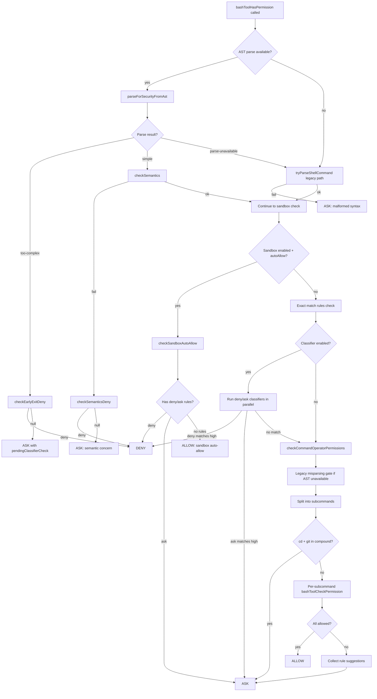
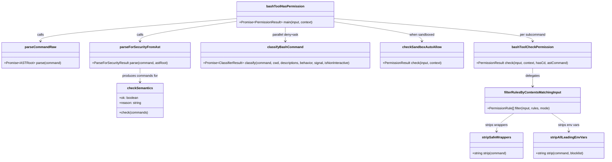
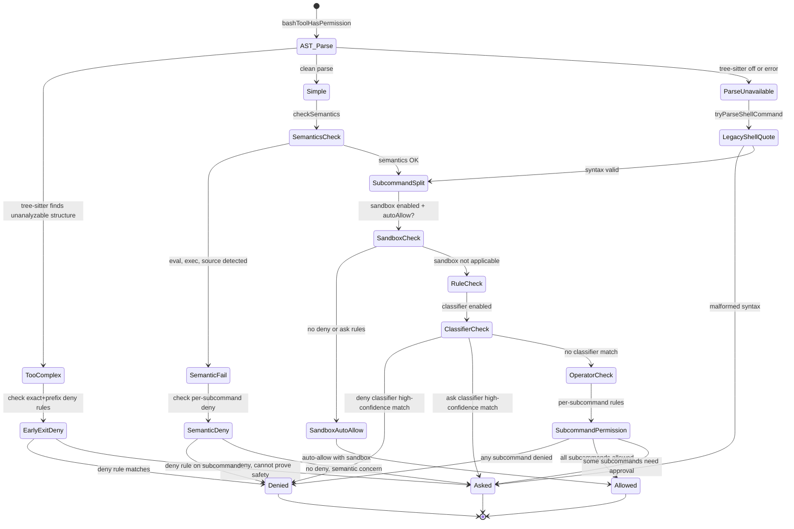

# The Bash Tool, Classifiers, and Sandboxing

## Overview

BashTool is the most security-sensitive tool in the cc harness. Unlike file-read or search tools, which are inherently read-only, a bash command can read files, write files, exfiltrate data, destroy repositories, and escalate privileges -- all in a single compound expression. The harness therefore devotes more code to deciding *whether* to run a bash command than to running it. The permission pipeline spans roughly 4,500 lines across eight modules: an AST-based security parser, a deterministic classifier, a rule-matching engine, a mode validator, a sandbox adapter, a path constraint checker, a destructive-pattern detector, and a read-only validator. This chapter traces that pipeline end to end, showing how each layer contributes to a defense-in-depth architecture that the HER terms "Command Risk Classification" (HER section 5, Pattern 10).

The pipeline's design principle is that risk classification must be deterministic. The harness parses tool call parameters using fixed rules rather than model judgment to determine risk level, which prevents the model from downgrading its own operations to avoid approval gates. A BashTool call to `rm -rf /` is classified as high-risk and blocked regardless of the model's stated intent; a call to `ls -la` is low-risk and auto-approved. The HER section 5 pattern enumerates three tiers: low-risk operations (read-only, auto-approved), medium-risk operations (modifications with limited scope, may require implicit approval), and high-risk operations (destructive or irreversible, require explicit human approval). Every function in cc's permission pipeline ultimately maps a command to one of these tiers.

Beyond the core permission pipeline, the BashTool subsystem also manages command semantics (interpreting non-zero exit codes like grep's "no matches found" as non-errors), destructive-command warnings (informational annotations in the permission dialog), sandbox integration (restricting filesystem and network access at the OS level), and a PowerShell variant that mirrors the same architecture with platform-specific adaptations. Each of these subsystems is covered in this chapter.

## Data structures and contracts

The classifier subsystem defines three types that govern the entire risk-classification pipeline. The `ClassifierResult` type captures the outcome of an LLM-based semantic classification, while `ClassifierBehavior` enumerates the three possible policy actions a classifier can recommend.

```typescript
// src/utils/permissions/bashClassifier.ts:L5-L12 — Classifier result and behavior types
export type ClassifierResult = {
  matches: boolean
  matchedDescription?: string
  confidence: 'high' | 'medium' | 'low'
  reason: string
}

export type ClassifierBehavior = 'deny' | 'ask' | 'allow'
```

The `matches` field indicates whether the command matched a classifier rule; `confidence` gates whether the match is acted upon (only `'high'`-confidence matches trigger auto-allow or auto-deny). A `medium`-confidence match is recorded for analytics but does not override the user's permission decision. The `ClassifierBehavior` type maps directly onto the three-tier risk model from HER section 5: `allow` for low-risk operations (auto-approved), `ask` for medium-risk operations (requires approval), and `deny` for high-risk operations (blocked outright). The `matchedDescription` field records which natural-language rule triggered the match, which is surfaced in the permission dialog and analytics events.

The `PermissionResult` type, defined in `src/utils/permissions/PermissionResult.ts`, extends this with a `behavior` field that includes `'passthrough'` -- meaning "no rule matched, escalate to the user." Every function in the permission pipeline returns a `PermissionResult`, and the pipeline's logic is entirely about which function returns first with a non-passthrough behavior. The type also carries an optional `decisionReason` (for audit trails and analytics), an optional `suggestions` array (permission rules the user can save to avoid future prompts), and an optional `updatedInput` (the sanitized input when the command is allowed with modifications).

The `BashTool` input schema, defined in `src/tools/BashTool/BashTool.tsx`, accepts a `command` string, optional `timeout`, optional `description`, optional `run_in_background`, and an internal-only `_simulatedSedEdit` field that is stripped from the model-facing schema to prevent the model from bypassing permission checks.

```typescript
// src/tools/BashTool/BashTool.tsx:L227-L247 — BashTool input schema
const fullInputSchema = lazySchema(() => z.strictObject({
  command: z.string().describe('The command to execute'),
  timeout: semanticNumber(z.number().optional()).describe(`Optional timeout in milliseconds (max ${getMaxTimeoutMs()})`),
  description: z.string().optional().describe(`Clear, concise description of what this command does...`),
  run_in_background: semanticBoolean(z.boolean().optional()).describe(`Set to true to run this command in the background...`),
  dangerouslyDisableSandbox: semanticBoolean(z.boolean().optional()).describe('Set this to true to dangerously override sandbox mode...'),
  _simulatedSedEdit: z.object({
    filePath: z.string(),
    newContent: z.string()
  }).optional().describe('Internal: pre-computed sed edit result from preview')
}));
```

The `dangerouslyDisableSandbox` field lets the model request an unsandboxed execution, but the sandbox adapter independently verifies whether unsandboxed commands are permitted by policy before honoring it. The `_simulatedSedEdit` field is never exposed to the model; it carries the result of a user-previewed sed edit from the permission dialog. The `lazySchema` wrapper defers schema construction until first use, avoiding the cost of `z.strictObject` compilation at module load time.

The `SAFE_ENV_VARS` set in `src/tools/BashTool/bashPermissions.ts:L378-L430` defines the allowlist of environment variables that are safe to strip from commands before permission matching. Variables like `LD_PRELOAD`, `PATH`, `PYTHONPATH`, and `NODE_OPTIONS` are explicitly excluded because they can alter which binary runs or inject code. The companion `ANT_ONLY_SAFE_ENV_VARS` set `src/tools/BashTool/bashPermissions.ts:L447-L497` includes variables like `KUBECONFIG` and `DOCKER_HOST` that are only stripped for internal users, with a security comment warning that stripping `DOCKER_HOST` defeats prefix-based permission restrictions by hiding the network endpoint from the permission check.

```typescript
// src/tools/BashTool/bashPermissions.ts:L196-L226 — Blocked shell and wrapper prefixes
const BARE_SHELL_PREFIXES = new Set([
  'sh', 'bash', 'zsh', 'fish', 'csh', 'tcsh', 'ksh', 'dash',
  'cmd', 'powershell', 'pwsh',
  'env', 'xargs',
  'nice', 'stdbuf', 'nohup', 'timeout', 'time',
  'sudo', 'doas', 'pkexec',
])
```

The `BARE_SHELL_PREFIXES` set prevents the system from ever suggesting permission rules like `Bash(bash:*)` or `Bash(sudo:*)`, because such rules would allow arbitrary code execution via `-c` or privilege escalation. The set includes `env` and `xargs` because `env bash -c "evil"` and `xargs bash -c "evil"` would both bypass a prefix-based allow rule. It also includes wrapper commands like `nice`, `stdbuf`, `nohup`, and `timeout` that `checkSemantics` strips to inspect the wrapped command; suggesting `Bash(nice:*)` would be approximately equivalent to `Bash(*)` because any command can be prefixed with `nice`.

The `MAX_SUBCOMMANDS_FOR_SECURITY_CHECK` constant `src/tools/BashTool/bashPermissions.ts:L103` caps the number of subcommands that the legacy `splitCommand_DEPRECATED` parser can produce before the system gives up and returns ask. Fifty is generous; legitimate user commands rarely split that wide. Above the cap, the system cannot prove safety, so it prompts the user.

The destructive-pattern configuration in `src/tools/BashTool/destructiveCommandWarning.ts:L12-L89` defines the `DESTRUCTIVE_PATTERNS` array, which pairs regular expressions with human-readable warning strings. These patterns cover git data loss (`git reset --hard`, `git push --force`, `git clean -f`), file deletion (`rm -rf`, `rm -f`), database destruction (`DROP TABLE`, `TRUNCATE`, `DELETE FROM` without WHERE), and infrastructure destruction (`kubectl delete`, `terraform destroy`).

## Control flow

### The permission pipeline

When the model emits a BashTool call, the harness invokes `bashToolHasPermission` in `src/tools/BashTool/bashPermissions.ts:L1663-L2622`. This function is the single entry point for all permission decisions. It proceeds through a strict sequence of checks, returning at the first non-passthrough result.



The pipeline begins with an AST-based security parse. When the tree-sitter bash grammar is available and the injection check is not disabled via the `CLAUDE_CODE_DISABLE_COMMAND_INJECTION_CHECK` environment variable, `parseCommandRaw` produces either a `simple` result (a list of `SimpleCommand` objects with resolved argv, no hidden substitutions) or a `too-complex` result (command substitution, control flow, or parser differentials). The `too-complex` result is fail-closed: it respects exact-match deny and ask rules via `checkEarlyExitDeny`, then falls through to ask, never to allow. The `simple` result proceeds to `checkSemantics`, which inspects AST-derived commands for dangerous builtins like `eval`, `exec`, and `source` that tokenize cleanly but are dangerous by name.

When the AST parse is unavailable (tree-sitter not loaded, feature-gated off, or the GrowthBook killswitch is active), the pipeline falls back to `tryParseShellCommand`, which uses shell-quote to validate syntax. Malformed commands return ask immediately with a reason like "Command contains malformed syntax that cannot be parsed."

A shadow-testing mode runs in parallel when the `TREE_SITTER_BASH_SHADOW` feature flag is active. In this mode, the tree-sitter parse runs and its results are logged for comparison against the legacy path, but the legacy path remains authoritative. This allows the team to measure divergence rates before making tree-sitter the default `src/tools/BashTool/bashPermissions.ts:L1707-L1739`.

### The classifier pipeline

The classifier pipeline sits inside `bashToolHasPermission` between the sandbox check and the command-operator check. When `isClassifierPermissionsEnabled()` returns true, the system runs deny and ask classifiers in parallel using `classifyBashCommand`. Each classifier compares the command against a list of natural-language descriptions (e.g., "commands that delete files," "commands that modify git history") using an LLM call. The result includes a `confidence` field; only `'high'`-confidence matches trigger action.



The classifier also runs speculatively. `startSpeculativeClassifierCheck` in `src/tools/BashTool/bashPermissions.ts:L1502-L1527` kicks off a `classifyBashCommand` call in parallel with pre-tool hooks and deny/ask classifiers, so the result is often ready before the user sees the permission dialog. If the classifier returns a high-confidence allow and the user has not yet interacted with the dialog, the system auto-approves via the `executeAsyncClassifierCheck` function `src/tools/BashTool/bashPermissions.ts:L1605-L1658`. The speculative results are stored in a module-level `Map<string, Promise<ClassifierResult>>` and consumed by `consumeSpeculativeClassifierCheck` to avoid duplicate API calls.

The external build stub in `src/utils/permissions/bashClassifier.ts` disables the classifier entirely: `isClassifierPermissionsEnabled()` returns `false`, and `classifyBashCommand` always returns `{ matches: false, confidence: 'high', reason: 'This feature is disabled' }`. This is an ANT-only feature that relies on internal LLM infrastructure. The stub exists so that external builds compile without the classifier backend.

### Rule matching and wrapper stripping

The `filterRulesByContentsMatchingInput` function in `src/tools/BashTool/bashPermissions.ts:L778-L935` is the core of rule-based permission matching. It normalizes the command before comparing it against deny, ask, and allow rules. The normalization pipeline has two phases:

1. **Phase 1: Strip safe env vars and comments.** The `stripSafeWrappers` function iteratively strips full-line comments and `SAFE_ENV_VARS`-allowlisted env var prefixes. This allows a rule like `Bash(npm install:*)` to match `GOOS=linux npm install foo`. Only env vars in the safe-list are stripped; `DOCKER_HOST=evil docker ps` does NOT match `Bash(docker ps:*)` because `DOCKER_HOST` is not in `SAFE_ENV_VARS`.

2. **Phase 2: Strip wrapper commands.** Wrapper commands like `timeout`, `time`, `nice`, `nohup`, and `stdbuf` are stripped because they use `execvp` to run their arguments. This allows a rule like `Bash(npm install:*)` to match `timeout 10 npm install foo`.

```typescript
// src/tools/BashTool/bashPermissions.ts:L524-L560 — stripSafeWrappers wrapper patterns
export function stripSafeWrappers(command: string): string {
  // SECURITY: Use [ \t]+ not \s+ — \s matches \n/\r which are command
  // separators in bash. Matching across a newline would strip the wrapper from
  // one line and leave a different command on the next line for bash to execute.
  const SAFE_WRAPPER_PATTERNS = [
    /^timeout[ \t]+(?:(?:--(?:foreground|preserve-status|verbose)|--(?:kill-after|signal)=[A-Za-z0-9_.+-]+|--(?:kill-after|signal)[ \t]+[A-Za-z0-9_.+-]+|-v|-[ks][ \t]+[A-Za-z0-9_.+-]+|-[ks][A-Za-z0-9_.+-]+)[ \t]+)*(?:--[ \t]+)?\d+(?:\.\d+)?[smhd]?[ \t]+/,
    /^time[ \t]+(?:--[ \t]+)?/,
    /^nice(?:[ \t]+-n[ \t]+-?\d+|[ \t]+-\d+)?[ \t]+(?:--[ \t]+)?/,
    /^stdbuf(?:[ \t]+-[ioe][LN0-9]+)+[ \t]+(?:--[ \t]+)?/,
    /^nohup[ \t]+(?:--[ \t]+)?/,
  ] as const
  // ...
}
```

The security comment about `\s` vs `[ \t]+` is critical: `\s` matches newlines, which bash treats as command separators. A regex that matched across a newline would strip the wrapper from one line and leave a different command on the next line for bash to execute. This is one of several places where the difference between horizontal and vertical whitespace is a security boundary. The same concern appears in the `ENV_VAR_PATTERN` regex `src/tools/BashTool/bashPermissions.ts:L575`, where the trailing whitespace must be `[ \t]+` rather than `\s+`.

For deny and ask rules, the system uses the more aggressive `stripAllLeadingEnvVars` function `src/tools/BashTool/bashPermissions.ts:L733-L776`, which strips all env var prefixes regardless of the safe-list. This prevents bypass via `FOO=bar denied_command`, where `FOO` is not in the safe-list. The function accepts an optional `blocklist` parameter; when `BINARY_HIJACK_VARS` (the regex `/^(LD_|DYLD_|PATH$)/`) is passed as the blocklist, variables like `LD_PRELOAD` are not stripped because stripping them would hide a binary-hijack attack from the exclude-commands matcher. The two stripping functions are composed iteratively to a fixed point, handling interleaved patterns like `nohup FOO=bar timeout 5 claude` where both wrappers and env vars alternate.

The `bashToolCheckPermission` function `src/tools/BashTool/bashPermissions.ts:L1050-L1178` orchestrates the per-subcommand permission check. It evaluates rules in strict priority order: exact-match deny, then exact-match ask, then exact-match allow, then prefix/wildcard deny, then prefix/wildcard ask, then path constraints, then prefix/wildcard allow, then sed constraints, then mode-specific handling, and finally read-only classification. This ordering ensures that explicit deny rules take precedence over all other checks, and that path constraints are evaluated before allow rules to prevent bypass via absolute paths outside the project directory.

```typescript
// src/tools/BashTool/bashPermissions.ts:L266-L295 — suggestion generation for exact commands
function suggestionForExactCommand(command: string): PermissionUpdate[] {
  const heredocPrefix = extractPrefixBeforeHeredoc(command)
  if (heredocPrefix) {
    return sharedSuggestionForPrefix(BashTool.name, heredocPrefix)
  }
  if (command.includes('\n')) {
    const firstLine = command.split('\n')[0]!.trim()
    if (firstLine) {
      return sharedSuggestionForPrefix(BashTool.name, firstLine)
    }
  }
  const prefix = getSimpleCommandPrefix(command)
  if (prefix) {
    return sharedSuggestionForPrefix(BashTool.name, prefix)
  }
  return sharedSuggestionForExactCommand(BashTool.name, command)
}
```

The `suggestionForExactCommand` function generates permission rule suggestions that appear in the "don't ask again" prompt. It extracts a stable prefix rather than suggesting an exact-match rule, because exact-match rules rarely match future invocations with different arguments. For heredoc commands, the prefix before `<<` is extracted; for multiline commands, the first line is used; for single-line commands, the `getSimpleCommandPrefix` function `src/tools/BashTool/bashPermissions.ts:L161-L188` extracts the command and subcommand (e.g., `git commit` from `git commit -m "fix typo"`).

### Sandbox and permission decisions

The sandbox system operates as an additional permission layer. When sandboxing is enabled and `autoAllowBashIfSandboxed` is on, `checkSandboxAutoAllow` `src/tools/BashTool/bashPermissions.ts:L1270-L1359` checks whether the command has explicit deny or ask rules. If it does, those rules take precedence (deny is never downgraded). If it does not, the command is auto-allowed with the reason "Auto-allowed with sandbox." The sandbox adapter itself enforces filesystem and network restrictions independently; the permission system's auto-allow is a convenience, not the security boundary.



The `shouldUseSandbox` function in `src/tools/BashTool/shouldUseSandbox.ts:L130-L153` decides whether a given command will be sandboxed. It checks three conditions: (1) sandboxing is enabled globally via `SandboxManager.isSandboxingEnabled()`, (2) the model has not requested `dangerouslyDisableSandbox` and unsandboxed commands are not permitted by policy, and (3) the command does not match any user-configured excluded commands from `settings.sandbox.excludedCommands`. The excluded-commands check uses the same iterative wrapper-stripping and env-var-stripping logic as the permission rule matcher, ensuring that `timeout 300 FOO=bar bazel run` matches a `bazel:*` exclusion pattern.

The `containsExcludedCommand` function `src/tools/BashTool/shouldUseSandbox.ts:L21-L128` splits compound commands into subcommands and checks each one against excluded patterns. It uses fixed-point iteration of both `stripAllLeadingEnvVars` and `stripSafeWrappers` to handle interleaved wrapper and env var prefixes, matching the approach in `filterRulesByContentsMatchingInput`. The comment at the top of `shouldUseSandbox.ts` is explicit: "excludedCommands is a user-facing convenience feature, not a security boundary. It is not a security bug to be able to bypass excludedCommands -- the sandbox permission system (which prompts users) is the actual security control."

The `checkSandboxAutoAllow` function also handles a subtle compound-command case: for a command like `echo hello && rm -rf /`, prefix deny rules like `Bash(rm:*)` will not match the full compound command (it does not start with "rm"). The function splits the compound into subcommands and checks each individually, ensuring that deny rules on any subcommand take effect. Critically, subcommand deny checks run before full-command ask checks; otherwise, a wildcard ask rule matching the full command would return ask before a prefix deny rule on a subcommand gets checked, downgrading a deny to an ask `src/tools/BashTool/bashPermissions.ts:L1296-L1336`.

### Command operator permissions

The `checkCommandOperatorPermissions` function in `src/tools/BashTool/bashCommandHelpers.ts:L181-L202` handles piped and compound commands. When the command contains pipe operators, it splits the command into pipe segments, strips output redirections from each segment, and checks each segment through the full permission pipeline. The stripping of redirections is necessary because redirection targets are filenames, not commands; without stripping, `echo hello > output.txt` would treat `output.txt` as a command argument and potentially fail the permission check.

The function also checks for unsafe compound commands (subshells, command groups) using `isUnsafeCompoundCommand_DEPRECATED` or the tree-sitter-derived `compoundStructure` analysis. Unsafe compounds always return ask, because the system cannot statically analyze the control flow within subshells or command groups.

The `segmentedCommandPermissionResult` function `src/tools/BashTool/bashCommandHelpers.ts:L23-L156` implements cross-segment cd+git detection. When cd and git appear in different pipe segments (e.g., `cd sub && echo | git status`), each segment is checked independently and neither triggers the cd+git check in `bashToolHasPermission`. The cross-segment check splits each segment into subcommands and checks all of them for cd and git commands, blocking the compound if both are present.

### Mode validation

The `checkPermissionMode` function in `src/tools/BashTool/modeValidation.ts:L72-L109` provides mode-specific permission handling. In `acceptEdits` mode, filesystem commands like `mkdir`, `touch`, `rm`, `mv`, `cp`, and `sed` are auto-allowed, letting the model make filesystem modifications without prompting. The allowed-commands list is defined as `ACCEPT_EDITS_ALLOWED_COMMANDS` `src/tools/BashTool/modeValidation.ts:L7-L16`. Other modes (`bypassPermissions`, `dontAsk`) are handled elsewhere in the permission flow and return passthrough from this function.

```typescript
// src/tools/BashTool/modeValidation.ts:L7-L21 — acceptEdits allowed commands
const ACCEPT_EDITS_ALLOWED_COMMANDS = [
  'mkdir',
  'touch',
  'rm',
  'rmdir',
  'mv',
  'cp',
  'sed',
] as const

type FilesystemCommand = (typeof ACCEPT_EDITS_ALLOWED_COMMANDS)[number]

function isFilesystemCommand(command: string): command is FilesystemCommand {
  return ACCEPT_EDITS_ALLOWED_COMMANDS.includes(command as FilesystemCommand)
}
```

The `isFilesystemCommand` type guard ensures that only the exact command names in the allowlist are auto-approved. A command like `rmdir` is allowed but `rmdir -p /` is also allowed (the base command is `rmdir`). The `validateCommandForMode` function extracts the base command from the trimmed input and checks it against the allowlist. If the current mode is not `acceptEdits` or the base command is not in the allowlist, the function returns passthrough.

The permission modes themselves are defined in `src/utils/permissions/PermissionMode.ts:L44-L91`, with configurations for `default` (ask for everything), `plan` (read-only), `acceptEdits` (auto-allow filesystem writes), `bypassPermissions` (skip all checks), `dontAsk` (auto-approve based on existing rules), and `auto` (ANT-only, classifier-driven). The `auto` mode is gated behind the `TRANSCRIPT_CLASSIFIER` feature flag and is excluded from external permission modes via the `isExternalPermissionMode` function `src/utils/permissions/PermissionMode.ts:L97-L105`.

### Destructive command warnings

The `getDestructiveCommandWarning` function in `src/tools/BashTool/destructiveCommandWarning.ts:L95-L102` is purely informational: it does not affect permission logic or auto-approval. It scans commands against a list of patterns for dangerous git operations, file operations, database operations, and infrastructure destruction. The git patterns are carefully scoped: `git push --force` is detected only when `--force` or `--force-with-lease` appears as a flag (not as a positional argument), and `git clean -f` is only flagged when `-f` appears without `-n` or `--dry-run`. The `rm` patterns detect `-rf`, `-fr`, `-r`, and `-f` as separate patterns to provide specific warnings.

### Command semantics

The `interpretCommandResult` function in `src/tools/BashTool/commandSemantics.ts:L124-L140` interprets exit codes based on the semantic meaning of the command. For `grep` and `rg`, exit code 1 means "no matches found" (not an error); exit code 2 and above indicate actual errors. For `diff`, exit code 1 means "files differ" (not an error). For `test` and `[`, exit code 1 means "condition is false" (not an error). All other commands use the default semantic: only exit code 0 is success. This prevents the model from interpreting `grep`'s "no matches found" exit code as an error and retrying with different arguments, which would waste tokens and potentially produce incorrect results.

### The PowerShell variant

The PowerShell tool mirrors the Bash tool's architecture with platform-specific adaptations. `PowerShellTool` in `src/tools/PowerShellTool/PowerShellTool.tsx` reuses `shouldUseSandbox` and `BackgroundHint` from BashTool but implements its own permission checking via `powershellToolHasPermission` in `src/tools/PowerShellTool/powershellPermissions.ts`. It also reuses the `BashTool`'s sandbox decision logic by importing `shouldUseSandbox` directly `src/tools/PowerShellTool/PowerShellTool.tsx:L36`.

The PowerShell mode validation in `src/tools/PowerShellTool/modeValidation.ts` handles `acceptEdits` mode with a different set of allowed cmdlets: `Set-Content`, `Add-Content`, `Remove-Item`, and `Clear-Content`. It also includes a symlink-creation guard via `isSymlinkCreatingCommand` `src/tools/PowerShellTool/modeValidation.ts:L82-L117`, which detects `New-Item -ItemType SymbolicLink|Junction|HardLink` (including parameter abbreviations like `-it:Junction`) because symlinks poison subsequent path resolution -- a relative path through the link resolves to the link target, not the validator's view. The guard handles PowerShell-specific complexities: parameter abbreviation (`-it` for `-ItemType`), Unicode dash prefixes (en-dash, em-dash, horizontal-bar), backtick escapes (`-Item\`Type`), and colon-bound values (`-it:Junction`).

PowerShell's case-insensitive cmdlet matching and alias resolution add complexity that bash does not have. The `resolveToCanonical` function normalizes aliases (`rm` to `remove-item`, `ac` to `add-content`) and handles Unicode dash prefixes in parameter names, which the PowerShell tokenizer treats as parameter markers. The `PS_TOKENIZER_DASH_CHARS` set defines the characters that can serve as parameter prefixes in PowerShell, and the mode validation normalizes all of them to ASCII `-` before comparison `src/tools/PowerShellTool/modeValidation.ts:L94-L98`.

The PowerShell permission system also includes a git-internal-paths guard that checks whether any argument to write cmdlets (like `Set-Content`, `New-Item`, `Out-File`) is a git-internal path (hooks/, refs/, objects/, HEAD). This prevents the model from planting malicious git hooks or modifying repository metadata. The guard is defined via `GIT_SAFETY_WRITE_CMDLETS` in `src/tools/PowerShellTool/powershellPermissions.ts:L70-L84` and `GIT_SAFETY_ARCHIVE_EXTRACTORS` `src/tools/PowerShellTool/powershellPermissions.ts:L96-L112`, which blocks archive-extraction commands (`tar`, `unzip`, `7z`) preceding git because archive contents are opaque and could contain git-internal paths that would be extracted after the bare-repo check but before git runs (a TOCTOU vulnerability).

## Edge cases and failure modes

**Compound command fanout (CC-643).** The legacy `splitCommand_DEPRECATED` function can produce exponentially many subcommands on complex compound commands. Each subcommand then runs tree-sitter parse plus approximately 20 validators plus `logEvent`, and the resulting microtask chain starves the event loop -- REPL freeze at 100% CPU with no `epoll_wait`. The fix is `MAX_SUBCOMMANDS_FOR_SECURITY_CHECK = 50` `src/tools/BashTool/bashPermissions.ts:L103`. Above this cap, the system returns ask (the safe default: it cannot prove safety, so it prompts). Only the legacy path can explode; the AST path returns a bounded list or short-circuits to `too-complex` for structures it cannot represent.

**cd + git compound commands.** A compound command like `cd /malicious/dir && git status` can escape the sandbox if the malicious directory contains a bare git repo with `core.fsmonitor` set. The harness blocks all compound commands containing both `cd` and `git` `src/tools/BashTool/bashPermissions.ts:L2209-L2225`, requiring explicit approval. The `isNormalizedGitCommand` and `isNormalizedCdCommand` functions strip safe wrappers and env var prefixes before matching to prevent bypasses like `FORCE_COLOR=1 cd sub` or `timeout 5 git status`. The `isNormalizedCdCommand` function also matches `pushd` and `popd`, which change the working directory just like `cd` `src/tools/BashTool/bashPermissions.ts:L2603-L2611`.

**Timeout flag value injection.** The command `timeout -k$(id) 10 ls` would previously pass the wrapper-stripping regex because `[^ \t]+` in the value pattern matched `$`, `(`, `)`, and backticks. After bash expansion, `$(id)` evaluates before `timeout` runs, producing the UID. The fix restricts timeout flag values to an allowlist regex `[A-Za-z0-9_.+-]+` `src/tools/BashTool/bashPermissions.ts:L620`, since signal names are `TERM/KILL/9` and durations are `5/5s/10.5`. Any flag value containing shell metacharacters fails the regex and prevents the wrapper from being stripped, causing the command to be evaluated without the timeout wrapper removed.

**Heredoc exact-match rules.** Heredoc commands contain multi-line content that changes each invocation, making exact-match rules useless. The `extractPrefixBeforeHeredoc` function `src/tools/BashTool/bashPermissions.ts:L307-L337` extracts the stable prefix before the `<<` operator and suggests a prefix rule instead of an exact match. For example, `git commit -m "$(cat <<'EOF'\nfix typo\nEOF\n)"` produces a `git commit` prefix suggestion rather than an exact-match rule containing the full heredoc body.

**Pipeline segment allow bypass.** When pipe segment processing returns allow, the system must still validate the original command's output redirections. A command like `echo 'x' | xargs printf '%s' >> /tmp/file` would have both segments allowed (echo and xargs printf) but the `>>` redirection would bypass validation. The fix adds a post-allow `checkPathConstraints` call on the original input `src/tools/BashTool/bashPermissions.ts:L1992-L2056`. This check also verifies that the original command does not contain dangerous patterns (backticks, `$()`) in redirect targets, since those are stripped from pipe segments before checking.

**Bun DCE complexity cliff.** The `bashToolHasPermission` function is right at Bun's dead-code elimination complexity threshold. Import aliases (`import { X as Y }`) inside the import block count toward this budget; when they push it over the threshold, Bun can no longer prove `feature('BASH_CLASSIFIER')` is a constant and silently evaluates the ternaries to `false`, dropping every `pendingClassifierCheck` spread. The fix uses top-level const rebindings instead of import aliases `src/tools/BashTool/bashPermissions.ts:L81-L89`. The same DCE constraint explains why several helper functions (`checkEarlyExitDeny`, `checkSemanticsDeny`, `filterCdCwdSubcommands`) are extracted from the main function body rather than inlined.

**Wildcard rule compound bypass.** In exact-match mode, wildcard rules must not match because wildcards on unparsed commands allow `foo *` to match `foo arg && curl evil.com` since `.*` matches operators. The `filterRulesByContentsMatchingInput` function enforces this: when `matchMode === 'exact'`, wildcard rules return false unconditionally `src/tools/BashTool/bashPermissions.ts:L920-L922`. Wildcard matching only occurs after splitting into individual subcommands in prefix mode.

**Prefix rules on compound commands.** Prefix rules like `Bash(cd:*)` must not match `cd /path && python3 evil.py`. The compound-command guard checks whether `splitCommand(cmd).length > 1` and rejects prefix and wildcard matches on compound commands `src/tools/BashTool/bashPermissions.ts:L886-L893`. This guard exists because shell escaping can defeat the initial split: `cd src\&\& python3 hello.py` splits as a single command that starts with `cd `.

## Where cc diverges from the published pattern

HER section 5, Pattern 10 prescribes a three-tier risk classification (low/medium/high) with deterministic pre-parsing. cc implements this but adds several layers that the pattern does not anticipate:

**Dual classification systems.** cc uses both a deterministic rule-matching engine (deny/ask/allow rules with exact, prefix, and wildcard matching) and an LLM-based classifier (`classifyBashCommand`) that evaluates natural-language descriptions of risk categories. The HER pattern implies a single classification step; cc runs both in parallel, with the LLM classifier serving as a speculative optimization that can auto-approve before the user responds to the permission dialog. The LLM classifier is gated behind `isClassifierPermissionsEnabled()` and is ANT-only in the current build. The external build stub disables it entirely.

**Fixed-point wrapper stripping.** The HER pattern does not address the problem of command obfuscation via wrapper commands and environment variable prefixes. cc's iterative fixed-point composition of `stripSafeWrappers` and `stripAllLeadingEnvVars` handles interleaved patterns like `nohup FOO=bar timeout 5 claude` that a single-pass approach would miss. The asymmetry between allow-rule stripping (conservative, safe-list only) and deny-rule stripping (aggressive, all env vars) is also not addressed in the pattern. This design choice prevents `FOO=bar denied_command` bypasses without opening `DOCKER_HOST=evil docker ps` holes.

**AST-based structural validation.** The HER pattern assumes a regex-based or rule-based pre-parsing step. cc uses tree-sitter to produce an AST, which catches structural tricks that regex-based parsers miss (e.g., `find -exec {} \; | grep x` where the backslash-semicolon is not a command injection). The AST path also produces bounded subcommand lists, avoiding the exponential fanout that the legacy `splitCommand_DEPRECATED` can produce. Shadow testing allows the team to measure divergence rates between the tree-sitter and legacy paths before making the AST path authoritative.

**Checkpoint-restore side effects.** HER section 6.16 identifies the ACRFence vulnerability: agents re-synthesize subtly different requests after restore, causing duplicate payments and unauthorized credential reuse. cc's bash permission system does not currently record irreversible tool effects or enforce replay-or-fork semantics. A command that was approved in one session will be re-evaluated from scratch on restore, which is safe from a permission standpoint but does not prevent the Action Replay and Authority Resurrection attacks described in the ACRFence paper. For agents running multi-hour tasks with external side effects, recording which commands have produced irreversible effects and enforcing idempotency keys on external API calls would be essential mitigations.

**Indirect prompt injection.** HER section 12.4 identifies indirect prompt injection as a critical threat: malicious instructions embedded in files or tool outputs that the agent follows because it cannot distinguish them from legitimate context. cc's deterministic classification is a partial mitigation -- the harness does not trust the model's judgment for security-critical decisions -- but the model could still be influenced by injected content to construct commands that happen to pass the classifier. The sandbox system provides an additional layer of defense by restricting filesystem and network access regardless of whether the command was approved. The HER recommends input sanitization on all external content and treating file contents and tool outputs as untrusted, which cc implements partially through the `isReadOnly` classification (read-only commands are auto-approved because they cannot produce side effects even if the model was influenced by injected content).

## Developer takeaways for building a long-running agent

The bash permission pipeline demonstrates that shell access demands more defensive code than any other tool in the harness. Every layer -- AST parsing, classifier evaluation, rule matching, sandbox gating, mode validation, path constraints, destructive-pattern detection -- exists because a previous layer was bypassed in production. The most important lesson is that command normalization must be iterative, not single-pass: wrappers and env vars can interleave, and a fixed-point composition catches patterns that any sequential composition misses. The second lesson is that deny rules must be harder to circumvent than allow rules: stripping all env vars for deny matching while restricting allow matching to a safe-list prevents `FOO=bar denied_command` bypasses without opening `DOCKER_HOST=evil docker ps` holes. The third lesson is that the cost of a wrong allow exceeds the cost of a wrong deny by orders of magnitude, so every ambiguity in the pipeline should resolve to ask, and every optimization (speculative classifier, sandbox auto-allow) must preserve the invariant that an explicit deny rule is never downgraded to ask or allow. For agents running multi-hour tasks with external side effects, recording which commands have produced irreversible effects and enforcing idempotency keys on external API calls is essential to prevent the checkpoint-restore attacks identified in HER section 6.16. The ACRFence paper's replay-or-fork semantics provide a model for how to handle this: when restoring from a checkpoint, the agent must either replay the exact same command that was previously approved or fork the execution path with fresh approval.
