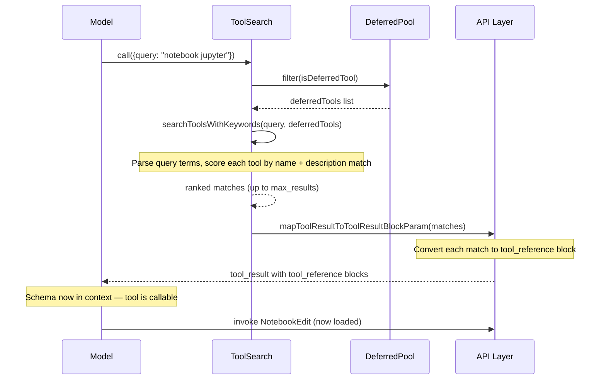
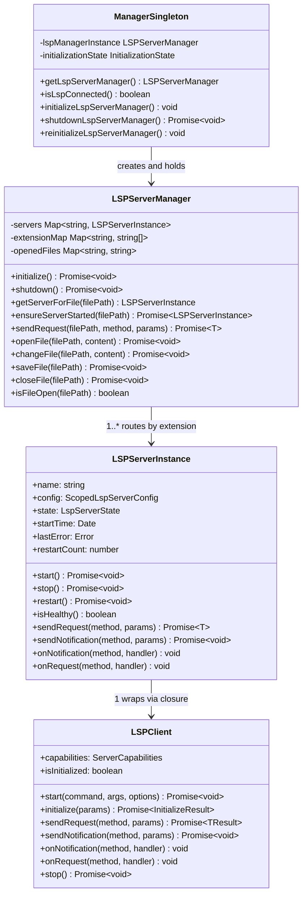

# Search, LSP, and Code Analysis Tools

## Overview

Claude Code's tool catalog spans dozens of capabilities -- file editing, bash execution, web search, notebook manipulation, LSP queries, and more. Exposing every tool's full schema at session start would saturate the context window with tool descriptions, degrading the model's ability to discriminate between similar tools. This chapter examines three subsystems that solve this problem from different angles: the GrepTool provides high-fidelity content search using ripgrep as its backend; the LSPTool exposes Language Server Protocol intelligence through a deferred-tool gateway; and the ToolSearchTool implements progressive tool expansion, loading specialized tools on demand rather than upfront. Together they form the search-and-analysis backbone of the harness, and their design embodies HER Pattern 9 (Progressive Tool Expansion), which holds that an agent should start with fewer than twenty tools and activate more contextually.

The Tool Explosion failure mode described in HER section 6.8 is direct: when too many tools compete for attention in the context window, the model enters "the dumb zone," making worse selections than it would with a smaller, focused set. The fix is progressive tool expansion -- a base toolset of file read, file edit, grep, bash, and glob handles the majority of agent work, while specialized tools like LSP, notebook editing, and MCP server tools are activated only when the task requires them. This base-toolset principle is not a soft guideline: the `isDeferredTool` function and the auto-threshold logic in `src/utils/toolSearch.ts` enforce it at the infrastructure level, ensuring that no session begins with an overwhelming number of tool schemas regardless of how many MCP servers a project configures.

## Data structures and contracts

The deferral decision begins with properties on the `Tool` type itself. Each tool declares `shouldDefer`, `alwaysLoad`, `isMcp`, and `isLsp` fields that the dispatch pipeline reads to decide whether the tool's schema appears in the initial prompt or must be fetched through ToolSearch.

```
// src/Tool.ts:L436-L449 — Tool deferral and opt-out fields
  isMcp?: boolean
  isLsp?: boolean
  /**
   * When true, this tool is deferred (sent with defer_loading: true) and requires
   * ToolSearch to be used before it can be called.
   */
  readonly shouldDefer?: boolean
  /**
   * When true, this tool is never deferred — its full schema appears in the
   * initial prompt even when ToolSearch is enabled. For MCP tools, set via
   * `_meta['anthropic/alwaysLoad']`. Use for tools the model must see on
   * turn 1 without a ToolSearch round-trip.
   */
  readonly alwaysLoad?: boolean
```

The `shouldDefer` field marks a tool as requiring ToolSearch before it can be invoked. The `alwaysLoad` field is an explicit opt-out: tools that set this to true appear in the initial prompt with full schema regardless of deferral rules. MCP tools can set this via `_meta['anthropic/alwaysLoad']`. The `isMcp` flag causes all MCP tools to be deferred by default, since they are workflow-specific integrations that vary per project.

The `isDeferredTool` function in the ToolSearch prompt module encodes the full deferral policy:

```
// src/tools/ToolSearchTool/prompt.ts:L62-L108 — Deferred tool classification logic
export function isDeferredTool(tool: Tool): boolean {
  // Explicit opt-out via _meta['anthropic/alwaysLoad'] — tool appears in the
  // initial prompt with full schema. Checked first so MCP tools can opt out.
  if (tool.alwaysLoad === true) return false

  // MCP tools are always deferred (workflow-specific)
  if (tool.isMcp === true) return true

  // Never defer ToolSearch itself — the model needs it to load everything else
  if (tool.name === TOOL_SEARCH_TOOL_NAME) return false

  // Fork-first experiment: Agent must be available turn 1, not behind ToolSearch.
  if (feature('FORK_SUBAGENT') && tool.name === AGENT_TOOL_NAME) {
    type ForkMod = typeof import('../AgentTool/forkSubagent.js')
    const m = require('../AgentTool/forkSubagent.js') as ForkMod
    if (m.isForkSubagentEnabled()) return false
  }

  // ...
  return tool.shouldDefer === true
}
```

The function applies a priority-ordered rule chain: `alwaysLoad` opt-out is checked first, then MCP deferral, then ToolSearch self-exclusion, then feature-flag-driven exceptions like the fork-first Agent tool, and finally the `shouldDefer` property on the tool definition. This ordering means a tool author can mark `shouldDefer: true` but still override it with `alwaysLoad: true` if the model needs the schema on turn 1.

The LSPTool declares both `shouldDefer: true` and `searchHint` so that ToolSearch can match it when the model asks for "code intelligence" capabilities:

```
// src/tools/LSPTool/LSPTool.ts:L127-L139 — LSPTool deferral and metadata
export const LSPTool = buildTool({
  name: LSP_TOOL_NAME,
  searchHint: 'code intelligence (definitions, references, symbols, hover)',
  maxResultSizeChars: 100_000,
  isLsp: true,
  async description() {
    return DESCRIPTION
  },
  userFacingName,
  shouldDefer: true,
  isEnabled() {
    return isLspConnected()
  },
```

The `searchHint` field provides curated keywords that ToolSearch scores more heavily than generic tool description matches. The `isEnabled` guard tied to `isLspConnected()` means the tool is only usable when at least one language server has successfully initialized.

The ToolSearchTool's own input schema accepts a query string and an optional result cap:

```
// src/tools/ToolSearchTool/ToolSearchTool.ts:L21-L34 — ToolSearch input schema
export const inputSchema = lazySchema(() =>
  z.object({
    query: z
      .string()
      .describe(
        'Query to find deferred tools. Use "select:<tool_name>" for direct selection, or keywords to search.',
      ),
    max_results: z
      .number()
      .optional()
      .default(5)
      .describe('Maximum number of results to return (default: 5)'),
  }),
)
```

The `query` field supports three forms: `select:Read,Edit,Grep` for direct name-based selection, plain keywords like `notebook jupyter` for relevance-ranked search, and `+slack send` for required-term filtering. The `max_results` default of 5 limits the context cost of each search round-trip.

The output schema returns the matched tool names, the original query, the total count of deferred tools, and optional pending MCP server information:

```
// src/tools/ToolSearchTool/ToolSearchTool.ts:L37-L45 — ToolSearch output schema
export const outputSchema = lazySchema(() =>
  z.object({
    matches: z.array(z.string()),
    query: z.string(),
    total_deferred_tools: z.number(),
    pending_mcp_servers: z.array(z.string()).optional(),
  }),
)
```

When matches are found, the `mapToolResultToToolResultBlockParam` method converts each match into a `tool_reference` block, which the API layer expands into the full tool schema definition. When no matches are found and MCP servers are still connecting, the `pending_mcp_servers` field tells the model to retry shortly.

## Control flow

### ToolSearch: from query to loaded tool

When the model invokes ToolSearch, the `call` method receives the query and the full tool set. It partitions the tools into deferred and loaded sets, then dispatches to either a `select:` handler or the keyword search engine.



The keyword search engine in `searchToolsWithKeywords` implements a multi-signal scoring system. It parses tool names into searchable parts -- splitting MCP tool names like `mcp__gitlab__create_issue` into `["gitlab", "create", "issue"]` and CamelCase names like `NotebookEdit` into `["notebook", "edit"]`. Each query term is matched against these parts, the tool description, and the `searchHint` field with different weights: exact part matches score 10-12 points, substring matches score 5-6, searchHint matches score 4, and description word-boundary matches score 2.

```
// src/tools/ToolSearchTool/ToolSearchTool.ts:L186-L302 — Keyword search with multi-signal scoring
async function searchToolsWithKeywords(
  query: string,
  deferredTools: Tools,
  tools: Tools,
  maxResults: number,
): Promise<string[]> {
  const queryLower = query.toLowerCase().trim()

  // Fast path: if query matches a tool name exactly, return it directly.
  const exactMatch =
    deferredTools.find(t => t.name.toLowerCase() === queryLower) ??
    tools.find(t => t.name.toLowerCase() === queryLower)
  if (exactMatch) {
    return [exactMatch.name]
  }

  // If query looks like an MCP tool prefix (mcp__server), find matching tools.
  if (queryLower.startsWith('mcp__') && queryLower.length > 5) {
    const prefixMatches = deferredTools
      .filter(t => t.name.toLowerCase().startsWith(queryLower))
      .slice(0, maxResults)
      .map(t => t.name)
    if (prefixMatches.length > 0) {
      return prefixMatches
    }
  }

  // ... required/optional term partitioning, scoring, and ranking
  const scored = await Promise.all(
    candidateTools.map(async tool => {
      // ... per-term scoring with weights for name parts, hints, descriptions
      return { name: tool.name, score }
    }),
  )

  return scored
    .filter(item => item.score > 0)
    .sort((a, b) => b.score - a.score)
    .slice(0, maxResults)
    .map(item => item.name)
}
```

The fast path for exact name matches handles a common pattern: after compaction or in subagent contexts, the model may use a bare tool name instead of the `select:` prefix. The function checks the deferred pool first, then falls back to the full tool set -- selecting an already-loaded tool is a harmless no-op that lets the model proceed without retry churn.

### LSP client lifecycle

The LSP subsystem follows a lazy-initialization pattern. The singleton manager is created synchronously during startup but initializes its server configurations asynchronously. Individual server instances are not started until the first request targets a file they handle.



The `LSPServerManager` is a factory function that encapsulates private state via closures rather than a class. It maintains three core maps: `servers` maps server names to `LSPServerInstance` objects, `extensionMap` maps file extensions to server names for request routing, and `openedFiles` tracks which files have been opened on which servers to avoid redundant `textDocument/didOpen` notifications. The routing logic in `getServerForFile` resolves a file path to its server by extracting the file extension, looking it up in `extensionMap`, and returning the first registered server for that extension. When multiple servers handle the same extension, the first-registered server wins, though the code notes that a priority system could be added later.

The `LSPServerInstance` manages a single language server process. Its state machine follows the transitions `stopped -> starting -> running -> stopping -> stopped`, with an `error` state reachable from any other state on failure. The instance enforces a configurable `maxRestarts` limit (default 3) to prevent unbounded restart loops on persistently crashing servers. The `start` method sends full `InitializeParams` including client capabilities for hover, definition, references, document symbols, and call hierarchy. It also declares `positionEncodings: ['utf-16']` in the general capabilities section, matching the default encoding used by most language servers. The `workspaceFolders` field in the initialization parameters provides the workspace URI, while deprecated `rootPath` and `rootUri` fields are still included for compatibility with older servers like typescript-language-server.

The singleton manager module in `src/services/lsp/manager.ts` orchestrates the lifecycle of the `LSPServerManager` instance. The `initializeLspServerManager` function creates the manager synchronously and starts its async initialization in the background, using a generation counter to invalidate stale initialization promises. This prevents a race where a re-initialization call overwrites the state of an in-flight initialization. The `isLspConnected` function, which backs `LSPTool.isEnabled()`, checks that the initialization state is not `failed` and that at least one server exists in a non-error state.

The `LSPClient` wraps the `vscode-jsonrpc` library and manages a child process communicating over stdio. It handles spawn errors by waiting for the `spawn` event before using streams, preventing unhandled promise rejections when the command is not found. The client also supports lazy handler registration: notification and request handlers registered before the connection is ready are queued in `pendingHandlers` and `pendingRequestHandlers` arrays, then applied when the connection starts. This is essential because the `registerLSPNotificationHandlers` function in `passiveFeedback.ts` registers its diagnostic handlers immediately after the manager is created, before any server has started.

### LSPTool call flow

When the model invokes the LSPTool after loading it through ToolSearch, the `call` method first checks the LSP initialization status. If initialization is still pending, it waits. It then resolves the appropriate server via the manager, ensures the file is open (reading it from disk if necessary), sends the LSP request, and formats the result.

```
// src/tools/LSPTool/LSPTool.ts:L224-L281 — LSPTool call method entry
  async call(input: Input, _context) {
    const absolutePath = expandPath(input.filePath)
    const cwd = getCwd()

    // Wait for initialization if it's still pending
    const status = getInitializationStatus()
    if (status.status === 'pending') {
      await waitForInitialization()
    }

    // Get the LSP server manager
    const manager = getLspServerManager()
    if (!manager) {
      // ... error output
    }

    // Map operation to LSP method and prepare params
    const { method, params } = getMethodAndParams(input, absolutePath)

    // Ensure file is open in LSP server before making requests
    if (!manager.isFileOpen(absolutePath)) {
      const handle = await open(absolutePath, 'r')
      try {
        const stats = await handle.stat()
        if (stats.size > MAX_LSP_FILE_SIZE_BYTES) {
          // ... file too large output
        }
        const fileContent = await handle.readFile({ encoding: 'utf-8' })
        await manager.openFile(absolutePath, fileContent)
      } finally {
        await handle.close()
      }
    }

    // Send request to LSP server
    let result = await manager.sendRequest(absolutePath, method, params)
```

The file-open check before every request is necessary because most LSP servers require `textDocument/didOpen` before they can service queries. The tool reads the file from disk only if it is not already tracked as open, avoiding redundant I/O. A 10MB size limit (`MAX_LSP_FILE_SIZE_BYTES`) prevents the tool from loading enormous files into the server's memory.

For call hierarchy operations (`incomingCalls`, `outgoingCalls`), the tool performs a two-step dance: first sending `textDocument/prepareCallHierarchy` to obtain `CallHierarchyItem` objects, then using the first item to request the actual call relationships. This matches the LSP specification, which requires the intermediate item as a handle. The `getMethodAndParams` helper function converts the tool's 1-based line and character numbers to 0-based positions expected by the LSP protocol, and constructs the appropriate method name and parameters for each of the nine supported operations.

The LSPTool supports nine operations: `goToDefinition`, `findReferences`, `hover`, `documentSymbol`, `workspaceSymbol`, `goToImplementation`, `prepareCallHierarchy`, `incomingCalls`, and `outgoingCalls`. Each operation is defined as a branch in the discriminated union schema in `src/tools/LSPTool/schemas.ts`, which uses `z.discriminatedUnion('operation', [...])` to provide type-safe validation with precise error messages when an invalid operation is specified. The tool-level input schema uses a simpler `z.enum` for the operation field because the API layer requires a flat ZodObject rather than a discriminated union, but the `validateInput` method re-validates against the discriminated union schema to produce better error messages for the model.

## Edge cases and failure modes

**Deferred tool selection on already-loaded tools.** When the model uses `select:Read` but `Read` is already in the base toolset, ToolSearch does not treat this as an error. The `select` handler checks both the deferred pool and the full tool set, and returns the tool name regardless. This design prevents retry churn after compaction or in subagent contexts where the model may not remember which tools are already loaded.

**MCP servers still connecting.** When ToolSearch finds no matches and MCP servers are still pending, the output includes `pending_mcp_servers` with the names of servers that have not yet completed their connection handshake. The tool result message explicitly tells the model to retry: "Some MCP servers are still connecting -- try searching again." This addresses the race condition where the model asks for a tool immediately after session start, before MCP server discovery completes.

**LSP server crash recovery with caps.** The `LSPServerInstance` tracks `crashRecoveryCount` separately from `restartCount`. When a server process exits with a non-zero code during operation (not during intentional shutdown), the client invokes the `onCrash` callback, which sets the server state to `error`. On the next request, `ensureServerStarted` attempts to restart the server, but only up to `maxRestarts` (default 3). Once the cap is exceeded, the server throws and stays dead for the session.

**Content-modified transient errors.** Some LSP servers, notably rust-analyzer, return error code `-32801` (ContentModified) when the server's state changes during request processing -- for instance, while the server is still indexing a large project. The `LSPServerInstance.sendRequest` method automatically retries these errors with exponential backoff (500ms, 1000ms, 2000ms), up to three attempts, before propagating the error.

**Git-ignored file filtering in LSP results.** Reference and definition queries can return locations in `node_modules`, `.git`, or other gitignored directories. The `filterGitIgnoredLocations` function batches file paths through `git check-ignore` in groups of 50 to strip these noise results. This filtering applies only to location-based operations (`findReferences`, `goToDefinition`, `goToImplementation`, `workspaceSymbol`), not to hover or document symbol queries which operate on a single file.

**Diagnostic deduplication and volume limiting.** The `LSPDiagnosticRegistry` enforces two caps: at most 10 diagnostics per file and 30 total diagnostics per delivery cycle. Diagnostics are sorted by severity (errors first) before truncation so that the most important issues survive. Cross-turn deduplication uses an LRU cache (max 500 files) that tracks previously delivered diagnostic hashes, preventing the same error from being reported repeatedly across conversation turns. The `clearDeliveredDiagnosticsForFile` function resets tracking for a specific file when it is edited, ensuring that recurring errors in actively changing files are not suppressed by the dedup logic.

**ToolSearch auto-threshold.** ToolSearch activation is not purely manual. The `checkAutoThreshold` function in `src/utils/toolSearch.ts:L712-L756` computes the total token cost of all deferred tool schemas and compares it against a model-specific threshold (a percentage of the context window). When deferred tool descriptions exceed this threshold, ToolSearch is automatically enabled even if the user did not explicitly opt in. This prevents the scenario where a project with many MCP servers silently degrades model performance by flooding the initial prompt.

## Where cc diverges from the published pattern

HER Pattern 9 describes progressive tool expansion as starting with under 20 tools and activating more contextually. The cc implementation adds several refinements not present in the published pattern.

First, the `alwaysLoad` opt-out mechanism allows individual tools to bypass deferral even when they would otherwise qualify. The published pattern does not discuss escape hatches from the base-set restriction. In cc, MCP tools can set `_meta['anthropic/alwaysLoad']` to force inclusion in the initial prompt, and the `isDeferredTool` function checks `alwaysLoad` before any other rule.

Second, the `searchHint` field provides curated capability phrases that receive higher scoring weight than generic description matches in ToolSearch. The published pattern describes "skill-based activation" where tools are bundled into skills, but cc implements a more granular keyword search with explicit scoring tiers rather than skill bundles.

Third, the deferred-tools delta mechanism (`isDeferredToolsDeltaEnabled` in `src/utils/toolSearch.ts:L629-L634`) announces newly available deferred tools via system-reminder attachments between turns, rather than requiring the model to poll ToolSearch to discover new tools. This is a reactive notification pattern that the published pattern does not address.

Fourth, the LSP subsystem implements a passive feedback loop: diagnostics pushed by LSP servers via `textDocument/publishDiagnostics` notifications are captured by `registerLSPNotificationHandlers` and delivered as conversation attachments, without the model having to ask for them. This sensor-like behavior (in HER terminology) means the model becomes aware of type errors and warnings without explicitly querying for them, a pattern the published progressive expansion model does not cover.

Fifth, the `isEnabled` guard on LSPTool ties tool availability to the runtime state of LSP servers via `isLspConnected()`. This means the tool can vanish from the catalog if all servers crash and exceed their restart limits, a graceful degradation not described in the published pattern's static base-toolset model.

Sixth, the LSP server configuration is entirely plugin-driven, with no user-facing settings for adding language servers. The `getAllLspServers` function in `src/services/lsp/config.ts` loads server configurations exclusively from the plugin system, merging results from parallel plugin loads with `Object.assign` so that later plugins take precedence on collision. This is a deliberate design choice: LSP servers require command paths, argument lists, and extension-to-language mappings that are too error-prone for manual configuration. The `reinitializeLspServerManager` function handles the case where the plugin cache becomes stale -- it forces a fresh initialization after plugin refresh, with a best-effort shutdown of the old manager instance to avoid leaking child processes.

## Developer takeaways for building a long-running agent

Progressive tool expansion is not an optimization -- it is a correctness requirement for agents with large tool catalogs. The core insight is that tool descriptions compete for the same context window as the conversation, and model discrimination degrades measurably beyond 20-30 simultaneous tools. The cc implementation demonstrates three principles that generalize. First, deferral must be an opt-out system: every tool should default to deferred unless it has an explicit reason to appear at session start. The `alwaysLoad` field provides that escape hatch without requiring the full deferral policy to be inverted. Second, tool discovery must be keyword-flexible: the model will query with server names, action words, and partial identifiers, so the search engine must handle all three without requiring exact syntax. The fast-path exact match, prefix match, and multi-signal scoring in `searchToolsWithKeywords` handle this diversity. Third, stateful tools like LSP require lazy initialization with health-gated visibility: the `isEnabled` check prevents the model from seeing a tool that cannot yet succeed, and the crash-recovery cap prevents restart loops from consuming resources indefinitely. The passive diagnostic feedback loop is an architectural pattern worth replicating: rather than requiring the model to poll for error information, push it into the conversation as a sensor, reducing both latency and unnecessary tool invocations.
