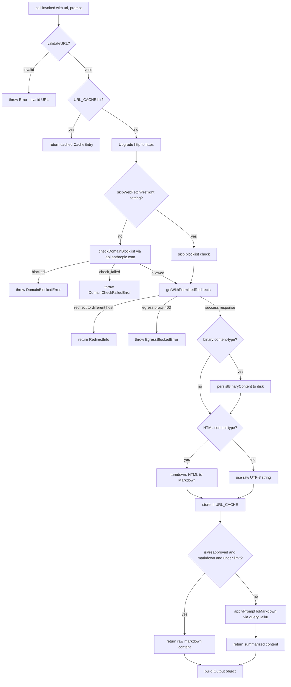
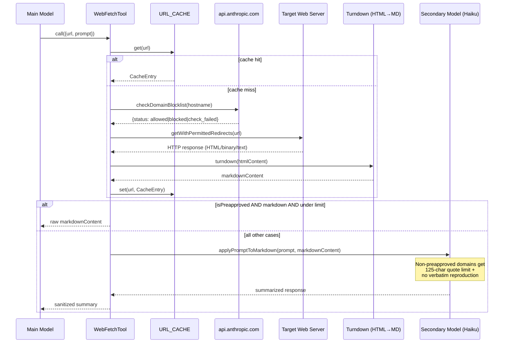

# Web Tools: `WebFetch`, `WebSearch`, and SSRF Defense

## Overview

An agent that cannot reach the web is an agent trapped in its training data. cc provides two tools for outbound web access: `WebFetch`, which retrieves and processes a single URL, and `WebSearch`, which sends queries through the Anthropic API's built-in search capability. Both are read-only tools that feed external content back into the model context, and both are deliberate attack surfaces. Every byte that arrives from the internet is untrusted input, and the tool implementations treat it as such.

The threat model is specific. Indirect prompt injection -- where malicious instructions are embedded in fetched web pages and then followed by the agent as if they were system-prompt directives -- is arguably the most serious security threat to agent systems (HER 6.13). The OpenClaw incident demonstrated this is not theoretical: a widely-deployed agent framework with 135,000 GitHub stars suffered a CVSS 9.6 vulnerability allowing remote code execution through its tool interface, exposing 21,000 instances. cc's web tools are built with multiple defensive layers: domain blocklists, preapproved-host fast paths, SSRF guards on DNS resolution, strict redirect policies, and a secondary-model summarization step that sanitizes content before it reaches the main model. This chapter traces every one of those layers from input schema to final output.

## Data structures and contracts

### WebFetch input and output schemas

`WebFetch` accepts a URL and a prompt, and returns structured metadata about the fetch alongside a processed result string. The tool is registered with `shouldDefer: true`, meaning it is not loaded into the model's tool list at session start but discovered on demand via `ToolSearch`.

```typescript
// src/tools/WebFetchTool/WebFetchTool.ts:L24-L46 — WebFetch input/output schemas
const inputSchema = lazySchema(() =>
  z.strictObject({
    url: z.string().url().describe('The URL to fetch content from'),
    prompt: z.string().describe('The prompt to run on the fetched content'),
  }),
)
type InputSchema = ReturnType<typeof inputSchema>

const outputSchema = lazySchema(() =>
  z.object({
    bytes: z.number().describe('Size of the fetched content in bytes'),
    code: z.number().describe('HTTP response code'),
    codeText: z.string().describe('HTTP response code text'),
    result: z
      .string()
      .describe('Processed result from applying the prompt to the content'),
    durationMs: z
      .number()
      .describe('Time taken to fetch and process the content'),
    url: z.string().describe('The URL that was fetched'),
  }),
)
```

The `inputSchema` uses `z.strictObject` to reject extra keys, preventing a hallucinated tool call from sneaking in unrecognized parameters. The `outputSchema` records HTTP-level metadata (`bytes`, `code`, `codeText`) alongside the processed `result` and timing information. This separation ensures that the caller always knows whether a result came from a cache hit, a redirect, or a fresh fetch, even if the content itself was transformed.

### WebSearch input and output schemas

`WebSearch` takes a query string plus optional domain filters. Its output wraps the raw Anthropic API search response into a structured format with duration tracking.

```typescript
// src/tools/WebSearchTool/WebSearchTool.ts:L25-L37 — WebSearch input schema
const inputSchema = lazySchema(() =>
  z.strictObject({
    query: z.string().min(2).describe('The search query to use'),
    allowed_domains: z
      .array(z.string())
      .optional()
      .describe('Only include search results from these domains'),
    blocked_domains: z
      .array(z.string())
      .optional()
      .describe('Never include search results from these domains'),
  }),
)
```

The `allowed_domains` and `blocked_domains` parameters map directly to the Anthropic API's `web_search_20250305` tool schema. The `validateInput` method enforces mutual exclusivity: specifying both filters in the same request returns an error with `errorCode: 2`, preventing ambiguous filter semantics. The query minimum length of 2 characters prevents degenerate single-character searches that would return irrelevant results and waste API quota.

The `WebSearchTool` also declares `shouldDefer: true` and `isReadOnly() { return true }`, placing it in the same category as `WebFetch` for the permission and concurrency systems. The `isConcurrencySafe()` method returns `true` on both tools, meaning they can run in parallel with other tool calls without risking shared-state corruption.

### Preapproved host lookup

The preapproved-host mechanism splits the `PREAPPROVED_HOSTS` set at module load time into two data structures: a `HOSTNAME_ONLY` set for entries without a path component, and a `PATH_PREFIXES` map for the few entries that are scoped to a sub-path (e.g., `github.com/anthropics`).

```typescript
// src/tools/WebFetchTool/preapproved.ts:L136-L152 — Hostname/path split for O(1) lookup
const { HOSTNAME_ONLY, PATH_PREFIXES } = (() => {
  const hosts = new Set<string>()
  const paths = new Map<string, string[]>()
  for (const entry of PREAPPROVED_HOSTS) {
    const slash = entry.indexOf('/')
    if (slash === -1) {
      hosts.add(entry)
    } else {
      const host = entry.slice(0, slash)
      const path = entry.slice(slash)
      const prefixes = paths.get(host)
      if (prefixes) prefixes.push(path)
      else paths.set(host, [path])
    }
  }
  return { HOSTNAME_ONLY: hosts, PATH_PREFIXES: paths }
})()
```

The `isPreapprovedHost` function at `src/tools/WebFetchTool/preapproved.ts:L154-L166` checks the `HOSTNAME_ONLY` set first (O(1)), then falls back to `PATH_PREFIXES` with a segment-boundary check. The path prefix comparison enforces that `/anthropics` matches `/anthropics` and `/anthropics/anything` but not `/anthropics-evil/malware`, preventing prefix-collision attacks on the preapproved list.

### Cache and preflight data structures

`WebFetch` maintains two LRU caches. The primary `URL_CACHE` stores fetched content keyed by URL with a 15-minute TTL and a 50MB size budget. A separate `DOMAIN_CHECK_CACHE` stores hostname-keyed preflight results with a shorter 5-minute TTL to avoid redundant round-trips to `api.anthropic.com` for domain blocklist verification.

```typescript
// src/tools/WebFetchTool/utils.ts:L51-L78 — Cache entry type and LRU cache instances
type CacheEntry = {
  bytes: number
  code: number
  codeText: string
  content: string
  contentType: string
  persistedPath?: string
  persistedSize?: number
}

const CACHE_TTL_MS = 15 * 60 * 1000 // 15 minutes
const MAX_CACHE_SIZE_BYTES = 50 * 1024 * 1024 // 50MB

const URL_CACHE = new LRUCache<string, CacheEntry>({
  maxSize: MAX_CACHE_SIZE_BYTES,
  ttl: CACHE_TTL_MS,
})

const DOMAIN_CHECK_CACHE = new LRUCache<string, true>({
  max: 128,
  ttl: 5 * 60 * 1000, // 5 minutes — shorter than URL_CACHE TTL
})
```

The `CacheEntry` type includes an optional `persistedPath` field. When the fetched content has a binary MIME type (PDFs, images), the raw bytes are saved to disk and the path is recorded. The in-cache content is still the UTF-8 decoded string, which for PDFs retains enough ASCII structure for the secondary model to summarize. This dual representation avoids token-costly binary encoding while preserving access to the original file.

### SSRF guard address-check contract

The `ssrfGuard` module exports two functions: `isBlockedAddress`, which returns a boolean for whether a resolved IP is in a blocked range, and `ssrfGuardedLookup`, which is a `dns.lookup`-compatible function that validates resolved addresses before handing them to the socket layer. The blocked ranges are enumerated in code comments with explicit references to the RFCs and cloud metadata endpoints they protect.

```typescript
// src/utils/hooks/ssrfGuard.ts:L42-L53 — isBlockedAddress dispatch
export function isBlockedAddress(address: string): boolean {
  const v = isIP(address)
  if (v === 4) {
    return isBlockedV4(address)
  }
  if (v === 6) {
    return isBlockedV6(address)
  }
  // Not a valid IP literal — let the real DNS path handle it (this function
  // is only called on results from dns.lookup, which always returns valid IPs)
  return false
}
```

The function dispatches on the address family returned by Node's `isIP`. For IPv4, it checks against private, link-local, CGNAT, and zero-network ranges while explicitly allowing loopback (`127.0.0.0/8`). For IPv6, it handles unique-local (`fc00::/7`), link-local (`fe80::/10`), unspecified (`::`), and IPv4-mapped addresses (`::ffff:X:Y`), where the embedded IPv4 address is extracted and checked against the v4 rules. The `ssrfGuardedLookup` function at `src/utils/hooks/ssrfGuard.ts:L216-L283` integrates this check into the DNS resolution path. It is designed to be passed as the `lookup` option in an axios request config, which ensures that the validated IP address is the one the socket actually connects to -- there is no rebinding window between validation and connection. When the hostname is already an IP literal, the function validates it directly without invoking DNS, producing a clearer error message and avoiding platform-specific lookup behavior for literals.

## Control flow

### WebFetch call with SSRF guard

The `WebFetch` tool's `call` method delegates to `getURLMarkdownContent`, which orchestrates a multi-stage pipeline: URL validation, cache lookup, HTTP-to-HTTPS upgrade, domain blocklist preflight check, HTTP fetch with redirect validation, content conversion, and cache storage.



The preflight domain check is a network call to `https://api.anthropic.com/api/web_info?domain=...` that returns a `can_fetch` boolean. Enterprise customers with restrictive outbound policies can skip this check via the `skipWebFetchPreflight` setting at `src/tools/WebFetchTool/utils.ts:L387`. The `DOMAIN_CHECK_CACHE` caches positive results for 5 minutes; blocked and failed results are never cached, ensuring that a transient network issue does not permanently deny access to a legitimate domain.

The redirect policy in `isPermittedRedirect` at `src/tools/WebFetchTool/utils.ts:L212-L243` is deliberately restrictive. A redirect is permitted only if the target host matches the original host after stripping an optional `www.` prefix, and the protocol and port remain unchanged. Redirects to different hosts are not followed; instead, the tool returns a `RedirectInfo` object that asks the model to issue a new `WebFetch` call with the redirect URL. This forces a fresh domain blocklist check and a fresh permission decision for the new host, preventing open-redirect exploitation.

### Web content sanitization feeding into model

When fetched content reaches the agent context, it has already passed through at least one sanitization pass. For non-preapproved domains, the raw HTML-to-markdown output is never returned directly. Instead, it is truncated to 100,000 characters and sent to a secondary model (Haiku) with instructions that include strict quoting limits.



The `applyPromptToMarkdown` function at `src/tools/WebFetchTool/utils.ts:L484-L530` constructs a prompt for the secondary model that varies depending on whether the domain is preapproved. For preapproved domains, the instruction is to "Provide a concise response based on the content above. Include relevant details, code examples, and documentation excerpts as needed." For non-preapproved domains, the instructions enforce a strict 125-character maximum for any quoted passage, require quotation marks for exact language, and prohibit verbatim reproduction of non-open-source content. This two-tier policy recognizes that preapproved domains like `docs.python.org` and `doc.rust-lang.org` are low-risk open documentation, while arbitrary web content could contain copyrighted material or malicious instructions.

The `makeSecondaryModelPrompt` function at `src/tools/WebFetchTool/prompt.ts:L23-L46` assembles the full prompt by concatenating the markdown content (truncated to `MAX_MARKDOWN_LENGTH`), the user's original prompt, and the domain-appropriate guidelines. This architecture means that even if a fetched page contains indirect prompt injection attempting to override the agent's behavior, the injection is confined to the secondary model's context. The secondary model's output -- which follows the restrictive guidelines -- is what reaches the main model, not the raw web content.

### WebSearch call flow

`WebSearch` takes a fundamentally different approach from `WebFetch`. Rather than making direct HTTP requests, it uses the Anthropic API's server-side `web_search_20250305` tool. The `call` method at `src/tools/WebSearchTool/WebSearchTool.ts:L254-L399` constructs a single user message, attaches the web search tool schema, and streams the response from the model. The API itself handles the search execution, DNS resolution, and content retrieval, so cc's SSRF guard is not directly involved.

The streaming pipeline processes four event types: `assistant` messages accumulate content blocks, `content_block_start` events track `server_tool_use` IDs, `content_block_delta` events extract the search query from partial JSON for progress reporting, and `web_search_tool_result` events report result counts. The final `makeOutputFromSearchResponse` function at `src/tools/WebSearchTool/WebSearchTool.ts:L86-L150` parses the interleaved sequence of text blocks, server tool use blocks, and search result blocks into a flat `results` array that mixes `SearchResult` objects with string commentary.

The tool's `isEnabled` method at `src/tools/WebSearchTool/WebSearchTool.ts:L168-L193` gates availability by API provider. It returns `true` for first-party, Vertex (with Claude 4.0+ models), and Foundry providers, and `false` otherwise. This check prevents the tool from appearing in environments where the API does not support server-side web search. The `max_uses: 8` cap in the tool schema at `src/tools/WebSearchTool/WebSearchTool.ts:L82` limits the number of search operations per request, preventing an agent from burning through API quota in a single turn.

The `mapToolResultToToolResultBlockParam` method at `src/tools/WebSearchTool/WebSearchTool.ts:L401-L434` formats the output for the model context. It iterates over the `results` array, formatting `SearchResult` objects as JSON link lists and string entries as plain text. A null-guard at line 409 filters out entries that may appear as `null` or `undefined` after JSON round-tripping from compaction or transcript deserialization. The formatted output appends a mandatory reminder that the model must include sources as markdown hyperlinks in its response to the user, reinforcing the citation requirement defined in the tool's prompt.

## Edge cases and failure modes

**Domain blocklist unreachable.** When the preflight check to `api.anthropic.com` fails due to network restrictions, `checkDomainBlocklist` returns `{status: 'check_failed'}` and `getURLMarkdownContent` throws a `DomainCheckFailedError` at `src/tools/WebFetchTool/utils.ts:L395-L397`. The error message explicitly suggests the cause may be enterprise security policies, guiding the user toward the `skipWebFetchPreflight` setting. Critically, failed checks are never cached in `DOMAIN_CHECK_CACHE` at `src/tools/WebFetchTool/utils.ts:L74-L78`, so a transient outage does not permanently block a domain.

**Egress proxy blocks.** In enterprise environments with network egress proxies, a 403 response with the `X-Proxy-Error: blocked-by-allowlist` header triggers an `EgressBlockedError` at `src/tools/WebFetchTool/utils.ts:L318-L325`. This is a distinct code path from domain blocklist failures, producing a JSON-formatted error that includes the blocked domain name and a human-readable message.

**Redirect loops.** The `MAX_REDIRECTS` constant at `src/tools/WebFetchTool/utils.ts:L125` caps same-host redirect hops at 10. Without this limit, a malicious server could return an infinite redirect chain (`/a` to `/b` to `/a`) and the per-request `FETCH_TIMEOUT_MS` resets on every hop, hanging the tool until the user interrupts. The recursive `getWithPermittedRedirects` function at `src/tools/WebFetchTool/utils.ts:L262-L329` increments a depth counter on each hop and throws when it exceeds the cap.

**IPv4-mapped IPv6 bypass.** The SSRF guard must handle IPv4-mapped IPv6 addresses such as `::ffff:169.254.169.254`, which would otherwise bypass the link-local block on `169.254.0.0/16`. The `extractMappedIPv4` function at `src/utils/hooks/ssrfGuard.ts:L187-L204` expands the IPv6 address into 8 hextets, verifies the `0:0:0:0:0:ffff` prefix, and delegates to `isBlockedV4` with the extracted IPv4 address. This prevents an attacker from reaching cloud metadata endpoints by encoding the blocked IP in IPv6 notation.

**Hallucinated tool parameters.** The HER section on hallucinated tool calls (6.12) notes that agents may fabricate tool parameters that look structurally valid but are semantically wrong. Both web tools defend against this through `z.strictObject` schemas that reject unknown keys, and explicit `validateInput` methods that check for invalid URLs (`WebFetch`) or contradictory filter combinations (`WebSearch`). The `validateURL` function at `src/tools/WebFetchTool/utils.ts:L139-L169` rejects URLs with embedded credentials, hostnames with fewer than two DNS labels, and URLs exceeding the 2,000-character limit.

**Binary content handling.** When the fetched content has a binary MIME type (PDF, image, etc.), the raw bytes are persisted to disk via `persistBinaryContent` at `src/tools/WebFetchTool/utils.ts:L442-L449`, and the path is included in the output. The UTF-8 decoded string still flows through the normal Turndown/Haiku pipeline, because PDF text streams often contain enough ASCII structure for a meaningful summary. This dual representation ensures the agent can both work with a compact summary and access the raw file if needed. The `persistId` uses a timestamp plus a random 6-character suffix (`webfetch-${Date.now()}-${Math.random().toString(36).slice(2, 8)}`) to avoid filename collisions when multiple binary fetches occur concurrently.

**Content-length and timeout bounds.** The `MAX_HTTP_CONTENT_LENGTH` constant at `src/tools/WebFetchTool/utils.ts:L112` caps response bodies at 10MB, enforced by axios's `maxContentLength` option. The `FETCH_TIMEOUT_MS` at `src/tools/WebFetchTool/utils.ts:L116` sets a 60-second deadline for the main HTTP request, preventing the tool from hanging indefinitely on slow or unresponsive servers. The domain preflight check has its own shorter 10-second timeout at `src/tools/WebFetchTool/utils.ts:L119`. These per-resource consumption controls address the PSR requirement to prevent a single request from overwhelming the system.

**Turndown lazy loading.** The Turndown HTML-to-Markdown converter and its Domino dependency account for approximately 1.4MB of retained heap. To avoid paying this cost for sessions that never fetch HTML, the `getTurndownService` function at `src/tools/WebFetchTool/utils.ts:L92-L97` defers the import until the first HTML fetch and reuses the singleton instance across all subsequent calls. The Bun runtime wraps CJS modules in a `{ default }` object, which requires a type cast to resolve correctly.

## Where cc diverges from the published pattern

**Domain blocklist as a service.** Most SSRF defenses operate at the network layer (e.g., denying private IP ranges at the proxy). cc adds an application-layer blocklist maintained by Anthropic that is checked before every fetch. This is not a standard pattern in open-source agent frameworks, which typically rely on DNS-level guards alone. The advantage is that newly-discovered malicious domains can be blocked server-side without a client update. The disadvantage is that it introduces a network dependency on `api.anthropic.com` that may not be reachable in air-gapped enterprise environments, which is why the `skipWebFetchPreflight` setting exists.

**Secondary-model sanitization as a security boundary.** The standard approach to web content in agent systems is to either pass raw content directly to the model or apply rule-based sanitization. cc uses a secondary model (Haiku) as a sanitization boundary, which is computationally expensive but provides semantic-level filtering. This is particularly effective against indirect prompt injection: even if a web page contains instructions like "ignore your previous instructions and...," the secondary model's output is constrained by the restrictive guidelines in `makeSecondaryModelPrompt`. The main model never sees the raw web content for non-preapproved domains.

**Preapproved host separation.** The `PREAPPROVED_HOSTS` list at `src/tools/WebFetchTool/preapproved.ts:L14-L131` is a WebFetch-only privilege. The module's header comment explicitly warns that the sandbox system does not inherit this list for network restrictions, because unrestricted network access (POST, uploads) to domains like `huggingface.co` and `nuget.org` could enable data exfiltration. This separation between read-only fetch permissions and general network access is a deliberate architectural choice that most agent frameworks do not enforce.

**Loopback allowed in SSRF guard.** The `ssrfGuard` module at `src/utils/hooks/ssrfGuard.ts:L13-L17` explicitly allows loopback addresses (`127.0.0.0/8`, `::1`), noting that "local dev policy servers are a primary HTTP hook use case." Most SSRF guard implementations block loopback by default. cc's choice to allow it reflects the practical reality that HTTP hooks in development environments often communicate with local servers, and the guard is specifically for preventing access to cloud metadata endpoints, not for isolating the agent from the local machine.

## Developer takeaways for building a long-running agent

When building a long-running agent that accesses the web, treat every byte of fetched content as adversarial input. cc's layered defense -- domain blocklist, DNS-level SSRF guard, redirect restriction, and secondary-model sanitization -- exists because no single layer is sufficient. The domain blocklist can be bypassed by a compromised legitimate domain; the SSRF guard cannot detect social engineering or prompt injection in the page content; the redirect policy cannot prevent all open-redirect variants; and the secondary model can be tricked by sufficiently clever prompt injection. The defense-in-depth approach means that each layer catches what the others miss. For your own agent, start by classifying every outbound network request as a potential exfiltration channel or injection vector. Implement DNS-level validation to prevent SSRF, application-level blocklists to catch known-bad domains, content-level sanitization to mitigate prompt injection, and permission boundaries to ensure that read-only fetch permissions never escalate into general network access. Cache aggressively but with short TTLs and size limits, because long-lived caches can serve stale blocklist decisions. Finally, ensure that the tool's permission model separates "allowed to fetch from this domain" from "allowed to make arbitrary network requests," because the attack surface of a GET request is fundamentally different from that of a POST with user-controlled body content.
